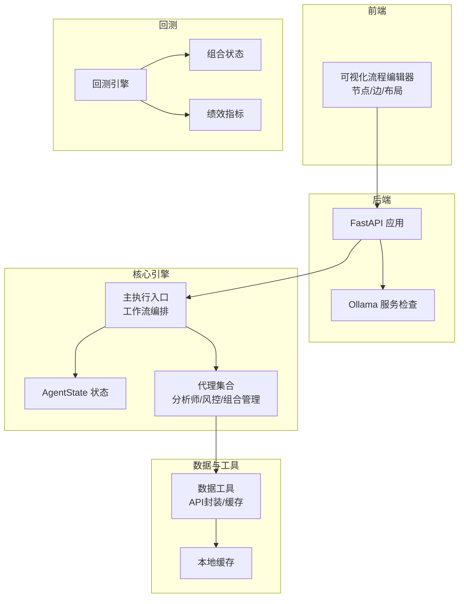
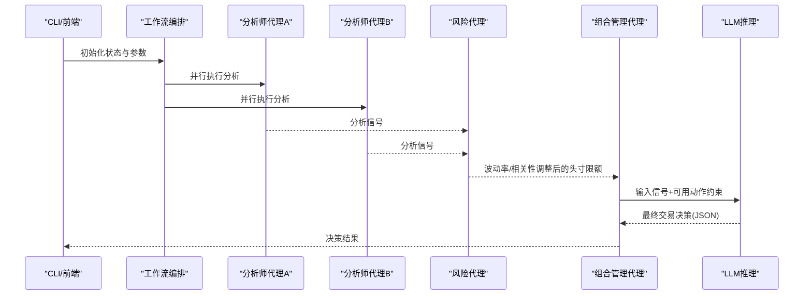
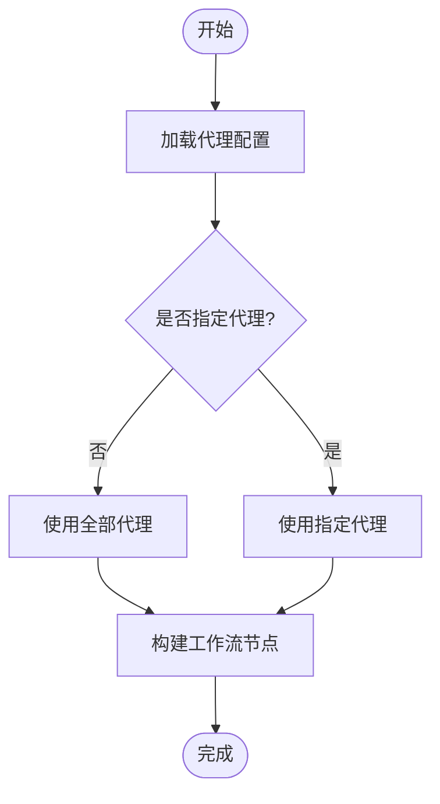
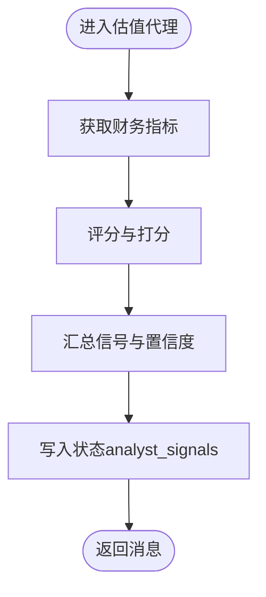
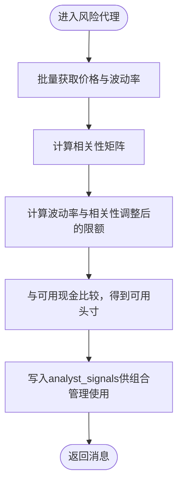
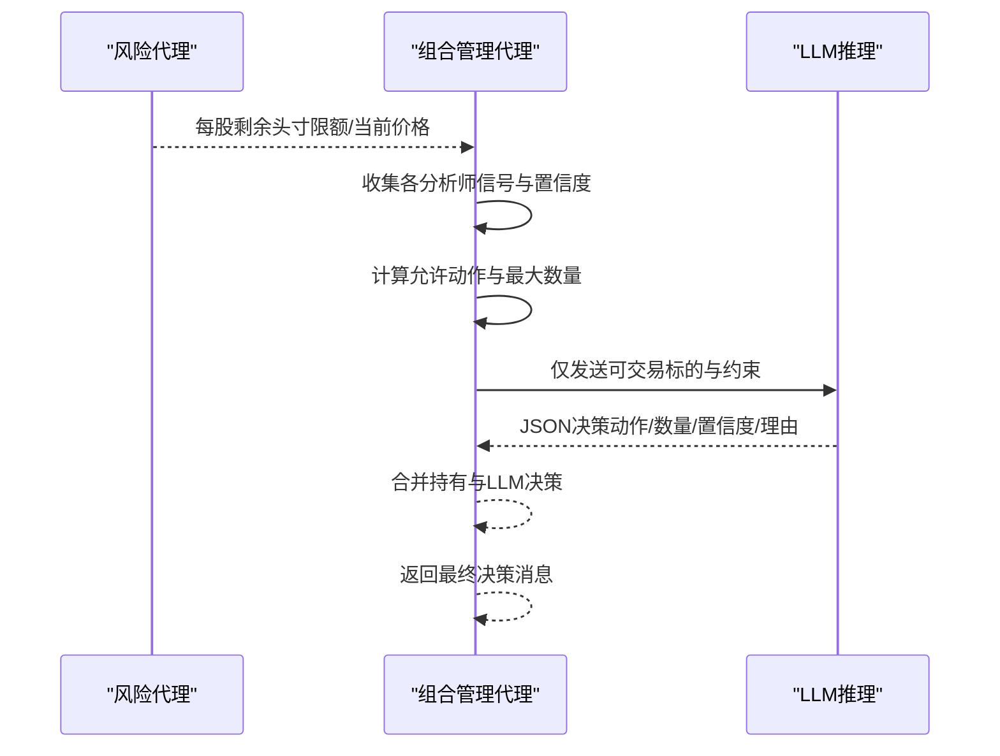
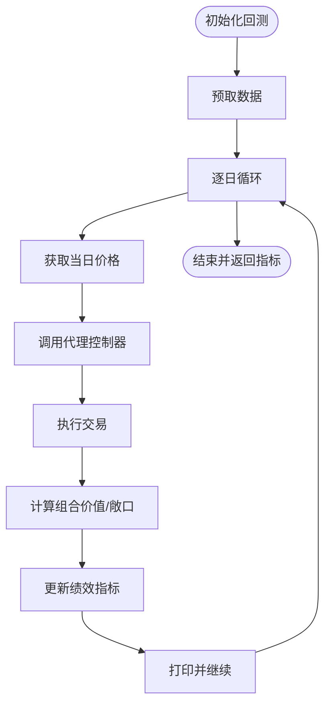
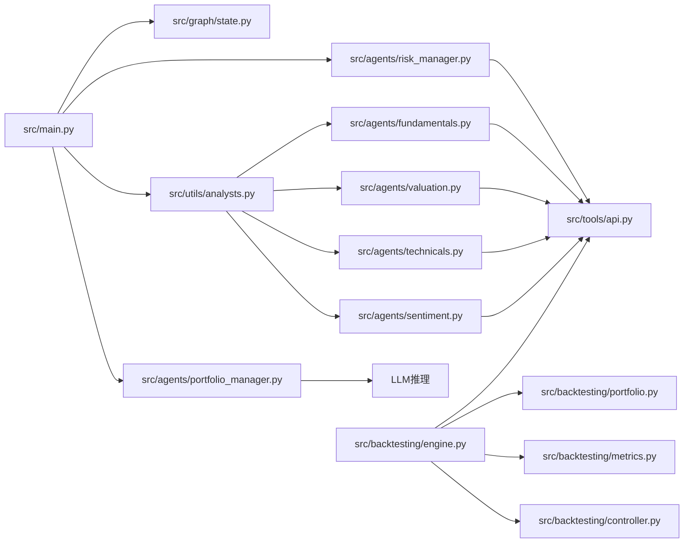

# AI代理系统

<cite>
**本文引用的文件**
- [src/main.py](file://src/main.py)
- [src/graph/state.py](file://src/graph/state.py)
- [src/utils/analysts.py](file://src/utils/analysts.py)
- [src/agents/fundamentals.py](file://src/agents/fundamentals.py)
- [src/agents/valuation.py](file://src/agents/valuation.py)
- [src/agents/technicals.py](file://src/agents/technicals.py)
- [src/agents/sentiment.py](file://src/agents/sentiment.py)
- [src/agents/risk_manager.py](file://src/agents/risk_manager.py)
- [src/agents/portfolio_manager.py](file://src/agents/portfolio_manager.py)
- [src/backtesting/engine.py](file://src/backtesting/engine.py)
- [src/backtesting/controller.py](file://src/backtesting/controller.py)
- [src/backtesting/portfolio.py](file://src/backtesting/portfolio.py)
- [src/backtesting/metrics.py](file://src/backtesting/metrics.py)
- [src/tools/api.py](file://src/tools/api.py)
- [app/backend/main.py](file://app/backend/main.py)
</cite>

## 目录
1. [简介](#简介)
2. [项目结构](#项目结构)
3. [核心组件](#核心组件)
4. [架构总览](#架构总览)
5. [详细组件分析](#详细组件分析)
6. [依赖关系分析](#依赖关系分析)
7. [性能考虑](#性能考虑)
8. [故障排查指南](#故障排查指南)
9. [结论](#结论)
10. [附录](#附录)

## 简介
本文件为“AI代理系统”的综合技术文档，聚焦于20位专业投资理念代理的设计与实现，覆盖代理架构模式、协作机制与决策流程；详述Aswath Damodaran价值评估、Ben Graham价值投资、Bill Ackman激进投资等代理的专业特点；阐明代理状态管理、消息传递机制与工作流编排；提供代理扩展指南、配置管理与性能优化建议，并解释风险管理与组合优化在系统中的作用。

## 项目结构
系统采用“LangGraph状态图”驱动的多代理协作框架，前端通过可视化流程编辑器构建交易工作流，后端提供API与Ollama集成，数据层通过工具模块统一访问外部金融数据源，回测引擎负责离线策略验证与指标计算。

图表来源
- [src/main.py:100-130](file://src/main.py#L100-L130)
- [src/graph/state.py:15-18](file://src/graph/state.py#L15-L18)
- [src/utils/analysts.py:24-186](file://src/utils/analysts.py#L24-L186)
- [src/tools/api.py:63-96](file://src/tools/api.py#L63-L96)
- [app/backend/main.py:15-56](file://app/backend/main.py#L15-L56)

章节来源
- [src/main.py:100-130](file://src/main.py#L100-L130)
- [src/graph/state.py:15-18](file://src/graph/state.py#L15-L18)
- [src/utils/analysts.py:24-186](file://src/utils/analysts.py#L24-L186)
- [app/backend/main.py:15-56](file://app/backend/main.py#L15-L56)

## 核心组件
- 工作流与状态
  - 使用LangGraph定义状态图，节点为代理函数，边为控制流。状态包含消息序列、数据字典与元数据。
  - 状态合并策略用于聚合多个代理输出，保证一致性与可扩展性。
- 代理注册与选择
  - 统一配置中心集中管理20位代理的显示名、描述、理念、顺序与函数映射，支持按需选择运行。
- 数据与工具
  - 统一封装外部金融数据API（价格、财务指标、新闻、内幕交易），内置缓存与重试逻辑，降低外部依赖波动影响。
- 回测与度量
  - 回测引擎驱动每日循环，拉取数据、调用代理、执行交易、计算组合价值与风险敞口，并产出绩效指标。

章节来源
- [src/graph/state.py:15-18](file://src/graph/state.py#L15-L18)
- [src/utils/analysts.py:24-186](file://src/utils/analysts.py#L24-L186)
- [src/tools/api.py:29-61](file://src/tools/api.py#L29-L61)
- [src/backtesting/engine.py:27-94](file://src/backtesting/engine.py#L27-L94)

## 架构总览
系统采用“状态驱动的多代理协作”模式：主入口创建工作流，按配置添加分析师节点，最终汇聚到风险管理和组合管理节点，由LLM生成最终交易指令。回测模块以相同接口驱动离线验证。

图表来源
- [src/main.py:100-130](file://src/main.py#L100-L130)
- [src/agents/risk_manager.py:11-219](file://src/agents/risk_manager.py#L11-L219)
- [src/agents/portfolio_manager.py:25-93](file://src/agents/portfolio_manager.py#L25-L93)

章节来源
- [src/main.py:46-93](file://src/main.py#L46-L93)
- [src/agents/risk_manager.py:11-219](file://src/agents/risk_manager.py#L11-L219)
- [src/agents/portfolio_manager.py:25-93](file://src/agents/portfolio_manager.py#L25-L93)

## 详细组件分析

### 代理配置与选择（Analyst配置中心）
- 集中式配置：定义20位代理的显示名、描述、理念、类型、顺序与函数映射。
- 运行时选择：未指定时默认启用全部代理；支持按名称列表选择特定代理。
- 顺序控制：基于“order”字段确保分析信号在风控前汇聚。

图表来源
- [src/utils/analysts.py:24-186](file://src/utils/analysts.py#L24-L186)
- [src/main.py:100-130](file://src/main.py#L100-L130)

章节来源
- [src/utils/analysts.py:24-186](file://src/utils/analysts.py#L24-L186)
- [src/main.py:100-130](file://src/main.py#L100-L130)

### 价值评估代理（Aswath Damodaran风格）
- 专业特点：强调内在价值与财务指标，通过严谨估值分析识别被低估资产。
- 实现要点：整合多维度财务指标与估值比率，形成综合信号与置信度；输出结构化理由便于回溯与解释。

图表来源
- [src/agents/valuation.py:21-220](file://src/agents/valuation.py#L21-L220)

章节来源
- [src/agents/valuation.py:21-220](file://src/agents/valuation.py#L21-L220)

### 价值投资代理（Ben Graham风格）
- 专业特点：强调安全边际与基本面稳健公司，通过系统化价值分析寻找低估标的。
- 实现要点：结合盈利能力、增长趋势、财务健康与估值比率，给出多因子综合判断。

章节来源
- [src/agents/fundamentals.py:11-164](file://src/agents/fundamentals.py#L11-L164)

### 激进投资代理（Bill Ackman风格）
- 专业特点：通过积极股东行动与对冲策略影响管理层，追求价值重估与市场分歧修复。
- 实现要点：结合新闻情绪与内幕交易信号，评估市场分歧与管理层行为，指导做多/做空决策。

章节来源
- [src/agents/sentiment.py:12-139](file://src/agents/sentiment.py#L12-L139)

### 技术分析代理
- 专业特点：利用趋势跟踪、均值回归、动量、波动率与统计套利等多策略加权融合。
- 实现要点：多时间框架EMA、ADX、RSI、布林带、ATR、赫斯特指数等指标，形成统一信号与置信度。

章节来源
- [src/agents/technicals.py:35-157](file://src/agents/technicals.py#L35-L157)

### 基础面分析代理
- 专业特点：深入财务报表与经济指标，评估公司内在价值。
- 实现要点：ROE、利润率、流动性、杠杆、FCF等指标评分，输出综合信号与细节说明。

章节来源
- [src/agents/fundamentals.py:11-164](file://src/agents/fundamentals.py#L11-L164)

### 新闻情绪代理
- 专业特点：从公司新闻中提取情绪，辅助判断短期市场波动。
- 实现要点：加权组合“内幕交易+新闻情绪”，输出加权信号与置信度。

章节来源
- [src/agents/sentiment.py:12-139](file://src/agents/sentiment.py#L12-L139)

### 其他专业理念代理（概览）
- Charlie Munger：理性思维与多元思维模型。
- Michael Burry：深度分析与逆向做空。
- Mohnish Pabrai：价值投资与安全边际。
- Nassim Taleb：黑天鹅风险与反脆弱。
- Peter Lynch：成长投资与“你所了解的企业”。
- Phil Fisher：长期持有与管理层质量。
- Rakesh Jhunjhunwala：宏观视角与新兴市场。
- Stanley Druckenmiller：宏观趋势与大类资产轮动。
- Warren Buffett：护城河与长期持有。
- Growth Analyst：增长趋势与估值匹配。
- Technical Analyst：图表形态与趋势分析。
- Valuation Analyst：公司估值与公平价判断。

章节来源
- [src/utils/analysts.py:24-178](file://src/utils/analysts.py#L24-L178)

### 风险管理代理
- 专业特点：基于波动率与相关性进行动态头寸限额计算，避免过度集中与尾部风险。
- 实现要点：计算日/年化波动率、历史分位、相关矩阵，结合组合当前头寸与可用资金，输出每只股票的剩余头寸限额与理由。

图表来源
- [src/agents/risk_manager.py:11-219](file://src/agents/risk_manager.py#L11-L219)

章节来源
- [src/agents/risk_manager.py:11-219](file://src/agents/risk_manager.py#L11-L219)

### 组合管理代理
- 专业特点：在风险代理提供的限额与可用现金约束下，综合所有分析师信号，由LLM生成最终交易决策。
- 实现要点：预填充无法交易的标的（仅持有），仅将可交易标的发送给LLM；最小化提示词，严格JSON输出；失败时回退为持有。

图表来源
- [src/agents/portfolio_manager.py:25-93](file://src/agents/portfolio_manager.py#L25-L93)
- [src/agents/risk_manager.py:11-219](file://src/agents/risk_manager.py#L11-L219)

章节来源
- [src/agents/portfolio_manager.py:25-93](file://src/agents/portfolio_manager.py#L25-L93)

### 数据工具与缓存
- 统一API封装：价格、财务指标、新闻、内幕交易、市值等，支持分页与缓存。
- 缓存策略：基于参数组合的精确键值缓存，减少重复请求与限流压力。
- 错误处理：统一429重试与异常降级，保障稳定性。

章节来源
- [src/tools/api.py:29-61](file://src/tools/api.py#L29-L61)
- [src/tools/api.py:63-96](file://src/tools/api.py#L63-L96)
- [src/tools/api.py:99-138](file://src/tools/api.py#L99-L138)
- [src/tools/api.py:183-246](file://src/tools/api.py#L183-L246)
- [src/tools/api.py:249-312](file://src/tools/api.py#L249-L312)
- [src/tools/api.py:315-348](file://src/tools/api.py#L315-L348)

### 回测引擎与度量
- 回测循环：逐日拉取所需数据，调用代理控制器标准化输出，执行交易，计算组合价值与风险敞口。
- 组合状态：支持多标的长/短仓、成本基础、已实现损益与保证金占用。
- 绩效指标：夏普/索提诺比率、最大回撤及其日期。

图表来源
- [src/backtesting/engine.py:96-194](file://src/backtesting/engine.py#L96-L194)
- [src/backtesting/controller.py:12-65](file://src/backtesting/controller.py#L12-L65)
- [src/backtesting/portfolio.py:9-196](file://src/backtesting/portfolio.py#L9-L196)
- [src/backtesting/metrics.py:22-75](file://src/backtesting/metrics.py#L22-L75)

章节来源
- [src/backtesting/engine.py:96-194](file://src/backtesting/engine.py#L96-L194)
- [src/backtesting/controller.py:12-65](file://src/backtesting/controller.py#L12-L65)
- [src/backtesting/portfolio.py:9-196](file://src/backtesting/portfolio.py#L9-L196)
- [src/backtesting/metrics.py:22-75](file://src/backtesting/metrics.py#L22-L75)

## 依赖关系分析

图表来源
- [src/main.py:100-130](file://src/main.py#L100-L130)
- [src/utils/analysts.py:24-186](file://src/utils/analysts.py#L24-L186)
- [src/agents/portfolio_manager.py:25-93](file://src/agents/portfolio_manager.py#L25-L93)
- [src/agents/risk_manager.py:11-219](file://src/agents/risk_manager.py#L11-L219)
- [src/backtesting/engine.py:27-94](file://src/backtesting/engine.py#L27-L94)

章节来源
- [src/main.py:100-130](file://src/main.py#L100-L130)
- [src/utils/analysts.py:24-186](file://src/utils/analysts.py#L24-L186)
- [src/agents/portfolio_manager.py:25-93](file://src/agents/portfolio_manager.py#L25-L93)
- [src/agents/risk_manager.py:11-219](file://src/agents/risk_manager.py#L11-L219)
- [src/backtesting/engine.py:27-94](file://src/backtesting/engine.py#L27-L94)

## 性能考虑
- 并行化与批量化
  - 分析师代理按股票并行执行，减少整体延迟。
  - 批量获取价格与财务数据，降低API调用次数。
- 缓存与重试
  - 基于参数组合的精确缓存键，避免重复请求；统一429重试与退避策略。
- LLM调用优化
  - 仅向LLM发送可交易标的与最小必要上下文，预填充不可交易标的为持有，减少令牌消耗与推理复杂度。
- 回测效率
  - 预取一年内数据，逐日循环；在可用性不足时跳过当日，保持连续性与鲁棒性。

章节来源
- [src/utils/analysts.py:24-186](file://src/utils/analysts.py#L24-L186)
- [src/tools/api.py:29-61](file://src/tools/api.py#L29-L61)
- [src/agents/portfolio_manager.py:177-262](file://src/agents/portfolio_manager.py#L177-L262)
- [src/backtesting/engine.py:81-130](file://src/backtesting/engine.py#L81-L130)

## 故障排查指南
- API限流与错误
  - 现象：429限流或解析失败。
  - 处理：检查环境变量与密钥；确认缓存命中；查看重试日志；必要时降低并发或增加等待。
- 代理输出为空
  - 现象：某代理未产生信号。
  - 处理：确认数据获取成功；检查指标缺失与阈值设置；开启推理展示定位问题。
- LLM输出格式异常
  - 现象：JSON解析失败或字段缺失。
  - 处理：检查提示词最小化与约束；启用默认回退为持有；核对输出模式。
- 回测中断
  - 现象：某交易日无价格数据导致跳过。
  - 处理：确认日期范围与节假日；检查数据源可用性；观察回测进度与跳过原因。

章节来源
- [src/tools/api.py:29-61](file://src/tools/api.py#L29-L61)
- [src/agents/portfolio_manager.py:251-257](file://src/agents/portfolio_manager.py#L251-L257)
- [src/backtesting/engine.py:114-130](file://src/backtesting/engine.py#L114-L130)

## 结论
该系统以“状态驱动的多代理协作”为核心，通过统一配置中心灵活组织20位专业理念代理，结合波动率与相关性风控与LLM组合优化，形成从分析到执行的一体化闭环。回测模块提供离线验证与指标体系，支撑策略迭代与风险控制。建议在扩展新代理时遵循统一接口与状态写入规范，充分利用缓存与并行化提升性能，并持续完善风险与组合优化策略。

## 附录

### 代理扩展指南
- 新增步骤
  - 在配置中心注册新代理：提供显示名、描述、理念、顺序与代理函数映射。
  - 实现代理函数：接收状态，读取数据，计算信号与置信度，写入状态analyst_signals。
  - 在工作流中自动接入：无需修改编排代码，即可参与风控与组合管理。
- 接口约定
  - 函数签名：接受AgentState，返回包含messages与data的字典。
  - 输出格式：JSON字符串；理由结构化以便展示与审计。
  - 状态写入：将分析结果写入state["data"]["analyst_signals"][agent_id]。

章节来源
- [src/utils/analysts.py:24-186](file://src/utils/analysts.py#L24-L186)
- [src/graph/state.py:15-18](file://src/graph/state.py#L15-L18)

### 配置管理与部署
- 环境变量
  - FINANCIAL_DATASETS_API_KEY：外部数据源密钥。
  - Ollama集成：后端启动时检测Ollama状态与可用模型。
- CORS与路由
  - 前端默认地址允许跨域访问；包含健康检查与存储等路由。
- 容器化
  - 提供Dockerfile与compose文件，便于本地与生产部署。

章节来源
- [app/backend/main.py:15-56](file://app/backend/main.py#L15-L56)

### 风险管理与组合优化要点
- 动态头寸限额
  - 基于年化波动率与相关性调整，结合当前头寸与可用现金，计算剩余可用头寸。
- 组合优化
  - 在LLM层面以“信号+约束”为输入，最大化收益同时满足风险与流动性约束。
- 回测验证
  - 通过夏普/索提诺与最大回撤等指标评估策略稳定性与风险收益比。

章节来源
- [src/agents/risk_manager.py:106-219](file://src/agents/risk_manager.py#L106-L219)
- [src/agents/portfolio_manager.py:177-262](file://src/agents/portfolio_manager.py#L177-L262)
- [src/backtesting/metrics.py:22-75](file://src/backtesting/metrics.py#L22-L75)