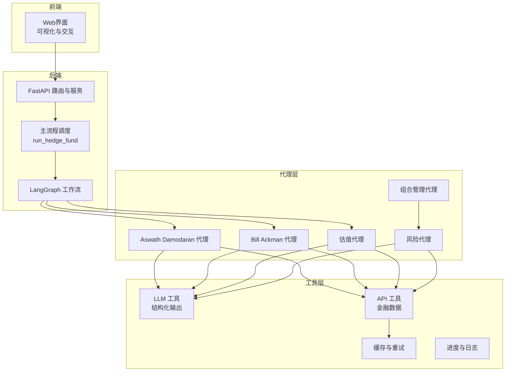
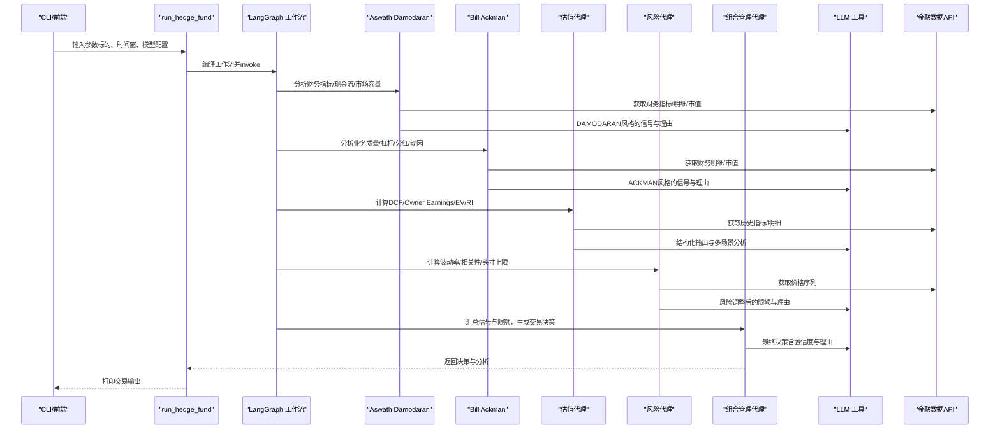
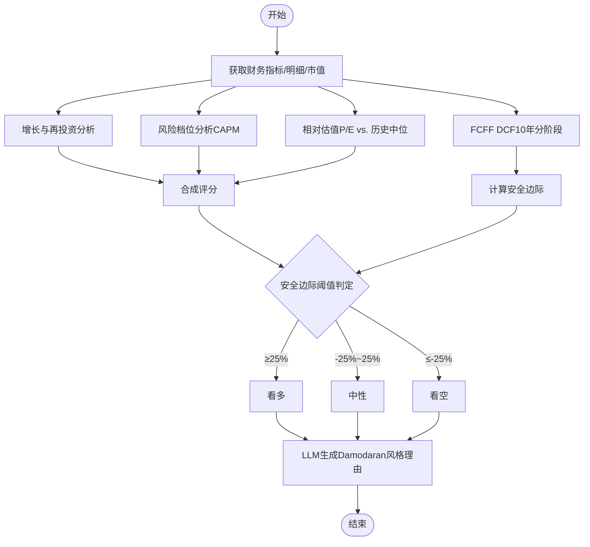
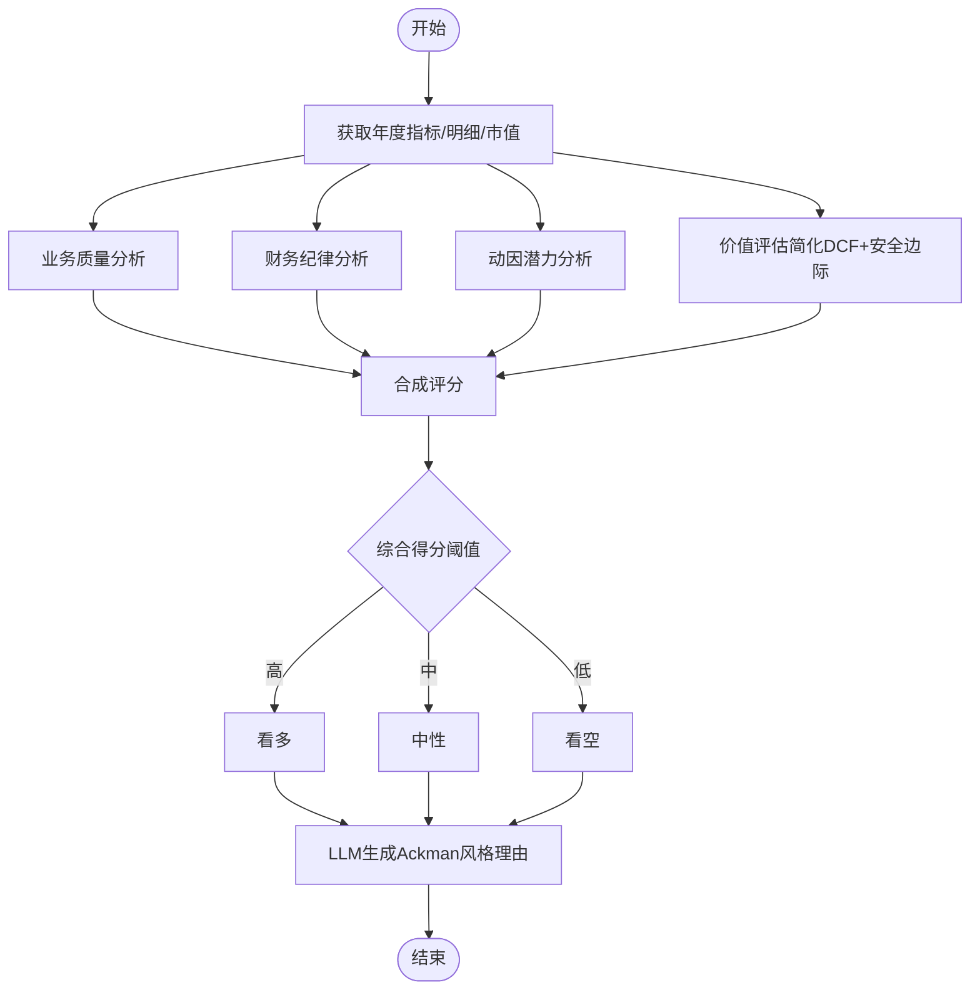
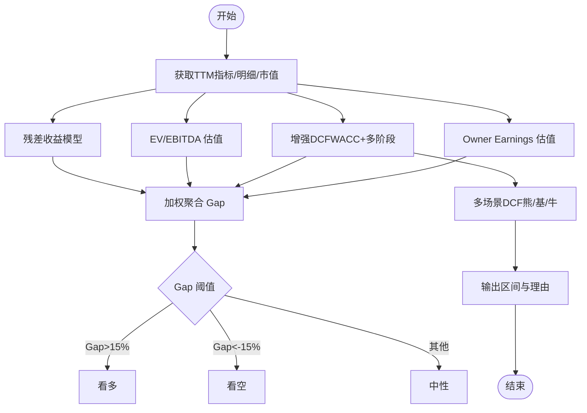
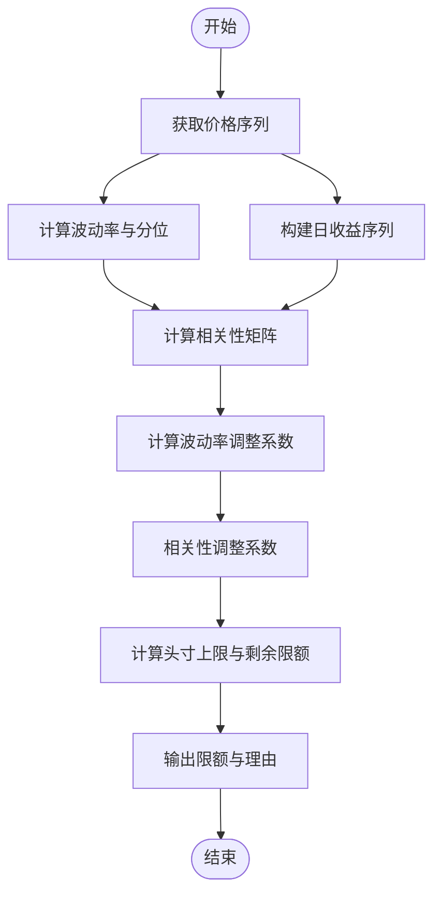
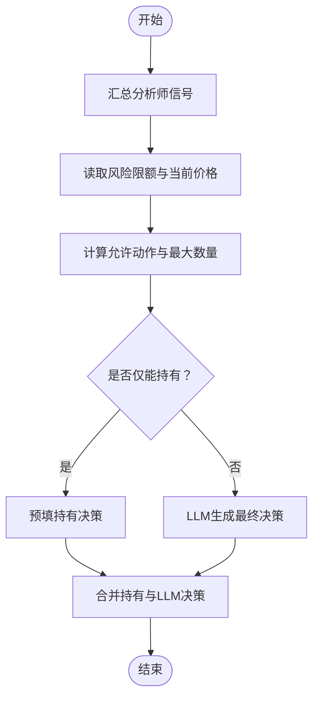
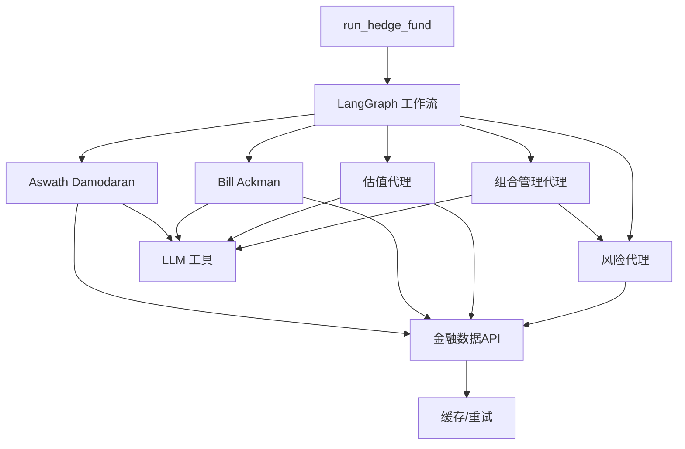

# 专业分析师代理

<cite>
**本文引用的文件**
- [src/agents/aswath_damodaran.py](file://src/agents/aswath_damodaran.py)
- [src/agents/bill_ackman.py](file://src/agents/bill_ackman.py)
- [src/agents/valuation.py](file://src/agents/valuation.py)
- [src/agents/portfolio_manager.py](file://src/agents/portfolio_manager.py)
- [src/agents/risk_manager.py](file://src/agents/risk_manager.py)
- [src/graph/state.py](file://src/graph/state.py)
- [src/utils/llm.py](file://src/utils/llm.py)
- [src/tools/api.py](file://src/tools/api.py)
- [src/main.py](file://src/main.py)
- [src/backtester.py](file://src/backtester.py)
- [README.md](file://README.md)
</cite>

## 目录
1. [简介](#简介)
2. [项目结构](#项目结构)
3. [核心组件](#核心组件)
4. [架构总览](#架构总览)
5. [详细组件分析](#详细组件分析)
6. [依赖关系分析](#依赖关系分析)
7. [性能考量](#性能考量)
8. [故障排查指南](#故障排查指南)
9. [结论](#结论)
10. [附录](#附录)

## 简介
本文件系统化梳理“专业分析师代理”在该AI对冲基金项目中的实现与应用，重点覆盖以下内容：
- 以Aswath Damodaran的估值体系为蓝本的DCF建模与相对估值交叉验证
- Bill Ackman的激进投资风格与“价值+动因”的综合分析框架
- 多元化估值方法（DCF、Owner Earnings、EV/EBITDA、残差收益模型）的集成与加权聚合
- 专业分析工具链：LLM结构化输出、金融数据API、缓存与进度管理
- 估值参数调整与敏感性分析（多场景DCF）
- 激进策略下的做空机制与风险管理（波动率与相关性调整）
- 报告生成、估值区间确定与投资建议输出
- 实证研究与回测支持

本项目强调“教育与研究用途”，不提供真实交易或投资建议。

**章节来源**
- [README.md: 1-158:1-158](file://README.md#L1-L158)

## 项目结构
该项目采用“多代理协作 + LangGraph状态机”的流水线式架构：
- 前端Web应用与后端API（FastAPI）负责可视化与请求编排
- 核心逻辑位于Python后端，通过LangGraph串联多个分析代理与风控代理
- 代理层包含专业分析师代理（如Aswath Damodaran、Bill Ackman）、通用估值代理、风险与组合管理代理
- 工具层封装外部金融数据API与缓存；LLM工具负责结构化输出与错误兜底

**图表来源**
- [src/main.py: 100-131:100-131](file://src/main.py#L100-L131)
- [src/agents/aswath_damodaran.py: 27-137:27-137](file://src/agents/aswath_damodaran.py#L27-L137)
- [src/agents/bill_ackman.py: 19-134:19-134](file://src/agents/bill_ackman.py#L19-L134)
- [src/agents/valuation.py: 21-220:21-220](file://src/agents/valuation.py#L21-L220)
- [src/agents/risk_manager.py: 11-219:11-219](file://src/agents/risk_manager.py#L11-L219)
- [src/agents/portfolio_manager.py: 25-93:25-93](file://src/agents/portfolio_manager.py#L25-L93)

**章节来源**
- [src/main.py: 100-131:100-131](file://src/main.py#L100-L131)
- [src/graph/state.py: 15-18:15-18](file://src/graph/state.py#L15-L18)

## 核心组件
- Aswath Damodaran 代理：基于FCFF DCF、增长与再投资效率、风险档位（CAPM）与相对估值（PE vs. 历史中位）的综合信号生成，并以Damodaran风格的叙事输出。
- Bill Ackman 代理：以“高质业务+财务纪律+品牌护城河+潜在动因”为核心，结合简化DCF与安全边际，输出激进风格的投资建议。
- 估值代理：集成DCF、Owner Earnings、EV/EBITDA、残差收益模型，按权重聚合并进行多场景敏感性分析（熊/牛/基情景）。
- 风险代理：基于波动率与相关性计算动态头寸上限，结合组合净值与保证金要求，给出每只股票的可用资金限额。
- 组合管理代理：汇总各分析师信号与风险限制，结合LLM进行最终交易决策（买入/卖出/做空/平仓/持有），并输出理由与置信度。

**章节来源**
- [src/agents/aswath_damodaran.py: 27-137:27-137](file://src/agents/aswath_damodaran.py#L27-L137)
- [src/agents/bill_ackman.py: 19-134:19-134](file://src/agents/bill_ackman.py#L19-L134)
- [src/agents/valuation.py: 21-220:21-220](file://src/agents/valuation.py#L21-L220)
- [src/agents/risk_manager.py: 11-219:11-219](file://src/agents/risk_manager.py#L11-L219)
- [src/agents/portfolio_manager.py: 25-93:25-93](file://src/agents/portfolio_manager.py#L25-L93)

## 架构总览
下图展示从输入到输出的关键调用链路与数据流：

**图表来源**
- [src/main.py: 46-93:46-93](file://src/main.py#L46-L93)
- [src/agents/aswath_damodaran.py: 27-137:27-137](file://src/agents/aswath_damodaran.py#L27-L137)
- [src/agents/bill_ackman.py: 19-134:19-134](file://src/agents/bill_ackman.py#L19-L134)
- [src/agents/valuation.py: 21-220:21-220](file://src/agents/valuation.py#L21-L220)
- [src/agents/risk_manager.py: 11-219:11-219](file://src/agents/risk_manager.py#L11-L219)
- [src/agents/portfolio_manager.py: 25-93:25-93](file://src/agents/portfolio_manager.py#L25-L93)
- [src/utils/llm.py: 10-84:10-84](file://src/utils/llm.py#L10-L84)
- [src/tools/api.py: 63-138:63-138](file://src/tools/api.py#L63-L138)

## 详细组件分析

### Aswath Damodaran 代理（DCF + 相对估值 + 安全边际）
- 数据获取：财务指标（TTM）、损益表/现金流量关键项、市值
- 分析维度：
  - 增长与再投资效率：5年营收CAGR、FCFF趋势、ROIC
  - 风险档位：CAPM估计股权成本（β、ERP）
  - 绝对估值：FCFF DCF（10年分阶段折现，终端按2.5%稳定增长）
  - 相对估值：TTM P/E与5年中位比较
- 信号规则：以内在价值与市值的安全边际（≥25%为看多，≤-25%为看空，否则中性）
- LLM输出：以Damodaran风格的“故事—数字—价值”三段论生成理由

**图表来源**
- [src/agents/aswath_damodaran.py: 143-347:143-347](file://src/agents/aswath_damodaran.py#L143-L347)
- [src/agents/aswath_damodaran.py: 361-420:361-420](file://src/agents/aswath_damodaran.py#L361-L420)

**章节来源**
- [src/agents/aswath_damodaran.py: 27-137:27-137](file://src/agents/aswath_damodaran.py#L27-L137)
- [src/agents/aswath_damodaran.py: 143-347:143-347](file://src/agents/aswath_damodaran.py#L143-L347)
- [src/agents/aswath_damodaran.py: 361-420:361-420](file://src/agents/aswath_damodaran.py#L361-L420)

### Bill Ackman 代理（高质业务 + 财务纪律 + 动因 + 价值）
- 数据获取：年度财务指标/明细、市值
- 分析维度：
  - 业务质量：多期营收增长、运营利润率、自由现金流稳定性、ROE
  - 财务纪律：债务比率趋势、分红与回购历史、股本变动
  - 动因潜力：营收增长但利润率偏低时的改善空间
  - 价值评估：简化FCF DCF与安全边际
- 信号规则：综合得分阈值决定看多/中性/看空
- LLM输出：强调品牌护城河、财务纪律、潜在催化剂与管理改进

**图表来源**
- [src/agents/bill_ackman.py: 32-134:32-134](file://src/agents/bill_ackman.py#L32-L134)
- [src/agents/bill_ackman.py: 137-396:137-396](file://src/agents/bill_ackman.py#L137-L396)
- [src/agents/bill_ackman.py: 399-469:399-469](file://src/agents/bill_ackman.py#L399-L469)

**章节来源**
- [src/agents/bill_ackman.py: 19-134:19-134](file://src/agents/bill_ackman.py#L19-L134)
- [src/agents/bill_ackman.py: 137-396:137-396](file://src/agents/bill_ackman.py#L137-L396)
- [src/agents/bill_ackman.py: 399-469:399-469](file://src/agents/bill_ackman.py#L399-L469)

### 估值代理（多模型聚合 + 敏感性分析）
- 方法一：Owner Earnings（巴菲特口径）+ 安全边际
- 方法二：DCF（经典FCF贴现）+ WACC估计
- 方法三：EV/EBITDA（中位倍数法）推导隐含企业价值
- 方法四：残差收益模型（Edwards–Bell–Ohlson）
- 加权聚合：按权重计算各方法与市值的缺口（Gap），并据此生成信号
- 敏感性：多场景DCF（熊/基/牛），输出预期值、上下限与区间

**图表来源**
- [src/agents/valuation.py: 21-220:21-220](file://src/agents/valuation.py#L21-L220)
- [src/agents/valuation.py: 338-494:338-494](file://src/agents/valuation.py#L338-L494)

**章节来源**
- [src/agents/valuation.py: 21-220:21-220](file://src/agents/valuation.py#L21-L220)
- [src/agents/valuation.py: 338-494:338-494](file://src/agents/valuation.py#L338-L494)

### 风险代理（波动率与相关性调整）
- 价格序列获取与波动率计算（日频/年化、滚动分位）
- 头寸上限计算：基于组合总值、个股当前暴露、波动率调整系数与相关性调整系数
- 输出：每只股票的剩余头寸限额、当前价格、波动率与相关性指标及理由

**图表来源**
- [src/agents/risk_manager.py: 11-219:11-219](file://src/agents/risk_manager.py#L11-L219)
- [src/agents/risk_manager.py: 222-318:222-318](file://src/agents/risk_manager.py#L222-L318)

**章节来源**
- [src/agents/risk_manager.py: 11-219:11-219](file://src/agents/risk_manager.py#L11-L219)
- [src/agents/risk_manager.py: 222-318:222-318](file://src/agents/risk_manager.py#L222-L318)

### 组合管理代理（做空机制与风险管理）
- 输入：分析师信号、风险限额、当前价格、组合头寸与保证金
- 可执行动作：买入、卖出、做空、平仓、持有
- 决策约束：仅在允许范围内选择动作与数量（考虑现金、保证金与限额）
- LLM输出：最终决策（动作、数量、置信度、理由）

**图表来源**
- [src/agents/portfolio_manager.py: 25-93:25-93](file://src/agents/portfolio_manager.py#L25-L93)
- [src/agents/portfolio_manager.py: 177-263:177-263](file://src/agents/portfolio_manager.py#L177-L263)

**章节来源**
- [src/agents/portfolio_manager.py: 25-93:25-93](file://src/agents/portfolio_manager.py#L25-L93)
- [src/agents/portfolio_manager.py: 177-263:177-263](file://src/agents/portfolio_manager.py#L177-L263)

## 依赖关系分析
- 代理间耦合：Aswath Damodaran、Bill Ackman、估值代理并行运行，均向风险代理输出；风险代理完成后进入组合管理代理；组合管理代理输出最终交易指令。
- 外部依赖：金融数据API（指标、明细、价格、公司事实），LLM结构化输出，缓存与重试，进度与日志。
- 关键接口契约：
  - 代理入参/出参遵循统一的AgentState结构
  - LLM调用通过统一工具封装，具备重试与默认返回
  - API工具具备缓存、速率限制与分页处理

**图表来源**
- [src/main.py: 100-131:100-131](file://src/main.py#L100-L131)
- [src/utils/llm.py: 10-84:10-84](file://src/utils/llm.py#L10-L84)
- [src/tools/api.py: 63-138:63-138](file://src/tools/api.py#L63-L138)

**章节来源**
- [src/main.py: 100-131:100-131](file://src/main.py#L100-L131)
- [src/utils/llm.py: 10-84:10-84](file://src/utils/llm.py#L10-L84)
- [src/tools/api.py: 63-138:63-138](file://src/tools/api.py#L63-L138)

## 性能考量
- 并行化：多代理并行执行，减少整体延迟
- 缓存与重试：金融数据API请求带缓存与速率限制退避，降低重复请求与429风险
- LLM调用：统一结构化输出与重试机制，避免失败导致整条链路中断
- 数值稳定性：DCF与WACC计算加入边界保护（最小/最大值），敏感性分析使用概率加权
- 回测支持：提供回测引擎入口，便于离线评估策略表现

[本节为通用指导，无需特定文件引用]

## 故障排查指南
- LLM调用失败：检查模型配置与API密钥；查看重试与默认返回逻辑
  - 参考：[src/utils/llm.py: 10-84:10-84](file://src/utils/llm.py#L10-L84)
- API请求失败/429：确认密钥有效、网络连通；观察速率限制退避
  - 参考：[src/tools/api.py: 29-61:29-61](file://src/tools/api.py#L29-L61)
- 无分析结果：检查输入标的、日期范围与数据可用性
  - 参考：[src/agents/aswath_damodaran.py: 46-67:46-67](file://src/agents/aswath_damodaran.py#L46-L67)
  - 参考：[src/agents/bill_ackman.py: 33-59:33-59](file://src/agents/bill_ackman.py#L33-L59)
  - 参考：[src/agents/valuation.py: 31-72:31-72](file://src/agents/valuation.py#L31-L72)
- 决策为空：检查风险限额与可用现金，确保至少存在一个可执行动作
  - 参考：[src/agents/portfolio_manager.py: 177-263:177-263](file://src/agents/portfolio_manager.py#L177-L263)

**章节来源**
- [src/utils/llm.py: 10-84:10-84](file://src/utils/llm.py#L10-L84)
- [src/tools/api.py: 29-61:29-61](file://src/tools/api.py#L29-L61)
- [src/agents/aswath_damodaran.py: 46-67:46-67](file://src/agents/aswath_damodaran.py#L46-L67)
- [src/agents/bill_ackman.py: 33-59:33-59](file://src/agents/bill_ackman.py#L33-L59)
- [src/agents/valuation.py: 31-72:31-72](file://src/agents/valuation.py#L31-L72)
- [src/agents/portfolio_manager.py: 177-263:177-263](file://src/agents/portfolio_manager.py#L177-L263)

## 结论
本项目通过多代理协同实现了“专业分析师风格”的量化投资流程：从Aswath Damodaran的严谨估值、Bill Ackman的价值驱动与动因识别，到多模型聚合与敏感性分析，再到波动率与相关性驱动的风险管理与最终交易决策。配合LLM结构化输出与稳健的API/缓存/重试机制，形成可扩展、可回测的研究平台。由于项目明确为教育用途，建议仅用于学习与研究，不作为真实投资依据。

[本节为总结性内容，无需特定文件引用]

## 附录
- 运行方式与回测入口
  - CLI运行与回测：参考命令行解析与回测引擎入口
  - 参考：[src/main.py: 133-180:133-180](file://src/main.py#L133-L180)
  - 参考：[src/backtester.py: 42-67:42-67](file://src/backtester.py#L42-L67)
- 状态与日志
  - 统一状态结构与推理打印
  - 参考：[src/graph/state.py: 15-52:15-52](file://src/graph/state.py#L15-L52)

**章节来源**
- [src/main.py: 133-180:133-180](file://src/main.py#L133-L180)
- [src/backtester.py: 42-67:42-67](file://src/backtester.py#L42-L67)
- [src/graph/state.py: 15-52:15-52](file://src/graph/state.py#L15-L52)