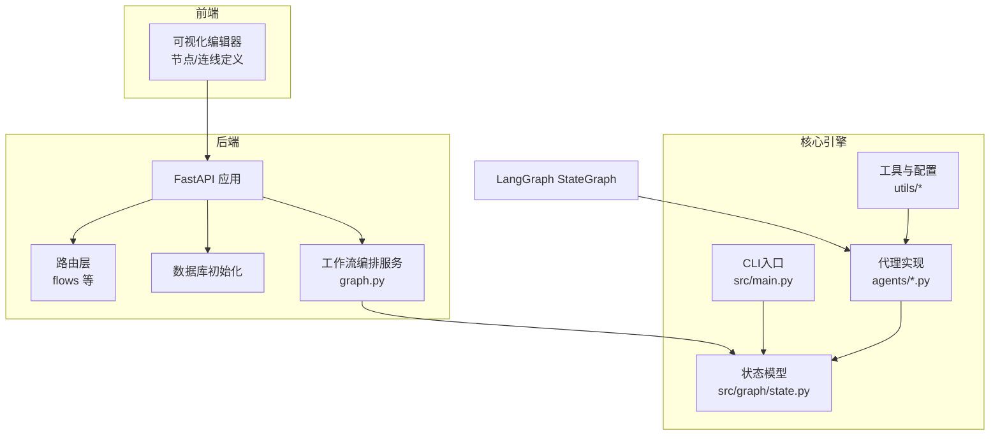
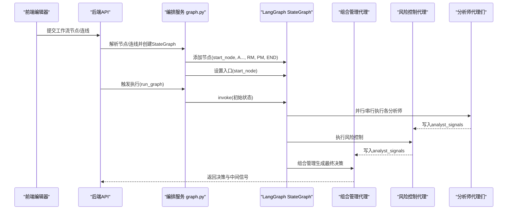
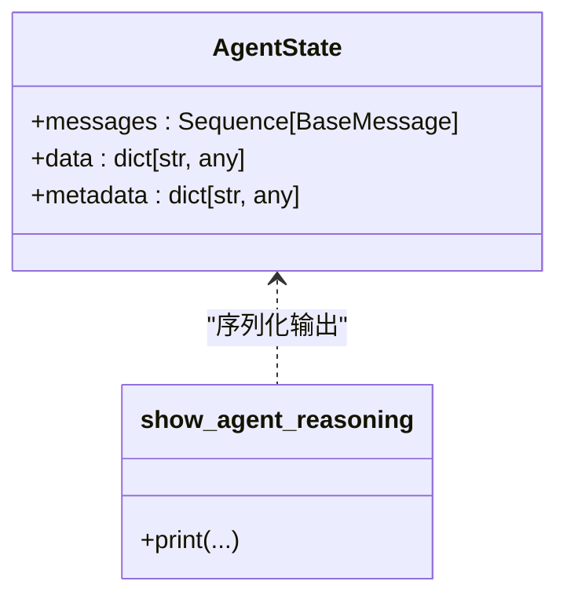
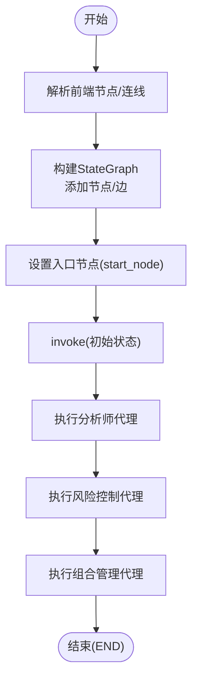
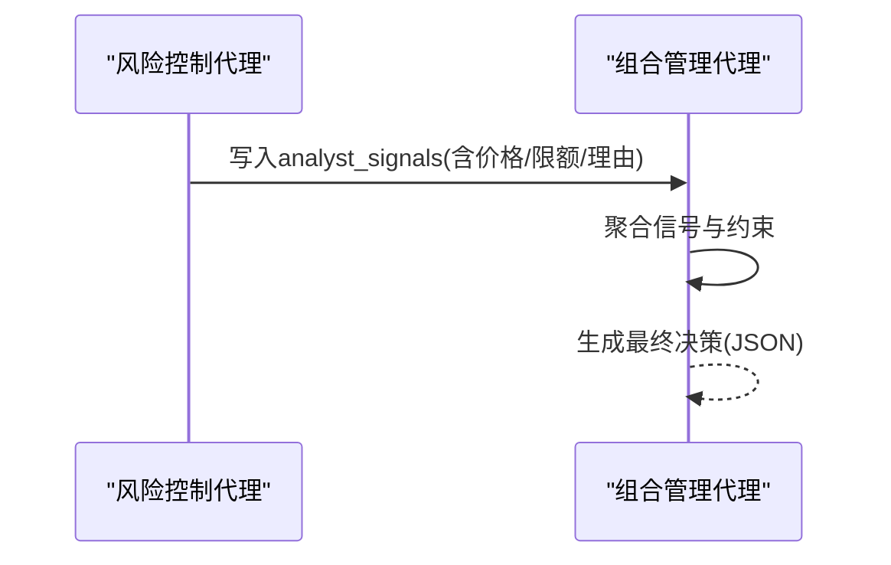
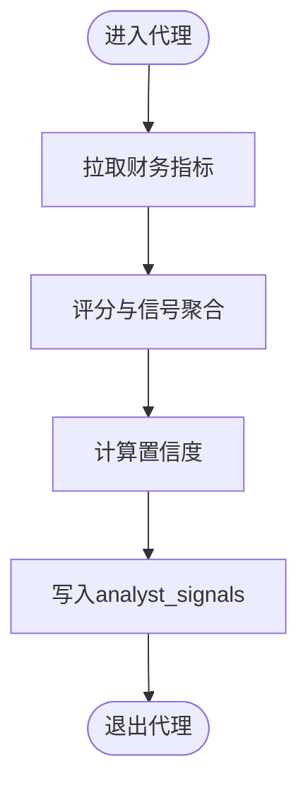
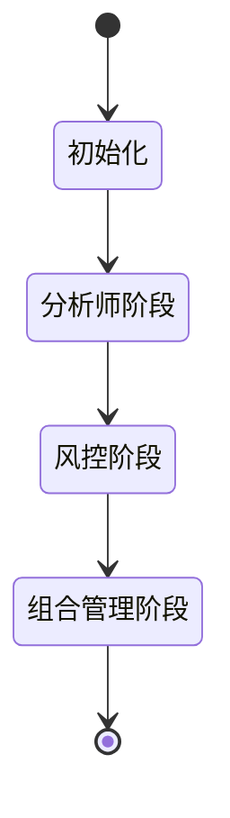
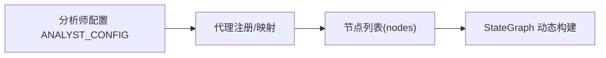
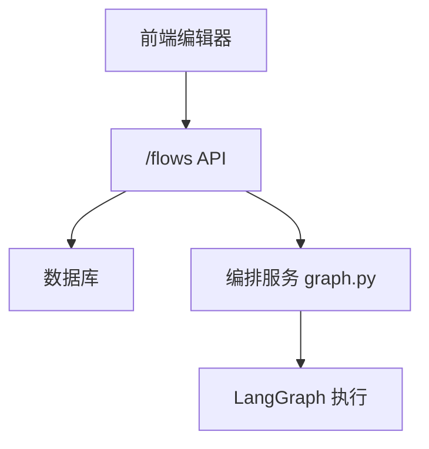
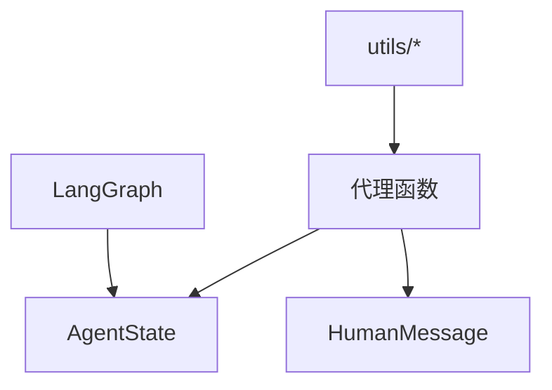

# 代理架构设计

<cite>
**本文引用的文件**
- [src/graph/state.py](file://src/graph/state.py)
- [src/main.py](file://src/main.py)
- [app/backend/services/graph.py](file://app/backend/services/graph.py)
- [app/backend/services/agent_service.py](file://app/backend/services/agent_service.py)
- [src/utils/analysts.py](file://src/utils/analysts.py)
- [src/agents/portfolio_manager.py](file://src/agents/portfolio_manager.py)
- [src/agents/risk_manager.py](file://src/agents/risk_manager.py)
- [src/agents/fundamentals.py](file://src/agents/fundamentals.py)
- [src/backtesting/controller.py](file://src/backtesting/controller.py)
- [src/utils/display.py](file://src/utils/display.py)
- [src/utils/progress.py](file://src/utils/progress.py)
- [app/backend/main.py](file://app/backend/main.py)
- [app/backend/routes/flows.py](file://app/backend/routes/flows.py)
</cite>

## 目录
1. [引言](#引言)
2. [项目结构](#项目结构)
3. [核心组件](#核心组件)
4. [架构总览](#架构总览)
5. [详细组件分析](#详细组件分析)
6. [依赖分析](#依赖分析)
7. [性能考虑](#性能考虑)
8. [故障排查指南](#故障排查指南)
9. [结论](#结论)
10. [附录：设计新代理类型指南](#附录设计新代理类型指南)

## 引言
本文件系统性阐述该AI对冲基金项目的“多代理协作”架构设计与实现，重点覆盖以下主题：
- 代理状态管理机制（基于LangGraph的状态图）
- 消息传递协议与工作流编排原理
- 代理间通信机制与决策流程
- 代理生命周期管理、状态转换与异常处理
- 代理扩展接口设计与插件化架构
- 基于LangGraph的编排方式与前后端集成
- 架构图表与代码示例路径指引

## 项目结构
该项目采用前后端分离与多模块分层组织：
- 后端（FastAPI）：提供API路由、数据库初始化、Ollama服务检查等
- 前端（React/Vite）：可视化拖拽式工作流编辑器（节点/连线定义）
- 核心引擎（Python）：基于LangGraph的状态图执行器，封装代理函数、状态与消息传递
- 工具与实用模块：进度跟踪、显示格式化、分析师配置、LLM调用等

**图表来源**
- [app/backend/main.py:1-56](file://app/backend/main.py#L1-L56)
- [app/backend/routes/flows.py:1-174](file://app/backend/routes/flows.py#L1-L174)
- [app/backend/services/graph.py:36-129](file://app/backend/services/graph.py#L36-L129)
- [src/main.py:100-130](file://src/main.py#L100-L130)
- [src/graph/state.py:15-19](file://src/graph/state.py#L15-L19)

**章节来源**
- [app/backend/main.py:1-56](file://app/backend/main.py#L1-L56)
- [app/backend/routes/flows.py:1-174](file://app/backend/routes/flows.py#L1-L174)
- [src/main.py:100-130](file://src/main.py#L100-L130)
- [src/graph/state.py:15-19](file://src/graph/state.py#L15-L19)

## 核心组件
- 状态模型（AgentState）：统一承载消息、数据与元信息，支持消息合并与字典合并
- 代理函数：遵循固定签名（state, agent_id），通过消息与状态进行读写
- 编排器（LangGraph）：构建有向无环图（DAG）或线性流程，设置入口节点与终止节点
- 运行时（run_hedge_fund/run_graph）：注入初始输入，驱动状态图执行，收集最终输出

关键要点：
- 所有代理均以“状态+消息”的方式交互，避免全局共享状态
- 通过“analyst_signals”在风险管理和组合管理之间传递信号
- 支持CLI与Web两种运行入口，后者通过异步包装器适配LangGraph同步执行

**章节来源**
- [src/graph/state.py:15-19](file://src/graph/state.py#L15-L19)
- [src/main.py:46-93](file://src/main.py#L46-L93)
- [app/backend/services/graph.py:141-177](file://app/backend/services/graph.py#L141-L177)

## 架构总览
下图展示从前端到后端再到核心引擎的端到端流程，以及LangGraph编排的关键节点。

**图表来源**
- [app/backend/services/graph.py:36-129](file://app/backend/services/graph.py#L36-L129)
- [src/main.py:100-130](file://src/main.py#L100-L130)
- [src/agents/portfolio_manager.py:25-93](file://src/agents/portfolio_manager.py#L25-L93)
- [src/agents/risk_manager.py:11-219](file://src/agents/risk_manager.py#L11-L219)

## 详细组件分析

### 状态模型与消息协议
- AgentState包含三类字段：
  - messages：消息序列，支持拼接合并
  - data：业务数据字典，支持深度合并
  - metadata：元数据字典，支持深度合并
- 代理通过返回更新后的messages/data来实现跨节点通信
- 显示辅助函数用于将复杂对象序列化为可读JSON输出

**图表来源**
- [src/graph/state.py:15-19](file://src/graph/state.py#L15-L19)
- [src/graph/state.py:21-52](file://src/graph/state.py#L21-L52)

**章节来源**
- [src/graph/state.py:15-19](file://src/graph/state.py#L15-L19)
- [src/graph/state.py:21-52](file://src/graph/state.py#L21-L52)

### 编排器与工作流
- CLI入口：构建默认工作流（分析师→风险→组合→结束），设置入口节点
- Web入口：根据前端传入的节点/连线动态构建StateGraph，自动连接起始节点与无入边节点；分析师→风险→风险对应组合管理→结束

**图表来源**
- [src/main.py:100-130](file://src/main.py#L100-L130)
- [app/backend/services/graph.py:36-129](file://app/backend/services/graph.py#L36-L129)

**章节来源**
- [src/main.py:100-130](file://src/main.py#L100-L130)
- [app/backend/services/graph.py:36-129](file://app/backend/services/graph.py#L36-L129)

### 代理间通信与信号汇聚
- 风险控制代理负责计算波动率、相关性与头寸限额，并将结果写入analyst_signals
- 组合管理代理汇总所有分析师信号与风险限额，结合账户资金与头寸约束，生成最终交易决策
- 代理通过HumanMessage将JSON字符串写入messages，供下游读取

**图表来源**
- [src/agents/risk_manager.py:11-219](file://src/agents/risk_manager.py#L11-L219)
- [src/agents/portfolio_manager.py:25-93](file://src/agents/portfolio_manager.py#L25-L93)

**章节来源**
- [src/agents/risk_manager.py:11-219](file://src/agents/risk_manager.py#L11-L219)
- [src/agents/portfolio_manager.py:25-93](file://src/agents/portfolio_manager.py#L25-L93)

### 典型代理实现：基础面分析
- 逐股票抓取财务指标，综合盈利能力、成长性、健康状况与估值比率，给出多维度信号与置信度
- 将分析结果写入analyst_signals，供组合管理代理消费

**图表来源**
- [src/agents/fundamentals.py:11-164](file://src/agents/fundamentals.py#L11-L164)

**章节来源**
- [src/agents/fundamentals.py:11-164](file://src/agents/fundamentals.py#L11-L164)

### 生命周期管理与状态转换
- 生命周期阶段：初始化（start）、执行各代理、汇总与决策、结束
- 状态转换：每次代理执行后，通过返回值更新messages与data，LangGraph据此推进到下一个节点
- 异常处理：解析响应失败时提供降级输出（如默认持有），保证流程不中断

**图表来源**
- [src/main.py:95-130](file://src/main.py#L95-L130)
- [app/backend/services/graph.py:36-129](file://app/backend/services/graph.py#L36-L129)

**章节来源**
- [src/main.py:95-130](file://src/main.py#L95-L130)
- [app/backend/services/graph.py:36-129](file://app/backend/services/graph.py#L36-L129)

### 插件化与扩展接口设计
- 代理注册中心：集中维护分析师清单与顺序，新增代理只需在配置中登记
- 代理函数签名：统一为(state, agent_id)，便于LangGraph调度
- 动态编排：后端根据前端节点/连线动态构建图，支持灵活拓扑

**图表来源**
- [src/utils/analysts.py:24-187](file://src/utils/analysts.py#L24-L187)
- [app/backend/services/graph.py:42-66](file://app/backend/services/graph.py#L42-L66)

**章节来源**
- [src/utils/analysts.py:24-187](file://src/utils/analysts.py#L24-L187)
- [app/backend/services/graph.py:42-66](file://app/backend/services/graph.py#L42-L66)

### 前后端集成与API
- 后端FastAPI应用启动时初始化数据库表并检查Ollama可用性
- 流程管理API提供工作流的增删改查与复制接口，支撑前端可视化编辑器

**图表来源**
- [app/backend/main.py:15-56](file://app/backend/main.py#L15-L56)
- [app/backend/routes/flows.py:18-174](file://app/backend/routes/flows.py#L18-L174)

**章节来源**
- [app/backend/main.py:15-56](file://app/backend/main.py#L15-L56)
- [app/backend/routes/flows.py:18-174](file://app/backend/routes/flows.py#L18-L174)

## 依赖分析
- LangGraph依赖：StateGraph、消息类型、END终止符
- 代理依赖：统一的AgentState与消息写入规范
- 工具依赖：进度跟踪、显示格式化、LLM调用、API密钥读取

**图表来源**
- [src/graph/state.py:4-5](file://src/graph/state.py#L4-L5)
- [src/main.py:5-11](file://src/main.py#L5-L11)
- [src/agents/portfolio_manager.py:3-10](file://src/agents/portfolio_manager.py#L3-L10)

**章节来源**
- [src/graph/state.py:4-5](file://src/graph/state.py#L4-L5)
- [src/main.py:5-11](file://src/main.py#L5-L11)
- [src/agents/portfolio_manager.py:3-10](file://src/agents/portfolio_manager.py#L3-L10)

## 性能考虑
- 并行与串行：当前默认线性编排（分析师→风控→组合），可根据需要调整为并行执行以提升吞吐
- 数据复用：风险代理已做价格与波动率缓存，避免重复API调用
- 输出裁剪：组合管理代理对仅“持有”的标的直接填充，减少LLM推理负担
- I/O优化：建议将高频API调用结果本地缓存或使用批量请求

## 故障排查指南
- JSON解析错误：当代理返回非标准JSON时，解析器会打印错误并返回None，需检查代理输出格式
- 类型错误：若响应不是字符串而是其他类型，解析器会捕获TypeError并提示
- 未知异常：通用异常捕获会记录异常与原始响应，便于定位问题

**章节来源**
- [src/main.py:30-42](file://src/main.py#L30-L42)
- [app/backend/services/graph.py:180-193](file://app/backend/services/graph.py#L180-L193)

## 结论
该系统以LangGraph为核心，通过标准化的AgentState与消息协议实现了清晰的多代理协作：分析师负责信号生成，风险控制负责限额与相关性调整，组合管理负责在约束下做出最终决策。前端通过可视化编辑器定义工作流，后端动态编排并执行，形成完整的“策略即代码”的流水线。该架构具备良好的扩展性与可观测性，适合持续迭代与插件化演进。

## 附录：设计新代理类型指南
- 步骤一：实现代理函数
  - 函数签名：接收(state, agent_id)，返回更新后的messages与data
  - 示例路径：[src/agents/fundamentals.py:11-164](file://src/agents/fundamentals.py#L11-L164)
- 步骤二：注册到配置
  - 在分析师配置中添加新代理键值对，包含显示名、描述、风格、函数与顺序
  - 示例路径：[src/utils/analysts.py:24-178](file://src/utils/analysts.py#L24-L178)
- 步骤三：接入编排
  - 若为Web入口，确保节点ID与配置一致；CLI入口会按配置自动加载
  - 示例路径：[app/backend/services/graph.py:42-66](file://app/backend/services/graph.py#L42-L66)
- 步骤四：消息与状态
  - 使用HumanMessage写入JSON字符串到messages
  - 使用analyst_signals在代理间传递信号
  - 示例路径：[src/agents/risk_manager.py:205-219](file://src/agents/risk_manager.py#L205-L219)
- 步骤五：可观测性
  - 可选地启用show_reasoning打印中间结果
  - 使用progress跟踪执行状态
  - 示例路径：[src/utils/progress.py:44-64](file://src/utils/progress.py#L44-L64)