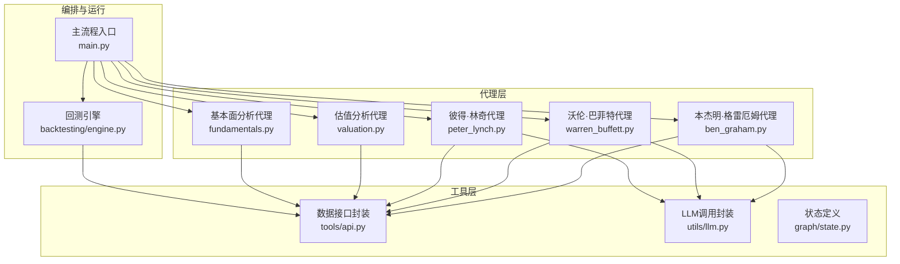
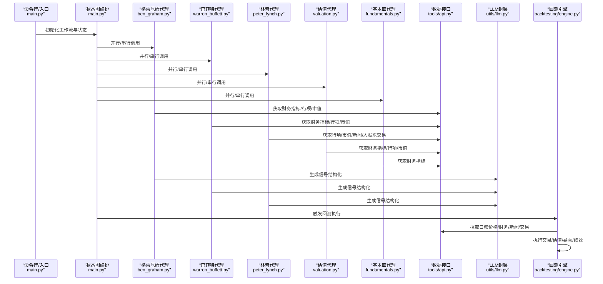
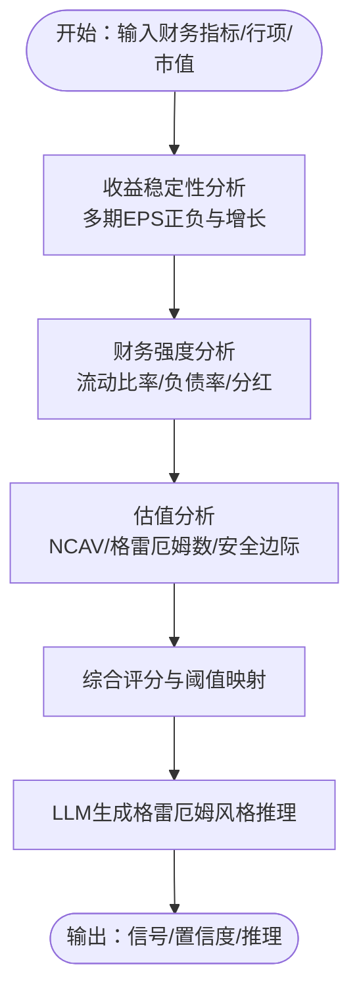
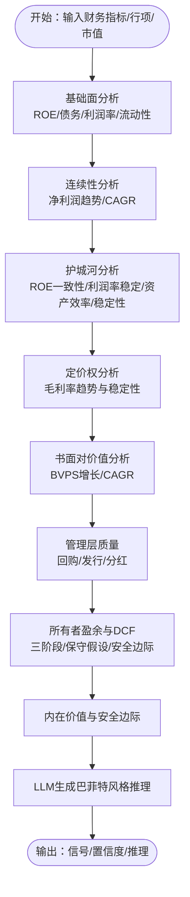
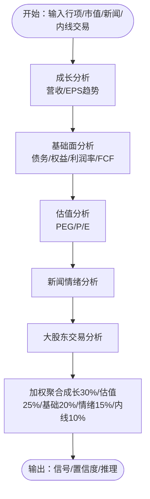
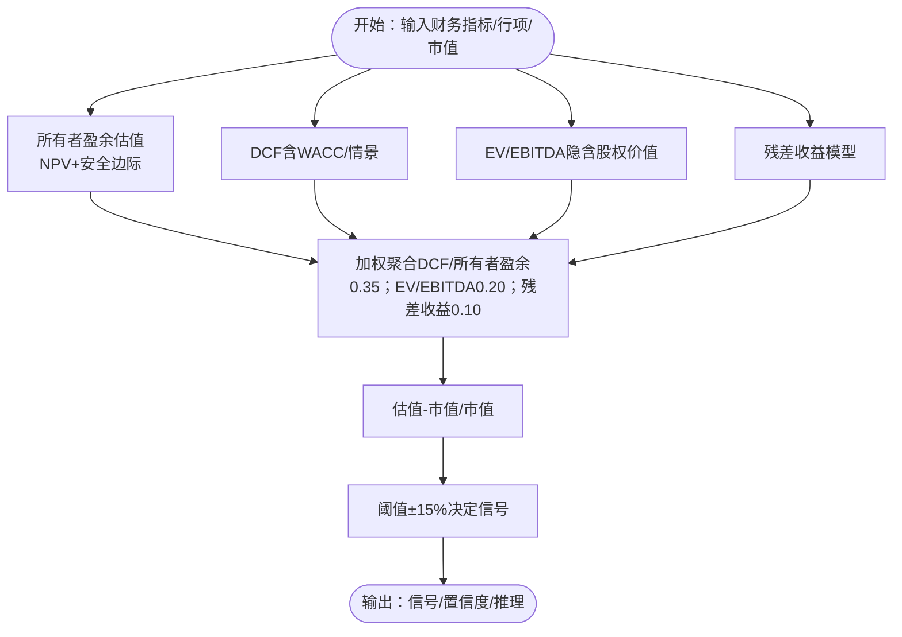
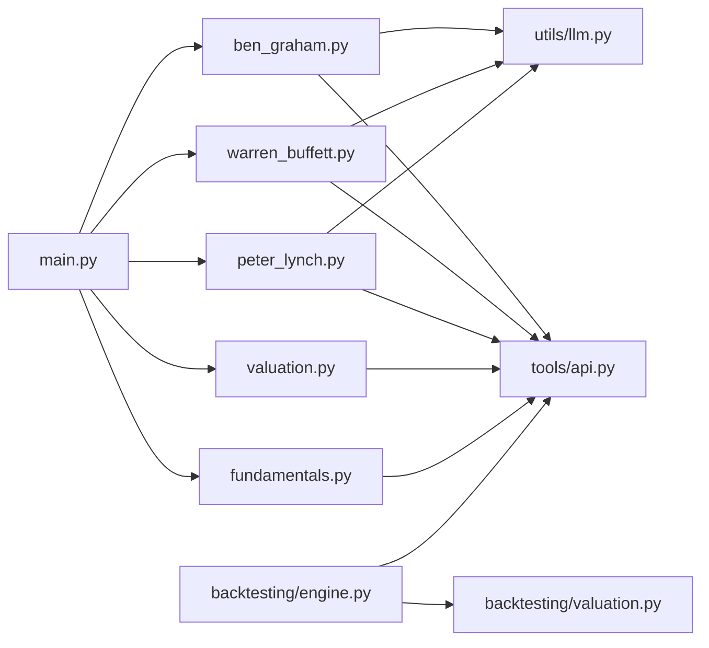

# 价值投资代理

<cite>
**本文引用的文件**
- [src/agents/ben_graham.py](file://src/agents/ben_graham.py)
- [src/agents/warren_buffett.py](file://src/agents/warren_buffett.py)
- [src/agents/peter_lynch.py](file://src/agents/peter_lynch.py)
- [src/agents/valuation.py](file://src/agents/valuation.py)
- [src/agents/fundamentals.py](file://src/agents/fundamentals.py)
- [src/tools/api.py](file://src/tools/api.py)
- [src/utils/llm.py](file://src/utils/llm.py)
- [src/graph/state.py](file://src/graph/state.py)
- [src/main.py](file://src/main.py)
- [src/backtesting/engine.py](file://src/backtesting/engine.py)
- [src/backtesting/valuation.py](file://src/backtesting/valuation.py)
- [tests/backtesting/test_valuation.py](file://tests/backtesting/test_valuation.py)
</cite>

## 目录
1. [简介](#简介)
2. [项目结构](#项目结构)
3. [核心组件](#核心组件)
4. [架构总览](#架构总览)
5. [详细组件分析](#详细组件分析)
6. [依赖关系分析](#依赖关系分析)
7. [性能考量](#性能考量)
8. [故障排除指南](#故障排除指南)
9. [结论](#结论)
10. [附录](#附录)

## 简介
本文件系统化梳理并解读该AI对冲基金项目中的“价值投资代理”体系，围绕Benjamin Graham（本杰明·格雷厄姆）、Warren Buffett（沃伦·巴菲特）、Peter Lynch（彼得·林奇）等代表性价值投资理念，构建可执行的代理模块与回测流水线。内容覆盖：
- 价值评估方法：现金流折现、所有者盈余、EV/EBITDA、残差收益模型
- 财务报表分析：盈利能力、成长性、财务健康度、估值比率
- 内在价值计算：多阶段DCF、安全边际、情景分析
- 安全边际原则、长期持有策略与护城河分析
- 各代理实现差异与适用场景
- 价值投资指标计算、股票筛选逻辑与风险控制机制
- 实际案例与代码示例路径指引

## 项目结构
该项目采用“代理-图编排-回测”的分层架构：
- 代理层：按不同价值理念拆分独立代理，负责数据拉取、指标计算与信号生成
- 工具层：统一的数据接口封装，支持财务指标、股价、新闻、大股东交易等
- 图编排层：LangGraph状态机串联多个代理与风险管理、组合管理节点
- 回测层：引擎驱动每日回测循环，执行交易、估值、暴露与绩效计算

图表来源
- [src/agents/ben_graham.py:1-349](file://src/agents/ben_graham.py#L1-L349)
- [src/agents/warren_buffett.py:1-827](file://src/agents/warren_buffett.py#L1-L827)
- [src/agents/peter_lynch.py:1-508](file://src/agents/peter_lynch.py#L1-L508)
- [src/agents/valuation.py:1-495](file://src/agents/valuation.py#L1-L495)
- [src/agents/fundamentals.py:1-164](file://src/agents/fundamentals.py#L1-L164)
- [src/tools/api.py:1-367](file://src/tools/api.py#L1-L367)
- [src/utils/llm.py:1-148](file://src/utils/llm.py#L1-L148)
- [src/graph/state.py:1-52](file://src/graph/state.py#L1-L52)
- [src/main.py:1-180](file://src/main.py#L1-L180)
- [src/backtesting/engine.py:1-195](file://src/backtesting/engine.py#L1-L195)

章节来源
- [src/main.py:100-131](file://src/main.py#L100-L131)
- [src/graph/state.py:14-19](file://src/graph/state.py#L14-L19)

## 核心组件
- 本杰明·格雷厄姆代理：强调“净额资产价值（NCAV）”“格雷厄姆数（Graham Number）”“安全边际”，适合深度价值与困境反转策略
- 沃伦·巴菲特代理：以“所有者盈余（Owner Earnings）”为核心，结合护城河、定价权、管理层质量、内在价值与安全边际，适合长期持有优质企业
- 彼得·林奇代理：聚焦“增长合理价格（GARP）”与PEG比率，关注可理解业务与十倍股潜力，适合成长价值平衡
- 估值分析代理：融合DCF、所有者盈余、EV/EBITDA、残差收益模型，加权聚合形成统一信号
- 基本面分析代理：基于ROE、利润率、成长率、流动性、杠杆与估值比率进行多维打分
- 数据接口封装：统一访问财务指标、股价、新闻、大股东交易，内置缓存与限流
- LLM封装：结构化输出、重试与默认回退、模型配置提取
- 回测引擎：每日回测循环、交易执行、组合估值与暴露计算、基准对比与绩效指标

章节来源
- [src/agents/ben_graham.py:20-94](file://src/agents/ben_graham.py#L20-L94)
- [src/agents/warren_buffett.py:19-153](file://src/agents/warren_buffett.py#L19-L153)
- [src/agents/peter_lynch.py:27-158](file://src/agents/peter_lynch.py#L27-L158)
- [src/agents/valuation.py:21-220](file://src/agents/valuation.py#L21-L220)
- [src/agents/fundamentals.py:11-163](file://src/agents/fundamentals.py#L11-L163)
- [src/tools/api.py:99-181](file://src/tools/api.py#L99-L181)
- [src/utils/llm.py:10-84](file://src/utils/llm.py#L10-L84)

## 架构总览
下图展示从主流程到代理、工具与回测的整体交互：

图表来源
- [src/main.py:100-131](file://src/main.py#L100-L131)
- [src/agents/ben_graham.py:20-94](file://src/agents/ben_graham.py#L20-L94)
- [src/agents/warren_buffett.py:19-153](file://src/agents/warren_buffett.py#L19-L153)
- [src/agents/peter_lynch.py:27-158](file://src/agents/peter_lynch.py#L27-L158)
- [src/agents/valuation.py:21-220](file://src/agents/valuation.py#L21-L220)
- [src/agents/fundamentals.py:11-163](file://src/agents/fundamentals.py#L11-L163)
- [src/tools/api.py:99-181](file://src/tools/api.py#L99-L181)
- [src/utils/llm.py:10-84](file://src/utils/llm.py#L10-L84)
- [src/backtesting/engine.py:96-195](file://src/backtesting/engine.py#L96-L195)

## 详细组件分析

### 本杰明·格雷厄姆代理（Benjamin Graham）
- 关键能力
  - 收益稳定性分析：多期EPS正负与增长趋势
  - 财务强度分析：流动比率、资产负债率、分红记录
  - 估值分析：NCAV（净额资产价值）与格雷厄姆数（Graham Number），安全边际计算
  - 综合评分映射为看涨/中性/看跌信号，并由LLM生成格雷厄姆风格的推理
- 安全边际与价值判断
  - 当NCAV超过市值或NCAV/股价达到阈值时，视为强买入
  - 格雷厄姆数与当前股价比较，计算安全边际百分比
- 适用场景
  - 困境反转、高股息低估值、资产负债表稳健但短期承压公司
- 代码示例路径
  - [代理主体与信号生成:20-94](file://src/agents/ben_graham.py#L20-L94)
  - [收益稳定性分析:97-138](file://src/agents/ben_graham.py#L97-L138)
  - [财务强度分析:141-204](file://src/agents/ben_graham.py#L141-L204)
  - [格雷厄姆估值与安全边际:207-279](file://src/agents/ben_graham.py#L207-L279)
  - [LLM生成推理与最终信号:282-349](file://src/agents/ben_graham.py#L282-L349)

图表来源
- [src/agents/ben_graham.py:97-279](file://src/agents/ben_graham.py#L97-L279)

章节来源
- [src/agents/ben_graham.py:20-94](file://src/agents/ben_graham.py#L20-L94)
- [src/agents/ben_graham.py:97-279](file://src/agents/ben_graham.py#L97-L279)
- [src/agents/ben_graham.py:282-349](file://src/agents/ben_graham.py#L282-L349)

### 沃伦·巴菲特代理（Warren Buffett）
- 关键能力
  - 基础面：ROE、债务权益比、运营利润率、流动比率
  - 连续性：净利润趋势与复合增长率
  - 护城河：ROE一致性、运营利润率稳定性、资产效率、经营稳定性
  - 定价权：毛利率趋势与稳定性
  - 股东回报：股份回购/发行、分红记录
  - 内在价值：所有者盈余三阶段DCF，保守折现率与额外安全边际
  - 安全边际：内在价值与市值比较
- 适用场景
  - 长期持有具备持续竞争优势与管理层质量的企业
- 代码示例路径
  - [代理主体与信号生成:19-153](file://src/agents/warren_buffett.py#L19-L153)
  - [基础面分析:156-202](file://src/agents/warren_buffett.py#L156-L202)
  - [连续性分析:205-235](file://src/agents/warren_buffett.py#L205-L235)
  - [护城河分析（ROE一致性/利润率稳定性/资产效率/稳定性）:238-334](file://src/agents/warren_buffett.py#L238-L334)
  - [定价权分析（毛利率趋势与稳定性）:696-743](file://src/agents/warren_buffett.py#L696-L743)
  - [股东回报与管理层质量:337-377](file://src/agents/warren_buffett.py#L337-L377)
  - [所有者盈余与三阶段DCF:380-624](file://src/agents/warren_buffett.py#L380-L624)
  - [书面对价值与CAGR:627-694](file://src/agents/warren_buffett.py#L627-L694)
  - [LLM生成推理与最终信号:746-807](file://src/agents/warren_buffett.py#L746-L807)

图表来源
- [src/agents/warren_buffett.py:156-624](file://src/agents/warren_buffett.py#L156-L624)

章节来源
- [src/agents/warren_buffett.py:19-153](file://src/agents/warren_buffett.py#L19-L153)
- [src/agents/warren_buffett.py:156-624](file://src/agents/warren_buffett.py#L156-L624)
- [src/agents/warren_buffett.py:746-807](file://src/agents/warren_buffett.py#L746-L807)

### 彼得·林奇代理（Peter Lynch）
- 关键能力
  - 成长：营收与EPS持续增长
  - 基础面：债务/权益、运营利润率、正自由现金流
  - 估值：GARP（PEG）优先，其次P/E
  - 情绪：负面新闻占比权重
  - 行为：大股东交易倾向（买入/卖出）权重
  - 加权聚合：成长30%、估值25%、基础面20%、情绪15%、内线交易10%
- 适用场景
  - 寻找“可理解业务”与“十倍股”潜力，平衡成长与价值
- 代码示例路径
  - [代理主体与信号生成:27-158](file://src/agents/peter_lynch.py#L27-L158)
  - [成长分析（营收/EPS）:161-223](file://src/agents/peter_lynch.py#L161-L223)
  - [基础面分析（债务/权益、利润率、自由现金流）:226-286](file://src/agents/peter_lynch.py#L226-L286)
  - [估值分析（PEG/P/E）:289-362](file://src/agents/peter_lynch.py#L289-L362)
  - [新闻情绪分析:365-393](file://src/agents/peter_lynch.py#L365-L393)
  - [大股东交易分析:396-438](file://src/agents/peter_lynch.py#L396-L438)
  - [LLM生成推理与最终信号:441-507](file://src/agents/peter_lynch.py#L441-L507)

图表来源
- [src/agents/peter_lynch.py:99-129](file://src/agents/peter_lynch.py#L99-L129)

章节来源
- [src/agents/peter_lynch.py:27-158](file://src/agents/peter_lynch.py#L27-L158)
- [src/agents/peter_lynch.py:161-362](file://src/agents/peter_lynch.py#L161-L362)
- [src/agents/peter_lynch.py:365-438](file://src/agents/peter_lynch.py#L365-L438)
- [src/agents/peter_lynch.py:441-507](file://src/agents/peter_lynch.py#L441-L507)

### 估值分析代理（综合估值）
- 关键能力
  - 多模型融合：DCF（含WACC与情景分析）、所有者盈余、EV/EBITDA、残差收益模型
  - 权重聚合：DCF/所有者盈余0.35、EV/EBITDA0.20、残差收益0.10
  - 安全边际：（模型估值-市值）/市值，阈值±15%决定信号
  - 场景分析：熊/牛/中性情景下的目标值与波动范围
- 适用场景
  - 对单一标的进行多维度估值验证，降低单一模型偏差
- 代码示例路径
  - [代理主体与信号生成:21-220](file://src/agents/valuation.py#L21-L220)
  - [所有者盈余估值（含安全边际）:226-257](file://src/agents/valuation.py#L226-L257)
  - [经典DCF（常增长与终值）:259-281](file://src/agents/valuation.py#L259-L281)
  - [EV/EBITDA隐含股权价值:283-299](file://src/agents/valuation.py#L283-L299)
  - [残差收益模型（含安全边际）:302-332](file://src/agents/valuation.py#L302-L332)
  - [WACC估算与DCF情景分析:338-494](file://src/agents/valuation.py#L338-L494)

图表来源
- [src/agents/valuation.py:144-220](file://src/agents/valuation.py#L144-L220)
- [src/agents/valuation.py:338-494](file://src/agents/valuation.py#L338-L494)

章节来源
- [src/agents/valuation.py:21-220](file://src/agents/valuation.py#L21-L220)
- [src/agents/valuation.py:226-332](file://src/agents/valuation.py#L226-L332)
- [src/agents/valuation.py:338-494](file://src/agents/valuation.py#L338-L494)

### 基本面分析代理（多维打分）
- 关键能力
  - 盈利能力：ROE、净利率、运营利润率
  - 成长性：营收/利润/账面价值复合增速
  - 财务健康：流动比率、债务/权益、自由现金流/每股收益
  - 估值比率：P/E、P/B、P/S
  - 综合信号：多指标多数“利好”则看涨，反之看跌
- 适用场景
  - 快速扫描与初筛，作为其他代理前置过滤器
- 代码示例路径
  - [代理主体与信号生成:11-163](file://src/agents/fundamentals.py#L11-L163)

章节来源
- [src/agents/fundamentals.py:11-163](file://src/agents/fundamentals.py#L11-L163)

### 数据接口与LLM封装
- 数据接口（tools/api.py）
  - 统一封装：财务指标、股价、新闻、大股东交易、公司事实
  - 缓存与限流：带指数键的缓存、429重试与线性退避
- LLM封装（utils/llm.py）
  - 结构化输出：基于Pydantic模型的JSON模式
  - 重试与默认回退：失败时返回默认响应
  - 模型配置：从状态提取代理特定模型配置
- 代码示例路径
  - [财务指标/行项/市值获取:99-181](file://src/tools/api.py#L99-L181)
  - [新闻/内线交易/股价获取:183-367](file://src/tools/api.py#L183-L367)
  - [LLM调用与结构化输出:10-84](file://src/utils/llm.py#L10-L84)

章节来源
- [src/tools/api.py:99-181](file://src/tools/api.py#L99-L181)
- [src/tools/api.py:183-367](file://src/tools/api.py#L183-L367)
- [src/utils/llm.py:10-84](file://src/utils/llm.py#L10-L84)

## 依赖关系分析
- 代理对工具层的依赖
  - 所有代理均通过工具层访问外部数据源，避免重复实现
  - 代理内部再通过LLM封装进行结构化输出
- 回测引擎对代理与工具层的依赖
  - 回测引擎在每个交易日拉取所需数据，驱动代理决策并执行交易
  - 组合估值与暴露计算依赖回测工具函数

图表来源
- [src/agents/ben_graham.py:1-12](file://src/agents/ben_graham.py#L1-L12)
- [src/agents/warren_buffett.py:1-11](file://src/agents/warren_buffett.py#L1-L11)
- [src/agents/peter_lynch.py:1-16](file://src/agents/peter_lynch.py#L1-L16)
- [src/agents/valuation.py:15-20](file://src/agents/valuation.py#L15-L20)
- [src/agents/fundamentals.py:1-8](file://src/agents/fundamentals.py#L1-L8)
- [src/utils/llm.py:1-8](file://src/utils/llm.py#L1-L8)
- [src/main.py:1-18](file://src/main.py#L1-L18)
- [src/backtesting/engine.py:1-25](file://src/backtesting/engine.py#L1-L25)
- [src/backtesting/valuation.py:1-83](file://src/backtesting/valuation.py#L1-L83)

章节来源
- [src/main.py:100-131](file://src/main.py#L100-L131)
- [src/backtesting/engine.py:96-195](file://src/backtesting/engine.py#L96-L195)

## 性能考量
- 数据拉取与缓存
  - 使用带参数的缓存键确保精确命中，减少重复请求
  - 限流与退避策略应对429错误，保证稳定性
- 计算复杂度
  - 代理内部多为O(N)指标计算（N为历史期数）
  - DCF与情景分析涉及多阶段迭代，建议限制年数与使用保守参数
- LLM调用
  - 结构化输出与重试机制降低失败成本
  - 模型选择与成本控制可通过状态配置动态调整
- 回测效率
  - 预取数据（股价/财务/新闻/内线）减少回测循环中的等待
  - 暴露与组合价值计算为O(T)（T为持仓数）

[本节为通用指导，不直接分析具体文件]

## 故障排除指南
- LLM调用失败
  - 现象：代理输出默认信号或异常
  - 排查：检查模型配置、API密钥、网络连通性；查看重试日志
  - 参考路径：[LLM调用与默认回退:10-84](file://src/utils/llm.py#L10-L84)
- 数据接口异常
  - 现象：财务指标/股价/新闻为空
  - 排查：确认API密钥、日期范围、限流与缓存状态
  - 参考路径：[数据接口封装:29-61](file://src/tools/api.py#L29-L61)
- 回测数值异常
  - 现象：组合价值/暴露/比率异常
  - 排查：核对交易执行、价格缺失、空仓情况
  - 参考路径：[组合估值与暴露计算:8-51](file://src/backtesting/valuation.py#L8-L51)
- 单元测试验证
  - 参考路径：[回测估值单元测试:1-50](file://tests/backtesting/test_valuation.py#L1-L50)

章节来源
- [src/utils/llm.py:10-84](file://src/utils/llm.py#L10-L84)
- [src/tools/api.py:29-61](file://src/tools/api.py#L29-L61)
- [src/backtesting/valuation.py:8-51](file://src/backtesting/valuation.py#L8-L51)
- [tests/backtesting/test_valuation.py:1-50](file://tests/backtesting/test_valuation.py#L1-L50)

## 结论
该价值投资代理体系以“多理念互补、多模型验证、多信号融合”为核心设计，既保留了格雷厄姆的“安全边际”、巴菲特的“护城河与内在价值”、林奇的“GARP”等经典思想，又通过统一的数据接口与LLM封装实现了自动化与可扩展性。在回测层面，引擎提供了完整的交易执行、组合估值、暴露与绩效计算闭环，便于策略验证与优化。

[本节为总结性内容，不直接分析具体文件]

## 附录

### 价值投资指标与筛选逻辑要点
- 格雷厄姆（Graham）
  - 安全边际：NCAV/市值、格雷厄姆数与当前股价比较
  - 财务强度：流动比率≥2、负债率<50%、有分红记录
  - 收益稳定性：多期EPS均为正且呈增长趋势
  - 参考路径：[收益稳定性/财务强度/估值分析:97-279](file://src/agents/ben_graham.py#L97-L279)
- 巴菲特（Buffett）
  - 护城河：ROE一致性、运营利润率稳定性、资产效率、经营稳定性
  - 定价权：毛利率趋势与稳定性
  - 内在价值：所有者盈余三阶段DCF，保守折现率与额外安全边际
  - 参考路径：[护城河/定价权/内在价值:238-624](file://src/agents/warren_buffett.py#L238-L624)
- 林奇（Lynch）
  - GARP：PEG优先，其次P/E
  - 成长：营收/EPS持续增长
  - 基础面：低杠杆、高利润率、正自由现金流
  - 参考路径：[GARP/成长/基础面:289-362](file://src/agents/peter_lynch.py#L289-L362)

### 风险控制机制
- 安全边际：各代理均内置安全边际阈值（如NCAV、PEG、内在价值vs市值）
- 情景分析：DCF情景（熊/牛/中性）与波动范围
- 模型权重：估值代理对多模型结果进行加权聚合，降低单一模型偏差
- 回测暴露：每日计算长/短/总暴露与长/短比率，便于风控监控
- 参考路径：
  - [估值代理安全边际与情景:144-220](file://src/agents/valuation.py#L144-L220)
  - [回测暴露计算:24-50](file://src/backtesting/valuation.py#L24-L50)

### 实际案例与代码示例路径
- 格雷厄姆：收益稳定性/财务强度/估值分析与LLM推理
  - [路径:97-349](file://src/agents/ben_graham.py#L97-L349)
- 巴菲特：护城河/定价权/内在价值与LLM推理
  - [路径:238-807](file://src/agents/warren_buffett.py#L238-L807)
- 林奇：GARP/成长/基础面与加权聚合
  - [路径:289-507](file://src/agents/peter_lynch.py#L289-L507)
- 估值代理：多模型融合与情景分析
  - [路径:144-494](file://src/agents/valuation.py#L144-L494)
- 回测验证：组合估值/暴露/汇总
  - [路径:8-83](file://src/backtesting/valuation.py#L8-L83)
  - [单元测试:1-50](file://tests/backtesting/test_valuation.py#L1-L50)