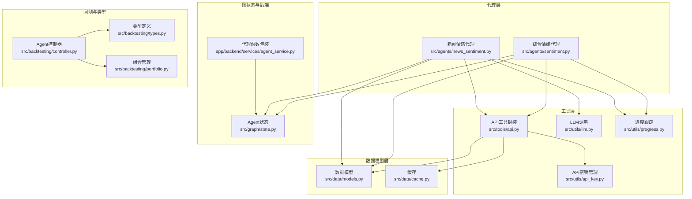
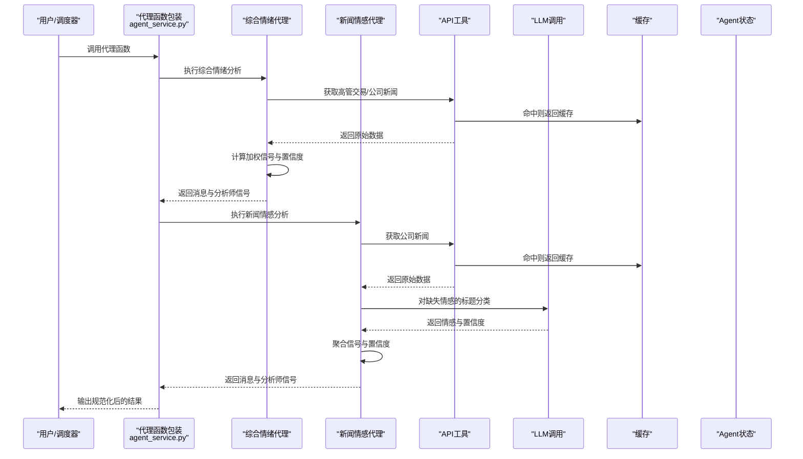
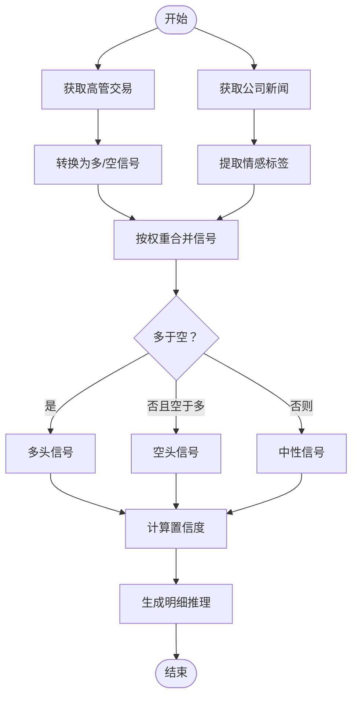
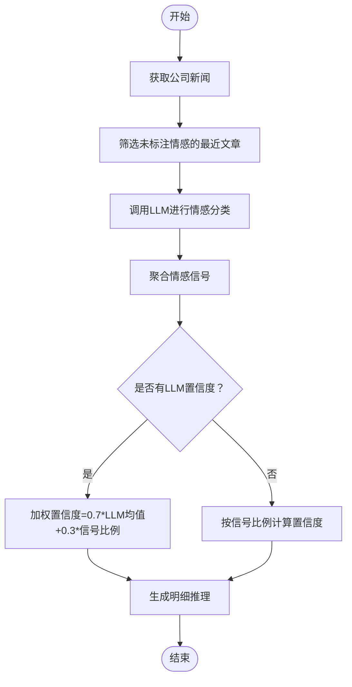
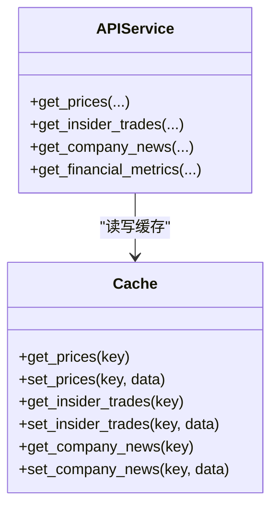
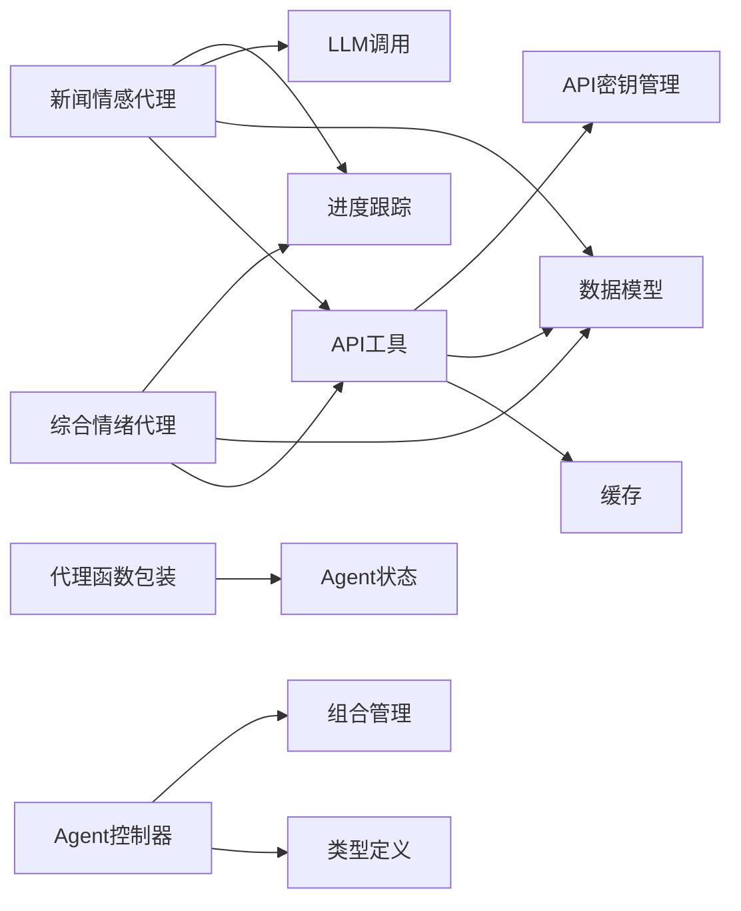
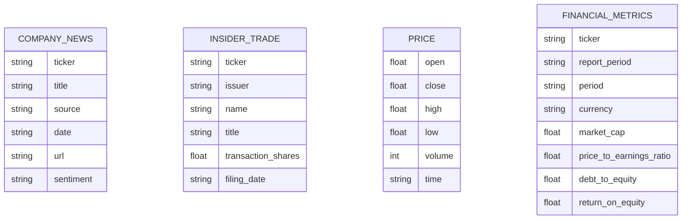

# 情绪分析代理

<cite>
**本文档引用的文件**
- [src/agents/sentiment.py](file://src/agents/sentiment.py)
- [src/agents/news_sentiment.py](file://src/agents/news_sentiment.py)
- [src/tools/api.py](file://src/tools/api.py)
- [src/data/models.py](file://src/data/models.py)
- [src/utils/llm.py](file://src/utils/llm.py)
- [src/utils/api_key.py](file://src/utils/api_key.py)
- [src/utils/progress.py](file://src/utils/progress.py)
- [src/graph/state.py](file://src/graph/state.py)
- [app/backend/services/agent_service.py](file://app/backend/services/agent_service.py)
- [src/backtesting/controller.py](file://src/backtesting/controller.py)
- [src/backtesting/types.py](file://src/backtesting/types.py)
- [src/backtesting/portfolio.py](file://src/backtesting/portfolio.py)
- [src/data/cache.py](file://src/data/cache.py)
</cite>

## 目录
1. [简介](#简介)
2. [项目结构](#项目结构)
3. [核心组件](#核心组件)
4. [架构总览](#架构总览)
5. [详细组件分析](#详细组件分析)
6. [依赖关系分析](#依赖关系分析)
7. [性能考量](#性能考量)
8. [故障排除指南](#故障排除指南)
9. [结论](#结论)
10. [附录](#附录)

## 简介
本文件系统性阐述“情绪分析代理”的设计与实现，覆盖新闻情感分析与市场情绪监测两大能力域。代理通过整合公开财经数据（公司新闻、高管交易等）与大语言模型（LLM），完成对多只股票的情绪信号生成与置信度评估；同时提供可复用的信号聚合、风险提示与回测对接能力，支撑后续投资决策与风控流程。

## 项目结构
围绕情绪分析代理的关键模块分布如下：
- 代理层：新闻情感代理与综合情绪代理
- 数据访问层：统一API工具封装与缓存
- 数据模型层：标准化返回结构
- 工具层：LLM调用、进度跟踪、API密钥管理
- 图状态与后端服务：LangGraph状态定义与代理函数包装
- 回测与类型：输出规范化、决策结构与组合管理

**图表来源**
- [src/agents/sentiment.py:12-139](file://src/agents/sentiment.py#L12-L139)
- [src/agents/news_sentiment.py:25-165](file://src/agents/news_sentiment.py#L25-L165)
- [src/tools/api.py:183-312](file://src/tools/api.py#L183-L312)
- [src/data/models.py:102-114](file://src/data/models.py#L102-L114)
- [src/utils/llm.py:10-84](file://src/utils/llm.py#L10-L84)
- [src/utils/api_key.py:3-9](file://src/utils/api_key.py#L3-L9)
- [src/utils/progress.py:44-64](file://src/utils/progress.py#L44-L64)
- [src/graph/state.py:15-19](file://src/graph/state.py#L15-L19)
- [app/backend/services/agent_service.py:5-13](file://app/backend/services/agent_service.py#L5-L13)
- [src/backtesting/controller.py:9-65](file://src/backtesting/controller.py#L9-L65)
- [src/backtesting/types.py:69-72](file://src/backtesting/types.py#L69-L72)
- [src/backtesting/portfolio.py:9-42](file://src/backtesting/portfolio.py#L9-L42)
- [src/data/cache.py:1-72](file://src/data/cache.py#L1-L72)

**章节来源**
- [src/agents/sentiment.py:12-139](file://src/agents/sentiment.py#L12-L139)
- [src/agents/news_sentiment.py:25-165](file://src/agents/news_sentiment.py#L25-L165)
- [src/tools/api.py:183-312](file://src/tools/api.py#L183-L312)
- [src/data/models.py:102-114](file://src/data/models.py#L102-L114)
- [src/utils/llm.py:10-84](file://src/utils/llm.py#L10-L84)
- [src/utils/api_key.py:3-9](file://src/utils/api_key.py#L3-L9)
- [src/utils/progress.py:44-64](file://src/utils/progress.py#L44-L64)
- [src/graph/state.py:15-19](file://src/graph/state.py#L15-L19)
- [app/backend/services/agent_service.py:5-13](file://app/backend/services/agent_service.py#L5-L13)
- [src/backtesting/controller.py:9-65](file://src/backtesting/controller.py#L9-L65)
- [src/backtesting/types.py:69-72](file://src/backtesting/types.py#L69-L72)
- [src/backtesting/portfolio.py:9-42](file://src/backtesting/portfolio.py#L9-L42)
- [src/data/cache.py:1-72](file://src/data/cache.py#L1-L72)

## 核心组件
- 综合情绪代理（insider交易+新闻）：基于权重融合两种信号，输出整体情绪与置信度，并提供明细推理。
- 新闻情感代理（LLM驱动）：对缺失情感标注的新闻标题进行分类，结合LLM置信度与信号比例计算最终置信度。
- API工具与缓存：统一拉取价格、财务指标、高管交易、公司新闻，并带分页与速率限制处理。
- 数据模型：标准化返回结构，便于跨模块传递。
- LLM调用：结构化输出、重试与默认响应保障。
- 进度跟踪：可视化展示各代理在不同股票上的执行状态。
- 后端代理包装：为LangGraph构造可调用的代理函数。
- 回测控制器：规范化代理输出，确保决策与分析师信号的兼容格式。

**章节来源**
- [src/agents/sentiment.py:12-139](file://src/agents/sentiment.py#L12-L139)
- [src/agents/news_sentiment.py:25-165](file://src/agents/news_sentiment.py#L25-L165)
- [src/tools/api.py:183-312](file://src/tools/api.py#L183-L312)
- [src/data/models.py:102-114](file://src/data/models.py#L102-L114)
- [src/utils/llm.py:10-84](file://src/utils/llm.py#L10-L84)
- [src/utils/progress.py:44-64](file://src/utils/progress.py#L44-L64)
- [app/backend/services/agent_service.py:5-13](file://app/backend/services/agent_service.py#L5-L13)
- [src/backtesting/controller.py:9-65](file://src/backtesting/controller.py#L9-L65)

## 架构总览
情绪分析代理采用“数据获取—信号生成—置信度评估—结果封装”的流水线式设计，支持多股票并行处理与可插拔的信号源。

**图表来源**
- [app/backend/services/agent_service.py:5-13](file://app/backend/services/agent_service.py#L5-L13)
- [src/agents/sentiment.py:12-139](file://src/agents/sentiment.py#L12-L139)
- [src/agents/news_sentiment.py:25-165](file://src/agents/news_sentiment.py#L25-L165)
- [src/tools/api.py:183-312](file://src/tools/api.py#L183-L312)
- [src/utils/llm.py:10-84](file://src/utils/llm.py#L10-L84)
- [src/data/cache.py:1-72](file://src/data/cache.py#L1-L72)
- [src/graph/state.py:15-19](file://src/graph/state.py#L15-L19)

## 详细组件分析

### 综合情绪代理（insider交易+新闻）
- 输入：多只股票、结束日期、API密钥
- 处理流程：
  - 获取高管交易，统计多空信号数量
  - 获取公司新闻，提取情感标签
  - 使用固定权重融合两类信号
  - 计算置信度：基于加权信号占比
- 输出：每只股票的整体信号（多/空/中性）、置信度与明细推理

**图表来源**
- [src/agents/sentiment.py:18-75](file://src/agents/sentiment.py#L18-L75)

**章节来源**
- [src/agents/sentiment.py:12-139](file://src/agents/sentiment.py#L12-L139)

### 新闻情感代理（LLM驱动）
- 输入：多只股票、结束日期、API密钥
- 处理流程：
  - 获取公司新闻，筛选最近若干篇未标注情感的新闻
  - 对缺失情感的标题调用LLM进行情感分类与置信度评分
  - 聚合所有文章的情感信号，计算整体信号与置信度
- 置信度策略：
  - 若有LLM分类：70%来自匹配信号的LLM平均置信度 + 30%来自信号比例
  - 无LLM分类：仅使用信号比例

**图表来源**
- [src/agents/news_sentiment.py:60-121](file://src/agents/news_sentiment.py#L60-L121)
- [src/agents/news_sentiment.py:167-222](file://src/agents/news_sentiment.py#L167-L222)
- [src/utils/llm.py:10-84](file://src/utils/llm.py#L10-L84)

**章节来源**
- [src/agents/news_sentiment.py:25-165](file://src/agents/news_sentiment.py#L25-L165)
- [src/utils/llm.py:10-84](file://src/utils/llm.py#L10-L84)

### 数据获取与缓存
- 统一API封装：提供价格、财务指标、高管交易、公司新闻接口，内置分页与速率限制
- 缓存策略：按参数组合键缓存，避免重复请求；合并新增数据去重
- 错误处理：统一的重试与降级逻辑

**图表来源**
- [src/data/cache.py:1-72](file://src/data/cache.py#L1-L72)
- [src/tools/api.py:63-312](file://src/tools/api.py#L63-L312)

**章节来源**
- [src/tools/api.py:183-312](file://src/tools/api.py#L183-L312)
- [src/data/cache.py:1-72](file://src/data/cache.py#L1-L72)

### LLM调用与结构化输出
- 结构化输出：根据模型能力自动选择JSON模式或手动解析
- 重试与默认响应：失败时返回安全默认值，保证流程稳定性
- 代理配置：从状态中提取模型名称与提供商，支持全局回退

**章节来源**
- [src/utils/llm.py:10-84](file://src/utils/llm.py#L10-L84)
- [src/utils/llm.py:124-148](file://src/utils/llm.py#L124-L148)

### 进度跟踪与可视化
- 实时状态：记录每个代理在不同股票上的当前步骤与时间戳
- 可视化表格：富文本显示代理状态、股票与进度
- 分析摘要：在完成时输出结构化推理内容

**章节来源**
- [src/utils/progress.py:44-64](file://src/utils/progress.py#L44-L64)
- [src/utils/progress.py:74-113](file://src/utils/progress.py#L74-L113)
- [src/graph/state.py:21-52](file://src/graph/state.py#L21-L52)

### 后端代理包装与回测对接
- 代理函数包装：为LangGraph构造带agent_id的可调用函数
- 输出规范化：统一决策与分析师信号格式，确保回测兼容
- 组合管理：提供长/短仓与保证金占用的组合状态快照

**章节来源**
- [app/backend/services/agent_service.py:5-13](file://app/backend/services/agent_service.py#L5-L13)
- [src/backtesting/controller.py:9-65](file://src/backtesting/controller.py#L9-L65)
- [src/backtesting/types.py:69-72](file://src/backtesting/types.py#L69-L72)
- [src/backtesting/portfolio.py:44-65](file://src/backtesting/portfolio.py#L44-L65)

## 依赖关系分析
- 低耦合高内聚：代理仅依赖API工具与通用工具，不直接依赖具体外部服务
- 可扩展性：新增信号源只需在代理中添加数据获取与聚合逻辑
- 类型一致性：统一的数据模型与状态结构，降低跨模块集成成本

**图表来源**
- [src/agents/sentiment.py:12-139](file://src/agents/sentiment.py#L12-L139)
- [src/agents/news_sentiment.py:25-165](file://src/agents/news_sentiment.py#L25-L165)
- [src/tools/api.py:183-312](file://src/tools/api.py#L183-L312)
- [src/data/models.py:102-114](file://src/data/models.py#L102-L114)
- [src/utils/llm.py:10-84](file://src/utils/llm.py#L10-L84)
- [src/utils/api_key.py:3-9](file://src/utils/api_key.py#L3-L9)
- [src/utils/progress.py:44-64](file://src/utils/progress.py#L44-L64)
- [app/backend/services/agent_service.py:5-13](file://app/backend/services/agent_service.py#L5-L13)
- [src/backtesting/controller.py:9-65](file://src/backtesting/controller.py#L9-L65)
- [src/backtesting/types.py:69-72](file://src/backtesting/types.py#L69-L72)
- [src/backtesting/portfolio.py:44-65](file://src/backtesting/portfolio.py#L44-L65)

**章节来源**
- [src/agents/sentiment.py:12-139](file://src/agents/sentiment.py#L12-L139)
- [src/agents/news_sentiment.py:25-165](file://src/agents/news_sentiment.py#L25-L165)
- [src/tools/api.py:183-312](file://src/tools/api.py#L183-L312)
- [src/data/models.py:102-114](file://src/data/models.py#L102-L114)
- [src/utils/llm.py:10-84](file://src/utils/llm.py#L10-L84)
- [src/utils/api_key.py:3-9](file://src/utils/api_key.py#L3-L9)
- [src/utils/progress.py:44-64](file://src/utils/progress.py#L44-L64)
- [app/backend/services/agent_service.py:5-13](file://app/backend/services/agent_service.py#L5-L13)
- [src/backtesting/controller.py:9-65](file://src/backtesting/controller.py#L9-L65)
- [src/backtesting/types.py:69-72](file://src/backtesting/types.py#L69-L72)
- [src/backtesting/portfolio.py:44-65](file://src/backtesting/portfolio.py#L44-L65)

## 性能考量
- 缓存命中率：通过精确的参数组合键提升缓存命中，减少重复网络请求
- LLM调用控制：限制对缺失情感文章的数量与范围，平衡成本与质量
- 并行处理：代理按股票维度并行推进，充分利用I/O等待时间
- 速率限制：API封装内置退避与重试，避免被限流中断
- 内存与序列化：进度跟踪与推理输出采用轻量结构，避免大对象频繁拷贝

[本节为通用性能建议，无需特定文件引用]

## 故障排除指南
- LLM调用失败：检查模型配置与API密钥；查看重试日志；必要时启用默认响应
- API限流：观察429错误与退避行为；适当调整请求频率或增加密钥
- 数据为空：确认时间窗口与股票列表；检查缓存是否过期
- 状态显示异常：确认进度跟踪实例已启动；检查更新处理器注册

**章节来源**
- [src/utils/llm.py:58-84](file://src/utils/llm.py#L58-L84)
- [src/tools/api.py:29-61](file://src/tools/api.py#L29-L61)
- [src/utils/progress.py:32-43](file://src/utils/progress.py#L32-L43)

## 结论
该情绪分析代理以“数据+模型”的双通道设计，实现了对多股票的实时情绪信号生成与置信度评估。通过统一的API封装、缓存与LLM调用机制，既保证了性能也兼顾了可扩展性。配合回测控制器与组合管理，可无缝衔接至更广泛的交易与风控体系。

[本节为总结性内容，无需特定文件引用]

## 附录

### 数据模型概览

**图表来源**
- [src/data/models.py:102-114](file://src/data/models.py#L102-L114)
- [src/data/models.py:82-99](file://src/data/models.py#L82-L99)
- [src/data/models.py:4-11](file://src/data/models.py#L4-L11)
- [src/data/models.py:18-62](file://src/data/models.py#L18-L62)