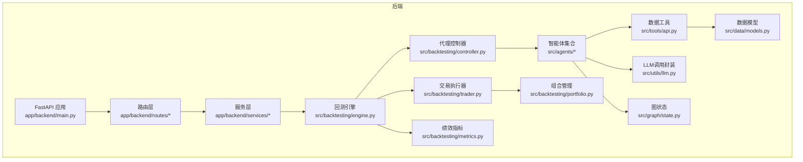
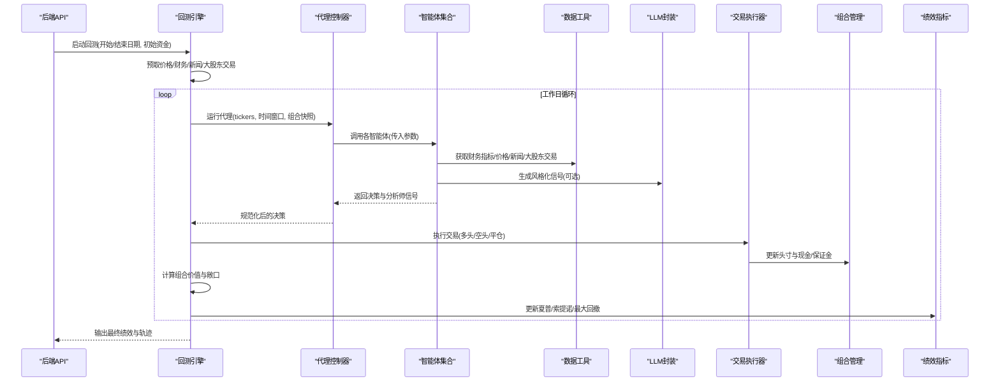
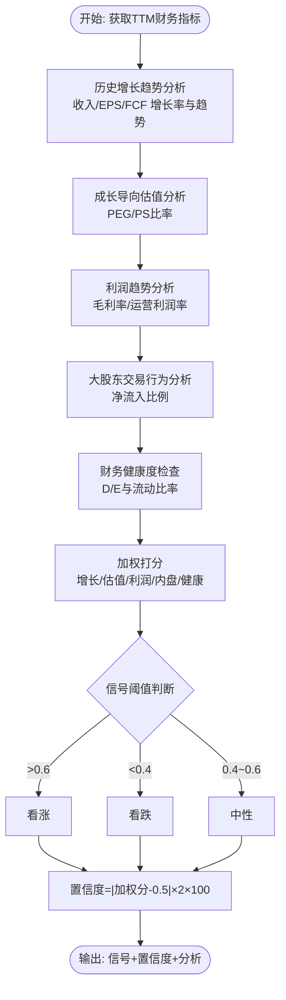
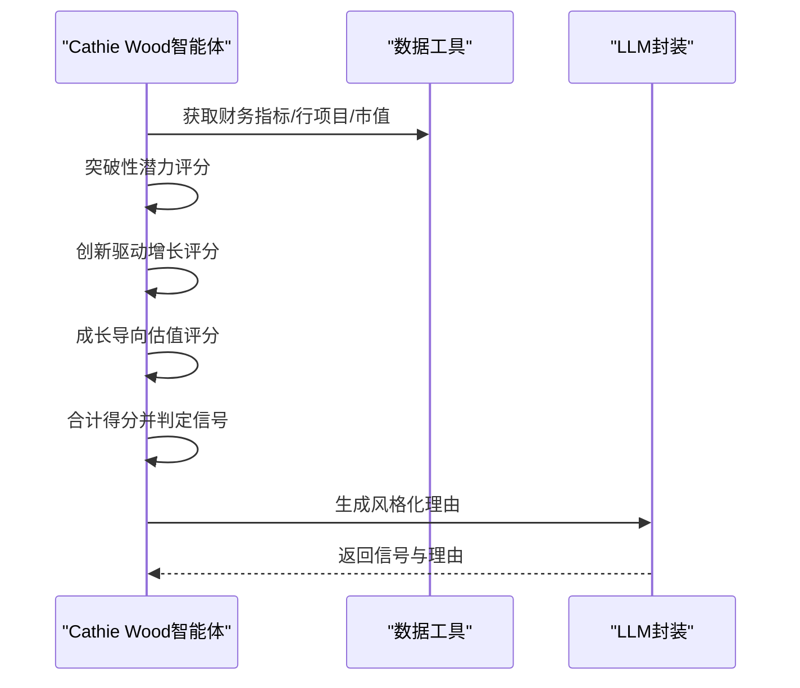
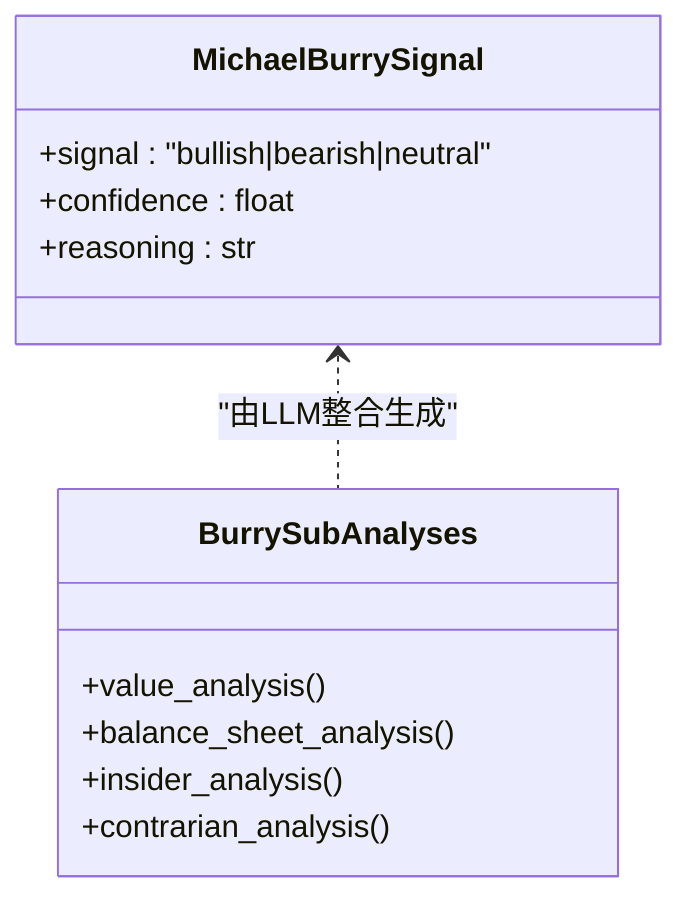
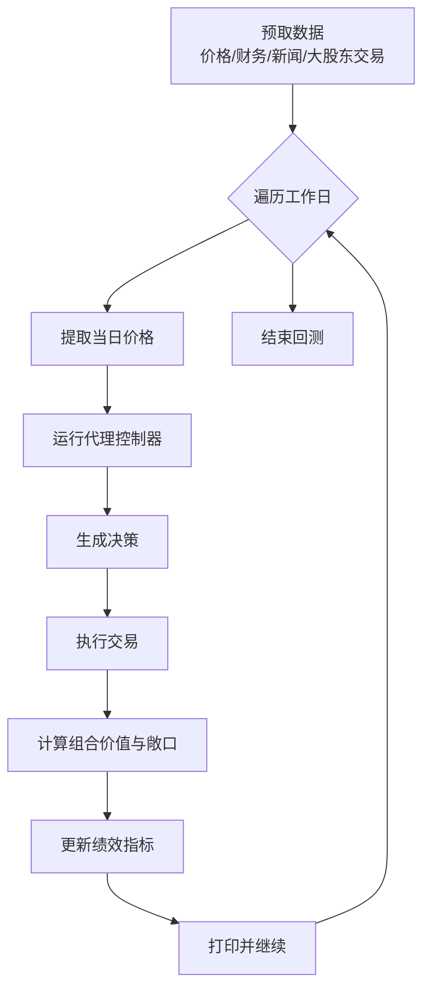
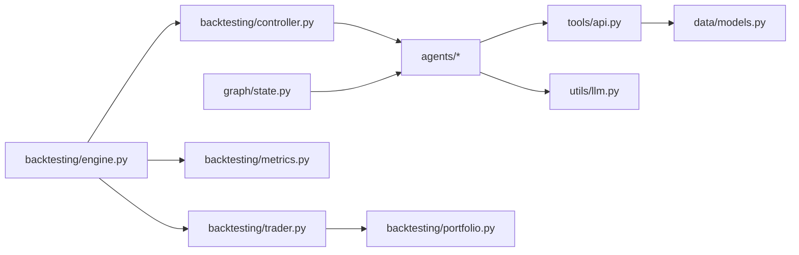

# 成长投资代理

<cite>
**本文档引用的文件**
- [src/agents/growth_agent.py](file://src/agents/growth_agent.py)
- [src/agents/cathie_wood.py](file://src/agents/cathie_wood.py)
- [src/agents/michael_burry.py](file://src/agents/michael_burry.py)
- [src/backtesting/engine.py](file://src/backtesting/engine.py)
- [src/backtesting/portfolio.py](file://src/backtesting/portfolio.py)
- [src/backtesting/controller.py](file://src/backtesting/controller.py)
- [src/backtesting/trader.py](file://src/backtesting/trader.py)
- [src/backtesting/metrics.py](file://src/backtesting/metrics.py)
- [src/graph/state.py](file://src/graph/state.py)
- [src/tools/api.py](file://src/tools/api.py)
- [src/utils/llm.py](file://src/utils/llm.py)
- [src/data/models.py](file://src/data/models.py)
- [app/backend/main.py](file://app/backend/main.py)
</cite>

## 目录
1. [简介](#简介)
2. [项目结构](#项目结构)
3. [核心组件](#核心组件)
4. [架构总览](#架构总览)
5. [详细组件分析](#详细组件分析)
6. [依赖分析](#依赖分析)
7. [性能考虑](#性能考虑)
8. [故障排除指南](#故障排除指南)
9. [结论](#结论)
10. [附录](#附录)

## 简介
本文件面向以Michael Burry、Cathie Wood等为代表的“成长投资”理念代理，系统化阐述如何在该AI对冲基金框架中实现成长股识别、PEG比率分析与增长潜力评估，并覆盖高增长低估值策略、行业趋势与技术创新评估、风险管理与退出策略、筛选标准、财务指标分析与市场时机把握。文档同时提供Backtest引擎与交易执行流程的实现细节，以及可复用的投资案例与落地建议。

## 项目结构
该项目采用前后端分离与模块化设计：后端使用FastAPI提供API服务；前端为React/Vite应用；核心逻辑位于Python后端的agents（智能体）、backtesting（回测）、tools（数据工具）、utils（通用工具）与data（数据模型）等子包。成长投资代理通过agents中的多个智能体协同工作，结合外部金融数据API与LLM推理，输出投资信号与理由。

图表来源
- [app/backend/main.py:15-56](file://app/backend/main.py#L15-L56)
- [src/backtesting/engine.py:27-195](file://src/backtesting/engine.py#L27-L195)
- [src/backtesting/controller.py:9-68](file://src/backtesting/controller.py#L9-L68)
- [src/backtesting/trader.py:7-40](file://src/backtesting/trader.py#L7-L40)
- [src/backtesting/portfolio.py:9-196](file://src/backtesting/portfolio.py#L9-L196)
- [src/backtesting/metrics.py:8-78](file://src/backtesting/metrics.py#L8-L78)
- [src/agents/growth_agent.py:19-132](file://src/agents/growth_agent.py#L19-L132)
- [src/agents/cathie_wood.py:19-108](file://src/agents/cathie_wood.py#L19-L108)
- [src/agents/michael_burry.py:32-158](file://src/agents/michael_burry.py#L32-L158)
- [src/tools/api.py:63-367](file://src/tools/api.py#L63-L367)
- [src/utils/llm.py:10-148](file://src/utils/llm.py#L10-L148)
- [src/graph/state.py:14-52](file://src/graph/state.py#L14-L52)
- [src/data/models.py:18-175](file://src/data/models.py#L18-L175)

章节来源
- [app/backend/main.py:15-56](file://app/backend/main.py#L15-L56)
- [src/backtesting/engine.py:27-195](file://src/backtesting/engine.py#L27-L195)

## 核心组件
- 成长分析智能体（growth_analyst_agent）
  - 基于TTM财务指标的历史趋势、PEG比率、毛利率/运营利润率趋势、大股东交易行为与财务健康度进行加权打分，输出看涨/中性/看跌信号与置信度。
- Cathie Wood风格智能体（cathie_wood_agent）
  - 聚焦颠覆式技术、大规模市场与创新增长，结合R&D强度、自由现金流、运营效率与长期估值场景，生成风格化的投资信号。
- Michael Burry风格智能体（michael_burry_agent）
  - 深度价值与逆向视角，关注自由现金流收益率、EV/EBIT、资产负债表质量、大股东交易与负面新闻情绪，输出数据驱动的信号。
- 回测引擎（BacktestEngine）
  - 驱动日频回测循环，拉取价格与财务数据，运行代理控制器，执行交易，计算组合价值与风险指标。
- 组合管理（Portfolio）
  - 支持多标的多头/空头头寸、成本基础跟踪与保证金占用，提供买入/卖出/做空/平仓执行。
- 数据工具（Tools API）
  - 封装价格、财务指标、个股新闻、大股东交易与市值查询，含缓存与速率限制处理。
- LLM调用封装（call_llm）
  - 结构化输出、重试与错误降级，支持不同模型的JSON模式或内容解析。

章节来源
- [src/agents/growth_agent.py:19-132](file://src/agents/growth_agent.py#L19-L132)
- [src/agents/cathie_wood.py:19-108](file://src/agents/cathie_wood.py#L19-L108)
- [src/agents/michael_burry.py:32-158](file://src/agents/michael_burry.py#L32-L158)
- [src/backtesting/engine.py:27-195](file://src/backtesting/engine.py#L27-L195)
- [src/backtesting/portfolio.py:9-196](file://src/backtesting/portfolio.py#L9-L196)
- [src/tools/api.py:63-367](file://src/tools/api.py#L63-L367)
- [src/utils/llm.py:10-148](file://src/utils/llm.py#L10-L148)

## 架构总览
下图展示从API到智能体、再到回测与交易执行的整体流程，体现“数据获取—智能体分析—信号聚合—交易执行—组合估值—绩效评估”的闭环。

图表来源
- [src/backtesting/engine.py:96-195](file://src/backtesting/engine.py#L96-L195)
- [src/backtesting/controller.py:12-65](file://src/backtesting/controller.py#L12-L65)
- [src/backtesting/trader.py:10-37](file://src/backtesting/trader.py#L10-L37)
- [src/backtesting/portfolio.py:82-194](file://src/backtesting/portfolio.py#L82-L194)
- [src/backtesting/metrics.py:22-75](file://src/backtesting/metrics.py#L22-L75)
- [src/agents/growth_agent.py:19-132](file://src/agents/growth_agent.py#L19-L132)
- [src/agents/cathie_wood.py:19-108](file://src/agents/cathie_wood.py#L19-L108)
- [src/agents/michael_burry.py:32-158](file://src/agents/michael_burry.py#L32-L158)
- [src/tools/api.py:63-367](file://src/tools/api.py#L63-L367)
- [src/utils/llm.py:10-148](file://src/utils/llm.py#L10-L148)

## 详细组件分析

### 成长分析智能体（growth_analyst_agent）
- 输入：股票池、截止日期、API密钥
- 关键步骤
  - 获取TTM财务指标（最近12期），检查数量是否足够
  - 获取大股东交易数据
  - 子分析模块
    - 历史增长趋势：收入、EPS、自由现金流增长率与趋势斜率
    - 成长导向估值：PEG比率与PS比率
    - 毛利率/运营利润率趋势与健康水平
    - 大股东交易行为（净流入比例）
    - 财务健康度（资产负债与流动性）
  - 加权打分与信号生成：权重分别为增长40%、估值25%、利润趋势15%、大股东10%、财务健康10%
  - 输出：信号（看涨/中性/看跌）、置信度、详细分析
- PEG比率与增长潜力评估
  - 使用PEG比率与PS比率作为“高增长低估值”的量化指标，配合历史增长趋势与利润扩张趋势，形成稳健的筛选与排序依据
- 风险管理要点
  - 财务健康度扣分项（高杠杆、低流动比率）降低整体评分
  - 大股东净买入比例作为“内部人信心”指标，显著提升信号可信度

图表来源
- [src/agents/growth_agent.py:160-338](file://src/agents/growth_agent.py#L160-L338)

章节来源
- [src/agents/growth_agent.py:19-132](file://src/agents/growth_agent.py#L19-L132)
- [src/agents/growth_agent.py:160-338](file://src/agents/growth_agent.py#L160-L338)

### Cathie Wood风格智能体（cathie_wood_agent）
- 投资原则映射
  - 突破性技术/商业模式优先
  - 快速采用曲线与巨大TAM
  - 重点布局AI、机器人、基因测序、金融科技与区块链
  - 接受短期波动换取长期回报
- 分析维度
  - 突破性潜力：收入加速、毛利率扩张、经营杠杆、研发强度
  - 创新驱动增长：研发支出趋势与强度、自由现金流、运营效率、资本配置、再投资倾向
  - 成长导向估值：基于自由现金流的高增长情景折现，计算安全边际
- LLM生成风格化输出，强调未来愿景、技术护城河与市场空间
- 信号阈值：三类得分之和归一化后按比例判定

图表来源
- [src/agents/cathie_wood.py:19-108](file://src/agents/cathie_wood.py#L19-L108)
- [src/agents/cathie_wood.py:111-360](file://src/agents/cathie_wood.py#L111-L360)
- [src/utils/llm.py:10-148](file://src/utils/llm.py#L10-L148)

章节来源
- [src/agents/cathie_wood.py:19-108](file://src/agents/cathie_wood.py#L19-L108)
- [src/agents/cathie_wood.py:111-360](file://src/agents/cathie_wood.py#L111-L360)
- [src/utils/llm.py:10-148](file://src/utils/llm.py#L10-L148)

### Michael Burry风格智能体（michael_burry_agent）
- 深度价值与逆向视角
  - 自由现金流收益率、EV/EBIT、资产负债表质量、大股东交易、负面新闻情绪
- 评分与信号
  - 各维度独立打分，合计后按比例阈值判定
  - LLM以简洁的数据驱动风格输出理由
- 适用场景
  - 在市场过度悲观时寻找被低估且基本面稳健的标的

图表来源
- [src/agents/michael_burry.py:24-30](file://src/agents/michael_burry.py#L24-L30)
- [src/agents/michael_burry.py:173-310](file://src/agents/michael_burry.py#L173-L310)

章节来源
- [src/agents/michael_burry.py:32-158](file://src/agents/michael_burry.py#L32-L158)
- [src/agents/michael_burry.py:173-310](file://src/agents/michael_burry.py#L173-L310)

### 回测引擎与交易执行
- 回测循环
  - 预取价格、财务、新闻与大股东交易
  - 日频推进，按月回看窗口提取价格序列
  - 代理控制器规范化输出，交易执行器执行买卖/做空/平仓
  - 计算组合总值与多维敞口，更新每日轨迹
  - 性能指标（夏普、索提诺、最大回撤）滚动更新
- 组合管理
  - 支持多标多头/空头，记录成本基础与已实现损益
  - 保证金占用与维持要求，确保风控约束
- 数据工具
  - 缓存与速率限制处理，统一返回Pydantic模型

图表来源
- [src/backtesting/engine.py:96-195](file://src/backtesting/engine.py#L96-L195)
- [src/backtesting/controller.py:12-65](file://src/backtesting/controller.py#L12-L65)
- [src/backtesting/trader.py:10-37](file://src/backtesting/trader.py#L10-L37)
- [src/backtesting/portfolio.py:82-194](file://src/backtesting/portfolio.py#L82-L194)
- [src/backtesting/metrics.py:22-75](file://src/backtesting/metrics.py#L22-L75)
- [src/tools/api.py:63-367](file://src/tools/api.py#L63-L367)

章节来源
- [src/backtesting/engine.py:27-195](file://src/backtesting/engine.py#L27-L195)
- [src/backtesting/portfolio.py:9-196](file://src/backtesting/portfolio.py#L9-L196)
- [src/backtesting/controller.py:9-68](file://src/backtesting/controller.py#L9-L68)
- [src/backtesting/trader.py:7-40](file://src/backtesting/trader.py#L7-L40)
- [src/backtesting/metrics.py:8-78](file://src/backtesting/metrics.py#L8-L78)
- [src/tools/api.py:63-367](file://src/tools/api.py#L63-L367)

## 依赖分析
- 模块耦合
  - agents依赖tools与utils.llm；backtesting组件之间松耦合，通过接口与类型定义交互
  - data.models提供统一的数据结构，贯穿API、agents与backtesting
- 外部依赖
  - 金融数据API（价格、财务、新闻、大股东交易、公司事实）
  - LLM服务（OpenAI等），通过结构化输出与重试机制保障稳定性
- 循环依赖
  - 未发现直接循环导入；状态与工具通过函数参数传递避免循环

图表来源
- [src/agents/growth_agent.py:14-17](file://src/agents/growth_agent.py#L14-L17)
- [src/agents/cathie_wood.py:1-11](file://src/agents/cathie_wood.py#L1-L11)
- [src/agents/michael_burry.py:12-21](file://src/agents/michael_burry.py#L12-L21)
- [src/backtesting/engine.py:18-24](file://src/backtesting/engine.py#L18-L24)
- [src/backtesting/controller.py:3-6](file://src/backtesting/controller.py#L3-L6)
- [src/backtesting/trader.py:3-4](file://src/backtesting/trader.py#L3-L4)
- [src/backtesting/portfolio.py:3-7](file://src/backtesting/portfolio.py#L3-L7)
- [src/backtesting/metrics.py:3-6](file://src/backtesting/metrics.py#L3-L6)
- [src/tools/api.py:10-23](file://src/tools/api.py#L10-L23)
- [src/graph/state.py:14-18](file://src/graph/state.py#L14-L18)
- [src/data/models.py:18-175](file://src/data/models.py#L18-L175)

章节来源
- [src/agents/growth_agent.py:14-17](file://src/agents/growth_agent.py#L14-L17)
- [src/agents/cathie_wood.py:1-11](file://src/agents/cathie_wood.py#L1-L11)
- [src/agents/michael_burry.py:12-21](file://src/agents/michael_burry.py#L12-L21)
- [src/backtesting/engine.py:18-24](file://src/backtesting/engine.py#L18-L24)
- [src/backtesting/controller.py:3-6](file://src/backtesting/controller.py#L3-L6)
- [src/backtesting/trader.py:3-4](file://src/backtesting/trader.py#L3-L4)
- [src/backtesting/portfolio.py:3-7](file://src/backtesting/portfolio.py#L3-L7)
- [src/backtesting/metrics.py:3-6](file://src/backtesting/metrics.py#L3-L6)
- [src/tools/api.py:10-23](file://src/tools/api.py#L10-L23)
- [src/graph/state.py:14-18](file://src/graph/state.py#L14-L18)
- [src/data/models.py:18-175](file://src/data/models.py#L18-L175)

## 性能考虑
- 数据获取与缓存
  - 通过统一缓存接口减少重复请求，提高回测效率
- 速率限制与退避
  - API请求包含线性退避与重试，避免429限流导致的中断
- 回测时间复杂度
  - 日频循环与多标处理，建议控制回测区间与标的数量，必要时并行化数据预取
- 组合与交易
  - 交易执行与组合估值在每日循环中完成，注意避免频繁微小交易带来的摩擦成本

## 故障排除指南
- LLM调用失败
  - 检查模型配置与API密钥；启用默认降级响应，确保输出结构化
- API请求异常
  - 查看速率限制提示与重试日志；确认环境变量中API Key正确
- 回测中断
  - 检查缺失价格数据或空结果；回测引擎会跳过不完整数据的日期
- 信号为空或异常
  - 检查智能体输入数据（财务指标数量不足、字段缺失）与阈值设置

章节来源
- [src/utils/llm.py:58-84](file://src/utils/llm.py#L58-L84)
- [src/tools/api.py:29-61](file://src/tools/api.py#L29-L61)
- [src/backtesting/engine.py:114-130](file://src/backtesting/engine.py#L114-L130)

## 结论
本项目提供了可扩展的成长投资代理体系：以成长分析智能体为核心，融合Cathie Wood与Michael Burry的不同风格，结合回测引擎与交易执行，形成从数据到信号再到实盘的完整闭环。通过PEG比率、增长趋势、利润扩张、内盘动向与财务健康度等多维指标，辅以LLM风格化输出，既满足学术严谨性也兼顾实战可操作性。建议在实际部署中强化风控参数校准、动态阈值与压力测试，持续迭代以适配不同市场周期。

## 附录

### 成长股筛选标准与财务指标
- 历史增长趋势
  - 收入、EPS、自由现金流年同比与趋势斜率
- 成长导向估值
  - PEG比率、PS比率
- 利润扩张
  - 毛利率、运营利润率趋势与绝对水平
- 内部人信心
  - 大股东净买入比例
- 财务健康度
  - 资产负债率、流动比率

章节来源
- [src/agents/growth_agent.py:160-338](file://src/agents/growth_agent.py#L160-L338)

### 高增长低估值策略与市场时机
- 高增长低估值
  - 以PEG<1、PS<合理区间为初筛，叠加收入与EPS加速与利润扩张趋势
- 行业趋势与技术创新
  - 通过Cathie Wood智能体评估颠覆性技术与TAM，结合新闻与研报情绪
- 市场时机
  - 回测引擎按日推进，结合技术面与宏观事件窗口选择建仓/减仓节点

章节来源
- [src/agents/cathie_wood.py:111-360](file://src/agents/cathie_wood.py#L111-L360)
- [src/backtesting/engine.py:96-195](file://src/backtesting/engine.py#L96-L195)

### 风险管理与退出策略
- 风险管理
  - 财务健康度扣分、杠杆上限、流动性监控
- 退出策略
  - 止损（基于最大回撤目标）、止盈（PEG回归均值、估值倍数压缩）、动态再平衡

章节来源
- [src/agents/growth_agent.py:310-338](file://src/agents/growth_agent.py#L310-L338)
- [src/backtesting/metrics.py:22-75](file://src/backtesting/metrics.py#L22-L75)

### 实际投资案例与实现细节
- 案例路径
  - 使用回测引擎加载代理控制器，传入目标股票池与时间窗口，查看每日轨迹与最终绩效
- 实现要点
  - 在代理控制器中规范化输出，确保交易执行器可读取动作与数量
  - 通过LLM封装生成风格化理由，便于审计与复盘

章节来源
- [src/backtesting/engine.py:132-141](file://src/backtesting/engine.py#L132-L141)
- [src/backtesting/controller.py:40-65](file://src/backtesting/controller.py#L40-L65)
- [src/utils/llm.py:10-148](file://src/utils/llm.py#L10-L148)