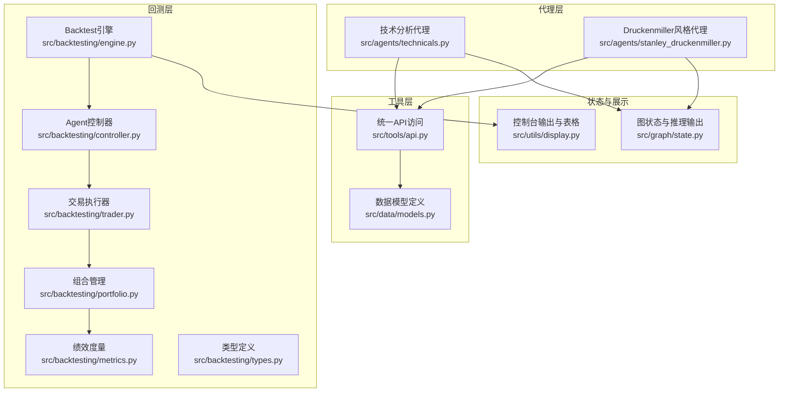
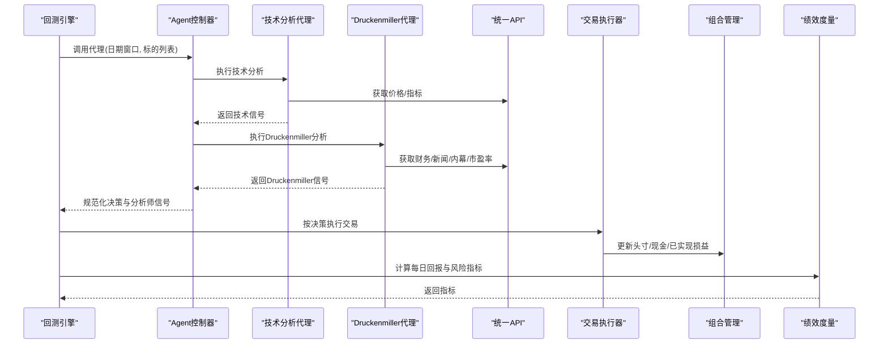
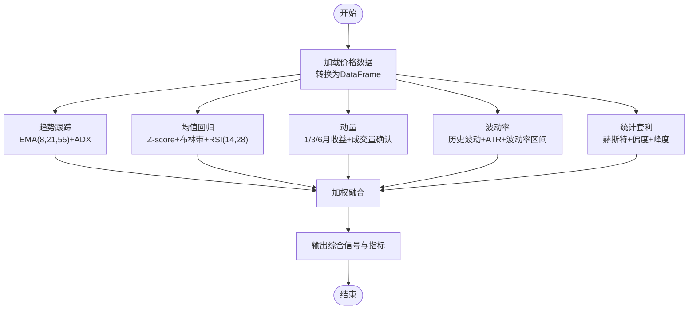
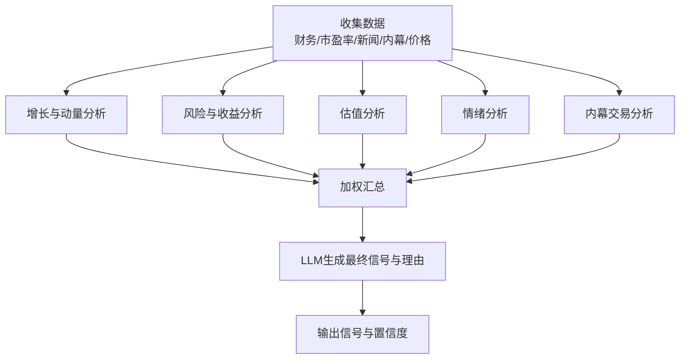
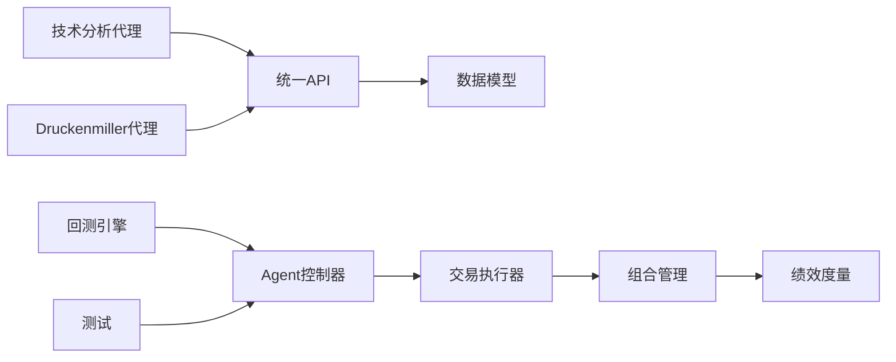
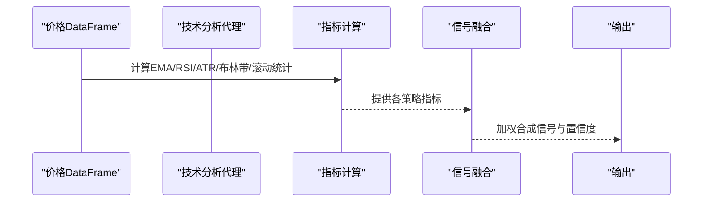

# 技术分析代理

<cite>
**本文档引用的文件**
- [src/agents/technicals.py](file://src/agents/technicals.py)
- [src/agents/stanley_druckenmiller.py](file://src/agents/stanley_druckenmiller.py)
- [src/backtesting/engine.py](file://src/backtesting/engine.py)
- [src/backtesting/controller.py](file://src/backtesting/controller.py)
- [src/backtesting/trader.py](file://src/backtesting/trader.py)
- [src/backtesting/portfolio.py](file://src/backtesting/portfolio.py)
- [src/backtesting/metrics.py](file://src/backtesting/metrics.py)
- [src/backtesting/types.py](file://src/backtesting/types.py)
- [src/tools/api.py](file://src/tools/api.py)
- [src/data/models.py](file://src/data/models.py)
- [src/graph/state.py](file://src/graph/state.py)
- [src/utils/display.py](file://src/utils/display.py)
- [tests/backtesting/test_controller.py](file://tests/backtesting/test_controller.py)
</cite>

## 目录
1. [引言](#引言)
2. [项目结构](#项目结构)
3. [核心组件](#核心组件)
4. [架构总览](#架构总览)
5. [详细组件分析](#详细组件分析)
6. [依赖分析](#依赖分析)
7. [性能考虑](#性能考虑)
8. [故障排除指南](#故障排除指南)
9. [结论](#结论)
10. [附录](#附录)

## 引言
本文件面向以Stanley Druckenmiller为代表的量化技术分析代理，系统阐述其在AI对冲基金平台中的实现与应用。内容覆盖技术指标计算（移动平均线、RSI、MACD等）、价格趋势分析、交易信号生成、趋势跟踪策略、支撑阻力位分析、成交量确认、参数配置、信号过滤与风险管理，并提供算法实现路径与实证测试方法。

## 项目结构
技术分析代理位于后端Python代码中，围绕“代理-回测-执行-度量”闭环组织：
- 代理层：技术分析代理与Druckenmiller风格代理负责信号生成
- 工具层：统一API访问与数据缓存
- 回测层：引擎、控制器、交易执行、组合管理与绩效度量
- 可视化与状态：前端展示与推理输出格式化

**图表来源**
- [src/agents/technicals.py:35-157](file://src/agents/technicals.py#L35-L157)
- [src/agents/stanley_druckenmiller.py:26-163](file://src/agents/stanley_druckenmiller.py#L26-L163)
- [src/tools/api.py:63-367](file://src/tools/api.py#L63-L367)
- [src/backtesting/engine.py:27-195](file://src/backtesting/engine.py#L27-L195)
- [src/backtesting/controller.py:9-68](file://src/backtesting/controller.py#L9-L68)
- [src/backtesting/trader.py:7-40](file://src/backtesting/trader.py#L7-L40)
- [src/backtesting/portfolio.py:9-196](file://src/backtesting/portfolio.py#L9-L196)
- [src/backtesting/metrics.py:8-78](file://src/backtesting/metrics.py#L8-L78)
- [src/backtesting/types.py:10-106](file://src/backtesting/types.py#L10-L106)
- [src/graph/state.py:15-52](file://src/graph/state.py#L15-L52)
- [src/utils/display.py:17-396](file://src/utils/display.py#L17-L396)

**章节来源**
- [src/agents/technicals.py:35-157](file://src/agents/technicals.py#L35-L157)
- [src/agents/stanley_druckenmiller.py:26-163](file://src/agents/stanley_druckenmiller.py#L26-L163)
- [src/backtesting/engine.py:27-195](file://src/backtesting/engine.py#L27-L195)

## 核心组件
- 技术分析代理：多策略融合（趋势跟踪、均值回归、动量、波动率、统计套利），输出加权综合信号与明细指标
- Druckenmiller风格代理：基于增长/动量、风险收益、估值、情绪与内幕交易的综合打分，再由LLM生成决策信号
- 统一API访问：封装价格、财务、新闻、内幕交易等数据获取与缓存
- 回测引擎：按工作日推进，预取数据，调用代理，执行交易，计算组合价值与暴露，更新绩效指标
- 组合管理：支持多标的长仓/短仓，成本基础与已实现损益追踪
- 绩效度量：夏普比率、索提诺比率、最大回撤等

**章节来源**
- [src/agents/technicals.py:35-157](file://src/agents/technicals.py#L35-L157)
- [src/agents/stanley_druckenmiller.py:26-163](file://src/agents/stanley_druckenmiller.py#L26-L163)
- [src/backtesting/engine.py:96-195](file://src/backtesting/engine.py#L96-L195)
- [src/backtesting/portfolio.py:9-196](file://src/backtesting/portfolio.py#L9-L196)
- [src/backtesting/metrics.py:22-78](file://src/backtesting/metrics.py#L22-L78)

## 架构总览
技术分析代理与Druckenmiller代理通过统一API获取数据，经回测引擎驱动的交易循环进行实证测试。控制器规范化代理输出，交易执行器根据动作与数量执行买卖/做空/平仓，组合管理维护头寸与保证金，度量模块计算风险收益指标。

**图表来源**
- [src/backtesting/engine.py:132-189](file://src/backtesting/engine.py#L132-L189)
- [src/backtesting/controller.py:12-65](file://src/backtesting/controller.py#L12-L65)
- [src/agents/technicals.py:35-157](file://src/agents/technicals.py#L35-L157)
- [src/agents/stanley_druckenmiller.py:26-163](file://src/agents/stanley_druckenmiller.py#L26-L163)
- [src/backtesting/trader.py:10-37](file://src/backtesting/trader.py#L10-L37)
- [src/backtesting/portfolio.py:82-194](file://src/backtesting/portfolio.py#L82-L194)
- [src/backtesting/metrics.py:22-78](file://src/backtesting/metrics.py#L22-L78)

## 详细组件分析

### 技术分析代理（多策略融合）
- 策略构成
  - 趋势跟踪：EMA短中长组合与ADX强度判断
  - 均值回归：Z-score与布林带位置、RSI双周期
  - 动量：1/3/6月滚动收益与成交量确认
  - 波动率：历史波动、波动率区间、ATR比例与波动率Z-score
  - 统计套利：赫斯特指数、偏度与峰度
- 信号融合：按权重（趋势25%、均值回归20%、动量25%、波动率15%、统计套利15%）合成最终信号
- 输出：综合信号、置信度与各子策略指标

**图表来源**
- [src/agents/technicals.py:160-404](file://src/agents/technicals.py#L160-L404)

**章节来源**
- [src/agents/technicals.py:35-157](file://src/agents/technicals.py#L35-L157)
- [src/agents/technicals.py:160-404](file://src/agents/technicals.py#L160-L404)

### Druckenmiller风格代理（基本面与技术融合）
- 分析维度
  - 增长与动量：营收CAGR、EPS CAGR、价格动量
  - 风险收益：资产负债比、价格波动性
  - 估值：P/E、P/FCF、EV/EBIT、EV/EBITDA
  - 情绪：负面新闻占比阈值
  - 内幕交易：买入/卖出比例
- 综合评分：按权重（增长/动量35%、风险/收益20%、估值20%、情绪15%、内幕10%）合成
- LLM输出：基于系统提示词生成明确信号与理由

**图表来源**
- [src/agents/stanley_druckenmiller.py:166-526](file://src/agents/stanley_druckenmiller.py#L166-L526)
- [src/agents/stanley_druckenmiller.py:529-602](file://src/agents/stanley_druckenmiller.py#L529-L602)

**章节来源**
- [src/agents/stanley_druckenmiller.py:26-163](file://src/agents/stanley_druckenmiller.py#L26-L163)
- [src/agents/stanley_druckenmiller.py:166-526](file://src/agents/stanley_druckenmiller.py#L166-L526)
- [src/agents/stanley_druckenmiller.py:529-602](file://src/agents/stanley_druckenmiller.py#L529-L602)

### 统一API与数据模型
- API能力：价格、财务指标、单项搜索、内幕交易、公司新闻、市场总值
- 缓存策略：按参数组合键缓存，避免重复请求
- 数据模型：Pydantic模型定义价格、财务、新闻、内幕交易等结构

**章节来源**
- [src/tools/api.py:63-367](file://src/tools/api.py#L63-L367)
- [src/data/models.py:4-175](file://src/data/models.py#L4-L175)

### 回测引擎与交易执行
- 预取数据：按年回溯窗口预取价格、财务、内幕与新闻
- 日程推进：工作日遍历，逐日计算价格、运行代理、执行交易、估值与暴露
- 控制器：规范化代理输出，确保动作与数量合法
- 执行器：按动作类型执行买入/卖出/做空/平仓
- 组合管理：长/短仓头寸、成本基础、保证金占用与已实现损益
- 度量：夏普、索提诺、最大回撤等

**章节来源**
- [src/backtesting/engine.py:81-195](file://src/backtesting/engine.py#L81-L195)
- [src/backtesting/controller.py:12-65](file://src/backtesting/controller.py#L12-L65)
- [src/backtesting/trader.py:10-37](file://src/backtesting/trader.py#L10-L37)
- [src/backtesting/portfolio.py:82-194](file://src/backtesting/portfolio.py#L82-L194)
- [src/backtesting/metrics.py:22-78](file://src/backtesting/metrics.py#L22-L78)

### 类型与状态
- 类型定义：动作枚举、组合快照、代理输出、绩效指标等
- 图状态：消息与数据合并，可选打印推理过程

**章节来源**
- [src/backtesting/types.py:10-106](file://src/backtesting/types.py#L10-L106)
- [src/graph/state.py:15-52](file://src/graph/state.py#L15-L52)

## 依赖分析
- 代理依赖API与数据模型，输出标准化信号
- 回测引擎依赖控制器、执行器、组合与度量模块
- 测试验证控制器对代理输出的规范化行为

**图表来源**
- [src/agents/technicals.py:35-157](file://src/agents/technicals.py#L35-L157)
- [src/agents/stanley_druckenmiller.py:26-163](file://src/agents/stanley_druckenmiller.py#L26-L163)
- [src/tools/api.py:63-367](file://src/tools/api.py#L63-L367)
- [src/backtesting/engine.py:27-195](file://src/backtesting/engine.py#L27-L195)
- [src/backtesting/controller.py:9-68](file://src/backtesting/controller.py#L9-L68)
- [src/backtesting/trader.py:7-40](file://src/backtesting/trader.py#L7-L40)
- [src/backtesting/portfolio.py:9-196](file://src/backtesting/portfolio.py#L9-L196)
- [src/backtesting/metrics.py:8-78](file://src/backtesting/metrics.py#L8-L78)
- [tests/backtesting/test_controller.py:13-35](file://tests/backtesting/test_controller.py#L13-L35)

**章节来源**
- [tests/backtesting/test_controller.py:13-35](file://tests/backtesting/test_controller.py#L13-L35)

## 性能考虑
- 数据预取：回测前按年窗口批量拉取，减少实时请求
- 缓存命中：API层按参数组合键缓存，降低外部依赖压力
- 向量化计算：使用pandas/numpy进行滚动窗口与统计运算
- 并发与限流：API请求具备重试与线性退避，避免429
- 实现建议
  - 对长序列滚动指标采用高效窗口函数
  - 将LLM调用置于必要阶段，避免每标的每周期重复
  - 在回测中使用批处理与缓存策略优化性能

[本节为通用指导，无需具体文件分析]

## 故障排除指南
- 代理输出未被规范化
  - 症状：缺失动作或数量导致默认持有
  - 处理：检查控制器对动作枚举与数值类型的强制与默认值
- 交易未成交
  - 症状：数量为0或不足
  - 处理：检查组合现金与保证金占用、可用数量上限
- 绩效指标为空
  - 症状：样本过少或回报序列异常
  - 处理：确认至少两个有效回报点，检查无风险利率与标准差非零条件
- 推理输出查看
  - 使用状态工具打印结构化推理，便于定位问题

**章节来源**
- [src/backtesting/controller.py:40-65](file://src/backtesting/controller.py#L40-L65)
- [src/backtesting/trader.py:18-37](file://src/backtesting/trader.py#L18-L37)
- [src/backtesting/metrics.py:22-78](file://src/backtesting/metrics.py#L22-L78)
- [src/graph/state.py:21-52](file://src/graph/state.py#L21-L52)

## 结论
该技术分析代理体系以“多策略融合+基本面驱动”的方式，结合统一API与回测框架，实现了从技术指标到交易信号再到实证评估的完整闭环。通过权重化融合与LLM理由生成，既保证了信号的可解释性，也提升了实战可操作性。建议在实际部署中关注数据质量、缓存命中与回测效率，并持续迭代参数与策略权重以适配不同市场环境。

[本节为总结性内容，无需具体文件分析]

## 附录

### 技术指标与参数配置要点
- 移动平均线
  - 短期：8日EMA；中期：21日EMA；长期：55日EMA
  - 趋势强弱：ADX（14日）强度归一化作为置信度
- RSI
  - 双周期：14日与28日，用于均值回归信号确认
- MACD
  - 采用EMA派生的动量指标，结合成交量确认
- 布林带
  - 20日均线与2倍标准差，用于超买超卖与突破识别
- 波动率
  - 历史波动（年化）与ATR比例，结合波动率区间与Z-score
- 统计套利
  - 赫斯特指数判断长记忆性，偏度/峰度辅助分布特征

**章节来源**
- [src/agents/technicals.py:420-532](file://src/agents/technicals.py#L420-L532)

### 交易信号生成流程（技术分析代理）

**图表来源**
- [src/agents/technicals.py:160-404](file://src/agents/technicals.py#L160-L404)

### 实证测试与结果解读
- 回测流程：按工作日推进，每日输出交易与组合快照，滚动计算绩效指标
- 关键指标：日度回报、最大回撤、夏普/索提诺比率
- 展示：控制台表格与前端面板输出，支持实时观察

**章节来源**
- [src/backtesting/engine.py:96-195](file://src/backtesting/engine.py#L96-L195)
- [src/utils/display.py:257-396](file://src/utils/display.py#L257-L396)