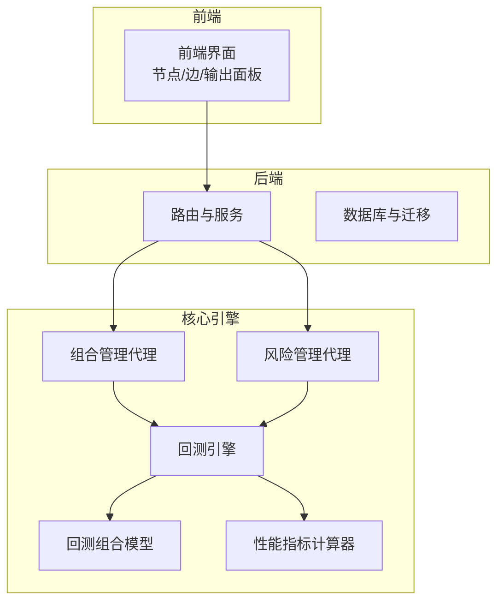
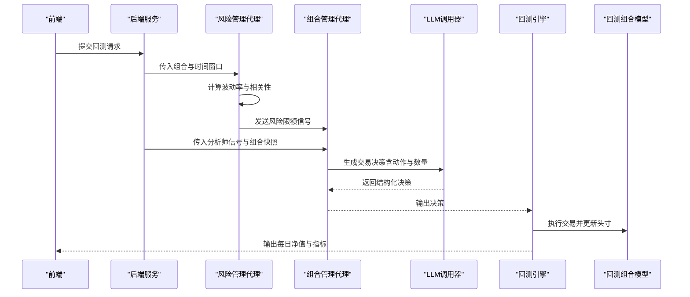
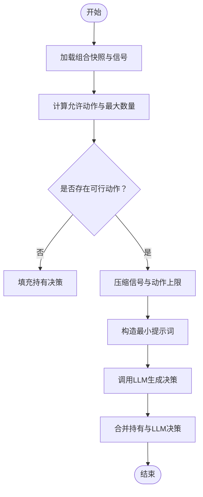
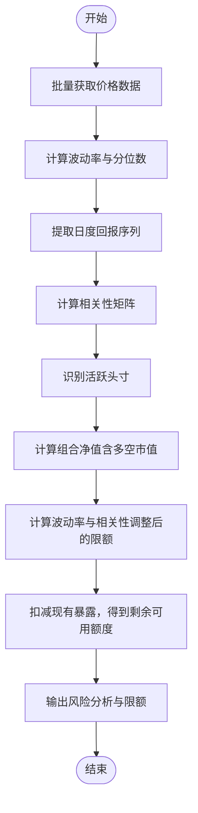
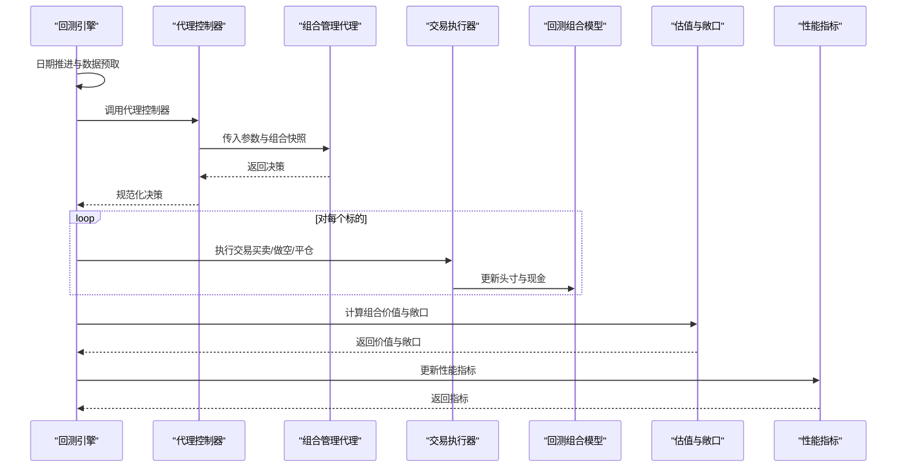
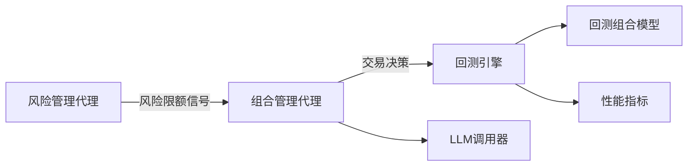

# 组合管理与风险管理代理

<cite>
**本文档引用的文件**
- [src/agents/portfolio_manager.py](file://src/agents/portfolio_manager.py)
- [src/agents/risk_manager.py](file://src/agents/risk_manager.py)
- [src/graph/state.py](file://src/graph/state.py)
- [src/utils/llm.py](file://src/utils/llm.py)
- [src/backtesting/portfolio.py](file://src/backtesting/portfolio.py)
- [src/backtesting/engine.py](file://src/backtesting/engine.py)
- [src/backtesting/controller.py](file://src/backtesting/controller.py)
- [src/backtesting/metrics.py](file://src/backtesting/metrics.py)
- [src/backtesting/types.py](file://src/backtesting/types.py)
- [app/backend/services/portfolio.py](file://app/backend/services/portfolio.py)
- [v2/portfolio/optimizer.py](file://v2/portfolio/optimizer.py)
- [v2/risk/manager.py](file://v2/risk/manager.py)
</cite>

## 目录
1. [简介](#简介)
2. [项目结构](#项目结构)
3. [核心组件](#核心组件)
4. [架构总览](#架构总览)
5. [详细组件分析](#详细组件分析)
6. [依赖分析](#依赖分析)
7. [性能考虑](#性能考虑)
8. [故障排除指南](#故障排除指南)
9. [结论](#结论)
10. [附录](#附录)

## 简介
本文件系统化阐述“组合管理与风险管理代理”的设计与实现，重点覆盖以下方面：
- 投资组合优化算法与资产配置策略：通过波动率与相关性驱动的风险预算分配，结合LLM生成最终交易决策。
- 风险管理机制：基于波动率预测、相关性分析与压力测试的多维风控体系。
- 风险度量指标与止损策略：夏普比率、索提诺比率、最大回撤等指标在回测中的应用；以及基于价格与头寸的动态止盈止损。
- 头寸控制与组合再平衡：按可用资金与保证金约束进行买卖/做空/平仓操作；支持日频或更高频的再平衡。
- 动态调整机制：基于市场状态（波动率、相关性）与组合当前暴露的实时调整。

该文档既面向技术读者，也兼顾非技术读者的理解需求，通过图示与分层讲解帮助快速掌握系统全貌与关键实现细节。

## 项目结构
该项目采用前后端分离与多模块协作的组织方式：
- 前端：可视化流程编排与结果展示（节点、边、输出面板等）
- 后端：数据模型、路由、服务与数据库迁移
- 核心引擎：组合管理代理、风险管理代理、回测引擎、交易执行器、指标计算器
- v2 模块：面向未来的组合优化与风险管理体系（占位说明）

**图表来源**
- [src/agents/portfolio_manager.py:25-93](file://src/agents/portfolio_manager.py#L25-L93)
- [src/agents/risk_manager.py:11-219](file://src/agents/risk_manager.py#L11-L219)
- [src/backtesting/engine.py:27-195](file://src/backtesting/engine.py#L27-L195)
- [src/backtesting/portfolio.py:9-196](file://src/backtesting/portfolio.py#L9-L196)

**章节来源**
- [src/agents/portfolio_manager.py:1-263](file://src/agents/portfolio_manager.py#L1-L263)
- [src/agents/risk_manager.py:1-318](file://src/agents/risk_manager.py#L1-L318)
- [src/backtesting/engine.py:1-195](file://src/backtesting/engine.py#L1-L195)

## 核心组件
- 组合管理代理（PortfolioManager）：聚合分析师信号与风险限额，通过LLM生成最终交易决策，并确保动作与数量满足资金、保证金与头寸限制。
- 风险管理代理（RiskManager）：基于历史价格计算波动率与相关性，给出波动率与相关性双重调整后的头寸限额，并作为信号注入到组合管理代理。
- 回测引擎：驱动每日回测循环，拉取价格、执行交易、计算组合价值与风险敞口、更新性能指标。
- 回测组合模型：封装现金、多空头寸、成本基础、已实现损益与保证金使用情况。
- 性能指标计算器：计算夏普、索提诺比率与最大回撤等指标。

**章节来源**
- [src/agents/portfolio_manager.py:25-93](file://src/agents/portfolio_manager.py#L25-L93)
- [src/agents/risk_manager.py:11-219](file://src/agents/risk_manager.py#L11-L219)
- [src/backtesting/engine.py:96-195](file://src/backtesting/engine.py#L96-L195)
- [src/backtesting/portfolio.py:9-196](file://src/backtesting/portfolio.py#L9-L196)
- [src/backtesting/metrics.py:8-78](file://src/backtesting/metrics.py#L8-L78)

## 架构总览
下图展示了从数据输入到最终交易决策与回测执行的完整流程：

**图表来源**
- [src/agents/risk_manager.py:11-219](file://src/agents/risk_manager.py#L11-L219)
- [src/agents/portfolio_manager.py:25-93](file://src/agents/portfolio_manager.py#L25-L93)
- [src/utils/llm.py:10-84](file://src/utils/llm.py#L10-L84)
- [src/backtesting/engine.py:132-195](file://src/backtesting/engine.py#L132-L195)

## 详细组件分析

### 组合管理代理（PortfolioManager）
职责与流程要点：
- 输入：组合快照、分析师信号集合、待跟踪标的列表、当前价格、风险限额（由风险管理代理提供）。
- 动作空间确定：根据组合现金、保证金要求与当前头寸，为每个标的确定允许的动作（买/卖/做空/平仓/持有），并计算最大可下单数量。
- 决策生成：对存在可行动作的标的，压缩信号与动作上限后，通过LLM生成最终决策；对无可行动作的标的直接填充“持有”。
- 输出：结构化交易决策消息，供回测引擎执行。

**图表来源**
- [src/agents/portfolio_manager.py:96-157](file://src/agents/portfolio_manager.py#L96-L157)
- [src/agents/portfolio_manager.py:177-262](file://src/agents/portfolio_manager.py#L177-L262)

关键实现路径（不含代码内容）：
- 允许动作与数量计算：[compute_allowed_actions:96-157](file://src/agents/portfolio_manager.py#L96-L157)
- 信号压缩与提示词构造：[generate_trading_decision:177-262](file://src/agents/portfolio_manager.py#L177-L262)
- LLM调用与默认回退：[call_llm:10-84](file://src/utils/llm.py#L10-L84)

**章节来源**
- [src/agents/portfolio_manager.py:25-93](file://src/agents/portfolio_manager.py#L25-L93)
- [src/agents/portfolio_manager.py:96-157](file://src/agents/portfolio_manager.py#L96-L157)
- [src/agents/portfolio_manager.py:177-262](file://src/agents/portfolio_manager.py#L177-L262)
- [src/utils/llm.py:10-84](file://src/utils/llm.py#L10-L84)

### 风险管理代理（RiskManager）
职责与流程要点：
- 数据准备：收集目标标的及组合内现有标的的历史价格，计算日度回报序列。
- 波动率预测：基于最近窗口估计日度与年化波动率，并计算波动率分位数以衡量相对风险水平。
- 相关性分析：构建回报矩阵并计算相关系数，识别与活跃头寸的相关性，给出平均/最大相关性与前三大最相关标的。
- 风险预算分配：将波动率与相关性双重调整为头寸限额百分比，转换为美元限额并扣减已有头寸暴露，得到剩余可用额度。
- 输出：为每个标的提供当前价格、剩余头寸限额与详尽的推理信息（包含波动率与相关性指标）。

**图表来源**
- [src/agents/risk_manager.py:24-202](file://src/agents/risk_manager.py#L24-L202)

关键实现路径（不含代码内容）：
- 波动率与分位数计算：[calculate_volatility_metrics:222-267](file://src/agents/risk_manager.py#L222-L267)
- 波动率调整限额函数：[calculate_volatility_adjusted_limit:270-298](file://src/agents/risk_manager.py#L270-L298)
- 相关性调整倍数：[calculate_correlation_multiplier:301-317](file://src/agents/risk_manager.py#L301-L317)

**章节来源**
- [src/agents/risk_manager.py:11-219](file://src/agents/risk_manager.py#L11-L219)
- [src/agents/risk_manager.py:222-267](file://src/agents/risk_manager.py#L222-L267)
- [src/agents/risk_manager.py:270-298](file://src/agents/risk_manager.py#L270-L298)
- [src/agents/risk_manager.py:301-317](file://src/agents/risk_manager.py#L301-L317)

### 回测引擎与交易执行
- 回测循环：按工作日推进，预取所需数据，拉取当日收盘价，运行代理控制器，执行交易，计算组合价值与风险敞口，更新每日记录与性能指标。
- 交易执行：支持多/空头寸的开仓与平仓，处理成本基础与保证金占用/释放，严格遵循保证金要求与可用资金约束。
- 指标计算：基于净值曲线计算日度回报、超额回报、夏普/索提诺比率与最大回撤。

**图表来源**
- [src/backtesting/engine.py:96-195](file://src/backtesting/engine.py#L96-L195)
- [src/backtesting/controller.py:12-65](file://src/backtesting/controller.py#L12-L65)
- [src/backtesting/portfolio.py:82-194](file://src/backtesting/portfolio.py#L82-L194)
- [src/backtesting/metrics.py:22-75](file://src/backtesting/metrics.py#L22-L75)

**章节来源**
- [src/backtesting/engine.py:27-195](file://src/backtesting/engine.py#L27-L195)
- [src/backtesting/controller.py:9-68](file://src/backtesting/controller.py#L9-L68)
- [src/backtesting/portfolio.py:9-196](file://src/backtesting/portfolio.py#L9-L196)
- [src/backtesting/metrics.py:8-78](file://src/backtesting/metrics.py#L8-L78)

### v2 组合优化与风险体系（占位说明）
- v2 组合优化：聚焦均值-方差优化、特征值清洗（Marchenko-Pastur）、Black-Litterman、风险平价等方法。
- v2 风险管理：关注最大回撤控制、基于波动率的头寸规模、基于相关性的敞口上限、尾部风险指标与压力测试。

**章节来源**
- [v2/portfolio/optimizer.py:1-6](file://v2/portfolio/optimizer.py#L1-L6)
- [v2/risk/manager.py:1-6](file://v2/risk/manager.py#L1-L6)

## 依赖分析
- 组件耦合与内聚
  - 组合管理代理与风险管理代理通过“分析师信号”共享数据，耦合点明确且可控。
  - 回测引擎通过控制器解耦代理接口，便于替换不同代理实现。
  - 交易执行与组合模型内聚于回测模块，职责清晰。
- 外部依赖
  - LLM调用器负责结构化输出与重试逻辑，降低外部模型差异带来的不确定性。
  - 数据工具用于价格与财务数据获取，避免在代理中直接耦合API细节。

**图表来源**
- [src/agents/risk_manager.py:11-219](file://src/agents/risk_manager.py#L11-L219)
- [src/agents/portfolio_manager.py:25-93](file://src/agents/portfolio_manager.py#L25-L93)
- [src/utils/llm.py:10-84](file://src/utils/llm.py#L10-L84)
- [src/backtesting/engine.py:132-195](file://src/backtesting/engine.py#L132-L195)

**章节来源**
- [src/agents/risk_manager.py:11-219](file://src/agents/risk_manager.py#L11-L219)
- [src/agents/portfolio_manager.py:25-93](file://src/agents/portfolio_manager.py#L25-L93)
- [src/utils/llm.py:10-84](file://src/utils/llm.py#L10-L84)
- [src/backtesting/engine.py:96-195](file://src/backtesting/engine.py#L96-L195)

## 性能考虑
- LLM调用成本控制
  - 仅向LLM发送必要的“可行动作”与“压缩信号”，减少上下文长度与token消耗。
  - 使用默认回退策略保证在LLM失败时仍能输出合理决策。
- 数据访问与缓存
  - 风险管理代理在单次运行中复用价格与回报序列，避免重复API调用。
- 回测效率
  - 通过预取与批量化数据获取，减少每日循环中的IO等待。
  - 指标计算采用向量化与滚动计算，降低时间复杂度。

[本节为通用建议，不直接分析具体文件]

## 故障排除指南
- LLM调用失败
  - 现象：代理输出为空或报错。
  - 排查：检查模型配置与API密钥；确认默认回退工厂是否被触发。
  - 参考实现：[call_llm:10-84](file://src/utils/llm.py#L10-L84)
- 无有效价格数据
  - 现象：波动率与相关性计算缺失或默认值过高。
  - 排查：确认API密钥与时间窗口；检查数据获取工具返回。
  - 参考实现：[risk_management_agent:24-76](file://src/agents/risk_manager.py#L24-L76)
- 交易未成交
  - 现象：订单数量为0。
  - 排查：检查可用资金、保证金占用与最大可下单数量；核对头寸限制信号。
  - 参考实现：[apply_long_buy:82-112](file://src/backtesting/portfolio.py#L82-L112)，[apply_short_open:128-170](file://src/backtesting/portfolio.py#L128-L170)
- 指标异常
  - 现象：夏普/索提诺为None或无穷大。
  - 排查：确认净值序列长度与非零波动率条件；检查无风险利率设置。
  - 参考实现：[compute_metrics:22-75](file://src/backtesting/metrics.py#L22-L75)

**章节来源**
- [src/utils/llm.py:10-84](file://src/utils/llm.py#L10-L84)
- [src/agents/risk_manager.py:24-76](file://src/agents/risk_manager.py#L24-L76)
- [src/backtesting/portfolio.py:82-170](file://src/backtesting/portfolio.py#L82-L170)
- [src/backtesting/metrics.py:22-75](file://src/backtesting/metrics.py#L22-L75)

## 结论
本系统通过“风险管理代理+组合管理代理”的双代理协同，实现了以波动率与相关性为核心的动态风险预算分配与交易决策生成。回测引擎贯穿数据获取、交易执行、估值与指标计算，形成闭环验证能力。v2模块为未来引入更高级的组合优化与风险度量预留了扩展空间。建议在生产环境中强化数据质量监控、完善压力测试场景，并持续迭代LLM提示词与风险限额函数以提升稳定性与收益风险比。

[本节为总结性内容，不直接分析具体文件]

## 附录

### 关键数据模型与类型
- 组合快照与头寸状态：[PortfolioSnapshot/PositionState:38-49](file://src/backtesting/types.py#L38-L49)
- 行为与决策类型：[Action/AgentDecision:10-18](file://src/backtesting/types.py#L10-L18)
- 性能指标类型：[PerformanceMetrics:90-104](file://src/backtesting/types.py#L90-L104)

**章节来源**
- [src/backtesting/types.py:10-104](file://src/backtesting/types.py#L10-L104)

### 后端组合初始化（参考）
- 初始化组合结构与保证金占用：[create_portfolio:6-51](file://app/backend/services/portfolio.py#L6-L51)

**章节来源**
- [app/backend/services/portfolio.py:6-51](file://app/backend/services/portfolio.py#L6-L51)