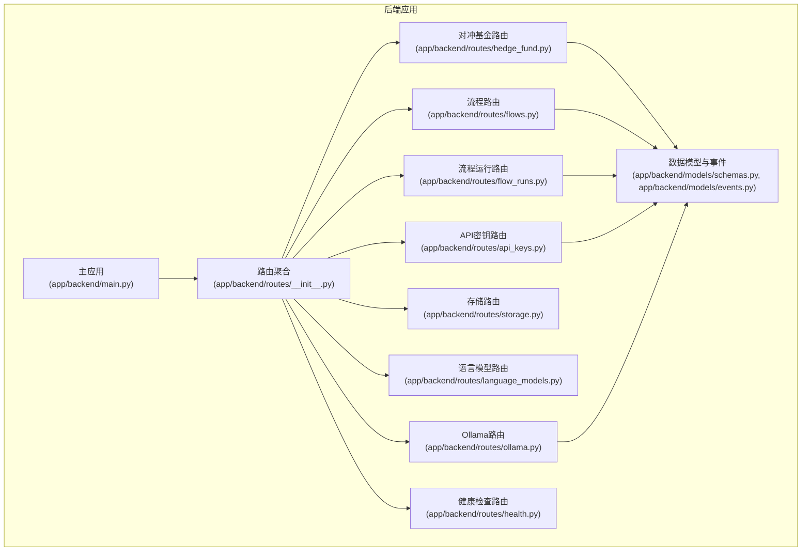
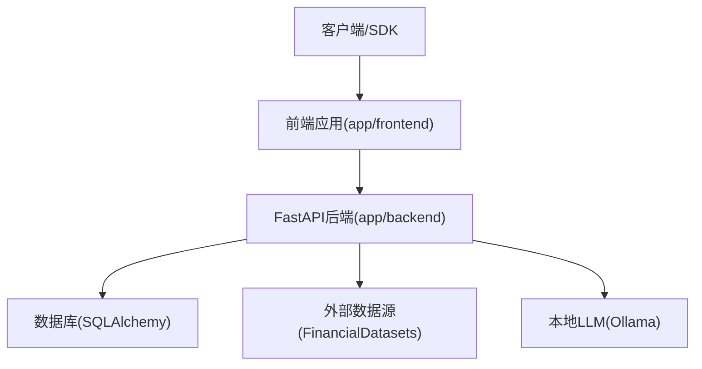
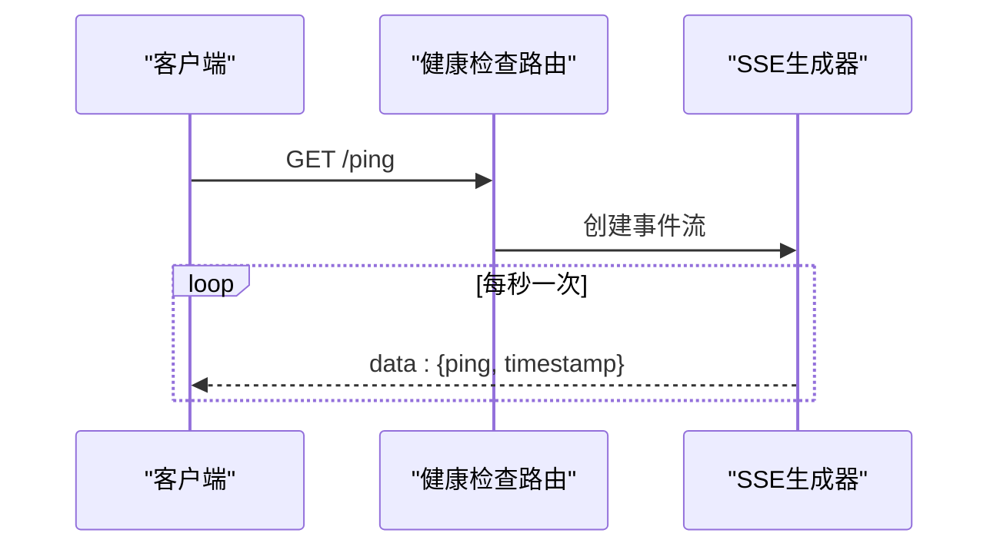
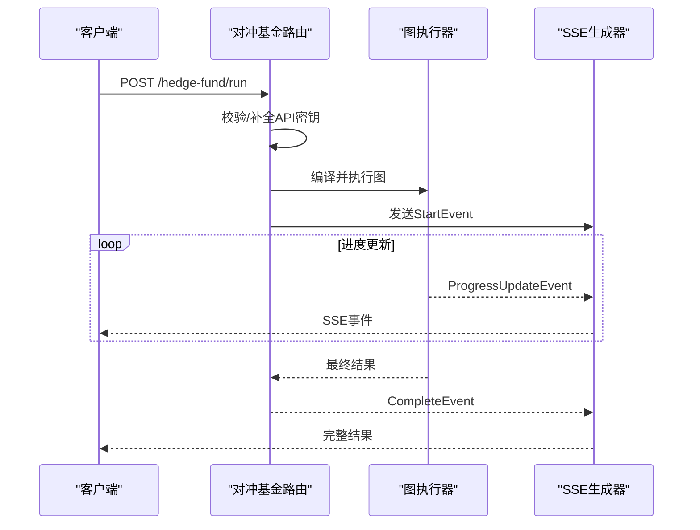
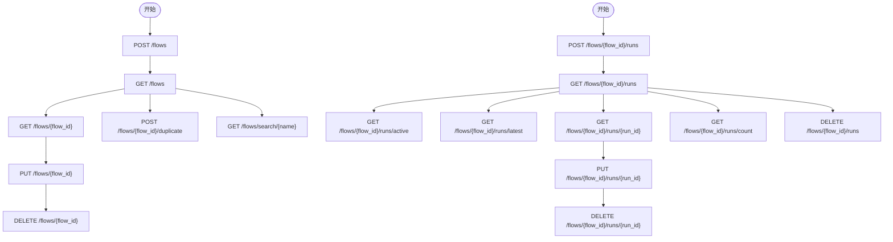
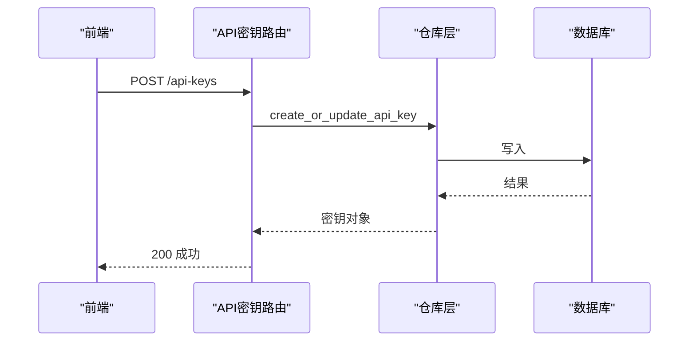
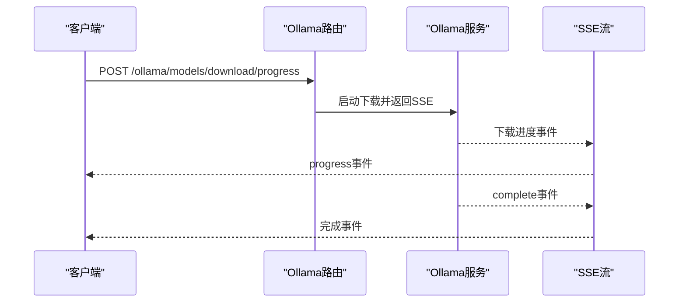
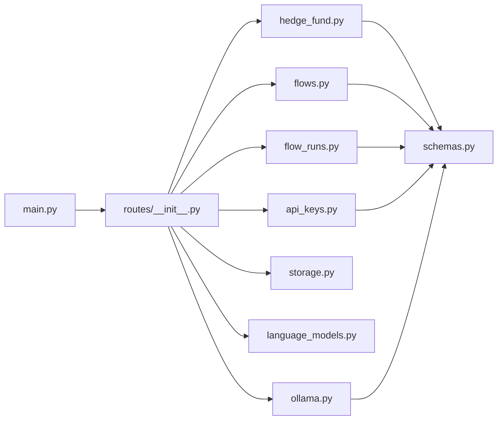

# API参考文档

<cite>
**本文档引用的文件**
- [app/backend/main.py](file://app/backend/main.py)
- [app/backend/routes/__init__.py](file://app/backend/routes/__init__.py)
- [app/backend/routes/health.py](file://app/backend/routes/health.py)
- [app/backend/routes/hedge_fund.py](file://app/backend/routes/hedge_fund.py)
- [app/backend/routes/flows.py](file://app/backend/routes/flows.py)
- [app/backend/routes/flow_runs.py](file://app/backend/routes/flow_runs.py)
- [app/backend/routes/api_keys.py](file://app/backend/routes/api_keys.py)
- [app/backend/routes/storage.py](file://app/backend/routes/storage.py)
- [app/backend/routes/language_models.py](file://app/backend/routes/language_models.py)
- [app/backend/routes/ollama.py](file://app/backend/routes/ollama.py)
- [app/backend/models/schemas.py](file://app/backend/models/schemas.py)
- [app/backend/models/events.py](file://app/backend/models/events.py)
- [src/tools/api.py](file://src/tools/api.py)
- [v2/data/client.py](file://v2/data/client.py)
- [tests/test_api_rate_limiting.py](file://tests/test_api_rate_limiting.py)
- [app/frontend/src/services/api-keys-api.ts](file://app/frontend/src/services/api-keys-api.ts)
</cite>

## 目录
1. [简介](#简介)
2. [项目结构](#项目结构)
3. [核心组件](#核心组件)
4. [架构总览](#架构总览)
5. [详细组件分析](#详细组件分析)
6. [依赖关系分析](#依赖关系分析)
7. [性能考虑](#性能考虑)
8. [故障排除指南](#故障排除指南)
9. [结论](#结论)
10. [附录](#附录)

## 简介
本API参考文档面向开发者与集成方，系统性说明后端服务提供的RESTful API端点、请求/响应模式、认证方式、错误码与处理策略，并提供使用示例、SDK集成指南、客户端实现建议、版本管理与兼容性策略、速率限制与安全考虑、性能优化提示、测试工具与调试技巧以及WebSocket/Server-Sent Events实时通信协议说明。

## 项目结构
后端基于FastAPI构建，采用模块化路由组织，核心路由包括健康检查、对冲基金运行与回测、流程与流程运行管理、API密钥管理、存储、语言模型与Ollama本地模型服务等。前端通过独立的TypeScript服务类调用后端API。

**图表来源**
- [app/backend/main.py:15-30](file://app/backend/main.py#L15-L30)
- [app/backend/routes/__init__.py:12-24](file://app/backend/routes/__init__.py#L12-L24)

**章节来源**
- [app/backend/main.py:15-30](file://app/backend/main.py#L15-L30)
- [app/backend/routes/__init__.py:12-24](file://app/backend/routes/__init__.py#L12-L24)

## 核心组件
- 应用入口与CORS配置：初始化FastAPI应用、数据库表创建、CORS允许跨域访问（前端开发地址）。
- 路由聚合器：统一挂载各子路由，按标签分组便于文档化与维护。
- 数据模型与事件：定义请求/响应模型、流式事件格式（SSE）。
- 外部数据工具：封装金融数据API请求、缓存与速率限制处理。
- 前端服务：提供TypeScript API密钥服务类，演示HTTP调用模式。

**章节来源**
- [app/backend/main.py:15-30](file://app/backend/main.py#L15-L30)
- [app/backend/routes/__init__.py:12-24](file://app/backend/routes/__init__.py#L12-L24)
- [app/backend/models/schemas.py:1-292](file://app/backend/models/schemas.py#L1-L292)
- [app/backend/models/events.py:1-46](file://app/backend/models/events.py#L1-L46)
- [src/tools/api.py:29-61](file://src/tools/api.py#L29-L61)
- [app/frontend/src/services/api-keys-api.ts:42-158](file://app/frontend/src/services/api-keys-api.ts#L42-L158)

## 架构总览
后端采用FastAPI + SQLAlchemy + Pydantic，支持：
- RESTful API：标准HTTP方法与JSON请求/响应。
- Server-Sent Events：用于长连接流式输出（如对冲基金运行、回测进度、Ollama下载进度）。
- 数据校验：Pydantic模型自动校验与序列化。
- 错误处理：统一HTTP异常与自定义错误响应模型。

**图表来源**
- [app/backend/main.py:15-30](file://app/backend/main.py#L15-L30)
- [src/tools/api.py:63-96](file://src/tools/api.py#L63-L96)
- [app/backend/routes/ollama.py:48-55](file://app/backend/routes/ollama.py#L48-L55)

## 详细组件分析

### 健康检查与Ping接口
- GET /：返回欢迎信息。
- GET /ping：Server-Sent Events，周期性发送ping消息，用于心跳检测。

**图表来源**
- [app/backend/routes/health.py:14-27](file://app/backend/routes/health.py#L14-L27)

**章节来源**
- [app/backend/routes/health.py:9-27](file://app/backend/routes/health.py#L9-L27)

### 对冲基金运行与回测
- POST /hedge-fund/run：启动对冲基金运行，返回SSE流，事件类型包括start、progress、error、complete。
- POST /hedge-fund/backtest：执行连续回测，返回SSE流，包含逐日结果与最终指标。
- GET /hedge-fund/agents：获取可用代理列表。

请求/响应模型：
- 请求：HedgeFundRequest、BacktestRequest（含时间范围、资金、交易标的、图结构、模型配置等）。
- 响应：SSE事件流，最终CompleteEvent携带决策、分析师信号与当前价格。

**图表来源**
- [app/backend/routes/hedge_fund.py:18-155](file://app/backend/routes/hedge_fund.py#L18-L155)
- [app/backend/models/events.py:16-46](file://app/backend/models/events.py#L16-L46)

**章节来源**
- [app/backend/routes/hedge_fund.py:18-352](file://app/backend/routes/hedge_fund.py#L18-L352)
- [app/backend/models/schemas.py:50-141](file://app/backend/models/schemas.py#L50-L141)
- [app/backend/models/events.py:5-46](file://app/backend/models/events.py#L5-L46)

### 流程与流程运行管理
- 流程管理（/flows）：创建、查询、更新、删除、复制、搜索。
- 流程运行（/flows/{flow_id}/runs）：创建、查询全部/活动/最新、按ID查询、更新、删除、批量删除、计数。

**图表来源**
- [app/backend/routes/flows.py:18-174](file://app/backend/routes/flows.py#L18-L174)
- [app/backend/routes/flow_runs.py:20-303](file://app/backend/routes/flow_runs.py#L20-L303)

**章节来源**
- [app/backend/routes/flows.py:18-174](file://app/backend/routes/flows.py#L18-L174)
- [app/backend/routes/flow_runs.py:20-303](file://app/backend/routes/flow_runs.py#L20-L303)
- [app/backend/models/schemas.py:144-241](file://app/backend/models/schemas.py#L144-L241)

### API密钥管理
- POST /api-keys：创建或更新API密钥。
- GET /api-keys：获取所有密钥摘要（不含真实值）。
- GET /api-keys/{provider}：按提供商获取完整密钥。
- PUT /api-keys/{provider}：更新指定密钥。
- DELETE /api-keys/{provider}：删除密钥。
- PATCH /api-keys/{provider}/deactivate：停用密钥。
- POST /api-keys/bulk：批量创建/更新。
- PATCH /api-keys/{provider}/last-used：更新最后使用时间。

**图表来源**
- [app/backend/routes/api_keys.py:19-201](file://app/backend/routes/api_keys.py#L19-L201)

**章节来源**
- [app/backend/routes/api_keys.py:19-201](file://app/backend/routes/api_keys.py#L19-L201)
- [app/backend/models/schemas.py:244-292](file://app/backend/models/schemas.py#L244-L292)
- [app/frontend/src/services/api-keys-api.ts:42-158](file://app/frontend/src/services/api-keys-api.ts#L42-L158)

### 存储服务
- POST /storage/save-json：保存JSON到项目outputs目录，返回成功信息与文件路径。

**章节来源**
- [app/backend/routes/storage.py:14-44](file://app/backend/routes/storage.py#L14-L44)

### 语言模型与Ollama
- GET /language-models/：获取云模型与本地Ollama模型列表。
- GET /language-models/providers：按提供商分组返回模型。
- GET /ollama/status：查询Ollama安装与运行状态。
- POST /ollama/start、/ollama/stop：启动/停止Ollama服务。
- POST /ollama/models/download：下载模型（旧接口）。
- POST /ollama/models/download/progress：带进度的模型下载（SSE）。
- GET /ollama/models/download/progress/{model_name}：查询特定模型下载进度。
- GET /ollama/models/downloads/active：查询所有活跃下载。
- DELETE /ollama/models/{model_name}：删除模型。
- GET /ollama/models/recommended：推荐模型列表。
- DELETE /ollama/models/download/{model_name}：取消下载。

**图表来源**
- [app/backend/routes/ollama.py:158-195](file://app/backend/routes/ollama.py#L158-L195)

**章节来源**
- [app/backend/routes/language_models.py:13-62](file://app/backend/routes/language_models.py#L13-L62)
- [app/backend/routes/ollama.py:41-319](file://app/backend/routes/ollama.py#L41-L319)

## 依赖关系分析
- 主应用依赖路由聚合器；路由聚合器统一包含各业务路由。
- 各路由依赖数据库会话（Depends）与对应仓库层。
- 对冲基金路由依赖图执行器、组合器与进度回调。
- Ollama路由依赖Ollama服务以实现模型下载与状态管理。
- 前端服务类直接调用后端API，遵循HTTP与JSON约定。

**图表来源**
- [app/backend/main.py:15-30](file://app/backend/main.py#L15-L30)
- [app/backend/routes/__init__.py:12-24](file://app/backend/routes/__init__.py#L12-L24)

**章节来源**
- [app/backend/main.py:15-30](file://app/backend/main.py#L15-L30)
- [app/backend/routes/__init__.py:12-24](file://app/backend/routes/__init__.py#L12-L24)

## 性能考虑
- SSE长连接：对冲基金运行与回测、Ollama下载均采用SSE，减少轮询开销，提升实时性。
- 速率限制与退避：外部金融数据API在遇到429时进行线性退避重试，避免触发上游限流。
- 缓存：对外部数据进行缓存，降低重复请求成本。
- 并发与取消：SSE事件生成器与任务取消逻辑确保客户端断开时及时释放资源。

**章节来源**
- [src/tools/api.py:29-61](file://src/tools/api.py#L29-L61)
- [tests/test_api_rate_limiting.py:44-141](file://tests/test_api_rate_limiting.py#L44-L141)

## 故障排除指南
- 常见HTTP状态码
  - 200：成功
  - 204：删除成功（无内容）
  - 400：请求参数无效
  - 404：资源不存在
  - 500：服务器内部错误
- 错误响应模型：统一包含message与可选error字段。
- Ollama相关问题：检查安装状态、服务运行状态与模型可用性；若未运行需先启动。
- API密钥问题：确认密钥存在且处于激活状态；可通过后端接口查询与更新。

**章节来源**
- [app/backend/models/schemas.py:55-58](file://app/backend/models/schemas.py#L55-L58)
- [app/backend/routes/ollama.py:48-55](file://app/backend/routes/ollama.py#L48-L55)
- [app/backend/routes/api_keys.py:49-78](file://app/backend/routes/api_keys.py#L49-L78)

## 结论
本API参考文档覆盖了从健康检查、对冲基金运行与回测、流程管理、API密钥管理到本地模型服务的完整REST与SSE能力。通过明确的请求/响应模型、错误处理策略与速率限制机制，为集成方提供了稳定可靠的接口规范与实现建议。

## 附录

### API端点一览与规范

- 健康检查
  - GET /：返回欢迎信息
  - GET /ping：SSE心跳流

- 对冲基金
  - POST /hedge-fund/run：SSE流式运行，事件类型：start、progress、error、complete
  - POST /hedge-fund/backtest：SSE流式回测，事件类型：start、progress、error、complete
  - GET /hedge-fund/agents：返回可用代理列表

- 流程管理
  - POST /flows：创建流程
  - GET /flows：获取流程列表（摘要）
  - GET /flows/{flow_id}：获取单个流程
  - PUT /flows/{flow_id}：更新流程
  - DELETE /flows/{flow_id}：删除流程
  - POST /flows/{flow_id}/duplicate：复制流程
  - GET /flows/search/{name}：按名称搜索流程

- 流程运行
  - POST /flows/{flow_id}/runs：创建运行
  - GET /flows/{flow_id}/runs：获取运行列表（支持limit/offset）
  - GET /flows/{flow_id}/runs/active：获取当前活动运行
  - GET /flows/{flow_id}/runs/latest：获取最新运行
  - GET /flows/{flow_id}/runs/{run_id}：获取指定运行
  - PUT /flows/{flow_id}/runs/{run_id}：更新运行
  - DELETE /flows/{flow_id}/runs/{run_id}：删除运行
  - DELETE /flows/{flow_id}/runs：批量删除运行
  - GET /flows/{flow_id}/runs/count：统计运行总数

- API密钥
  - POST /api-keys：创建或更新密钥
  - GET /api-keys：获取密钥摘要列表
  - GET /api-keys/{provider}：获取指定密钥
  - PUT /api-keys/{provider}：更新密钥
  - DELETE /api-keys/{provider}：删除密钥
  - PATCH /api-keys/{provider}/deactivate：停用密钥
  - POST /api-keys/bulk：批量更新
  - PATCH /api-keys/{provider}/last-used：更新最后使用时间

- 存储
  - POST /storage/save-json：保存JSON至outputs目录

- 语言模型与Ollama
  - GET /language-models/：获取模型列表
  - GET /language-models/providers：按提供商分组模型
  - GET /ollama/status：查询Ollama状态
  - POST /ollama/start：启动Ollama
  - POST /ollama/stop：停止Ollama
  - POST /ollama/models/download：下载模型（旧）
  - POST /ollama/models/download/progress：下载模型（SSE进度）
  - GET /ollama/models/download/progress/{model_name}：查询特定模型进度
  - GET /ollama/models/downloads/active：查询活跃下载
  - DELETE /ollama/models/{model_name}：删除模型
  - GET /ollama/models/recommended：推荐模型
  - DELETE /ollama/models/download/{model_name}：取消下载

### 认证与安全
- 当前路由未内置鉴权中间件；建议在生产环境接入JWT/OAuth或API Key头校验。
- API密钥管理接口返回摘要时不包含真实密钥值，保护敏感信息。

### 版本管理与兼容性
- 应用版本：0.1.0（可在应用入口中查看与更新）。
- 建议采用语义化版本控制，变更时在路由前缀或响应体中体现版本号，保持向后兼容或提供迁移指南。

### 速率限制与退避
- 外部金融数据API在429时采用线性退避重试（最多3次），每次等待时间递增。
- 建议客户端在调用外部API时也遵循相同策略，避免触发上游限流。

### WebSocket与SSE
- SSE用于对冲基金运行/回测、Ollama下载进度等长连接场景。
- WebSocket未在现有代码中实现，如需实时双向通信可评估引入FastAPI的WebSocket支持。

### SDK与客户端实现建议
- 前端已提供API密钥服务类，展示HTTP调用、错误处理与参数传递。
- 建议客户端：
  - 统一拦截429并执行指数/线性退避重试。
  - 使用SSE事件解析器处理start/progress/error/complete事件。
  - 对敏感数据（如API密钥）进行本地加密存储与最小暴露原则。

**章节来源**
- [app/frontend/src/services/api-keys-api.ts:42-158](file://app/frontend/src/services/api-keys-api.ts#L42-L158)
- [src/tools/api.py:29-61](file://src/tools/api.py#L29-L61)