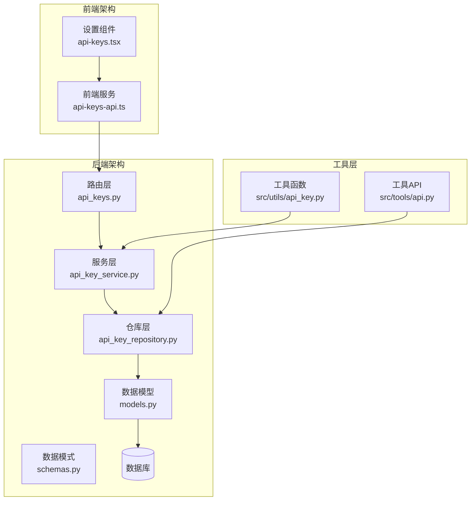
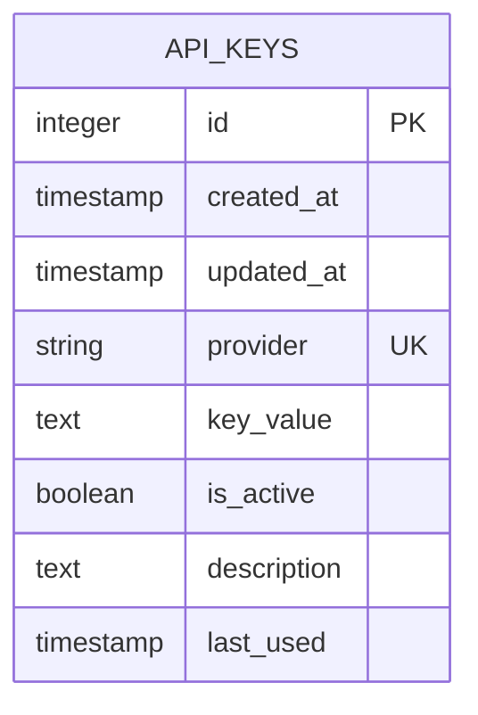
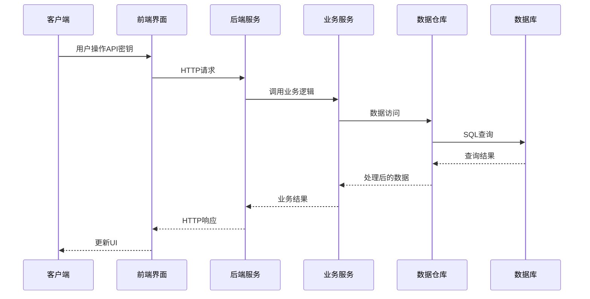
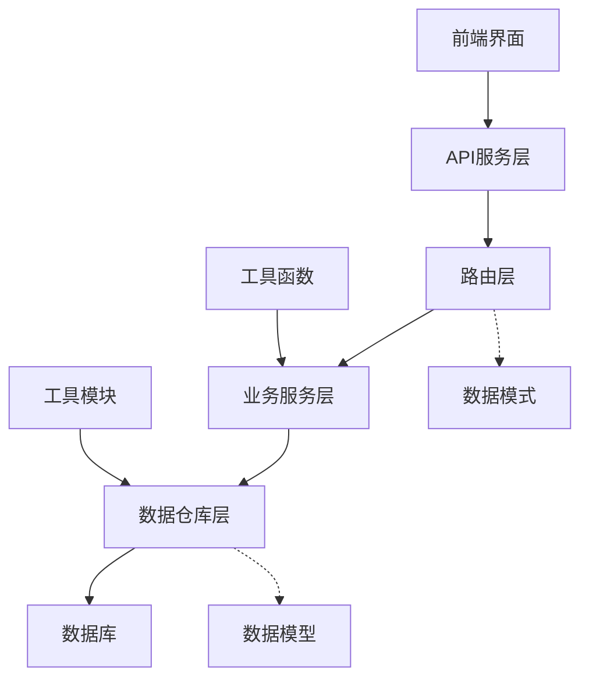

# API密钥管理API

<cite>
**本文档引用的文件**
- [app/backend/routes/api_keys.py](file://app/backend/routes/api_keys.py)
- [app/backend/services/api_key_service.py](file://app/backend/services/api_key_service.py)
- [app/backend/repositories/api_key_repository.py](file://app/backend/repositories/api_key_repository.py)
- [app/backend/database/models.py](file://app/backend/database/models.py)
- [app/backend/alembic/versions/add_api_keys_table.py](file://app/backend/alembic/versions/add_api_keys_table.py)
- [app/backend/models/schemas.py](file://app/backend/models/schemas.py)
- [app/frontend/src/services/api-keys-api.ts](file://app/frontend/src/services/api-keys-api.ts)
- [app/frontend/src/components/settings/api-keys.tsx](file://app/frontend/src/components/settings/api-keys.tsx)
- [src/tools/api.py](file://src/tools/api.py)
- [src/utils/api_key.py](file://src/utils/api_key.py)
- [tests/test_api_rate_limiting.py](file://tests/test_api_rate_limiting.py)
</cite>

## 目录
1. [简介](#简介)
2. [项目结构](#项目结构)
3. [核心组件](#核心组件)
4. [架构概览](#架构概览)
5. [详细组件分析](#详细组件分析)
6. [依赖关系分析](#依赖关系分析)
7. [性能考虑](#性能考虑)
8. [故障排除指南](#故障排除指南)
9. [结论](#结论)

## 简介

API密钥管理API是AI对冲基金系统中的核心安全组件，负责管理系统中各种外部服务的API密钥。该系统提供了完整的密钥生命周期管理功能，包括密钥的创建、查询、更新、删除以及状态管理。

系统支持多种类型的API密钥，包括金融数据提供商（如Financial Datasets）和语言模型提供商（如Anthropic、OpenAI、Groq等）。每个密钥都与特定的服务提供者关联，并支持启用/禁用状态管理。

## 项目结构

API密钥管理功能分布在后端FastAPI应用和前端React界面中：

**图表来源**
- [app/backend/routes/api_keys.py:1-201](file://app/backend/routes/api_keys.py#L1-L201)
- [app/backend/services/api_key_service.py:1-23](file://app/backend/services/api_key_service.py#L1-L23)
- [app/backend/repositories/api_key_repository.py:1-131](file://app/backend/repositories/api_key_repository.py#L1-L131)

**章节来源**
- [app/backend/routes/api_keys.py:1-201](file://app/backend/routes/api_keys.py#L1-L201)
- [app/frontend/src/services/api-keys-api.ts:1-158](file://app/frontend/src/services/api-keys-api.ts#L1-L158)

## 核心组件

### 数据模型设计

API密钥数据模型采用简洁而实用的设计，支持基本的密钥管理需求：

**图表来源**
- [app/backend/database/models.py:97-115](file://app/backend/database/models.py#L97-L115)

### 路由端点设计

系统提供RESTful API端点，遵循HTTP标准和最佳实践：

| 方法 | 端点 | 描述 | 响应类型 |
|------|------|------|----------|
| GET | `/api-keys` | 获取所有API密钥列表 | `List[ApiKeySummaryResponse]` |
| POST | `/api-keys` | 创建或更新API密钥 | `ApiKeyResponse` |
| GET | `/api-keys/{provider}` | 获取指定API密钥 | `ApiKeyResponse` |
| PUT | `/api-keys/{provider}` | 更新API密钥 | `ApiKeyResponse` |
| DELETE | `/api-keys/{provider}` | 删除API密钥 | `204 No Content` |
| PATCH | `/api-keys/{provider}/deactivate` | 禁用API密钥 | `ApiKeySummaryResponse` |
| POST | `/api-keys/bulk` | 批量更新API密钥 | `List[ApiKeyResponse]` |
| PATCH | `/api-keys/{provider}/last-used` | 更新最后使用时间 | `200 OK` |

**章节来源**
- [app/backend/routes/api_keys.py:19-201](file://app/backend/routes/api_keys.py#L19-L201)
- [app/backend/models/schemas.py:243-292](file://app/backend/models/schemas.py#L243-L292)

## 架构概览

API密钥管理采用经典的三层架构模式，确保关注点分离和代码可维护性：

**图表来源**
- [app/backend/routes/api_keys.py:27-37](file://app/backend/routes/api_keys.py#L27-L37)
- [app/backend/services/api_key_service.py:12-18](file://app/backend/services/api_key_service.py#L12-L18)
- [app/backend/repositories/api_key_repository.py:15-46](file://app/backend/repositories/api_key_repository.py#L15-L46)

## 详细组件分析

### 路由层组件

路由层负责HTTP请求处理和响应格式化，实现了完整的CRUD操作：

#### GET /api-keys 端点
- **功能**：获取所有API密钥的摘要信息
- **安全特性**：返回摘要响应，不包含实际密钥值
- **参数**：`include_inactive` 查询参数控制是否包含禁用的密钥
- **响应**：`List[ApiKeySummaryResponse]`

#### POST /api-keys 端点
- **功能**：创建新的API密钥或更新现有密钥
- **请求体**：`ApiKeyCreateRequest` 包含provider、key_value、description、is_active
- **行为**：如果provider已存在则更新，否则创建新记录
- **响应**：`ApiKeyResponse` 包含完整的密钥信息

#### GET /api-keys/{provider} 端点
- **功能**：根据provider获取特定API密钥
- **安全性**：返回完整响应，包含实际密钥值
- **错误处理**：404状态码表示密钥不存在

#### PUT /api-keys/{provider} 端点
- **功能**：更新现有API密钥的属性
- **请求体**：`ApiKeyUpdateRequest` 支持部分更新
- **字段**：key_value、description、is_active

#### DELETE /api-keys/{provider} 端点
- **功能**：永久删除API密钥
- **行为**：物理删除数据库记录
- **安全考虑**：此操作不可逆

#### 高级管理端点
- **PATCH /api-keys/{provider}/deactivate**：禁用密钥但不删除
- **POST /api-keys/bulk**：批量创建或更新多个密钥
- **PATCH /api-keys/{provider}/last-used**：更新使用时间戳

**章节来源**
- [app/backend/routes/api_keys.py:42-127](file://app/backend/routes/api_keys.py#L42-L127)
- [app/backend/routes/api_keys.py:130-201](file://app/backend/routes/api_keys.py#L130-L201)

### 服务层组件

服务层提供业务逻辑封装，简化了密钥管理的核心操作：

#### ApiKeyService 类
- **职责**：为应用程序加载和管理API密钥
- **主要方法**：
  - `get_api_keys_dict()`：返回活跃密钥字典，适合注入到请求中
  - `get_api_key(provider)`：获取特定提供者的密钥值

**章节来源**
- [app/backend/services/api_key_service.py:6-23](file://app/backend/services/api_key_service.py#L6-L23)

### 仓库层组件

仓库层实现了数据访问模式，提供了线程安全的数据操作：

#### ApiKeyRepository 类
- **职责**：封装所有数据库操作
- **核心方法**：
  - `create_or_update_api_key()`：创建或更新API密钥
  - `get_api_key_by_provider()`：按提供者获取密钥（仅活跃）
  - `get_all_api_keys()`：获取所有密钥列表
  - `update_api_key()`：更新密钥属性
  - `delete_api_key()`：删除密钥
  - `deactivate_api_key()`：禁用密钥
  - `update_last_used()`：更新使用时间戳
  - `bulk_create_or_update()`：批量操作

**章节来源**
- [app/backend/repositories/api_key_repository.py:9-131](file://app/backend/repositories/api_key_repository.py#L9-L131)

### 数据模型组件

数据库模型定义了API密钥的存储结构：

#### ApiKey 模型
- **唯一标识**：provider 字段确保每个提供者只有一个密钥
- **安全字段**：key_value 存储加密的密钥值
- **元数据**：created_at、updated_at、last_used 时间戳
- **状态管理**：is_active 字段控制密钥启用状态
- **索引优化**：provider 和 id 字段建立索引

**章节来源**
- [app/backend/database/models.py:97-115](file://app/backend/database/models.py#L97-L115)

### 前端集成组件

前端提供了直观的用户界面来管理API密钥：

#### ApiKeysSettings 组件
- **功能**：提供API密钥配置界面
- **特性**：
  - 自动保存：输入变化时自动保存
  - 密钥可见性切换：支持显示/隐藏密钥
  - 错误处理：友好的错误提示
  - 批量管理：支持多个提供者的统一管理

#### ApiKeysService 类
- **职责**：封装所有API密钥相关的HTTP请求
- **方法**：getAllApiKeys、getApiKey、createOrUpdateApiKey、updateApiKey、deleteApiKey、deactivateApiKey、bulkUpdateApiKeys、updateLastUsed

**章节来源**
- [app/frontend/src/components/settings/api-keys.tsx:85-319](file://app/frontend/src/components/settings/api-keys.tsx#L85-L319)
- [app/frontend/src/services/api-keys-api.ts:42-158](file://app/frontend/src/services/api-keys-api.ts#L42-L158)

## 依赖关系分析

系统采用清晰的依赖层次结构，避免循环依赖：

**图表来源**
- [app/backend/routes/api_keys.py:1-16](file://app/backend/routes/api_keys.py#L1-L16)
- [app/backend/services/api_key_service.py:1-3](file://app/backend/services/api_key_service.py#L1-L3)
- [app/backend/repositories/api_key_repository.py:1-6](file://app/backend/repositories/api_key_repository.py#L1-L6)

### 外部依赖

系统依赖以下关键组件：

| 组件 | 版本 | 用途 |
|------|------|------|
| FastAPI | 最新版本 | Web框架和API路由 |
| SQLAlchemy | 最新版本 | ORM和数据库操作 |
| Alembic | 最新版本 | 数据库迁移 |
| Pydantic | 最新版本 | 数据验证和序列化 |
| React | 18+ | 前端界面构建 |

**章节来源**
- [app/backend/alembic/versions/add_api_keys_table.py:1-44](file://app/backend/alembic/versions/add_api_keys_table.py#L1-L44)

## 性能考虑

### 数据库优化
- **索引策略**：在provider字段上建立唯一索引，确保快速查找
- **查询优化**：默认只查询活跃密钥，减少不必要的数据传输
- **批量操作**：提供批量更新端点，减少网络往返次数

### 缓存策略
- **内存缓存**：服务层缓存活跃密钥字典，提高访问速度
- **前端缓存**：前端组件缓存API密钥状态，提升用户体验

### 并发处理
- **线程安全**：数据库连接池确保并发访问的安全性
- **事务管理**：所有数据库操作都在事务中执行，保证数据一致性

## 故障排除指南

### 常见问题及解决方案

#### API密钥无法保存
**症状**：前端界面无法保存API密钥
**可能原因**：
- 数据库连接问题
- 权限不足
- 请求格式错误

**解决步骤**：
1. 检查数据库连接状态
2. 验证API密钥格式
3. 查看服务器日志

#### 密钥验证失败
**症状**：外部API调用返回401错误
**可能原因**：
- 密钥过期或无效
- 提供者配置错误
- 网络连接问题

**解决步骤**：
1. 在设置界面重新输入密钥
2. 验证提供者URL正确性
3. 检查网络连接

#### 性能问题
**症状**：API密钥管理响应缓慢
**可能原因**：
- 数据库查询性能问题
- 前端渲染性能问题
- 网络延迟

**解决步骤**：
1. 分析数据库查询计划
2. 实施分页和缓存策略
3. 优化前端组件渲染

**章节来源**
- [tests/test_api_rate_limiting.py:1-249](file://tests/test_api_rate_limiting.py#L1-L249)

### 安全最佳实践

#### 密钥存储安全
- **加密存储**：生产环境中密钥应加密存储
- **最小权限**：密钥应限制在必要范围内使用
- **定期轮换**：建议定期更换API密钥

#### 访问控制
- **身份验证**：所有API端点应要求认证
- **授权检查**：验证用户是否有权访问特定密钥
- **审计日志**：记录所有密钥访问和修改操作

#### 错误处理
- **敏感信息过滤**：错误响应不应泄露密钥内容
- **通用错误消息**：向客户端返回通用错误信息
- **详细日志记录**：服务器端记录详细的错误信息

## 结论

API密钥管理API提供了完整、安全且易用的密钥生命周期管理功能。通过清晰的架构设计、严格的安全措施和友好的用户界面，系统能够有效管理各种外部服务的API密钥。

### 主要优势
- **安全性**：多层安全防护，包括加密存储、访问控制和审计日志
- **可用性**：直观的前端界面，支持自动保存和批量操作
- **可扩展性**：模块化设计，易于添加新的提供者和功能
- **可靠性**：完善的错误处理和性能优化

### 未来改进方向
- **密钥轮换自动化**：实现密钥自动轮换功能
- **多租户支持**：支持不同用户组的密钥隔离
- **高级监控**：添加密钥使用统计和告警功能
- **备份恢复**：实现密钥数据的备份和恢复机制

该系统为AI对冲基金项目提供了坚实的基础，确保了对外部API服务的安全访问和高效管理。