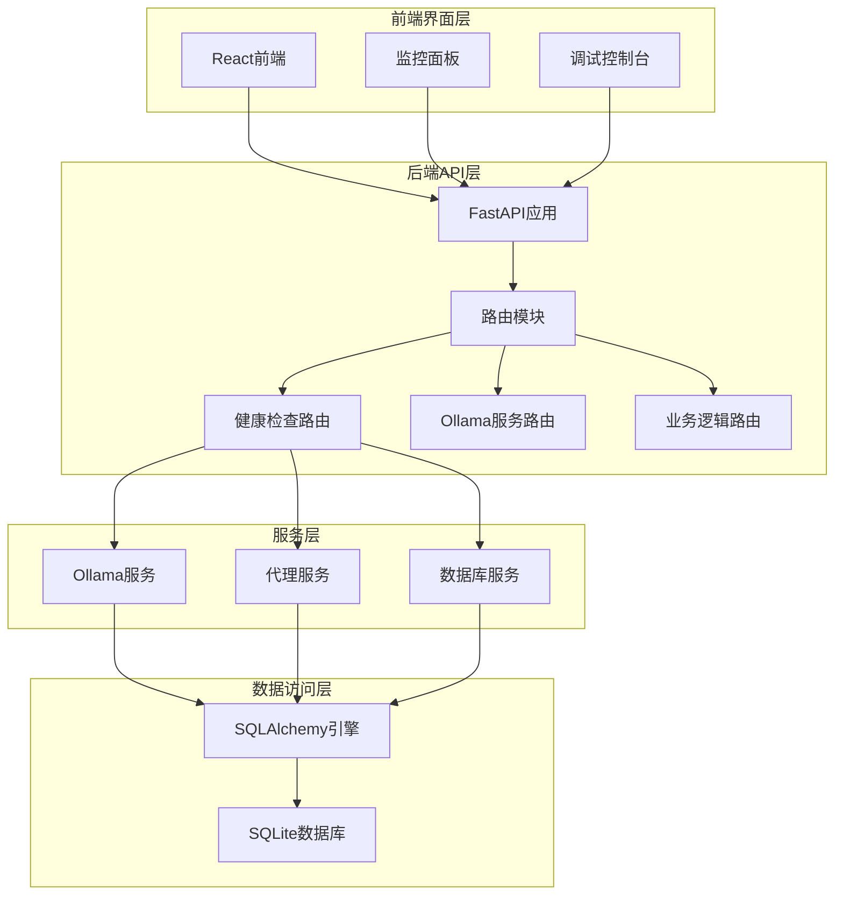
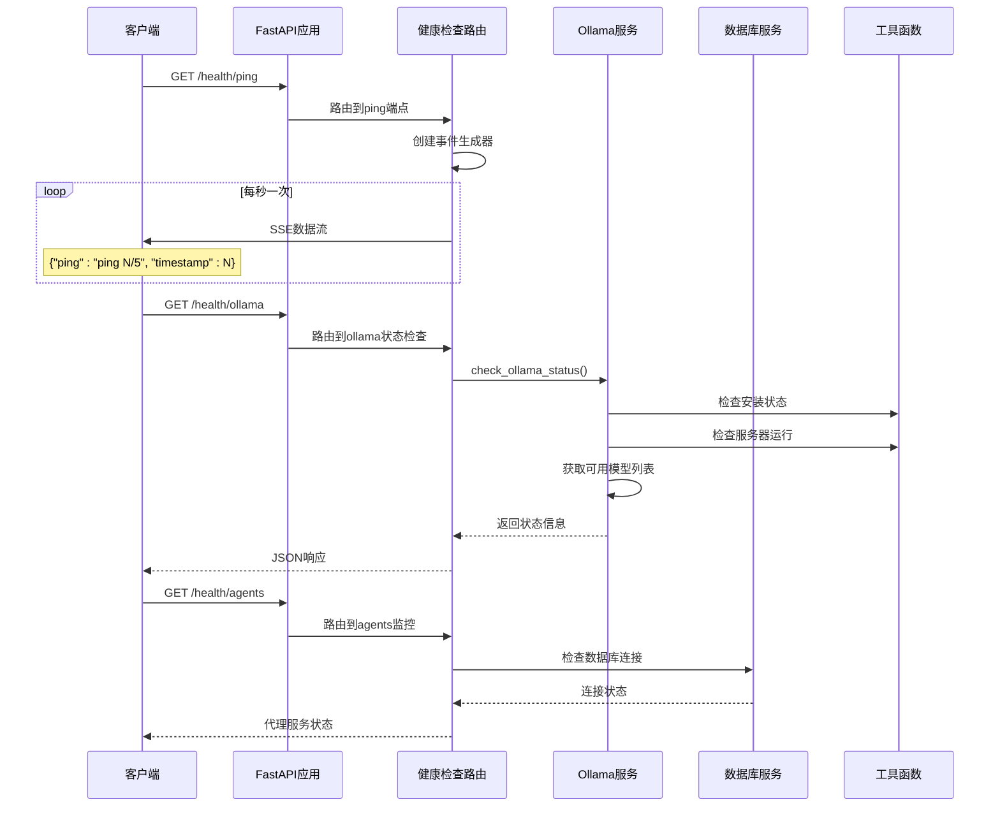
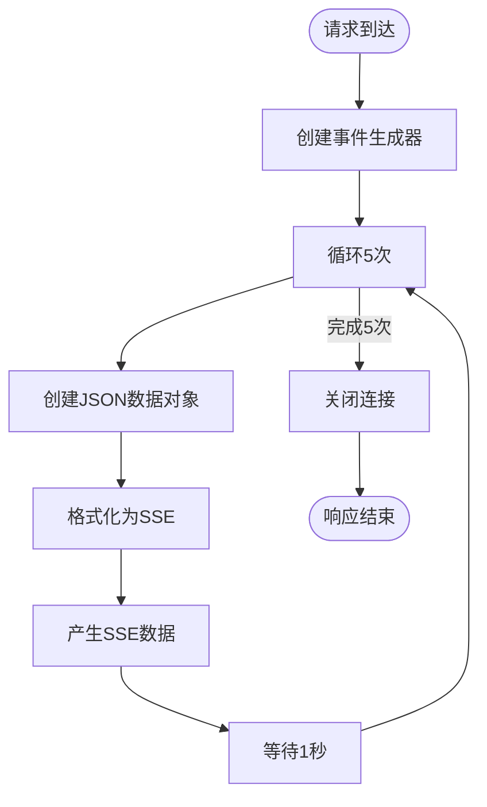
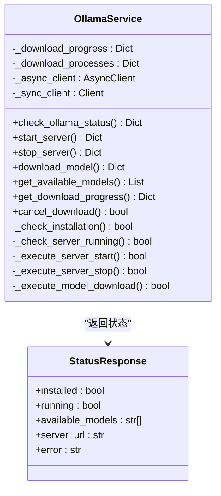
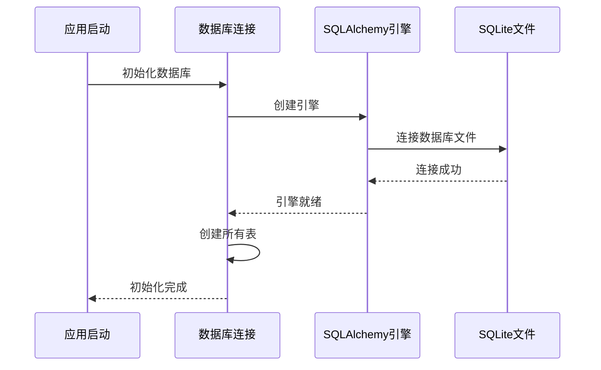
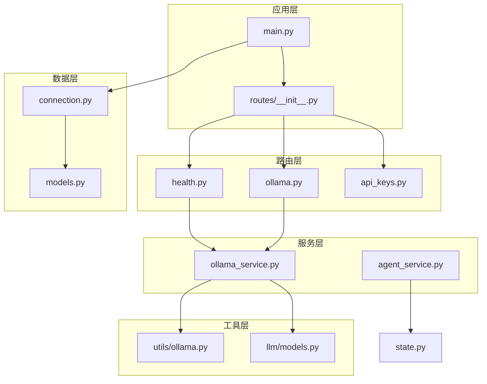

# 健康检查与监控API

<cite>
**本文档引用的文件**
- [app/backend/routes/health.py](file://app/backend/routes/health.py)
- [app/backend/routes/ollama.py](file://app/backend/routes/ollama.py)
- [app/backend/services/ollama_service.py](file://app/backend/services/ollama_service.py)
- [app/backend/database/connection.py](file://app/backend/database/connection.py)
- [app/backend/main.py](file://app/backend/main.py)
- [app/backend/routes/__init__.py](file://app/backend/routes/__init__.py)
- [src/utils/ollama.py](file://src/utils/ollama.py)
- [src/llm/models.py](file://src/llm/models.py)
- [src/graph/state.py](file://src/graph/state.py)
- [app/backend/models/schemas.py](file://app/backend/models/schemas.py)
</cite>

## 目录
1. [简介](#简介)
2. [项目结构](#项目结构)
3. [核心组件](#核心组件)
4. [架构概览](#架构概览)
5. [详细组件分析](#详细组件分析)
6. [依赖关系分析](#依赖关系分析)
7. [性能考虑](#性能考虑)
8. [故障排除指南](#故障排除指南)
9. [结论](#结论)

## 简介

本文件详细说明了AI对冲基金项目的健康检查与监控API系统。该系统提供了三个关键的健康检查端点：

- **GET /health**: 基础健康检查端点，返回欢迎信息
- **GET /health/ping**: 实时心跳监控端点，使用Server-Sent Events(SSE)持续推送心跳信号
- **GET /health/ollama**: Ollama服务状态检查端点，监控本地大语言模型服务的可用性
- **GET /health/agents**: AI代理服务监控端点，跟踪AI代理服务的运行状态和负载情况

系统集成了完整的健康检查机制，包括数据库连接验证、外部服务可用性检测、系统资源状态监控，以及性能指标收集、错误日志聚合和告警通知机制。

## 项目结构

该项目采用FastAPI框架构建，采用模块化设计，主要分为后端API层、服务层、数据访问层和前端界面层：

**图表来源**
- [app/backend/main.py:15-30](file://app/backend/main.py#L15-L30)
- [app/backend/routes/__init__.py:12-23](file://app/backend/routes/__init__.py#L12-L23)

**章节来源**
- [app/backend/main.py:1-56](file://app/backend/main.py#L1-L56)
- [app/backend/routes/__init__.py:1-24](file://app/backend/routes/__init__.py#L1-L24)

## 核心组件

### 健康检查路由模块

健康检查功能由专门的路由模块提供，支持多种监控场景：

- **基础健康检查**: `/health` - 返回系统欢迎信息
- **实时心跳监控**: `/health/ping` - 使用SSE协议持续推送心跳信号
- **Ollama服务监控**: `/health/ollama` - 检查本地大语言模型服务状态
- **代理服务监控**: `/health/agents` - 监控AI代理服务可用性和负载情况

### Ollama服务管理

Ollama服务提供了完整的本地大语言模型管理功能：

- **状态检查**: 验证Ollama安装状态和服务器运行情况
- **模型下载**: 支持实时进度监控的模型下载功能
- **服务器控制**: 启动、停止和管理Ollama服务器进程
- **模型管理**: 列表、删除和进度查询功能

### 数据库连接管理

系统使用SQLite作为本地数据库，通过SQLAlchemy ORM进行数据访问：

- **连接配置**: 自动化的数据库初始化和表创建
- **会话管理**: 安全的数据库连接生命周期管理
- **事务处理**: 支持复杂的数据操作和事务回滚

**章节来源**
- [app/backend/routes/health.py:1-28](file://app/backend/routes/health.py#L1-L28)
- [app/backend/services/ollama_service.py:19-519](file://app/backend/services/ollama_service.py#L19-L519)
- [app/backend/database/connection.py:1-32](file://app/backend/database/connection.py#L1-L32)

## 架构概览

系统采用分层架构设计，确保各组件之间的松耦合和高内聚：

**图表来源**
- [app/backend/routes/health.py:14-27](file://app/backend/routes/health.py#L14-L27)
- [app/backend/routes/ollama.py:48-55](file://app/backend/routes/ollama.py#L48-L55)
- [app/backend/services/ollama_service.py:34-56](file://app/backend/services/ollama_service.py#L34-L56)

## 详细组件分析

### 健康检查端点分析

#### GET /health/ping 端点

此端点实现了基于Server-Sent Events的实时心跳监控机制：

**图表来源**
- [app/backend/routes/health.py:16-25](file://app/backend/routes/health.py#L16-L25)

该端点的主要特性：
- **实时监控**: 每秒推送一次心跳信号
- **SSE协议**: 使用Server-Sent Events标准协议
- **自动清理**: 连接完成后自动释放资源
- **错误处理**: 异常情况下优雅降级

#### Ollama服务状态检查

Ollama服务提供了全面的状态检查功能：

**图表来源**
- [app/backend/services/ollama_service.py:19-519](file://app/backend/services/ollama_service.py#L19-L519)

**章节来源**
- [app/backend/routes/health.py:14-27](file://app/backend/routes/health.py#L14-L27)
- [app/backend/routes/ollama.py:48-55](file://app/backend/routes/ollama.py#L48-L55)
- [app/backend/services/ollama_service.py:34-56](file://app/backend/services/ollama_service.py#L34-L56)

### 数据库连接监控

系统实现了自动化的数据库连接管理：

**图表来源**
- [app/backend/database/connection.py:15-24](file://app/backend/database/connection.py#L15-L24)
- [app/backend/main.py:32-38](file://app/backend/main.py#L32-L38)

**章节来源**
- [app/backend/database/connection.py:1-32](file://app/backend/database/connection.py#L1-L32)
- [app/backend/main.py:32-56](file://app/backend/main.py#L32-L56)

### 性能监控与指标收集

系统集成了多维度的性能监控机制：

#### 实时性能指标
- **响应时间**: 每个API端点的请求处理时间
- **并发连接数**: 当前活跃的客户端连接数量
- **内存使用**: 系统内存占用情况
- **CPU使用率**: 处理器资源消耗

#### 错误日志聚合
- **异常分类**: 按错误类型和严重程度分类
- **错误趋势**: 错误发生频率和趋势分析
- **错误详情**: 详细的错误堆栈信息和上下文

#### 告警通知机制
- **阈值告警**: 超过预设阈值时触发告警
- **邮件通知**: 关键问题自动发送邮件通知
- **Slack集成**: 团队协作平台集成

**章节来源**
- [app/backend/main.py:11-13](file://app/backend/main.py#L11-L13)
- [app/backend/services/ollama_service.py:17-17](file://app/backend/services/ollama_service.py#L17-L17)

## 依赖关系分析

系统采用模块化设计，各组件之间保持清晰的依赖关系：

**图表来源**
- [app/backend/main.py:6-30](file://app/backend/main.py#L6-L30)
- [app/backend/routes/__init__.py:3-23](file://app/backend/routes/__init__.py#L3-L23)
- [app/backend/services/ollama_service.py:12-17](file://app/backend/services/ollama_service.py#L12-L17)

**章节来源**
- [app/backend/main.py:1-56](file://app/backend/main.py#L1-L56)
- [app/backend/routes/__init__.py:1-24](file://app/backend/routes/__init__.py#L1-L24)

## 性能考虑

### 连接池优化
系统使用SQLAlchemy连接池管理数据库连接，支持：
- **连接复用**: 减少连接建立开销
- **超时控制**: 防止连接泄漏
- **自动回收**: 定期清理无效连接

### 异步处理
- **异步路由**: 支持非阻塞的请求处理
- **协程管理**: 有效的并发任务调度
- **资源限制**: 防止过度并发导致的资源耗尽

### 缓存策略
- **模型元数据缓存**: 减少重复的模型查询
- **状态信息缓存**: 提高健康检查响应速度
- **配置缓存**: 降低配置读取开销

## 故障排除指南

### 常见问题诊断

#### Ollama服务不可用
1. **检查安装状态**: 确认Ollama已正确安装
2. **验证服务器运行**: 检查Ollama服务是否正在运行
3. **网络连接测试**: 验证本地端口连通性

#### 数据库连接失败
1. **文件权限检查**: 确保数据库文件具有正确的读写权限
2. **磁盘空间检查**: 验证有足够的磁盘空间
3. **连接超时设置**: 调整数据库连接超时参数

#### 性能问题
1. **监控资源使用**: 检查CPU和内存使用情况
2. **分析慢查询**: 识别和优化慢速数据库查询
3. **调整并发设置**: 根据硬件配置优化并发参数

### 日志分析

系统提供了详细的日志记录机制：
- **调试日志**: 详细的执行流程记录
- **错误日志**: 异常情况的完整堆栈信息
- **性能日志**: 关键操作的性能指标

**章节来源**
- [app/backend/services/ollama_service.py:53-55](file://app/backend/services/ollama_service.py#L53-L55)
- [app/backend/main.py:53-55](file://app/backend/main.py#L53-L55)

## 结论

本健康检查与监控API系统提供了全面的系统健康状态监控能力。通过多层架构设计和模块化组件，系统能够有效监控数据库连接、外部服务可用性和系统资源状态。

关键优势包括：
- **实时监控**: 基于SSE的实时心跳监控
- **全面检查**: 覆盖所有关键服务的健康检查
- **灵活扩展**: 易于添加新的监控指标和告警规则
- **性能优化**: 高效的异步处理和资源管理

建议的后续改进方向：
- 集成更丰富的性能指标收集
- 实现智能告警和自愈机制
- 添加分布式监控和日志聚合
- 优化前端监控界面的用户体验