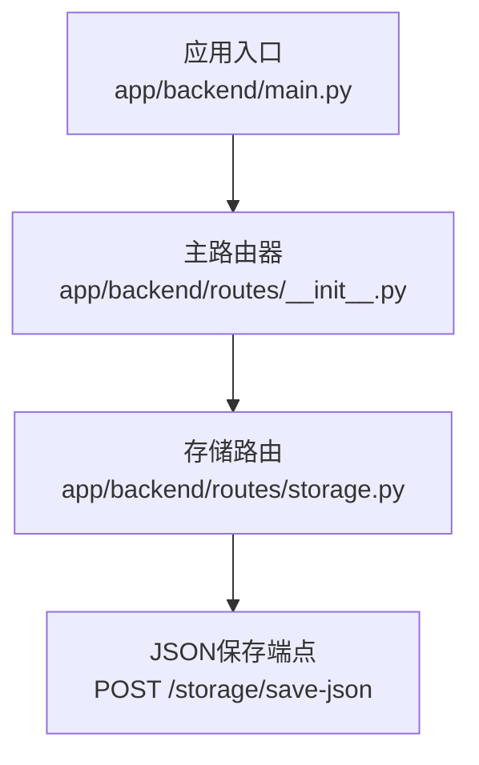
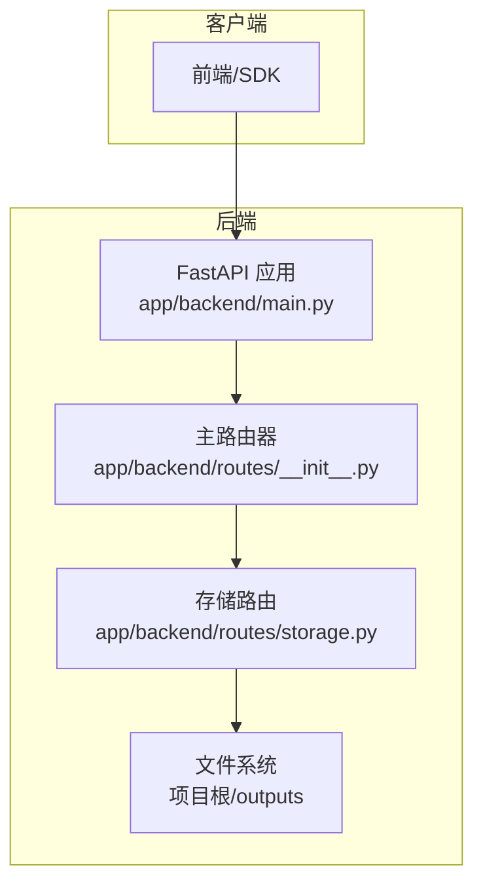
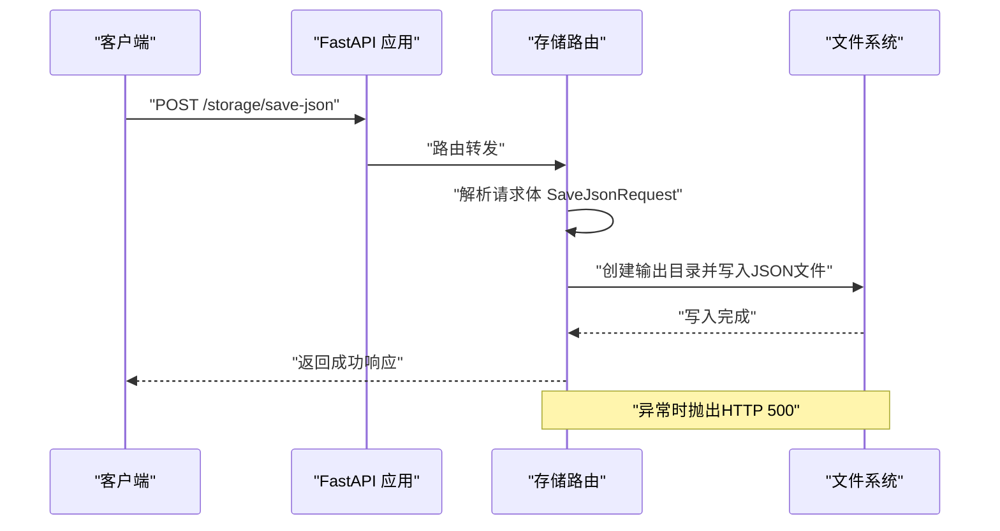
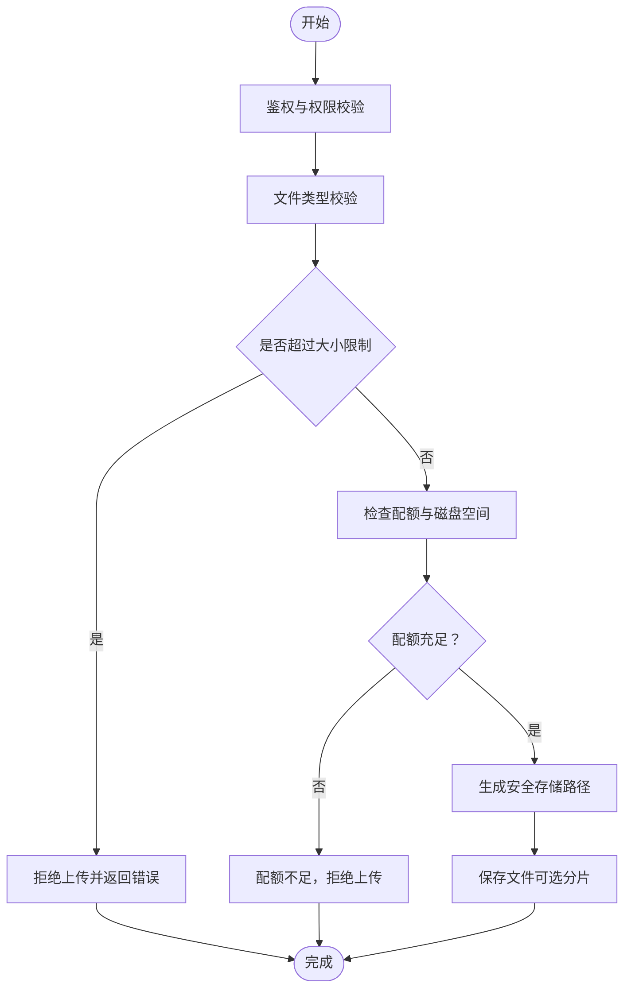
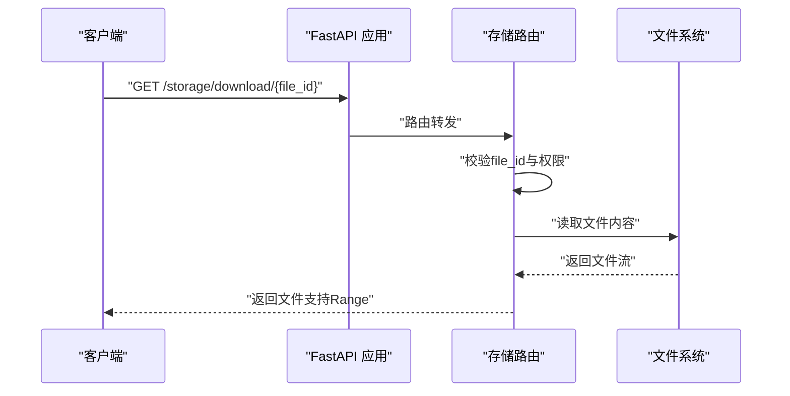
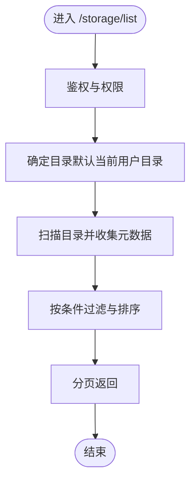
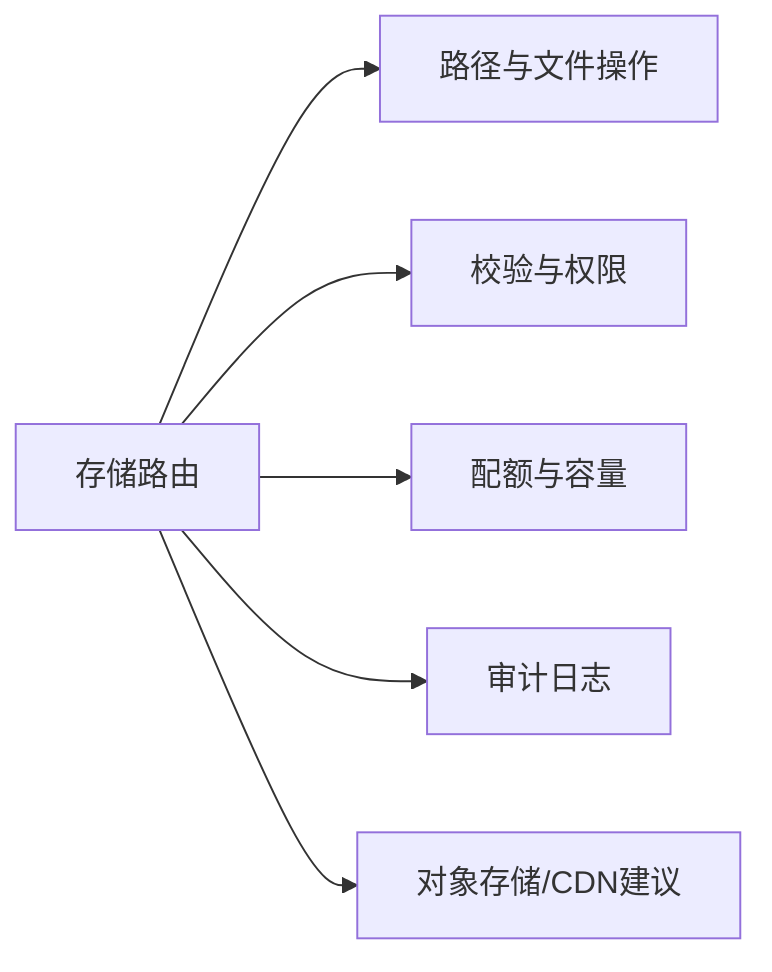

# 存储服务API

<cite>
**本文引用的文件**
- [app/backend/routes/storage.py](file://app/backend/routes/storage.py)
- [app/backend/routes/__init__.py](file://app/backend/routes/__init__.py)
- [app/backend/main.py](file://app/backend/main.py)
- [app/backend/models/schemas.py](file://app/backend/models/schemas.py)
</cite>

## 目录
1. [简介](#简介)
2. [项目结构](#项目结构)
3. [核心组件](#核心组件)
4. [架构总览](#架构总览)
5. [详细组件分析](#详细组件分析)
6. [依赖分析](#依赖分析)
7. [性能考虑](#性能考虑)
8. [故障排查指南](#故障排查指南)
9. [结论](#结论)

## 简介
本文件为“存储服务API”的技术文档，聚焦于当前仓库中已实现的JSON文件保存能力（/storage/save-json），并基于现有代码结构给出可扩展到完整文件上传、下载与管理接口的设计建议。当前实现支持：
- 将JSON数据写入项目根目录下的输出目录（outputs）
- 基础的请求参数校验与错误处理
- 通过FastAPI路由暴露REST接口

后续章节将结合现有实现，补充完整的上传、下载、列表与管理接口设计，并覆盖文件类型验证、大小限制、存储路径管理、安全验证、访问权限控制、存储配额管理、大文件上传与断点续传、批量操作等高级特性。

## 项目结构
后端采用FastAPI框架，路由按功能模块拆分，存储服务位于独立的子路由中，并由主路由器统一挂载。

图表来源
- [app/backend/main.py:15-30](file://app/backend/main.py#L15-L30)
- [app/backend/routes/__init__.py:12-24](file://app/backend/routes/__init__.py#L12-L24)
- [app/backend/routes/storage.py:8-44](file://app/backend/routes/storage.py#L8-L44)

章节来源
- [app/backend/main.py:15-30](file://app/backend/main.py#L15-L30)
- [app/backend/routes/__init__.py:12-24](file://app/backend/routes/__init__.py#L12-L24)
- [app/backend/routes/storage.py:8-44](file://app/backend/routes/storage.py#L8-L44)

## 核心组件
- 路由器与端点
  - 存储子路由：前缀为 /storage
  - 当前端点：POST /storage/save-json（保存JSON数据至本地文件系统）
- 数据模型
  - 请求体模型：SaveJsonRequest（包含文件名与数据字典）
  - 错误响应模型：ErrorResponse（用于400/500场景）
- 应用集成
  - 主路由器聚合各子路由（含storage_router）
  - FastAPI应用启动时初始化数据库表与CORS策略

章节来源
- [app/backend/routes/storage.py:8-44](file://app/backend/routes/storage.py#L8-L44)
- [app/backend/models/schemas.py:55-58](file://app/backend/models/schemas.py#L55-L58)
- [app/backend/routes/__init__.py:12-24](file://app/backend/routes/__init__.py#L12-L24)
- [app/backend/main.py:15-30](file://app/backend/main.py#L15-L30)

## 架构总览
下图展示当前存储服务在整体应用中的位置与调用关系：

图表来源
- [app/backend/main.py:15-30](file://app/backend/main.py#L15-L30)
- [app/backend/routes/__init__.py:12-24](file://app/backend/routes/__init__.py#L12-L24)
- [app/backend/routes/storage.py:8-44](file://app/backend/routes/storage.py#L8-L44)

## 详细组件分析

### 当前实现：POST /storage/save-json
- 功能概述
  - 接收JSON数据与目标文件名，写入项目根目录下的输出目录（若不存在则自动创建）
  - 返回成功状态、消息与文件名
- 请求与响应
  - 请求体：SaveJsonRequest（字段：filename、data）
  - 成功响应：包含success、message、filename
  - 错误响应：ErrorResponse（HTTP 400/500）
- 处理流程
  - 计算项目根目录与输出目录路径
  - 创建输出目录（如不存在）
  - 写入JSON文件（UTF-8编码，缩进格式）
  - 异常捕获并抛出HTTP 500

图表来源
- [app/backend/routes/storage.py:22-44](file://app/backend/routes/storage.py#L22-L44)
- [app/backend/models/schemas.py:55-58](file://app/backend/models/schemas.py#L55-L58)

章节来源
- [app/backend/routes/storage.py:22-44](file://app/backend/routes/storage.py#L22-L44)
- [app/backend/models/schemas.py:55-58](file://app/backend/models/schemas.py#L55-L58)

### 设计建议：扩展为完整存储服务API
以下为面向生产环境的扩展设计方案，便于与现有代码结构对齐与演进。

#### 1) 文件上传（POST /storage/upload）
- 目标
  - 支持多文件上传（multipart/form-data）
  - 文件类型白名单校验（MIME或扩展名）
  - 文件大小限制（默认10MB，可配置）
  - 存储路径管理（按用户/租户隔离，避免冲突）
- 安全与权限
  - 用户身份认证（JWT/会话）
  - 访问权限控制（仅允许上传到授权目录）
  - 文件名规范化（防路径穿越）
- 存储配额
  - 按用户/租户统计使用量，超过阈值拒绝上传
- 大文件与断点续传
  - 分片上传（前端分块，后端合并）
  - 断点续传（记录已上传分片索引）
- 批量操作
  - 批量上传、批量删除、批量重命名

#### 2) 文件下载（GET /storage/download/{file_id}）
- 目标
  - 根据file_id定位文件并返回
  - 支持范围下载（Range）
  - 下载计数与审计日志
- 安全
  - 仅授权用户可访问其拥有或共享的文件
  - 防路径穿越与非法字符过滤

#### 3) 文件列表（GET /storage/list）
- 目标
  - 列出指定目录下的文件与元数据（名称、大小、修改时间、类型）
  - 支持分页、排序、过滤（按类型、时间范围）
- 元数据
  - 文件名、路径、大小、创建/修改时间、MD5/ETag
  - 可选：标签、描述、共享状态

#### 4) 文件管理（删除、重命名、移动、复制）
- 删除
  - 支持单个/批量删除
  - 回收站机制（可选软删除）
- 重命名/移动
  - 同一卷内原子性重命名
  - 跨卷移动需先复制再删除
- 复制
  - 支持同卷/跨卷复制
  - 并发安全与去重

#### 5) 安全与合规
- 文件类型验证
  - 白名单（允许的MIME/扩展名）
  - 可选：魔数检测（Magic Bytes）
- 访问权限控制
  - RBAC：用户、角色、资源、权限矩阵
  - 文件级ACL：所有者、读写权限、共享链接
- 存储配额
  - 用户/租户配额、目录配额
  - 实时统计与告警
- 审计日志
  - 上传/下载/删除/重命名等关键操作记录

#### 6) 性能与可靠性
- 大文件上传
  - 分片上传（建议分片大小10-64MB）
  - 断点续传（记录已上传分片索引）
  - 并发分片上传与合并
- 流式下载
  - 使用StreamingResponse或文件句柄流式传输
  - Range支持与缓存优化
- 并发与一致性
  - 文件锁与原子写入
  - 并发删除/重命名的幂等性

#### 7) 批量操作
- 批量上传：多文件同时上传，失败回滚
- 批量删除：事务化删除，支持回收站
- 批量重命名：原子性重命名，冲突处理

## 依赖分析
- 组件耦合
  - 存储路由与文件系统直接耦合（当前实现）
  - 建议引入抽象存储服务层以解耦（本地/对象存储/CDN）
- 外部依赖
  - FastAPI（路由与中间件）
  - Python标准库（pathlib、json）
  - 可选：异步IO、并发库（如aiofiles）

## 性能考虑
- I/O优化
  - 使用异步文件操作（如aiofiles）提升吞吐
  - 合理设置缓冲区大小与并发度
- 缓存策略
  - 列表结果缓存（带失效时间）
  - 热点文件预热（CDN/边缘缓存）
- 网络优化
  - 断点续传与分片重试
  - Range下载减少带宽占用

## 故障排查指南
- 常见问题
  - 权限不足：检查用户角色与文件ACL
  - 超过配额：确认用户/租户配额与目录配额
  - 路径穿越：确保文件名规范化与白名单校验
  - IO异常：检查磁盘空间、文件句柄上限
- 日志与监控
  - 记录上传/下载/删除关键事件
  - 监控失败率、延迟、磁盘使用率

## 结论
当前仓库已提供基础的JSON文件保存能力，可作为存储服务API的起点。建议按照本文档的扩展设计，逐步完善文件上传、下载、列表与管理接口，并配套实现安全验证、访问权限控制、存储配额管理、大文件与断点续传、批量操作等高级特性，最终形成一套稳定、可扩展、可运维的存储服务API体系。