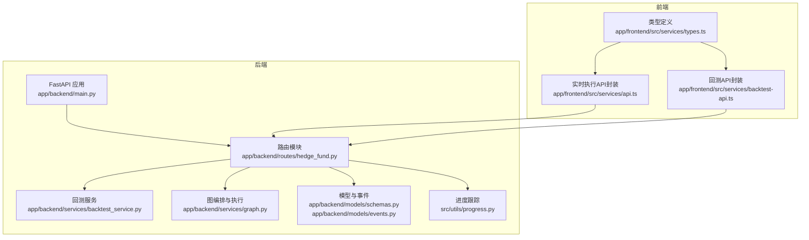
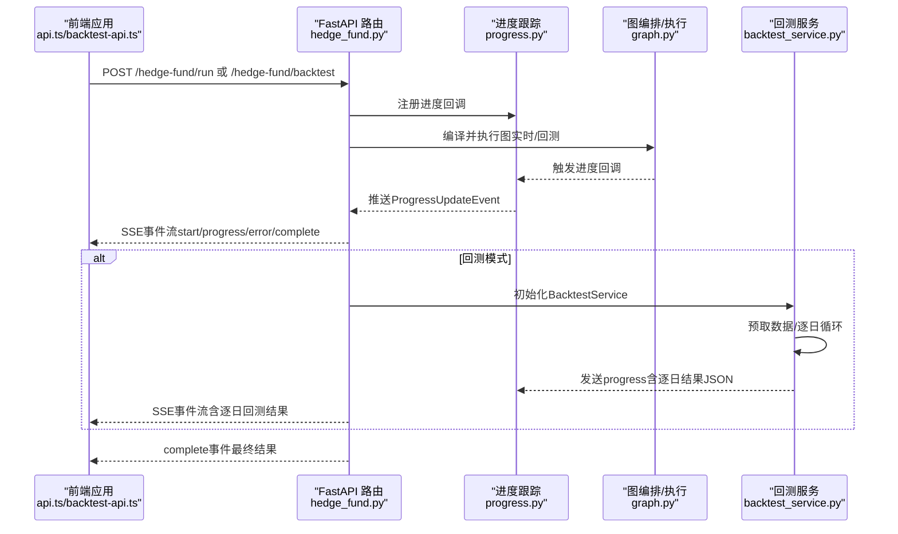
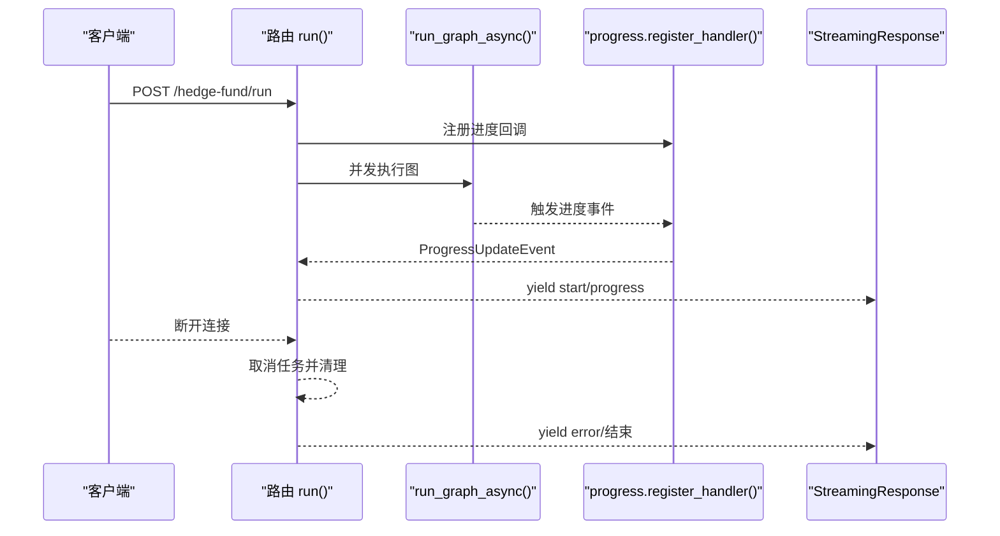
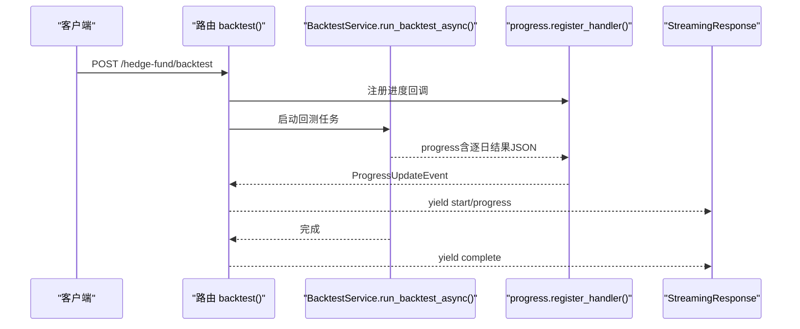
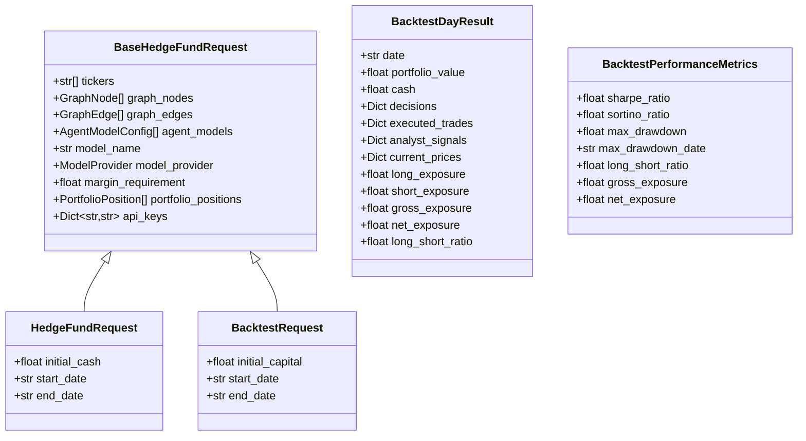
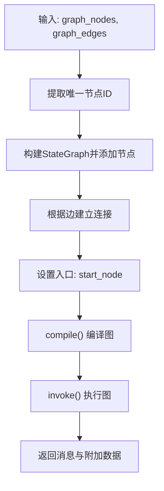
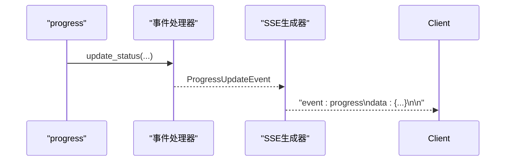
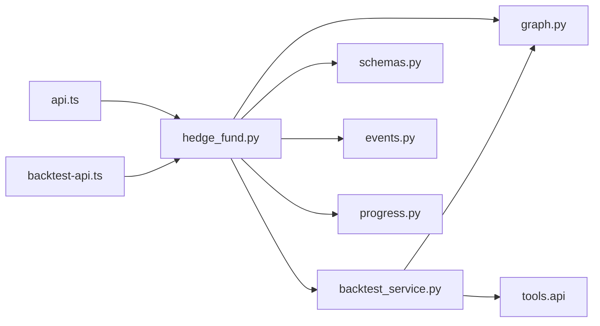

# 对冲基金API

<cite>
**本文引用的文件**
- [app/backend/routes/hedge_fund.py](file://app/backend/routes/hedge_fund.py)
- [app/backend/services/backtest_service.py](file://app/backend/services/backtest_service.py)
- [app/backend/models/schemas.py](file://app/backend/models/schemas.py)
- [app/backend/models/events.py](file://app/backend/models/events.py)
- [app/backend/services/graph.py](file://app/backend/services/graph.py)
- [app/backend/main.py](file://app/backend/main.py)
- [src/utils/progress.py](file://src/utils/progress.py)
- [app/frontend/src/services/api.ts](file://app/frontend/src/services/api.ts)
- [app/frontend/src/services/backtest-api.ts](file://app/frontend/src/services/backtest-api.ts)
- [app/frontend/src/services/types.ts](file://app/frontend/src/services/types.ts)
- [src/backtesting/engine.py](file://src/backtesting/engine.py)
- [src/backtesting/controller.py](file://src/backtesting/controller.py)
</cite>

## 目录
1. [简介](#简介)
2. [项目结构](#项目结构)
3. [核心组件](#核心组件)
4. [架构总览](#架构总览)
5. [详细组件分析](#详细组件分析)
6. [依赖分析](#依赖分析)
7. [性能考虑](#性能考虑)
8. [故障排查指南](#故障排查指南)
9. [结论](#结论)
10. [附录](#附录)

## 简介
本文件为对冲基金API的详细技术文档，聚焦于实时交易执行与回测服务的RESTful接口。重点覆盖以下内容：
- POST /hedge-fund/run：实时交易执行的SSE流式响应工作流
- POST /hedge-fund/backtest：回测配置、性能指标与结果输出
- 请求参数、响应格式与错误处理
- 流式事件传输、客户端连接管理与断开检测机制
- 前端集成示例（Fetch + SSE）

该系统基于FastAPI构建，后端通过LangGraph编排多智能体决策，结合外部金融数据源进行实时或历史回测。

## 项目结构
后端采用分层设计：
- 路由层：定义REST接口与SSE流式响应
- 服务层：回测服务、图编排、组合管理等
- 模型层：请求/响应Schema与SSE事件模型
- 工具层：进度跟踪、分析器、数据工具

图表来源
- [app/backend/main.py:15-30](file://app/backend/main.py#L15-L30)
- [app/backend/routes/hedge_fund.py:16-353](file://app/backend/routes/hedge_fund.py#L16-L353)
- [app/backend/services/backtest_service.py:18-539](file://app/backend/services/backtest_service.py#L18-L539)
- [app/backend/services/graph.py:35-193](file://app/backend/services/graph.py#L35-L193)
- [app/backend/models/schemas.py:55-141](file://app/backend/models/schemas.py#L55-L141)
- [app/backend/models/events.py:5-46](file://app/backend/models/events.py#L5-L46)
- [src/utils/progress.py:12-117](file://src/utils/progress.py#L12-L117)
- [app/frontend/src/services/api.ts:87-309](file://app/frontend/src/services/api.ts#L87-L309)
- [app/frontend/src/services/backtest-api.ts:20-291](file://app/frontend/src/services/backtest-api.ts#L20-L291)
- [app/frontend/src/services/types.ts:54-83](file://app/frontend/src/services/types.ts#L54-L83)

章节来源
- [app/backend/main.py:15-30](file://app/backend/main.py#L15-L30)
- [app/backend/routes/hedge_fund.py:16-353](file://app/backend/routes/hedge_fund.py#L16-L353)

## 核心组件
- 路由与SSE
  - /hedge-fund/run：接收HedgeFundRequest，返回text/event-stream，事件类型包括start、progress、error、complete
  - /hedge-fund/backtest：接收BacktestRequest，返回text/event-stream，事件类型同上，其中progress事件可携带逐日回测结果作为analysis字段的JSON字符串
- 回测服务
  - BacktestService：异步运行回测，支持预取数据、逐日执行、交易执行、暴露计算、性能指标更新
- 图编排与执行
  - create_graph：根据React Flow结构构建LangGraph，动态添加分析师节点、组合管理节点与风控节点，并设置边与入口
  - run_graph_async：在异步任务中执行图，返回消息与附加数据
- 进度跟踪
  - progress：全局进度跟踪器，注册/注销回调，向SSE事件队列推送progress事件
- 模型与事件
  - HedgeFundRequest/BacktestRequest：请求参数模型
  - StartEvent/ProgressUpdateEvent/ErrorEvent/CompleteEvent：SSE事件模型
  - BacktestDayResult/BacktestPerformanceMetrics：回测结果与指标模型

章节来源
- [app/backend/routes/hedge_fund.py:18-353](file://app/backend/routes/hedge_fund.py#L18-L353)
- [app/backend/services/backtest_service.py:18-539](file://app/backend/services/backtest_service.py#L18-L539)
- [app/backend/services/graph.py:35-193](file://app/backend/services/graph.py#L35-L193)
- [src/utils/progress.py:12-117](file://src/utils/progress.py#L12-L117)
- [app/backend/models/schemas.py:55-141](file://app/backend/models/schemas.py#L55-L141)
- [app/backend/models/events.py:5-46](file://app/backend/models/events.py#L5-L46)

## 架构总览
下图展示了实时执行与回测两条主路径的端到端交互：

图表来源
- [app/backend/routes/hedge_fund.py:26-331](file://app/backend/routes/hedge_fund.py#L26-L331)
- [app/backend/services/graph.py:132-177](file://app/backend/services/graph.py#L132-L177)
- [app/backend/services/backtest_service.py:285-512](file://app/backend/services/backtest_service.py#L285-L512)
- [src/utils/progress.py:22-62](file://src/utils/progress.py#L22-L62)

## 详细组件分析

### 实时交易执行：POST /hedge-fund/run
- 请求参数
  - 继承自BaseHedgeFundRequest，包含：
    - tickers：标的列表
    - graph_nodes/graph_edges：React Flow结构
    - agent_models：各节点的模型配置（可选）
    - model_name/model_provider：全局模型配置（可被agent_models覆盖）
    - margin_requirement：保证金要求
    - portfolio_positions：初始持仓（可选）
    - api_keys：API密钥字典（可选，未提供时从数据库自动填充）
    - initial_cash：初始现金（实时执行）
    - start_date/end_date：时间窗口（实时执行）
- 响应
  - text/event-stream，事件类型：
    - start：开始执行
    - progress：进度更新，包含agent、ticker、status、analysis、timestamp
    - error：错误信息
    - complete：最终结果，data包含：
      - decisions：交易决策
      - analyst_signals：分析师信号
      - current_prices：当前价格
- 断开检测
  - 使用request.receive()监听http.disconnect，一旦断开立即取消后台任务并清理资源
- SSE事件格式
  - 每个事件以“event: 类型”和“data: JSON”形式发送，双换行符分隔

图表来源
- [app/backend/routes/hedge_fund.py:26-155](file://app/backend/routes/hedge_fund.py#L26-L155)
- [app/backend/services/graph.py:132-177](file://app/backend/services/graph.py#L132-L177)
- [src/utils/progress.py:22-62](file://src/utils/progress.py#L22-L62)

章节来源
- [app/backend/routes/hedge_fund.py:18-155](file://app/backend/routes/hedge_fund.py#L18-L155)
- [app/backend/models/schemas.py:61-92](file://app/backend/models/schemas.py#L61-L92)
- [app/backend/models/events.py:16-46](file://app/backend/models/events.py#L16-L46)

### 回测服务：POST /hedge-fund/backtest
- 请求参数
  - 继承自BaseHedgeFundRequest，新增：
    - start_date/end_date：回测起止日期
    - initial_capital：初始资金
- 处理流程
  - 预取所需数据（价格、财务指标、内幕交易、新闻）
  - 逐工作日回放：
    - 获取当日价格
    - 执行图推理生成决策
    - 执行交易（支持多头/空头/平仓）
    - 计算组合价值与暴露
    - 更新性能指标（夏普、索提诺、最大回撤等）
    - 通过progress_callback推送progress事件（含逐日结果JSON）
  - 返回complete事件，data包含：
    - performance_metrics：性能指标
    - final_portfolio：最终组合状态
    - total_days：总天数
- SSE事件格式
  - progress事件的analysis字段包含BacktestDayResult的JSON字符串
  - complete事件的data字段包含performance_metrics、final_portfolio、total_days

图表来源
- [app/backend/routes/hedge_fund.py:170-331](file://app/backend/routes/hedge_fund.py#L170-L331)
- [app/backend/services/backtest_service.py:285-512](file://app/backend/services/backtest_service.py#L285-L512)

章节来源
- [app/backend/routes/hedge_fund.py:162-331](file://app/backend/routes/hedge_fund.py#L162-L331)
- [app/backend/services/backtest_service.py:285-512](file://app/backend/services/backtest_service.py#L285-L512)
- [app/backend/models/schemas.py:94-129](file://app/backend/models/schemas.py#L94-L129)

### 数据模型与事件
- 请求模型
  - BaseHedgeFundRequest：共享字段（tickers、graph_nodes、graph_edges、agent_models、model_name、model_provider、margin_requirement、portfolio_positions、api_keys）
  - HedgeFundRequest：实时执行，包含initial_cash、start_date/end_date
  - BacktestRequest：回测，包含initial_capital、start_date/end_date
- 结果模型
  - BacktestDayResult：逐日结果（日期、组合价值、现金、决策、已执行交易、分析师信号、当前价格、暴露等）
  - BacktestPerformanceMetrics：性能指标（夏普、索提诺、最大回撤及日期、多空比率、总/净暴露）
- SSE事件
  - StartEvent：开始
  - ProgressUpdateEvent：进度（agent、ticker、status、analysis、timestamp）
  - ErrorEvent：错误
  - CompleteEvent：完成（data）

图表来源
- [app/backend/models/schemas.py:61-129](file://app/backend/models/schemas.py#L61-L129)

章节来源
- [app/backend/models/schemas.py:61-129](file://app/backend/models/schemas.py#L61-L129)
- [app/backend/models/events.py:16-46](file://app/backend/models/events.py#L16-L46)

### 图编排与执行
- create_graph：根据graph_nodes/graph_edges构建StateGraph，动态注入分析师节点、组合管理节点与风控节点，设置入口为start_node
- run_graph_async/run_graph：在独立线程中执行图，返回messages与data（包含analyst_signals、current_prices等）
- 解析响应：parse_hedge_fund_response将LLM输出解析为决策字典

图表来源
- [app/backend/services/graph.py:35-129](file://app/backend/services/graph.py#L35-L129)
- [app/backend/services/graph.py:132-177](file://app/backend/services/graph.py#L132-L177)

章节来源
- [app/backend/services/graph.py:35-177](file://app/backend/services/graph.py#L35-L177)

### 进度跟踪与SSE事件
- progress：注册/注销回调，统一推送进度事件；每个事件包含agent、ticker、status、analysis、timestamp
- 事件序列：start → progress × N → complete 或 error

图表来源
- [src/utils/progress.py:22-62](file://src/utils/progress.py#L22-L62)
- [app/backend/models/events.py:22-31](file://app/backend/models/events.py#L22-L31)

章节来源
- [src/utils/progress.py:22-62](file://src/utils/progress.py#L22-L62)
- [app/backend/models/events.py:22-31](file://app/backend/models/events.py#L22-L31)

### 前端集成示例
- 实时执行
  - 使用fetch发起POST请求至/hedge-fund/run，读取ReadableStream，按“event: ...”和“data: ...”解析事件
  - start：重置节点状态
  - progress：映射到具体节点状态与分析
  - complete：写入输出节点数据，标记完成
  - error：标记错误并更新连接状态
- 回测
  - POST /hedge-fund/backtest，解析逐日progress事件中的analysis（BacktestDayResult JSON），累积最近N条结果用于可视化
  - complete：写入performance_metrics、final_portfolio、total_days
  - error：标记错误并更新连接状态

章节来源
- [app/frontend/src/services/api.ts:87-309](file://app/frontend/src/services/api.ts#L87-L309)
- [app/frontend/src/services/backtest-api.ts:20-291](file://app/frontend/src/services/backtest-api.ts#L20-L291)
- [app/frontend/src/services/types.ts:54-83](file://app/frontend/src/services/types.ts#L54-L83)

## 依赖分析
- 路由依赖
  - 依赖graph.py创建与执行图
  - 依赖backtest_service.py执行回测
  - 依赖models/schemas.py定义请求/响应模型
  - 依赖models/events.py定义SSE事件
  - 依赖utils/progress.py进行进度回调
- 服务依赖
  - BacktestService依赖tools.api进行外部数据获取
  - BacktestService依赖graph.py执行推理
- 前端依赖
  - api.ts/backtest-api.ts依赖后端SSE事件格式
  - types.ts定义请求/响应类型

图表来源
- [app/backend/routes/hedge_fund.py:1-15](file://app/backend/routes/hedge_fund.py#L1-L15)
- [app/backend/services/backtest_service.py:8-16](file://app/backend/services/backtest_service.py#L8-L16)
- [app/backend/services/graph.py:1-12](file://app/backend/services/graph.py#L1-L12)
- [src/utils/progress.py:1-9](file://src/utils/progress.py#L1-L9)
- [app/frontend/src/services/api.ts:1-10](file://app/frontend/src/services/api.ts#L1-L10)
- [app/frontend/src/services/backtest-api.ts:1-10](file://app/frontend/src/services/backtest-api.ts#L1-L10)

章节来源
- [app/backend/routes/hedge_fund.py:1-15](file://app/backend/routes/hedge_fund.py#L1-L15)
- [app/backend/services/backtest_service.py:8-16](file://app/backend/services/backtest_service.py#L8-L16)
- [app/backend/services/graph.py:1-12](file://app/backend/services/graph.py#L1-L12)
- [src/utils/progress.py:1-9](file://src/utils/progress.py#L1-L9)
- [app/frontend/src/services/api.ts:1-10](file://app/frontend/src/services/api.ts#L1-L10)
- [app/frontend/src/services/backtest-api.ts:1-10](file://app/frontend/src/services/backtest-api.ts#L1-L10)

## 性能考虑
- 异步执行
  - run_graph_async在独立线程执行，避免阻塞事件循环
  - BacktestService.run_backtest_async逐日异步调度，允许其他协程运行
- 数据预取
  - 回测启动前预取一年范围内的价格与因子数据，减少回放过程中的等待
- 暴露与收益计算
  - 逐日计算组合价值与暴露，仅在有足够数据时更新性能指标
- SSE流式输出
  - 事件驱动推送，避免一次性大对象传输，降低内存峰值

## 故障排查指南
- 常见错误
  - 400：请求参数校验失败（如价格必须为正、日期格式不正确等）
  - 500：服务器内部异常（如图执行失败、回测异常）
- 错误事件
  - SSE error事件会携带message字段，前端可据此更新节点状态与连接状态
- 断开检测
  - 后端通过request.receive()监听http.disconnect，断开后取消任务并清理
- 前端处理
  - SSE解析失败或连接中断时，标记ERROR并更新连接状态；支持手动AbortController中断

章节来源
- [app/backend/routes/hedge_fund.py:157-160](file://app/backend/routes/hedge_fund.py#L157-L160)
- [app/backend/routes/hedge_fund.py:333-336](file://app/backend/routes/hedge_fund.py#L333-L336)
- [app/backend/models/events.py:32-37](file://app/backend/models/events.py#L32-L37)
- [app/frontend/src/services/api.ts:258-295](file://app/frontend/src/services/api.ts#L258-L295)
- [app/frontend/src/services/backtest-api.ts:233-274](file://app/frontend/src/services/backtest-api.ts#L233-L274)

## 结论
本对冲基金API通过FastAPI+SSE实现了实时交易执行与回测服务的高并发、低延迟与可观测性。后端以LangGraph为中枢，串联多智能体与风控逻辑；前端通过标准SSE协议实现流畅的可视化与交互。建议在生产环境中配合限流、缓存与监控体系，确保稳定与可观测。

## 附录

### 接口定义与示例

- POST /hedge-fund/run
  - 请求体：HedgeFundRequest
  - 成功响应：text/event-stream
  - 典型事件序列：start → progress × N → complete
  - 错误：error
- POST /hedge-fund/backtest
  - 请求体：BacktestRequest
  - 成功响应：text/event-stream
  - progress事件的analysis字段包含BacktestDayResult的JSON字符串
  - complete事件的data字段包含performance_metrics、final_portfolio、total_days
  - 错误：error

章节来源
- [app/backend/routes/hedge_fund.py:18-331](file://app/backend/routes/hedge_fund.py#L18-L331)
- [app/backend/models/schemas.py:94-129](file://app/backend/models/schemas.py#L94-L129)