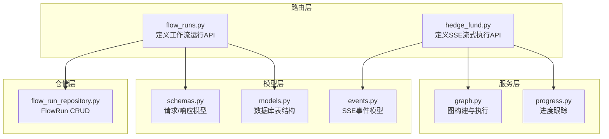
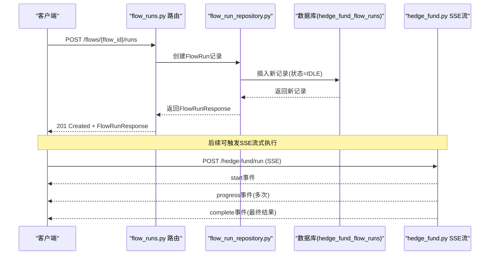
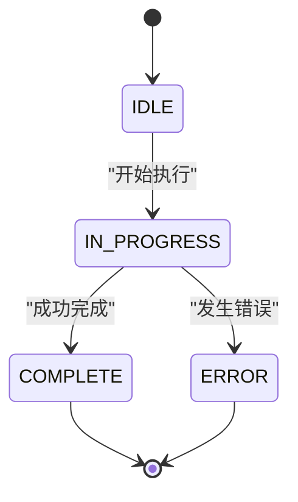
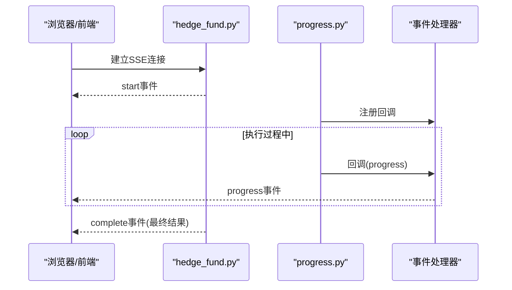
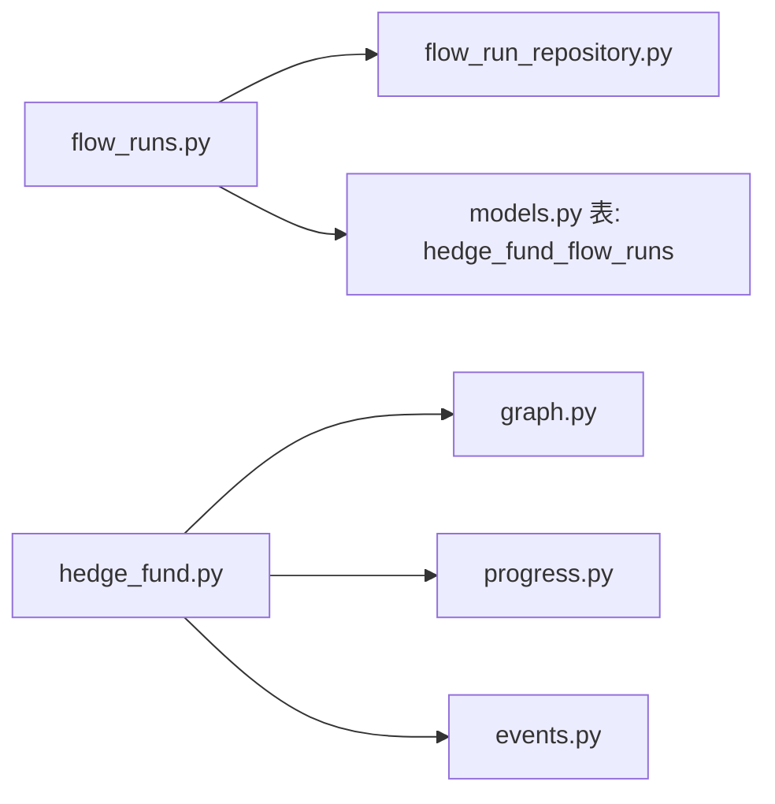

# 工作流执行API

<cite>
**本文档引用的文件**
- [app/backend/routes/flow_runs.py](file://app/backend/routes/flow_runs.py)
- [app/backend/repositories/flow_run_repository.py](file://app/backend/repositories/flow_run_repository.py)
- [app/backend/models/schemas.py](file://app/backend/models/schemas.py)
- [app/backend/database/models.py](file://app/backend/database/models.py)
- [app/backend/models/events.py](file://app/backend/models/events.py)
- [app/backend/routes/hedge_fund.py](file://app/backend/routes/hedge_fund.py)
- [src/utils/progress.py](file://src/utils/progress.py)
- [app/backend/main.py](file://app/backend/main.py)
</cite>

## 目录
1. [简介](#简介)
2. [项目结构](#项目结构)
3. [核心组件](#核心组件)
4. [架构总览](#架构总览)
5. [详细组件分析](#详细组件分析)
6. [依赖关系分析](#依赖关系分析)
7. [性能考虑](#性能考虑)
8. [故障排除指南](#故障排除指南)
9. [结论](#结论)

## 简介
本文件面向后端与前端开发者，系统性阐述工作流执行API的设计与实现，重点覆盖以下方面：
- POST /flows/{flow_id}/runs：启动工作流执行，包含执行参数、并发控制与资源管理策略
- GET /flows/{flow_id}/runs：查询执行历史与状态信息
- GET /flows/{flow_id}/runs/{run_id}：获取特定执行实例的详细信息
- 执行状态跟踪、进度报告与结果获取机制
- SSE（Server-Sent Events）事件流的使用方法与客户端实现要点

该API围绕工作流运行实例（FlowRun）进行生命周期管理，支持从创建、查询到更新与删除的完整流程；同时通过SSE事件流为前端提供实时状态反馈。

## 项目结构
工作流执行API位于后端FastAPI应用中，采用分层设计：
- 路由层：定义REST接口与HTTP响应模型
- 仓储层：封装数据库访问与CRUD操作
- 模型层：定义数据库表结构与Pydantic数据模型
- 服务层：包含图构建、回测、代理等业务逻辑（与工作流执行相关）

图表来源
- [app/backend/routes/flow_runs.py:1-303](file://app/backend/routes/flow_runs.py#L1-L303)
- [app/backend/repositories/flow_run_repository.py:1-133](file://app/backend/repositories/flow_run_repository.py#L1-L133)
- [app/backend/models/schemas.py:1-292](file://app/backend/models/schemas.py#L1-L292)
- [app/backend/database/models.py:1-115](file://app/backend/database/models.py#L1-L115)
- [app/backend/models/events.py:1-46](file://app/backend/models/events.py#L1-L46)
- [app/backend/routes/hedge_fund.py:1-353](file://app/backend/routes/hedge_fund.py#L1-L353)
- [src/utils/progress.py:1-117](file://src/utils/progress.py#L1-L117)

章节来源
- [app/backend/routes/flow_runs.py:1-303](file://app/backend/routes/flow_runs.py#L1-L303)
- [app/backend/repositories/flow_run_repository.py:1-133](file://app/backend/repositories/flow_run_repository.py#L1-L133)
- [app/backend/models/schemas.py:1-292](file://app/backend/models/schemas.py#L1-L292)
- [app/backend/database/models.py:1-115](file://app/backend/database/models.py#L1-L115)
- [app/backend/models/events.py:1-46](file://app/backend/models/events.py#L1-L46)
- [app/backend/routes/hedge_fund.py:1-353](file://app/backend/routes/hedge_fund.py#L1-L353)
- [src/utils/progress.py:1-117](file://src/utils/progress.py#L1-L117)

## 核心组件
- 工作流运行实例（FlowRun）
  - 数据库表字段涵盖状态、时间戳、请求参数、结果与错误信息等
  - 支持按flow_id查询、获取最新/活跃运行、统计总数等
- 请求/响应模型
  - FlowRunCreateRequest：创建时传入的请求数据
  - FlowRunUpdateRequest：更新状态、结果或错误信息
  - FlowRunResponse/FlowRunSummaryResponse：返回给客户端的完整/简要信息
- SSE事件模型
  - StartEvent、ProgressUpdateEvent、ErrorEvent、CompleteEvent：统一的事件格式
- 进度跟踪
  - progress工具提供全局进度回调注册/注销与事件派发，供SSE流使用

章节来源
- [app/backend/database/models.py:29-57](file://app/backend/database/models.py#L29-L57)
- [app/backend/models/schemas.py:197-241](file://app/backend/models/schemas.py#L197-L241)
- [app/backend/models/events.py:5-46](file://app/backend/models/events.py#L5-L46)
- [src/utils/progress.py:12-65](file://src/utils/progress.py#L12-L65)

## 架构总览
工作流执行API的调用链路如下：

图表来源
- [app/backend/routes/flow_runs.py:20-51](file://app/backend/routes/flow_runs.py#L20-L51)
- [app/backend/repositories/flow_run_repository.py:15-29](file://app/backend/repositories/flow_run_repository.py#L15-L29)
- [app/backend/database/models.py:29-57](file://app/backend/database/models.py#L29-L57)
- [app/backend/routes/hedge_fund.py:18-155](file://app/backend/routes/hedge_fund.py#L18-L155)

## 详细组件分析

### POST /flows/{flow_id}/runs：启动工作流执行
- 功能概述
  - 验证目标flow存在性
  - 基于请求数据创建新的FlowRun记录，默认状态为IDLE
  - 返回完整的FlowRunResponse
- 关键行为
  - 参数校验：确保flow_id有效
  - 自动编号：根据flow_id生成递增run_number
  - 时间戳：创建时写入created_at，后续状态变更自动更新updated_at
- 并发控制与资源管理
  - 当前实现未显式限制同一flow的并发运行数
  - 可通过扩展在创建时检查是否存在IN_PROGRESS运行，或引入队列/锁机制
- 错误处理
  - 流程不存在返回404
  - 其他异常返回500

章节来源
- [app/backend/routes/flow_runs.py:20-51](file://app/backend/routes/flow_runs.py#L20-L51)
- [app/backend/repositories/flow_run_repository.py:15-29](file://app/backend/repositories/flow_run_repository.py#L15-L29)
- [app/backend/database/models.py:29-57](file://app/backend/database/models.py#L29-L57)

### GET /flows/{flow_id}/runs：查询执行历史与状态信息
- 功能概述
  - 分页查询指定flow的所有运行记录
  - 默认limit=50，范围1-100
  - 结果按创建时间倒序排列
- 返回模型
  - 使用FlowRunSummaryResponse，不包含request_data与results，适合列表展示
- 实现要点
  - 支持limit与offset参数
  - 流程不存在返回404

章节来源
- [app/backend/routes/flow_runs.py:54-83](file://app/backend/routes/flow_runs.py#L54-L83)
- [app/backend/repositories/flow_run_repository.py:35-44](file://app/backend/repositories/flow_run_repository.py#L35-L44)
- [app/backend/models/schemas.py:228-241](file://app/backend/models/schemas.py#L228-L241)

### GET /flows/{flow_id}/runs/{run_id}：获取特定执行实例详情
- 功能概述
  - 获取单个FlowRun的完整信息（含request_data、results、错误信息等）
  - 若run_id不存在或不属于该flow，返回404
- 返回模型
  - FlowRunResponse，包含状态、时间戳、运行号等

章节来源
- [app/backend/routes/flow_runs.py:140-167](file://app/backend/routes/flow_runs.py#L140-L167)
- [app/backend/repositories/flow_run_repository.py:31-33](file://app/backend/repositories/flow_run_repository.py#L31-L33)
- [app/backend/models/schemas.py:210-226](file://app/backend/models/schemas.py#L210-L226)

### 更新与删除运行实例
- PUT /flows/{flow_id}/runs/{run_id}
  - 支持更新状态（IDLE/IN_PROGRESS/COMPLETE/ERROR）、结果与错误信息
  - 自动维护started_at/completed_at时间戳
- DELETE /flows/{flow_id}/runs/{run_id}
  - 删除指定运行
- DELETE /flows/{flow_id}/runs
  - 删除该flow下的所有运行，返回删除数量

章节来源
- [app/backend/routes/flow_runs.py:170-275](file://app/backend/routes/flow_runs.py#L170-L275)
- [app/backend/repositories/flow_run_repository.py:66-116](file://app/backend/repositories/flow_run_repository.py#L66-L116)

### 执行状态跟踪、进度报告与结果获取机制
- 状态流转
  - IDLE → IN_PROGRESS（首次进入时写入started_at）
  - IN_PROGRESS → COMPLETE 或 ERROR（完成或失败时写入completed_at）
- 进度报告
  - SSE事件流提供实时进度：start、progress、error、complete
  - progress事件包含agent名称、股票代码、状态、分析文本与时间戳
- 结果获取
  - complete事件携带最终决策、分析师信号与当前价格等数据

图表来源
- [app/backend/models/schemas.py:9-14](file://app/backend/models/schemas.py#L9-L14)
- [app/backend/repositories/flow_run_repository.py:66-96](file://app/backend/repositories/flow_run_repository.py#L66-L96)

章节来源
- [app/backend/models/schemas.py:9-14](file://app/backend/models/schemas.py#L9-L14)
- [app/backend/repositories/flow_run_repository.py:66-96](file://app/backend/repositories/flow_run_repository.py#L66-L96)
- [app/backend/models/events.py:16-46](file://app/backend/models/events.py#L16-L46)

### SSE事件流使用方法与客户端实现要点
- 事件类型
  - start：开始执行
  - progress：进度更新（包含agent、ticker、status、analysis、timestamp）
  - error：错误事件（包含message）
  - complete：最终结果（包含decisions、analyst_signals、current_prices等）
- 客户端解析
  - 按行解析event与data字段，逐条组装事件对象
  - 根据事件类型更新UI状态（如节点状态、消息提示）
- 断开检测
  - 后端通过request.receive()监听http.disconnect，及时取消任务
- 前端集成建议
  - 使用AbortController中断SSE连接
  - 在complete/error事件后清理连接状态

图表来源
- [app/backend/routes/hedge_fund.py:63-155](file://app/backend/routes/hedge_fund.py#L63-L155)
- [src/utils/progress.py:22-65](file://src/utils/progress.py#L22-L65)
- [app/backend/models/events.py:16-46](file://app/backend/models/events.py#L16-L46)

章节来源
- [app/backend/routes/hedge_fund.py:63-155](file://app/backend/routes/hedge_fund.py#L63-L155)
- [src/utils/progress.py:22-65](file://src/utils/progress.py#L22-L65)
- [app/backend/models/events.py:16-46](file://app/backend/models/events.py#L16-L46)

## 依赖关系分析
- 路由依赖
  - flow_runs.py依赖FlowRepository与FlowRunRepository进行数据访问
  - hedge_fund.py依赖graph.py进行图构建与执行，依赖progress.py进行进度回调
- 数据模型
  - FlowRun对应数据库表hedge_fund_flow_runs，包含状态、时间戳、请求/结果数据
- 事件模型
  - 统一的SSE事件格式，便于前后端约定

图表来源
- [app/backend/routes/flow_runs.py:1-17](file://app/backend/routes/flow_runs.py#L1-L17)
- [app/backend/repositories/flow_run_repository.py:1-14](file://app/backend/repositories/flow_run_repository.py#L1-L14)
- [app/backend/database/models.py:29-57](file://app/backend/database/models.py#L29-L57)
- [app/backend/routes/hedge_fund.py:1-15](file://app/backend/routes/hedge_fund.py#L1-L15)
- [src/utils/progress.py:1-10](file://src/utils/progress.py#L1-L10)
- [app/backend/models/events.py:1-6](file://app/backend/models/events.py#L1-L6)

章节来源
- [app/backend/routes/flow_runs.py:1-17](file://app/backend/routes/flow_runs.py#L1-L17)
- [app/backend/repositories/flow_run_repository.py:1-14](file://app/backend/repositories/flow_run_repository.py#L1-L14)
- [app/backend/database/models.py:29-57](file://app/backend/database/models.py#L29-L57)
- [app/backend/routes/hedge_fund.py:1-15](file://app/backend/routes/hedge_fund.py#L1-L15)
- [src/utils/progress.py:1-10](file://src/utils/progress.py#L1-L10)
- [app/backend/models/events.py:1-6](file://app/backend/models/events.py#L1-L6)

## 性能考虑
- 查询优化
  - 对flow_id建立索引，提升按flow查询与统计效率
  - 列表查询默认limit=50，避免一次性返回过多数据
- 写入优化
  - 单条插入后立即commit/refresh，减少事务持有时间
- SSE流
  - 使用异步队列传递进度事件，避免阻塞主循环
  - 及时取消长时间未读取的连接，释放资源
- 并发控制
  - 当前未限制同一flow的并发运行数，建议在业务层增加互斥或队列控制

## 故障排除指南
- 常见错误
  - 404：flow不存在或run不存在/不属于该flow
  - 500：内部服务器错误（数据库异常、图执行异常等）
- 排查步骤
  - 确认flow_id与run_id是否正确
  - 检查数据库连接与表结构
  - 查看SSE事件流是否正常发送start/progress/complete
  - 检查断开检测逻辑，确认连接被正确终止
- 日志与监控
  - 后端已配置基础日志输出，可在生产环境接入结构化日志

章节来源
- [app/backend/routes/flow_runs.py:34-51](file://app/backend/routes/flow_runs.py#L34-L51)
- [app/backend/routes/hedge_fund.py:157-160](file://app/backend/routes/hedge_fund.py#L157-L160)

## 结论
工作流执行API提供了从创建、查询到更新与删除的完整生命周期管理，并通过SSE事件流实现了高效的实时状态反馈。当前实现简洁清晰，具备良好的扩展性。建议后续增强：
- 并发控制与运行队列
- 更细粒度的权限与审计
- SSE事件的重连与幂等处理
- 前端侧的事件去抖与错误恢复