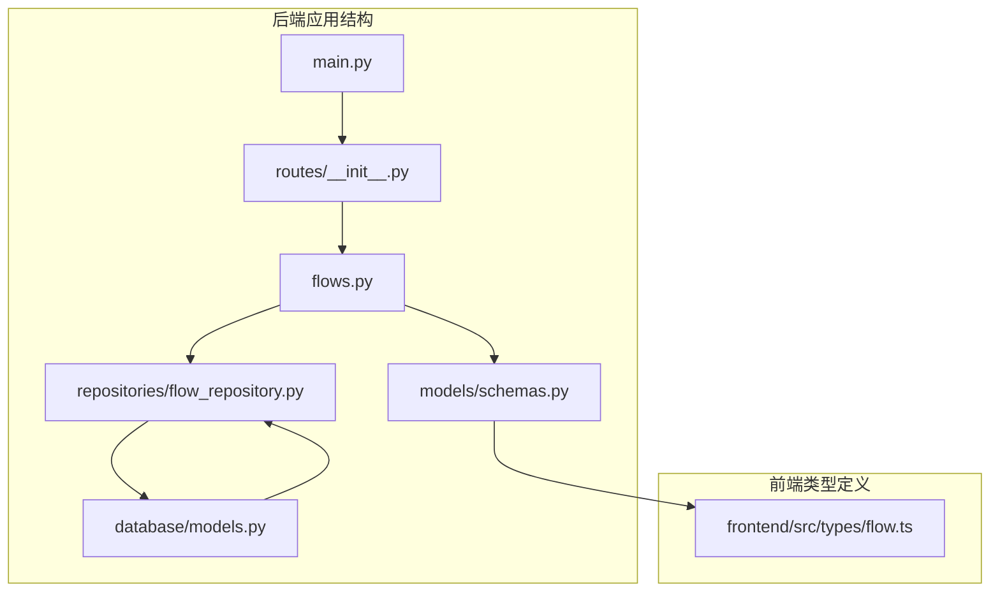
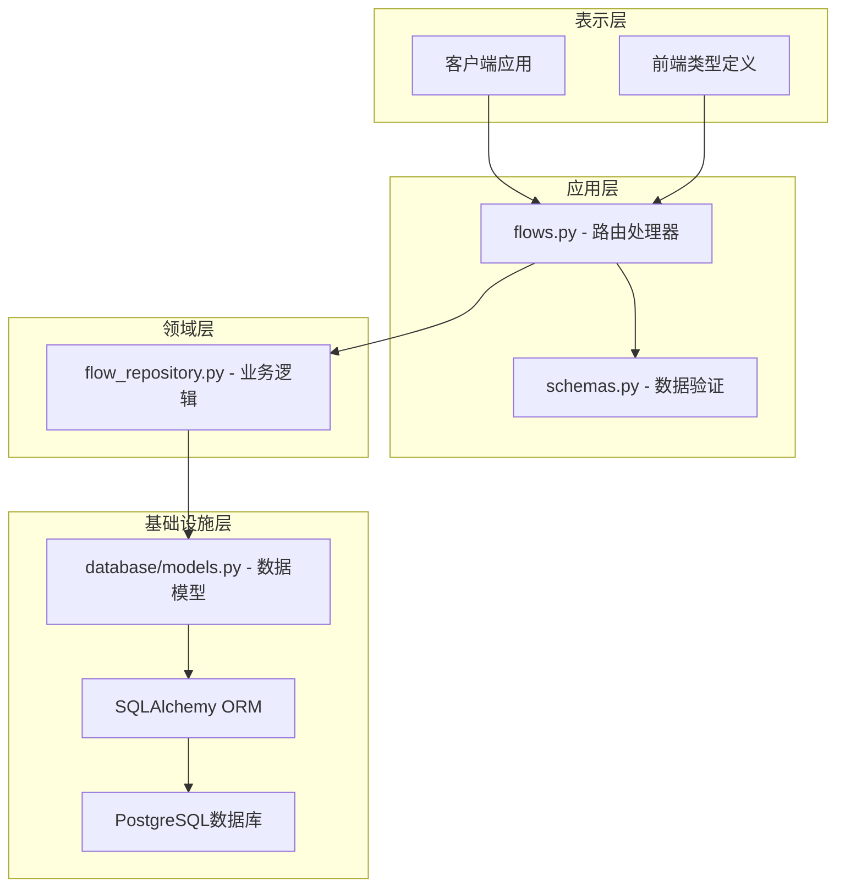
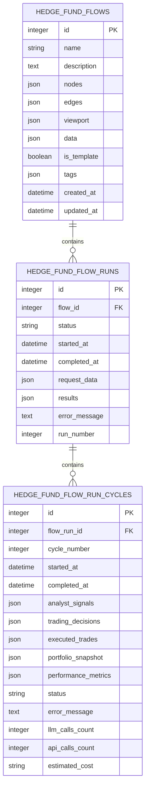
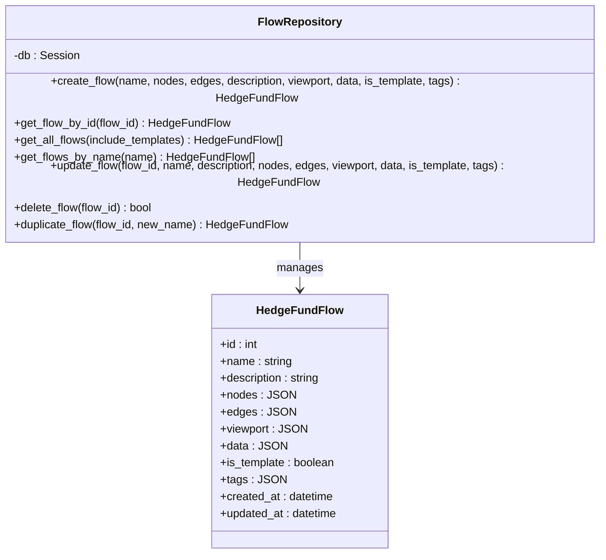
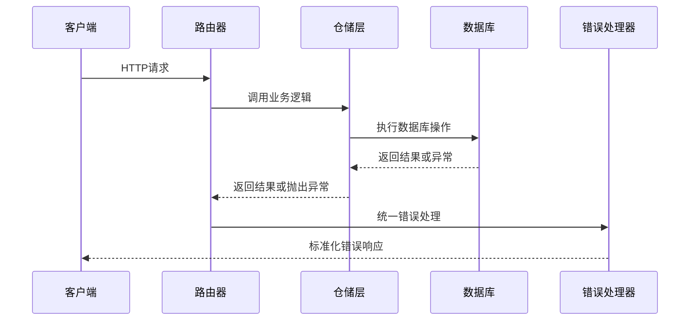
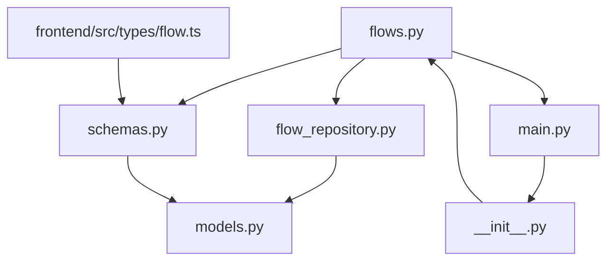

# 工作流管理API

<cite>
**本文档引用的文件**
- [flows.py](file://app/backend/routes/flows.py)
- [schemas.py](file://app/backend/models/schemas.py)
- [flow_repository.py](file://app/backend/repositories/flow_repository.py)
- [models.py](file://app/backend/database/models.py)
- [main.py](file://app/backend/main.py)
- [__init__.py](file://app/backend/routes/__init__.py)
- [flow.ts](file://app/frontend/src/types/flow.ts)
</cite>

## 目录
1. [简介](#简介)
2. [项目结构](#项目结构)
3. [核心组件](#核心组件)
4. [架构概览](#架构概览)
5. [详细组件分析](#详细组件分析)
6. [依赖关系分析](#依赖关系分析)
7. [性能考虑](#性能考虑)
8. [故障排除指南](#故障排除指南)
9. [结论](#结论)

## 简介

工作流管理API是AI对冲基金系统的核心组件，负责管理和操作基于React Flow图形的工作流配置。该API提供了完整的工作流CRUD操作，支持工作流模板管理、节点定义、连接关系以及标签分类功能。系统采用FastAPI框架构建，使用SQLAlchemy进行数据库操作，支持异步处理和完整的数据验证。

## 项目结构

工作流管理API位于后端应用的路由层，采用模块化设计，遵循RESTful API规范：



**图表来源**
- [main.py:1-56](file://app/backend/main.py#L1-L56)
- [__init__.py:1-24](file://app/backend/routes/__init__.py#L1-L24)
- [flows.py:1-174](file://app/backend/routes/flows.py#L1-L174)

**章节来源**
- [main.py:1-56](file://app/backend/main.py#L1-L56)
- [__init__.py:1-24](file://app/backend/routes/__init__.py#L1-L24)

## 核心组件

### API路由层
- **flows.py**: 定义了所有工作流相关的HTTP端点
- **HTTP方法**: 支持GET、POST、PUT、DELETE等标准CRUD操作
- **路由前缀**: `/flows`，统一的命名空间管理

### 数据模型层
- **schemas.py**: 定义了所有数据传输对象（DTO）
- **数据库模型**: 基于SQLAlchemy ORM映射
- **验证规则**: 使用Pydantic进行数据验证

### 仓储层
- **flow_repository.py**: 实现数据访问逻辑
- **CRUD操作**: 提供完整的数据持久化功能
- **查询优化**: 支持模板过滤和名称搜索

**章节来源**
- [flows.py:15-174](file://app/backend/routes/flows.py#L15-L174)
- [schemas.py:143-195](file://app/backend/models/schemas.py#L143-L195)
- [flow_repository.py:6-103](file://app/backend/repositories/flow_repository.py#L6-L103)

## 架构概览

工作流管理API采用经典的三层架构模式：



**图表来源**
- [flows.py:1-174](file://app/backend/routes/flows.py#L1-L174)
- [schemas.py:1-292](file://app/backend/models/schemas.py#L1-L292)
- [flow_repository.py:1-103](file://app/backend/repositories/flow_repository.py#L1-L103)
- [models.py:1-115](file://app/backend/database/models.py#L1-L115)

## 详细组件分析

### 数据模型设计

工作流数据模型采用灵活的JSON存储方式，支持复杂的图形结构：



**图表来源**
- [models.py:6-115](file://app/backend/database/models.py#L6-L115)

### Pydantic数据验证模型

系统使用Pydantic定义严格的数据验证规则：

#### FlowCreateRequest - 创建请求模型
- **name**: 必填字段，长度1-200字符
- **description**: 可选文本描述
- **nodes**: 必填节点数组，支持任意JSON结构
- **edges**: 必填边数组，支持任意JSON结构
- **viewport**: 可选视口状态
- **data**: 可选节点内部状态
- **is_template**: 布尔值，默认false
- **tags**: 可选标签数组

#### FlowUpdateRequest - 更新请求模型
- 所有字段均为可选
- 支持部分字段更新
- 类型与创建模型保持一致

#### FlowResponse - 响应模型
- 包含完整的元数据：id、created_at、updated_at
- 支持模板标记和标签分类
- 完整的工作流配置信息

**章节来源**
- [schemas.py:143-195](file://app/backend/models/schemas.py#L143-L195)

### API端点详细说明

#### GET /flows - 获取工作流列表

**功能**: 检索所有工作流的摘要信息

**查询参数**:
- `include_templates`: 布尔值，默认true，是否包含模板

**响应**: `List[FlowSummaryResponse]`
- 返回轻量级响应，不包含详细的节点和边信息
- 便于快速浏览工作流列表

**排序**: 按updated_at降序排列

**章节来源**
- [flows.py:45-59](file://app/backend/routes/flows.py#L45-L59)
- [flow_repository.py:34-39](file://app/backend/repositories/flow_repository.py#L34-L39)

#### POST /flows - 创建工作流

**功能**: 创建新的工作流配置

**请求体**: `FlowCreateRequest`
**响应**: `FlowResponse`

**验证规则**:
- name字段必须存在且长度在1-200字符之间
- nodes和edges必须为有效的JSON数组
- is_template必须为布尔值
- tags必须为字符串数组或null

**错误处理**:
- 400: 请求格式无效
- 500: 服务器内部错误

**章节来源**
- [flows.py:18-42](file://app/backend/routes/flows.py#L18-L42)
- [schemas.py:143-153](file://app/backend/models/schemas.py#L143-L153)

#### GET /flows/{flow_id} - 获取特定工作流

**功能**: 根据ID获取完整的工作流信息

**路径参数**:
- `flow_id`: 整数，工作流ID

**响应**: `FlowResponse`

**错误处理**:
- 404: 工作流不存在
- 500: 服务器内部错误

**章节来源**
- [flows.py:62-81](file://app/backend/routes/flows.py#L62-L81)
- [flow_repository.py:30-32](file://app/backend/repositories/flow_repository.py#L30-L32)

#### PUT /flows/{flow_id} - 更新工作流

**功能**: 更新现有工作流的配置

**路径参数**:
- `flow_id`: 整数，工作流ID

**请求体**: `FlowUpdateRequest`
**响应**: `FlowResponse`

**部分更新**: 支持仅更新指定的字段

**错误处理**:
- 404: 工作流不存在
- 500: 服务器内部错误

**章节来源**
- [flows.py:84-113](file://app/backend/routes/flows.py#L84-L113)
- [flow_repository.py:47-74](file://app/backend/repositories/flow_repository.py#L47-L74)

#### DELETE /flows/{flow_id} - 删除工作流

**功能**: 删除指定的工作流

**路径参数**:
- `flow_id`: 整数，工作流ID

**响应**: 204 No Content 或错误信息

**错误处理**:
- 404: 工作流不存在
- 500: 服务器内部错误

**章节来源**
- [flows.py:116-135](file://app/backend/routes/flows.py#L116-L135)
- [flow_repository.py:76-84](file://app/backend/repositories/flow_repository.py#L76-L84)

#### 额外功能端点

##### POST /flows/{flow_id}/duplicate - 复制工作流
- 创建现有工作流的副本
- 新工作流默认不是模板
- 支持自定义新名称

##### GET /flows/search/{name} - 搜索工作流
- 按名称模糊搜索（大小写不敏感）
- 返回匹配的工作流列表

**章节来源**
- [flows.py:138-174](file://app/backend/routes/flows.py#L138-L174)
- [flow_repository.py:86-103](file://app/backend/repositories/flow_repository.py#L86-L103)

### 业务逻辑实现

#### FlowRepository - 仓储层



**图表来源**
- [flow_repository.py:6-103](file://app/backend/repositories/flow_repository.py#L6-L103)
- [models.py:6-27](file://app/backend/database/models.py#L6-L27)

**章节来源**
- [flow_repository.py:6-103](file://app/backend/repositories/flow_repository.py#L6-L103)

### 错误处理机制

系统采用统一的错误处理策略：



**图表来源**
- [flows.py:18-42](file://app/backend/routes/flows.py#L18-L42)

**错误响应格式**:
```json
{
  "message": "错误描述",
  "error": "可选的错误详情"
}
```

**章节来源**
- [flows.py:21-24](file://app/backend/routes/flows.py#L21-L24)
- [schemas.py:55-58](file://app/backend/models/schemas.py#L55-L58)

## 依赖关系分析

### 组件间依赖



**图表来源**
- [flows.py:1-14](file://app/backend/routes/flows.py#L1-L14)
- [flow_repository.py:1-3](file://app/backend/repositories/flow_repository.py#L1-L3)
- [schemas.py:1-6](file://app/backend/models/schemas.py#L1-L6)
- [main.py:1-10](file://app/backend/main.py#L1-L10)
- [__init__.py:1-10](file://app/backend/routes/__init__.py#L1-L10)

### 外部依赖

- **FastAPI**: Web框架，提供异步API服务
- **SQLAlchemy**: ORM框架，处理数据库操作
- **Pydantic**: 数据验证和序列化
- **JSON**: 存储复杂的工作流图形结构

**章节来源**
- [flows.py:1-13](file://app/backend/routes/flows.py#L1-L13)
- [main.py:15-30](file://app/backend/main.py#L15-L30)

## 性能考虑

### 查询优化
- **索引策略**: 在关键字段上建立索引以提高查询性能
- **分页支持**: 对于大量数据的场景，建议实现分页功能
- **缓存机制**: 可考虑添加Redis缓存层

### 数据存储优化
- **JSON存储**: 利用数据库的JSON类型存储灵活的图形数据
- **模板复用**: 模板功能减少重复数据存储
- **增量更新**: 支持部分字段更新，减少不必要的数据写入

### 异步处理
- **异步路由**: 所有路由都支持异步处理
- **数据库连接池**: 使用连接池管理数据库连接
- **并发控制**: 合理的并发限制防止资源耗尽

## 故障排除指南

### 常见问题及解决方案

#### 1. 数据验证失败
**症状**: 400 Bad Request错误
**原因**: 请求数据不符合Pydantic验证规则
**解决**: 检查字段类型、长度和必需性

#### 2. 工作流不存在
**症状**: 404 Not Found错误
**原因**: 工作流ID无效或已被删除
**解决**: 验证工作流ID的有效性

#### 3. 数据库连接问题
**症状**: 500 Internal Server Error错误
**原因**: 数据库连接失败或事务异常
**解决**: 检查数据库连接配置和网络连通性

#### 4. JSON数据格式错误
**症状**: 数据库插入或更新失败
**原因**: nodes、edges或data字段不是有效的JSON
**解决**: 确保传递的JSON数据格式正确

**章节来源**
- [flows.py:41-42](file://app/backend/routes/flows.py#L41-L42)
- [flows.py:75-76](file://app/backend/routes/flows.py#L75-L76)
- [flows.py:107-108](file://app/backend/routes/flows.py#L107-L108)

### 调试技巧

1. **启用日志**: 在开发环境中启用详细的日志记录
2. **单元测试**: 编写针对每个端点的测试用例
3. **API文档**: 使用Swagger UI验证API行为
4. **数据库监控**: 监控数据库查询性能和连接状态

## 结论

工作流管理API提供了完整、健壮的工作流管理解决方案。通过清晰的架构设计、严格的验证机制和完善的错误处理，系统能够可靠地管理复杂的图形工作流配置。主要特点包括：

- **完整的CRUD操作**: 支持工作流的创建、读取、更新和删除
- **灵活的数据模型**: 基于JSON的存储方式支持复杂的图形结构
- **严格的验证**: 使用Pydantic确保数据完整性
- **模板功能**: 支持工作流模板的创建和复用
- **统一的错误处理**: 标准化的错误响应格式

该API为AI对冲基金系统的可视化工作流编辑和执行提供了坚实的基础，支持从简单到复杂的各种工作流场景。