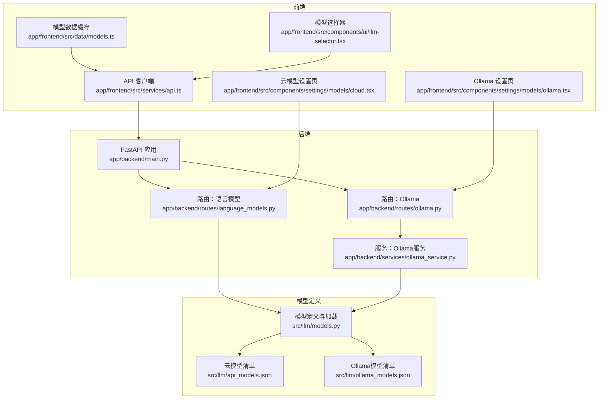
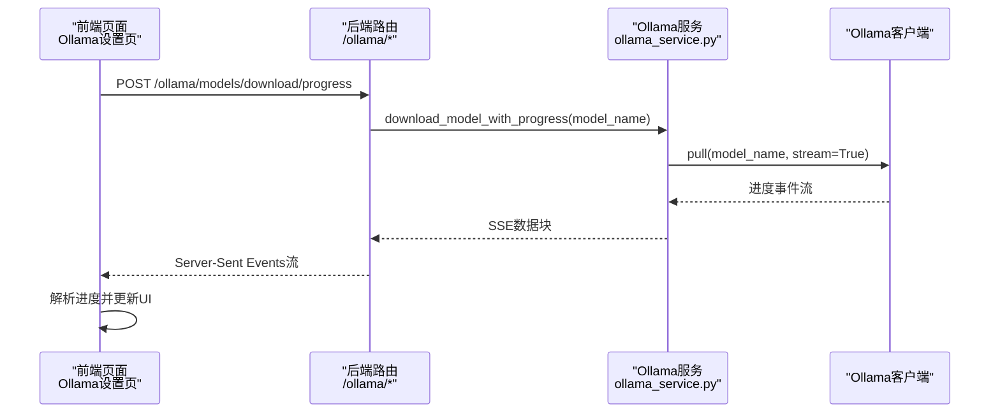
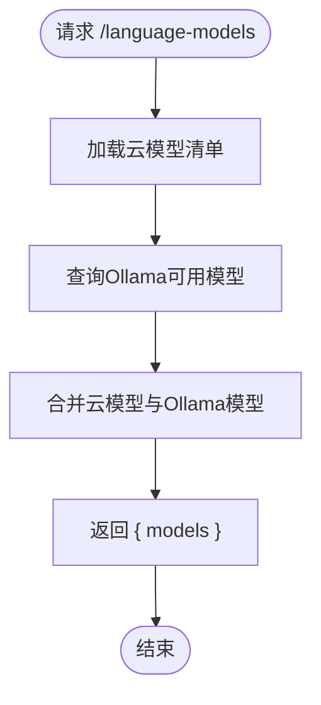
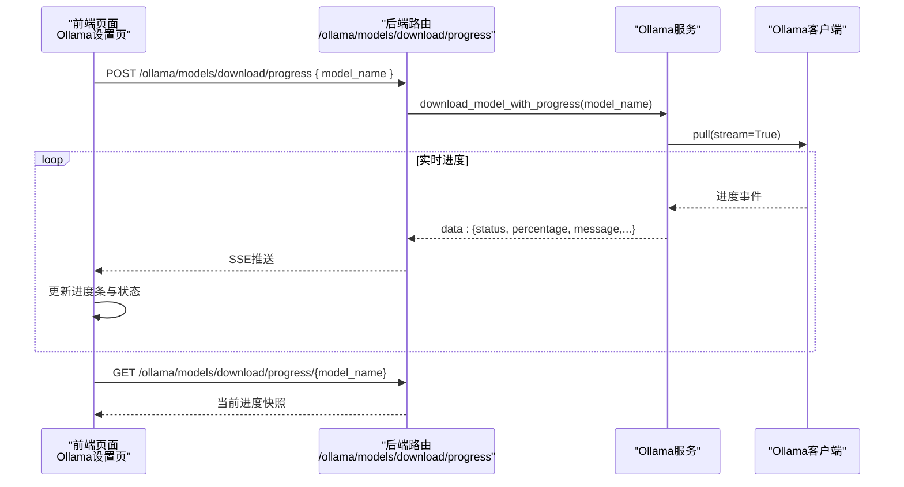
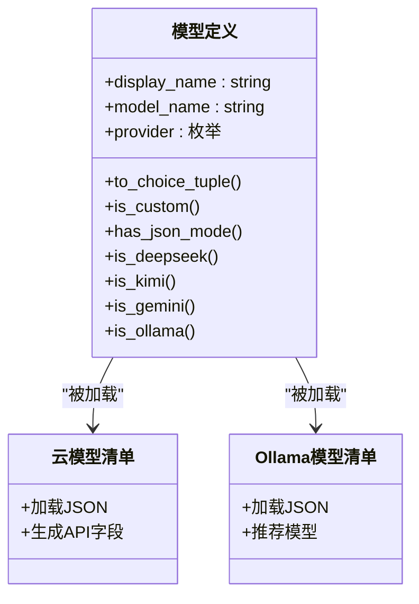
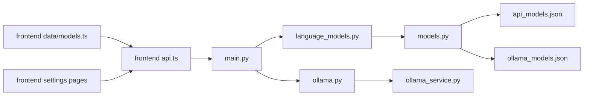

# 语言模型API

<cite>
**本文引用的文件**
- [app/backend/routes/language_models.py](file://app/backend/routes/language_models.py)
- [app/backend/routes/ollama.py](file://app/backend/routes/ollama.py)
- [app/backend/services/ollama_service.py](file://app/backend/services/ollama_service.py)
- [src/llm/models.py](file://src/llm/models.py)
- [src/llm/api_models.json](file://src/llm/api_models.json)
- [src/llm/ollama_models.json](file://src/llm/ollama_models.json)
- [app/backend/main.py](file://app/backend/main.py)
- [app/frontend/src/services/api.ts](file://app/frontend/src/services/api.ts)
- [app/frontend/src/data/models.ts](file://app/frontend/src/data/models.ts)
- [app/frontend/src/components/settings/models/ollama.tsx](file://app/frontend/src/components/settings/models/ollama.tsx)
- [app/frontend/src/components/settings/models/cloud.tsx](file://app/frontend/src/components/settings/models/cloud.tsx)
- [app/frontend/src/components/ui/llm-selector.tsx](file://app/frontend/src/components/ui/llm-selector.tsx)
- [app/frontend/src/services/types.ts](file://app/frontend/src/services/types.ts)
- [README.md](file://README.md)
</cite>

## 目录
1. [简介](#简介)
2. [项目结构](#项目结构)
3. [核心组件](#核心组件)
4. [架构总览](#架构总览)
5. [详细组件分析](#详细组件分析)
6. [依赖分析](#依赖分析)
7. [性能考虑](#性能考虑)
8. [故障排查指南](#故障排查指南)
9. [结论](#结论)
10. [附录](#附录)

## 简介
本文件系统性地说明语言模型API的设计与使用，覆盖以下目标：
- GET /language-models：返回可用语言模型列表（云模型 + 本地Ollama模型）
- GET /language-models/providers：按提供商分组列出可用模型
- Ollama相关API：状态检查、启动/停止服务、模型下载（含进度流）、删除模型、推荐模型、取消下载等
- 模型选择策略、成本优化与性能调优建议
- 不同LLM提供商的集成要点与最佳实践

## 项目结构
后端采用FastAPI，前端为React应用，通过REST与Server-Sent Events进行交互；模型清单来自JSON文件，服务层封装Ollama客户端与状态管理。

**图表来源**
- [app/backend/main.py:15-31](file://app/backend/main.py#L15-L31)
- [app/backend/routes/language_models.py:8-62](file://app/backend/routes/language_models.py#L8-L62)
- [app/backend/routes/ollama.py:12-319](file://app/backend/routes/ollama.py#L12-L319)
- [app/backend/services/ollama_service.py:19-519](file://app/backend/services/ollama_service.py#L19-L519)
- [src/llm/models.py:100-140](file://src/llm/models.py#L100-L140)
- [src/llm/api_models.json:1-87](file://src/llm/api_models.json#L1-L87)
- [src/llm/ollama_models.json:1-57](file://src/llm/ollama_models.json#L1-L57)
- [app/frontend/src/services/api.ts:31-78](file://app/frontend/src/services/api.ts#L31-L78)
- [app/frontend/src/data/models.ts:16-42](file://app/frontend/src/data/models.ts#L16-L42)
- [app/frontend/src/components/settings/models/ollama.tsx:65-538](file://app/frontend/src/components/settings/models/ollama.tsx#L65-L538)
- [app/frontend/src/components/settings/models/cloud.tsx:29-46](file://app/frontend/src/components/settings/models/cloud.tsx#L29-L46)
- [app/frontend/src/components/ui/llm-selector.tsx:29-35](file://app/frontend/src/components/ui/llm-selector.tsx#L29-L35)

**章节来源**
- [app/backend/main.py:15-31](file://app/backend/main.py#L15-L31)
- [app/backend/routes/language_models.py:8-62](file://app/backend/routes/language_models.py#L8-L62)
- [app/backend/routes/ollama.py:12-319](file://app/backend/routes/ollama.py#L12-L319)
- [app/backend/services/ollama_service.py:19-519](file://app/backend/services/ollama_service.py#L19-L519)
- [src/llm/models.py:100-140](file://src/llm/models.py#L100-L140)
- [src/llm/api_models.json:1-87](file://src/llm/api_models.json#L1-L87)
- [src/llm/ollama_models.json:1-57](file://src/llm/ollama_models.json#L1-L57)
- [app/frontend/src/services/api.ts:31-78](file://app/frontend/src/services/api.ts#L31-L78)
- [app/frontend/src/data/models.ts:16-42](file://app/frontend/src/data/models.ts#L16-L42)
- [app/frontend/src/components/settings/models/ollama.tsx:65-538](file://app/frontend/src/components/settings/models/ollama.tsx#L65-L538)
- [app/frontend/src/components/settings/models/cloud.tsx:29-46](file://app/frontend/src/components/settings/models/cloud.tsx#L29-L46)
- [app/frontend/src/components/ui/llm-selector.tsx:29-35](file://app/frontend/src/components/ui/llm-selector.tsx#L29-L35)

## 核心组件
- 路由层
  - 语言模型路由：提供模型列表与按提供商分组的列表
  - Ollama路由：提供状态、启动/停止、模型下载（含进度流）、删除、推荐模型、取消下载等
- 服务层
  - Ollama服务：封装安装检测、服务器启停、模型下载/删除、进度追踪、可用模型格式化等
- 模型定义与加载
  - 统一的模型数据结构、提供商枚举、从JSON加载模型清单、生成API响应字段
- 前端集成
  - API客户端封装、模型数据缓存、Ollama设置页（状态、下载进度、取消/删除）、云模型设置页、模型选择器

**章节来源**
- [app/backend/routes/language_models.py:13-62](file://app/backend/routes/language_models.py#L13-L62)
- [app/backend/routes/ollama.py:41-319](file://app/backend/routes/ollama.py#L41-L319)
- [app/backend/services/ollama_service.py:19-173](file://app/backend/services/ollama_service.py#L19-L173)
- [src/llm/models.py:17-140](file://src/llm/models.py#L17-L140)
- [app/frontend/src/services/api.ts:31-78](file://app/frontend/src/services/api.ts#L31-L78)
- [app/frontend/src/data/models.ts:16-42](file://app/frontend/src/data/models.ts#L16-L42)

## 架构总览
后端通过FastAPI暴露REST接口，前端通过fetch调用后端API；Ollama相关操作通过异步客户端与Server-Sent Events实现实时进度反馈。

**图表来源**
- [app/backend/routes/ollama.py:158-196](file://app/backend/routes/ollama.py#L158-L196)
- [app/backend/services/ollama_service.py:93-96](file://app/backend/services/ollama_service.py#L93-L96)
- [app/backend/services/ollama_service.py:405-441](file://app/backend/services/ollama_service.py#L405-L441)

**章节来源**
- [app/backend/routes/ollama.py:158-196](file://app/backend/routes/ollama.py#L158-L196)
- [app/backend/services/ollama_service.py:93-96](file://app/backend/services/ollama_service.py#L93-L96)
- [app/backend/services/ollama_service.py:405-441](file://app/backend/services/ollama_service.py#L405-L441)

## 详细组件分析

### 语言模型列表接口
- GET /language-models
  - 返回字段：models（数组），每个元素包含 display_name、model_name、provider
  - 数据来源：云模型清单 + 本地Ollama可用模型（经服务层格式化）
- GET /language-models/providers
  - 返回字段：providers（数组），每个元素包含 name（提供商名）与 models（该提供商下的模型项）
  - 数据来源：云模型清单，按provider分组

**图表来源**
- [app/backend/routes/language_models.py:20-32](file://app/backend/routes/language_models.py#L20-L32)
- [app/backend/routes/language_models.py:41-62](file://app/backend/routes/language_models.py#L41-L62)
- [app/backend/services/ollama_service.py:124-150](file://app/backend/services/ollama_service.py#L124-L150)
- [src/llm/models.py:130-139](file://src/llm/models.py#L130-L139)

**章节来源**
- [app/backend/routes/language_models.py:13-62](file://app/backend/routes/language_models.py#L13-L62)
- [app/backend/services/ollama_service.py:124-150](file://app/backend/services/ollama_service.py#L124-L150)
- [src/llm/models.py:130-139](file://src/llm/models.py#L130-L139)

### Ollama相关接口
- GET /ollama/status
  - 返回字段：installed、running、available_models、server_url、error
  - 用途：检查Ollama安装与运行状态
- POST /ollama/start
  - 启动Ollama服务（若未安装或已运行则返回相应提示）
- POST /ollama/stop
  - 停止Ollama服务（若未安装或已停止则返回相应提示）
- POST /ollama/models/download
  - 下载指定模型（同步方式，适合小模型或后台任务）
- POST /ollama/models/download/progress
  - 下载指定模型（SSE流式进度），前端以Server-Sent Events消费
- GET /ollama/models/download/progress/{model_name}
  - 获取某模型当前下载进度（一次性查询）
- GET /ollama/models/downloads/active
  - 获取所有“正在下载/启动中”的活动下载
- DELETE /ollama/models/{model_name}
  - 删除本地已下载模型
- GET /ollama/models/recommended
  - 获取推荐模型清单（显示名、模型名、提供商）
- DELETE /ollama/models/download/{model_name}
  - 取消某模型的下载（服务端记录取消状态）

**图表来源**
- [app/backend/routes/ollama.py:158-196](file://app/backend/routes/ollama.py#L158-L196)
- [app/backend/routes/ollama.py:205-217](file://app/backend/routes/ollama.py#L205-L217)
- [app/backend/services/ollama_service.py:93-96](file://app/backend/services/ollama_service.py#L93-L96)
- [app/backend/services/ollama_service.py:405-441](file://app/backend/services/ollama_service.py#L405-L441)

**章节来源**
- [app/backend/routes/ollama.py:41-119](file://app/backend/routes/ollama.py#L41-L119)
- [app/backend/routes/ollama.py:121-196](file://app/backend/routes/ollama.py#L121-L196)
- [app/backend/routes/ollama.py:197-241](file://app/backend/routes/ollama.py#L197-L241)
- [app/backend/routes/ollama.py:242-277](file://app/backend/routes/ollama.py#L242-L277)
- [app/backend/routes/ollama.py:279-294](file://app/backend/routes/ollama.py#L279-L294)
- [app/backend/routes/ollama.py:295-319](file://app/backend/routes/ollama.py#L295-L319)
- [app/backend/services/ollama_service.py:34-80](file://app/backend/services/ollama_service.py#L34-L80)
- [app/backend/services/ollama_service.py:81-109](file://app/backend/services/ollama_service.py#L81-L109)
- [app/backend/services/ollama_service.py:110-123](file://app/backend/services/ollama_service.py#L110-L123)
- [app/backend/services/ollama_service.py:124-151](file://app/backend/services/ollama_service.py#L124-L151)
- [app/backend/services/ollama_service.py:152-173](file://app/backend/services/ollama_service.py#L152-L173)

### 模型选择策略与集成要点
- 云模型
  - 通过 /language-models/providers 获取各提供商模型清单
  - 使用 /language-models 获取统一模型列表
  - 前端通过 api.ts 的 getLanguageModels 与 getLanguageModelProviders 调用
- 本地Ollama
  - 先检查状态 /ollama/status，再根据需要启动 /ollama/start
  - 推荐模型通过 /ollama/models/recommended 获取
  - 下载采用 /ollama/models/download/progress 实时监控
  - 删除模型使用 /ollama/models/{model_name}
- 前端集成
  - 模型数据缓存：app/frontend/src/data/models.ts
  - 设置页：Ollama设置页与云模型设置页负责调用后端接口
  - 模型选择器：llm-selector.tsx 提供下拉选择

**图表来源**
- [src/llm/models.py:36-78](file://src/llm/models.py#L36-L78)
- [src/llm/models.py:80-140](file://src/llm/models.py#L80-L140)
- [src/llm/api_models.json:1-87](file://src/llm/api_models.json#L1-L87)
- [src/llm/ollama_models.json:1-57](file://src/llm/ollama_models.json#L1-L57)

**章节来源**
- [app/frontend/src/services/api.ts:31-78](file://app/frontend/src/services/api.ts#L31-L78)
- [app/frontend/src/data/models.ts:16-42](file://app/frontend/src/data/models.ts#L16-L42)
- [app/frontend/src/components/settings/models/ollama.tsx:65-538](file://app/frontend/src/components/settings/models/ollama.tsx#L65-L538)
- [app/frontend/src/components/settings/models/cloud.tsx:29-46](file://app/frontend/src/components/settings/models/cloud.tsx#L29-L46)
- [app/frontend/src/components/ui/llm-selector.tsx:29-35](file://app/frontend/src/components/ui/llm-selector.tsx#L29-L35)
- [src/llm/models.py:36-78](file://src/llm/models.py#L36-L78)
- [src/llm/models.py:80-140](file://src/llm/models.py#L80-L140)

## 依赖分析
- 后端
  - FastAPI应用在 main.py 中注册路由与CORS，并在启动时检查Ollama状态
  - 语言模型路由依赖模型清单加载函数与Ollama服务
  - Ollama路由依赖Ollama服务
- 前端
  - api.ts 封装后端接口调用
  - data/models.ts 缓存模型列表
  - 设置页组件负责调用后端接口并展示状态与进度
- 模型清单
  - 云模型与Ollama模型分别来自独立JSON文件，统一由模型定义模块加载

**图表来源**
- [app/backend/main.py:15-31](file://app/backend/main.py#L15-L31)
- [app/backend/routes/language_models.py:8-62](file://app/backend/routes/language_models.py#L8-L62)
- [app/backend/routes/ollama.py:12-319](file://app/backend/routes/ollama.py#L12-L319)
- [app/backend/services/ollama_service.py:19-519](file://app/backend/services/ollama_service.py#L19-L519)
- [src/llm/models.py:100-140](file://src/llm/models.py#L100-L140)
- [src/llm/api_models.json:1-87](file://src/llm/api_models.json#L1-L87)
- [src/llm/ollama_models.json:1-57](file://src/llm/ollama_models.json#L1-L57)
- [app/frontend/src/services/api.ts:31-78](file://app/frontend/src/services/api.ts#L31-L78)
- [app/frontend/src/data/models.ts:16-42](file://app/frontend/src/data/models.ts#L16-L42)

**章节来源**
- [app/backend/main.py:15-31](file://app/backend/main.py#L15-L31)
- [app/backend/routes/language_models.py:8-62](file://app/backend/routes/language_models.py#L8-L62)
- [app/backend/routes/ollama.py:12-319](file://app/backend/routes/ollama.py#L12-L319)
- [app/backend/services/ollama_service.py:19-519](file://app/backend/services/ollama_service.py#L19-L519)
- [src/llm/models.py:100-140](file://src/llm/models.py#L100-L140)
- [src/llm/api_models.json:1-87](file://src/llm/api_models.json#L1-L87)
- [src/llm/ollama_models.json:1-57](file://src/llm/ollama_models.json#L1-L57)
- [app/frontend/src/services/api.ts:31-78](file://app/frontend/src/services/api.ts#L31-L78)
- [app/frontend/src/data/models.ts:16-42](file://app/frontend/src/data/models.ts#L16-L42)

## 性能考虑
- 下载性能
  - 使用SSE实时进度可避免轮询带来的延迟与开销
  - 对于大模型，建议在稳定网络环境下进行，避免中断导致重传
- 服务稳定性
  - 启动/停止Ollama服务时应确保进程正确终止与重启
  - 若Ollama未运行，下载/删除等操作会失败，需先启动服务
- 前端体验
  - 使用缓存避免重复请求模型列表
  - 对活动下载采用轮询补充机制，减少SSE断连影响

[本节为通用指导，无需特定文件引用]

## 故障排查指南
- Ollama未安装
  - 现象：/ollama/status 返回 installed=false
  - 处理：安装Ollama后重新检查状态
- Ollama未运行
  - 现象：/ollama/status 返回 running=false
  - 处理：调用 /ollama/start 启动服务
- 下载失败
  - 现象：SSE流返回 error 或前端显示失败
  - 处理：确认服务运行、网络正常；必要时取消后重试
- 取消下载
  - 现象：/ollama/models/download/{model_name} 返回成功但UI仍显示下载中
  - 处理：服务端记录取消状态，前端应清理UI并停止轮询

**章节来源**
- [app/backend/routes/ollama.py:48-55](file://app/backend/routes/ollama.py#L48-L55)
- [app/backend/routes/ollama.py:65-87](file://app/backend/routes/ollama.py#L65-L87)
- [app/backend/routes/ollama.py:130-156](file://app/backend/routes/ollama.py#L130-L156)
- [app/backend/routes/ollama.py:205-217](file://app/backend/routes/ollama.py#L205-L217)
- [app/backend/routes/ollama.py:295-319](file://app/backend/routes/ollama.py#L295-L319)
- [app/backend/services/ollama_service.py:160-173](file://app/backend/services/ollama_service.py#L160-L173)

## 结论
本语言模型API通过统一的模型清单与服务层抽象，实现了云模型与本地Ollama模型的统一管理与便捷调用。结合SSE进度流与前端缓存策略，既保证了用户体验，也兼顾了性能与可靠性。建议在生产环境中：
- 明确模型选择策略（如优先本地Ollama以降低成本与提升隐私）
- 配置合理的超时与重试策略
- 在前端做好错误提示与状态恢复

[本节为总结，无需特定文件引用]

## 附录

### API定义与使用示例

- GET /language-models
  - 请求：无
  - 响应：{ models: [{ display_name, model_name, provider }] }
  - 用途：获取全部可用模型列表
- GET /language-models/providers
  - 请求：无
  - 响应：{ providers: [{ name, models: [{ display_name, model_name }] }] }
  - 用途：按提供商分组查看模型
- GET /ollama/status
  - 请求：无
  - 响应：{ installed, running, available_models[], server_url, error? }
- POST /ollama/start
  - 请求：无
  - 响应：{ success, message }
- POST /ollama/stop
  - 请求：无
  - 响应：{ success, message }
- POST /ollama/models/download
  - 请求：{ model_name }
  - 响应：{ success, message }
- POST /ollama/models/download/progress
  - 请求：{ model_name }
  - 响应：Server-Sent Events流
- GET /ollama/models/download/progress/{model_name}
  - 请求：路径参数 model_name
  - 响应：{ status, percentage?, message?, phase?, bytes_downloaded?, total_bytes? }
- GET /ollama/models/downloads/active
  - 请求：无
  - 响应：{ [model_name]: ProgressResponse }
- DELETE /ollama/models/{model_name}
  - 请求：路径参数 model_name
  - 响应：{ success, message }
- GET /ollama/models/recommended
  - 请求：无
  - 响应：[{ display_name, model_name, provider }]
- DELETE /ollama/models/download/{model_name}
  - 请求：路径参数 model_name
  - 响应：{ success, message }

**章节来源**
- [app/backend/routes/language_models.py:13-62](file://app/backend/routes/language_models.py#L13-L62)
- [app/backend/routes/ollama.py:41-319](file://app/backend/routes/ollama.py#L41-L319)

### 环境变量与提供商配置
- 支持的提供商（部分）
  - OpenAI、Anthropic、Groq、Google、DeepSeek、OpenRouter、Kimi、xAI、GigaChat、Azure OpenAI、Ollama
- 关键环境变量
  - OPENAI_API_KEY、GROQ_API_KEY、ANTHROPIC_API_KEY、GOOGLE_API_KEY、DEEPSEEK_API_KEY、OPENROUTER_API_KEY、XAI_API_KEY、GIGACHAT_API_KEY、GIGACHAT_USER、GIGACHAT_PASSWORD、OLLAMA_HOST、OLLAMA_BASE_URL、AZURE_OPENAI_API_KEY、AZURE_OPENAI_ENDPOINT、AZURE_OPENAI_DEPLOYMENT_NAME、MOONSHOT_API_KEY/KIMI_API_KEY、KIMI_BASE_URL/MOONSHOT_BASE_URL、YOUR_SITE_URL/YOUR_SITE_NAME
- 使用说明
  - 在根目录创建.env文件并填入所需密钥
  - Ollama默认使用 http://localhost:11434，可通过 OLLAMA_BASE_URL 或 OLLAMA_HOST 覆盖

**章节来源**
- [src/llm/models.py:142-258](file://src/llm/models.py#L142-L258)
- [README.md:67-82](file://README.md#L67-L82)