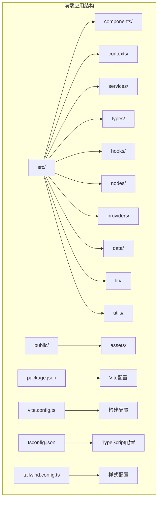
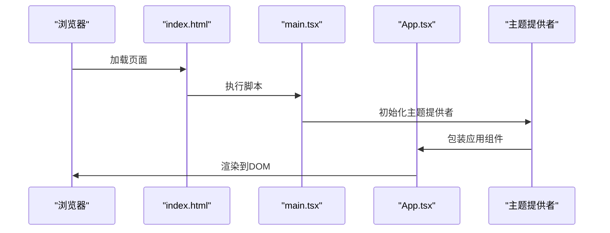
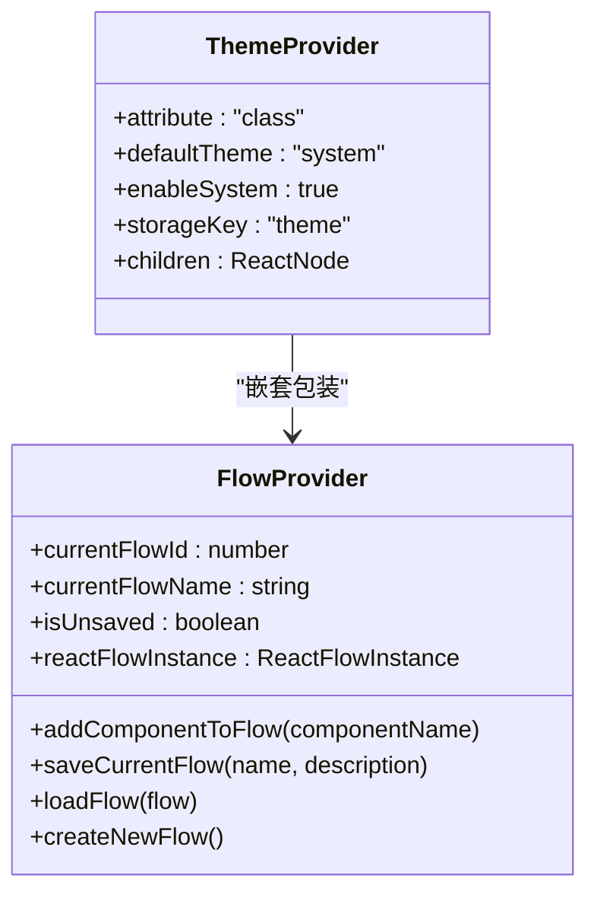
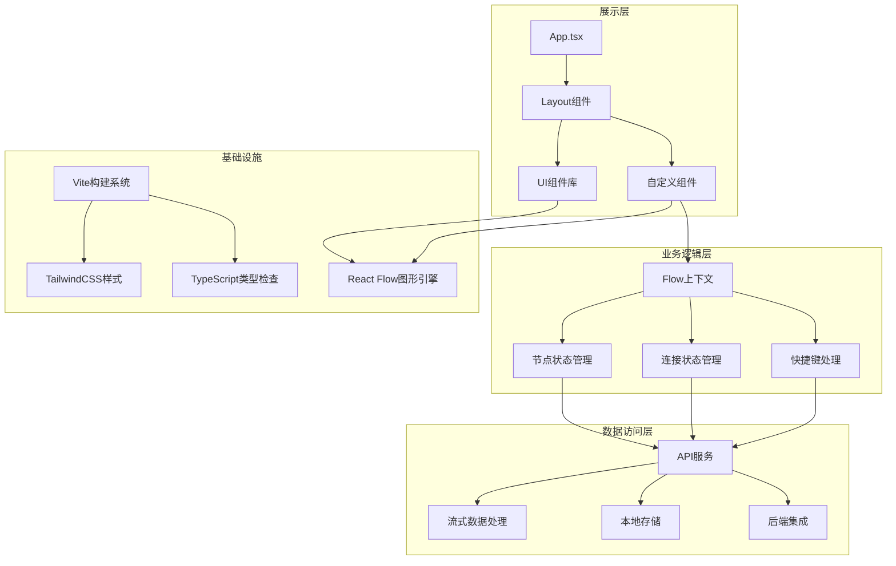
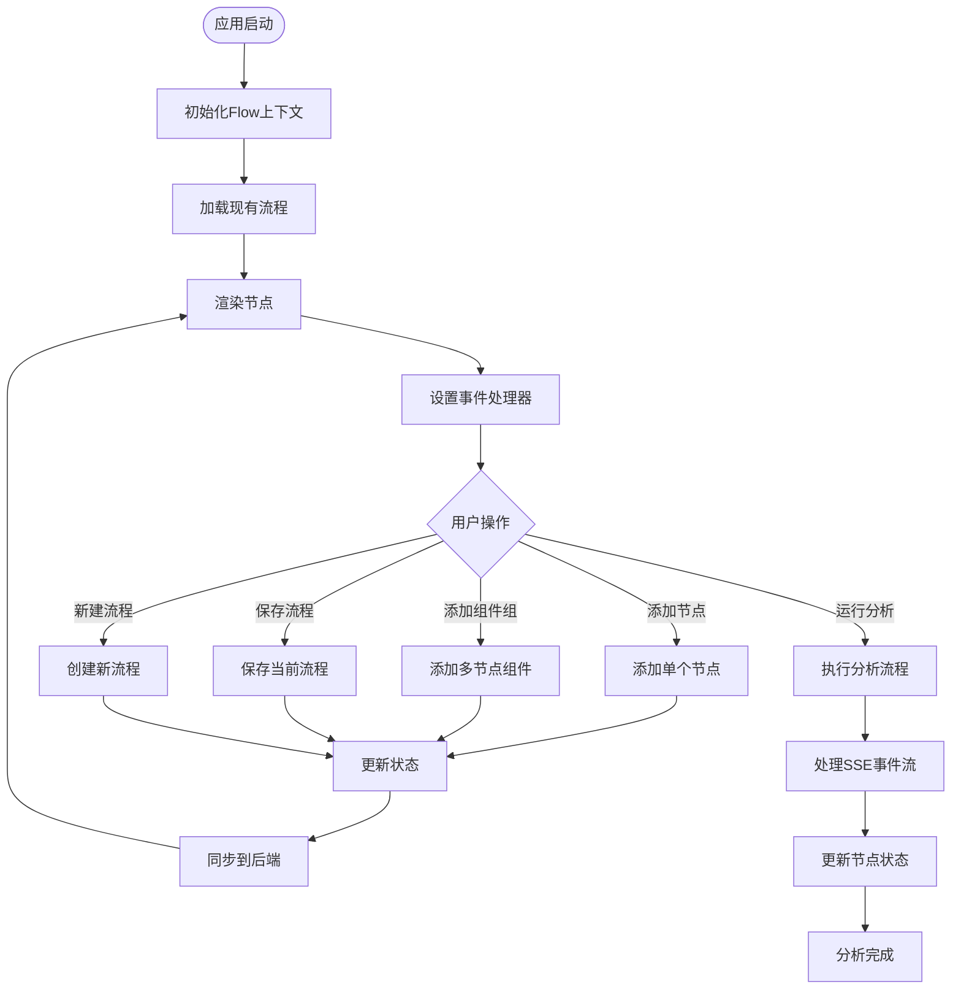
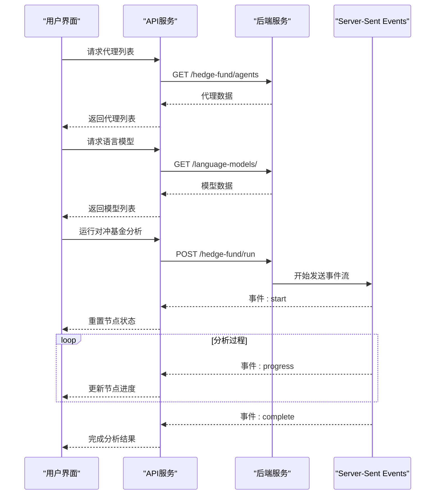
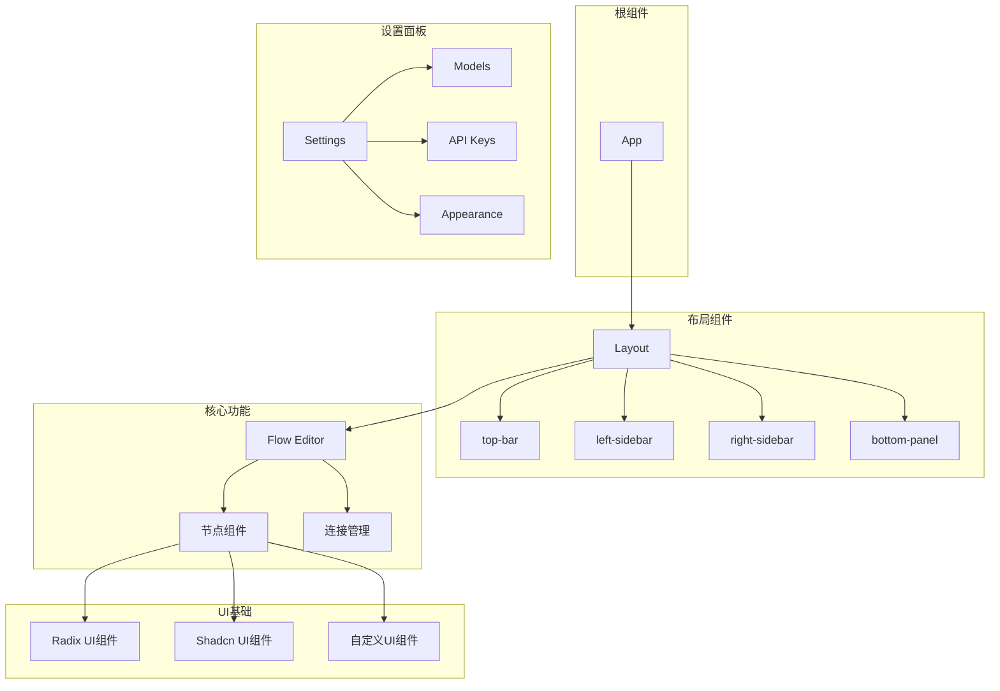
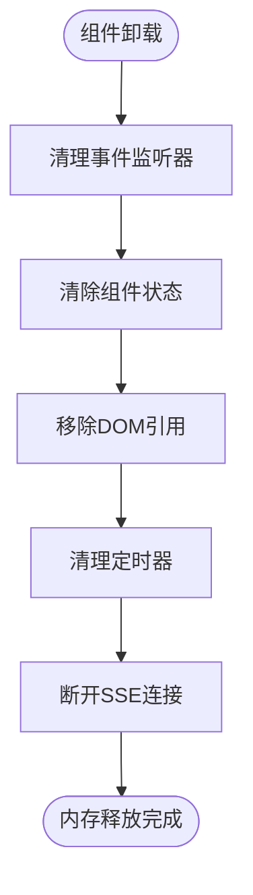

# React应用结构

<cite>
**本文档引用的文件**
- [package.json](file://app/frontend/package.json)
- [vite.config.ts](file://app/frontend/vite.config.ts)
- [main.tsx](file://app/frontend/src/main.tsx)
- [App.tsx](file://app/frontend/src/App.tsx)
- [tsconfig.json](file://app/frontend/tsconfig.json)
- [tailwind.config.ts](file://app/frontend/tailwind.config.ts)
- [postcss.config.mjs](file://app/frontend/postcss.config.mjs)
- [index.css](file://app/frontend/src/index.css)
- [index.html](file://app/frontend/index.html)
- [theme-provider.tsx](file://app/frontend/src/providers/theme-provider.tsx)
- [flow-context.tsx](file://app/frontend/src/contexts/flow-context.tsx)
- [api.ts](file://app/frontend/src/services/api.ts)
- [flow.ts](file://app/frontend/src/types/flow.ts)
- [sidebar-components.ts](file://app/frontend/src/data/sidebar-components.ts)
- [utils.ts](file://app/frontend/src/lib/utils.ts)
</cite>

## 目录
1. [简介](#简介)
2. [项目结构](#项目结构)
3. [核心组件](#核心组件)
4. [架构概览](#架构概览)
5. [详细组件分析](#详细组件分析)
6. [依赖关系分析](#依赖关系分析)
7. [性能考虑](#性能考虑)
8. [故障排除指南](#故障排除指南)
9. [结论](#结论)
10. [附录](#附录)

## 简介

这是一个基于React 18和Vite的AI对冲基金可视化编辑器应用。该应用允许用户通过拖拽节点的方式构建投资策略流程图，并与后端服务进行实时通信以执行复杂的金融分析任务。

应用采用现代化的技术栈，包括TypeScript、TailwindCSS、Radix UI组件库、React Flow图形库等，提供了丰富的UI组件和流畅的用户体验。

## 项目结构

应用采用模块化的文件组织结构，主要分为以下几个核心目录：



**图表来源**
- [main.tsx:1-19](file://app/frontend/src/main.tsx#L1-L19)
- [App.tsx:1-12](file://app/frontend/src/App.tsx#L1-L12)
- [package.json:1-56](file://app/frontend/package.json#L1-L56)

**章节来源**
- [main.tsx:1-19](file://app/frontend/src/main.tsx#L1-L19)
- [package.json:1-56](file://app/frontend/package.json#L1-L56)

## 核心组件

### 应用入口点

应用的启动过程从HTML模板开始，通过JavaScript模块加载器加载主入口文件：



**图表来源**
- [index.html:11-14](file://app/frontend/index.html#L11-L14)
- [main.tsx:10-18](file://app/frontend/src/main.tsx#L10-L18)
- [App.tsx:4-11](file://app/frontend/src/App.tsx#L4-L11)

### 主题管理系统

应用集成了Next Themes提供者来管理明暗主题切换：



**图表来源**
- [theme-provider.tsx:8-19](file://app/frontend/src/providers/theme-provider.tsx#L8-L19)
- [flow-context.tsx:35-358](file://app/frontend/src/contexts/flow-context.tsx#L35-L358)

**章节来源**
- [theme-provider.tsx:1-19](file://app/frontend/src/providers/theme-provider.tsx#L1-L19)
- [flow-context.tsx:1-358](file://app/frontend/src/contexts/flow-context.tsx#L1-L358)

## 架构概览

应用采用分层架构设计，清晰分离了展示层、业务逻辑层和数据访问层：



**图表来源**
- [App.tsx:1-12](file://app/frontend/src/App.tsx#L1-L12)
- [flow-context.tsx:35-358](file://app/frontend/src/contexts/flow-context.tsx#L35-L358)
- [api.ts:10-309](file://app/frontend/src/services/api.ts#L10-L309)

## 详细组件分析

### 流程上下文系统

Flow上下文是应用的核心状态管理组件，负责整个流程图的生命周期管理：



**图表来源**
- [flow-context.tsx:35-358](file://app/frontend/src/contexts/flow-context.tsx#L35-L358)
- [api.ts:87-309](file://app/frontend/src/services/api.ts#L87-L309)

### API集成架构

应用通过统一的API服务层与后端进行通信，支持多种数据操作：



**图表来源**
- [api.ts:17-47](file://app/frontend/src/services/api.ts#L17-L47)
- [api.ts:87-309](file://app/frontend/src/services/api.ts#L87-L309)

### 组件树结构

应用的组件层次结构体现了清晰的关注点分离：



**图表来源**
- [App.tsx:1-12](file://app/frontend/src/App.tsx#L1-L12)
- [sidebar-components.ts:31-74](file://app/frontend/src/data/sidebar-components.ts#L31-L74)

**章节来源**
- [flow-context.tsx:35-358](file://app/frontend/src/contexts/flow-context.tsx#L35-L358)
- [api.ts:10-309](file://app/frontend/src/services/api.ts#L10-L309)

## 依赖关系分析

应用的依赖关系展现了清晰的技术栈分层：

```mermaid
graph TB
subgraph "运行时依赖"
A[react@^18.2.0]
B[react-dom@^18.2.0]
C[@xyflow/react@^12.5.1]
D[react-resizable-panels@^3.0.1]
E[sonner@^2.0.5]
F[next-themes@^0.4.6]
end
subgraph "UI组件库"
G[@radix-ui/react-*]
H[lucide-react@^0.507.0]
I[shadcn-ui@^0.9.5]
end
subgraph "构建工具"
J[@vitejs/plugin-react@^4.2.1]
K[vite@^5.0.12]
L[typescript@^5.3.3]
end
subgraph "样式系统"
M[tailwindcss@^3.4.1]
N[autoprefixer@^10.4.21]
O[postcss@^8.5.3]
end
subgraph "开发工具"
P[eslint@^8.56.0]
Q[@typescript-eslint/*]
R[@vitejs/plugin-react-refresh]
end
A --> C
A --> F
C --> G
C --> H
J --> K
M --> O
N --> O
```

**图表来源**
- [package.json:11-35](file://app/frontend/package.json#L11-L35)
- [package.json:37-54](file://app/frontend/package.json#L37-L54)

**章节来源**
- [package.json:1-56](file://app/frontend/package.json#L1-L56)

## 性能考虑

### 构建优化策略

应用采用了多项性能优化措施：

1. **Tree Shaking**: 通过ES模块导入实现按需加载
2. **代码分割**: Vite自动进行代码分割
3. **懒加载**: 路由和组件的动态导入
4. **缓存策略**: 静态资源的长期缓存

### 内存管理



### 图形渲染优化

- 使用React Flow的虚拟化渲染
- 优化节点更新策略
- 合理的重绘和重排控制

## 故障排除指南

### 常见问题诊断

1. **构建失败**
   - 检查TypeScript配置兼容性
   - 验证Node.js版本要求
   - 确认依赖包完整性

2. **样式问题**
   - 检查TailwindCSS配置
   - 验证CSS变量定义
   - 确认PostCSS插件顺序

3. **API连接问题**
   - 验证环境变量配置
   - 检查CORS设置
   - 确认后端服务可用性

**章节来源**
- [api.ts:10](file://app/frontend/src/services/api.ts#L10)
- [tsconfig.json:20-31](file://app/frontend/tsconfig.json#L20-L31)

## 结论

该React应用展现了现代前端开发的最佳实践，通过合理的架构设计和丰富的技术栈选择，实现了功能完备的可视化编辑器。应用具有以下特点：

- **模块化设计**: 清晰的文件组织和职责分离
- **类型安全**: 完整的TypeScript类型定义
- **响应式UI**: 基于TailwindCSS的现代化样式系统
- **高性能**: 优化的渲染和内存管理策略
- **可扩展性**: 插件化的组件架构

## 附录

### 开发环境配置

- **Node.js版本**: 16.x或更高版本
- **包管理器**: pnpm推荐
- **IDE建议**: VS Code + TypeScript扩展

### 生产部署要点

- 确保静态资源路径正确
- 配置适当的缓存头
- 设置CDN优化
- 准备环境变量文件