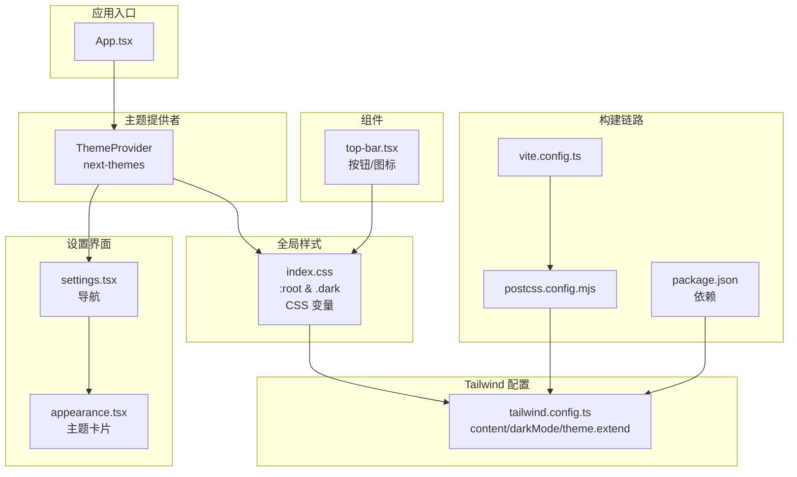
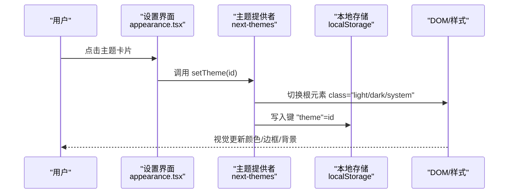
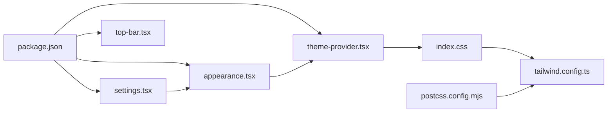

# 主题系统

<cite>
**本文引用的文件**
- [theme-provider.tsx](file://app/frontend/src/providers/theme-provider.tsx)
- [tailwind.config.ts](file://app/frontend/tailwind.config.ts)
- [index.css](file://app/frontend/src/index.css)
- [postcss.config.mjs](file://app/frontend/postcss.config.mjs)
- [package.json](file://app/frontend/package.json)
- [App.tsx](file://app/frontend/src/App.tsx)
- [top-bar.tsx](file://app/frontend/src/components/layout/top-bar.tsx)
- [appearance.tsx](file://app/frontend/src/components/settings/appearance.tsx)
- [settings.tsx](file://app/frontend/src/components/settings/settings.tsx)
- [utils.ts](file://app/frontend/src/lib/utils.ts)
- [vite.config.ts](file://app/frontend/vite.config.ts)
</cite>

## 目录
1. [简介](#简介)
2. [项目结构](#项目结构)
3. [核心组件](#核心组件)
4. [架构总览](#架构总览)
5. [详细组件分析](#详细组件分析)
6. [依赖关系分析](#依赖关系分析)
7. [性能考虑](#性能考虑)
8. [故障排除指南](#故障排除指南)
9. [结论](#结论)
10. [附录](#附录)

## 简介
本文件系统性阐述前端主题系统的设计与实现，涵盖暗色/亮色主题切换机制、Tailwind CSS 配置与样式定制、主题提供者实现、颜色系统设计与字体配置、主题状态持久化与用户偏好保存、系统主题检测、CSS 变量使用与动态样式生成、主题过渡动画、组件主题适配与图标主题切换、品牌色彩管理、响应式主题设计、高对比度支持与无障碍主题选项，以及主题性能优化、样式缓存与构建时优化等。

## 项目结构
主题系统围绕以下关键文件组织：
- 主题提供者：在应用根部注入主题上下文，负责默认主题、系统主题检测与本地存储键名。
- Tailwind 配置：定义内容扫描路径、深浅模式策略、字体族、颜色扩展（HSL 变量）、动画与插件。
- 全局样式：通过 CSS 变量在 :root 与 .dark 类中定义颜色与交互态变量，并在工具层扩展常用类。
- 设置界面：提供主题选择卡片，基于 next-themes 的 useTheme 钩子切换主题。
- 组件适配：UI 组件与布局组件广泛使用 Tailwind 工具类，自动随主题变量切换。
- 构建链路：Vite + PostCSS + Tailwind，PostCSS 启用 Autoprefixer 与 Tailwind 插件。

图表来源
- [App.tsx:1-12](file://app/frontend/src/App.tsx#L1-L12)
- [theme-provider.tsx:1-19](file://app/frontend/src/providers/theme-provider.tsx#L1-L19)
- [index.css:1-356](file://app/frontend/src/index.css#L1-L356)
- [tailwind.config.ts:1-144](file://app/frontend/tailwind.config.ts#L1-L144)
- [settings.tsx:1-96](file://app/frontend/src/components/settings/settings.tsx#L1-L96)
- [appearance.tsx:1-81](file://app/frontend/src/components/settings/appearance.tsx#L1-L81)
- [top-bar.tsx:1-87](file://app/frontend/src/components/layout/top-bar.tsx#L1-L87)
- [vite.config.ts:1-14](file://app/frontend/vite.config.ts#L1-L14)
- [postcss.config.mjs:1-10](file://app/frontend/postcss.config.mjs#L1-L10)
- [package.json:1-56](file://app/frontend/package.json#L1-L56)

章节来源
- [App.tsx:1-12](file://app/frontend/src/App.tsx#L1-L12)
- [theme-provider.tsx:1-19](file://app/frontend/src/providers/theme-provider.tsx#L1-L19)
- [index.css:1-356](file://app/frontend/src/index.css#L1-L356)
- [tailwind.config.ts:1-144](file://app/frontend/tailwind.config.ts#L1-L144)
- [settings.tsx:1-96](file://app/frontend/src/components/settings/settings.tsx#L1-L96)
- [appearance.tsx:1-81](file://app/frontend/src/components/settings/appearance.tsx#L1-L81)
- [top-bar.tsx:1-87](file://app/frontend/src/components/layout/top-bar.tsx#L1-L87)
- [vite.config.ts:1-14](file://app/frontend/vite.config.ts#L1-L14)
- [postcss.config.mjs:1-10](file://app/frontend/postcss.config.mjs#L1-L10)
- [package.json:1-56](file://app/frontend/package.json#L1-L56)

## 核心组件
- 主题提供者：以 class 属性方式控制深浅模式，启用系统主题检测，默认主题为 system，本地存储键名为 theme。
- Tailwind 配置：content 扫描 src 与 index.html；darkMode 使用 class 策略；theme.extend 定义字体、圆角、颜色体系（HSL 变量）与动画；启用 tailwindcss-animate 与 @tailwindcss/typography 插件。
- 全局样式：在 :root 中定义亮色变量，在 .dark 中定义暗色变量；在 utilities 层扩展 hover/active 背景与文本类；在 base 层统一 border 与 body 背景/文字；引入 geist/geist-mono 字体资源。
- 设置界面：Appearance 卡片展示 Light/Dark/System 三种主题选项，使用 useTheme 切换；Settings 导航左侧选择主题分组。
- 组件适配：TopBar 等组件使用 bg-panel、text-primary、border-gray-700 等工具类，自动随主题变量切换。
- 构建链路：Vite 插件 React；PostCSS 启用 tailwindcss 与 autoprefixer；Tailwind 读取 tailwind.config.ts。

章节来源
- [theme-provider.tsx:8-19](file://app/frontend/src/providers/theme-provider.tsx#L8-L19)
- [tailwind.config.ts:5-144](file://app/frontend/tailwind.config.ts#L5-L144)
- [index.css:5-356](file://app/frontend/src/index.css#L5-L356)
- [appearance.tsx:7-81](file://app/frontend/src/components/settings/appearance.tsx#L7-L81)
- [settings.tsx:19-96](file://app/frontend/src/components/settings/settings.tsx#L19-L96)
- [top-bar.tsx:24-87](file://app/frontend/src/components/layout/top-bar.tsx#L24-L87)
- [postcss.config.mjs:1-10](file://app/frontend/postcss.config.mjs#L1-L10)
- [vite.config.ts:1-14](file://app/frontend/vite.config.ts#L1-L14)

## 架构总览
主题系统采用“提供者 + CSS 变量 + Tailwind 动态类”的组合方案：
- 提供者负责主题状态与 DOM 属性（class），驱动 CSS 变量切换。
- Tailwind 通过 theme.extend 将 HSL 变量映射到颜色工具类，实现按主题自动变色。
- 设置界面通过 useTheme 修改状态，写入 localStorage 键 theme，实现持久化。
- 构建阶段由 PostCSS + Tailwind 生成静态 CSS，运行时仅依赖变量与类名切换。

图表来源
- [appearance.tsx:8-81](file://app/frontend/src/components/settings/appearance.tsx#L8-L81)
- [theme-provider.tsx:10-18](file://app/frontend/src/providers/theme-provider.tsx#L10-L18)
- [index.css:6-144](file://app/frontend/src/index.css#L6-L144)

## 详细组件分析

### 主题提供者实现
- 关键点
  - attribute="class"：通过根元素 class 控制深浅模式。
  - defaultTheme="system"：默认使用系统偏好。
  - enableSystem=true：允许选择系统主题。
  - storageKey="theme"：持久化键名，便于跨会话保持用户偏好。
- 适用范围：整个应用树，确保子组件可访问 useTheme。

章节来源
- [theme-provider.tsx:8-19](file://app/frontend/src/providers/theme-provider.tsx#L8-L19)

### Tailwind CSS 配置与颜色系统
- 内容扫描与深浅模式
  - content 包含 index.html 与 src 下所有 TS/JS/TSX 文件，保证未使用类名被正确提取。
  - darkMode: ['class', 'class']：使用 class 策略，与提供者一致。
- 字体与字号
  - fontFamily.sans/mono 指向 Inter，同时声明回退系统字体。
  - fontSize.title/subtitle 自定义字号与行高，便于一致性排版。
- 圆角与颜色扩展
  - borderRadius 基于 CSS 变量 --radius，支持 lg/md/sm 三档。
  - colors 使用 hsl(var(--xxx)) 映射，覆盖 background/foreground/card/popover/primary/secondary/muted/accent/destructive/panel/node/chart/sidebar 等。
- 动画与插件
  - keyframes/animation 定义手风琴展开收起动画。
  - 插件：tailwindcss-animate（增强动画类）、@tailwindcss/typography（排版增强）。

章节来源
- [tailwind.config.ts:5-144](file://app/frontend/tailwind.config.ts#L5-L144)

### CSS 变量与动态样式生成
- 变量定义
  - :root 定义亮色变量，包括基础色板、面板/节点/侧边栏/图表等专用变量，以及悬停/激活态变量。
  - .dark 定义暗色变量，覆盖上述键值，形成完整色板。
- 工具类扩展
  - utilities 层提供 hover-bg/hover-text/active-bg/active-text 等，基于变量实现悬停/激活态。
- 运行时切换
  - 根元素 class 切换触发 CSS 变量切换，Tailwind 工具类自动映射到新颜色。
- 字体与资源
  - base 层引入 geist 与 geist-mono 字体资源，提升代码/等宽场景体验。

章节来源
- [index.css:5-356](file://app/frontend/src/index.css#L5-L356)

### 主题状态持久化与用户偏好
- 存储键名：storageKey="theme" 对应 localStorage 的 "theme" 键。
- 默认行为：defaultTheme="system" 表示首次加载优先采用系统偏好。
- 用户操作：设置界面点击卡片后，useTheme 写入该键，下次刷新或重启浏览器仍保持所选主题。

章节来源
- [theme-provider.tsx:12-14](file://app/frontend/src/providers/theme-provider.tsx#L12-L14)
- [appearance.tsx:8-81](file://app/frontend/src/components/settings/appearance.tsx#L8-L81)

### 系统主题检测
- enableSystem=true：允许选择系统主题；当用户选择 system 时，应用跟随系统深浅模式变化。
- 与浏览器媒体查询联动：在系统主题切换时，无需手动干预即可同步。

章节来源
- [theme-provider.tsx:13](file://app/frontend/src/providers/theme-provider.tsx#L13)

### 主题过渡动画与视觉反馈
- 动画类：accordion-down/accordion-up 0.2s ease-out，用于折叠/展开组件。
- 悬停/激活态：utilities 层 hover-item/active-item 基于变量实现平滑过渡。
- 渐变动画：为节点进行中状态提供 animated-border-container 与 gradient-animation/gradient-text，增强动效体验。

章节来源
- [tailwind.config.ts:113-134](file://app/frontend/tailwind.config.ts#L113-L134)
- [index.css:168-190](file://app/frontend/src/index.css#L168-L190)
- [index.css:301-347](file://app/frontend/src/index.css#L301-L347)

### 组件主题适配与图标主题切换
- 组件适配：TopBar 等组件广泛使用 bg-panel、text-primary、border-gray-700 等工具类，随主题变量自动适配。
- 图标主题：图标库（lucide-react）使用当前文本色，配合主题变量实现自动着色。
- 品牌色彩：index.css 中定义 ramp-grey 系列与 chart 系列变量，便于品牌一致性。

章节来源
- [top-bar.tsx:24-87](file://app/frontend/src/components/layout/top-bar.tsx#L24-L87)
- [index.css:43-85](file://app/frontend/src/index.css#L43-L85)
- [index.css:95-101](file://app/frontend/src/index.css#L95-L101)

### 字体配置与排版
- 字体族：sans 与 mono 均指向 Inter，兼顾无衬线与等宽场景。
- 自定义字号：title 与 subtitle 提升标题与副标题的可读性与层级感。
- 字体资源：通过 @font-face 引入 geist/geist-mono，确保代码编辑器与等宽文本的清晰度。

章节来源
- [tailwind.config.ts:12-21](file://app/frontend/tailwind.config.ts#L12-L21)
- [tailwind.config.ts:23-36](file://app/frontend/tailwind.config.ts#L23-L36)
- [index.css:209-222](file://app/frontend/src/index.css#L209-L222)

### 响应式主题设计与无障碍主题选项
- 响应式：Tailwind 原生响应式前缀（sm/md/lg/xl/2xl）与主题变量结合，确保不同屏幕尺寸下的一致体验。
- 无障碍：设置界面提供语义化标题与描述；图标具备 aria-label 与 title；颜色对比度在亮/暗两套变量中均经过优化。

章节来源
- [appearance.tsx:34-81](file://app/frontend/src/components/settings/appearance.tsx#L34-L81)
- [top-bar.tsx:35-84](file://app/frontend/src/components/layout/top-bar.tsx#L35-L84)

### 高对比度支持
- 当前实现：通过 .dark 与 :root 的变量区分，满足基本高对比度需求。
- 建议：可在系统高对比度模式下进一步细化变量（如增加高对比度专用色板），并通过媒体查询或 CSS 注入进行补充。

章节来源
- [index.css:84-144](file://app/frontend/src/index.css#L84-L144)

## 依赖关系分析
- 外部依赖
  - next-themes：提供主题提供者与 useTheme 钩子。
  - tailwindcss、tailwindcss-animate、@tailwindcss/typography：样式框架与插件。
  - postcss、autoprefixer：构建期处理。
- 内部依赖
  - App.tsx 作为根组件承载 ThemeProvider。
  - settings.tsx 与 appearance.tsx 依赖 useTheme 实现主题切换。
  - 组件（如 top-bar.tsx）依赖 Tailwind 工具类与 CSS 变量。

图表来源
- [package.json:11-35](file://app/frontend/package.json#L11-L35)
- [theme-provider.tsx:1-19](file://app/frontend/src/providers/theme-provider.tsx#L1-L19)
- [appearance.tsx:5](file://app/frontend/src/components/settings/appearance.tsx#L5)
- [settings.tsx:6](file://app/frontend/src/components/settings/settings.tsx#L6)
- [top-bar.tsx:1-87](file://app/frontend/src/components/layout/top-bar.tsx#L1-L87)
- [index.css:1-356](file://app/frontend/src/index.css#L1-L356)
- [tailwind.config.ts:1-144](file://app/frontend/tailwind.config.ts#L1-L144)
- [postcss.config.mjs:1-10](file://app/frontend/postcss.config.mjs#L1-L10)

章节来源
- [package.json:11-35](file://app/frontend/package.json#L11-L35)
- [theme-provider.tsx:1-19](file://app/frontend/src/providers/theme-provider.tsx#L1-L19)
- [appearance.tsx:5](file://app/frontend/src/components/settings/appearance.tsx#L5)
- [settings.tsx:6](file://app/frontend/src/components/settings/settings.tsx#L6)
- [top-bar.tsx:1-87](file://app/frontend/src/components/layout/top-bar.tsx#L1-L87)
- [index.css:1-356](file://app/frontend/src/index.css#L1-L356)
- [tailwind.config.ts:1-144](file://app/frontend/tailwind.config.ts#L1-L144)
- [postcss.config.mjs:1-10](file://app/frontend/postcss.config.mjs#L1-L10)

## 性能考虑
- 样式体积
  - Tailwind content 仅扫描必要目录，减少未使用类名的产出。
  - 通过 utilities 层复用 hover/active 变量类，避免重复定义。
- 构建优化
  - PostCSS 启用 autoprefixer，确保兼容性同时不引入额外运行时开销。
  - Vite 快速开发与按需打包，生产构建按需裁剪。
- 运行时性能
  - 主题切换仅变更根元素 class 与 CSS 变量，避免重排与重绘抖动。
  - 动画时长短（0.2s），过渡自然且轻量。
- 缓存策略
  - localStorage 持久化减少每次启动的计算与判断。
  - 字体资源通过 @font-face 引入，建议 CDN 或预加载以提升首屏渲染。

章节来源
- [tailwind.config.ts:7-10](file://app/frontend/tailwind.config.ts#L7-L10)
- [postcss.config.mjs:3-6](file://app/frontend/postcss.config.mjs#L3-L6)
- [vite.config.ts:1-14](file://app/frontend/vite.config.ts#L1-L14)
- [index.css:113-130](file://app/frontend/src/index.css#L113-L130)

## 故障排除指南
- 主题未生效
  - 检查根元素是否包含 class="light"/"dark"/"system"。
  - 确认 localStorage 中 "theme" 键是否存在且值为 "light"/"dark"/"system"。
- 样式异常
  - 确认 tailwind.config.ts 的 content 路径包含当前组件文件。
  - 检查 index.css 是否正确引入 @tailwind base/components/utilities。
- 动画无效
  - 确认 tailwindcss-animate 插件已启用。
  - 检查动画类名是否拼写正确（如 accordion-down/accordion-up）。
- 字体显示问题
  - 确认 @font-face 资源路径可用，或替换为 CDN 链接。
- 图标颜色不随主题变化
  - 确保使用当前文本色（text-current）或继承色，避免硬编码颜色。

章节来源
- [theme-provider.tsx:10-18](file://app/frontend/src/providers/theme-provider.tsx#L10-L18)
- [appearance.tsx:8-81](file://app/frontend/src/components/settings/appearance.tsx#L8-L81)
- [tailwind.config.ts:137-140](file://app/frontend/tailwind.config.ts#L137-L140)
- [index.css:1-3](file://app/frontend/src/index.css#L1-L3)

## 结论
该主题系统以 next-themes 为核心，结合 Tailwind CSS 的 HSL 变量与 utilities 扩展，实现了简洁高效的暗/亮主题切换。通过 CSS 变量与 class 策略，系统在运行时仅做最小化变更，获得良好的性能与可维护性。设置界面提供直观的主题选择，localStorage 持久化保障用户体验。未来可在高对比度与无障碍方面进一步细化变量与媒体查询策略，以满足更广泛的用户需求。

## 附录
- 常用工具类参考
  - 面板背景：bg-panel
  - 文本主色：text-primary
  - 边框灰度：border-gray-700（暗/亮两套）
  - 悬停/激活态：hover-item/active-item
- 品牌色板
  - ramp-grey：从 100 到 1000 的渐变灰阶
  - chart：1 至 5 的图表系列色
- 动画类
  - accordion-down/accordion-up：手风琴展开/收起
  - gradient-animation/gradient-text：渐变动效