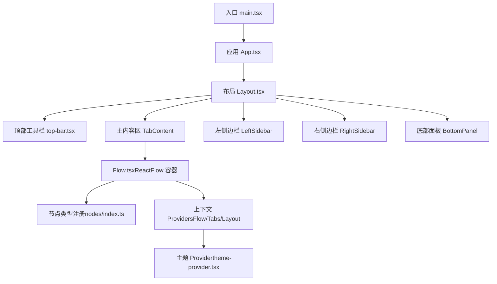
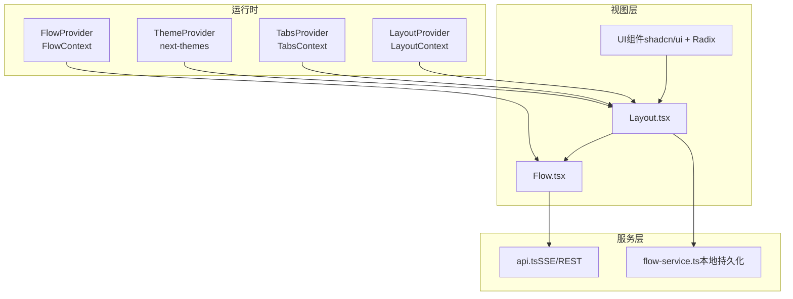
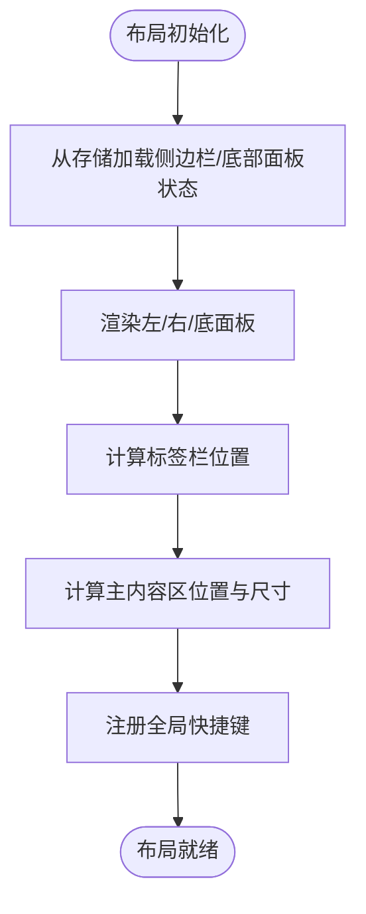
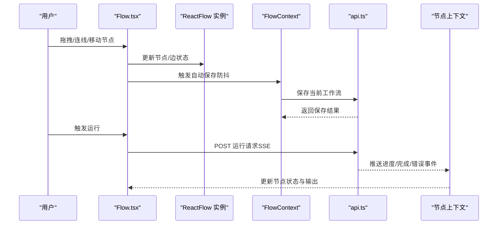
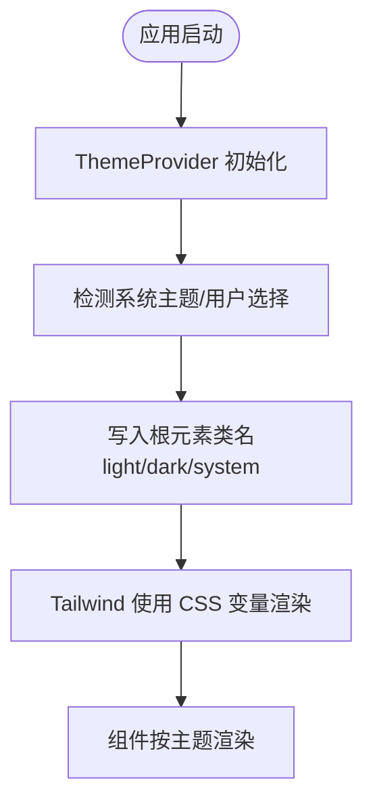
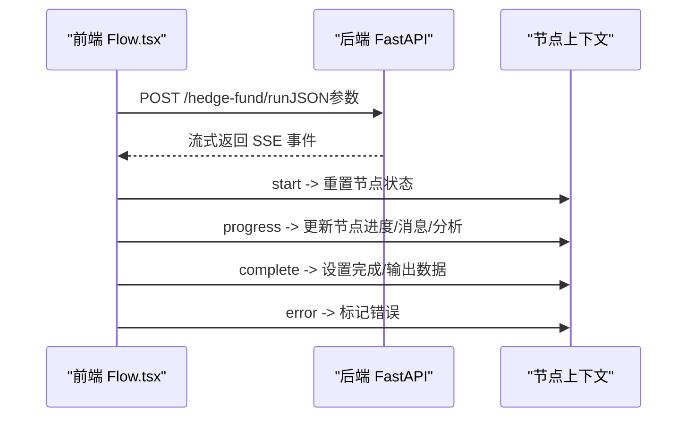
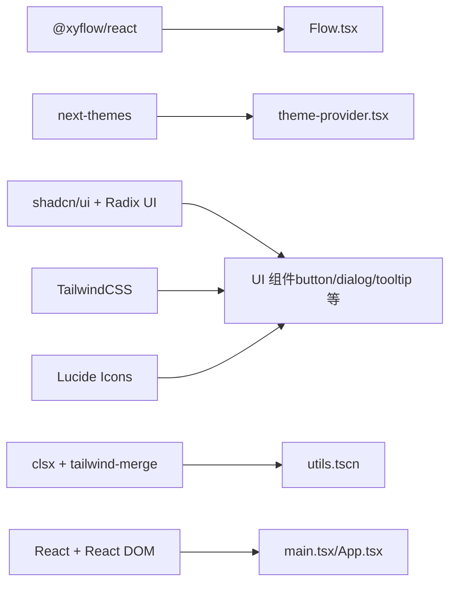

# 前端架构设计

<cite>
**本文引用的文件**
- [main.tsx](file://app/frontend/src/main.tsx)
- [App.tsx](file://app/frontend/src/App.tsx)
- [Layout.tsx](file://app/frontend/src/components/Layout.tsx)
- [top-bar.tsx](file://app/frontend/src/components/layout/top-bar.tsx)
- [Flow.tsx](file://app/frontend/src/components/Flow.tsx)
- [theme-provider.tsx](file://app/frontend/src/providers/theme-provider.tsx)
- [tailwind.config.ts](file://app/frontend/tailwind.config.ts)
- [package.json](file://app/frontend/package.json)
- [vite.config.ts](file://app/frontend/vite.config.ts)
- [flow-context.tsx](file://app/frontend/src/contexts/flow-context.tsx)
- [layout-context.tsx](file://app/frontend/src/contexts/layout-context.tsx)
- [index.ts（nodes）](file://app/frontend/src/nodes/index.ts)
- [api.ts](file://app/frontend/src/services/api.ts)
- [utils.ts](file://app/frontend/src/lib/utils.ts)
</cite>

## 目录
1. [简介](#简介)
2. [项目结构](#项目结构)
3. [核心组件](#核心组件)
4. [架构总览](#架构总览)
5. [组件详细分析](#组件详细分析)
6. [依赖关系分析](#依赖关系分析)
7. [性能考量](#性能考量)
8. [故障排查指南](#故障排查指南)
9. [结论](#结论)
10. [附录](#附录)

## 简介
本文件面向AI对冲基金可视化工作流平台的前端架构，系统化阐述React应用的整体结构、组件层次、状态管理、主题系统、UI库与样式管理、响应式与跨浏览器兼容性、性能优化、路由与导航、主题切换、国际化与无障碍、组件测试策略、代码分割与懒加载、开发工具与构建优化、部署流程，以及与后端API的集成与实时通信机制。

## 项目结构
前端采用Vite + React 18 + TypeScript + TailwindCSS + shadcn/ui风格的组件库，围绕“布局-画布-面板-设置-上下文”的分层组织，结合@xyflow/react实现可编辑的节点图谱工作流。

图表来源
- [main.tsx:1-19](file://app/frontend/src/main.tsx#L1-L19)
- [App.tsx:1-12](file://app/frontend/src/App.tsx#L1-L12)
- [Layout.tsx:187-201](file://app/frontend/src/components/Layout.tsx#L187-L201)
- [top-bar.tsx:1-87](file://app/frontend/src/components/layout/top-bar.tsx#L1-L87)
- [Flow.tsx:34-313](file://app/frontend/src/components/Flow.tsx#L34-L313)
- [index.ts（nodes）:52-60](file://app/frontend/src/nodes/index.ts#L52-L60)
- [theme-provider.tsx:8-19](file://app/frontend/src/providers/theme-provider.tsx#L8-L19)

章节来源
- [main.tsx:1-19](file://app/frontend/src/main.tsx#L1-L19)
- [App.tsx:1-12](file://app/frontend/src/App.tsx#L1-L12)
- [Layout.tsx:1-201](file://app/frontend/src/components/Layout.tsx#L1-L201)
- [vite.config.ts:1-14](file://app/frontend/vite.config.ts#L1-L14)
- [package.json:1-56](file://app/frontend/package.json#L1-L56)

## 核心组件
- 应用入口与根Provider：在入口中注入主题与节点上下文，保证全局可用。
- 布局容器：提供VS Code风格的顶部工具栏、标签栏、左右侧边栏、底部面板与主内容区，统一管理布局状态与键盘快捷键。
- 工作流画布：基于@xyflow/react，封装节点/边状态、自动保存、历史快照、撤销重做、键盘快捷键与主题适配。
- 主题系统：基于next-themes，支持系统默认、浅色/深色模式与持久化存储。
- UI组件库：以shadcn/ui风格为主，TailwindCSS提供原子化样式，配合Radix UI与Lucide图标。
- 上下文体系：FlowContext负责工作流增删改查、节点状态持久化；LayoutContext负责底部面板折叠与当前标签；TabsContext负责标签页生命周期。
- 服务层：封装API调用、SSE流处理、文件存储、语言模型与代理列表获取等。

章节来源
- [main.tsx:10-18](file://app/frontend/src/main.tsx#L10-L18)
- [Layout.tsx:187-201](file://app/frontend/src/components/Layout.tsx#L187-L201)
- [Flow.tsx:34-313](file://app/frontend/src/components/Flow.tsx#L34-L313)
- [theme-provider.tsx:8-19](file://app/frontend/src/providers/theme-provider.tsx#L8-L19)
- [flow-context.tsx:35-358](file://app/frontend/src/contexts/flow-context.tsx#L35-L358)
- [layout-context.tsx:27-68](file://app/frontend/src/contexts/layout-context.tsx#L27-L68)

## 架构总览
前端采用“Provider分层 + 组合组件 + 上下文共享”的架构，数据从服务层流向组件，状态通过上下文与本地持久化协同，主题与样式通过TailwindCSS与CSS变量统一管理。

图表来源
- [theme-provider.tsx:8-19](file://app/frontend/src/providers/theme-provider.tsx#L8-L19)
- [flow-context.tsx:35-358](file://app/frontend/src/contexts/flow-context.tsx#L35-L358)
- [layout-context.tsx:27-68](file://app/frontend/src/contexts/layout-context.tsx#L27-L68)
- [Layout.tsx:187-201](file://app/frontend/src/components/Layout.tsx#L187-L201)
- [Flow.tsx:34-313](file://app/frontend/src/components/Flow.tsx#L34-L313)
- [api.ts:12-309](file://app/frontend/src/services/api.ts#L12-L309)

## 组件详细分析

### 布局系统与导航设计
- 顶部工具栏：提供侧边栏与底部面板的快速开关、设置入口，支持键盘快捷键提示。
- 标签栏：位于顶部，随侧边栏宽度动态定位，承载多标签页。
- 主内容区：根据侧边栏与底部面板状态计算绝对定位与尺寸，确保画布全屏渲染。
- 键盘快捷键：统一在布局层注册，如Cmd+B/Cmd+I/Cmd+J/Cmd+O等，减少用户学习成本。

图表来源
- [Layout.tsx:24-101](file://app/frontend/src/components/Layout.tsx#L24-L101)
- [top-bar.tsx:15-87](file://app/frontend/src/components/layout/top-bar.tsx#L15-L87)

章节来源
- [Layout.tsx:1-201](file://app/frontend/src/components/Layout.tsx#L1-L201)
- [top-bar.tsx:1-87](file://app/frontend/src/components/layout/top-bar.tsx#L1-L87)

### 工作流画布与状态管理
- ReactFlow容器：集中管理节点与边状态，支持主题适配、网格背景、连接标记。
- 自动保存与历史：对节点/边变更进行防抖保存，支持撤销/重做与初始快照。
- 快捷键：保存、撤销/重做，提升操作效率。
- 节点类型注册：集中导出节点类型映射，便于扩展。

图表来源
- [Flow.tsx:92-143](file://app/frontend/src/components/Flow.tsx#L92-L143)
- [Flow.tsx:198-230](file://app/frontend/src/components/Flow.tsx#L198-L230)
- [flow-context.tsx:74-131](file://app/frontend/src/contexts/flow-context.tsx#L74-L131)
- [api.ts:87-309](file://app/frontend/src/services/api.ts#L87-L309)

章节来源
- [Flow.tsx:34-313](file://app/frontend/src/components/Flow.tsx#L34-L313)
- [flow-context.tsx:35-358](file://app/frontend/src/contexts/flow-context.tsx#L35-L358)
- [index.ts（nodes）:52-60](file://app/frontend/src/nodes/index.ts#L52-L60)

### 主题系统与样式管理
- 主题提供者：next-themes负责类名切换与系统偏好读取，持久化到localStorage。
- TailwindCSS：通过CSS变量映射主题色板，支持暗/亮/系统三种模式，动画插件增强过渡效果。
- UI组件：基于shadcn/ui风格，使用Radix UI与Lucide图标，保持一致性与可访问性。

图表来源
- [theme-provider.tsx:8-19](file://app/frontend/src/providers/theme-provider.tsx#L8-L19)
- [tailwind.config.ts:5-141](file://app/frontend/tailwind.config.ts#L5-L141)

章节来源
- [theme-provider.tsx:1-19](file://app/frontend/src/providers/theme-provider.tsx#L1-L19)
- [tailwind.config.ts:1-144](file://app/frontend/tailwind.config.ts#L1-L144)
- [package.json:11-35](file://app/frontend/package.json#L11-L35)

### 状态管理方案
- FlowContext：工作流的创建、保存、加载、清空；节点内部状态隔离与持久化；视口恢复。
- LayoutContext：底部面板折叠状态与当前标签页。
- TabsContext：标签页生命周期与切换。
- 节点状态：通过useNodeState与FlowContext联动，确保不同工作流间状态隔离。
- 历史与快照：FlowHistory钩子提供撤销/重做与快照能力。

章节来源
- [flow-context.tsx:35-358](file://app/frontend/src/contexts/flow-context.tsx#L35-L358)
- [layout-context.tsx:27-68](file://app/frontend/src/contexts/layout-context.tsx#L27-L68)

### 国际化与无障碍
- 国际化：当前未见i18n集成，建议后续引入i18n库并在主题与UI组件中统一接入。
- 无障碍：按钮与控件提供aria-label与title属性，键盘快捷键提示明确，符合WCAG基础要求。

章节来源
- [top-bar.tsx:35-84](file://app/frontend/src/components/layout/top-bar.tsx#L35-L84)
- [utils.ts:9-17](file://app/frontend/src/lib/utils.ts#L9-L17)

### 响应式设计与跨浏览器兼容性
- 响应式：布局通过绝对定位与动态计算尺寸适配不同窗口大小，底部面板高度与侧边栏宽度可调。
- 跨浏览器：TailwindCSS与现代浏览器兼容良好；@xyflow/react在主流浏览器表现稳定；建议在CI中增加跨浏览器测试矩阵。

章节来源
- [Layout.tsx:64-101](file://app/frontend/src/components/Layout.tsx#L64-L101)
- [Flow.tsx:280-313](file://app/frontend/src/components/Flow.tsx#L280-L313)

### 性能优化策略
- 防抖保存：对节点/边变更进行1秒防抖，避免频繁写入。
- 历史快照：500ms去抖生成快照，平衡性能与体验。
- 主题感知：仅在主题变化时更新颜色，减少重绘。
- 代码分割：Vite默认支持按需打包；建议对大型组件与对话框采用动态导入实现懒加载。
- 图标与UI：使用轻量级图标库与原子化样式，降低体积。

章节来源
- [Flow.tsx:57-89](file://app/frontend/src/components/Flow.tsx#L57-L89)
- [Flow.tsx:169-178](file://app/frontend/src/components/Flow.tsx#L169-L178)
- [vite.config.ts:1-14](file://app/frontend/vite.config.ts#L1-L14)

### 组件测试策略
- 单元测试：针对上下文逻辑（FlowContext）、工具函数（utils）与服务方法（api）编写测试。
- 集成测试：模拟ReactFlow实例与SSE流，验证节点状态更新与错误处理。
- UI测试：使用测试库对关键交互（保存、撤销、快捷键）进行端到端验证。

章节来源
- [flow-context.tsx:74-131](file://app/frontend/src/contexts/flow-context.tsx#L74-L131)
- [api.ts:87-309](file://app/frontend/src/services/api.ts#L87-L309)
- [utils.ts:1-39](file://app/frontend/src/lib/utils.ts#L1-L39)

### 开发工具配置与构建优化
- 开发：Vite热更新与TypeScript检查；ESLint与Prettier规范代码风格。
- 构建：Vite生产打包，支持别名路径与插件扩展。
- 样式：TailwindCSS按需扫描，减少产物体积；CSS变量驱动主题。

章节来源
- [package.json:5-10](file://app/frontend/package.json#L5-L10)
- [vite.config.ts:1-14](file://app/frontend/vite.config.ts#L1-L14)
- [tailwind.config.ts:7-11](file://app/frontend/tailwind.config.ts#L7-L11)

### 部署流程
- 构建产物：Vite生成静态资源，建议托管于CDN或静态站点服务。
- 环境变量：通过VITE_API_URL配置后端地址，确保前后端分离部署。
- 容器化：可参考项目根目录Docker配置进行统一打包与发布。

章节来源
- [api.ts:10](file://app/frontend/src/services/api.ts#L10)
- [package.json:5-10](file://app/frontend/package.json#L5-L10)

### 与后端API的集成与实时通信
- REST接口：获取代理与模型列表、保存JSON文件等。
- SSE流：POST触发后端运行，前端解析事件类型（start/progress/complete/error），更新节点状态与输出，维护连接状态机。

图表来源
- [api.ts:87-309](file://app/frontend/src/services/api.ts#L87-L309)

## 依赖关系分析

图表来源
- [package.json:11-35](file://app/frontend/package.json#L11-L35)
- [Flow.tsx:14-28](file://app/frontend/src/components/Flow.tsx#L14-L28)
- [theme-provider.tsx:1-2](file://app/frontend/src/providers/theme-provider.tsx#L1-L2)
- [utils.ts:1-6](file://app/frontend/src/lib/utils.ts#L1-L6)

章节来源
- [package.json:1-56](file://app/frontend/package.json#L1-L56)

## 性能考量
- 渲染优化：避免不必要的重渲染，合理拆分组件与上下文，使用useCallback/useMemo。
- 数据流：集中管理状态，减少跨层级传递，利用上下文聚合共享。
- I/O优化：防抖保存与SSE事件合并处理，降低网络与数据库压力。
- 资源体积：按需导入与Tree-shaking，TailwindCSS按需扫描，避免全局样式污染。

## 故障排查指南
- 保存失败：检查API返回与错误提示，确认VITE_API_URL配置正确。
- 连接中断：SSE流异常时会标记节点为ERROR，检查后端日志与网络状况。
- 主题不生效：确认next-themes类名写入与TailwindCSS变量映射一致。
- 快捷键无效：检查平台判断与修饰键格式化逻辑。

章节来源
- [api.ts:280-295](file://app/frontend/src/services/api.ts#L280-L295)
- [utils.ts:9-17](file://app/frontend/src/lib/utils.ts#L9-L17)

## 结论
该前端架构以清晰的Provider分层、完善的上下文体系与TailwindCSS主题系统为基础，结合@xyflow/react实现了高可用的工作流画布。通过防抖保存、历史快照与SSE流处理，兼顾了用户体验与性能。建议后续完善国际化、跨浏览器测试矩阵与组件测试覆盖率，持续优化构建与部署流程。

## 附录
- 关键路径索引
  - 入口与Provider：[main.tsx:10-18](file://app/frontend/src/main.tsx#L10-L18)，[theme-provider.tsx:8-19](file://app/frontend/src/providers/theme-provider.tsx#L8-L19)
  - 布局与导航：[Layout.tsx:187-201](file://app/frontend/src/components/Layout.tsx#L187-L201)，[top-bar.tsx:15-87](file://app/frontend/src/components/layout/top-bar.tsx#L15-L87)
  - 画布与状态：[Flow.tsx:34-313](file://app/frontend/src/components/Flow.tsx#L34-L313)，[flow-context.tsx:35-358](file://app/frontend/src/contexts/flow-context.tsx#L35-L358)
  - UI与样式：[tailwind.config.ts:5-141](file://app/frontend/tailwind.config.ts#L5-L141)，[package.json:11-35](file://app/frontend/package.json#L11-L35)
  - 后端集成：[api.ts:12-309](file://app/frontend/src/services/api.ts#L12-L309)