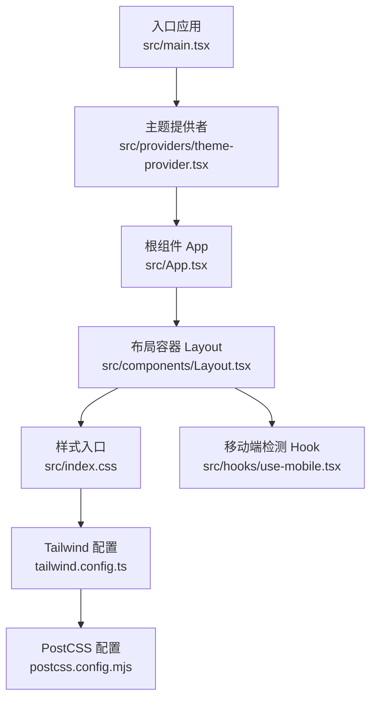
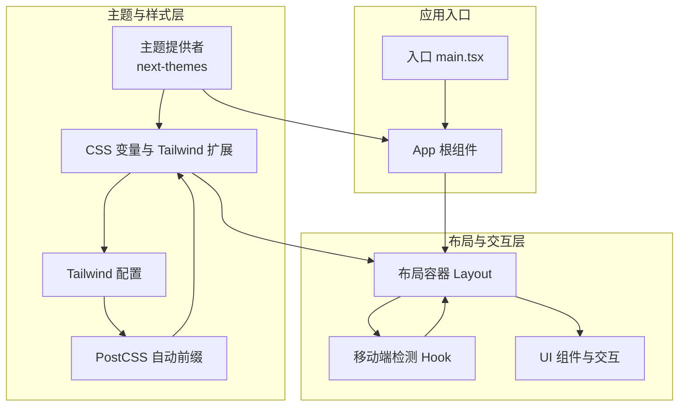
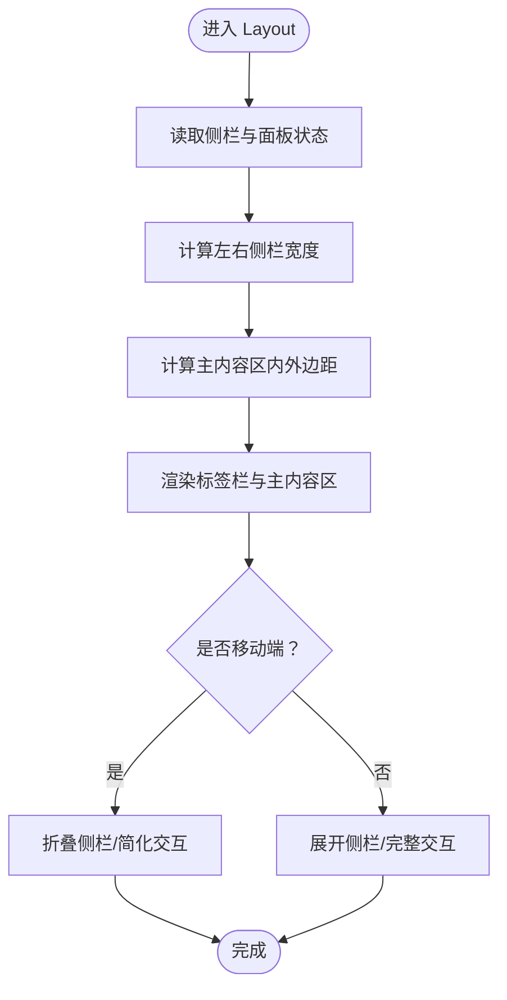
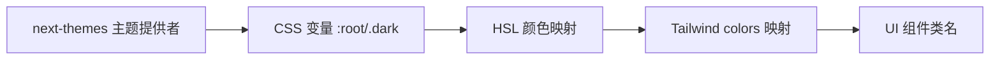
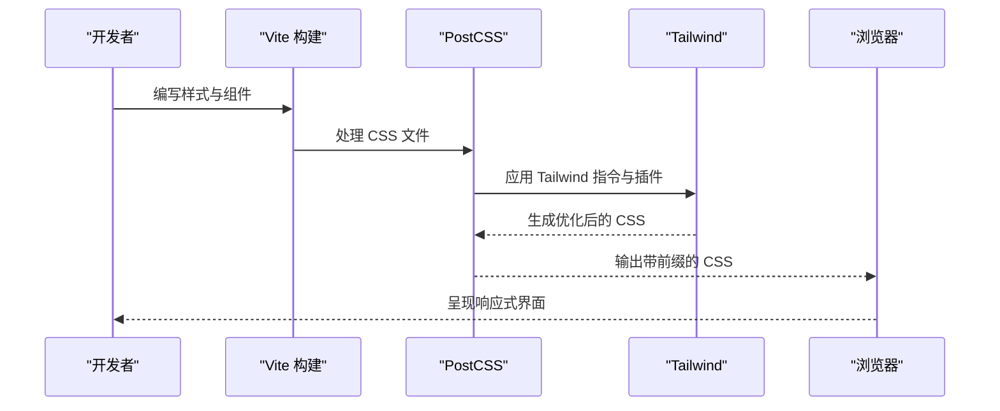
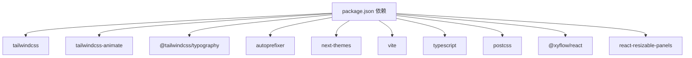

# 响应式设计

<cite>
**本文引用的文件**
- [app/frontend/src/index.css](file://app/frontend/src/index.css)
- [app/frontend/tailwind.config.ts](file://app/frontend/tailwind.config.ts)
- [app/frontend/postcss.config.mjs](file://app/frontend/postcss.config.mjs)
- [app/frontend/src/hooks/use-mobile.tsx](file://app/frontend/src/hooks/use-mobile.tsx)
- [app/frontend/src/components/Layout.tsx](file://app/frontend/src/components/Layout.tsx)
- [app/frontend/src/main.tsx](file://app/frontend/src/main.tsx)
- [app/frontend/src/providers/theme-provider.tsx](file://app/frontend/src/providers/theme-provider.tsx)
- [app/frontend/src/App.tsx](file://app/frontend/src/App.tsx)
- [app/frontend/package.json](file://app/frontend/package.json)
</cite>

## 目录
1. [引言](#引言)
2. [项目结构](#项目结构)
3. [核心组件](#核心组件)
4. [架构总览](#架构总览)
5. [详细组件分析](#详细组件分析)
6. [依赖分析](#依赖分析)
7. [性能考量](#性能考量)
8. [故障排查指南](#故障排查指南)
9. [结论](#结论)
10. [附录](#附录)

## 引言
本文件聚焦于前端工程中的响应式设计实践，围绕移动端适配、断点设计、触摸交互优化展开，结合项目中已有的主题系统、Tailwind 配置与媒体查询 Hook，系统阐述如何在现代前端栈（Vite + React + Tailwind + PostCSS）下实现一致、可维护且高性能的响应式体验。内容涵盖：
- 移动端检测与断点策略
- 屏幕尺寸适配与弹性布局
- 触摸友好组件与手势支持建议
- 跨浏览器兼容、CSS 前缀与渐进增强
- 高分辨率屏幕适配、缩放与字体优化
- 性能优化、渲染优化与电池续航考虑
- 无障碍访问、键盘导航与屏幕阅读器兼容

## 项目结构
前端采用 Vite + React + Tailwind CSS 构建，样式通过 PostCSS 自动添加浏览器前缀，主题系统由 next-themes 提供深浅色切换与系统偏好感知。

图表来源
- [app/frontend/src/main.tsx:1-19](file://app/frontend/src/main.tsx#L1-L19)
- [app/frontend/src/providers/theme-provider.tsx:1-19](file://app/frontend/src/providers/theme-provider.tsx#L1-L19)
- [app/frontend/src/App.tsx:1-12](file://app/frontend/src/App.tsx#L1-L12)
- [app/frontend/src/components/Layout.tsx:1-201](file://app/frontend/src/components/Layout.tsx#L1-L201)
- [app/frontend/src/index.css:1-356](file://app/frontend/src/index.css#L1-L356)
- [app/frontend/tailwind.config.ts:1-144](file://app/frontend/tailwind.config.ts#L1-L144)
- [app/frontend/postcss.config.mjs:1-10](file://app/frontend/postcss.config.mjs#L1-L10)
- [app/frontend/src/hooks/use-mobile.tsx:1-20](file://app/frontend/src/hooks/use-mobile.tsx#L1-L20)

章节来源
- [app/frontend/src/main.tsx:1-19](file://app/frontend/src/main.tsx#L1-L19)
- [app/frontend/src/providers/theme-provider.tsx:1-19](file://app/frontend/src/providers/theme-provider.tsx#L1-L19)
- [app/frontend/src/App.tsx:1-12](file://app/frontend/src/App.tsx#L1-L12)
- [app/frontend/src/components/Layout.tsx:1-201](file://app/frontend/src/components/Layout.tsx#L1-L201)
- [app/frontend/src/index.css:1-356](file://app/frontend/src/index.css#L1-L356)
- [app/frontend/tailwind.config.ts:1-144](file://app/frontend/tailwind.config.ts#L1-L144)
- [app/frontend/postcss.config.mjs:1-10](file://app/frontend/postcss.config.mjs#L1-L10)
- [app/frontend/src/hooks/use-mobile.tsx:1-20](file://app/frontend/src/hooks/use-mobile.tsx#L1-L20)

## 核心组件
- 主题提供者：基于 next-themes 实现深浅色主题与系统偏好感知，统一管理主题状态。
- 布局容器：采用绝对定位与动态内边距计算，实现左右侧栏与底部面板的可折叠布局，并为标签栏与主内容区提供自适应空间。
- 移动端检测 Hook：使用媒体查询与窗口宽度判断，提供移动端断点逻辑，便于条件渲染与交互优化。
- 样式入口与 Tailwind 配置：通过 CSS 变量与 Tailwind 扩展，统一颜色体系与圆角、字体等设计令牌；PostCSS 自动添加浏览器前缀。

章节来源
- [app/frontend/src/providers/theme-provider.tsx:1-19](file://app/frontend/src/providers/theme-provider.tsx#L1-L19)
- [app/frontend/src/components/Layout.tsx:1-201](file://app/frontend/src/components/Layout.tsx#L1-L201)
- [app/frontend/src/hooks/use-mobile.tsx:1-20](file://app/frontend/src/hooks/use-mobile.tsx#L1-L20)
- [app/frontend/src/index.css:1-356](file://app/frontend/src/index.css#L1-L356)
- [app/frontend/tailwind.config.ts:1-144](file://app/frontend/tailwind.config.ts#L1-L144)
- [app/frontend/postcss.config.mjs:1-10](file://app/frontend/postcss.config.mjs#L1-L10)

## 架构总览
整体响应式架构以“主题系统 + Tailwind 设计令牌 + 绝对定位布局 + 媒体查询 Hook”为核心，配合 PostCSS 自动前缀与构建工具链，确保在多设备与多浏览器环境下的一致表现。

图表来源
- [app/frontend/src/main.tsx:1-19](file://app/frontend/src/main.tsx#L1-L19)
- [app/frontend/src/App.tsx:1-12](file://app/frontend/src/App.tsx#L1-L12)
- [app/frontend/src/providers/theme-provider.tsx:1-19](file://app/frontend/src/providers/theme-provider.tsx#L1-L19)
- [app/frontend/src/components/Layout.tsx:1-201](file://app/frontend/src/components/Layout.tsx#L1-L201)
- [app/frontend/src/hooks/use-mobile.tsx:1-20](file://app/frontend/src/hooks/use-mobile.tsx#L1-L20)
- [app/frontend/src/index.css:1-356](file://app/frontend/src/index.css#L1-L356)
- [app/frontend/tailwind.config.ts:1-144](file://app/frontend/tailwind.config.ts#L1-L144)
- [app/frontend/postcss.config.mjs:1-10](file://app/frontend/postcss.config.mjs#L1-L10)

## 详细组件分析

### 布局容器与断点策略
- 绝对定位与动态内边距：通过计算左右侧栏与底部面板的展开/折叠状态，动态设置主内容区的内外边距，保证在不同断点下的内容可见性与交互区域充足。
- 移动端断点：使用 Hook 在客户端监听媒体查询变化与窗口宽度，设定 768px 作为移动端阈值，用于条件渲染与交互优化（如侧栏折叠、触摸手势优先）。
- 标签栏与主内容区：标签栏与底部面板采用绝对定位，避免在侧栏折叠时出现布局抖动；主内容区通过内边距与固定高度（如标签栏高度）确保内容不被遮挡。

图表来源
- [app/frontend/src/components/Layout.tsx:64-101](file://app/frontend/src/components/Layout.tsx#L64-L101)
- [app/frontend/src/hooks/use-mobile.tsx:3-19](file://app/frontend/src/hooks/use-mobile.tsx#L3-L19)

章节来源
- [app/frontend/src/components/Layout.tsx:1-201](file://app/frontend/src/components/Layout.tsx#L1-L201)
- [app/frontend/src/hooks/use-mobile.tsx:1-20](file://app/frontend/src/hooks/use-mobile.tsx#L1-L20)

### 主题系统与颜色令牌
- CSS 变量：在基础层定义大量 CSS 变量，覆盖背景、前景、卡片、弹出层、输入框、环形边框、节点边框与状态边框等，支持明暗两套主题。
- Tailwind 集成：通过 theme.extend.colors 将 CSS 变量映射到 Tailwind 类名，实现按主题自动切换的颜色体系。
- 深浅色切换：next-themes 提供 class 属性与系统偏好感知，默认存储在本地存储中，确保刷新后主题状态保持。

图表来源
- [app/frontend/src/index.css:5-145](file://app/frontend/src/index.css#L5-L145)
- [app/frontend/tailwind.config.ts:42-112](file://app/frontend/tailwind.config.ts#L42-L112)
- [app/frontend/src/providers/theme-provider.tsx:8-18](file://app/frontend/src/providers/theme-provider.tsx#L8-L18)

章节来源
- [app/frontend/src/index.css:1-356](file://app/frontend/src/index.css#L1-L356)
- [app/frontend/tailwind.config.ts:1-144](file://app/frontend/tailwind.config.ts#L1-L144)
- [app/frontend/src/providers/theme-provider.tsx:1-19](file://app/frontend/src/providers/theme-provider.tsx#L1-L19)

### 样式入口与构建链路
- Tailwind 指令：通过 @tailwind base、components、utilities 注入基础、组件与工具类。
- PostCSS 插件：tailwindcss 与 autoprefixer 自动处理样式与浏览器前缀，提升兼容性。
- 字体与骨架屏：定义字体族与骨架屏动画，改善首屏体验与加载态表现。

图表来源
- [app/frontend/src/index.css:1-3](file://app/frontend/src/index.css#L1-L3)
- [app/frontend/postcss.config.mjs:2-7](file://app/frontend/postcss.config.mjs#L2-L7)
- [app/frontend/package.json:37-54](file://app/frontend/package.json#L37-L54)

章节来源
- [app/frontend/src/index.css:1-356](file://app/frontend/src/index.css#L1-L356)
- [app/frontend/postcss.config.mjs:1-10](file://app/frontend/postcss.config.mjs#L1-L10)
- [app/frontend/package.json:1-56](file://app/frontend/package.json#L1-L56)

### 触摸友好与手势支持
- 当前实现：布局容器通过绝对定位与内边距控制内容区，未直接引入触摸手势库或手势事件绑定。
- 建议实践：
  - 使用触摸友好的点击目标尺寸（建议 ≥ 44px），确保在小屏幕上易于点击。
  - 对可拖拽区域（如侧栏与面板）增加触摸拖拽反馈与惯性滚动提示。
  - 为移动端提供双指缩放与滑动切换（如标签页）的交互提示。
  - 在触摸设备上默认折叠侧栏，减少误触概率。

章节来源
- [app/frontend/src/components/Layout.tsx:104-179](file://app/frontend/src/components/Layout.tsx#L104-L179)

## 依赖分析
- 样式与主题：Tailwind CSS、tailwindcss-animate、@tailwindcss/typography、autoprefixer。
- 主题系统：next-themes。
- 构建工具：Vite、TypeScript、PostCSS。
- UI 与交互：@xyflow/react（流程图）、react-resizable-panels（可调整面板）、shadcn-ui 生态组件。

图表来源
- [app/frontend/package.json:11-35](file://app/frontend/package.json#L11-L35)
- [app/frontend/package.json:37-54](file://app/frontend/package.json#L37-L54)

章节来源
- [app/frontend/package.json:1-56](file://app/frontend/package.json#L1-L56)

## 性能考量
- 渲染优化
  - 使用绝对定位与 transform 替代改变布局属性，减少重排与重绘。
  - 合理使用过渡与动画时长，避免在低端设备上造成卡顿。
- 电池续航
  - 减少不必要的动画与高频事件（如 resize/mousemove），在移动端降低动画频率。
  - 控制阴影与滤镜的使用范围，避免 GPU 压力过大。
- 首屏与资源
  - 利用骨架屏与字体预加载，缩短可交互时间。
  - 通过 PostCSS 自动前缀减少手动维护成本，同时避免冗余样式。
- 断点与布局
  - 在移动端优先使用流式布局与相对单位，减少复杂计算。
  - 避免在小屏上强制使用固定宽高，优先使用 max-width 与 padding。

## 故障排查指南
- 主题不生效
  - 确认主题提供者包裹了根组件，且未被其他 Provider 覆盖。
  - 检查本地存储键名与默认主题配置是否正确。
- 样式未更新
  - 确认 Tailwind 内容路径包含组件目录，PostCSS 插件顺序正确。
  - 清理构建缓存后重新编译。
- 移动端交互异常
  - 检查媒体查询与窗口宽度判断逻辑，确认断点阈值符合预期。
  - 在真机上测试触摸事件与滚动行为，必要时引入手势库进行补充。

章节来源
- [app/frontend/src/providers/theme-provider.tsx:8-18](file://app/frontend/src/providers/theme-provider.tsx#L8-L18)
- [app/frontend/tailwind.config.ts:7-10](file://app/frontend/tailwind.config.ts#L7-L10)
- [app/frontend/postcss.config.mjs:2-7](file://app/frontend/postcss.config.mjs#L2-L7)
- [app/frontend/src/hooks/use-mobile.tsx:8-16](file://app/frontend/src/hooks/use-mobile.tsx#L8-L16)

## 结论
本项目在响应式设计方面已具备良好基础：通过 next-themes 与 Tailwind 的主题与设计令牌体系，结合 PostCSS 自动前缀与媒体查询 Hook，实现了跨设备的一致体验。建议在现有基础上进一步完善移动端触摸交互、手势识别与动画优化，并持续关注性能与电池续航，以提供更佳的移动端使用体验。

## 附录
- 断点建议
  - 移动端：≤ 768px（当前 Hook 已使用）
  - 平板：769px - 1024px
  - 桌面端：> 1024px
- 触摸交互最佳实践
  - 点击目标最小尺寸 ≥ 44px
  - 避免在小屏上显示过多可交互元素
  - 提供视觉反馈与无障碍键盘替代