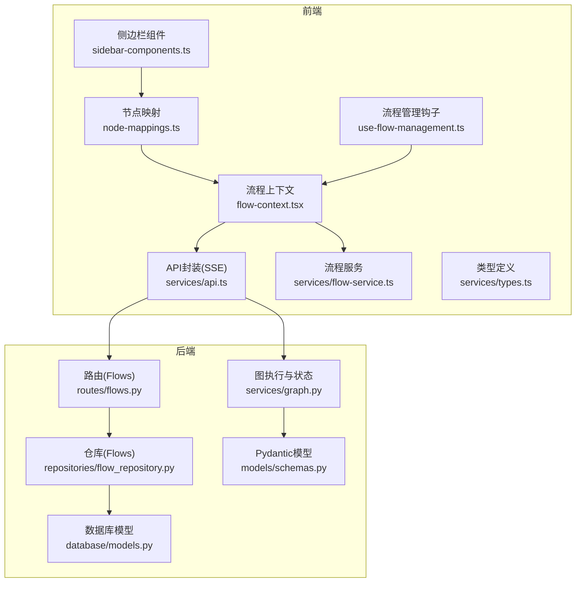
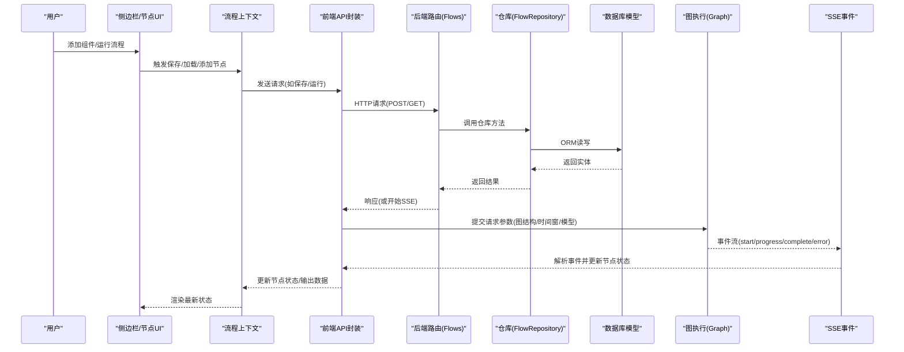
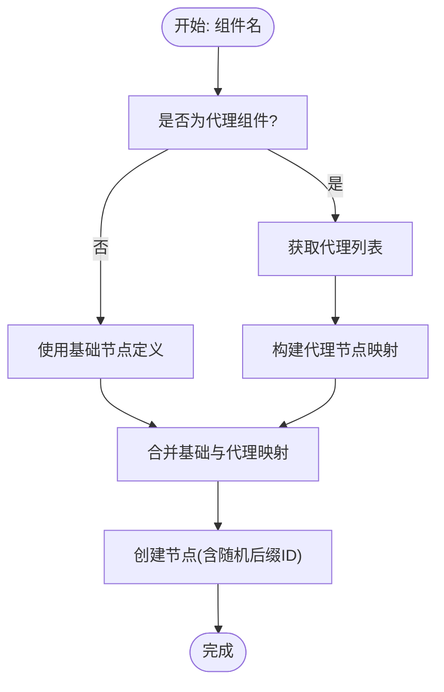
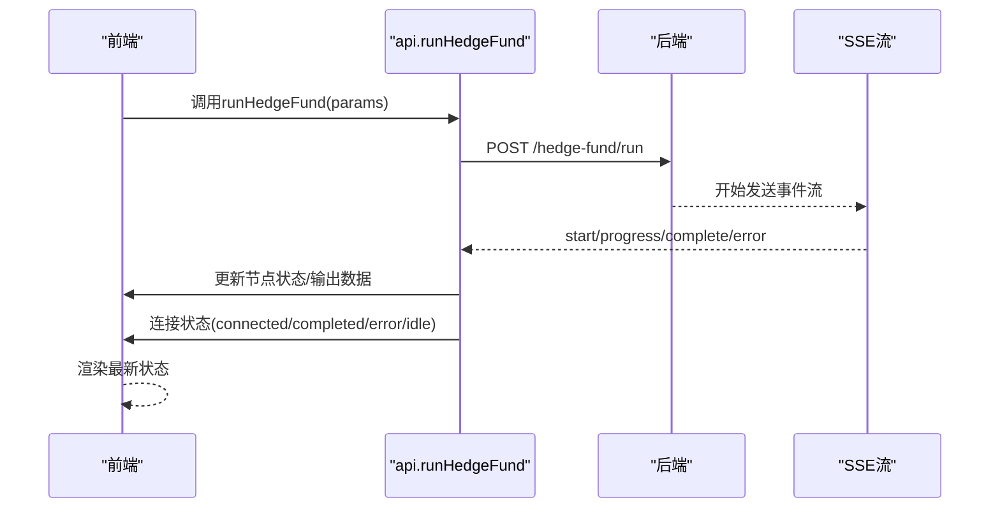
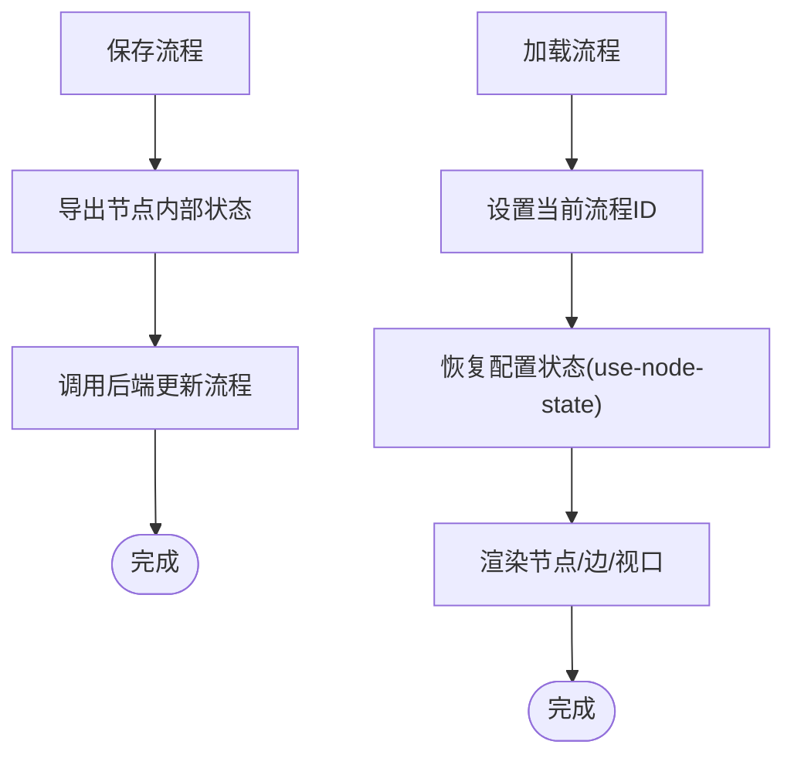
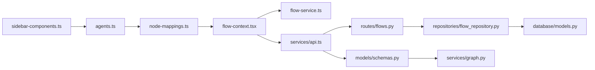

# 数据流设计

<cite>
**本文引用的文件**
- [app/frontend/src/data/node-mappings.ts](file://app/frontend/src/data/node-mappings.ts)
- [app/frontend/src/data/sidebar-components.ts](file://app/frontend/src/data/sidebar-components.ts)
- [app/frontend/src/services/types.ts](file://app/frontend/src/services/types.ts)
- [app/backend/models/schemas.py](file://app/backend/models/schemas.py)
- [app/backend/repositories/flow_repository.py](file://app/backend/repositories/flow_repository.py)
- [app/backend/routes/flows.py](file://app/backend/routes/flows.py)
- [app/backend/database/models.py](file://app/backend/database/models.py)
- [app/backend/services/graph.py](file://app/backend/services/graph.py)
- [app/frontend/src/services/api.ts](file://app/frontend/src/services/api.ts)
- [app/frontend/src/services/flow-service.ts](file://app/frontend/src/services/flow-service.ts)
- [app/frontend/src/contexts/flow-context.tsx](file://app/frontend/src/contexts/flow-context.tsx)
- [app/frontend/src/hooks/use-flow-management.ts](file://app/frontend/src/hooks/use-flow-management.ts)
- [src/data/cache.py](file://src/data/cache.py)
</cite>

## 目录
1. [引言](#引言)
2. [项目结构](#项目结构)
3. [核心组件](#核心组件)
4. [架构总览](#架构总览)
5. [详细组件分析](#详细组件分析)
6. [依赖分析](#依赖分析)
7. [性能考虑](#性能考虑)
8. [故障排查指南](#故障排查指南)
9. [结论](#结论)
10. [附录](#附录)

## 引言
本文件系统性梳理该AI对冲基金平台的数据流设计，重点覆盖以下方面：
- 数据映射与类型定义：前端侧边栏组件到节点映射、节点创建与唯一ID生成、后端请求/响应模型与校验。
- 服务层设计：前端API封装（含SSE）、后端路由与仓库层、图执行与状态管理。
- 缓存策略：前端节点状态缓存、后端内存缓存（财务数据去重合并）。
- 错误处理：前后端统一错误返回、SSE连接异常与中止处理。
- 类型安全与接口：Pydantic模型与TypeScript类型并行约束，确保跨层数据一致性。
- 实时更新与同步：SSE事件驱动的状态推进、连接状态管理。
- 持久化与离线：流程配置持久化、节点内部状态与运行时上下文分离、默认流程创建。
- 性能监控与优化：缓存命中、去重合并、异步执行与线程池隔离。

## 项目结构
前端采用React + TypeScript + Zustand风格上下文，后端采用FastAPI + SQLAlchemy，数据在前后端之间通过REST/SSE进行传输，并以JSON结构承载。



图表来源
- [app/frontend/src/data/sidebar-components.ts:31-74](file://app/frontend/src/data/sidebar-components.ts#L31-L74)
- [app/frontend/src/data/node-mappings.ts:85-121](file://app/frontend/src/data/node-mappings.ts#L85-L121)
- [app/frontend/src/contexts/flow-context.tsx:35-358](file://app/frontend/src/contexts/flow-context.tsx#L35-L358)
- [app/frontend/src/hooks/use-flow-management.ts:44-336](file://app/frontend/src/hooks/use-flow-management.ts#L44-L336)
- [app/frontend/src/services/api.ts:12-309](file://app/frontend/src/services/api.ts#L12-L309)
- [app/frontend/src/services/flow-service.ts:27-108](file://app/frontend/src/services/flow-service.ts#L27-L108)
- [app/backend/routes/flows.py:18-174](file://app/backend/routes/flows.py#L18-L174)
- [app/backend/repositories/flow_repository.py:6-103](file://app/backend/repositories/flow_repository.py#L6-L103)
- [app/backend/database/models.py:6-115](file://app/backend/database/models.py#L6-L115)
- [app/backend/models/schemas.py:61-141](file://app/backend/models/schemas.py#L61-L141)
- [app/backend/services/graph.py:36-129](file://app/backend/services/graph.py#L36-L129)

章节来源
- [app/frontend/src/data/sidebar-components.ts:31-74](file://app/frontend/src/data/sidebar-components.ts#L31-L74)
- [app/frontend/src/data/node-mappings.ts:85-121](file://app/frontend/src/data/node-mappings.ts#L85-L121)
- [app/frontend/src/contexts/flow-context.tsx:35-358](file://app/frontend/src/contexts/flow-context.tsx#L35-L358)
- [app/frontend/src/hooks/use-flow-management.ts:44-336](file://app/frontend/src/hooks/use-flow-management.ts#L44-L336)
- [app/frontend/src/services/api.ts:12-309](file://app/frontend/src/services/api.ts#L12-L309)
- [app/frontend/src/services/flow-service.ts:27-108](file://app/frontend/src/services/flow-service.ts#L27-L108)
- [app/backend/routes/flows.py:18-174](file://app/backend/routes/flows.py#L18-L174)
- [app/backend/repositories/flow_repository.py:6-103](file://app/backend/repositories/flow_repository.py#L6-L103)
- [app/backend/database/models.py:6-115](file://app/backend/database/models.py#L6-L115)
- [app/backend/models/schemas.py:61-141](file://app/backend/models/schemas.py#L61-L141)
- [app/backend/services/graph.py:36-129](file://app/backend/services/graph.py#L36-L129)

## 核心组件
- 侧边栏组件与节点映射
  - 侧边栏分组与图标定义，动态加载代理列表，构建“组件组”结构。
  - 节点映射定义“组件名到节点创建函数”的映射，支持基础节点与代理节点两类，统一生成带随机后缀的唯一ID，便于运行期识别与状态管理。
- 流程上下文与管理
  - 流程上下文负责节点增删改、视口适配、保存/加载流程；管理钩子负责搜索、模板、最近流程分组、默认流程创建与恢复。
- API服务封装（含SSE）
  - 封装代理/模型列表获取、JSON文件保存、模拟运行（SSE）等；SSE事件解析与节点状态推进、输出节点数据写入、连接状态机维护。
- 后端模型与路由
  - Pydantic模型定义请求/响应结构与字段校验；路由提供流程的CRUD与复制；仓库层实现数据库操作；数据库模型定义三类表：流程、流程运行、运行周期与密钥。

章节来源
- [app/frontend/src/data/sidebar-components.ts:31-74](file://app/frontend/src/data/sidebar-components.ts#L31-L74)
- [app/frontend/src/data/node-mappings.ts:85-121](file://app/frontend/src/data/node-mappings.ts#L85-L121)
- [app/frontend/src/contexts/flow-context.tsx:216-340](file://app/frontend/src/contexts/flow-context.tsx#L216-L340)
- [app/frontend/src/hooks/use-flow-management.ts:146-212](file://app/frontend/src/hooks/use-flow-management.ts#L146-L212)
- [app/frontend/src/services/api.ts:12-309](file://app/frontend/src/services/api.ts#L12-L309)
- [app/backend/models/schemas.py:61-141](file://app/backend/models/schemas.py#L61-L141)
- [app/backend/routes/flows.py:18-174](file://app/backend/routes/flows.py#L18-L174)
- [app/backend/repositories/flow_repository.py:6-103](file://app/backend/repositories/flow_repository.py#L6-L103)
- [app/backend/database/models.py:6-115](file://app/backend/database/models.py#L6-L115)

## 架构总览
下图展示从用户交互到后端执行再到前端SSE事件驱动的完整数据流。



图表来源
- [app/frontend/src/contexts/flow-context.tsx:74-131](file://app/frontend/src/contexts/flow-context.tsx#L74-L131)
- [app/frontend/src/services/api.ts:87-309](file://app/frontend/src/services/api.ts#L87-L309)
- [app/backend/routes/flows.py:18-174](file://app/backend/routes/flows.py#L18-L174)
- [app/backend/repositories/flow_repository.py:6-103](file://app/backend/repositories/flow_repository.py#L6-L103)
- [app/backend/database/models.py:6-115](file://app/backend/database/models.py#L6-L115)
- [app/backend/services/graph.py:141-177](file://app/backend/services/graph.py#L141-L177)

## 详细组件分析

### 代理数据映射与节点映射
- 代理数据映射
  - 侧边栏组件按分组组织，动态拉取代理列表，形成“Analysts”分组。
  - 节点映射将组件名映射为节点创建函数，支持基础节点（如输入/管理节点）与代理节点（动态从后端获取），统一生成带随机后缀的唯一ID，便于运行期匹配。
- 节点映射与唯一ID
  - 节点创建时生成短随机后缀，用于区分同一组件的多个实例；提供提取基础键的工具函数，用于运行期事件与节点ID的解耦匹配。
- 多节点组合
  - 支持多节点组合（如“Swarm”群组），根据偏移量批量创建节点并生成边，最终一次性注入画布。



图表来源
- [app/frontend/src/data/sidebar-components.ts:31-74](file://app/frontend/src/data/sidebar-components.ts#L31-L74)
- [app/frontend/src/data/node-mappings.ts:85-121](file://app/frontend/src/data/node-mappings.ts#L85-L121)
- [app/frontend/src/contexts/flow-context.tsx:234-331](file://app/frontend/src/contexts/flow-context.tsx#L234-L331)

章节来源
- [app/frontend/src/data/sidebar-components.ts:31-74](file://app/frontend/src/data/sidebar-components.ts#L31-L74)
- [app/frontend/src/data/node-mappings.ts:85-121](file://app/frontend/src/data/node-mappings.ts#L85-L121)
- [app/frontend/src/contexts/flow-context.tsx:234-331](file://app/frontend/src/contexts/flow-context.tsx#L234-L331)

### 侧边栏组件数据流
- 组件分组与图标：按功能域分组（Start Nodes、Analysts、Swarm、End Nodes），动态注入代理图标与名称。
- 与节点映射协作：侧边栏组件名直接对应节点映射中的组件名，保证创建行为一致。

章节来源
- [app/frontend/src/data/sidebar-components.ts:31-74](file://app/frontend/src/data/sidebar-components.ts#L31-L74)
- [app/frontend/src/data/node-mappings.ts:85-121](file://app/frontend/src/data/node-mappings.ts#L85-L121)

### API服务封装与SSE事件驱动
- 请求封装
  - 代理/模型列表获取、JSON文件保存、流程CRUD等均通过fetch封装，统一错误处理与日志记录。
- 运行流程（SSE）
  - 发起POST请求，接收SSE事件流；解析事件类型与数据，分别处理“开始/进度/完成/错误”四类事件。
  - 进度事件映射到节点状态（进行中/完成/错误），并写入额外数据（如分析内容、时间戳）；完成事件写入输出节点数据并清理连接状态。
  - 错误事件与连接中断统一标记为错误并更新连接状态；支持手动中止并清理状态。
- 事件解析与状态推进
  - 使用AbortController控制SSE连接；按双换行符拆分事件，逐条解析事件头与数据体，避免粘包问题。



图表来源
- [app/frontend/src/services/api.ts:87-309](file://app/frontend/src/services/api.ts#L87-L309)

章节来源
- [app/frontend/src/services/api.ts:12-309](file://app/frontend/src/services/api.ts#L12-L309)

### 后端模型与类型安全
- 请求/响应模型
  - 基础请求包含股票列表、图节点/边、代理模型配置、初始资金等；后端模型提供字段校验（如价格必须为正数）与默认值。
  - 代理模型配置支持按节点ID或基础键匹配，兼容唯一ID与基础键两种形式。
- 图执行与状态
  - 从图结构中提取代理ID集合，构建LangGraph工作流；根据边关系建立节点间连接，设置入口节点与结束节点。
  - 执行器以异步方式调用同步函数，避免阻塞事件循环。

```mermaid
classDiagram
class BaseHedgeFundRequest {
+tickers : string[]
+graph_nodes : GraphNode[]
+graph_edges : GraphEdge[]
+agent_models : AgentModelConfig[]
+model_name : string
+model_provider : ModelProvider
+margin_requirement : number
+portfolio_positions : PortfolioPosition[]
+get_agent_ids() string[]
+get_agent_model_config(agent_id) (string, ModelProvider)
}
class GraphNode {
+id : string
+type : string
+data : any
+position : {x,y}
}
class GraphEdge {
+id : string
+source : string
+target : string
+type : string
+data : any
}
class AgentModelConfig {
+agent_id : string
+model_name : string
+model_provider : ModelProvider
}
class PortfolioPosition {
+ticker : string
+quantity : float
+trade_price : float
}
BaseHedgeFundRequest --> GraphNode : "包含"
BaseHedgeFundRequest --> GraphEdge : "包含"
BaseHedgeFundRequest --> AgentModelConfig : "可选"
BaseHedgeFundRequest --> PortfolioPosition : "可选"
```

图表来源
- [app/backend/models/schemas.py:61-141](file://app/backend/models/schemas.py#L61-L141)
- [app/backend/models/schemas.py:35-47](file://app/backend/models/schemas.py#L35-L47)
- [app/backend/models/schemas.py:16-26](file://app/backend/models/schemas.py#L16-L26)
- [app/backend/models/schemas.py:166-191](file://app/backend/models/schemas.py#L166-L191)

章节来源
- [app/backend/models/schemas.py:61-141](file://app/backend/models/schemas.py#L61-L141)
- [app/backend/services/graph.py:36-129](file://app/backend/services/graph.py#L36-L129)

### 流程持久化与离线支持
- 流程持久化
  - 路由提供流程的创建、查询、更新、删除、复制与按名搜索；仓库层实现ORM操作；数据库模型定义流程主表与运行相关表。
- 节点状态与运行时上下文
  - 流程保存时同时保存节点内部状态（use-node-state）与运行时上下文（node-context），加载时分别恢复，确保配置与运行态分离。
  - 默认流程创建：当用户无流程时自动创建默认流程并加载，提升首次体验。
- 连接状态恢复
  - 加载流程后检查连接状态，若发现空闲但存在进行中节点状态，则进行清理或提示。



图表来源
- [app/frontend/src/contexts/flow-context.tsx:74-131](file://app/frontend/src/contexts/flow-context.tsx#L74-L131)
- [app/frontend/src/hooks/use-flow-management.ts:111-143](file://app/frontend/src/hooks/use-flow-management.ts#L111-L143)
- [app/backend/routes/flows.py:18-174](file://app/backend/routes/flows.py#L18-L174)
- [app/backend/repositories/flow_repository.py:6-103](file://app/backend/repositories/flow_repository.py#L6-L103)
- [app/backend/database/models.py:6-115](file://app/backend/database/models.py#L6-L115)

章节来源
- [app/frontend/src/contexts/flow-context.tsx:74-131](file://app/frontend/src/contexts/flow-context.tsx#L74-L131)
- [app/frontend/src/hooks/use-flow-management.ts:146-212](file://app/frontend/src/hooks/use-flow-management.ts#L146-L212)
- [app/backend/routes/flows.py:18-174](file://app/backend/routes/flows.py#L18-L174)
- [app/backend/repositories/flow_repository.py:6-103](file://app/backend/repositories/flow_repository.py#L6-L103)
- [app/backend/database/models.py:6-115](file://app/backend/database/models.py#L6-L115)

### 数据缓存策略与去重合并
- 前端节点状态缓存
  - 节点内部状态与运行时上下文分离，分别持久化于流程数据与独立上下文中，避免重复拉取与重复计算。
- 后端内存缓存
  - 针对价格、财务指标、明细项、 insider交易、公司新闻等数据，提供基于键字段的去重合并策略，避免重复数据写入缓存。

章节来源
- [src/data/cache.py:11-22](file://src/data/cache.py#L11-L22)
- [src/data/cache.py:24-62](file://src/data/cache.py#L24-L62)

### 实时数据更新与WebSocket集成
- 当前实现为SSE（Server-Sent Events），前端通过fetch + ReadableStream解析事件流，按事件类型更新节点状态与输出数据。
- WebSocket集成未在现有代码中出现，若需扩展，建议复用现有事件解析与状态更新模式，保持一致的事件契约与错误处理。

章节来源
- [app/frontend/src/services/api.ts:108-295](file://app/frontend/src/services/api.ts#L108-L295)

### 数据转换、格式化与本地化
- 数据转换
  - 前端将字符串型股票列表转换为数组；后端模型对数值字段进行校验与默认值处理。
- 格式化
  - 时间窗口计算（开始日期默认为结束日期减90天）；事件数据解析严格遵循SSE格式。
- 本地化
  - 侧边栏图标与文案采用英文，未见本地化资源文件；如需国际化，可在现有组件中引入i18n方案并在类型与文案处统一管理。

章节来源
- [app/frontend/src/services/api.ts:92-95](file://app/frontend/src/services/api.ts#L92-L95)
- [app/backend/models/schemas.py:136-140](file://app/backend/models/schemas.py#L136-L140)

### 错误处理机制
- 前端
  - fetch请求统一检查响应状态，抛出错误；SSE读取过程中捕获解析异常与连接中断，标记所有节点为错误并更新连接状态。
- 后端
  - 路由层捕获异常并返回统一错误模型；Pydantic模型对字段进行校验，非法值触发验证错误。
- 连接状态机
  - 通过连接管理器维护“idle/connected/completed/error”状态，避免脏状态残留。

章节来源
- [app/frontend/src/services/api.ts:18-28](file://app/frontend/src/services/api.ts#L18-L28)
- [app/frontend/src/services/api.ts:117-126](file://app/frontend/src/services/api.ts#L117-L126)
- [app/frontend/src/services/api.ts:259-295](file://app/frontend/src/services/api.ts#L259-L295)
- [app/backend/routes/flows.py:41-42](file://app/backend/routes/flows.py#L41-L42)
- [app/backend/models/schemas.py:27-32](file://app/backend/models/schemas.py#L27-L32)

## 依赖分析
- 前端
  - 侧边栏组件依赖代理数据获取；节点映射依赖代理数据与组件名；流程上下文依赖节点映射与流程服务；管理钩子依赖上下文与流程服务。
- 后端
  - 路由依赖仓库；仓库依赖数据库模型；图执行依赖分析器配置与LangGraph；模型依赖Pydantic与枚举。



图表来源
- [app/frontend/src/data/sidebar-components.ts:31-74](file://app/frontend/src/data/sidebar-components.ts#L31-L74)
- [app/frontend/src/data/node-mappings.ts:85-121](file://app/frontend/src/data/node-mappings.ts#L85-L121)
- [app/frontend/src/contexts/flow-context.tsx:35-358](file://app/frontend/src/contexts/flow-context.tsx#L35-L358)
- [app/frontend/src/services/flow-service.ts:27-108](file://app/frontend/src/services/flow-service.ts#L27-L108)
- [app/frontend/src/services/api.ts:12-309](file://app/frontend/src/services/api.ts#L12-L309)
- [app/backend/routes/flows.py:18-174](file://app/backend/routes/flows.py#L18-L174)
- [app/backend/repositories/flow_repository.py:6-103](file://app/backend/repositories/flow_repository.py#L6-L103)
- [app/backend/database/models.py:6-115](file://app/backend/database/models.py#L6-L115)
- [app/backend/models/schemas.py:61-141](file://app/backend/models/schemas.py#L61-L141)
- [app/backend/services/graph.py:36-129](file://app/backend/services/graph.py#L36-L129)

章节来源
- [app/frontend/src/data/sidebar-components.ts:31-74](file://app/frontend/src/data/sidebar-components.ts#L31-L74)
- [app/frontend/src/data/node-mappings.ts:85-121](file://app/frontend/src/data/node-mappings.ts#L85-L121)
- [app/frontend/src/contexts/flow-context.tsx:35-358](file://app/frontend/src/contexts/flow-context.tsx#L35-L358)
- [app/frontend/src/services/flow-service.ts:27-108](file://app/frontend/src/services/flow-service.ts#L27-L108)
- [app/frontend/src/services/api.ts:12-309](file://app/frontend/src/services/api.ts#L12-L309)
- [app/backend/routes/flows.py:18-174](file://app/backend/routes/flows.py#L18-L174)
- [app/backend/repositories/flow_repository.py:6-103](file://app/backend/repositories/flow_repository.py#L6-L103)
- [app/backend/database/models.py:6-115](file://app/backend/database/models.py#L6-L115)
- [app/backend/models/schemas.py:61-141](file://app/backend/models/schemas.py#L61-L141)
- [app/backend/services/graph.py:36-129](file://app/backend/services/graph.py#L36-L129)

## 性能考虑
- 缓存与去重
  - 前端：节点内部状态与运行时上下文分离，避免重复渲染与重复计算。
  - 后端：内存缓存按键字段去重合并，降低重复数据写入成本。
- 异步与线程池
  - 图执行通过线程池隔离同步调用，避免阻塞事件循环。
- 网络与I/O
  - SSE事件解析采用流式读取与缓冲区拼接，减少内存峰值；错误快速失败并清理状态，避免长时间占用。
- 建议
  - 对频繁访问的代理列表与模型列表增加前端缓存与失效策略。
  - 对大体量历史数据的合并操作可考虑分页或增量更新。

## 故障排查指南
- SSE连接失败
  - 检查后端是否正确返回SSE流；前端查看网络面板与控制台错误；确认事件格式（event/data）是否符合预期。
- 节点状态不更新
  - 确认事件中的代理名与节点ID映射是否正确；检查唯一ID后缀提取逻辑与基础键匹配。
- 流程保存/加载异常
  - 检查流程数据结构（nodes/edges/viewport/data）是否完整；确认节点内部状态恢复路径。
- 数据校验失败
  - 后端Pydantic会抛出字段校验错误，前端捕获并显示友好提示；检查必填字段与类型。

章节来源
- [app/frontend/src/services/api.ts:117-126](file://app/frontend/src/services/api.ts#L117-L126)
- [app/frontend/src/services/api.ts:259-295](file://app/frontend/src/services/api.ts#L259-L295)
- [app/backend/models/schemas.py:27-32](file://app/backend/models/schemas.py#L27-L32)

## 结论
本项目在前后端之间建立了清晰的数据契约与事件驱动的实时更新机制。前端通过节点映射与流程上下文实现可视化编排，后端通过Pydantic模型与LangGraph实现强类型与可执行的工作流。SSE事件驱动的状态推进与连接状态机保证了运行态的可观测性与可控性。结合内存缓存与去重合并策略，系统在性能与一致性之间取得平衡。后续可在WebSocket集成、国际化、缓存策略细化等方面进一步增强。

## 附录
- 关键类型与接口
  - 前端类型：模型提供商枚举、图节点/边、请求/响应、回测结果与指标。
  - 后端模型：基础请求、回测请求/结果、错误响应、流程与运行相关模型。
- 典型流程
  - 新建/加载流程 → 添加节点/边 → 保存流程 → 运行流程（SSE） → 更新节点状态 → 输出结果。

章节来源
- [app/frontend/src/services/types.ts:1-83](file://app/frontend/src/services/types.ts#L1-L83)
- [app/backend/models/schemas.py:61-141](file://app/backend/models/schemas.py#L61-L141)
- [app/backend/models/schemas.py:125-131](file://app/backend/models/schemas.py#L125-L131)
- [app/backend/models/schemas.py:183-194](file://app/backend/models/schemas.py#L183-L194)