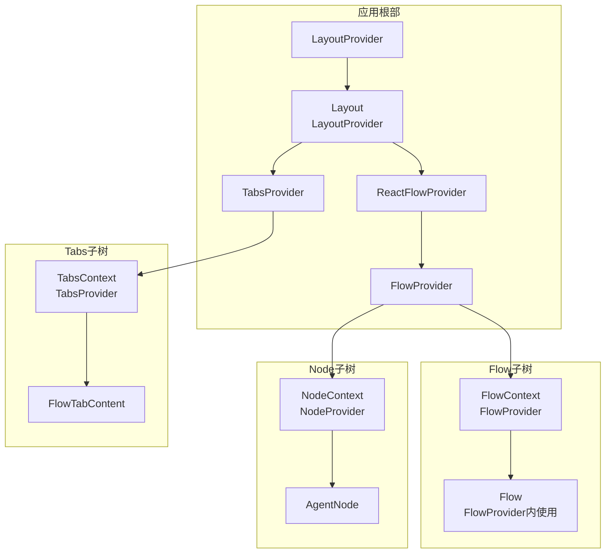
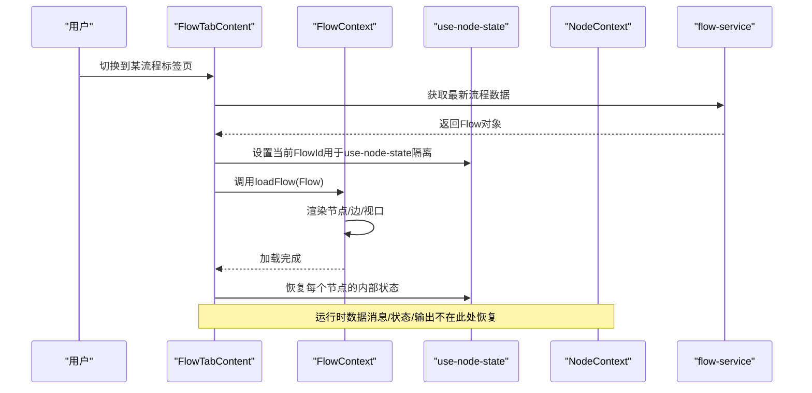
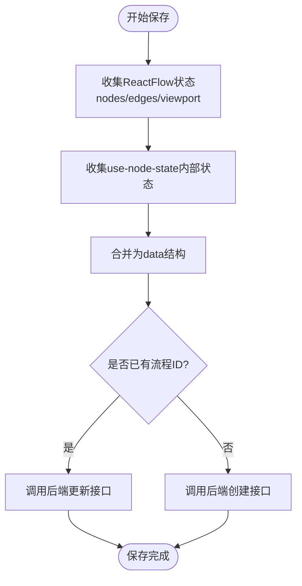
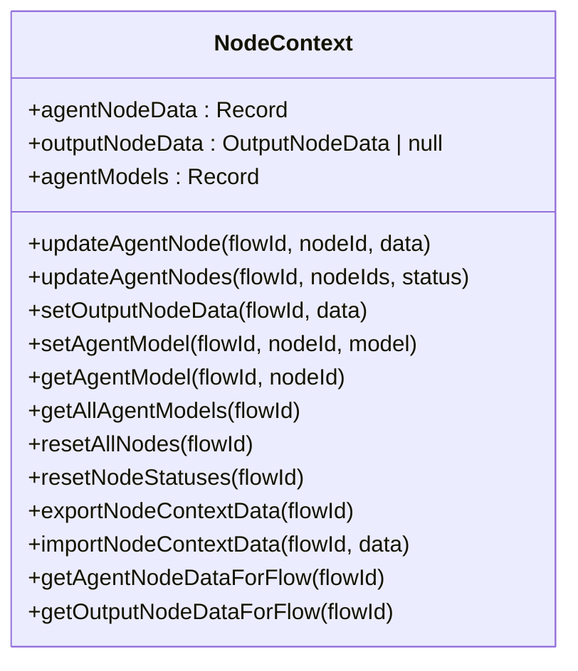
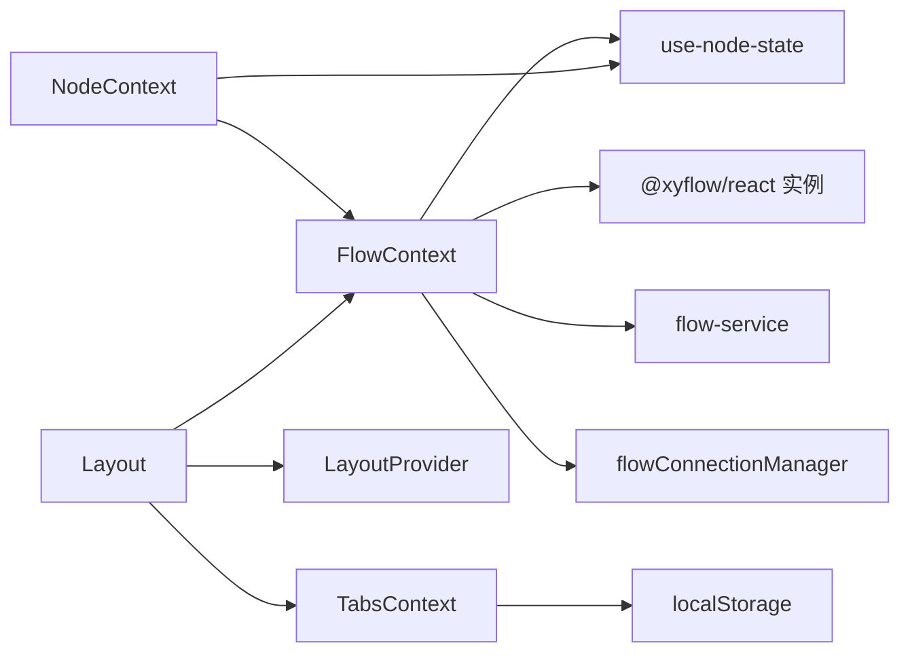

# Context提供者

<cite>
**本文引用的文件**
- [flow-context.tsx](file://app/frontend/src/contexts/flow-context.tsx)
- [layout-context.tsx](file://app/frontend/src/contexts/layout-context.tsx)
- [node-context.tsx](file://app/frontend/src/contexts/node-context.tsx)
- [tabs-context.tsx](file://app/frontend/src/contexts/tabs-context.tsx)
- [use-node-state.ts](file://app/frontend/src/hooks/use-node-state.ts)
- [use-flow-connection.ts](file://app/frontend/src/hooks/use-flow-connection.ts)
- [flow-service.ts](file://app/frontend/src/services/flow-service.ts)
- [Layout.tsx](file://app/frontend/src/components/Layout.tsx)
- [Flow.tsx](file://app/frontend/src/components/Flow.tsx)
- [flow-tab-content.tsx](file://app/frontend/src/components/tabs/flow-tab-content.tsx)
- [agent-node.tsx](file://app/frontend/src/nodes/components/agent-node.tsx)
- [use-enhanced-flow-actions.ts](file://app/frontend/src/hooks/use-enhanced-flow-actions.ts)
</cite>

## 目录
1. [简介](#简介)
2. [项目结构](#项目结构)
3. [核心组件](#核心组件)
4. [架构总览](#架构总览)
5. [详细组件分析](#详细组件分析)
6. [依赖分析](#依赖分析)
7. [性能考量](#性能考量)
8. [故障排查指南](#故障排查指南)
9. [结论](#结论)
10. [附录](#附录)

## 简介
本文件系统性阐述前端Context提供者的设计与实现，重点覆盖以下四个Context：FlowContext（流程上下文）、LayoutContext（布局上下文）、NodeContext（节点上下文）与TabsContext（标签页上下文）。内容包括：
- 各Context的作用域、状态结构与生命周期管理
- 提供者的初始化过程、状态传递机制与持久化策略
- Context之间的依赖关系、状态隔离与共享策略
- 组合使用、嵌套结构与最佳实践
- 错误边界处理、状态重置与清理机制
- 与React.memo和useMemo的配合使用建议

## 项目结构
Context提供者位于前端src/contexts目录，围绕Flow、Layout、Node、Tabs四大维度构建状态域，并通过Provider在应用根部进行装配。

图表来源
- [Layout.tsx:187-201](file://app/frontend/src/components/Layout.tsx#L187-L201)
- [flow-context.tsx:35-358](file://app/frontend/src/contexts/flow-context.tsx#L35-L358)
- [tabs-context.tsx:59-271](file://app/frontend/src/contexts/tabs-context.tsx#L59-L271)
- [layout-context.tsx:27-68](file://app/frontend/src/contexts/layout-context.tsx#L27-L68)
- [node-context.tsx:90-438](file://app/frontend/src/contexts/node-context.tsx#L90-L438)

章节来源
- [Layout.tsx:187-201](file://app/frontend/src/components/Layout.tsx#L187-L201)

## 核心组件
- FlowContext：负责流程的创建、保存、加载、节点添加等；维护当前流程ID、名称、未保存标记以及ReactFlow实例。
- LayoutContext：负责底部面板展开/折叠、当前底部标签页等UI布局状态。
- NodeContext：负责节点运行时状态（如Agent节点的状态、消息历史、输出数据）与模型选择等；支持按Flow隔离。
- TabsContext：负责标签页集合、活动标签页、打开/关闭/重排/标题更新等；支持localStorage持久化。

章节来源
- [flow-context.tsx:10-358](file://app/frontend/src/contexts/flow-context.tsx#L10-L358)
- [layout-context.tsx:4-68](file://app/frontend/src/contexts/layout-context.tsx#L4-L68)
- [node-context.tsx:63-438](file://app/frontend/src/contexts/node-context.tsx#L63-L438)
- [tabs-context.tsx:27-271](file://app/frontend/src/contexts/tabs-context.tsx#L27-L271)

## 架构总览
FlowContext与NodeContext紧密协作：FlowContext负责持久化与加载流程（含ReactFlow节点/边/视口），NodeContext负责运行时状态（消息、状态、输出数据）。FlowContext在保存/加载时通过增强动作将NodeContext的数据合并到后端存储中，确保配置态与运行态分离且可恢复。

图表来源
- [flow-tab-content.tsx:55-75](file://app/frontend/src/components/tabs/flow-tab-content.tsx#L55-L75)
- [flow-context.tsx:134-188](file://app/frontend/src/contexts/flow-context.tsx#L134-L188)
- [use-node-state.ts:147-175](file://app/frontend/src/hooks/use-node-state.ts#L147-L175)
- [flow-service.ts:37-44](file://app/frontend/src/services/flow-service.ts#L37-L44)

## 详细组件分析

### FlowContext 设计与实现
- 作用域与职责
  - 管理当前流程的标识、名称与未保存标记
  - 与ReactFlow实例交互，提供节点/边/视口操作
  - 提供保存/加载/新建流程能力，并与NodeContext数据协同持久化
- 状态结构
  - currentFlowId: number | null
  - currentFlowName: string
  - isUnsaved: boolean
  - reactFlowInstance: ReactFlowInstance
- 生命周期管理
  - 初始化：从ReactFlowProvider获取实例
  - 新建流程：清空画布、重置状态、清除节点内部状态
  - 加载流程：设置FlowId以隔离use-node-state；渲染节点/边/视口；恢复节点内部状态；检查连接状态
  - 保存流程：收集ReactFlow状态与use-node-state内部状态；若存在nodeContextData则由增强动作补充
- 关键流程图（保存流程）

图表来源
- [flow-context.tsx:74-131](file://app/frontend/src/contexts/flow-context.tsx#L74-L131)
- [use-node-state.ts:165-171](file://app/frontend/src/hooks/use-node-state.ts#L165-L171)

章节来源
- [flow-context.tsx:35-358](file://app/frontend/src/contexts/flow-context.tsx#L35-L358)
- [use-enhanced-flow-actions.ts:20-72](file://app/frontend/src/hooks/use-enhanced-flow-actions.ts#L20-L72)

### LayoutContext 设计与实现
- 作用域与职责
  - 管理底部面板的展开/折叠与当前底部标签页
  - 通过SidebarStorageService持久化底部面板状态
- 状态结构
  - isBottomCollapsed: boolean
  - currentBottomTab: string
- 生命周期管理
  - 初始化：从存储服务读取底部面板状态
  - 变更：状态变化时写入存储
- 使用场景
  - 布局组件根据底部面板状态动态计算主内容区域尺寸

章节来源
- [layout-context.tsx:27-68](file://app/frontend/src/contexts/layout-context.tsx#L27-L68)

### NodeContext 设计与实现
- 作用域与职责
  - 管理节点运行时状态（Agent节点状态、消息历史、输出数据）
  - 支持按Flow隔离，提供导出/导入运行时数据的能力
- 状态结构
  - agentNodeData: 记录每个节点的运行时状态（含消息历史）
  - outputNodeData: 记录输出节点的最终结果
  - agentModels: 记录各节点使用的语言模型（可为空表示使用全局自动）
- 流程与隔离策略
  - 复合键策略：使用“flowId:nodeId”作为唯一键，实现跨Flow隔离
  - 导出/导入：仅导出当前Flow的数据，避免跨Flow污染
  - 重置策略：支持重置所有节点或仅重置状态（保留消息/回测结果等）
- 类图（简化）

图表来源
- [node-context.tsx:63-421](file://app/frontend/src/contexts/node-context.tsx#L63-L421)

章节来源
- [node-context.tsx:90-438](file://app/frontend/src/contexts/node-context.tsx#L90-L438)

### TabsContext 设计与实现
- 作用域与职责
  - 管理标签页集合、活动标签页、标签页标题与元数据
  - 通过localStorage持久化标签页列表与当前活动标签页
- 状态结构
  - tabs: Tab[]
  - activeTabId: string | null
- 生命周期管理
  - 初始化：从localStorage加载标签页与活动标签页
  - 变更：每次tabs或activeTabId变化时同步写入localStorage
- 标识策略
  - flow标签：使用“flow-{flowId}”
  - settings标签：固定“settings”
  - 其他类型：基于时间戳生成唯一ID

章节来源
- [tabs-context.tsx:59-271](file://app/frontend/src/contexts/tabs-context.tsx#L59-L271)

### Context之间的依赖关系与组合
- Provider嵌套顺序
  - LayoutProvider包裹TabsProvider，再包裹FlowProvider，最后包裹ReactFlowProvider
  - NodeContext独立于Provider树之外，但被FlowContext与NodeContext共同使用
- 依赖链
  - FlowContext依赖ReactFlow实例与flow-service
  - NodeContext依赖FlowId进行状态隔离
  - FlowTabContent在切换标签时调用FlowContext与NodeContext的增强动作
- 组合使用示例
  - 在Layout中同时消费LayoutContext与TabsContext，控制侧边栏与底部面板
  - 在Flow中消费FlowContext，结合FlowHistory与自动保存

章节来源
- [Layout.tsx:187-201](file://app/frontend/src/components/Layout.tsx#L187-L201)
- [flow-tab-content.tsx:17-53](file://app/frontend/src/components/tabs/flow-tab-content.tsx#L17-L53)

### 状态传递机制与持久化策略
- FlowContext
  - 保存：收集ReactFlow状态与use-node-state内部状态；通过增强动作附加NodeContext运行时数据
  - 加载：先设置FlowId隔离use-node-state，再渲染ReactFlow状态；恢复节点内部状态
- NodeContext
  - 导出：仅导出当前Flow的数据；导入：按Flow键写入
  - 隔离：复合键“flowId:nodeId”，支持按Flow清理与重置
- TabsContext
  - 持久化：序列化tabs与activeTabId，避免存储大块content
- FlowTabContent
  - 切换标签时拉取最新Flow数据，恢复配置态（内部状态），不恢复运行态（消息/状态/输出）

章节来源
- [use-enhanced-flow-actions.ts:20-106](file://app/frontend/src/hooks/use-enhanced-flow-actions.ts#L20-L106)
- [flow-tab-content.tsx:55-75](file://app/frontend/src/components/tabs/flow-tab-content.tsx#L55-L75)
- [node-context.tsx:307-368](file://app/frontend/src/contexts/node-context.tsx#L307-L368)

### 生命周期与错误处理
- FlowContext
  - 新建流程：先设置FlowId为null，再清空节点与边，最后重置视口
  - 加载流程：设置FlowId后渲染节点/边/视口；若无viewport则自动适配；延迟恢复连接状态
  - 保存/加载异常：捕获错误并记录日志
- NodeContext
  - 重置：支持按Flow重置节点状态，保留消息与回测结果
  - 导出/导入：过滤无效数据，避免污染
- TabsContext
  - 初始化：从localStorage加载失败时回退为空状态
  - 关闭标签：自动调整活动标签页
- FlowConnection（辅助）
  - 连接状态机：idle/connecting/connected/error/completed
  - 停止执行：调用AbortController并重置节点状态

章节来源
- [flow-context.tsx:190-214](file://app/frontend/src/contexts/flow-context.tsx#L190-L214)
- [flow-context.tsx:134-188](file://app/frontend/src/contexts/flow-context.tsx#L134-L188)
- [node-context.tsx:238-305](file://app/frontend/src/contexts/node-context.tsx#L238-L305)
- [tabs-context.tsx:114-140](file://app/frontend/src/contexts/tabs-context.tsx#L114-L140)
- [use-flow-connection.ts:186-232](file://app/frontend/src/hooks/use-flow-connection.ts#L186-L232)

### 与React.memo和useMemo的配合使用
- FlowContext
  - 将Provider值对象稳定化，避免因函数重新创建导致子组件不必要重渲染
  - 对回调函数使用useCallback，减少子组件订阅次数
- NodeContext
  - 将导出/导入函数与查询函数稳定化，避免子组件重复渲染
  - 对复合键生成与过滤逻辑使用useCallback
- TabsContext
  - 对生成ID、判断是否已打开、查找标签等函数使用useCallback
- Flow组件
  - 对变更处理器与自动保存函数使用useCallback，避免频繁触发保存
  - 对历史快照与撤销/重做逻辑使用useCallback

章节来源
- [flow-context.tsx:342-351](file://app/frontend/src/contexts/flow-context.tsx#L342-L351)
- [node-context.tsx:98-182](file://app/frontend/src/contexts/node-context.tsx#L98-L182)
- [tabs-context.tsx:154-177](file://app/frontend/src/contexts/tabs-context.tsx#L154-L177)
- [Flow.tsx:91-143](file://app/frontend/src/components/Flow.tsx#L91-L143)

## 依赖分析
- FlowContext依赖
  - ReactFlow实例：用于节点/边/视口管理
  - flow-service：用于后端持久化
  - use-node-state：用于节点内部状态持久化
  - use-flow-connection：用于连接状态恢复
- NodeContext依赖
  - FlowId：用于状态隔离
  - use-node-state：用于节点内部状态持久化
- TabsContext依赖
  - localStorage：用于标签页持久化
  - TabService：用于创建标签页内容（在Layout中使用）

图表来源
- [flow-context.tsx:36-358](file://app/frontend/src/contexts/flow-context.tsx#L36-L358)
- [node-context.tsx:90-438](file://app/frontend/src/contexts/node-context.tsx#L90-L438)
- [tabs-context.tsx:59-271](file://app/frontend/src/contexts/tabs-context.tsx#L59-L271)
- [Layout.tsx:187-201](file://app/frontend/src/components/Layout.tsx#L187-L201)

章节来源
- [flow-service.ts:27-108](file://app/frontend/src/services/flow-service.ts#L27-L108)
- [use-node-state.ts:134-135](file://app/frontend/src/hooks/use-node-state.ts#L134-L135)
- [use-flow-connection.ts:73-73](file://app/frontend/src/hooks/use-flow-connection.ts#L73-L73)

## 性能考量
- 状态隔离与分层
  - 使用复合键实现Flow级隔离，避免跨Flow状态污染
  - 区分配置态（use-node-state内部状态）与运行态（NodeContext），仅在需要时恢复运行态
- 函数稳定性
  - 所有Context暴露的函数均使用useCallback稳定化，减少子组件重渲染
- 异步与延迟
  - 加载流程后延迟恢复连接状态，等待组件挂载完成
  - 自动保存采用防抖策略，降低频繁IO
- 数据持久化
  - TabsContext仅持久化必要字段，避免存储大块content
  - FlowContext保存时临时替换节点数据，完成后恢复，避免污染UI状态

## 故障排查指南
- 无法保存流程
  - 检查FlowContext保存流程的异常分支，确认ReactFlow状态收集与后端请求
  - 确认增强动作是否正确附加NodeContext运行时数据
- 加载流程后状态丢失
  - 确认FlowTabContent是否仅恢复配置态（内部状态），不恢复运行态
  - 检查FlowContext加载流程时是否先设置FlowId
- 底部面板状态不同步
  - 检查LayoutContext是否正确写入localStorage
  - 确认LayoutProvider是否在应用根部正确装配
- 标签页无法恢复
  - 检查localStorage键名与解析逻辑
  - 确认TabsProvider初始化时是否正确读取并设置状态
- 运行中状态未清理
  - 使用NodeContext的重置函数或FlowConnection停止执行，确保状态回到IDLE

章节来源
- [flow-context.tsx:134-188](file://app/frontend/src/contexts/flow-context.tsx#L134-L188)
- [flow-tab-content.tsx:55-75](file://app/frontend/src/components/tabs/flow-tab-content.tsx#L55-L75)
- [layout-context.tsx:34-36](file://app/frontend/src/contexts/layout-context.tsx#L34-L36)
- [tabs-context.tsx:95-112](file://app/frontend/src/contexts/tabs-context.tsx#L95-L112)
- [node-context.tsx:238-305](file://app/frontend/src/contexts/node-context.tsx#L238-L305)
- [use-flow-connection.ts:186-232](file://app/frontend/src/hooks/use-flow-connection.ts#L186-L232)

## 结论
该Context体系通过清晰的职责划分与严格的隔离策略，实现了配置态与运行态的解耦、Flow级状态隔离与高效持久化。FlowContext与NodeContext的协同确保了流程的可恢复性与运行时状态的可控性；LayoutContext与TabsContext提供了稳定的UI布局与标签页体验。通过useCallback稳定化与防抖策略，整体具备良好的性能表现与可维护性。

## 附录
- 最佳实践清单
  - 在切换标签或加载流程前，优先设置FlowId以隔离use-node-state
  - 仅在显式开始执行时恢复运行态（消息/状态/输出），否则保持配置态
  - 对所有Context暴露的函数使用useCallback稳定化
  - 使用增强动作保存/加载流程，确保配置态与运行态均被持久化/恢复
  - 对自动保存与历史快照使用防抖策略，避免频繁IO