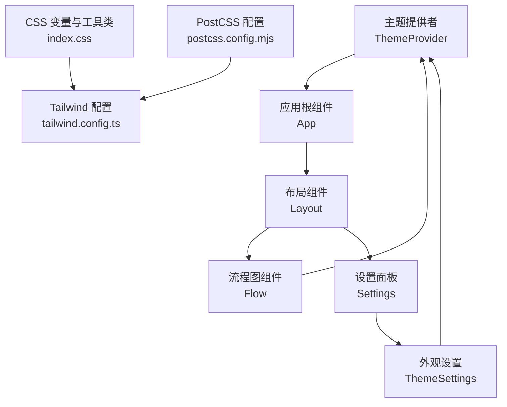
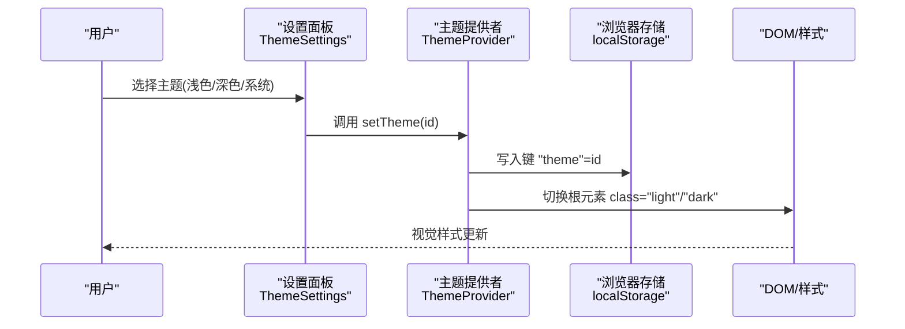
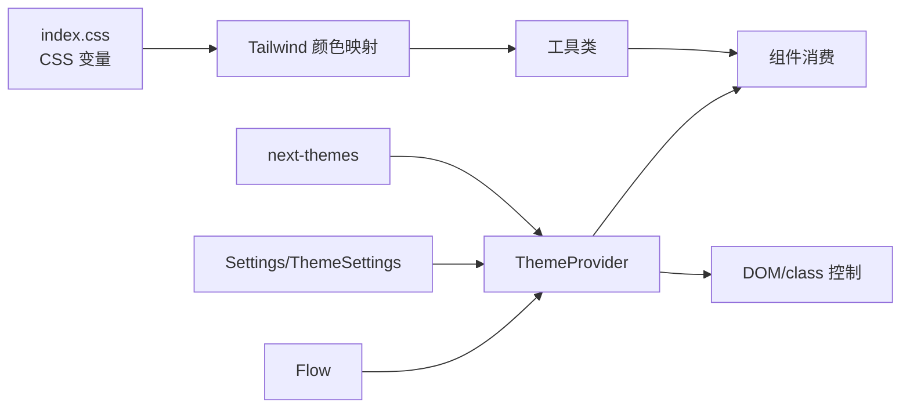

# 主题管理

<cite>
**本文引用的文件**
- [theme-provider.tsx](file://app/frontend/src/providers/theme-provider.tsx)
- [index.css](file://app/frontend/src/index.css)
- [tailwind.config.ts](file://app/frontend/tailwind.config.ts)
- [postcss.config.mjs](file://app/frontend/postcss.config.mjs)
- [appearance.tsx](file://app/frontend/src/components/settings/appearance.tsx)
- [settings.tsx](file://app/frontend/src/components/settings/settings.tsx)
- [Flow.tsx](file://app/frontend/src/components/Flow.tsx)
- [Layout.tsx](file://app/frontend/src/components/Layout.tsx)
- [main.tsx](file://app/frontend/src/main.tsx)
</cite>

## 目录
1. [简介](#简介)
2. [项目结构](#项目结构)
3. [核心组件](#核心组件)
4. [架构总览](#架构总览)
5. [详细组件分析](#详细组件分析)
6. [依赖关系分析](#依赖关系分析)
7. [性能考虑](#性能考虑)
8. [故障排查指南](#故障排查指南)
9. [结论](#结论)
10. [附录](#附录)

## 简介
本文件系统性阐述前端主题管理的设计与实现，涵盖主题提供者、颜色系统、样式切换机制、深浅色模式、CSS 变量管理、动态样式生成、主题状态持久化与系统主题跟随、Tailwind CSS 集成、组件主题适配与全局样式覆盖、主题扩展与品牌定制、动画过渡效果、性能优化与浏览器兼容性、以及与系统设置同步、无障碍与视觉辅助等。

## 项目结构
主题系统由三层构成：
- 提供层：通过主题提供者注入主题上下文，负责默认主题、系统跟随与存储键名配置。
- 样式层：基于 Tailwind 的 CSS 变量体系，使用 HSL 值在 :root 与 .dark 中定义明暗两套调色盘，并通过工具类映射到变量。
- 应用层：在组件中消费主题状态，按需切换网格背景、节点边框等视觉元素；设置面板提供主题选择入口。

图表来源
- [theme-provider.tsx:1-19](file://app/frontend/src/providers/theme-provider.tsx#L1-L19)
- [main.tsx:1-19](file://app/frontend/src/main.tsx#L1-L19)
- [Layout.tsx:1-201](file://app/frontend/src/components/Layout.tsx#L1-L201)
- [Flow.tsx:1-320](file://app/frontend/src/components/Flow.tsx#L1-L320)
- [settings.tsx:1-96](file://app/frontend/src/components/settings/settings.tsx#L1-L96)
- [appearance.tsx:1-81](file://app/frontend/src/components/settings/appearance.tsx#L1-L81)
- [index.css:1-356](file://app/frontend/src/index.css#L1-L356)
- [tailwind.config.ts:1-144](file://app/frontend/tailwind.config.ts#L1-L144)
- [postcss.config.mjs:1-10](file://app/frontend/postcss.config.mjs#L1-L10)

章节来源
- [theme-provider.tsx:1-19](file://app/frontend/src/providers/theme-provider.tsx#L1-L19)
- [index.css:1-356](file://app/frontend/src/index.css#L1-L356)
- [tailwind.config.ts:1-144](file://app/frontend/tailwind.config.ts#L1-L144)
- [postcss.config.mjs:1-10](file://app/frontend/postcss.config.mjs#L1-L10)
- [main.tsx:1-19](file://app/frontend/src/main.tsx#L1-L19)

## 核心组件
- 主题提供者：以 class 属性方式控制明暗主题，启用系统跟随，默认系统主题，存储键名为 theme。
- CSS 变量与工具类：在 :root 与 .dark 中定义完整的明暗两套颜色变量，提供 hover/active 状态变量与 ramp 灰阶、图表色板、侧边栏配色等；通过 @layer utilities 定义映射工具类。
- Tailwind 配置：将颜色映射到 CSS 变量，启用自定义圆角半径、字体尺寸、动画与排版插件；darkMode 使用 class 模式。
- 设置面板：提供浅色/深色/系统三种主题选项，支持即时切换并持久化到本地存储。
- 流程图组件：根据 resolvedTheme 切换网格颜色与 ReactFlow 的 colorMode，确保节点与网格风格一致。

章节来源
- [theme-provider.tsx:1-19](file://app/frontend/src/providers/theme-provider.tsx#L1-L19)
- [index.css:1-356](file://app/frontend/src/index.css#L1-L356)
- [tailwind.config.ts:1-144](file://app/frontend/tailwind.config.ts#L1-L144)
- [appearance.tsx:1-81](file://app/frontend/src/components/settings/appearance.tsx#L1-L81)
- [Flow.tsx:1-320](file://app/frontend/src/components/Flow.tsx#L1-L320)

## 架构总览
主题系统采用“提供者 + CSS 变量 + Tailwind 映射”的分层架构，确保：
- 明确的主题状态来源（next-themes）与持久化策略（localStorage 键为 theme）。
- 统一的颜色语义（HSL 变量）与工具类映射，避免硬编码颜色。
- 组件级按需消费主题状态，保证一致性与可维护性。

图表来源
- [appearance.tsx:1-81](file://app/frontend/src/components/settings/appearance.tsx#L1-L81)
- [theme-provider.tsx:1-19](file://app/frontend/src/providers/theme-provider.tsx#L1-L19)

## 详细组件分析

### 主题提供者与持久化
- 使用 next-themes 的 ThemeProvider，属性为 class，启用系统跟随，defaultTheme 为 system，storageKey 为 theme。
- 该设计使主题状态与系统偏好保持同步，同时允许用户覆盖为固定浅色或深色。

章节来源
- [theme-provider.tsx:1-19](file://app/frontend/src/providers/theme-provider.tsx#L1-L19)

### CSS 变量与颜色系统
- 在 :root 中定义明色变量集，包括背景、前景、卡片、弹出层、主/次/强调/破坏性、边框、输入、环形光晕、节点边框/悬停/选中、状态边框、面板背景、节点背景、图表色板、侧边栏配色等。
- 在 .dark 中定义暗色变量集，覆盖上述变量，形成完整明暗两套配色。
- 提供 hover/active 状态变量，统一悬停与选中态的透明度与色调。
- 提供 ramp 灰阶变量，便于渐变与层级区分。
- 通过 @layer utilities 将常用颜色映射为工具类，如 bg-node、border-status、hover-item、active-item 等，减少重复定义。

章节来源
- [index.css:1-356](file://app/frontend/src/index.css#L1-L356)

### Tailwind 集成与工具类映射
- Tailwind 配置启用 darkMode: ['class', 'class']，与 CSS 类名一致。
- 在 theme.extend.colors 中将 Tailwind 颜色映射到 CSS 变量，如 background、foreground、card、popover、primary、secondary、muted、accent、destructive、panel、ramp-grey、border、input、ring、node、chart、sidebar 等。
- 自定义圆角半径使用 var(--radius)，字体大小提供 title/subtitle 等语义化别名。
- 注册 tailwindcss-animate 与 @tailwindcss/typography 插件，增强动画与排版能力。

章节来源
- [tailwind.config.ts:1-144](file://app/frontend/tailwind.config.ts#L1-L144)

### 动态样式生成与组件适配
- 在 Flow 组件中使用 useTheme 获取 theme 与 resolvedTheme，根据 resolvedTheme 切换 ReactFlow 的 colorMode，并依据 resolvedTheme 选择网格颜色，确保视觉一致性。
- 在 Layout 组件中，容器背景使用 bg-background，文本使用 text-foreground，保证整体基调随主题变化。

章节来源
- [Flow.tsx:1-320](file://app/frontend/src/components/Flow.tsx#L1-L320)
- [Layout.tsx:1-201](file://app/frontend/src/components/Layout.tsx#L1-L201)

### 设置面板与用户偏好
- ThemeSettings 提供三档主题选择：light、dark、system，并展示简要描述与图标。
- 通过 setTheme 更新主题，自动写入 localStorage 的 theme 键，实现持久化。
- Settings 将 ThemeSettings 作为导航项之一，统一管理显示偏好。

章节来源
- [appearance.tsx:1-81](file://app/frontend/src/components/settings/appearance.tsx#L1-L81)
- [settings.tsx:1-96](file://app/frontend/src/components/settings/settings.tsx#L1-L96)

### 样式初始化与构建链路
- main.tsx 中引入 ThemeProvider 与全局样式 index.css，确保应用启动即具备主题上下文与变量基础。
- PostCSS 配置加载 tailwindcss 与 autoprefixer，完成从 CSS 变量到实际样式的编译。

章节来源
- [main.tsx:1-19](file://app/frontend/src/main.tsx#L1-L19)
- [postcss.config.mjs:1-10](file://app/frontend/postcss.config.mjs#L1-L10)

## 依赖关系分析
- 主题提供者依赖 next-themes，负责主题状态与存储。
- 样式层依赖 Tailwind 与 PostCSS，Tailwind 将 CSS 变量映射为实用类。
- 组件层通过 next-themes hooks 消费主题状态，按需调整内部视觉元素。
- 设置面板与流程图组件分别在 UI 与业务层使用主题状态，形成“配置—渲染”闭环。

图表来源
- [theme-provider.tsx:1-19](file://app/frontend/src/providers/theme-provider.tsx#L1-L19)
- [index.css:1-356](file://app/frontend/src/index.css#L1-L356)
- [tailwind.config.ts:1-144](file://app/frontend/tailwind.config.ts#L1-L144)
- [appearance.tsx:1-81](file://app/frontend/src/components/settings/appearance.tsx#L1-L81)
- [Flow.tsx:1-320](file://app/frontend/src/components/Flow.tsx#L1-L320)

## 性能考虑
- CSS 变量与 Tailwind 工具类的组合避免了运行时计算，样式切换仅通过根元素 class 切换，开销极低。
- 动画与过渡（如 accordion、骨架屏、渐变边框）使用纯 CSS 实现，尽量减少 JavaScript 干预。
- 建议：
  - 避免在组件内频繁重算颜色值，优先使用工具类或 CSS 变量。
  - 对复杂动画场景，控制帧率与缓动函数，避免阻塞主线程。
  - 合理拆分样式模块，减少不必要的重绘与回流。

## 故障排查指南
- 主题未生效
  - 检查根元素是否正确添加 class="light"/"dark"。
  - 确认 localStorage 中键 "theme" 是否存在且值为 light/dark/system。
- 明暗主题不一致
  - 确保 Flow 组件使用 resolvedTheme 切换 colorMode 与网格颜色。
  - 检查 index.css 中 :root 与 .dark 的变量是否完整覆盖。
- Tailwind 类无效
  - 确认 tailwind.config.ts 的 content 路径包含当前组件目录。
  - 检查 postcss.config.mjs 是否正确加载 tailwindcss 与 autoprefixer。
- 设置面板无法切换
  - 确认 ThemeSettings 正确导入 useTheme 并调用 setTheme。
  - 检查 ThemeProvider 的 storageKey 是否为 "theme"。

章节来源
- [theme-provider.tsx:1-19](file://app/frontend/src/providers/theme-provider.tsx#L1-L19)
- [Flow.tsx:1-320](file://app/frontend/src/components/Flow.tsx#L1-L320)
- [appearance.tsx:1-81](file://app/frontend/src/components/settings/appearance.tsx#L1-L81)
- [tailwind.config.ts:1-144](file://app/frontend/tailwind.config.ts#L1-L144)
- [postcss.config.mjs:1-10](file://app/frontend/postcss.config.mjs#L1-L10)

## 结论
该主题系统以 next-themes 为核心，结合 CSS 变量与 Tailwind 工具类，实现了高内聚、低耦合的主题管理方案。通过系统主题跟随、持久化存储与组件级适配，既满足用户个性化需求，又保证了跨组件的一致性与可维护性。配合动画与无障碍设计，可在不同设备与环境下提供稳定、舒适的视觉体验。

## 附录

### 深色与浅色模式实现要点
- 使用 .dark 选择器与 :root 双轨变量，确保明暗两套配色完整覆盖。
- 通过 resolvedTheme 判断 colorMode，保证流程图网格与节点风格一致。
- 使用 hover/active 状态变量统一交互反馈。

章节来源
- [index.css:1-356](file://app/frontend/src/index.css#L1-L356)
- [Flow.tsx:1-320](file://app/frontend/src/components/Flow.tsx#L1-L320)

### CSS 变量管理与动态样式生成
- 所有颜色以 HSL 变量形式集中定义，便于主题扩展与品牌定制。
- Tailwind colors 映射到 CSS 变量，组件通过工具类直接消费，无需硬编码颜色值。

章节来源
- [index.css:1-356](file://app/frontend/src/index.css#L1-L356)
- [tailwind.config.ts:1-144](file://app/frontend/tailwind.config.ts#L1-L144)

### Tailwind 集成与全局样式覆盖
- darkMode: ['class', 'class'] 与根元素 class 保持一致。
- 全局样式通过 @layer base 与 @layer utilities 组织，确保覆盖顺序与可维护性。

章节来源
- [tailwind.config.ts:1-144](file://app/frontend/tailwind.config.ts#L1-L144)
- [index.css:1-356](file://app/frontend/src/index.css#L1-L356)

### 主题扩展方法与品牌定制
- 新增颜色变量：在 :root 与 .dark 中补充变量，并在 tailwind.config.ts 的 extend.colors 中注册。
- 新增工具类：在 @layer utilities 中添加映射，便于组件直接使用。
- 新增 ramp 灰阶：在 ramp-grey 变量中追加数值段，保持命名规范。

章节来源
- [index.css:1-356](file://app/frontend/src/index.css#L1-L356)
- [tailwind.config.ts:1-144](file://app/frontend/tailwind.config.ts#L1-L144)

### 动画过渡效果与性能优化
- 使用纯 CSS 动画（如 gradientFlow、accordion-*）减少 JS 干预。
- 对复杂场景建议限制动画数量与频率，避免影响滚动与交互流畅度。

章节来源
- [index.css:280-356](file://app/frontend/src/index.css#L280-L356)

### 浏览器兼容性与无障碍
- PostCSS 自动前缀，降低兼容性问题。
- 无障碍方面：确保明暗对比度符合 WCAG 基本要求；为交互元素提供清晰的焦点指示与高对比度状态。

章节来源
- [postcss.config.mjs:1-10](file://app/frontend/postcss.config.mjs#L1-L10)
- [index.css:1-356](file://app/frontend/src/index.css#L1-L356)