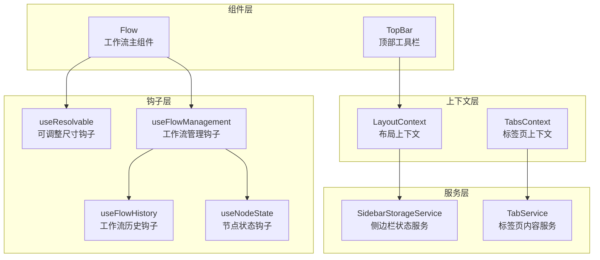
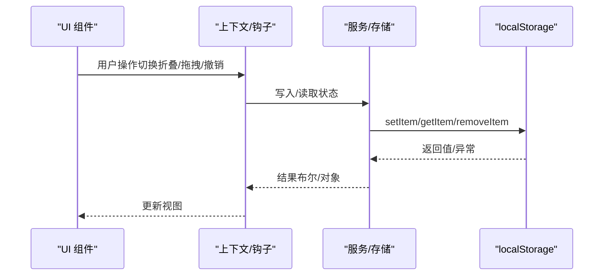
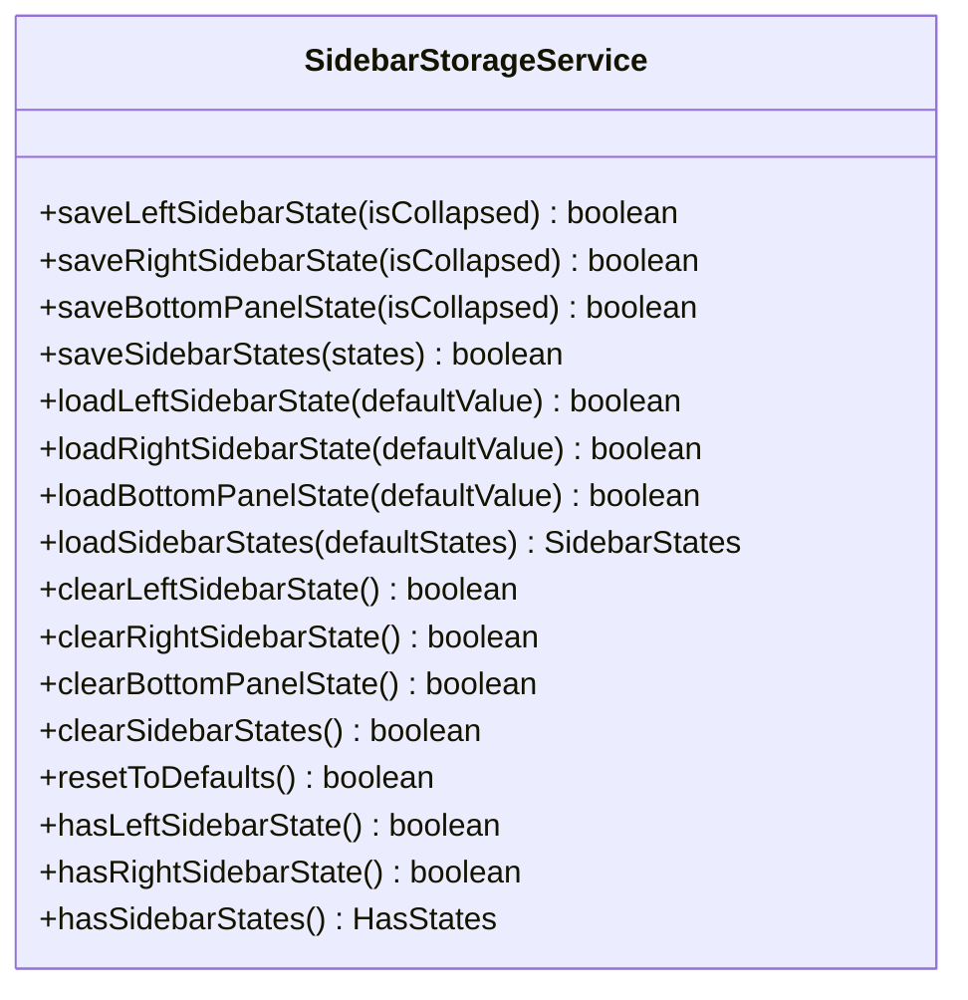
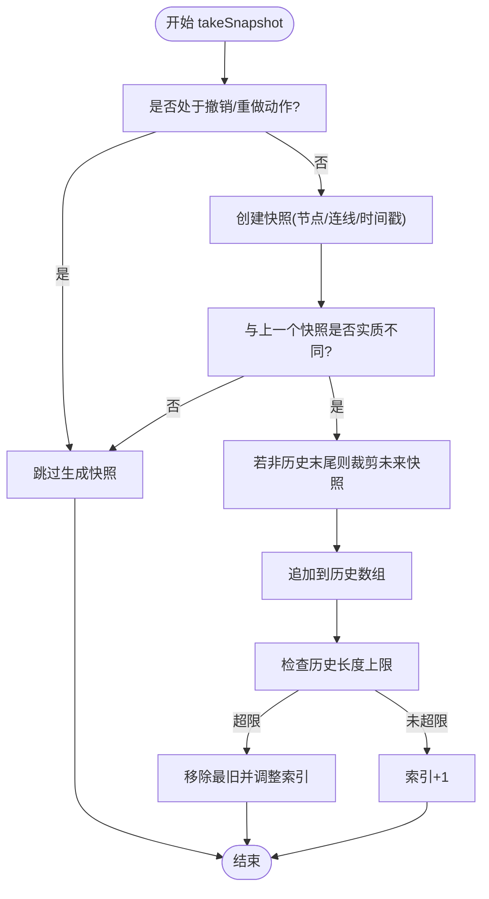
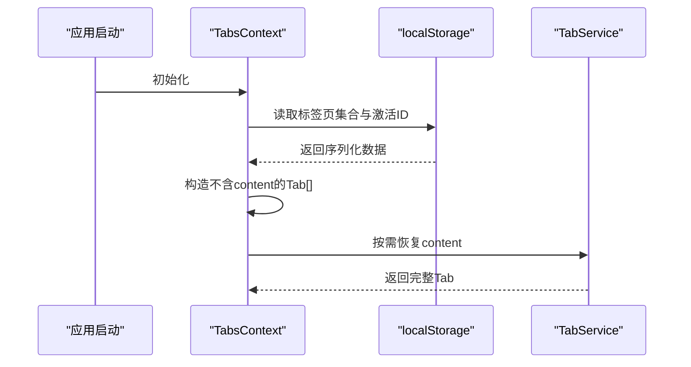
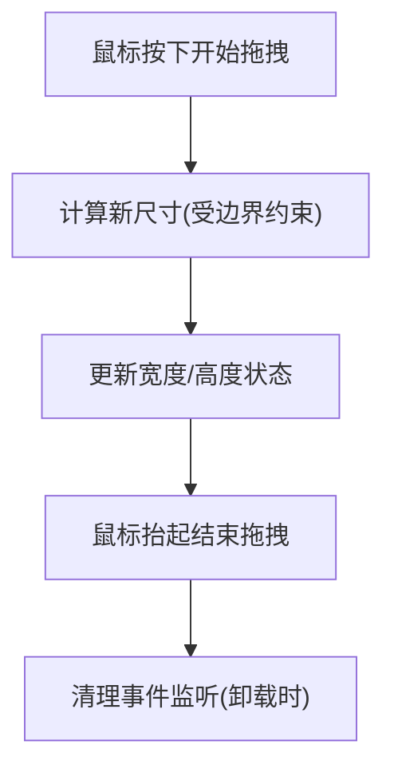
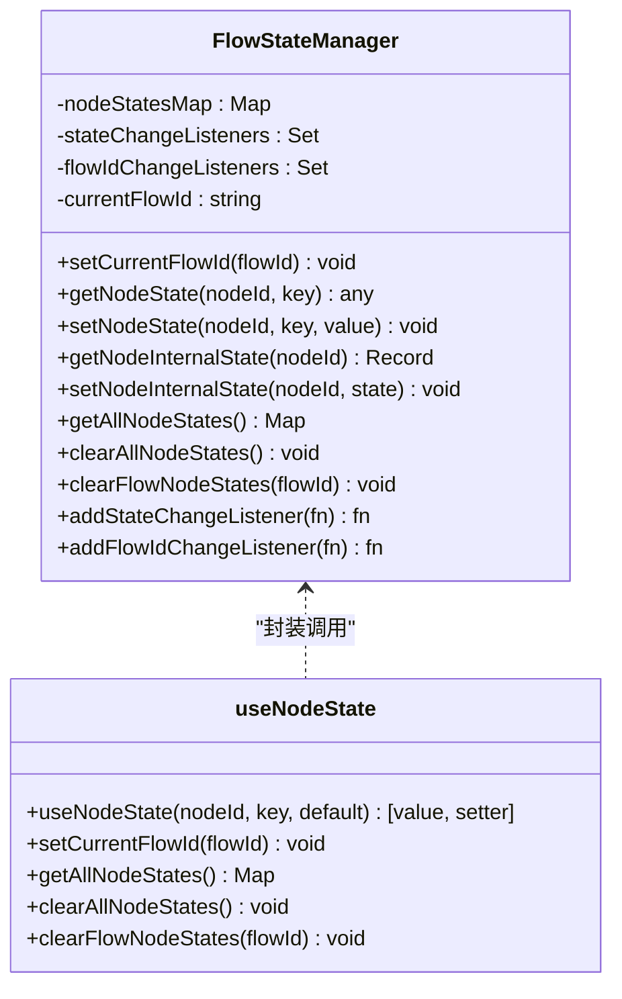
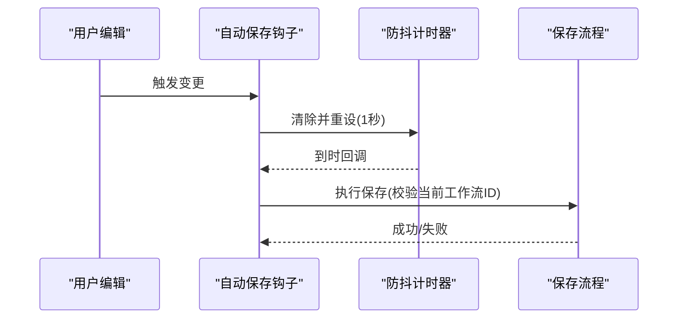
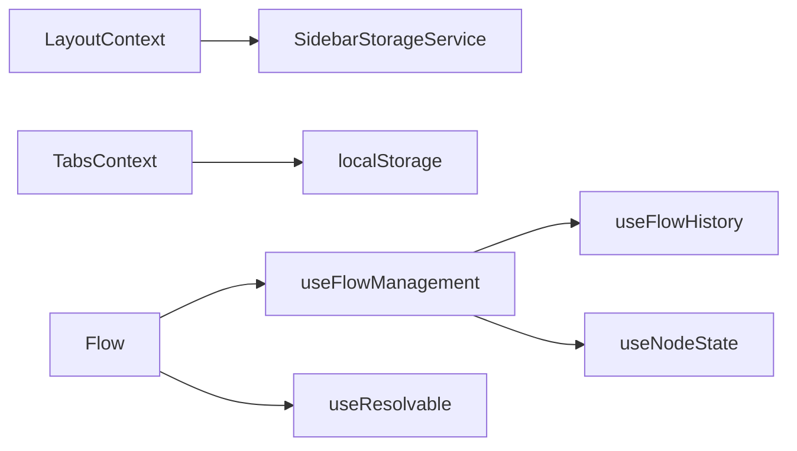

# 状态持久化

<cite>
**本文引用的文件**
- [sidebar-storage.ts](file://app/frontend/src/services/sidebar-storage.ts)
- [layout-context.tsx](file://app/frontend/src/contexts/layout-context.tsx)
- [top-bar.tsx](file://app/frontend/src/components/layout/top-bar.tsx)
- [use-flow-history.ts](file://app/frontend/src/hooks/use-flow-history.ts)
- [use-resizable.ts](file://app/frontend/src/hooks/use-resizable.ts)
- [tabs-context.tsx](file://app/frontend/src/contexts/tabs-context.tsx)
- [tab-service.ts](file://app/frontend/src/services/tab-service.ts)
- [use-flow-management.ts](file://app/frontend/src/hooks/use-flow-management.ts)
- [use-node-state.ts](file://app/frontend/src/hooks/use-node-state.ts)
- [Flow.tsx](file://app/frontend/src/components/Flow.tsx)
</cite>

## 目录
1. [简介](#简介)
2. [项目结构](#项目结构)
3. [核心组件](#核心组件)
4. [架构总览](#架构总览)
5. [详细组件分析](#详细组件分析)
6. [依赖关系分析](#依赖关系分析)
7. [性能考量](#性能考量)
8. [故障排查指南](#故障排查指南)
9. [结论](#结论)
10. [附录](#附录)

## 简介
本文件系统性阐述前端状态持久化机制，覆盖以下主题：
- 侧边栏状态存储（左侧/右侧边栏折叠状态、底部面板折叠状态）
- 工作流历史记录（节点/连线快照、撤销/重做、去重与容量限制）
- 标签页状态持久化（打开的标签页集合与当前激活标签）
- 窗口尺寸与布局持久化（拖拽调整后的宽度/高度）
- 浏览器存储策略（localStorage/sessionStorage 的选择与边界）
- 数据序列化与反序列化流程
- 状态恢复算法、版本兼容与迁移策略
- 状态同步机制、冲突解决与并发控制
- 压缩、增量更新与性能优化
- 备份、恢复与清理机制
- 存储限制、隐私模式与跨标签页同步处理

## 项目结构
围绕状态持久化的关键模块如下：
- 服务层：侧边栏状态服务
- 上下文层：布局上下文、标签页上下文
- 钩子层：工作流历史、可调整尺寸、节点状态管理、自动保存
- 组件层：顶部工具栏按钮、Flow 主体组件
- 类型与工具：序列化接口、Tab 内容服务

图表来源
- [sidebar-storage.ts:1-237](file://app/frontend/src/services/sidebar-storage.ts#L1-L237)
- [layout-context.tsx:1-68](file://app/frontend/src/contexts/layout-context.tsx#L1-L68)
- [tabs-context.tsx:1-271](file://app/frontend/src/contexts/tabs-context.tsx#L1-L271)
- [tab-service.ts:1-68](file://app/frontend/src/services/tab-service.ts#L1-L68)
- [use-flow-history.ts:1-171](file://app/frontend/src/hooks/use-flow-history.ts#L1-L171)
- [use-resizable.ts:1-93](file://app/frontend/src/hooks/use-resizable.ts#L1-L93)
- [use-flow-management.ts:1-336](file://app/frontend/src/hooks/use-flow-management.ts#L1-L336)
- [use-node-state.ts:1-268](file://app/frontend/src/hooks/use-node-state.ts#L1-L268)
- [Flow.tsx:57-89](file://app/frontend/src/components/Flow.tsx#L57-L89)

章节来源
- [sidebar-storage.ts:1-237](file://app/frontend/src/services/sidebar-storage.ts#L1-L237)
- [layout-context.tsx:1-68](file://app/frontend/src/contexts/layout-context.tsx#L1-L68)
- [tabs-context.tsx:1-271](file://app/frontend/src/contexts/tabs-context.tsx#L1-L271)
- [tab-service.ts:1-68](file://app/frontend/src/services/tab-service.ts#L1-L68)
- [use-flow-history.ts:1-171](file://app/frontend/src/hooks/use-flow-history.ts#L1-L171)
- [use-resizable.ts:1-93](file://app/frontend/src/hooks/use-resizable.ts#L1-L93)
- [use-flow-management.ts:1-336](file://app/frontend/src/hooks/use-flow-management.ts#L1-L336)
- [use-node-state.ts:1-268](file://app/frontend/src/hooks/use-node-state.ts#L1-L268)
- [Flow.tsx:57-89](file://app/frontend/src/components/Flow.tsx#L57-L89)

## 核心组件
- 侧边栏状态服务：提供左侧/右侧边栏与底部面板的保存、加载、清空、重置能力，并以布尔值形式通过 localStorage 持久化。
- 布局上下文：在挂载时从 localStorage 加载底部面板默认折叠状态，并在状态变化时写回。
- 工作流历史钩子：对节点与连线进行快照，支持撤销/重做、去重与容量限制。
- 标签页上下文：将标签页列表与当前激活标签序列化到 localStorage，延迟恢复内容。
- 可调整尺寸钩子：记录拖拽后的新尺寸并在卸载或清理时持久化。
- 节点状态钩子：提供节点内部状态的全局管理与流隔离，用于运行时状态的保存与恢复。
- 自动保存机制：在工作流变更后进行防抖式保存，避免频繁写入。

章节来源
- [sidebar-storage.ts:1-237](file://app/frontend/src/services/sidebar-storage.ts#L1-L237)
- [layout-context.tsx:1-68](file://app/frontend/src/contexts/layout-context.tsx#L1-L68)
- [use-flow-history.ts:1-171](file://app/frontend/src/hooks/use-flow-history.ts#L1-L171)
- [tabs-context.tsx:1-271](file://app/frontend/src/contexts/tabs-context.tsx#L1-L271)
- [use-resizable.ts:1-93](file://app/frontend/src/hooks/use-resizable.ts#L1-L93)
- [use-node-state.ts:1-268](file://app/frontend/src/hooks/use-node-state.ts#L1-L268)
- [Flow.tsx:57-89](file://app/frontend/src/components/Flow.tsx#L57-L89)

## 架构总览
状态持久化采用“服务/上下文/钩子/组件”分层设计：
- 服务层负责与浏览器存储交互（localStorage），提供统一的读写接口。
- 上下文层在应用启动时从存储加载初始状态，在状态变化时写回。
- 钩子层封装业务逻辑（历史、尺寸、节点状态），并与上下文/服务协作。
- 组件层通过上下文/钩子暴露 UI 行为（折叠/展开、拖拽、撤销/重做）。

图表来源
- [layout-context.tsx:27-67](file://app/frontend/src/contexts/layout-context.tsx#L27-L67)
- [sidebar-storage.ts:15-64](file://app/frontend/src/services/sidebar-storage.ts#L15-L64)
- [tabs-context.tsx:75-140](file://app/frontend/src/contexts/tabs-context.tsx#L75-L140)

## 详细组件分析

### 侧边栏状态持久化
- 存储键名：左侧、右侧边栏与底部面板分别对应独立键。
- 序列化：布尔值直接 JSON 序列化后存入 localStorage。
- 默认值：加载失败或缺失时返回默认值（底部面板默认折叠）。
- 清理与重置：支持单个/全部清除，以及重置为默认值。
- 使用场景：布局上下文在挂载时加载底部面板状态；顶部工具栏触发折叠/展开。

图表来源
- [sidebar-storage.ts:1-237](file://app/frontend/src/services/sidebar-storage.ts#L1-L237)

章节来源
- [sidebar-storage.ts:1-237](file://app/frontend/src/services/sidebar-storage.ts#L1-L237)
- [layout-context.tsx:27-67](file://app/frontend/src/contexts/layout-context.tsx#L27-L67)
- [top-bar.tsx:1-87](file://app/frontend/src/components/layout/top-bar.tsx#L1-L87)

### 工作流历史记录与快照
- 快照内容：节点（剔除 UI 专属字段）、连线、时间戳。
- 去重策略：比较序列化后的节点/连线字符串，仅当存在实质性差异才新增快照。
- 容量控制：超过最大历史数时移除最早项并调整索引。
- 撤销/重做：基于当前索引前后移动，恢复节点与连线。
- 运行时保护：撤销/重做期间禁止生成新快照，避免历史污染。

图表来源
- [use-flow-history.ts:73-113](file://app/frontend/src/hooks/use-flow-history.ts#L73-L113)

章节来源
- [use-flow-history.ts:1-171](file://app/frontend/src/hooks/use-flow-history.ts#L1-L171)

### 标签页状态持久化
- 序列化格式：SerializableTab 排除 content 字段，仅保留标题、类型、标识等元信息。
- 存储键：标签页集合与当前激活标签分别存储。
- 初始化：应用启动时从 localStorage 加载并设置初始状态。
- 内容延迟恢复：实际内容由 TabService 在需要时重建。

图表来源
- [tabs-context.tsx:94-140](file://app/frontend/src/contexts/tabs-context.tsx#L94-L140)
- [tab-service.ts:47-67](file://app/frontend/src/services/tab-service.ts#L47-L67)

章节来源
- [tabs-context.tsx:1-271](file://app/frontend/src/contexts/tabs-context.tsx#L1-L271)
- [tab-service.ts:1-68](file://app/frontend/src/services/tab-service.ts#L1-L68)

### 窗口尺寸与布局持久化
- 尺寸记录：水平（左/右）与垂直（底部）拖拽后的新尺寸。
- 边界约束：最小/最大值限制，确保合理范围。
- 生命周期：在拖拽停止时更新状态；组件卸载时清理事件监听。

图表来源
- [use-resizable.ts:29-84](file://app/frontend/src/hooks/use-resizable.ts#L29-L84)

章节来源
- [use-resizable.ts:1-93](file://app/frontend/src/hooks/use-resizable.ts#L1-L93)

### 节点内部状态持久化
- 全局状态管理：FlowStateManager 提供节点状态的增删改查与流隔离。
- 键空间：复合键由“流ID:节点ID”构成，实现多工作流状态隔离。
- 监听机制：状态变化与流切换通知订阅者，驱动 UI 同步。
- 与工作流集成：保存/加载工作流时，节点内部状态作为数据的一部分被持久化/恢复。

图表来源
- [use-node-state.ts:7-132](file://app/frontend/src/hooks/use-node-state.ts#L7-L132)

章节来源
- [use-node-state.ts:1-268](file://app/frontend/src/hooks/use-node-state.ts#L1-L268)
- [use-flow-management.ts:57-143](file://app/frontend/src/hooks/use-flow-management.ts#L57-L143)

### 自动保存与防抖
- 防抖策略：在用户停止编辑一段时间后触发保存，避免频繁写入。
- 并发保护：记录目标工作流ID，若在定时器执行前工作流已切换，则跳过保存。
- 错误处理：捕获保存异常并记录日志，不影响用户操作。

图表来源
- [Flow.tsx:57-89](file://app/frontend/src/components/Flow.tsx#L57-L89)

章节来源
- [Flow.tsx:57-89](file://app/frontend/src/components/Flow.tsx#L57-L89)

## 依赖关系分析
- 侧边栏状态依赖 localStorage，布局上下文在挂载时读取，状态变化时写回。
- 标签页上下文依赖 localStorage，初始化时读取，状态变化时写回。
- 工作流历史钩子依赖 ReactFlow 的节点/连线数据，不直接依赖浏览器存储。
- 节点状态钩子提供全局状态管理，与工作流保存/加载配合完成持久化。
- 自动保存钩子依赖工作流上下文与服务，结合防抖策略降低写入频率。

图表来源
- [layout-context.tsx:27-67](file://app/frontend/src/contexts/layout-context.tsx#L27-L67)
- [tabs-context.tsx:75-140](file://app/frontend/src/contexts/tabs-context.tsx#L75-L140)
- [use-flow-management.ts:57-143](file://app/frontend/src/hooks/use-flow-management.ts#L57-L143)
- [use-flow-history.ts:1-171](file://app/frontend/src/hooks/use-flow-history.ts#L1-L171)
- [use-node-state.ts:1-268](file://app/frontend/src/hooks/use-node-state.ts#L1-L268)
- [Flow.tsx:57-89](file://app/frontend/src/components/Flow.tsx#L57-L89)

章节来源
- [layout-context.tsx:1-68](file://app/frontend/src/contexts/layout-context.tsx#L1-L68)
- [tabs-context.tsx:1-271](file://app/frontend/src/contexts/tabs-context.tsx#L1-L271)
- [use-flow-management.ts:1-336](file://app/frontend/src/hooks/use-flow-management.ts#L1-L336)
- [use-flow-history.ts:1-171](file://app/frontend/src/hooks/use-flow-history.ts#L1-L171)
- [use-node-state.ts:1-268](file://app/frontend/src/hooks/use-node-state.ts#L1-L268)
- [Flow.tsx:57-89](file://app/frontend/src/components/Flow.tsx#L57-L89)

## 性能考量
- 序列化成本：快照与标签页序列化采用 JSON，建议避免存储大型对象；必要时进行裁剪。
- 历史容量：通过上限控制减少内存占用；超出时及时移除最旧项。
- 防抖与批处理：自动保存与尺寸更新均采用防抖，降低频繁写入与重渲染。
- 去重策略：仅在实质差异时生成新快照，减少历史膨胀。
- 监听与通知：状态变化监听应避免过度订阅，必要时按需注册/注销。

[本节为通用性能建议，无需特定文件引用]

## 故障排查指南
- localStorage 写入失败
  - 现象：保存返回 false 或控制台报错。
  - 排查：检查浏览器存储配额、隐私模式限制、磁盘空间。
  - 处理：降级为 sessionStorage 或临时内存存储，提示用户清理缓存。
- 解析异常
  - 现象：加载时 JSON.parse 报错或返回默认值。
  - 排查：确认存储键值类型与结构一致性。
  - 处理：提供默认值并记录日志，引导用户修复或清理无效数据。
- 历史不一致
  - 现象：撤销/重做后状态异常。
  - 排查：检查快照去重逻辑与历史索引更新。
  - 处理：清空历史并重建，或在索引越界时回退到安全位置。
- 自动保存未生效
  - 现象：编辑后未触发保存。
  - 排查：确认防抖计时器是否被重复清除、当前工作流ID是否变化。
  - 处理：检查调用链与计时器生命周期，确保保存函数正确绑定。

章节来源
- [sidebar-storage.ts:15-64](file://app/frontend/src/services/sidebar-storage.ts#L15-L64)
- [tabs-context.tsx:94-112](file://app/frontend/src/contexts/tabs-context.tsx#L94-L112)
- [use-flow-history.ts:73-113](file://app/frontend/src/hooks/use-flow-history.ts#L73-L113)
- [Flow.tsx:57-89](file://app/frontend/src/components/Flow.tsx#L57-L89)

## 结论
该状态持久化体系以服务/上下文/钩子分层实现，覆盖侧边栏、标签页、工作流历史与节点状态等关键维度。通过 JSON 序列化、去重与容量控制、防抖与监听机制，兼顾了可用性与性能。建议在后续迭代中引入版本号与迁移策略、跨标签页事件同步与冲突解决、以及更细粒度的增量更新与压缩方案。

[本节为总结性内容，无需特定文件引用]

## 附录

### 数据模型与键名
- 侧边栏键名
  - 左侧边栏折叠状态
  - 右侧边栏折叠状态
  - 底部面板折叠状态
- 标签页键名
  - 标签页集合
  - 当前激活标签ID
- 工作流与节点状态
  - 通过工作流服务与节点状态钩子进行持久化/恢复

章节来源
- [sidebar-storage.ts:8-10](file://app/frontend/src/services/sidebar-storage.ts#L8-L10)
- [tabs-context.tsx:55-57](file://app/frontend/src/contexts/tabs-context.tsx#L55-L57)

### 版本兼容与迁移策略
- 建议
  - 引入版本号字段，加载时判断并执行迁移脚本。
  - 对于新增字段，提供默认值；对于废弃字段，安全删除。
  - 迁移失败时回退到默认配置并提示用户。

[本节为通用建议，无需特定文件引用]

### 跨标签页同步与冲突解决
- 建议
  - 使用 Storage 事件在其他标签页修改 localStorage 时触发同步。
  - 对于冲突（如同时修改同一键），采用“最后写入获胜”或“合并策略”。
  - 对于大对象，考虑使用 IndexedDB 或服务端同步。

[本节为通用建议，无需特定文件引用]

### 备份、恢复与清理
- 备份
  - 导出侧边栏、标签页、工作流与节点状态的序列化数据。
- 恢复
  - 从备份导入并覆盖现有存储；注意类型与版本匹配。
- 清理
  - 提供一键清理所有状态或按类别清理（侧边栏/标签页/工作流）。

[本节为通用建议，无需特定文件引用]