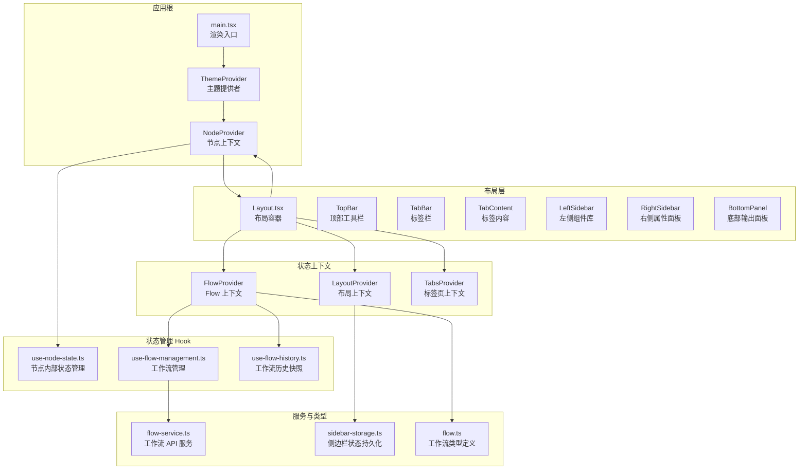
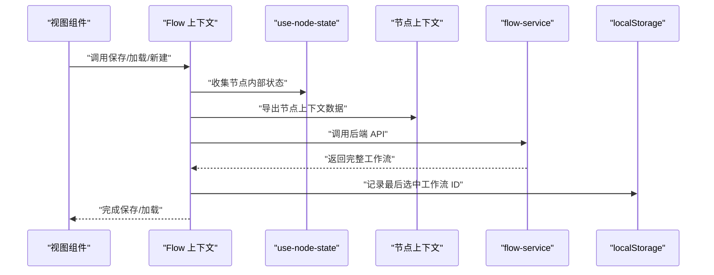
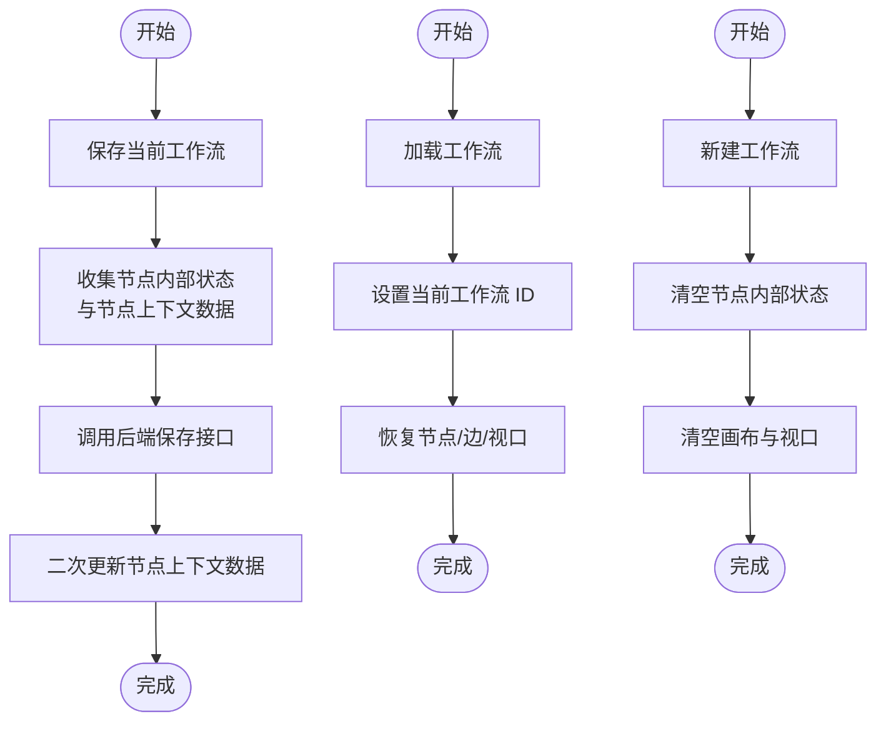
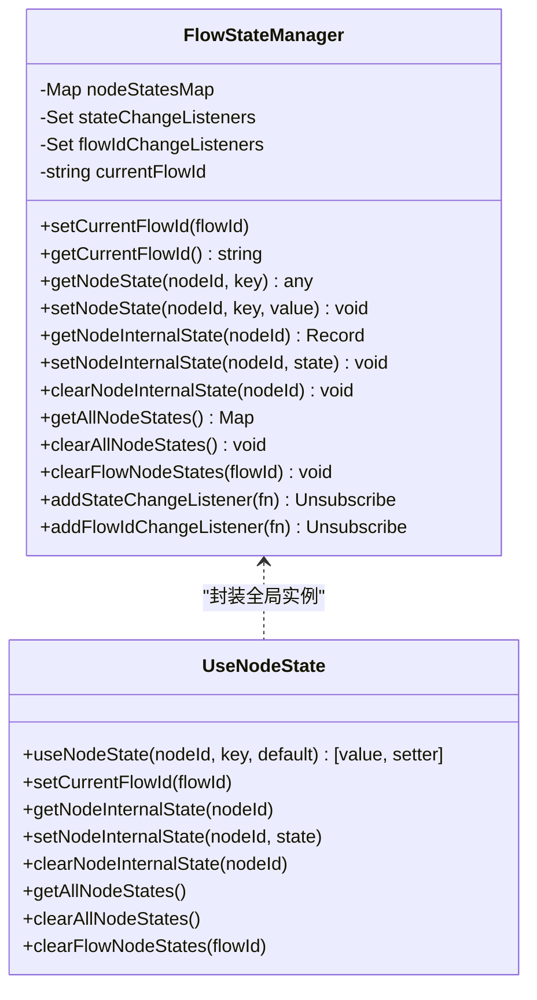
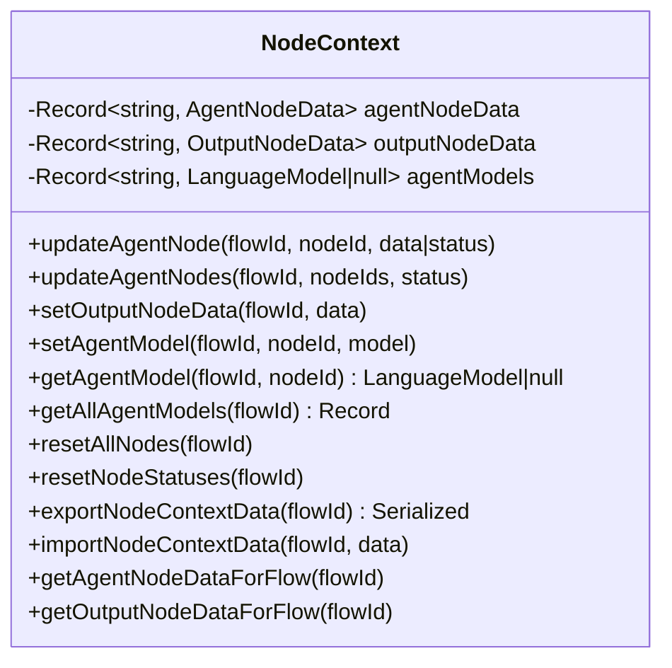
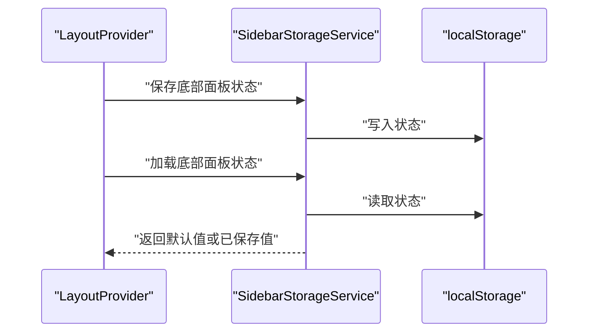
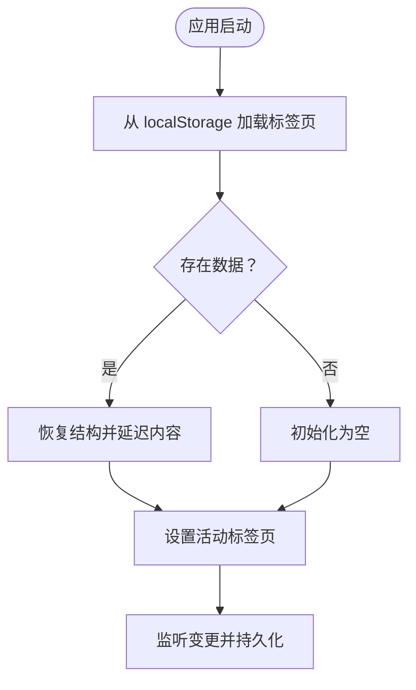
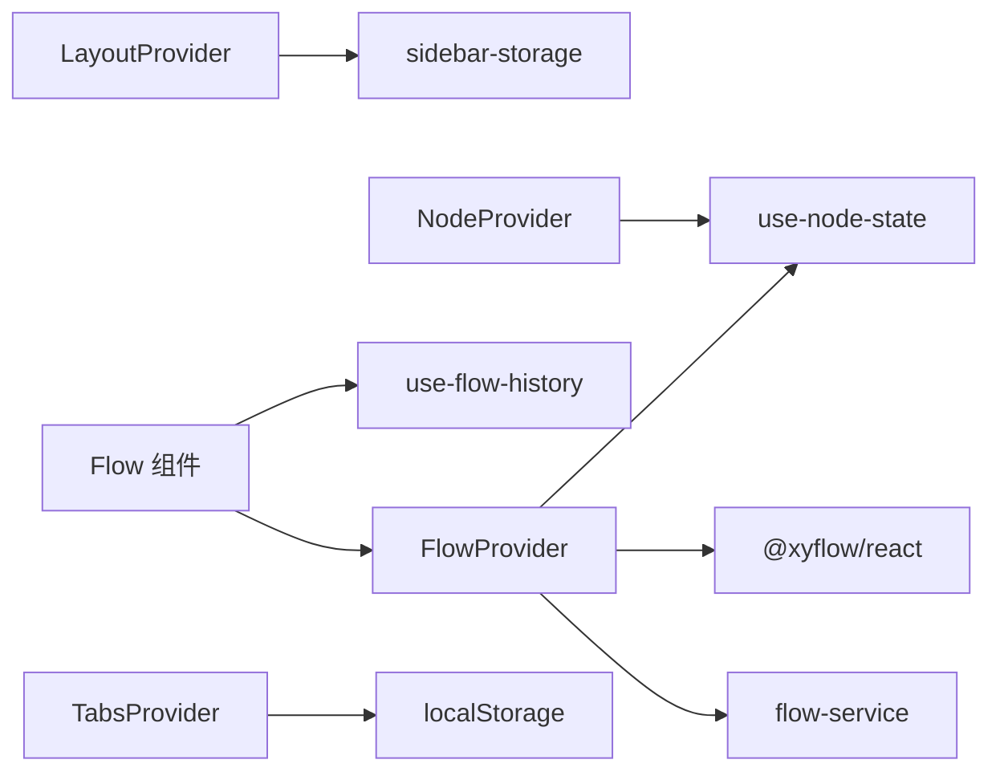

# 状态管理

<cite>
**本文引用的文件**
- [flow-context.tsx](file://app/frontend/src/contexts/flow-context.tsx)
- [layout-context.tsx](file://app/frontend/src/contexts/layout-context.tsx)
- [node-context.tsx](file://app/frontend/src/contexts/node-context.tsx)
- [tabs-context.tsx](file://app/frontend/src/contexts/tabs-context.tsx)
- [use-node-state.ts](file://app/frontend/src/hooks/use-node-state.ts)
- [use-flow-management.ts](file://app/frontend/src/hooks/use-flow-management.ts)
- [use-flow-history.ts](file://app/frontend/src/hooks/use-flow-history.ts)
- [Flow.tsx](file://app/frontend/src/components/Flow.tsx)
- [Layout.tsx](file://app/frontend/src/components/Layout.tsx)
- [sidebar-storage.ts](file://app/frontend/src/services/sidebar-storage.ts)
- [flow-service.ts](file://app/frontend/src/services/flow-service.ts)
- [flow.ts](file://app/frontend/src/types/flow.ts)
- [main.tsx](file://app/frontend/src/main.tsx)
</cite>

## 目录
1. [简介](#简介)
2. [项目结构](#项目结构)
3. [核心组件](#核心组件)
4. [架构总览](#架构总览)
5. [详细组件分析](#详细组件分析)
6. [依赖关系分析](#依赖关系分析)
7. [性能考量](#性能考量)
8. [故障排查指南](#故障排查指南)
9. [结论](#结论)
10. [附录](#附录)

## 简介
本文件系统性阐述前端状态管理的设计与实现，覆盖以下主题：
- Context API 的使用与自定义 Hook 设计
- 状态提升策略：Flow 上下文、布局上下文、节点上下文
- 主题状态管理、节点状态同步与工作流状态维护
- 状态持久化、本地存储集成与状态恢复机制
- 状态更新优化、性能监控与内存泄漏防护
- 异步状态处理、错误边界与状态回滚策略
- 与后端状态同步、实时数据更新与冲突解决机制

## 项目结构
前端状态管理围绕四大 Context 与若干自定义 Hook 构建：
- Flow 上下文：负责工作流的增删改查、保存加载、节点/边/视口管理
- 布局上下文：负责侧边栏与底部面板的折叠状态与当前标签页
- 节点上下文：负责节点运行时状态（消息、分析、输出等）与模型选择
- 标签页上下文：负责多标签页的打开、关闭、重排与标题更新，并持久化到本地存储

**图表来源**
- [main.tsx:10-18](file://app/frontend/src/main.tsx#L10-L18)
- [Layout.tsx:187-201](file://app/frontend/src/components/Layout.tsx#L187-L201)
- [flow-context.tsx:35-358](file://app/frontend/src/contexts/flow-context.tsx#L35-L358)
- [layout-context.tsx:27-68](file://app/frontend/src/contexts/layout-context.tsx#L27-L68)
- [tabs-context.tsx:59-271](file://app/frontend/src/contexts/tabs-context.tsx#L59-L271)
- [node-context.tsx:90-438](file://app/frontend/src/contexts/node-context.tsx#L90-L438)
- [use-node-state.ts:7-132](file://app/frontend/src/hooks/use-node-state.ts#L7-L132)
- [use-flow-management.ts:44-336](file://app/frontend/src/hooks/use-flow-management.ts#L44-L336)
- [use-flow-history.ts:15-171](file://app/frontend/src/hooks/use-flow-history.ts#L15-L171)
- [flow-service.ts:27-108](file://app/frontend/src/services/flow-service.ts#L27-L108)
- [sidebar-storage.ts:7-237](file://app/frontend/src/services/sidebar-storage.ts#L7-L237)
- [flow.ts:1-13](file://app/frontend/src/types/flow.ts#L1-L13)

**章节来源**
- [main.tsx:10-18](file://app/frontend/src/main.tsx#L10-L18)
- [Layout.tsx:187-201](file://app/frontend/src/components/Layout.tsx#L187-L201)

## 核心组件
- Flow 上下文：提供添加组件、保存/加载工作流、新建工作流、标记未保存等能力；通过 React Flow 实例管理节点、边与视口；与 use-node-state 协作实现节点内部状态隔离与持久化；与 flow-service 集成后端 API。
- 布局上下文：管理底部面板折叠状态与当前底部标签页，状态通过 SidebarStorageService 持久化到 localStorage。
- 节点上下文：以“工作流感知”的复合键存储节点运行时状态（代理节点状态、消息历史、输出节点数据、模型选择），支持导出/导入用于持久化。
- 标签页上下文：管理多标签页集合与活动标签页，序列化到 localStorage 并在挂载时恢复。

**章节来源**
- [flow-context.tsx:10-358](file://app/frontend/src/contexts/flow-context.tsx#L10-L358)
- [layout-context.tsx:4-68](file://app/frontend/src/contexts/layout-context.tsx#L4-L68)
- [node-context.tsx:63-438](file://app/frontend/src/contexts/node-context.tsx#L63-L438)
- [tabs-context.tsx:27-271](file://app/frontend/src/contexts/tabs-context.tsx#L27-L271)

## 架构总览
状态管理采用分层设计：
- 视图层：Flow 组件、Layout 组件、各面板组件
- 上下文层：FlowProvider、LayoutProvider、TabsProvider、NodeProvider
- Hook 层：use-flow-management、use-node-state、use-flow-history
- 服务层：flow-service、sidebar-storage
- 类型层：flow.ts

**图表来源**
- [flow-context.tsx:74-188](file://app/frontend/src/contexts/flow-context.tsx#L74-L188)
- [use-flow-management.ts:57-143](file://app/frontend/src/hooks/use-flow-management.ts#L57-L143)
- [flow-service.ts:27-108](file://app/frontend/src/services/flow-service.ts#L27-L108)
- [use-node-state.ts:134-180](file://app/frontend/src/hooks/use-node-state.ts#L134-L180)

## 详细组件分析

### Flow 上下文与工作流生命周期
- 保存流程：聚合 React Flow 节点/边/视口与 use-node-state 内部状态，必要时二次更新节点上下文数据。
- 加载流程：设置当前工作流 ID 以隔离节点状态，恢复节点与边，可选恢复视口；延迟恢复连接状态。
- 新建流程：清空当前工作流 ID 与节点状态，清空画布并重置视口。
- 添加组件：单节点或多节点组，自动居中并适配视口；完成后触发未保存标记。

**图表来源**
- [flow-context.tsx:74-214](file://app/frontend/src/contexts/flow-context.tsx#L74-L214)
- [use-flow-management.ts:57-143](file://app/frontend/src/hooks/use-flow-management.ts#L57-L143)

**章节来源**
- [flow-context.tsx:74-214](file://app/frontend/src/contexts/flow-context.tsx#L74-L214)
- [use-flow-management.ts:57-143](file://app/frontend/src/hooks/use-flow-management.ts#L57-L143)

### 节点内部状态管理（use-node-state）
- 流隔离：通过复合键（工作流 ID + 节点 ID）实现状态隔离；切换工作流时自动通知监听器。
- 状态访问：读取/写入节点状态键值；批量清理指定工作流或全部工作流状态。
- React 集成：useNodeState 提供类似 useState 的接口，自动初始化、持久化与响应外部变化。

**图表来源**
- [use-node-state.ts:7-132](file://app/frontend/src/hooks/use-node-state.ts#L7-L132)
- [use-node-state.ts:194-268](file://app/frontend/src/hooks/use-node-state.ts#L194-L268)

**章节来源**
- [use-node-state.ts:7-132](file://app/frontend/src/hooks/use-node-state.ts#L7-L132)
- [use-node-state.ts:194-268](file://app/frontend/src/hooks/use-node-state.ts#L194-L268)

### 节点上下文与运行时状态
- 数据结构：代理节点状态（状态、消息历史、分析）、输出节点数据（决策、指标、最终组合）。
- 工作流感知：所有状态均以复合键存储，支持按工作流导出/导入，避免跨流污染。
- 模型管理：为每个节点维护语言模型选择，支持查询与批量重置。

**图表来源**
- [node-context.tsx:63-438](file://app/frontend/src/contexts/node-context.tsx#L63-L438)

**章节来源**
- [node-context.tsx:63-438](file://app/frontend/src/contexts/node-context.tsx#L63-L438)

### 布局上下文与侧边栏状态持久化
- 底部面板折叠状态与当前标签页由 LayoutProvider 管理，通过 SidebarStorageService 持久化。
- 侧边栏状态（左右面板）独立持久化，支持批量保存/加载/重置。

**图表来源**
- [layout-context.tsx:27-68](file://app/frontend/src/contexts/layout-context.tsx#L27-L68)
- [sidebar-storage.ts:7-237](file://app/frontend/src/services/sidebar-storage.ts#L7-L237)

**章节来源**
- [layout-context.tsx:27-68](file://app/frontend/src/contexts/layout-context.tsx#L27-L68)
- [sidebar-storage.ts:7-237](file://app/frontend/src/services/sidebar-storage.ts#L7-L237)

### 标签页上下文与持久化
- 标签页集合与活动标签页通过 TabsProvider 管理，序列化为可存储对象（不含内容），仅保留标题、类型、元数据与关联工作流。
- 挂载时从 localStorage 恢复，避免重复渲染内容。

**图表来源**
- [tabs-context.tsx:94-141](file://app/frontend/src/contexts/tabs-context.tsx#L94-L141)
- [tabs-context.tsx:154-251](file://app/frontend/src/contexts/tabs-context.tsx#L154-L251)

**章节来源**
- [tabs-context.tsx:94-141](file://app/frontend/src/contexts/tabs-context.tsx#L94-L141)
- [tabs-context.tsx:154-251](file://app/frontend/src/contexts/tabs-context.tsx#L154-L251)

### 工作流历史与撤销/重做
- 使用 use-flow-history 为每个工作流维护独立历史栈，限制最大容量，忽略仅 UI 变更的重复快照。
- 支持撤销/重做与清空历史，避免在撤销/重做过程中产生额外快照。

**章节来源**
- [use-flow-history.ts:15-171](file://app/frontend/src/hooks/use-flow-history.ts#L15-L171)

### Flow 组件中的自动保存与快捷键
- Flow 组件在节点/边变更时进行防抖自动保存；连接新边时立即保存以确保结构一致性。
- 提供键盘快捷键：保存、撤销/重做、适配视图、侧边栏切换、底部面板开关、设置页打开。

**章节来源**
- [Flow.tsx:57-231](file://app/frontend/src/components/Flow.tsx#L57-L231)

## 依赖关系分析
- Flow 上下文依赖 React Flow 实例与 flow-service；与 use-node-state 协作实现节点内部状态持久化。
- 节点上下文依赖 use-node-state 的工作流隔离能力，提供运行时数据的导出/导入。
- 布局上下文依赖 SidebarStorageService 进行本地持久化。
- 标签页上下文依赖 localStorage 进行持久化。
- Flow 组件依赖 FlowProvider、use-flow-history 与 use-enhanced-flow-actions（通过 FlowProvider 注入）。

**图表来源**
- [flow-context.tsx:35-358](file://app/frontend/src/contexts/flow-context.tsx#L35-L358)
- [node-context.tsx:90-438](file://app/frontend/src/contexts/node-context.tsx#L90-L438)
- [layout-context.tsx:27-68](file://app/frontend/src/contexts/layout-context.tsx#L27-L68)
- [tabs-context.tsx:59-271](file://app/frontend/src/contexts/tabs-context.tsx#L59-L271)
- [Flow.tsx:34-313](file://app/frontend/src/components/Flow.tsx#L34-L313)
- [use-flow-history.ts:15-171](file://app/frontend/src/hooks/use-flow-history.ts#L15-L171)
- [flow-service.ts:27-108](file://app/frontend/src/services/flow-service.ts#L27-L108)
- [sidebar-storage.ts:7-237](file://app/frontend/src/services/sidebar-storage.ts#L7-L237)

**章节来源**
- [flow-context.tsx:35-358](file://app/frontend/src/contexts/flow-context.tsx#L35-L358)
- [node-context.tsx:90-438](file://app/frontend/src/contexts/node-context.tsx#L90-L438)
- [layout-context.tsx:27-68](file://app/frontend/src/contexts/layout-context.tsx#L27-L68)
- [tabs-context.tsx:59-271](file://app/frontend/src/contexts/tabs-context.tsx#L59-L271)
- [Flow.tsx:34-313](file://app/frontend/src/components/Flow.tsx#L34-L313)
- [use-flow-history.ts:15-171](file://app/frontend/src/hooks/use-flow-history.ts#L15-L171)
- [flow-service.ts:27-108](file://app/frontend/src/services/flow-service.ts#L27-L108)
- [sidebar-storage.ts:7-237](file://app/frontend/src/services/sidebar-storage.ts#L7-L237)

## 性能考量
- 防抖与节流：自动保存采用 1 秒防抖，历史快照采用 500ms 防抖，减少频繁写入。
- 选择性保存：仅在结构性变更（新增/删除节点、删除边、位置拖拽结束）时触发保存。
- 状态隔离：通过复合键隔离不同工作流状态，避免跨流读写带来的性能问题。
- 清理与卸载：组件卸载时清理定时器与监听器，防止内存泄漏。
- 本地存储：标签页与侧边栏状态持久化采用 JSON 序列化，避免大对象直接渲染。

[本节为通用性能建议，不直接分析具体文件]

## 故障排查指南
- 保存失败：检查 flow-service 返回状态码与错误信息；确认 React Flow 实例可用；查看控制台日志。
- 加载失败：确认后端返回的节点/边/视口数据格式；检查 use-node-state 的工作流 ID 设置顺序。
- 自动保存未触发：确认 isInitialized 标记与 currentFlowId 是否正确；检查变更类型是否命中保存条件。
- 历史撤销异常：确保撤销/重做期间 isUndoRedoAction 标志被正确设置与清除。
- 本地存储异常：检查 localStorage 权限与容量；确认序列化/反序列化过程无异常。

**章节来源**
- [use-flow-management.ts:255-271](file://app/frontend/src/hooks/use-flow-management.ts#L255-L271)
- [use-flow-management.ts:273-284](file://app/frontend/src/hooks/use-flow-management.ts#L273-L284)
- [Flow.tsx:57-160](file://app/frontend/src/components/Flow.tsx#L57-L160)
- [use-flow-history.ts:115-148](file://app/frontend/src/hooks/use-flow-history.ts#L115-L148)
- [sidebar-storage.ts:15-23](file://app/frontend/src/services/sidebar-storage.ts#L15-L23)

## 结论
该状态管理体系通过 Context API 与自定义 Hook 实现了清晰的职责分离与良好的扩展性：
- Flow 上下文统一管理工作流配置与持久化；
- 节点上下文聚焦运行时状态与模型选择；
- 布局与标签页上下文分别处理 UI 状态与多标签页体验；
- use-node-state 提供细粒度的节点内部状态持久化与工作流隔离；
- Flow 组件与历史 Hook 提供自动保存与撤销/重做能力。

建议后续增强方向：
- 在 FlowProvider 中引入错误边界，捕获保存/加载异常并提示用户；
- 对自动保存与历史快照增加节流阈值配置；
- 为节点上下文导出/导入增加版本兼容与校验；
- 在 Flow 组件中增加保存进度反馈与离线模式提示。

[本节为总结性内容，不直接分析具体文件]

## 附录
- 类型定义：工作流类型包含基础字段与时间戳，便于后端同步与排序。
- 渲染入口：main.tsx 将主题提供者与节点上下文包裹在应用根部，保证全局可用。

**章节来源**
- [flow.ts:1-13](file://app/frontend/src/types/flow.ts#L1-L13)
- [main.tsx:10-18](file://app/frontend/src/main.tsx#L10-L18)