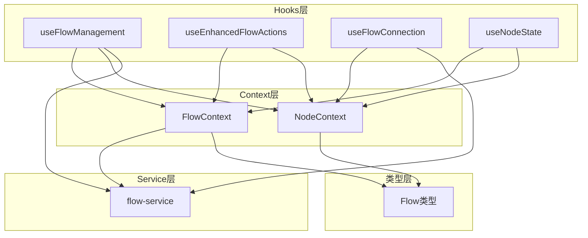
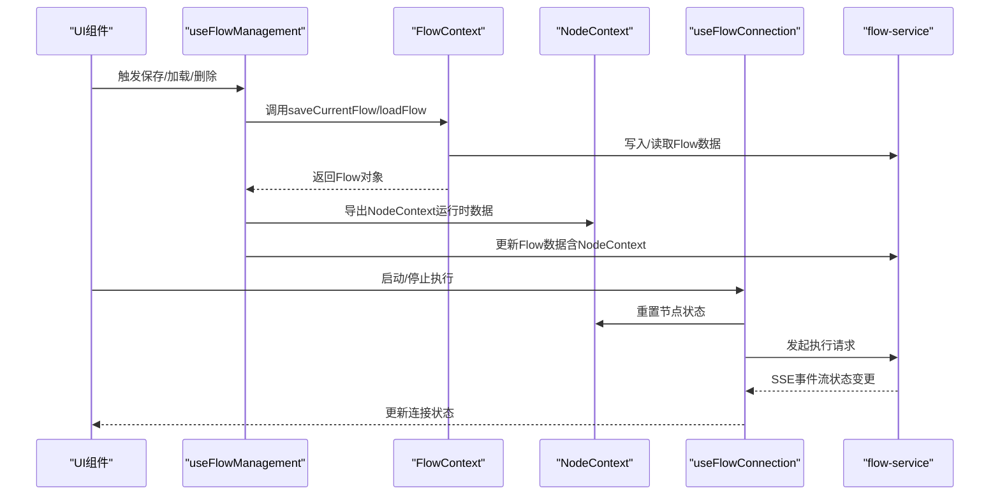
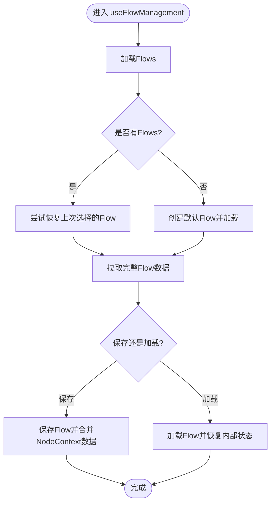
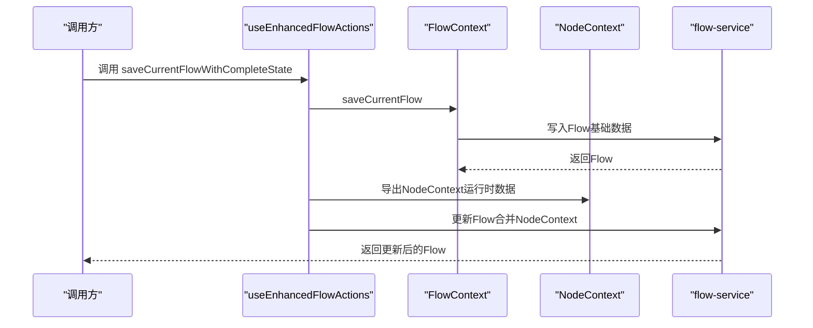
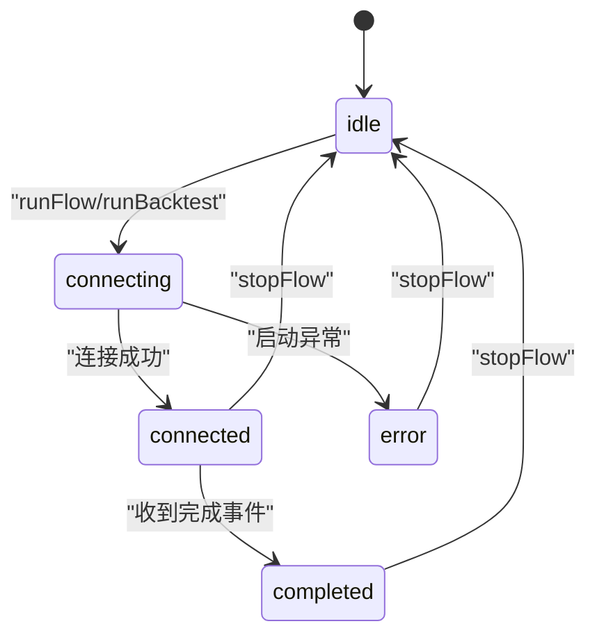
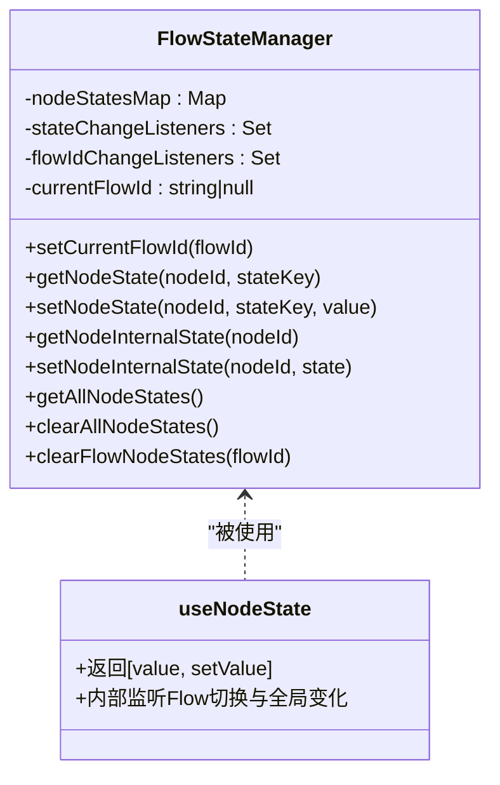
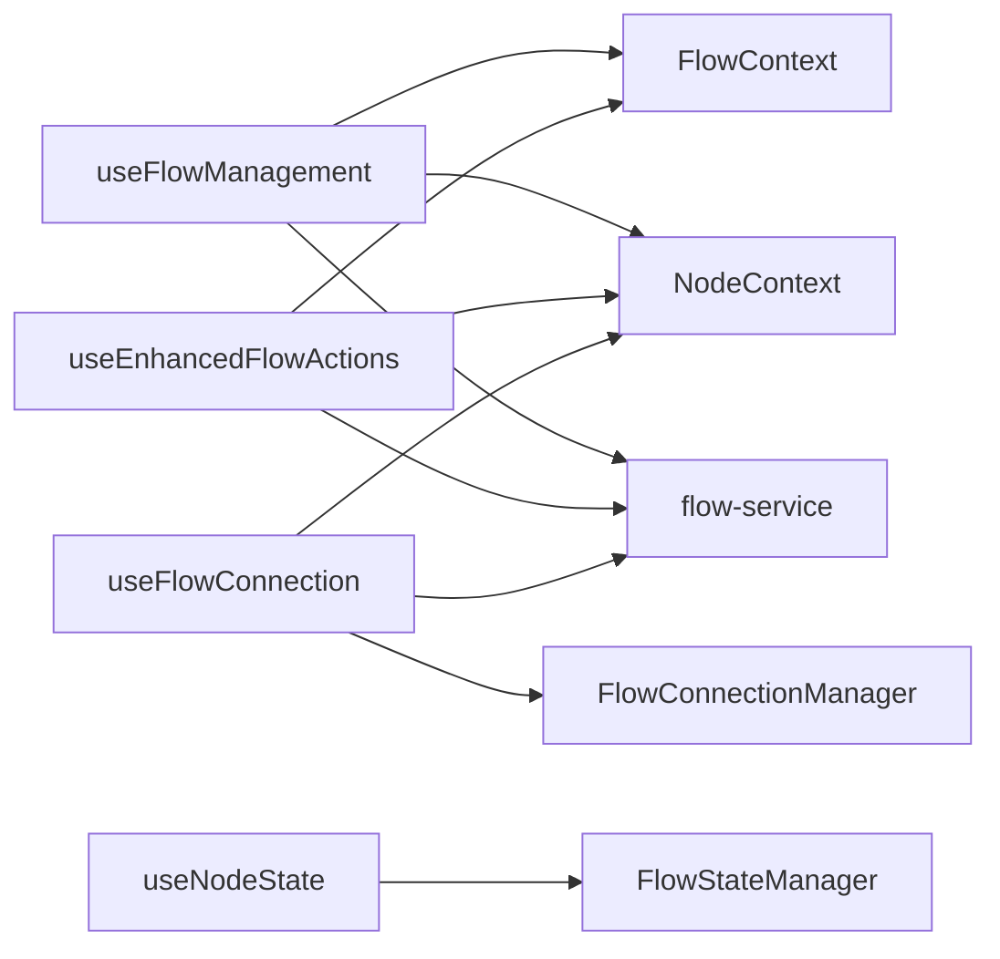

# 自定义Hook

<cite>
**本文引用的文件**
- [use-flow-management.ts](file://app/frontend/src/hooks/use-flow-management.ts)
- [use-enhanced-flow-actions.ts](file://app/frontend/src/hooks/use-enhanced-flow-actions.ts)
- [use-flow-connection.ts](file://app/frontend/src/hooks/use-flow-connection.ts)
- [use-node-state.ts](file://app/frontend/src/hooks/use-node-state.ts)
- [flow-context.tsx](file://app/frontend/src/contexts/flow-context.tsx)
- [node-context.tsx](file://app/frontend/src/contexts/node-context.tsx)
- [flow-service.ts](file://app/frontend/src/services/flow-service.ts)
- [flow.ts](file://app/frontend/src/types/flow.ts)
- [use-flow-history.ts](file://app/frontend/src/hooks/use-flow-history.ts)
- [use-flow-management-tabs.ts](file://app/frontend/src/hooks/use-flow-management-tabs.ts)
</cite>

## 目录
1. [简介](#简介)
2. [项目结构](#项目结构)
3. [核心组件](#核心组件)
4. [架构总览](#架构总览)
5. [详细组件分析](#详细组件分析)
6. [依赖分析](#依赖分析)
7. [性能考量](#性能考量)
8. [故障排查指南](#故障排查指南)
9. [结论](#结论)
10. [附录](#附录)

## 简介
本文件系统性梳理前端自定义Hook：useFlowManagement、useEnhancedFlowActions、useFlowConnection、useNodeState 的设计与实现，覆盖功能职责、参数配置、返回值结构、内部状态管理、副作用处理、性能优化、Hook间组合与依赖关系、调用时机、测试策略与Mock方案、调试技巧、复用模式与扩展方法，以及与Context的协作、状态同步与错误处理机制。目标是帮助开发者在不深入源码的情况下也能高效理解与正确使用这些Hook。

## 项目结构
围绕“流程（Flow）”与“节点（Node）”的状态管理，本项目采用分层组织：
- Hooks层：封装业务逻辑与状态持久化，暴露简洁的API给UI组件使用
- Context层：提供Flow与Node运行时数据的全局共享与隔离
- Service层：对接后端API，统一读写Flow数据
- 类型层：定义Flow等数据结构

图表来源
- [use-flow-management.ts:1-336](file://app/frontend/src/hooks/use-flow-management.ts#L1-L336)
- [use-enhanced-flow-actions.ts:1-112](file://app/frontend/src/hooks/use-enhanced-flow-actions.ts#L1-L112)
- [use-flow-connection.ts:1-268](file://app/frontend/src/hooks/use-flow-connection.ts#L1-L268)
- [use-node-state.ts:1-268](file://app/frontend/src/hooks/use-node-state.ts#L1-L268)
- [flow-context.tsx:1-358](file://app/frontend/src/contexts/flow-context.tsx#L1-L358)
- [node-context.tsx:1-438](file://app/frontend/src/contexts/node-context.tsx#L1-L438)
- [flow-service.ts:1-108](file://app/frontend/src/services/flow-service.ts#L1-L108)
- [flow.ts:1-13](file://app/frontend/src/types/flow.ts#L1-L13)

章节来源
- [use-flow-management.ts:1-336](file://app/frontend/src/hooks/use-flow-management.ts#L1-L336)
- [use-enhanced-flow-actions.ts:1-112](file://app/frontend/src/hooks/use-enhanced-flow-actions.ts#L1-L112)
- [use-flow-connection.ts:1-268](file://app/frontend/src/hooks/use-flow-connection.ts#L1-L268)
- [use-node-state.ts:1-268](file://app/frontend/src/hooks/use-node-state.ts#L1-L268)
- [flow-context.tsx:1-358](file://app/frontend/src/contexts/flow-context.tsx#L1-L358)
- [node-context.tsx:1-438](file://app/frontend/src/contexts/node-context.tsx#L1-L438)
- [flow-service.ts:1-108](file://app/frontend/src/services/flow-service.ts#L1-L108)
- [flow.ts:1-13](file://app/frontend/src/types/flow.ts#L1-L13)

## 核心组件
本节概述四个核心Hook的职责与返回值概要，便于快速定位用途与接口。

- useFlowManagement
  - 职责：管理Flow列表、搜索、创建默认Flow、保存/加载/删除Flow；整合useNodeState与NodeContext数据进行完整持久化与恢复
  - 返回值要点：状态字段（flows、searchQuery、isLoading、openGroups、createDialogOpen）、计算字段（filteredFlows、recentFlows、templateFlows）、动作函数（handleSaveCurrentFlow、handleLoadFlow、handleDeleteFlow、handleRefresh等）
  - 关键依赖：FlowContext、NodeContext、flow-service、localStorage

- useEnhancedFlowActions
  - 职责：在基础保存/加载能力上，补充NodeContext运行时数据的持久化与恢复
  - 返回值要点：saveCurrentFlowWithCompleteState、loadFlowWithCompleteState
  - 关键依赖：FlowContext、NodeContext、flow-service

- useFlowConnection
  - 职责：管理Flow执行连接状态（连接中/已连接/错误/完成），支持启动/停止/恢复执行；通过全局连接管理器协调多Flow并发
  - 返回值要点：状态（isConnecting、isConnected、isError、isCompleted、isProcessing、canRun、error）、动作（runFlow、runBacktest、stopFlow、recoverFlowState）
  - 关键依赖：NodeContext、flow-service（API调用）、全局FlowConnectionManager

- useNodeState
  - 职责：为单个节点提供跨Flow持久化的useState替代；自动隔离不同Flow的状态；监听Flow切换与全局状态变化
  - 返回值要点：[value, setValue]元组；同时导出全局管理函数（setCurrentFlowId、getNodeInternalState、setNodeInternalState、clearFlowNodeStates等）
  - 关键依赖：FlowStateManager（全局状态管理器）

章节来源
- [use-flow-management.ts:14-42](file://app/frontend/src/hooks/use-flow-management.ts#L14-L42)
- [use-enhanced-flow-actions.ts:16-112](file://app/frontend/src/hooks/use-enhanced-flow-actions.ts#L16-L112)
- [use-flow-connection.ts:80-250](file://app/frontend/src/hooks/use-flow-connection.ts#L80-L250)
- [use-node-state.ts:141-183](file://app/frontend/src/hooks/use-node-state.ts#L141-L183)

## 架构总览
下图展示四个Hook与Context、Service之间的交互关系，以及状态流向。

图表来源
- [use-flow-management.ts:58-143](file://app/frontend/src/hooks/use-flow-management.ts#L58-L143)
- [use-enhanced-flow-actions.ts:21-106](file://app/frontend/src/hooks/use-enhanced-flow-actions.ts#L21-L106)
- [use-flow-connection.ts:115-211](file://app/frontend/src/hooks/use-flow-connection.ts#L115-L211)
- [flow-context.tsx:75-188](file://app/frontend/src/contexts/flow-context.tsx#L75-L188)
- [node-context.tsx:238-305](file://app/frontend/src/contexts/node-context.tsx#L238-L305)
- [flow-service.ts:27-84](file://app/frontend/src/services/flow-service.ts#L27-L84)

## 详细组件分析

### useFlowManagement 分析
- 功能职责
  - 列表管理：加载、过滤、分组、最近与模板分类
  - 创建默认Flow并自动加载
  - 保存当前Flow：将useNodeState内部状态与NodeContext运行时数据合并持久化
  - 加载Flow：设置当前FlowId以隔离状态，恢复内部状态，保留运行时数据从空开始
  - 删除Flow：清理对应Flow的节点状态，关闭相关标签页（在带标签页版本中）
- 参数配置
  - 无外部参数，内部依赖FlowContext、NodeContext、flow-service、localStorage
- 返回值结构
  - 状态：flows、searchQuery、isLoading、openGroups、createDialogOpen
  - 计算：filteredFlows、recentFlows、templateFlows
  - 动作：handleSaveCurrentFlow、handleLoadFlow、handleDeleteFlow、handleRefresh、handleCreateNewFlow、handleFlowCreated、handleAccordionChange、setSearchQuery、setOpenGroups、setCreateDialogOpen
  - 内部：loadFlows、createDefaultFlow
- 内部状态管理与副作用
  - 使用useState维护本地状态
  - useEffect在挂载时加载Flows
  - useCallback包裹异步操作，避免重复渲染导致的多次调用
- 性能优化
  - 使用useCallback减少函数重建
  - 仅在需要时替换React Flow节点以注入internal_state，完成后立即还原
  - 过滤与排序在内存中进行，注意大数据量时的优化
- 错误处理
  - try/catch包裹异步操作，控制台输出错误日志，并通过toast管理器提示用户
- Hook组合与调用时机
  - 在Flow列表面板、Flow编辑器、Flow详情页等场景调用
  - 保存前先导出NodeContext数据，再更新Flow；加载后按需恢复内部状态

图表来源
- [use-flow-management.ts:168-212](file://app/frontend/src/hooks/use-flow-management.ts#L168-L212)
- [use-flow-management.ts:255-284](file://app/frontend/src/hooks/use-flow-management.ts#L255-L284)
- [use-flow-management.ts:112-143](file://app/frontend/src/hooks/use-flow-management.ts#L112-L143)

章节来源
- [use-flow-management.ts:44-336](file://app/frontend/src/hooks/use-flow-management.ts#L44-L336)
- [flow-context.tsx:75-188](file://app/frontend/src/contexts/flow-context.tsx#L75-L188)
- [node-context.tsx:308-336](file://app/frontend/src/contexts/node-context.tsx#L308-L336)
- [flow-service.ts:27-84](file://app/frontend/src/services/flow-service.ts#L27-L84)

### useEnhancedFlowActions 分析
- 功能职责
  - 在基础保存/加载能力上，补充NodeContext运行时数据的持久化与恢复
  - 与useFlowManagement类似，但作为独立Hook供需要增强保存/加载能力的场景使用
- 参数配置
  - 无外部参数，内部依赖FlowContext、NodeContext、flow-service
- 返回值结构
  - saveCurrentFlowWithCompleteState：Promise<Flow | null>
  - loadFlowWithCompleteState：Promise<void>
- 内部状态管理与副作用
  - 与useFlowManagement一致，使用useCallback包裹异步操作
- 性能优化
  - 复用useFlowManagement中的相同优化策略
- 错误处理
  - try/catch包裹，控制台输出错误日志

图表来源
- [use-enhanced-flow-actions.ts:21-72](file://app/frontend/src/hooks/use-enhanced-flow-actions.ts#L21-L72)
- [use-enhanced-flow-actions.ts:75-106](file://app/frontend/src/hooks/use-enhanced-flow-actions.ts#L75-L106)
- [flow-context.tsx:75-131](file://app/frontend/src/contexts/flow-context.tsx#L75-L131)
- [node-context.tsx:308-336](file://app/frontend/src/contexts/node-context.tsx#L308-L336)
- [flow-service.ts:62-74](file://app/frontend/src/services/flow-service.ts#L62-L74)

章节来源
- [use-enhanced-flow-actions.ts:16-112](file://app/frontend/src/hooks/use-enhanced-flow-actions.ts#L16-L112)
- [flow-context.tsx:75-131](file://app/frontend/src/contexts/flow-context.tsx#L75-L131)
- [node-context.tsx:308-336](file://app/frontend/src/contexts/node-context.tsx#L308-L336)
- [flow-service.ts:62-74](file://app/frontend/src/services/flow-service.ts#L62-L74)

### useFlowConnection 分析
- 功能职责
  - 维护每个Flow的连接状态（idle/connecting/connected/error/completed）
  - 提供runFlow/runBacktest/stopFlow/recoverFlowState等动作
  - 通过全局FlowConnectionManager集中管理所有Flow的连接状态
  - 结合NodeContext重置节点状态，确保执行前后状态一致性
- 参数配置
  - flowId：要管理的Flow标识
- 返回值结构
  - 状态：isConnecting、isConnected、isError、isCompleted、isProcessing、canRun、error
  - 动作：runFlow、runBacktest、stopFlow、recoverFlowState
- 内部状态管理与副作用
  - 全局FlowConnectionManager维护每个flowId的状态快照
  - useFlowConnection内部通过useEffect订阅全局状态变化，强制刷新
  - canRun基于flowId存在性与当前状态判断
- 性能优化
  - 使用useCallback包裹动作函数，避免重复渲染
  - 通过AbortController支持中断执行
  - recoverFlowState检测过期连接并自动恢复到idle
- 错误处理
  - try/catch包裹启动执行过程，失败时记录错误并切换到error状态
- Hook组合与调用时机
  - 在执行按钮、回测按钮、停止按钮等交互处调用
  - 在Flow加载完成后调用recoverFlowState以修复过期状态

图表来源
- [use-flow-connection.ts:19-70](file://app/frontend/src/hooks/use-flow-connection.ts#L19-L70)
- [use-flow-connection.ts:115-211](file://app/frontend/src/hooks/use-flow-connection.ts#L115-L211)
- [use-flow-connection.ts:214-232](file://app/frontend/src/hooks/use-flow-connection.ts#L214-L232)

章节来源
- [use-flow-connection.ts:80-250](file://app/frontend/src/hooks/use-flow-connection.ts#L80-L250)
- [node-context.tsx:238-305](file://app/frontend/src/contexts/node-context.tsx#L238-L305)

### useNodeState 分析
- 功能职责
  - 为单个节点提供跨Flow持久化的useState替代
  - 自动隔离不同Flow的状态（通过复合键flowId:nodeId）
  - 监听Flow切换与全局状态变化，动态同步
- 参数配置
  - nodeId：节点ID
  - stateKey：节点内唯一状态键
  - defaultValue：默认值
- 返回值结构
  - [value, setValue]：与useState一致的元组
- 内部状态管理与副作用
  - FlowStateManager负责存储与监听
  - useNodeState内部通过useEffect监听Flow切换与全局状态变化，必要时延迟更新
  - setValueAndPersist在变更时写入FlowStateManager
- 性能优化
  - 使用useCallback包裹setValueAndPersist，避免重复渲染
  - 延迟更新（setTimeout）避免在渲染期间修改状态
  - 仅在状态实际变化时触发更新
- 错误处理
  - 通过FlowStateManager内部一致性保证，无需额外try/catch
- Hook组合与调用时机
  - 在任意需要持久化节点配置或中间态的组件中调用
  - 与FlowContext配合，在加载Flow时自动恢复状态

图表来源
- [use-node-state.ts:7-132](file://app/frontend/src/hooks/use-node-state.ts#L7-L132)
- [use-node-state.ts:194-268](file://app/frontend/src/hooks/use-node-state.ts#L194-L268)

章节来源
- [use-node-state.ts:141-268](file://app/frontend/src/hooks/use-node-state.ts#L141-L268)
- [flow-context.tsx:134-188](file://app/frontend/src/contexts/flow-context.tsx#L134-L188)

## 依赖分析
- 组件耦合与内聚
  - useFlowManagement与useEnhancedFlowActions高度相似，后者是对前者的增强封装，内聚于“Flow保存/加载”的业务逻辑
  - useFlowConnection独立性强，主要依赖NodeContext与flow-service，通过全局管理器与其他组件解耦
  - useNodeState提供通用状态持久化能力，被多个业务Hook复用
- 直接与间接依赖
  - useFlowManagement直接依赖FlowContext、NodeContext、flow-service
  - useEnhancedFlowActions依赖FlowContext、NodeContext、flow-service
  - useFlowConnection依赖NodeContext、flow-service、FlowConnectionManager
  - useNodeState依赖FlowStateManager（全局）
- 潜在循环依赖
  - 未发现循环依赖；各Hook通过Context与Service进行单向依赖
- 外部依赖与集成点
  - flow-service提供REST API访问
  - FlowConnectionManager提供全局状态广播
  - FlowContext/NodeContext提供运行时数据隔离

图表来源
- [use-flow-management.ts:46-48](file://app/frontend/src/hooks/use-flow-management.ts#L46-L48)
- [use-enhanced-flow-actions.ts:17-18](file://app/frontend/src/hooks/use-enhanced-flow-actions.ts#L17-L18)
- [use-flow-connection.ts:81-83](file://app/frontend/src/hooks/use-flow-connection.ts#L81-L83)
- [use-node-state.ts:135-135](file://app/frontend/src/hooks/use-node-state.ts#L135-L135)

章节来源
- [use-flow-management.ts:46-48](file://app/frontend/src/hooks/use-flow-management.ts#L46-L48)
- [use-enhanced-flow-actions.ts:17-18](file://app/frontend/src/hooks/use-enhanced-flow-actions.ts#L17-L18)
- [use-flow-connection.ts:81-83](file://app/frontend/src/hooks/use-flow-connection.ts#L81-L83)
- [use-node-state.ts:135-135](file://app/frontend/src/hooks/use-node-state.ts#L135-L135)

## 性能考量
- 函数稳定性
  - 所有异步动作均使用useCallback包裹，避免因函数引用变化导致子组件重渲染
- 渲染优化
  - 仅在必要时替换React Flow节点以注入internal_state，完成后立即还原，降低渲染开销
  - 对Flow列表的过滤与排序在内存中进行，建议在数据量较大时考虑分页或虚拟化
- 状态同步
  - useNodeState通过延迟更新避免在渲染期间修改状态，减少不必要的重渲染
  - FlowStateManager提供监听机制，确保状态变化时及时通知
- 并发与中断
  - useFlowConnection使用AbortController支持中断执行，避免资源浪费
- 缓存与持久化
  - localStorage用于记住上次选择的Flow，减少重复加载时间
  - FlowConnectionManager集中管理连接状态，避免重复订阅

## 故障排查指南
- 保存失败
  - 检查flow-service返回状态与错误信息
  - 确认NodeContext数据导出是否成功
  - 查看控制台错误日志
- 加载失败
  - 确认Flow数据完整性（nodes、edges、viewport、data）
  - 检查FlowContext.loadFlow是否正确设置currentFlowId与currentFlowName
- 执行异常
  - 检查useFlowConnection的error字段与AbortController状态
  - 使用recoverFlowState修复过期状态
- 状态未同步
  - 确认FlowContext是否在加载Flow时先设置了currentFlowId
  - 检查useNodeState的Flow切换监听是否生效

章节来源
- [use-flow-management.ts:255-271](file://app/frontend/src/hooks/use-flow-management.ts#L255-L271)
- [use-flow-connection.ts:140-147](file://app/frontend/src/hooks/use-flow-connection.ts#L140-L147)
- [flow-context.tsx:134-188](file://app/frontend/src/contexts/flow-context.tsx#L134-L188)

## 结论
四个Hook围绕“Flow”与“Node”两大维度构建了完整的状态管理闭环：useNodeState提供细粒度的节点状态持久化与隔离，useFlowConnection负责执行生命周期与状态恢复，useFlowManagement与useEnhancedFlowActions则将配置状态与运行时数据完整地持久化与恢复。通过Context与Service的清晰边界，项目实现了高内聚、低耦合的状态管理架构，既满足复杂业务需求，又保持良好的可测试性与可维护性。

## 附录

### 测试策略与Mock实现
- 单元测试
  - Mock FlowContext：模拟saveCurrentFlow/loadFlow，断言调用次数与参数
  - Mock NodeContext：模拟exportNodeContextData/resetAllNodes，断言状态重置行为
  - Mock flow-service：模拟getFlows/createFlow/updateFlow/deleteFlow，断言网络请求与错误处理
- 集成测试
  - 使用React Testing Library渲染包含Provider的组件树，验证useFlowManagement与useEnhancedFlowActions的行为
  - 验证useFlowConnection在不同状态下的UI反馈与动作可用性
- 行为驱动测试
  - 定义典型场景（新建Flow、保存、加载、执行、停止、删除），逐步断言状态变化与副作用
- Mock建议
  - 使用jest.fn()模拟回调与异步函数
  - 使用Object.defineProperty为全局对象（如localStorage）提供可控的Mock

### 调试技巧
- 在关键路径添加console.log，记录FlowId、状态变化、错误信息
- 使用React DevTools Profiler观察渲染热点
- 在useNodeState中启用调试日志，观察状态同步时机
- 在useFlowConnection中监控全局FlowConnectionManager状态变化

### 复用模式与扩展方法
- 复用模式
  - 将通用的保存/加载逻辑抽取为独立Hook（如useEnhancedFlowActions），在需要完整状态持久化的场景复用
  - 将状态隔离逻辑抽象为FlowStateManager，供其他Hook复用
- 扩展方法
  - 新增节点状态键：在useNodeState中直接使用新的stateKey，无需修改FlowStateManager
  - 新增Flow动作：在useFlowManagement中新增动作函数，复用现有保存/加载流程
  - 新增执行类型：在useFlowConnection中新增runXxx动作，复用连接管理器

### 与Context的协作、状态同步与错误处理机制
- Context协作
  - FlowContext负责Flow级状态（nodes、edges、viewport、currentFlowId、currentFlowName），并在保存/加载时与Service交互
  - NodeContext负责节点级运行时数据（agentNodeData、outputNodeData、agentModels），并提供导出/导入能力
- 状态同步
  - useNodeState在Flow切换时自动重置为存储值，确保不同Flow间状态隔离
  - FlowContext在loadFlow时先设置currentFlowId，再渲染节点，保证useNodeState初始化正确
- 错误处理
  - 所有异步操作均使用try/catch包裹，错误通过控制台输出与toast管理器提示
  - useFlowConnection在启动失败时切换到error状态，并提供stopFlow恢复到idle

章节来源
- [flow-context.tsx:134-188](file://app/frontend/src/contexts/flow-context.tsx#L134-L188)
- [node-context.tsx:308-336](file://app/frontend/src/contexts/node-context.tsx#L308-L336)
- [use-node-state.ts:210-242](file://app/frontend/src/hooks/use-node-state.ts#L210-L242)
- [use-flow-connection.ts:140-147](file://app/frontend/src/hooks/use-flow-connection.ts#L140-L147)