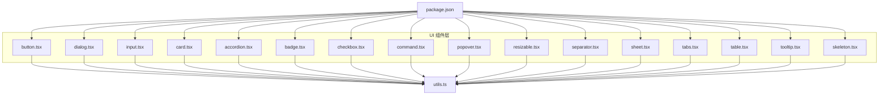
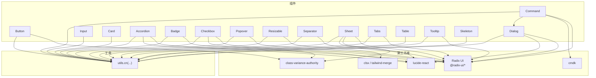
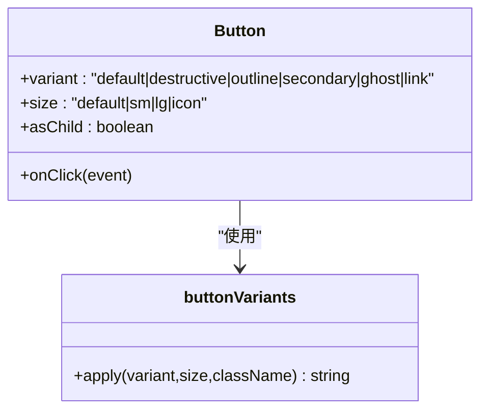
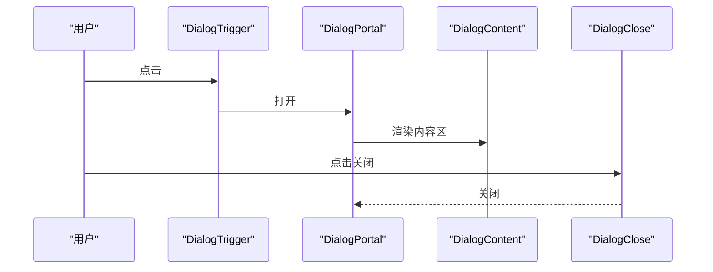
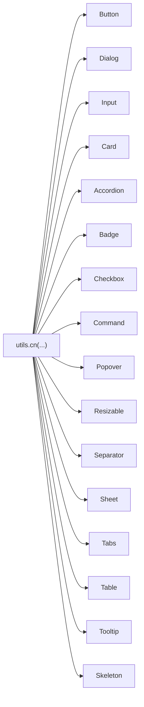

# UI组件库

<cite>
**本文引用的文件**
- [button.tsx](file://app/frontend/src/components/ui/button.tsx)
- [dialog.tsx](file://app/frontend/src/components/ui/dialog.tsx)
- [input.tsx](file://app/frontend/src/components/ui/input.tsx)
- [card.tsx](file://app/frontend/src/components/ui/card.tsx)
- [accordion.tsx](file://app/frontend/src/components/ui/accordion.tsx)
- [badge.tsx](file://app/frontend/src/components/ui/badge.tsx)
- [checkbox.tsx](file://app/frontend/src/components/ui/checkbox.tsx)
- [command.tsx](file://app/frontend/src/components/ui/command.tsx)
- [popover.tsx](file://app/frontend/src/components/ui/popover.tsx)
- [resizable.tsx](file://app/frontend/src/components/ui/resizable.tsx)
- [separator.tsx](file://app/frontend/src/components/ui/separator.tsx)
- [sheet.tsx](file://app/frontend/src/components/ui/sheet.tsx)
- [table.tsx](file://app/frontend/src/components/ui/table.tsx)
- [tabs.tsx](file://app/frontend/src/components/ui/tabs.tsx)
- [tooltip.tsx](file://app/frontend/src/components/ui/tooltip.tsx)
- [skeleton.tsx](file://app/frontend/src/components/ui/skeleton.tsx)
- [utils.ts](file://app/frontend/src/lib/utils.ts)
- [package.json](file://app/frontend/package.json)
</cite>

## 目录
1. [简介](#简介)
2. [项目结构](#项目结构)
3. [核心组件](#核心组件)
4. [架构总览](#架构总览)
5. [组件详解](#组件详解)
6. [依赖关系分析](#依赖关系分析)
7. [性能与可访问性](#性能与可访问性)
8. [故障排查指南](#故障排查指南)
9. [结论](#结论)
10. [附录](#附录)

## 简介
本文件系统化梳理并说明本项目前端中基于 Radix UI 与 shadcn/ui 风格实现的 UI 组件库，重点覆盖 button、dialog、input、card、accordion、badge 等核心组件。内容包括：组件功能特性、属性接口（props）、事件处理、样式定制、无障碍支持、响应式与主题适配、组合使用模式与状态管理策略，并提供可视化图示帮助理解。

## 项目结构
UI 组件集中位于 src/components/ui 下，采用“原子化 + 组合”的分层设计，每个组件独立封装，通过工具函数统一合并类名，确保样式一致性与可扩展性。

图表来源
- [button.tsx:1-58](file://app/frontend/src/components/ui/button.tsx#L1-L58)
- [dialog.tsx:1-113](file://app/frontend/src/components/ui/dialog.tsx#L1-L113)
- [input.tsx:1-23](file://app/frontend/src/components/ui/input.tsx#L1-L23)
- [card.tsx:1-78](file://app/frontend/src/components/ui/card.tsx#L1-L78)
- [accordion.tsx:1-56](file://app/frontend/src/components/ui/accordion.tsx#L1-L56)
- [badge.tsx:1-36](file://app/frontend/src/components/ui/badge.tsx#L1-L36)
- [utils.ts:1-39](file://app/frontend/src/lib/utils.ts#L1-L39)
- [package.json:11-34](file://app/frontend/package.json#L11-L34)

章节来源
- [package.json:11-34](file://app/frontend/package.json#L11-L34)

## 核心组件
本节概览各组件的职责与典型用法，便于快速定位与组合使用。

- 按钮 Button：支持多种变体与尺寸，可作为容器包裹图标或文本，支持透传原生按钮属性与 asChild 渲染为任意元素。
- 对话框 Dialog：提供根节点、触发器、内容区、标题、描述、页脚等子组件，支持门户渲染与动画过渡。
- 输入 Input：基础输入控件，具备聚焦态、禁用态与占位符样式。
- 卡片 Card：卡片容器及头部/标题/描述/内容/底部等子区域，适合信息分组展示。
- 手风琴 Accordion：支持项、触发器与内容区，内置展开/收起动画与图标旋转。
- 徽章 Badge：用于状态标识，支持多变体（如 secondary、destructive、warning、success、outline）。
- 复选框 Checkbox：基于 Radix UI 的复选框，支持受控/非受控状态与指示器图标。
- 命令面板 Command：结合 Radix Dialog 与 cmdk 实现搜索与命令选择，适合快捷操作入口。
- 弹出层 Popover：基于 Radix Popover 的弹出容器，支持对齐与偏移。
- 可调整面板 Resizable：基于 react-resizable-panels 的面板分栏/分屏布局。
- 分隔线 Separator：水平/垂直分隔线，支持方向与装饰属性。
- 滑动面板 Sheet：从侧边滑入的抽屉式面板，支持多方位进入与遮罩。
- 标签页 Tabs：标签页容器、列表、触发器与内容区。
- 表格 Table：表格容器与表头/表体/表尾、行、单元格、标题、说明等。
- 工具提示 Tooltip：基于 Radix Tooltip 的轻提示。
- 骨架屏 Skeleton：用于加载态占位。

章节来源
- [button.tsx:37-57](file://app/frontend/src/components/ui/button.tsx#L37-L57)
- [dialog.tsx:7-112](file://app/frontend/src/components/ui/dialog.tsx#L7-L112)
- [input.tsx:5-22](file://app/frontend/src/components/ui/input.tsx#L5-L22)
- [card.tsx:5-76](file://app/frontend/src/components/ui/card.tsx#L5-L76)
- [accordion.tsx:7-55](file://app/frontend/src/components/ui/accordion.tsx#L7-L55)
- [badge.tsx:25-35](file://app/frontend/src/components/ui/badge.tsx#L25-L35)
- [checkbox.tsx:7-28](file://app/frontend/src/components/ui/checkbox.tsx#L7-L28)
- [command.tsx:9-145](file://app/frontend/src/components/ui/command.tsx#L9-L145)
- [popover.tsx:8-31](file://app/frontend/src/components/ui/popover.tsx#L8-L31)
- [resizable.tsx:6-43](file://app/frontend/src/components/ui/resizable.tsx#L6-L43)
- [separator.tsx:6-29](file://app/frontend/src/components/ui/separator.tsx#L6-L29)
- [sheet.tsx:10-140](file://app/frontend/src/components/ui/sheet.tsx#L10-L140)
- [table.tsx:5-120](file://app/frontend/src/components/ui/table.tsx#L5-L120)
- [tabs.tsx:6-53](file://app/frontend/src/components/ui/tabs.tsx#L6-L53)
- [tooltip.tsx:6-30](file://app/frontend/src/components/ui/tooltip.tsx#L6-L30)
- [skeleton.tsx:3-15](file://app/frontend/src/components/ui/skeleton.tsx#L3-L15)

## 架构总览
下图展示 UI 组件与工具函数、第三方库之间的关系，以及组件间常见的组合方式。

图表来源
- [button.tsx:1-58](file://app/frontend/src/components/ui/button.tsx#L1-L58)
- [dialog.tsx:1-113](file://app/frontend/src/components/ui/dialog.tsx#L1-L113)
- [input.tsx:1-23](file://app/frontend/src/components/ui/input.tsx#L1-L23)
- [card.tsx:1-78](file://app/frontend/src/components/ui/card.tsx#L1-L78)
- [accordion.tsx:1-56](file://app/frontend/src/components/ui/accordion.tsx#L1-L56)
- [badge.tsx:1-36](file://app/frontend/src/components/ui/badge.tsx#L1-L36)
- [checkbox.tsx:1-29](file://app/frontend/src/components/ui/checkbox.tsx#L1-L29)
- [command.tsx:1-146](file://app/frontend/src/components/ui/command.tsx#L1-L146)
- [popover.tsx:1-32](file://app/frontend/src/components/ui/popover.tsx#L1-L32)
- [resizable.tsx:1-44](file://app/frontend/src/components/ui/resizable.tsx#L1-L44)
- [separator.tsx:1-30](file://app/frontend/src/components/ui/separator.tsx#L1-L30)
- [sheet.tsx:1-141](file://app/frontend/src/components/ui/sheet.tsx#L1-L141)
- [table.tsx:1-121](file://app/frontend/src/components/ui/table.tsx#L1-L121)
- [tabs.tsx:1-54](file://app/frontend/src/components/ui/tabs.tsx#L1-L54)
- [tooltip.tsx:1-31](file://app/frontend/src/components/ui/tooltip.tsx#L1-L31)
- [skeleton.tsx:1-16](file://app/frontend/src/components/ui/skeleton.tsx#L1-L16)
- [utils.ts:1-6](file://app/frontend/src/lib/utils.ts#L1-L6)
- [package.json:11-34](file://app/frontend/package.json#L11-L34)

## 组件详解

### Button（按钮）
- 功能特性
  - 支持多种变体（默认、破坏性、描边、次级、幽灵、链接）与尺寸（默认、小、大、图标）。
  - 支持 asChild 将渲染委托给子元素，便于与路由/链接等组合。
  - 内置焦点可见性、环形光圈、禁用态与图标嵌套处理。
- 属性接口（props）
  - 继承原生按钮属性，新增 variant、size、asChild。
- 事件处理
  - 透传 onClick 等原生事件；可结合表单提交与交互逻辑。
- 样式定制
  - 通过变体与尺寸控制外观；可叠加 className 覆盖细节。
- 使用示例路径
  - [按钮组件定义:37-57](file://app/frontend/src/components/ui/button.tsx#L37-L57)
- 最佳实践
  - 图标+文字时注意对齐与间距；危险操作使用 destructive 变体；链接场景使用 link 变体。
- 常见问题
  - 与链接组合时优先使用 asChild，避免内嵌 button 导致语义错误。

图表来源
- [button.tsx:7-35](file://app/frontend/src/components/ui/button.tsx#L7-L35)
- [button.tsx:37-57](file://app/frontend/src/components/ui/button.tsx#L37-L57)

章节来源
- [button.tsx:7-57](file://app/frontend/src/components/ui/button.tsx#L7-L57)

### Dialog（对话框）
- 功能特性
  - 提供根节点、触发器、门户、遮罩、内容区、标题、描述、关闭按钮等。
  - 内置开合动画与键盘无障碍支持（如 sr-only 文本）。
- 属性接口（props）
  - Overlay/Content/Title/Description/Close 等均支持 className 与原生属性透传。
- 事件处理
  - 关闭按钮与 Portal 结合，确保在应用根节点渲染。
- 样式定制
  - 通过 className 覆盖定位、尺寸、阴影与动画参数。
- 使用示例路径
  - [对话框组件定义:7-112](file://app/frontend/src/components/ui/dialog.tsx#L7-L112)
- 最佳实践
  - 在内容区放置 DialogHeader/DialogFooter 进行结构化排版；为关闭按钮提供可读性文本。
- 常见问题
  - 若出现滚动穿透，确认 Portal 是否正确挂载至根节点。

图表来源
- [dialog.tsx:9-51](file://app/frontend/src/components/ui/dialog.tsx#L9-L51)

章节来源
- [dialog.tsx:7-112](file://app/frontend/src/components/ui/dialog.tsx#L7-L112)

### Input（输入框）
- 功能特性
  - 基础输入控件，内置聚焦态、禁用态、占位符与背景色等样式。
- 属性接口（props）
  - 继承原生 input 属性，支持 type、className 等。
- 事件处理
  - 透传 onChange/onFocus/onBlur 等事件。
- 样式定制
  - 通过 className 调整尺寸、圆角与边框。
- 使用示例路径
  - [输入框组件定义:5-22](file://app/frontend/src/components/ui/input.tsx#L5-L22)
- 最佳实践
  - 与表单校验配合，提供实时反馈；在密码输入时设置 type="password"。

章节来源
- [input.tsx:5-22](file://app/frontend/src/components/ui/input.tsx#L5-L22)

### Card（卡片）
- 功能特性
  - 卡片容器与头部、标题、描述、内容、底部等子区域，适合模块化信息展示。
- 属性接口（props）
  - 各子组件均支持 className 与原生 HTML 属性透传。
- 事件处理
  - 透传点击等事件，便于在卡片层面进行交互。
- 样式定制
  - 通过 className 覆盖边框、阴影与内边距。
- 使用示例路径
  - [卡片组件定义:5-76](file://app/frontend/src/components/ui/card.tsx#L5-L76)
- 最佳实践
  - 将 CardHeader 与 CardTitle/Description 组合，形成清晰的信息层级。

章节来源
- [card.tsx:5-76](file://app/frontend/src/components/ui/card.tsx#L5-L76)

### Accordion（手风琴）
- 功能特性
  - 支持多个项，每项包含触发器与内容区；内置展开/收起动画与图标旋转。
- 属性接口（props）
  - Item/Trigger/Content 均支持 className 与原生属性透传。
- 事件处理
  - 由 Radix Accordion 控制状态切换。
- 样式定制
  - 通过 className 调整边框、字体与动画。
- 使用示例路径
  - [手风琴组件定义:7-55](file://app/frontend/src/components/ui/accordion.tsx#L7-L55)
- 最佳实践
  - 触发器内放置 ChevronDown 图标以增强可发现性；内容区避免过重布局。

章节来源
- [accordion.tsx:7-55](file://app/frontend/src/components/ui/accordion.tsx#L7-L55)

### Badge（徽章）
- 功能特性
  - 用于状态标识，支持多种变体（次级、破坏性、警告、成功、描边）。
- 属性接口（props）
  - 支持 variant 与 className。
- 事件处理
  - 透传点击等事件。
- 样式定制
  - 通过 variant 与 className 控制颜色与边框。
- 使用示例路径
  - [徽章组件定义:25-35](file://app/frontend/src/components/ui/badge.tsx#L25-L35)
- 最佳实践
  - 与状态管理结合，动态更新 variant 以反映不同状态。

章节来源
- [badge.tsx:25-35](file://app/frontend/src/components/ui/badge.tsx#L25-L35)

### 其他常用组件（简述）
- Checkbox（复选框）：基于 @radix-ui/react-checkbox，支持受控/非受控与指示器图标。
- Command（命令面板）：结合 @radix-ui/react-dialog 与 cmdk，提供搜索与命令选择。
- Popover（弹出层）：基于 @radix-ui/react-popover，支持对齐与偏移。
- Resizable（可调整面板）：基于 react-resizable-panels，支持拖拽分栏。
- Separator（分隔线）：基于 @radix-ui/react-separator，支持水平/垂直方向。
- Sheet（滑动面板）：从侧边滑入的抽屉式面板，支持多方位进入。
- Tabs（标签页）：基于 @radix-ui/react-tabs，支持列表与内容区。
- Table（表格）：表格容器与表头/表体/表尾、行、单元格、标题、说明等。
- Tooltip（工具提示）：基于 @radix-ui/react-tooltip，支持定位与动画。
- Skeleton（骨架屏）：用于加载态占位。

章节来源
- [checkbox.tsx:7-28](file://app/frontend/src/components/ui/checkbox.tsx#L7-L28)
- [command.tsx:9-145](file://app/frontend/src/components/ui/command.tsx#L9-L145)
- [popover.tsx:8-31](file://app/frontend/src/components/ui/popover.tsx#L8-L31)
- [resizable.tsx:6-43](file://app/frontend/src/components/ui/resizable.tsx#L6-L43)
- [separator.tsx:6-29](file://app/frontend/src/components/ui/separator.tsx#L6-L29)
- [sheet.tsx:10-140](file://app/frontend/src/components/ui/sheet.tsx#L10-L140)
- [tabs.tsx:6-53](file://app/frontend/src/components/ui/tabs.tsx#L6-L53)
- [table.tsx:5-120](file://app/frontend/src/components/ui/table.tsx#L5-L120)
- [tooltip.tsx:6-30](file://app/frontend/src/components/ui/tooltip.tsx#L6-L30)
- [skeleton.tsx:3-15](file://app/frontend/src/components/ui/skeleton.tsx#L3-L15)

## 依赖关系分析
- 组件与工具函数
  - 所有组件通过 utils.ts 的 cn(...) 合并类名，确保 Tailwind 与自定义样式的兼容。
- 组件与第三方库
  - 基于 Radix UI 的语义与可访问性能力；部分组件引入 lucide-react 图标；命令面板引入 cmdk；可调整面板引入 react-resizable-panels。
- 组件间组合
  - Dialog 与 Sheet 常与 Button/Checkbox/Command 等组合；Accordion 与 Card 常用于设置面板与详情页；Tabs 与 Table 常用于数据与配置视图。

图表来源
- [utils.ts:4-6](file://app/frontend/src/lib/utils.ts#L4-L6)
- [button.tsx:5-5](file://app/frontend/src/components/ui/button.tsx#L5-L5)
- [dialog.tsx:5-5](file://app/frontend/src/components/ui/dialog.tsx#L5-L5)
- [input.tsx:3-3](file://app/frontend/src/components/ui/input.tsx#L3-L3)
- [card.tsx:3-3](file://app/frontend/src/components/ui/card.tsx#L3-L3)
- [accordion.tsx:5-5](file://app/frontend/src/components/ui/accordion.tsx#L5-L5)
- [badge.tsx:4-4](file://app/frontend/src/components/ui/badge.tsx#L4-L4)
- [checkbox.tsx:5-5](file://app/frontend/src/components/ui/checkbox.tsx#L5-L5)
- [command.tsx:7-7](file://app/frontend/src/components/ui/command.tsx#L7-L7)
- [popover.tsx:6-6](file://app/frontend/src/components/ui/popover.tsx#L6-L6)
- [resizable.tsx:4-4](file://app/frontend/src/components/ui/resizable.tsx#L4-L4)
- [separator.tsx:4-4](file://app/frontend/src/components/ui/separator.tsx#L4-L4)
- [sheet.tsx:8-8](file://app/frontend/src/components/ui/sheet.tsx#L8-L8)
- [tabs.tsx:4-4](file://app/frontend/src/components/ui/tabs.tsx#L4-L4)
- [table.tsx:3-3](file://app/frontend/src/components/ui/table.tsx#L3-L3)
- [tooltip.tsx:4-4](file://app/frontend/src/components/ui/tooltip.tsx#L4-L4)
- [skeleton.tsx:1-1](file://app/frontend/src/components/ui/skeleton.tsx#L1-L1)

章节来源
- [utils.ts:4-6](file://app/frontend/src/lib/utils.ts#L4-L6)
- [package.json:11-34](file://app/frontend/package.json#L11-L34)

## 性能与可访问性
- 性能
  - 使用 Portal 渲染对话框/弹出层，减少 DOM 深度与重绘范围。
  - 通过 Variants 与 className 合并，避免重复计算样式。
- 可访问性
  - 所有交互组件遵循 Radix UI 的可访问性约定，提供键盘导航与焦点管理。
  - Dialog/Sheet/Tooltip 等组件包含 sr-only 文本，提升屏幕阅读器体验。
- 响应式与主题
  - 组件样式基于 Tailwind 类，可在主题切换时自动适配明暗模式。
  - 建议在主题提供者中统一管理颜色变量，保证全局一致。

[本节为通用指导，不直接分析具体文件]

## 故障排查指南
- 对话框/弹出层未显示
  - 检查是否正确使用 Portal；确认根节点已挂载主题提供者。
- 动画异常
  - 确认 Radix UI 动画类未被覆盖；检查 className 顺序与冲突。
- 图标不显示
  - 确认 lucide-react 已安装且版本兼容。
- 命令面板无法打开
  - 检查 CommandDialog 与 Dialog 的组合使用是否正确；确认 cmdk 版本兼容。
- 可调整面板无法拖拽
  - 确认 react-resizable-panels 安装与版本兼容；检查 PanelGroup 方向配置。

章节来源
- [dialog.tsx:34-51](file://app/frontend/src/components/ui/dialog.tsx#L34-L51)
- [popover.tsx:16-27](file://app/frontend/src/components/ui/popover.tsx#L16-L27)
- [tooltip.tsx:16-26](file://app/frontend/src/components/ui/tooltip.tsx#L16-L26)
- [command.tsx:24-34](file://app/frontend/src/components/ui/command.tsx#L24-L34)
- [resizable.tsx:10-16](file://app/frontend/src/components/ui/resizable.tsx#L10-L16)
- [package.json:25-30](file://app/frontend/package.json#L25-L30)

## 结论
本 UI 组件库以 Radix UI 为基础，结合 class-variance-authority 与 Tailwind 工具类，实现了高可组合、可定制、可访问的组件体系。通过统一的工具函数与清晰的组件边界，开发者可以高效构建一致性的界面与交互体验。

[本节为总结性内容，不直接分析具体文件]

## 附录
- 组件属性与事件速查
  - Button：variant、size、asChild、onClick 等
  - Dialog：Root/Trigger/Portal/Overlay/Content/Title/Description/Footer/Close
  - Input：type、value、onChange、onFocus、onBlur 等
  - Card：Card/CardHeader/CardTitle/CardDescription/CardContent/CardFooter
  - Accordion：Root/Item/Trigger/Content
  - Badge：variant
  - Checkbox：checked、onCheckedChange
  - Command：Dialog/Input/List/Item/Group/Separator/Empty/Shortcut
  - Popover：Root/Trigger/Content
  - Resizable：PanelGroup/Panel/PanelResizeHandle
  - Separator：orientation、decorative
  - Sheet：Root/Trigger/Portal/Overlay/Content/Title/Description/Footer
  - Tabs：Root/List/Trigger/Content
  - Table：Table/TableHeader/TableBody/TableFooter/TableRow/TableHead/TableCell/TableCaption
  - Tooltip：Provider/Root/Trigger/Content
  - Skeleton：className

章节来源
- [button.tsx:37-57](file://app/frontend/src/components/ui/button.tsx#L37-L57)
- [dialog.tsx:7-112](file://app/frontend/src/components/ui/dialog.tsx#L7-L112)
- [input.tsx:5-22](file://app/frontend/src/components/ui/input.tsx#L5-L22)
- [card.tsx:5-76](file://app/frontend/src/components/ui/card.tsx#L5-L76)
- [accordion.tsx:7-55](file://app/frontend/src/components/ui/accordion.tsx#L7-L55)
- [badge.tsx:25-35](file://app/frontend/src/components/ui/badge.tsx#L25-L35)
- [checkbox.tsx:7-28](file://app/frontend/src/components/ui/checkbox.tsx#L7-L28)
- [command.tsx:9-145](file://app/frontend/src/components/ui/command.tsx#L9-L145)
- [popover.tsx:8-31](file://app/frontend/src/components/ui/popover.tsx#L8-L31)
- [resizable.tsx:6-43](file://app/frontend/src/components/ui/resizable.tsx#L6-L43)
- [separator.tsx:6-29](file://app/frontend/src/components/ui/separator.tsx#L6-L29)
- [sheet.tsx:10-140](file://app/frontend/src/components/ui/sheet.tsx#L10-L140)
- [tabs.tsx:6-53](file://app/frontend/src/components/ui/tabs.tsx#L6-L53)
- [table.tsx:5-120](file://app/frontend/src/components/ui/table.tsx#L5-L120)
- [tooltip.tsx:6-30](file://app/frontend/src/components/ui/tooltip.tsx#L6-L30)
- [skeleton.tsx:3-15](file://app/frontend/src/components/ui/skeleton.tsx#L3-L15)