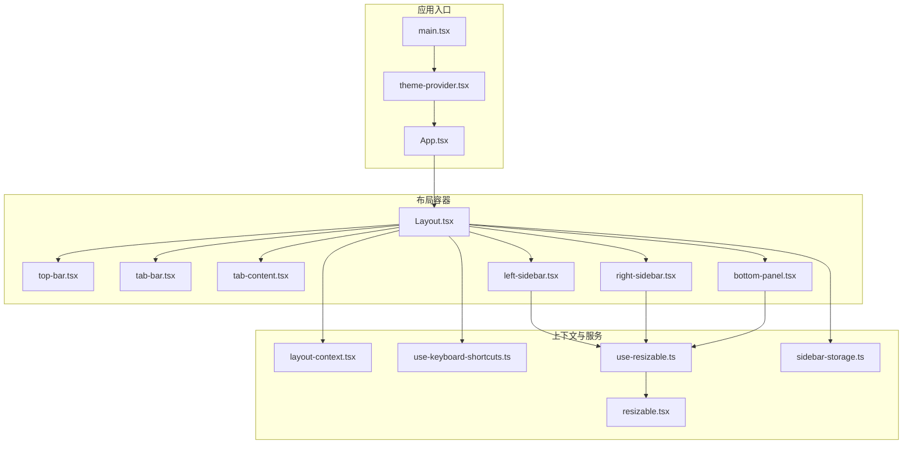
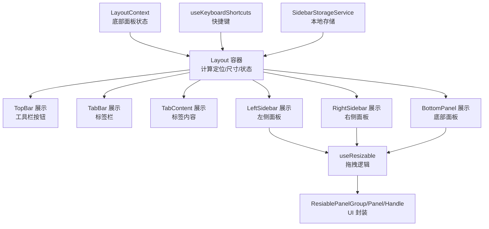
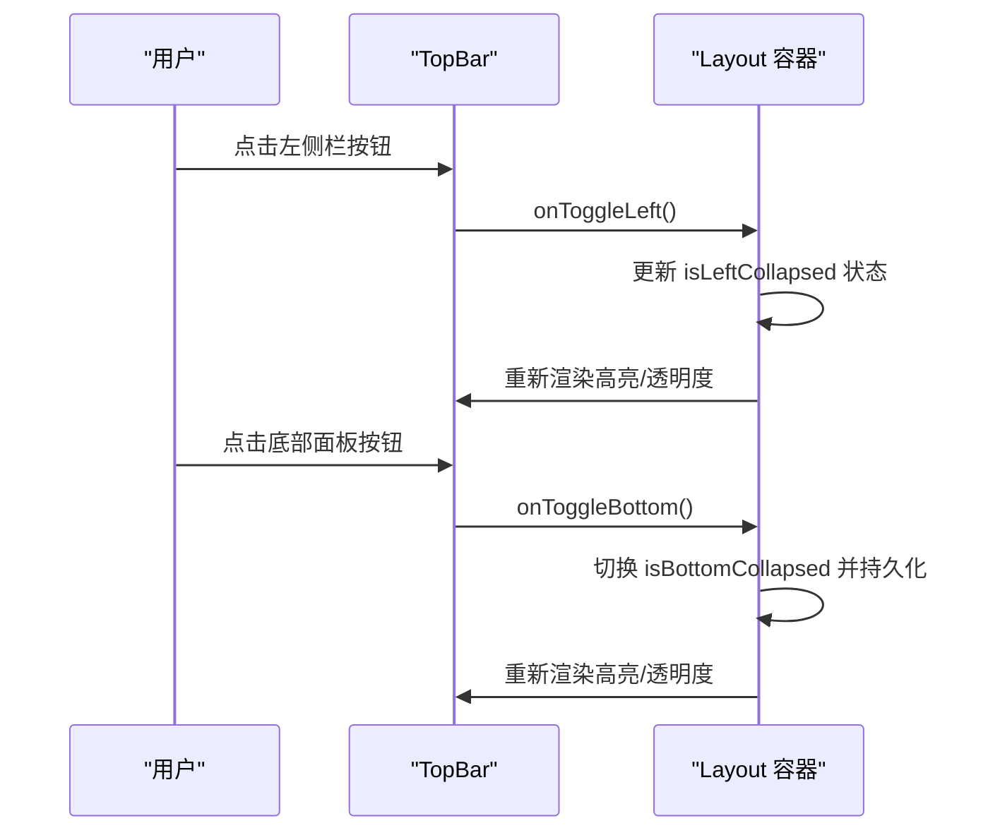
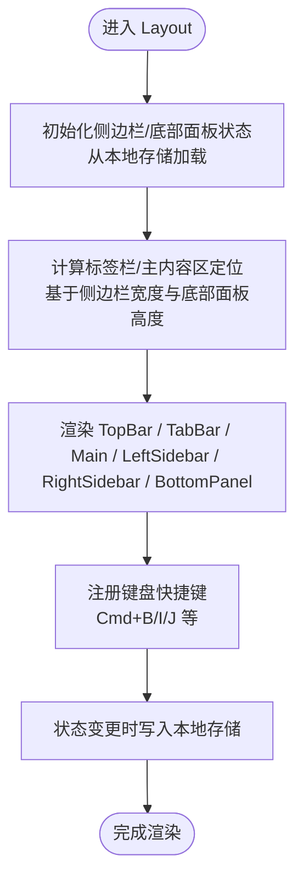
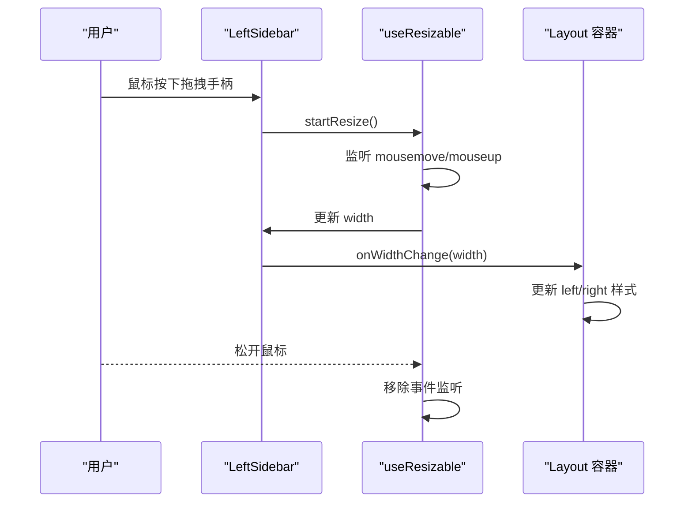
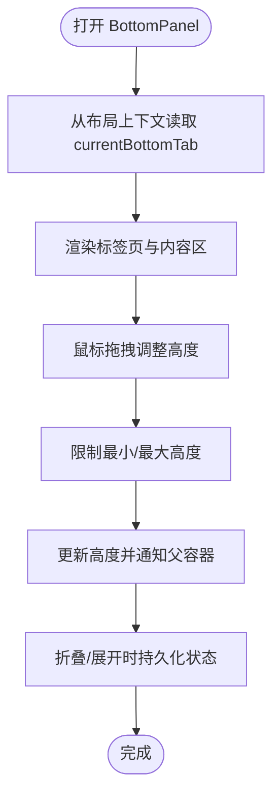
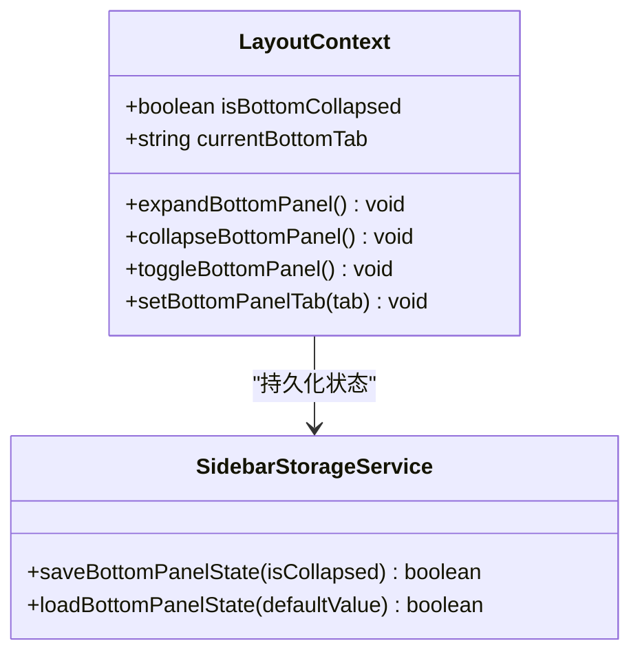
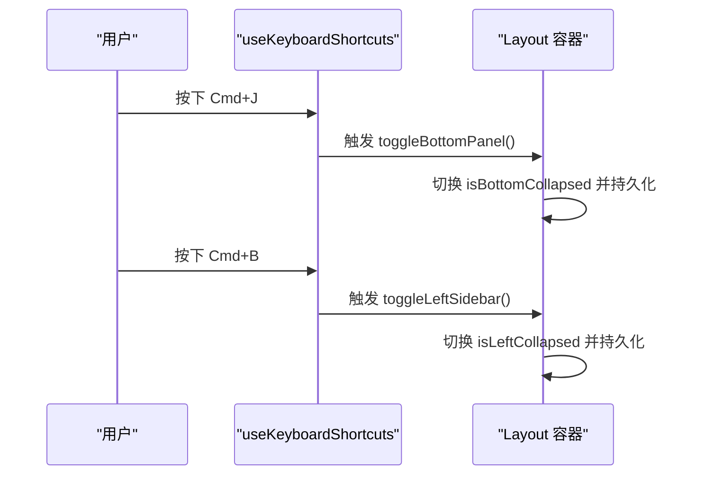
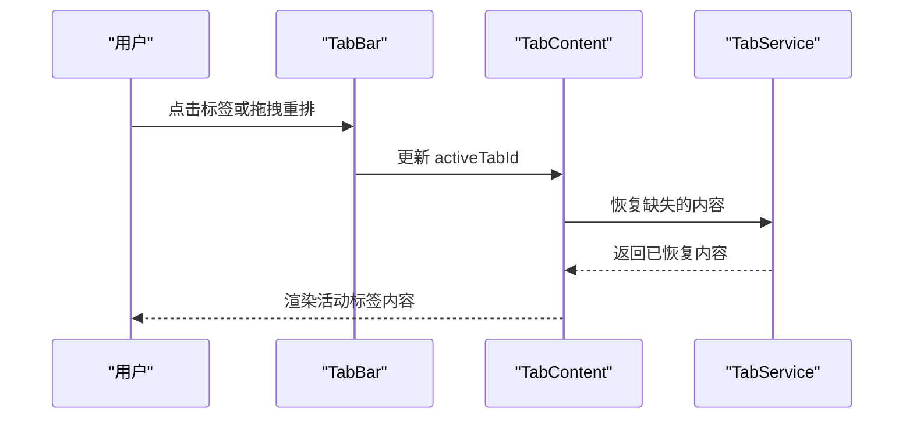
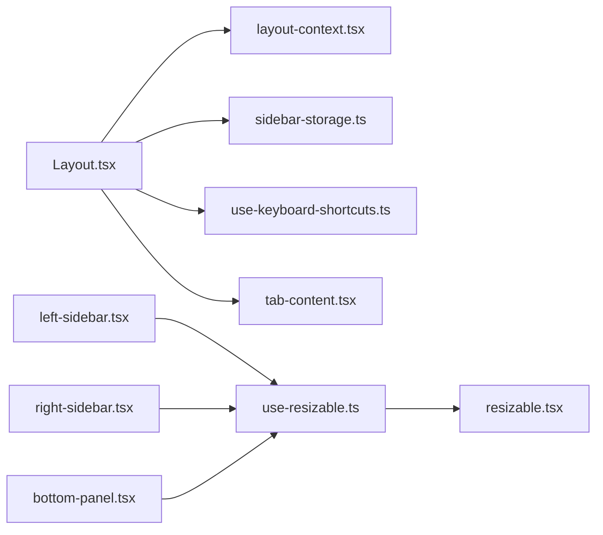

# 布局组件

<cite>
**本文引用的文件**
- [Layout.tsx](file://app/frontend/src/components/Layout.tsx)
- [top-bar.tsx](file://app/frontend/src/components/layout/top-bar.tsx)
- [layout-context.tsx](file://app/frontend/src/contexts/layout-context.tsx)
- [resizable.tsx](file://app/frontend/src/components/ui/resizable.tsx)
- [sidebar.tsx](file://app/frontend/src/components/ui/sidebar.tsx)
- [left-sidebar.tsx](file://app/frontend/src/components/panels/left/left-sidebar.tsx)
- [right-sidebar.tsx](file://app/frontend/src/components/panels/right/right-sidebar.tsx)
- [bottom-panel.tsx](file://app/frontend/src/components/panels/bottom/bottom-panel.tsx)
- [sidebar-storage.ts](file://app/frontend/src/services/sidebar-storage.ts)
- [use-keyboard-shortcuts.ts](file://app/frontend/src/hooks/use-keyboard-shortcuts.ts)
- [use-resizable.ts](file://app/frontend/src/hooks/use-resizable.ts)
- [tab-bar.tsx](file://app/frontend/src/components/tabs/tab-bar.tsx)
- [tab-content.tsx](file://app/frontend/src/components/tabs/tab-content.tsx)
- [App.tsx](file://app/frontend/src/App.tsx)
- [main.tsx](file://app/frontend/src/main.tsx)
- [theme-provider.tsx](file://app/frontend/src/providers/theme-provider.tsx)
- [utils.ts](file://app/frontend/src/lib/utils.ts)
</cite>

## 目录
1. [简介](#简介)
2. [项目结构](#项目结构)
3. [核心组件](#核心组件)
4. [架构总览](#架构总览)
5. [详细组件分析](#详细组件分析)
6. [依赖关系分析](#依赖关系分析)
7. [性能考量](#性能考量)
8. [故障排查指南](#故障排查指南)
9. [结论](#结论)
10. [附录](#附录)

## 简介
本文件系统性梳理前端布局组件的设计与实现，覆盖顶部工具栏、主布局容器、左右侧边栏、底部面板及可调整大小面板等核心模块。重点阐述响应式设计策略、状态管理（本地存储与上下文）、用户交互（拖拽、键盘快捷键）以及与路由/标签页系统的集成方式。同时给出布局组合模式、嵌套布局与动态布局切换的实践建议，并说明与主题系统、样式定制的衔接。

## 项目结构
布局系统位于前端源码的组件层，围绕一个顶层布局容器展开，内部包含顶部工具栏、左右侧边栏、底部面板与主内容区（标签页）。上下文提供者贯穿布局树，负责跨组件的状态共享；服务层负责持久化与数据恢复；自定义 Hook 提供拖拽与快捷键能力；UI 组件库提供可调整大小面板的基础能力。

**图示来源**
- [Layout.tsx:187-201](file://app/frontend/src/components/Layout.tsx#L187-L201)
- [top-bar.tsx:15-87](file://app/frontend/src/components/layout/top-bar.tsx#L15-L87)
- [tab-bar.tsx:23-171](file://app/frontend/src/components/tabs/tab-bar.tsx#L23-L171)
- [tab-content.tsx:11-84](file://app/frontend/src/components/tabs/tab-content.tsx#L11-L84)
- [left-sidebar.tsx:17-101](file://app/frontend/src/components/panels/left/left-sidebar.tsx#L17-L101)
- [right-sidebar.tsx:17-97](file://app/frontend/src/components/panels/right/right-sidebar.tsx#L17-L97)
- [bottom-panel.tsx:19-99](file://app/frontend/src/components/panels/bottom/bottom-panel.tsx#L19-L99)
- [layout-context.tsx:27-68](file://app/frontend/src/contexts/layout-context.tsx#L27-L68)
- [use-keyboard-shortcuts.ts:67-165](file://app/frontend/src/hooks/use-keyboard-shortcuts.ts#L67-L165)
- [use-resizable.ts:13-93](file://app/frontend/src/hooks/use-resizable.ts#L13-L93)
- [resizable.tsx:6-44](file://app/frontend/src/components/ui/resizable.tsx#L6-L44)
- [sidebar-storage.ts:7-237](file://app/frontend/src/services/sidebar-storage.ts#L7-L237)
- [App.tsx:4-11](file://app/frontend/src/App.tsx#L4-L11)
- [main.tsx:10-18](file://app/frontend/src/main.tsx#L10-L18)
- [theme-provider.tsx:8-18](file://app/frontend/src/providers/theme-provider.tsx#L8-L18)

**章节来源**
- [Layout.tsx:187-201](file://app/frontend/src/components/Layout.tsx#L187-L201)
- [App.tsx:4-11](file://app/frontend/src/App.tsx#L4-L11)
- [main.tsx:10-18](file://app/frontend/src/main.tsx#L10-L18)
- [theme-provider.tsx:8-18](file://app/frontend/src/providers/theme-provider.tsx#L8-L18)

## 核心组件
- 顶层布局容器：负责组织顶部工具栏、标签栏、主内容区、左右侧边栏与底部面板，统一注入上下文与服务，计算各区域绝对定位与尺寸。
- 顶部工具栏：提供侧边栏与底部面板的快速开关、设置入口，支持键盘提示与视觉高亮。
- 左右可调整大小侧边栏：支持鼠标拖拽调整宽度，限制最小/最大宽度，联动布局容器更新定位。
- 底部面板：支持垂直拖拽调整高度，限制最小/最大高度，内置输出标签页与关闭按钮。
- 布局上下文：集中管理底部面板折叠状态与当前标签页，持久化到本地存储。
- 键盘快捷键：为侧边栏、底部面板、视图适配等操作提供跨平台快捷键支持。
- 可调整大小面板：基于第三方库封装，提供水平/垂直拖拽与视觉反馈。
- 标签页系统：顶部标签栏承载多标签页，支持拖拽重排、关闭与内容恢复。

**章节来源**
- [Layout.tsx:19-181](file://app/frontend/src/components/Layout.tsx#L19-L181)
- [top-bar.tsx:15-87](file://app/frontend/src/components/layout/top-bar.tsx#L15-L87)
- [left-sidebar.tsx:17-101](file://app/frontend/src/components/panels/left/left-sidebar.tsx#L17-L101)
- [right-sidebar.tsx:17-97](file://app/frontend/src/components/panels/right/right-sidebar.tsx#L17-L97)
- [bottom-panel.tsx:19-99](file://app/frontend/src/components/panels/bottom/bottom-panel.tsx#L19-L99)
- [layout-context.tsx:27-68](file://app/frontend/src/contexts/layout-context.tsx#L27-L68)
- [use-keyboard-shortcuts.ts:67-165](file://app/frontend/src/hooks/use-keyboard-shortcuts.ts#L67-L165)
- [use-resizable.ts:13-93](file://app/frontend/src/hooks/use-resizable.ts#L13-L93)
- [tab-bar.tsx:23-171](file://app/frontend/src/components/tabs/tab-bar.tsx#L23-L171)
- [tab-content.tsx:11-84](file://app/frontend/src/components/tabs/tab-content.tsx#L11-L84)

## 架构总览
布局采用“容器-展示”分层与上下文共享相结合的架构。容器负责状态与布局计算，展示组件专注渲染与交互；通过服务层实现状态持久化；通过 Hook 抽象通用行为（拖拽、快捷键）；通过 UI 组件库提供可调整大小能力。

**图示来源**
- [Layout.tsx:19-181](file://app/frontend/src/components/Layout.tsx#L19-L181)
- [layout-context.tsx:27-68](file://app/frontend/src/contexts/layout-context.tsx#L27-L68)
- [use-keyboard-shortcuts.ts:67-165](file://app/frontend/src/hooks/use-keyboard-shortcuts.ts#L67-L165)
- [sidebar-storage.ts:7-237](file://app/frontend/src/services/sidebar-storage.ts#L7-L237)
- [left-sidebar.tsx:22-32](file://app/frontend/src/components/panels/left/left-sidebar.tsx#L22-L32)
- [right-sidebar.tsx:22-32](file://app/frontend/src/components/panels/right/right-sidebar.tsx#L22-L32)
- [bottom-panel.tsx:27-37](file://app/frontend/src/components/panels/bottom/bottom-panel.tsx#L27-L37)
- [use-resizable.ts:13-93](file://app/frontend/src/hooks/use-resizable.ts#L13-L93)
- [resizable.tsx:6-44](file://app/frontend/src/components/ui/resizable.tsx#L6-L44)

## 详细组件分析

### 顶部工具栏 TopBar
- 职责：提供侧边栏与底部面板的快速开关、设置入口；根据当前折叠状态高亮按钮；显示键盘快捷键提示。
- 交互：按钮点击回调由父容器传入；支持无障碍标题与提示。
- 快捷键：在布局容器中统一注册，避免重复监听。

**图示来源**
- [top-bar.tsx:25-85](file://app/frontend/src/components/layout/top-bar.tsx#L25-L85)
- [Layout.tsx:106-114](file://app/frontend/src/components/Layout.tsx#L106-L114)
- [layout-context.tsx:38-48](file://app/frontend/src/contexts/layout-context.tsx#L38-L48)

**章节来源**
- [top-bar.tsx:15-87](file://app/frontend/src/components/layout/top-bar.tsx#L15-L87)
- [Layout.tsx:106-114](file://app/frontend/src/components/Layout.tsx#L106-L114)
- [layout-context.tsx:38-48](file://app/frontend/src/contexts/layout-context.tsx#L38-L48)

### 主布局容器 Layout
- 职责：统一注入上下文与服务；计算标签栏、主内容区、侧边栏与底部面板的绝对定位与尺寸；处理键盘快捷键；保存侧边栏状态到本地存储。
- 布局策略：使用绝对定位与内边距控制区域位置，确保在折叠/展开时平滑过渡；底部面板高度与侧边栏宽度通过 Hook 动态计算。
- 状态管理：侧边栏折叠状态与底部面板折叠状态分别持久化；TabBar 与 TabContent 的定位基于实际宽度计算。

**图示来源**
- [Layout.tsx:24-62](file://app/frontend/src/components/Layout.tsx#L24-L62)
- [Layout.tsx:65-101](file://app/frontend/src/components/Layout.tsx#L65-L101)
- [Layout.tsx:104-180](file://app/frontend/src/components/Layout.tsx#L104-L180)
- [sidebar-storage.ts:69-118](file://app/frontend/src/services/sidebar-storage.ts#L69-L118)

**章节来源**
- [Layout.tsx:19-181](file://app/frontend/src/components/Layout.tsx#L19-L181)
- [sidebar-storage.ts:69-118](file://app/frontend/src/services/sidebar-storage.ts#L69-L118)

### 左右可调整大小侧边栏
- 职责：承载流程列表与组件列表，支持鼠标拖拽调整宽度；限制最小/最大宽度；将宽度变化通知父容器以更新定位。
- 拖拽实现：使用自定义 Hook 计算鼠标移动距离，限制范围后更新宽度；在拖拽过程中隐藏拖拽手柄以提升体验。
- 交互细节：左/右侧栏拖拽方向不同，需区分计算逻辑；宽度变化通过回调传递给父容器。

**图示来源**
- [left-sidebar.tsx:22-32](file://app/frontend/src/components/panels/left/left-sidebar.tsx#L22-L32)
- [right-sidebar.tsx:22-32](file://app/frontend/src/components/panels/right/right-sidebar.tsx#L22-L32)
- [use-resizable.ts:30-76](file://app/frontend/src/hooks/use-resizable.ts#L30-L76)
- [Layout.tsx:128-132](file://app/frontend/src/components/Layout.tsx#L128-L132)

**章节来源**
- [left-sidebar.tsx:17-101](file://app/frontend/src/components/panels/left/left-sidebar.tsx#L17-L101)
- [right-sidebar.tsx:17-97](file://app/frontend/src/components/panels/right/right-sidebar.tsx#L17-L97)
- [use-resizable.ts:13-93](file://app/frontend/src/hooks/use-resizable.ts#L13-L93)

### 底部面板 BottomPanel
- 职责：承载输出类标签页，支持垂直拖拽调整高度；提供关闭按钮；维护当前底部标签页状态。
- 拖拽实现：使用自定义 Hook 计算拖拽距离，限制最小/最大高度；拖拽时禁用文本选择以提升体验。
- 状态管理：折叠状态由布局上下文管理，切换时持久化；标签页切换通过上下文更新。

**图示来源**
- [bottom-panel.tsx:24-37](file://app/frontend/src/components/panels/bottom/bottom-panel.tsx#L24-L37)
- [layout-context.tsx:50-52](file://app/frontend/src/contexts/layout-context.tsx#L50-L52)
- [use-resizable.ts:47-67](file://app/frontend/src/hooks/use-resizable.ts#L47-L67)
- [Layout.tsx:169-177](file://app/frontend/src/components/Layout.tsx#L169-L177)

**章节来源**
- [bottom-panel.tsx:19-99](file://app/frontend/src/components/panels/bottom/bottom-panel.tsx#L19-L99)
- [layout-context.tsx:27-68](file://app/frontend/src/contexts/layout-context.tsx#L27-L68)
- [use-resizable.ts:13-93](file://app/frontend/src/hooks/use-resizable.ts#L13-L93)

### 布局上下文 LayoutContext
- 职责：集中管理底部面板折叠状态与当前底部标签页；提供切换与设置方法；在状态变更时持久化。
- 设计要点：将状态与副作用解耦，避免在多个组件中重复读写本地存储；提供稳定的 API 供子组件调用。

**图示来源**
- [layout-context.tsx:4-11](file://app/frontend/src/contexts/layout-context.tsx#L4-L11)
- [layout-context.tsx:27-68](file://app/frontend/src/contexts/layout-context.tsx#L27-L68)
- [sidebar-storage.ts:41-49](file://app/frontend/src/services/sidebar-storage.ts#L41-L49)

**章节来源**
- [layout-context.tsx:27-68](file://app/frontend/src/contexts/layout-context.tsx#L27-L68)
- [sidebar-storage.ts:41-49](file://app/frontend/src/services/sidebar-storage.ts#L41-L49)

### 键盘快捷键与拖拽交互
- 快捷键：在布局容器中统一注册，支持 Cmd+B（左）、Cmd+I（右）、Cmd+J（底部）、Cmd+,（设置）等；跨平台兼容。
- 拖拽：使用自定义 Hook 实现鼠标事件监听与边界约束；拖拽过程中禁用文本选择，提升交互体验。

**图示来源**
- [use-keyboard-shortcuts.ts:67-165](file://app/frontend/src/hooks/use-keyboard-shortcuts.ts#L67-L165)
- [Layout.tsx:44-53](file://app/frontend/src/components/Layout.tsx#L44-L53)
- [layout-context.tsx:38-48](file://app/frontend/src/contexts/layout-context.tsx#L38-L48)

**章节来源**
- [use-keyboard-shortcuts.ts:67-165](file://app/frontend/src/hooks/use-keyboard-shortcuts.ts#L67-L165)
- [Layout.tsx:44-53](file://app/frontend/src/components/Layout.tsx#L44-L53)

### 标签页系统与内容区
- 标签栏：支持拖拽重排、悬停关闭按钮、活动状态高亮；图标按类型区分。
- 内容区：根据活动标签动态渲染；支持从本地存储恢复内容，避免每次重新加载。

**图示来源**
- [tab-bar.tsx:32-65](file://app/frontend/src/components/tabs/tab-bar.tsx#L32-L65)
- [tab-content.tsx:17-40](file://app/frontend/src/components/tabs/tab-content.tsx#L17-L40)

**章节来源**
- [tab-bar.tsx:23-171](file://app/frontend/src/components/tabs/tab-bar.tsx#L23-L171)
- [tab-content.tsx:11-84](file://app/frontend/src/components/tabs/tab-content.tsx#L11-L84)

## 依赖关系分析
- 上下文依赖：Layout 容器依赖 LayoutContext 管理底部面板状态；TopBar 依赖 Layout 容器提供的回调。
- 服务依赖：SidebarStorageService 负责本地存储；TabService 负责标签内容恢复。
- Hook 依赖：use-resizable 提供拖拽能力；use-keyboard-shortcuts 提供快捷键能力。
- UI 依赖：resizable.tsx 封装第三方可调整大小面板；sidebar.tsx 提供侧边栏基础组件（本项目主要使用自定义侧边栏而非该 UI 组件）。

**图示来源**
- [Layout.tsx:19-181](file://app/frontend/src/components/Layout.tsx#L19-L181)
- [layout-context.tsx:27-68](file://app/frontend/src/contexts/layout-context.tsx#L27-L68)
- [sidebar-storage.ts:7-237](file://app/frontend/src/services/sidebar-storage.ts#L7-L237)
- [use-keyboard-shortcuts.ts:67-165](file://app/frontend/src/hooks/use-keyboard-shortcuts.ts#L67-L165)
- [left-sidebar.tsx:22-32](file://app/frontend/src/components/panels/left/left-sidebar.tsx#L22-L32)
- [right-sidebar.tsx:22-32](file://app/frontend/src/components/panels/right/right-sidebar.tsx#L22-L32)
- [bottom-panel.tsx:27-37](file://app/frontend/src/components/panels/bottom/bottom-panel.tsx#L27-L37)
- [use-resizable.ts:13-93](file://app/frontend/src/hooks/use-resizable.ts#L13-L93)
- [resizable.tsx:6-44](file://app/frontend/src/components/ui/resizable.tsx#L6-L44)

**章节来源**
- [Layout.tsx:19-181](file://app/frontend/src/components/Layout.tsx#L19-L181)
- [sidebar-storage.ts:7-237](file://app/frontend/src/services/sidebar-storage.ts#L7-L237)
- [use-resizable.ts:13-93](file://app/frontend/src/hooks/use-resizable.ts#L13-L93)

## 性能考量
- 事件监听：拖拽与键盘快捷键均在组件挂载时注册，卸载时清理，避免内存泄漏。
- 状态持久化：仅在状态变更时写入本地存储，减少 IO 次数。
- 渲染优化：使用绝对定位与最小化样式更新，避免频繁重排；拖拽过程禁用文本选择，降低不必要的重绘。
- 懒加载：标签内容按需恢复，避免一次性加载所有内容。

[本节为通用指导，无需列出具体文件来源]

## 故障排查指南
- 侧边栏/底部面板状态未持久化
  - 检查本地存储键名是否正确；确认状态变更时是否触发持久化。
  - 参考：[sidebar-storage.ts:15-49](file://app/frontend/src/services/sidebar-storage.ts#L15-L49)
- 拖拽无效或边界异常
  - 检查 use-resizable 的最小/最大值配置；确认事件监听是否正确移除。
  - 参考：[use-resizable.ts:13-93](file://app/frontend/src/hooks/use-resizable.ts#L13-L93)
- 键盘快捷键不生效
  - 检查修饰键匹配逻辑；确认事件绑定与解绑是否成对出现。
  - 参考：[use-keyboard-shortcuts.ts:17-50](file://app/frontend/src/hooks/use-keyboard-shortcuts.ts#L17-L50)
- 标签内容未恢复
  - 检查 TabService 的恢复逻辑；确认活动标签是否存在且内容为空。
  - 参考：[tab-content.tsx:17-40](file://app/frontend/src/components/tabs/tab-content.tsx#L17-L40)

**章节来源**
- [sidebar-storage.ts:15-49](file://app/frontend/src/services/sidebar-storage.ts#L15-L49)
- [use-resizable.ts:13-93](file://app/frontend/src/hooks/use-resizable.ts#L13-L93)
- [use-keyboard-shortcuts.ts:17-50](file://app/frontend/src/hooks/use-keyboard-shortcuts.ts#L17-L50)
- [tab-content.tsx:17-40](file://app/frontend/src/components/tabs/tab-content.tsx#L17-L40)

## 结论
该布局系统通过容器-展示分离、上下文共享与服务持久化，实现了稳定、可扩展的桌面级工作区布局。侧边栏与底部面板的可调整大小能力、顶部工具栏的快捷操作与标签页系统共同构成了高效的工作流。建议在后续迭代中进一步完善移动端适配、主题一致性与无障碍访问细节。

[本节为总结性内容，无需列出具体文件来源]

## 附录

### 布局组合模式与嵌套布局
- 组合模式：将多个面板作为独立组件组合，通过容器统一管理尺寸与定位；每个面板可独立扩展功能。
- 嵌套布局：可在主布局容器内再嵌套子布局组件，用于特定场景（如流程编辑器内的子面板）。
- 动态布局切换：通过状态切换不同面板的可见性与尺寸，结合动画实现平滑过渡。

[本节为概念性内容，无需列出具体文件来源]

### 与路由系统的集成与状态同步
- 当前实现中，布局与标签页系统通过上下文与服务进行状态同步；若引入路由系统，建议将活动标签与路由参数映射，实现刷新后状态恢复与分享链接。
- 同步机制建议：路由变化时读取查询参数更新活动标签；标签变化时更新路由参数；必要时使用浏览器历史 API 保持前后可追溯。

[本节为概念性内容，无需列出具体文件来源]