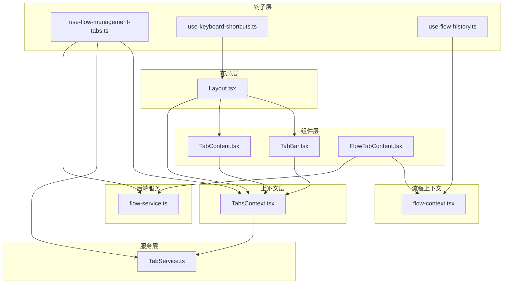
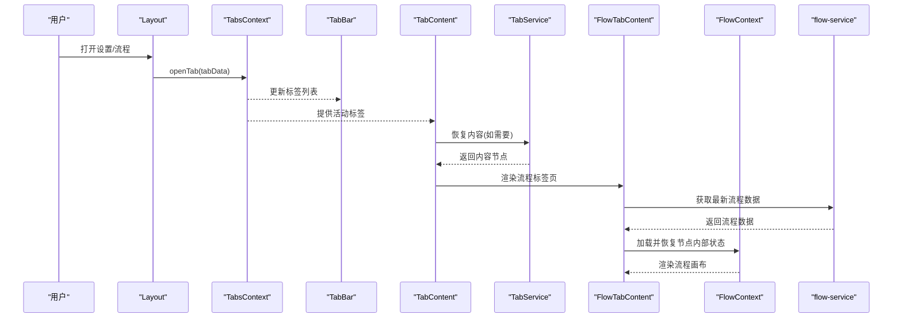
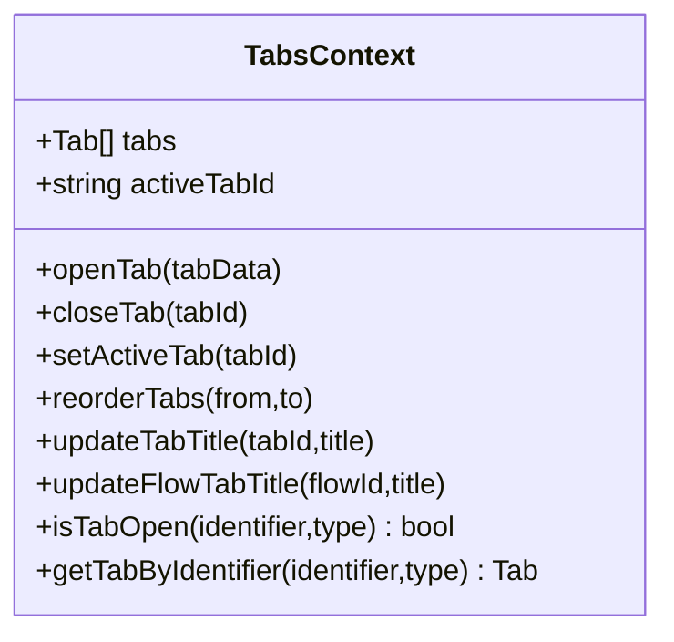
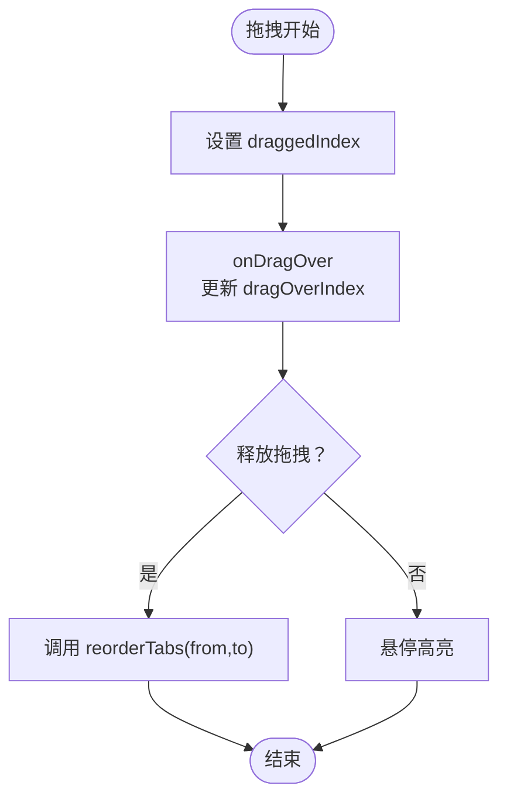
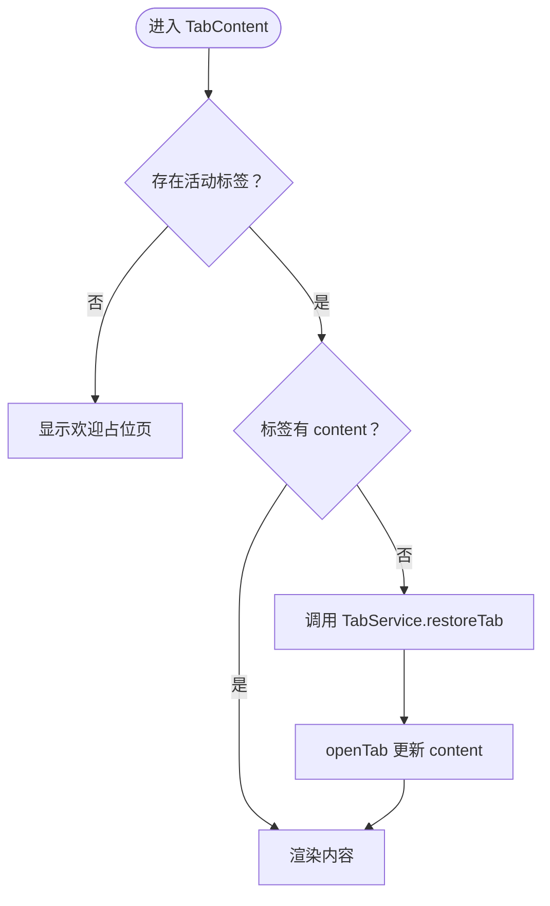
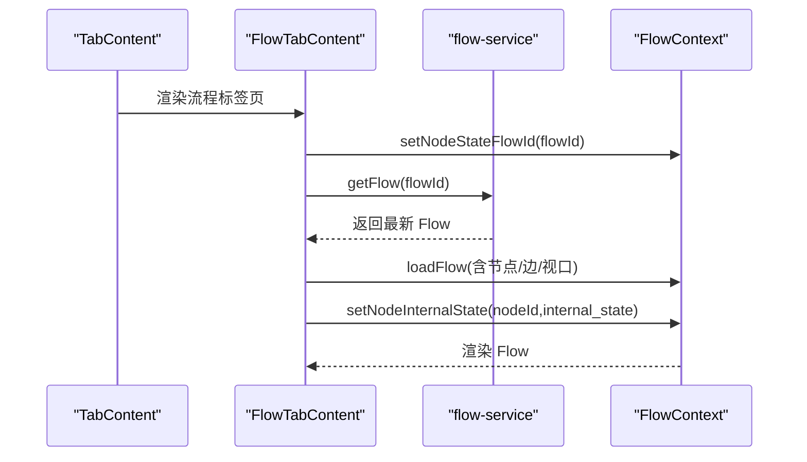
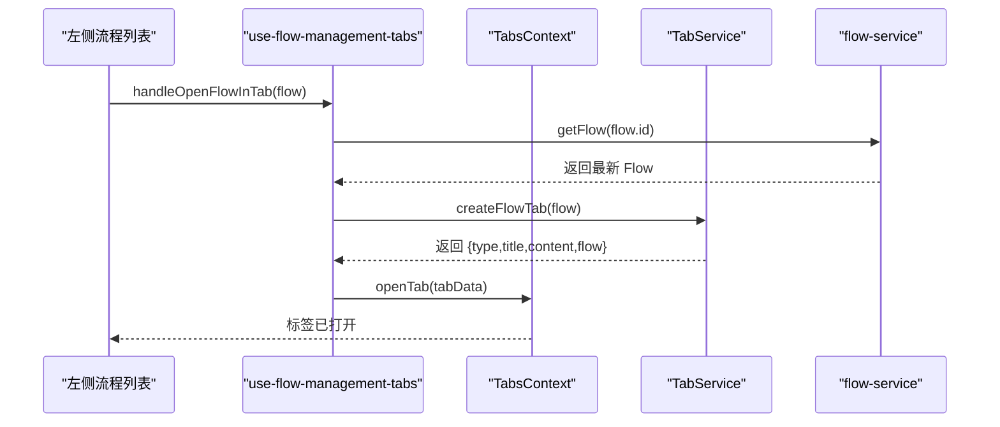
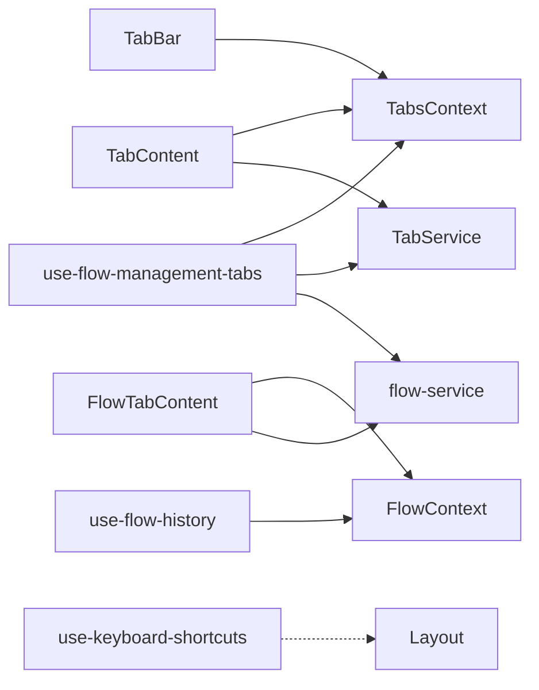

# 标签页系统

<cite>
**本文引用的文件**
- [app/frontend/src/components/tabs/tab-bar.tsx](file://app/frontend/src/components/tabs/tab-bar.tsx)
- [app/frontend/src/components/tabs/tab-content.tsx](file://app/frontend/src/components/tabs/tab-content.tsx)
- [app/frontend/src/components/tabs/flow-tab-content.tsx](file://app/frontend/src/components/tabs/flow-tab-content.tsx)
- [app/frontend/src/contexts/tabs-context.tsx](file://app/frontend/src/contexts/tabs-context.tsx)
- [app/frontend/src/services/tab-service.ts](file://app/frontend/src/services/tab-service.ts)
- [app/frontend/src/hooks/use-flow-management-tabs.ts](file://app/frontend/src/hooks/use-flow-management-tabs.ts)
- [app/frontend/src/hooks/use-keyboard-shortcuts.ts](file://app/frontend/src/hooks/use-keyboard-shortcuts.ts)
- [app/frontend/src/components/Layout.tsx](file://app/frontend/src/components/Layout.tsx)
- [app/frontend/src/hooks/use-flow-history.ts](file://app/frontend/src/hooks/use-flow-history.ts)
- [app/frontend/src/contexts/flow-context.tsx](file://app/frontend/src/contexts/flow-context.tsx)
- [app/frontend/src/services/flow-service.ts](file://app/frontend/src/services/flow-service.ts)
</cite>

## 目录
1. [简介](#简介)
2. [项目结构](#项目结构)
3. [核心组件](#核心组件)
4. [架构总览](#架构总览)
5. [详细组件分析](#详细组件分析)
6. [依赖关系分析](#依赖关系分析)
7. [性能考虑](#性能考虑)
8. [故障排查指南](#故障排查指南)
9. [结论](#结论)
10. [附录](#附录)

## 简介
本文件系统性阐述前端标签页系统的实现，覆盖标签页容器、标签栏与标签内容三部分，重点说明标签页的创建、切换、关闭与重新排列；解释状态管理、内容缓存与懒加载机制；给出属性配置、事件处理与键盘快捷键支持；提供标签页组合使用、动态标签管理与标签间通信的实现方案，并说明与路由系统的集成与历史记录管理。

## 项目结构
标签页系统由以下层次构成：
- 布局层：负责整体布局与键盘快捷键绑定，承载标签栏与内容区
- 上下文层：集中管理标签集合、活动标签、持久化与操作方法
- 服务层：根据标签类型生成内容节点，支持恢复与重建
- 组件层：标签栏渲染、标签内容展示、流程标签页专用内容
- 钩子层：与流程上下文、节点状态、历史记录等联动

图表来源
- [app/frontend/src/components/Layout.tsx:18-201](file://app/frontend/src/components/Layout.tsx#L18-L201)
- [app/frontend/src/contexts/tabs-context.tsx:59-271](file://app/frontend/src/contexts/tabs-context.tsx#L59-L271)
- [app/frontend/src/services/tab-service.ts:13-68](file://app/frontend/src/services/tab-service.ts#L13-L68)
- [app/frontend/src/components/tabs/tab-bar.tsx:23-171](file://app/frontend/src/components/tabs/tab-bar.tsx#L23-L171)
- [app/frontend/src/components/tabs/tab-content.tsx:11-84](file://app/frontend/src/components/tabs/tab-content.tsx#L11-L84)
- [app/frontend/src/components/tabs/flow-tab-content.tsx:17-82](file://app/frontend/src/components/tabs/flow-tab-content.tsx#L17-L82)
- [app/frontend/src/hooks/use-flow-management-tabs.ts:45-337](file://app/frontend/src/hooks/use-flow-management-tabs.ts#L45-L337)
- [app/frontend/src/hooks/use-keyboard-shortcuts.ts:17-165](file://app/frontend/src/hooks/use-keyboard-shortcuts.ts#L17-L165)
- [app/frontend/src/hooks/use-flow-history.ts:15-171](file://app/frontend/src/hooks/use-flow-history.ts#L15-L171)
- [app/frontend/src/contexts/flow-context.tsx:35-358](file://app/frontend/src/contexts/flow-context.tsx#L35-L358)
- [app/frontend/src/services/flow-service.ts:27-108](file://app/frontend/src/services/flow-service.ts#L27-L108)

章节来源
- [app/frontend/src/components/Layout.tsx:18-201](file://app/frontend/src/components/Layout.tsx#L18-L201)
- [app/frontend/src/contexts/tabs-context.tsx:59-271](file://app/frontend/src/contexts/tabs-context.tsx#L59-L271)

## 核心组件
- 标签上下文（TabsProvider/TabsContext）：维护标签数组、活动标签ID、打开/关闭/重排/更新标题等操作，并通过 localStorage 实现跨会话持久化
- 标签栏（TabBar）：渲染标签项、拖拽重排、点击切换、悬停关闭按钮
- 标签内容（TabContent）：根据活动标签显示内容，支持从 localStorage 恢复内容
- 流程标签内容（FlowTabContent）：在激活时拉取最新流程数据并恢复节点内部状态
- 标签服务（TabService）：按类型创建内容节点，支持恢复
- 流程管理钩子（use-flow-management-tabs）：封装打开/保存/删除流程到标签页的逻辑
- 键盘快捷键（use-keyboard-shortcuts）：统一处理全局快捷键
- 历史记录钩子（use-flow-history）：为流程编辑提供快照与撤销/重做能力

章节来源
- [app/frontend/src/contexts/tabs-context.tsx:27-271](file://app/frontend/src/contexts/tabs-context.tsx#L27-L271)
- [app/frontend/src/components/tabs/tab-bar.tsx:23-171](file://app/frontend/src/components/tabs/tab-bar.tsx#L23-L171)
- [app/frontend/src/components/tabs/tab-content.tsx:11-84](file://app/frontend/src/components/tabs/tab-content.tsx#L11-L84)
- [app/frontend/src/components/tabs/flow-tab-content.tsx:17-82](file://app/frontend/src/components/tabs/flow-tab-content.tsx#L17-L82)
- [app/frontend/src/services/tab-service.ts:13-68](file://app/frontend/src/services/tab-service.ts#L13-L68)
- [app/frontend/src/hooks/use-flow-management-tabs.ts:45-337](file://app/frontend/src/hooks/use-flow-management-tabs.ts#L45-L337)
- [app/frontend/src/hooks/use-keyboard-shortcuts.ts:17-165](file://app/frontend/src/hooks/use-keyboard-shortcuts.ts#L17-L165)
- [app/frontend/src/hooks/use-flow-history.ts:15-171](file://app/frontend/src/hooks/use-flow-history.ts#L15-L171)

## 架构总览
标签页系统采用“上下文驱动 + 服务生成 + 组件渲染”的分层设计：
- 上下文层集中管理标签状态与持久化
- 服务层负责内容节点的创建与恢复
- 组件层负责 UI 行为与交互
- 钩子层连接业务逻辑（流程、历史、快捷键）

图表来源
- [app/frontend/src/components/Layout.tsx:38-41](file://app/frontend/src/components/Layout.tsx#L38-L41)
- [app/frontend/src/contexts/tabs-context.tsx:154-177](file://app/frontend/src/contexts/tabs-context.tsx#L154-L177)
- [app/frontend/src/components/tabs/tab-content.tsx:17-40](file://app/frontend/src/components/tabs/tab-content.tsx#L17-L40)
- [app/frontend/src/services/tab-service.ts:47-67](file://app/frontend/src/services/tab-service.ts#L47-L67)
- [app/frontend/src/components/tabs/flow-tab-content.tsx:55-75](file://app/frontend/src/components/tabs/flow-tab-content.tsx#L55-L75)
- [app/frontend/src/contexts/flow-context.tsx:134-188](file://app/frontend/src/contexts/flow-context.tsx#L134-L188)
- [app/frontend/src/services/flow-service.ts:37-44](file://app/frontend/src/services/flow-service.ts#L37-L44)

## 详细组件分析

### 标签上下文（TabsContext）
- 责任边界
  - 维护标签数组与活动标签ID
  - 提供打开/关闭/重排/更新标题等操作
  - 通过 localStorage 持久化标签元数据（不含内容），避免内存膨胀
- 关键点
  - 生成唯一标签ID（如 flow-{id}、settings）
  - 拖拽重排仅更新顺序，不改变内容
  - 关闭活动标签时自动选择相邻标签或置空
  - 标题更新同时同步 flow 对象的名称字段
- 复杂度
  - 打开/关闭/重排均为 O(n) 列表操作
  - 按标识符查找为 O(n)，可结合索引优化（当前未实现）

图表来源
- [app/frontend/src/contexts/tabs-context.tsx:27-271](file://app/frontend/src/contexts/tabs-context.tsx#L27-L271)

章节来源
- [app/frontend/src/contexts/tabs-context.tsx:59-271](file://app/frontend/src/contexts/tabs-context.tsx#L59-L271)

### 标签栏（TabBar）
- 责任边界
  - 渲染标签项（图标、标题、关闭按钮）
  - 支持拖拽重排与悬停样式
  - 点击切换活动标签
- 交互细节
  - 拖拽开始/结束设置状态，拖拽中高亮目标位置
  - 鼠标悬停显示关闭按钮，阻止拖拽冲突
  - 活动标签显示强调条与图标颜色变化
- 性能
  - 使用受控拖拽状态，避免重复渲染
  - 标签项最小宽度与最大宽度限制，防止溢出

图表来源
- [app/frontend/src/components/tabs/tab-bar.tsx:32-65](file://app/frontend/src/components/tabs/tab-bar.tsx#L32-L65)

章节来源
- [app/frontend/src/components/tabs/tab-bar.tsx:23-171](file://app/frontend/src/components/tabs/tab-bar.tsx#L23-L171)

### 标签内容（TabContent）
- 责任边界
  - 展示当前活动标签内容
  - 从 localStorage 恢复缺失的内容（懒加载）
- 懒加载与缓存
  - 若活动标签无 content，则尝试通过 TabService 恢复
  - 恢复期间显示加载提示
- 无活动标签时的占位页

图表来源
- [app/frontend/src/components/tabs/tab-content.tsx:17-40](file://app/frontend/src/components/tabs/tab-content.tsx#L17-L40)
- [app/frontend/src/services/tab-service.ts:47-67](file://app/frontend/src/services/tab-service.ts#L47-L67)

章节来源
- [app/frontend/src/components/tabs/tab-content.tsx:11-84](file://app/frontend/src/components/tabs/tab-content.tsx#L11-L84)
- [app/frontend/src/services/tab-service.ts:13-68](file://app/frontend/src/services/tab-service.ts#L13-L68)

### 流程标签内容（FlowTabContent）
- 责任边界
  - 在标签激活时拉取最新流程数据并渲染
  - 恢复节点内部状态（配置类状态），不恢复运行时状态
- 状态管理
  - 设置节点状态隔离的 flowId
  - 仅恢复 internal_state（来自 use-node-state 的配置数据）
  - 不恢复 nodeContextData（运行时消息、分析结果等）
- 数据一致性
  - 优先从后端获取最新数据，失败时回退到本地缓存数据

图表来源
- [app/frontend/src/components/tabs/flow-tab-content.tsx:21-53](file://app/frontend/src/components/tabs/flow-tab-content.tsx#L21-L53)
- [app/frontend/src/contexts/flow-context.tsx:134-188](file://app/frontend/src/contexts/flow-context.tsx#L134-L188)
- [app/frontend/src/services/flow-service.ts:37-44](file://app/frontend/src/services/flow-service.ts#L37-L44)

章节来源
- [app/frontend/src/components/tabs/flow-tab-content.tsx:17-82](file://app/frontend/src/components/tabs/flow-tab-content.tsx#L17-L82)
- [app/frontend/src/contexts/flow-context.tsx:35-358](file://app/frontend/src/contexts/flow-context.tsx#L35-L358)
- [app/frontend/src/services/flow-service.ts:27-108](file://app/frontend/src/services/flow-service.ts#L27-L108)

### 标签服务（TabService）
- 责任边界
  - 根据标签类型创建内容节点
  - 支持恢复流程标签与设置标签
- 设计要点
  - 将内容以 ReactNode 形式返回，便于懒加载与延迟渲染
  - 恢复时仅重建内容节点，不改变标签元数据

章节来源
- [app/frontend/src/services/tab-service.ts:13-68](file://app/frontend/src/services/tab-service.ts#L13-L68)

### 流程管理钩子（use-flow-management-tabs）
- 责任边界
  - 将流程列表与标签页系统打通
  - 提供打开/保存/删除流程到标签页的完整流程
- 关键流程
  - 打开流程：获取最新数据，创建标签数据，调用 openTab
  - 保存流程：合并节点内部状态与节点上下文数据，更新后刷新列表
  - 删除流程：关闭对应标签并清理节点状态
- 与历史记录协作
  - 通过 use-flow-history 为流程编辑提供快照与撤销/重做

图表来源
- [app/frontend/src/hooks/use-flow-management-tabs.ts:212-278](file://app/frontend/src/hooks/use-flow-management-tabs.ts#L212-L278)
- [app/frontend/src/services/tab-service.ts:30-45](file://app/frontend/src/services/tab-service.ts#L30-L45)
- [app/frontend/src/services/flow-service.ts:37-44](file://app/frontend/src/services/flow-service.ts#L37-L44)

章节来源
- [app/frontend/src/hooks/use-flow-management-tabs.ts:45-337](file://app/frontend/src/hooks/use-flow-management-tabs.ts#L45-L337)

### 键盘快捷键（use-keyboard-shortcuts）
- 责任边界
  - 统一注册与匹配快捷键，支持 Ctrl/Cmd 组合
  - 提供布局与流程专用快捷键钩子
- 应用场景
  - 打开设置标签页（Cmd+, 或 Ctrl+,）
  - 切换侧边栏与底部面板
  - 保存流程（Cmd/Ctrl+S）

章节来源
- [app/frontend/src/hooks/use-keyboard-shortcuts.ts:17-165](file://app/frontend/src/hooks/use-keyboard-shortcuts.ts#L17-L165)
- [app/frontend/src/components/Layout.tsx:44-53](file://app/frontend/src/components/Layout.tsx#L44-L53)

### 历史记录（use-flow-history）
- 责任边界
  - 为流程编辑提供快照、撤销与重做
  - 自动去重（忽略仅 UI 变化的快照）
- 与标签页的关系
  - 标签页切换不影响历史记录，但可在同一标签页内进行撤销/重做

章节来源
- [app/frontend/src/hooks/use-flow-history.ts:15-171](file://app/frontend/src/hooks/use-flow-history.ts#L15-L171)
- [app/frontend/src/contexts/flow-context.tsx:75-131](file://app/frontend/src/contexts/flow-context.tsx#L75-L131)

## 依赖关系分析
- 组件依赖
  - TabBar 依赖 TabsContext 进行状态读写与操作
  - TabContent 依赖 TabsContext 与 TabService
  - FlowTabContent 依赖 FlowContext 与 flow-service
- 钩子依赖
  - use-flow-management-tabs 依赖 TabsContext、TabService、flow-service
  - use-keyboard-shortcuts 为全局监听，不直接依赖具体组件
  - use-flow-history 依赖 FlowContext 与 @xyflow/react
- 上下文耦合
  - TabsContext 与 TabService 解耦，通过 ReactNode 作为桥接
  - FlowContext 与 FlowTabContent 解耦，通过接口方法暴露能力

图表来源
- [app/frontend/src/components/tabs/tab-bar.tsx:23-24](file://app/frontend/src/components/tabs/tab-bar.tsx#L23-L24)
- [app/frontend/src/components/tabs/tab-content.tsx:12-14](file://app/frontend/src/components/tabs/tab-content.tsx#L12-L14)
- [app/frontend/src/components/tabs/flow-tab-content.tsx:18-19](file://app/frontend/src/components/tabs/flow-tab-content.tsx#L18-L19)
- [app/frontend/src/hooks/use-flow-management-tabs.ts:47-49](file://app/frontend/src/hooks/use-flow-management-tabs.ts#L47-L49)
- [app/frontend/src/hooks/use-keyboard-shortcuts.ts:17-165](file://app/frontend/src/hooks/use-keyboard-shortcuts.ts#L17-L165)
- [app/frontend/src/hooks/use-flow-history.ts:15-171](file://app/frontend/src/hooks/use-flow-history.ts#L15-L171)

章节来源
- [app/frontend/src/components/tabs/tab-bar.tsx:23-171](file://app/frontend/src/components/tabs/tab-bar.tsx#L23-L171)
- [app/frontend/src/components/tabs/tab-content.tsx:11-84](file://app/frontend/src/components/tabs/tab-content.tsx#L11-L84)
- [app/frontend/src/components/tabs/flow-tab-content.tsx:17-82](file://app/frontend/src/components/tabs/flow-tab-content.tsx#L17-L82)
- [app/frontend/src/hooks/use-flow-management-tabs.ts:45-337](file://app/frontend/src/hooks/use-flow-management-tabs.ts#L45-L337)
- [app/frontend/src/hooks/use-keyboard-shortcuts.ts:17-165](file://app/frontend/src/hooks/use-keyboard-shortcuts.ts#L17-L165)
- [app/frontend/src/hooks/use-flow-history.ts:15-171](file://app/frontend/src/hooks/use-flow-history.ts#L15-L171)

## 性能考虑
- 内存与渲染
  - 标签内容仅在激活时恢复，避免一次性渲染所有标签内容
  - localStorage 存储标签元数据，减少内存占用
- 计算复杂度
  - 标签操作（打开/关闭/重排）为 O(n)，建议在标签数量较多时增加索引映射
- 网络与一致性
  - 流程标签激活时优先拉取最新数据，失败时回退缓存，保证可用性
- 交互流畅性
  - 拖拽重排使用受控状态，避免频繁重渲染
  - 悬停关闭按钮与样式切换使用 CSS 过渡，保持顺滑

## 故障排查指南
- 打不开标签或内容为空
  - 检查 TabsContext 是否正确初始化与持久化
  - 确认 TabContent 的恢复逻辑是否执行
- 拖拽重排无效
  - 确认 TabBar 的拖拽事件回调是否触发 reorderTabs
  - 检查浏览器兼容性与 dataTransfer 配置
- 流程标签内容未更新
  - 确认 FlowTabContent 的激活副作用是否执行
  - 检查 flow-service 的网络请求与错误处理
- 快捷键无效
  - 确认 use-keyboard-shortcuts 的监听是否注册
  - 检查 preventDefault 是否影响默认行为

章节来源
- [app/frontend/src/components/tabs/tab-bar.tsx:32-65](file://app/frontend/src/components/tabs/tab-bar.tsx#L32-L65)
- [app/frontend/src/components/tabs/tab-content.tsx:17-40](file://app/frontend/src/components/tabs/tab-content.tsx#L17-L40)
- [app/frontend/src/components/tabs/flow-tab-content.tsx:55-75](file://app/frontend/src/components/tabs/flow-tab-content.tsx#L55-L75)
- [app/frontend/src/hooks/use-keyboard-shortcuts.ts:17-50](file://app/frontend/src/hooks/use-keyboard-shortcuts.ts#L17-L50)

## 结论
该标签页系统通过上下文驱动、服务生成与组件渲染的分层设计，实现了标签的创建、切换、关闭与重新排列；通过 localStorage 与 TabService 的配合，实现了内容的懒加载与恢复；结合流程上下文与历史记录钩子，提供了稳定的流程编辑体验。未来可进一步引入标签索引、内容预加载策略与更丰富的标签间通信机制。

## 附录

### 标签页属性配置与事件
- 标签类型
  - flow：流程标签，携带 Flow 对象与内部状态
  - settings：设置标签，用于偏好配置
- 标签属性
  - id：唯一标识（自动生成）
  - type：标签类型
  - title：显示标题
  - content：内容节点（可为空，懒加载）
  - flow：流程标签携带的 Flow 对象
  - metadata：其他标签的扩展元数据
- 事件与动作
  - 打开标签：openTab
  - 关闭标签：closeTab
  - 切换活动标签：setActiveTab
  - 重排标签：reorderTabs
  - 更新标题：updateTabTitle/updateFlowTabTitle

章节来源
- [app/frontend/src/contexts/tabs-context.tsx:7-39](file://app/frontend/src/contexts/tabs-context.tsx#L7-L39)
- [app/frontend/src/services/tab-service.ts:6-11](file://app/frontend/src/services/tab-service.ts#L6-L11)

### 键盘快捷键支持
- 常用快捷键
  - 打开设置：Cmd+, 或 Ctrl+,
  - 切换右侧侧边栏：Cmd+I 或 Ctrl+I
  - 切换左侧侧边栏：Cmd+B 或 Ctrl+B
  - 适配视图：Cmd+O 或 Ctrl+O
  - 切换底部面板：Cmd+J 或 Ctrl+J
  - 保存流程：Cmd/Ctrl+S
- 实现要点
  - use-keyboard-shortcuts 统一处理修饰键匹配
  - Layout 中绑定回调函数

章节来源
- [app/frontend/src/hooks/use-keyboard-shortcuts.ts:53-165](file://app/frontend/src/hooks/use-keyboard-shortcuts.ts#L53-L165)
- [app/frontend/src/components/Layout.tsx:44-53](file://app/frontend/src/components/Layout.tsx#L44-L53)

### 标签页与路由系统集成
- 当前实现
  - 标签页状态通过 TabsContext 与 localStorage 管理，未直接依赖前端路由
  - 通过 openTab 与 TabService 创建标签，无需路由参数
- 建议集成方式
  - 可在路由变更时读取 URL 参数，调用 openTab 打开对应标签
  - 使用 history API 同步标签切换到浏览器历史，支持前进/后退

[本节为概念性建议，不直接分析具体文件]

### 动态标签管理与标签间通信
- 动态标签管理
  - 通过 isTabOpen 与 getTabByIdentifier 查询现有标签
  - 通过 updateTabTitle 与 updateFlowTabTitle 更新标题
- 标签间通信
  - 可通过 TabsContext 暴露的方法在标签间共享状态
  - 建议引入事件总线或上下文共享，避免组件间直接耦合

[本节为概念性建议，不直接分析具体文件]