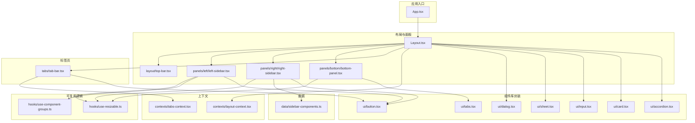
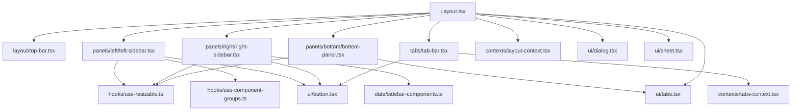
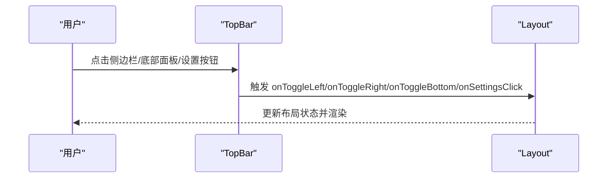
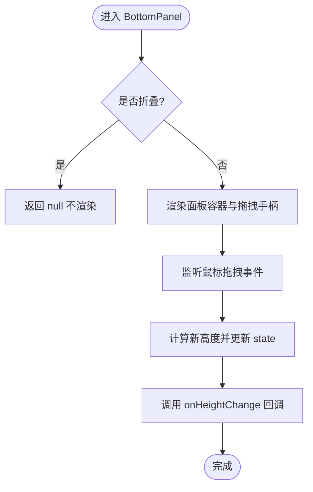
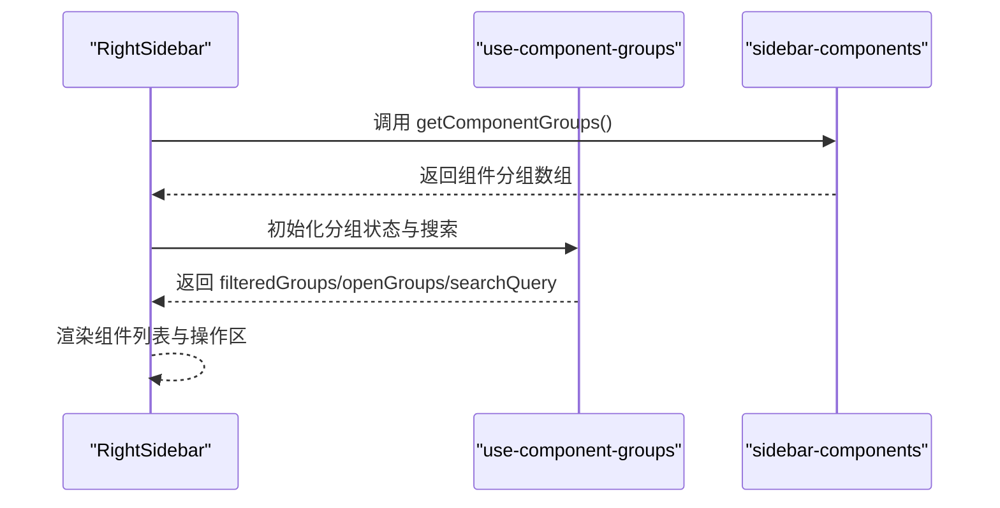
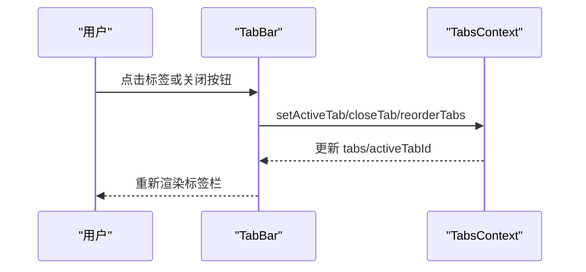
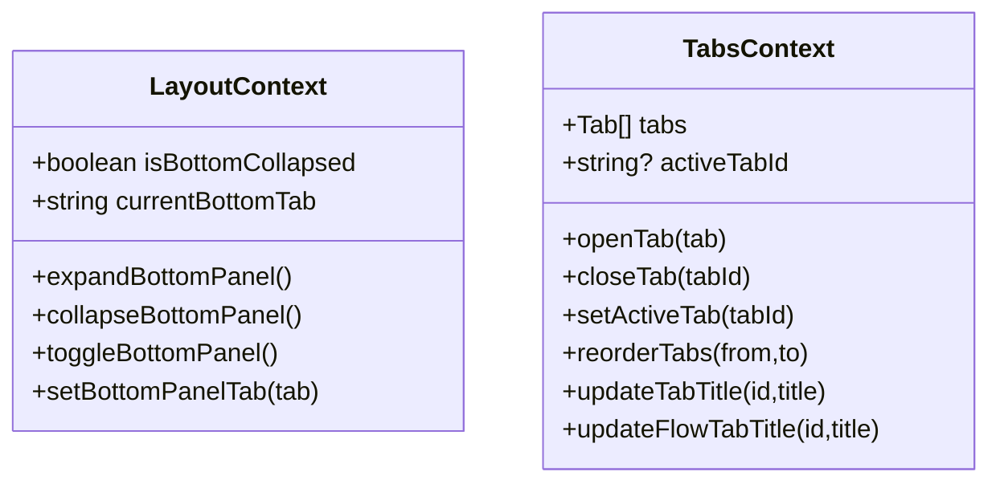
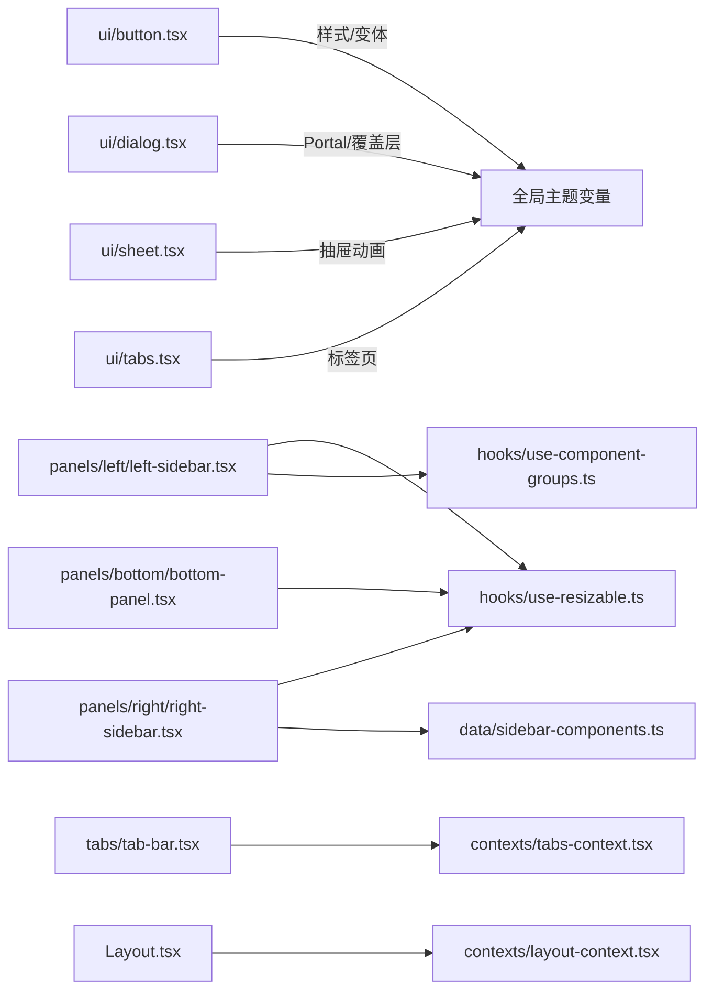

# 组件系统设计

<cite>
**本文引用的文件**
- [App.tsx](file://app/frontend/src/App.tsx)
- [Layout.tsx](file://app/frontend/src/components/Layout.tsx)
- [top-bar.tsx](file://app/frontend/src/components/layout/top-bar.tsx)
- [bottom-panel.tsx](file://app/frontend/src/components/panels/bottom/bottom-panel.tsx)
- [left-sidebar.tsx](file://app/frontend/src/components/panels/left/left-sidebar.tsx)
- [right-sidebar.tsx](file://app/frontend/src/components/panels/right/right-sidebar.tsx)
- [tab-bar.tsx](file://app/frontend/src/components/tabs/tab-bar.tsx)
- [layout-context.tsx](file://app/frontend/src/contexts/layout-context.tsx)
- [tabs-context.tsx](file://app/frontend/src/contexts/tabs-context.tsx)
- [use-resizable.ts](file://app/frontend/src/hooks/use-resizable.ts)
- [sidebar-components.ts](file://app/frontend/src/data/sidebar-components.ts)
- [use-component-groups.ts](file://app/frontend/src/hooks/use-component-groups.ts)
- [button.tsx](file://app/frontend/src/components/ui/button.tsx)
- [dialog.tsx](file://app/frontend/src/components/ui/dialog.tsx)
- [sheet.tsx](file://app/frontend/src/components/ui/sheet.tsx)
- [tabs.tsx](file://app/frontend/src/components/ui/tabs.tsx)
- [input.tsx](file://app/frontend/src/components/ui/input.tsx)
- [card.tsx](file://app/frontend/src/components/ui/card.tsx)
- [accordion.tsx](file://app/frontend/src/components/ui/accordion.tsx)
</cite>

## 目录
1. [引言](#引言)
2. [项目结构](#项目结构)
3. [核心组件](#核心组件)
4. [架构总览](#架构总览)
5. [详细组件分析](#详细组件分析)
6. [依赖关系分析](#依赖关系分析)
7. [性能考虑](#性能考虑)
8. [故障排查指南](#故障排查指南)
9. [结论](#结论)
10. [附录](#附录)

## 引言
本文件系统性梳理前端组件体系的设计与实现，重点覆盖以下方面：
- UI 组件库（以 shadcn/ui 为基础）的集成与扩展
- 自定义组件开发与复用策略
- 布局组件、面板组件、标签页组件的设计模式
- 组件属性接口、事件处理与状态管理
- 组件组合模式、条件渲染与动态加载
- 测试策略、性能优化与无障碍访问支持
- 样式定制、主题适配与响应式设计

## 项目结构
前端采用“按功能域分层 + 组件库封装”的组织方式：
- 组件库封装：在 components/ui 下对 shadcn/ui 的基础组件进行二次封装，统一变体、尺寸与样式规范
- 功能组件：components/layout、panels、tabs 等围绕布局与交互场景构建
- 上下文与钩子：contexts 提供跨组件状态共享；hooks 封装可复用逻辑
- 数据与服务：data 层负责静态数据与后端拉取；services 提供业务服务
- 应用入口：App.tsx 渲染根布局与全局通知

图表来源
- [App.tsx:1-12](file://app/frontend/src/App.tsx#L1-L12)
- [Layout.tsx](file://app/frontend/src/components/Layout.tsx)
- [top-bar.tsx:1-87](file://app/frontend/src/components/layout/top-bar.tsx#L1-L87)
- [left-sidebar.tsx:1-101](file://app/frontend/src/components/panels/left/left-sidebar.tsx#L1-L101)
- [right-sidebar.tsx:1-97](file://app/frontend/src/components/panels/right/right-sidebar.tsx#L1-L97)
- [bottom-panel.tsx:1-99](file://app/frontend/src/components/panels/bottom/bottom-panel.tsx#L1-L99)
- [tab-bar.tsx:1-171](file://app/frontend/src/components/tabs/tab-bar.tsx#L1-L171)
- [layout-context.tsx:1-68](file://app/frontend/src/contexts/layout-context.tsx#L1-L68)
- [tabs-context.tsx:1-271](file://app/frontend/src/contexts/tabs-context.tsx#L1-L271)
- [use-resizable.ts:1-93](file://app/frontend/src/hooks/use-resizable.ts#L1-L93)
- [use-component-groups.ts:1-71](file://app/frontend/src/hooks/use-component-groups.ts#L1-L71)
- [sidebar-components.ts:1-74](file://app/frontend/src/data/sidebar-components.ts#L1-L74)
- [button.tsx:1-58](file://app/frontend/src/components/ui/button.tsx#L1-L58)
- [dialog.tsx:1-113](file://app/frontend/src/components/ui/dialog.tsx#L1-L113)
- [sheet.tsx:1-141](file://app/frontend/src/components/ui/sheet.tsx#L1-L141)
- [tabs.tsx:1-54](file://app/frontend/src/components/ui/tabs.tsx#L1-L54)
- [input.tsx:1-23](file://app/frontend/src/components/ui/input.tsx#L1-L23)
- [card.tsx:1-78](file://app/frontend/src/components/ui/card.tsx#L1-L78)
- [accordion.tsx:1-56](file://app/frontend/src/components/ui/accordion.tsx#L1-L56)

章节来源
- [App.tsx:1-12](file://app/frontend/src/App.tsx#L1-L12)

## 核心组件
- 按钮 Button：基于 class-variance-authority 的变体系统，支持多种尺寸与外观，兼容 Radix Slot 作为容器
- 对话框 Dialog：基于 Radix UI 的对话框，提供覆盖层、内容区、标题与描述等结构化组件
- 工作台抽屉 Sheet：支持从四侧滑入的抽屉，提供覆盖层与关闭按钮
- 标签页 Tabs：Radix UI 标签页的封装，提供列表、触发器与内容区
- 输入 Input：统一输入框样式，继承主题色与禁用态
- 卡片 Card：卡片容器与头部/标题/描述/底部的组合
- 手风琴 Accordion：展开/收起的分组容器，配合图标与动画

这些组件通过统一的 className 工具与主题变量，形成一致的视觉与交互体验。

章节来源
- [button.tsx:1-58](file://app/frontend/src/components/ui/button.tsx#L1-L58)
- [dialog.tsx:1-113](file://app/frontend/src/components/ui/dialog.tsx#L1-L113)
- [sheet.tsx:1-141](file://app/frontend/src/components/ui/sheet.tsx#L1-L141)
- [tabs.tsx:1-54](file://app/frontend/src/components/ui/tabs.tsx#L1-L54)
- [input.tsx:1-23](file://app/frontend/src/components/ui/input.tsx#L1-L23)
- [card.tsx:1-78](file://app/frontend/src/components/ui/card.tsx#L1-L78)
- [accordion.tsx:1-56](file://app/frontend/src/components/ui/accordion.tsx#L1-L56)

## 架构总览
组件系统以“布局-面板-标签页-上下文-可复用逻辑-组件库”为主线：
- 布局层：TopBar 控制侧边栏与底部面板的显隐；Left/Right/Bottom 面板提供可拖拽调整大小的能力
- 标签页层：TabBar 支持多标签页、拖拽重排、关闭与图标标识
- 上下文层：LayoutContext 管理底部面板状态；TabsContext 管理标签页集合、激活态与持久化
- 可复用逻辑：use-resizable 提供统一的拖拽调整尺寸能力；use-component-groups 提供组件分组与搜索过滤
- 组件库：所有基础 UI 组件均来自 shadcn/ui，并通过本地封装统一风格

图表来源
- [Layout.tsx](file://app/frontend/src/components/Layout.tsx)
- [top-bar.tsx:1-87](file://app/frontend/src/components/layout/top-bar.tsx#L1-L87)
- [left-sidebar.tsx:1-101](file://app/frontend/src/components/panels/left/left-sidebar.tsx#L1-L101)
- [right-sidebar.tsx:1-97](file://app/frontend/src/components/panels/right/right-sidebar.tsx#L1-L97)
- [bottom-panel.tsx:1-99](file://app/frontend/src/components/panels/bottom/bottom-panel.tsx#L1-L99)
- [tab-bar.tsx:1-171](file://app/frontend/src/components/tabs/tab-bar.tsx#L1-L171)
- [layout-context.tsx:1-68](file://app/frontend/src/contexts/layout-context.tsx#L1-L68)
- [tabs-context.tsx:1-271](file://app/frontend/src/contexts/tabs-context.tsx#L1-L271)
- [use-resizable.ts:1-93](file://app/frontend/src/hooks/use-resizable.ts#L1-L93)
- [use-component-groups.ts:1-71](file://app/frontend/src/hooks/use-component-groups.ts#L1-L71)
- [sidebar-components.ts:1-74](file://app/frontend/src/data/sidebar-components.ts#L1-L74)
- [button.tsx:1-58](file://app/frontend/src/components/ui/button.tsx#L1-L58)
- [dialog.tsx:1-113](file://app/frontend/src/components/ui/dialog.tsx#L1-L113)
- [sheet.tsx:1-141](file://app/frontend/src/components/ui/sheet.tsx#L1-L141)
- [tabs.tsx:1-54](file://app/frontend/src/components/ui/tabs.tsx#L1-L54)

## 详细组件分析

### 布局与顶部工具栏
- TopBar 负责控制左/右侧边栏与底部面板的开关，并提供设置入口
- 使用 Button 组件与图标，结合 aria-label 与 title 实现无障碍与快捷键提示
- 通过 props 传入回调函数，实现与父级布局的解耦

图表来源
- [top-bar.tsx:15-87](file://app/frontend/src/components/layout/top-bar.tsx#L15-L87)

章节来源
- [top-bar.tsx:1-87](file://app/frontend/src/components/layout/top-bar.tsx#L1-L87)

### 底部面板与可拖拽调整
- BottomPanel 通过 use-resizable 在垂直方向上拖拽调整高度，并将变化通知父组件
- 内置标签页用于切换输出内容区域，支持折叠/展开与关闭
- 使用 Tabs 组件与自定义样式，保证与整体主题一致

图表来源
- [bottom-panel.tsx:19-99](file://app/frontend/src/components/panels/bottom/bottom-panel.tsx#L19-L99)
- [use-resizable.ts:13-93](file://app/frontend/src/hooks/use-resizable.ts#L13-L93)

章节来源
- [bottom-panel.tsx:1-99](file://app/frontend/src/components/panels/bottom/bottom-panel.tsx#L1-L99)
- [use-resizable.ts:1-93](file://app/frontend/src/hooks/use-resizable.ts#L1-L93)

### 左/右侧边栏与组件分组
- LeftSidebar/RightSidebar 均使用 use-resizable 实现水平拖拽调整宽度
- RightSidebar 通过 use-component-groups 与 data/sidebar-components 进行组件分组与搜索过滤
- 侧边栏包含操作区、列表区与创建对话框，支持加载状态与错误兜底

图表来源
- [right-sidebar.tsx:17-97](file://app/frontend/src/components/panels/right/right-sidebar.tsx#L17-L97)
- [use-component-groups.ts:1-71](file://app/frontend/src/hooks/use-component-groups.ts#L1-L71)
- [sidebar-components.ts:31-74](file://app/frontend/src/data/sidebar-components.ts#L31-L74)

章节来源
- [left-sidebar.tsx:1-101](file://app/frontend/src/components/panels/left/left-sidebar.tsx#L1-L101)
- [right-sidebar.tsx:1-97](file://app/frontend/src/components/panels/right/right-sidebar.tsx#L1-L97)
- [use-component-groups.ts:1-71](file://app/frontend/src/hooks/use-component-groups.ts#L1-L71)
- [sidebar-components.ts:1-74](file://app/frontend/src/data/sidebar-components.ts#L1-L74)

### 标签页系统
- TabBar 基于 TabsContext 管理标签页集合与激活态
- 支持拖拽重排、关闭单个标签、悬停显示关闭按钮、图标区分类型
- 通过 useTabsContext 提供 openTab/closeTab/setActiveTab/reorderTabs 等能力

图表来源
- [tab-bar.tsx:23-171](file://app/frontend/src/components/tabs/tab-bar.tsx#L23-L171)
- [tabs-context.tsx:59-271](file://app/frontend/src/contexts/tabs-context.tsx#L59-L271)

章节来源
- [tab-bar.tsx:1-171](file://app/frontend/src/components/tabs/tab-bar.tsx#L1-L171)
- [tabs-context.tsx:1-271](file://app/frontend/src/contexts/tabs-context.tsx#L1-L271)

### 上下文与状态管理
- LayoutContext：保存底部面板折叠状态到存储，提供展开/折叠/切换与当前标签设置
- TabsContext：持久化标签页集合与激活态，支持去重打开、关闭、重排与标题更新

图表来源
- [layout-context.tsx:27-68](file://app/frontend/src/contexts/layout-context.tsx#L27-L68)
- [tabs-context.tsx:59-271](file://app/frontend/src/contexts/tabs-context.tsx#L59-L271)

章节来源
- [layout-context.tsx:1-68](file://app/frontend/src/contexts/layout-context.tsx#L1-L68)
- [tabs-context.tsx:1-271](file://app/frontend/src/contexts/tabs-context.tsx#L1-L271)

### 组件库封装与样式定制
- Button：通过变体系统与尺寸枚举，统一按钮风格；支持 asChild 容器
- Dialog：提供覆盖层与内容区，支持 Portal 渲染与无障碍关闭按钮
- Sheet：支持四侧抽屉，提供覆盖层与关闭按钮
- Tabs：封装列表、触发器与内容区，保持与主题一致
- Input/Card/Accordion：统一边框、阴影、颜色与过渡效果

章节来源
- [button.tsx:1-58](file://app/frontend/src/components/ui/button.tsx#L1-L58)
- [dialog.tsx:1-113](file://app/frontend/src/components/ui/dialog.tsx#L1-L113)
- [sheet.tsx:1-141](file://app/frontend/src/components/ui/sheet.tsx#L1-L141)
- [tabs.tsx:1-54](file://app/frontend/src/components/ui/tabs.tsx#L1-L54)
- [input.tsx:1-23](file://app/frontend/src/components/ui/input.tsx#L1-L23)
- [card.tsx:1-78](file://app/frontend/src/components/ui/card.tsx#L1-L78)
- [accordion.tsx:1-56](file://app/frontend/src/components/ui/accordion.tsx#L1-L56)

## 依赖关系分析
- 组件间依赖：面板组件依赖 use-resizable；侧边栏依赖 use-component-groups；标签页依赖 TabsContext；TopBar 依赖布局回调
- 组件库依赖：所有基础 UI 组件来自 shadcn/ui，通过本地封装统一风格
- 数据依赖：右侧侧边栏依赖 data/sidebar-components 获取组件分组

图表来源
- [button.tsx:1-58](file://app/frontend/src/components/ui/button.tsx#L1-L58)
- [dialog.tsx:1-113](file://app/frontend/src/components/ui/dialog.tsx#L1-L113)
- [sheet.tsx:1-141](file://app/frontend/src/components/ui/sheet.tsx#L1-L141)
- [tabs.tsx:1-54](file://app/frontend/src/components/ui/tabs.tsx#L1-L54)
- [left-sidebar.tsx:1-101](file://app/frontend/src/components/panels/left/left-sidebar.tsx#L1-L101)
- [right-sidebar.tsx:1-97](file://app/frontend/src/components/panels/right/right-sidebar.tsx#L1-L97)
- [bottom-panel.tsx:1-99](file://app/frontend/src/components/panels/bottom/bottom-panel.tsx#L1-L99)
- [use-resizable.ts:1-93](file://app/frontend/src/hooks/use-resizable.ts#L1-L93)
- [use-component-groups.ts:1-71](file://app/frontend/src/hooks/use-component-groups.ts#L1-L71)
- [sidebar-components.ts:1-74](file://app/frontend/src/data/sidebar-components.ts#L1-L74)
- [tab-bar.tsx:1-171](file://app/frontend/src/components/tabs/tab-bar.tsx#L1-L171)
- [tabs-context.tsx:1-271](file://app/frontend/src/contexts/tabs-context.tsx#L1-L271)
- [layout-context.tsx:1-68](file://app/frontend/src/contexts/layout-context.tsx#L1-L68)

章节来源
- [left-sidebar.tsx:1-101](file://app/frontend/src/components/panels/left/left-sidebar.tsx#L1-L101)
- [right-sidebar.tsx:1-97](file://app/frontend/src/components/panels/right/right-sidebar.tsx#L1-L97)
- [bottom-panel.tsx:1-99](file://app/frontend/src/components/panels/bottom/bottom-panel.tsx#L1-L99)
- [use-resizable.ts:1-93](file://app/frontend/src/hooks/use-resizable.ts#L1-L93)
- [use-component-groups.ts:1-71](file://app/frontend/src/hooks/use-component-groups.ts#L1-L71)
- [sidebar-components.ts:1-74](file://app/frontend/src/data/sidebar-components.ts#L1-L74)
- [tab-bar.tsx:1-171](file://app/frontend/src/components/tabs/tab-bar.tsx#L1-L171)
- [tabs-context.tsx:1-271](file://app/frontend/src/contexts/tabs-context.tsx#L1-L271)
- [layout-context.tsx:1-68](file://app/frontend/src/contexts/layout-context.tsx#L1-L68)

## 性能考虑
- 拖拽性能：use-resizable 使用 ref 同步标记与 state 分离，避免频繁重渲染；仅在拖拽时绑定全局事件，释放时清理
- 列表渲染：右侧侧边栏对分组与项进行 useMemo 过滤，减少不必要的渲染
- 标签页持久化：TabsContext 将 tabs 与 activeTab 持久化至 localStorage，避免每次刷新重建
- 主题一致性：统一使用 cn 工具与主题变量，减少重复样式计算

[本节为通用指导，无需列出具体文件来源]

## 故障排查指南
- 无法拖拽调整面板尺寸
  - 检查 use-resizable 是否正确绑定 elementRef 与 startResize
  - 确认事件监听在组件卸载时被移除
- 标签页不显示或丢失
  - 检查 TabsContext 的持久化逻辑与 localStorage 权限
  - 确认 openTab 是否传入正确的 identifier 与 type
- 侧边栏组件分组为空
  - 检查 data/sidebar-components 的异步加载与错误处理
  - 确认 use-component-groups 的过滤逻辑与搜索状态

章节来源
- [use-resizable.ts:1-93](file://app/frontend/src/hooks/use-resizable.ts#L1-L93)
- [tabs-context.tsx:75-140](file://app/frontend/src/contexts/tabs-context.tsx#L75-L140)
- [right-sidebar.tsx:39-53](file://app/frontend/src/components/panels/right/right-sidebar.tsx#L39-L53)
- [use-component-groups.ts:10-38](file://app/frontend/src/hooks/use-component-groups.ts#L10-L38)

## 结论
该组件系统以 shadcn/ui 为基础，通过本地封装统一风格，结合上下文与自定义 Hook 实现高内聚低耦合的状态与行为复用。布局组件、面板组件与标签页组件形成清晰的职责边界，配合可拖拽调整与持久化机制，满足复杂工作流场景下的可用性与可维护性需求。

[本节为总结性内容，无需列出具体文件来源]

## 附录
- 组件属性与事件建议
  - 布局组件：暴露 onToggleLeft/onToggleRight/onToggleBottom/onSettingsClick 等回调
  - 面板组件：暴露 onCollapse/onExpand/onToggleCollapse/onHeightChange/onWidthChange
  - 标签页组件：暴露 openTab/closeTab/setActiveTab/reorderTabs/updateTabTitle
- 无障碍访问
  - 为按钮与交互元素提供 aria-label/title
  - 对话框与抽屉提供关闭按钮与键盘可访问性
- 响应式设计
  - 使用相对单位与最大最小约束，确保在不同屏幕尺寸下的可用性
- 测试策略
  - 单元测试：针对 use-resizable、use-component-groups、TabsContext 的核心逻辑
  - 集成测试：验证布局组件与上下文的协同行为
  - 可访问性测试：使用自动化工具检查 ARIA 与键盘导航

[本节为通用指导，无需列出具体文件来源]