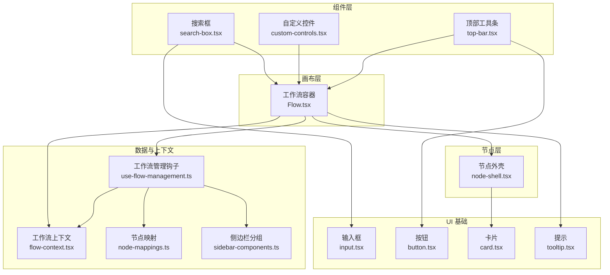
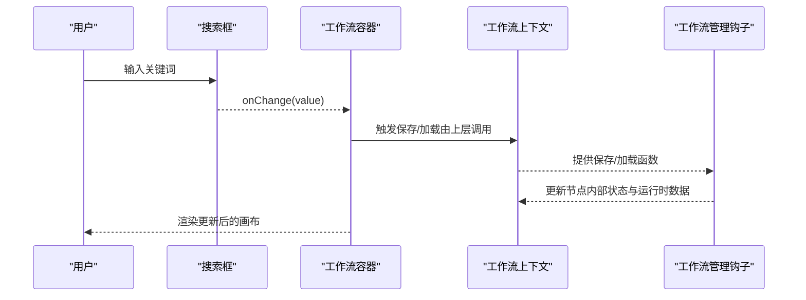
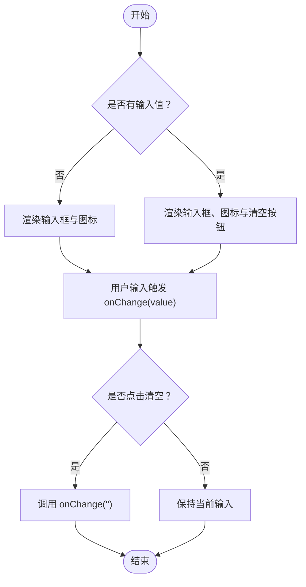
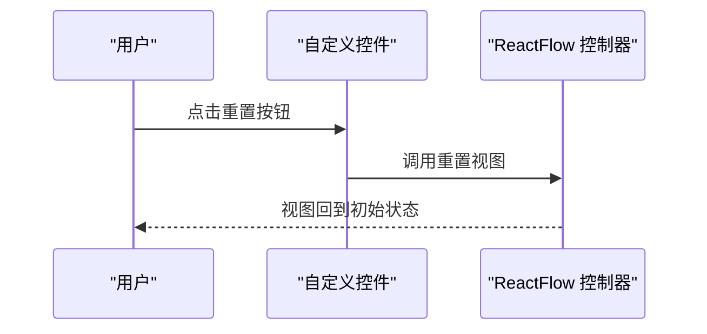
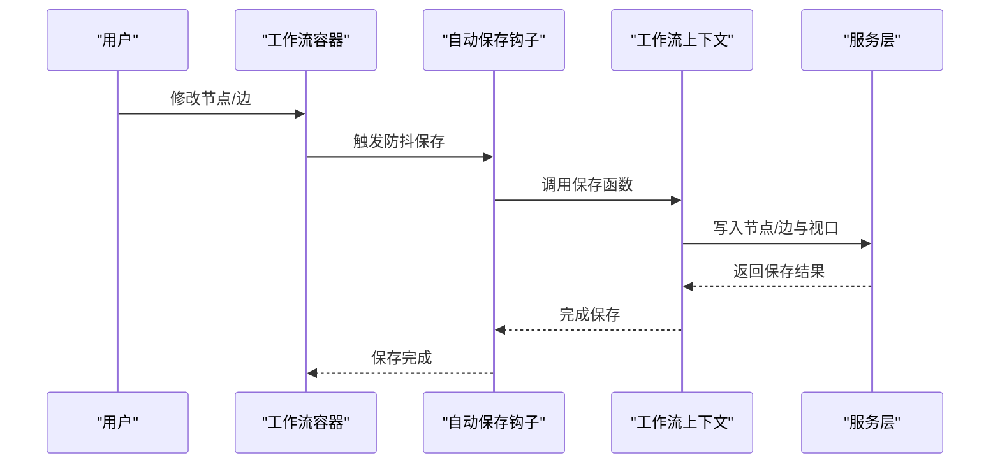
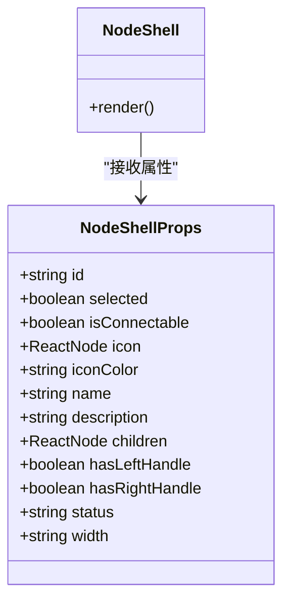
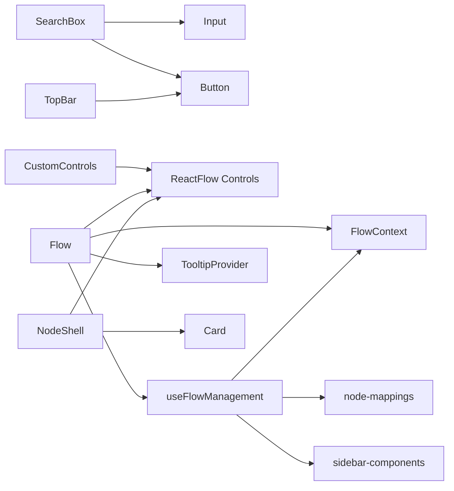

# 自定义控件

<cite>
**本文引用的文件**
- [custom-controls.tsx](file://app/frontend/src/components/custom-controls.tsx)
- [search-box.tsx](file://app/frontend/src/components/panels/search-box.tsx)
- [Flow.tsx](file://app/frontend/src/components/Flow.tsx)
- [top-bar.tsx](file://app/frontend/src/components/layout/top-bar.tsx)
- [input.tsx](file://app/frontend/src/components/ui/input.tsx)
- [button.tsx](file://app/frontend/src/components/ui/button.tsx)
- [card.tsx](file://app/frontend/src/components/ui/card.tsx)
- [tooltip.tsx](file://app/frontend/src/components/ui/tooltip.tsx)
- [node-shell.tsx](file://app/frontend/src/nodes/components/node-shell.tsx)
- [use-flow-management.ts](file://app/frontend/src/hooks/use-flow-management.ts)
- [flow-context.tsx](file://app/frontend/src/contexts/flow-context.tsx)
- [node-mappings.ts](file://app/frontend/src/data/node-mappings.ts)
- [sidebar-components.ts](file://app/frontend/src/data/sidebar-components.ts)
- [utils.ts](file://app/frontend/src/lib/utils.ts)
</cite>

## 目录
1. [简介](#简介)
2. [项目结构](#项目结构)
3. [核心组件](#核心组件)
4. [架构总览](#架构总览)
5. [详细组件分析](#详细组件分析)
6. [依赖关系分析](#依赖关系分析)
7. [性能考量](#性能考量)
8. [故障排查指南](#故障排查指南)
9. [结论](#结论)
10. [附录](#附录)

## 简介
本文件聚焦于项目前端中“自定义控件”的实现与使用，覆盖以下方面：
- 搜索框：用于在组件列表中进行过滤与清空输入。
- 工作流编辑器：基于 ReactFlow 的画布容器，负责节点/边的状态持久化、自动保存、历史快照、键盘快捷键与主题适配。
- 自定义控件（工具栏）：基于 ReactFlow 的 Controls 组件封装，提供重置视图等操作按钮。
- 节点外壳：统一节点外观、连接句柄、选中态与状态指示，便于复用。
- 上层集成：通过上下文与钩子实现工作流的加载/保存/删除、节点类型映射与侧边栏分组。

这些控件共同构成一个可扩展、可维护的工作流可视化编辑体验，并提供一致的样式与交互语义。

## 项目结构
自定义控件主要分布在以下目录：
- 组件层：搜索框、自定义控件、顶部工具条等 UI 组件
- 画布层：工作流容器与主题、背景、快捷键、自动保存等逻辑
- 节点层：节点外壳与通用节点样式
- 数据与上下文：节点类型映射、侧边栏分组、工作流上下文与管理钩子
- UI 基础：输入框、按钮、卡片、提示等基础组件

图表来源
- [search-box.tsx:1-43](file://app/frontend/src/components/panels/search-box.tsx#L1-L43)
- [custom-controls.tsx:1-21](file://app/frontend/src/components/custom-controls.tsx#L1-L21)
- [top-bar.tsx:1-87](file://app/frontend/src/components/layout/top-bar.tsx#L1-L87)
- [Flow.tsx:1-313](file://app/frontend/src/components/Flow.tsx#L1-L313)
- [node-shell.tsx:1-90](file://app/frontend/src/nodes/components/node-shell.tsx#L1-L90)
- [flow-context.tsx:1-358](file://app/frontend/src/contexts/flow-context.tsx#L1-L358)
- [use-flow-management.ts:1-336](file://app/frontend/src/hooks/use-flow-management.ts#L1-L336)
- [node-mappings.ts:1-140](file://app/frontend/src/data/node-mappings.ts#L1-L140)
- [sidebar-components.ts:1-74](file://app/frontend/src/data/sidebar-components.ts#L1-L74)
- [input.tsx:1-23](file://app/frontend/src/components/ui/input.tsx#L1-L23)
- [button.tsx:1-58](file://app/frontend/src/components/ui/button.tsx#L1-L58)
- [card.tsx:1-78](file://app/frontend/src/components/ui/card.tsx#L1-L78)
- [tooltip.tsx:1-31](file://app/frontend/src/components/ui/tooltip.tsx#L1-L31)

章节来源
- [Flow.tsx:1-313](file://app/frontend/src/components/Flow.tsx#L1-L313)
- [custom-controls.tsx:1-21](file://app/frontend/src/components/custom-controls.tsx#L1-L21)
- [search-box.tsx:1-43](file://app/frontend/src/components/panels/search-box.tsx#L1-L43)
- [node-shell.tsx:1-90](file://app/frontend/src/nodes/components/node-shell.tsx#L1-L90)
- [flow-context.tsx:1-358](file://app/frontend/src/contexts/flow-context.tsx#L1-L358)
- [use-flow-management.ts:1-336](file://app/frontend/src/hooks/use-flow-management.ts#L1-L336)
- [node-mappings.ts:1-140](file://app/frontend/src/data/node-mappings.ts#L1-L140)
- [sidebar-components.ts:1-74](file://app/frontend/src/data/sidebar-components.ts#L1-L74)
- [input.tsx:1-23](file://app/frontend/src/components/ui/input.tsx#L1-L23)
- [button.tsx:1-58](file://app/frontend/src/components/ui/button.tsx#L1-L58)
- [card.tsx:1-78](file://app/frontend/src/components/ui/card.tsx#L1-L78)
- [tooltip.tsx:1-31](file://app/frontend/src/components/ui/tooltip.tsx#L1-L31)

## 核心组件
- 搜索框 SearchBox
  - 属性接口：value、onChange、placeholder
  - 行为：输入时实时更新、支持一键清空
  - 样式：内置图标与输入区域，清空按钮仅在有内容时显示
- 自定义控件 CustomControls
  - 属性接口：onReset（点击重置）
  - 行为：封装 ReactFlow Controls，提供重置视图按钮
  - 样式：定位、圆角、间距与按钮样式类名
- 工作流容器 Flow
  - 行为：主题适配、自动保存、历史快照、连接与变更监听、键盘快捷键
  - 集成：节点/边状态持久化、上下文保存/加载、背景网格
- 节点外壳 NodeShell
  - 属性接口：id、selected、isConnectable、icon、iconColor、name、description、children、hasLeftHandle、hasRightHandle、status、width
  - 行为：统一节点外观、左右连接句柄、选中态与状态指示（如进行中）
- 顶部工具条 TopBar
  - 属性接口：isLeftCollapsed、isRightCollapsed、isBottomCollapsed、onToggleLeft、onToggleRight、onToggleBottom、onSettingsClick
  - 行为：侧边栏与底部面板开关、设置入口
- 基础 UI 组件
  - 输入框 Input：统一边框、背景、焦点样式
  - 按钮 Button：多种变体与尺寸
  - 卡片 Card：统一边框、阴影与内边距
  - 提示 Tooltip：提供触发与内容容器

章节来源
- [search-box.tsx:4-14](file://app/frontend/src/components/panels/search-box.tsx#L4-L14)
- [custom-controls.tsx:4-6](file://app/frontend/src/components/custom-controls.tsx#L4-L6)
- [Flow.tsx:30-32](file://app/frontend/src/components/Flow.tsx#L30-L32)
- [node-shell.tsx:6-19](file://app/frontend/src/nodes/components/node-shell.tsx#L6-L19)
- [top-bar.tsx:5-13](file://app/frontend/src/components/layout/top-bar.tsx#L5-L13)
- [input.tsx:5-18](file://app/frontend/src/components/ui/input.tsx#L5-L18)
- [button.tsx:37-41](file://app/frontend/src/components/ui/button.tsx#L37-L41)
- [card.tsx:5-16](file://app/frontend/src/components/ui/card.tsx#L5-L16)
- [tooltip.tsx:12-26](file://app/frontend/src/components/ui/tooltip.tsx#L12-L26)

## 架构总览
自定义控件围绕“工作流编辑器”展开，上层通过上下文与钩子管理状态，下层通过节点外壳与基础 UI 组件保证一致性与可扩展性。

图表来源
- [search-box.tsx:10-24](file://app/frontend/src/components/panels/search-box.tsx#L10-L24)
- [Flow.tsx:45-52](file://app/frontend/src/components/Flow.tsx#L45-L52)
- [flow-context.tsx:74-131](file://app/frontend/src/contexts/flow-context.tsx#L74-L131)
- [use-flow-management.ts:57-109](file://app/frontend/src/hooks/use-flow-management.ts#L57-L109)

## 详细组件分析

### 搜索框 SearchBox
- 功能特性
  - 受控输入：value 与 onChange 双向绑定
  - 清空能力：当存在输入时显示清空按钮，点击后回调置空
  - 占位符：默认文案可配置
- 属性接口
  - value: string
  - onChange: (value: string) => void
  - placeholder?: string
- 事件与状态
  - 输入事件：onChange 触发外部状态更新
  - 清空事件：点击清空按钮触发 onChange('')
- 样式与行为扩展
  - 使用基础输入组件与按钮组合，保持与主题一致
  - 可通过父组件传入不同占位符或样式类名扩展
- 与其他组件集成
  - 作为左侧组件列表的过滤入口，配合 use-flow-management 的过滤逻辑使用

图表来源
- [search-box.tsx:15-41](file://app/frontend/src/components/panels/search-box.tsx#L15-L41)

章节来源
- [search-box.tsx:1-43](file://app/frontend/src/components/panels/search-box.tsx#L1-L43)
- [input.tsx:1-23](file://app/frontend/src/components/ui/input.tsx#L1-L23)
- [button.tsx:1-58](file://app/frontend/src/components/ui/button.tsx#L1-L58)

### 自定义控件 CustomControls
- 功能特性
  - 封装 ReactFlow 的 Controls 与 ControlButton
  - 默认水平布局，底部居中定位，带圆角与间距
  - 提供 onReset 回调以触发重置视图
- 属性接口
  - onReset: () => void
- 事件与状态
  - 点击按钮触发 onReset
- 样式与行为扩展
  - 支持通过 className 与 style 扩展外观
  - 可按需添加更多 ControlButton 子项
- 与其他组件集成
  - 在 Flow 容器中作为子元素使用，与 TooltipProvider 配合

图表来源
- [custom-controls.tsx:8-20](file://app/frontend/src/components/custom-controls.tsx#L8-L20)
- [Flow.tsx:308-308](file://app/frontend/src/components/Flow.tsx#L308-L308)

章节来源
- [custom-controls.tsx:1-21](file://app/frontend/src/components/custom-controls.tsx#L1-L21)
- [Flow.tsx:287-313](file://app/frontend/src/components/Flow.tsx#L287-L313)

### 工作流容器 Flow
- 功能特性
  - 主题适配：根据系统主题切换 Light/Dark
  - 自动保存：对节点/边变更进行防抖保存；新增连接立即保存
  - 历史快照：初始化与变更后定时快照，支持撤销/重做
  - 键盘快捷键：保存、撤销/重做
  - 背景网格：根据主题选择颜色与样式
- 属性接口
  - className?: string
- 状态与事件
  - 节点/边变更：handleNodesChange、handleEdgesChange
  - 连接建立：onConnect 创建带箭头标记的边
  - 初始化：onInit 设置初始化标志
- 性能与优化
  - 防抖保存与定时快照降低写入频率
  - 仅在必要变更类型触发保存
- 与其他组件集成
  - 使用 TooltipProvider 包裹，统一提示
  - 与上下文/钩子协作完成保存/加载与节点状态恢复

图表来源
- [Flow.tsx:57-89](file://app/frontend/src/components/Flow.tsx#L57-L89)
- [Flow.tsx:91-143](file://app/frontend/src/components/Flow.tsx#L91-L143)
- [Flow.tsx:197-209](file://app/frontend/src/components/Flow.tsx#L197-L209)
- [flow-context.tsx:74-131](file://app/frontend/src/contexts/flow-context.tsx#L74-L131)

章节来源
- [Flow.tsx:1-313](file://app/frontend/src/components/Flow.tsx#L1-L313)
- [flow-context.tsx:1-358](file://app/frontend/src/contexts/flow-context.tsx#L1-L358)

### 节点外壳 NodeShell
- 功能特性
  - 统一节点外观：卡片头部、描述区、左右连接句柄
  - 选中态与状态指示：根据 selected 与 status 切换样式
  - 可选句柄：hasLeftHandle / hasRightHandle 控制句柄显示
  - 宽度控制：width 参数控制节点宽度
- 属性接口
  - id、selected、isConnectable、icon、iconColor、name、description、children、hasLeftHandle、hasRightHandle、status、width
- 事件与状态
  - 通过 props 传递状态，不直接管理内部状态
- 样式与行为扩展
  - 支持渐变动画与进度指示
  - 可通过 className 扩展样式
- 与其他组件集成
  - 作为节点模板被具体节点组件复用

图表来源
- [node-shell.tsx:6-34](file://app/frontend/src/nodes/components/node-shell.tsx#L6-L34)

章节来源
- [node-shell.tsx:1-90](file://app/frontend/src/nodes/components/node-shell.tsx#L1-L90)
- [card.tsx:1-78](file://app/frontend/src/components/ui/card.tsx#L1-L78)

### 顶部工具条 TopBar
- 功能特性
  - 左/右/底面板开关按钮与设置入口
  - 基于按钮组件，支持悬停与选中态样式
- 属性接口
  - isLeftCollapsed、isRightCollapsed、isBottomCollapsed、onToggleLeft、onToggleRight、onToggleBottom、onSettingsClick
- 事件与状态
  - 每个按钮对应一个回调，用于切换面板可见性或打开设置
- 样式与行为扩展
  - 使用统一按钮组件，支持尺寸与变体扩展
- 与其他组件集成
  - 作为布局的一部分，与画布同级

章节来源
- [top-bar.tsx:1-87](file://app/frontend/src/components/layout/top-bar.tsx#L1-L87)
- [button.tsx:1-58](file://app/frontend/src/components/ui/button.tsx#L1-L58)

### 基础 UI 组件
- 输入框 Input
  - 统一样式：边框、背景、占位符、焦点环、禁用态
- 按钮 Button
  - 多种变体与尺寸，支持作为原生按钮或 Radix Slot
- 卡片 Card
  - 统一边框、背景、阴影与内边距
- 提示 Tooltip
  - 提供根、触发器与内容容器，支持方向偏移

章节来源
- [input.tsx:1-23](file://app/frontend/src/components/ui/input.tsx#L1-L23)
- [button.tsx:1-58](file://app/frontend/src/components/ui/button.tsx#L1-L58)
- [card.tsx:1-78](file://app/frontend/src/components/ui/card.tsx#L1-L78)
- [tooltip.tsx:1-31](file://app/frontend/src/components/ui/tooltip.tsx#L1-L31)

## 依赖关系分析
- 组件间依赖
  - SearchBox 依赖 Input 与 Button
  - CustomControls 依赖 Radix Icons 与 ReactFlow Controls
  - Flow 依赖 ReactFlow、上下文与钩子、TooltipProvider
  - NodeShell 依赖 Card 与 ReactFlow Handle
  - TopBar 依赖 Button
- 数据与上下文依赖
  - useFlowManagement 依赖 flow-context、node-state、flow-service
  - node-mappings 与 sidebar-components 提供节点类型与分组数据
- 工具函数
  - utils 提供样式合并、平台检测与快捷键格式化

图表来源
- [search-box.tsx:1-43](file://app/frontend/src/components/panels/search-box.tsx#L1-L43)
- [custom-controls.tsx:1-21](file://app/frontend/src/components/custom-controls.tsx#L1-L21)
- [Flow.tsx:1-313](file://app/frontend/src/components/Flow.tsx#L1-L313)
- [node-shell.tsx:1-90](file://app/frontend/src/nodes/components/node-shell.tsx#L1-L90)
- [top-bar.tsx:1-87](file://app/frontend/src/components/layout/top-bar.tsx#L1-L87)
- [use-flow-management.ts:1-336](file://app/frontend/src/hooks/use-flow-management.ts#L1-L336)
- [flow-context.tsx:1-358](file://app/frontend/src/contexts/flow-context.tsx#L1-L358)
- [node-mappings.ts:1-140](file://app/frontend/src/data/node-mappings.ts#L1-L140)
- [sidebar-components.ts:1-74](file://app/frontend/src/data/sidebar-components.ts#L1-L74)
- [input.tsx:1-23](file://app/frontend/src/components/ui/input.tsx#L1-L23)
- [button.tsx:1-58](file://app/frontend/src/components/ui/button.tsx#L1-L58)
- [card.tsx:1-78](file://app/frontend/src/components/ui/card.tsx#L1-L78)
- [tooltip.tsx:1-31](file://app/frontend/src/components/ui/tooltip.tsx#L1-L31)

章节来源
- [use-flow-management.ts:1-336](file://app/frontend/src/hooks/use-flow-management.ts#L1-L336)
- [flow-context.tsx:1-358](file://app/frontend/src/contexts/flow-context.tsx#L1-L358)
- [node-mappings.ts:1-140](file://app/frontend/src/data/node-mappings.ts#L1-L140)
- [sidebar-components.ts:1-74](file://app/frontend/src/data/sidebar-components.ts#L1-L74)
- [utils.ts:1-39](file://app/frontend/src/lib/utils.ts#L1-L39)

## 性能考量
- 自动保存与快照
  - 对节点/边变更采用防抖策略，减少频繁写入
  - 新增连接立即保存，确保结构性变更及时落盘
- 主题与渲染
  - 主题切换时仅更新颜色变量，避免全量重绘
  - 背景网格参数按主题动态计算，降低计算成本
- 节点句柄与连接
  - 句柄仅在需要时显示（hasLeftHandle/hasRightHandle），减少 DOM 元素数量
  - 连接创建时生成唯一 ID 并附加箭头标记，提升可读性
- 依赖缓存
  - 节点类型定义与侧边栏分组支持缓存，避免重复请求

章节来源
- [Flow.tsx:57-89](file://app/frontend/src/components/Flow.tsx#L57-L89)
- [Flow.tsx:162-178](file://app/frontend/src/components/Flow.tsx#L162-L178)
- [Flow.tsx:240-278](file://app/frontend/src/components/Flow.tsx#L240-L278)
- [node-shell.tsx:51-87](file://app/frontend/src/nodes/components/node-shell.tsx#L51-L87)
- [node-mappings.ts:85-116](file://app/frontend/src/data/node-mappings.ts#L85-L116)
- [sidebar-components.ts:31-74](file://app/frontend/src/data/sidebar-components.ts#L31-L74)

## 故障排查指南
- 自动保存未触发
  - 检查变更类型是否命中保存条件（新增/删除/位置变更完成）
  - 确认 isInitialized 与 currentFlowId 正确
- 快照异常
  - 确认 takeSnapshot 是否在初始化后执行
  - 检查定时器清理逻辑，避免跨流程保存
- 连接保存延迟
  - 新连接会清除防抖定时器并立即保存，确认回调链路正确
- 节点状态丢失
  - 加载流程时应先设置当前 flowId，再渲染节点
  - 确保内部状态与运行时数据分离，仅恢复配置状态
- 主题不生效
  - 确认 resolvedTheme 正确映射到 ColorMode
  - 检查背景色与网格颜色计算逻辑

章节来源
- [Flow.tsx:91-143](file://app/frontend/src/components/Flow.tsx#L91-L143)
- [Flow.tsx:162-178](file://app/frontend/src/components/Flow.tsx#L162-L178)
- [Flow.tsx:240-278](file://app/frontend/src/components/Flow.tsx#L240-L278)
- [flow-context.tsx:134-188](file://app/frontend/src/contexts/flow-context.tsx#L134-L188)
- [use-flow-management.ts:111-143](file://app/frontend/src/hooks/use-flow-management.ts#L111-L143)

## 结论
本项目通过一组自定义控件与工作流容器，构建了可扩展、可维护的可视化编辑体验。搜索框、自定义控件、节点外壳与基础 UI 组件协同工作，结合上下文与钩子实现状态持久化、自动保存与历史管理。遵循本文档的接口规范、事件处理与样式约定，可在不破坏整体架构的前提下进行功能扩展与性能优化。

## 附录
- 开发指南
  - 接口设计：保持属性最小化，事件回调清晰
  - 样式定制：优先使用 className 与 Tailwind 类名扩展
  - 行为扩展：通过组合现有组件实现新功能（如在 CustomControls 中增加按钮）
- 最佳实践
  - 使用受控组件模式管理输入状态
  - 合理使用防抖与节流，避免频繁写入
  - 明确区分配置状态与运行时状态，仅在加载流程时恢复配置状态
- 测试策略
  - 单元测试：针对属性与回调的边界条件（空值、非法输入、快速连续操作）
  - 集成测试：模拟保存/加载流程，验证状态恢复与快照一致性
  - 用户测试：验证键盘快捷键、主题切换与画布交互流畅性
- 调试技巧
  - 利用日志输出关键流程（保存、加载、快照）
  - 使用浏览器开发者工具检查 ReactFlow 实例状态与节点属性
  - 分模块隔离问题：先验证控件本身，再逐步接入上下文与钩子
- 维护注意事项
  - 保持 UI 组件与业务逻辑解耦
  - 对外部依赖（如 ReactFlow、主题系统）进行版本兼容性评估
  - 对节点外壳与基础组件进行回归测试，确保样式与交互稳定性