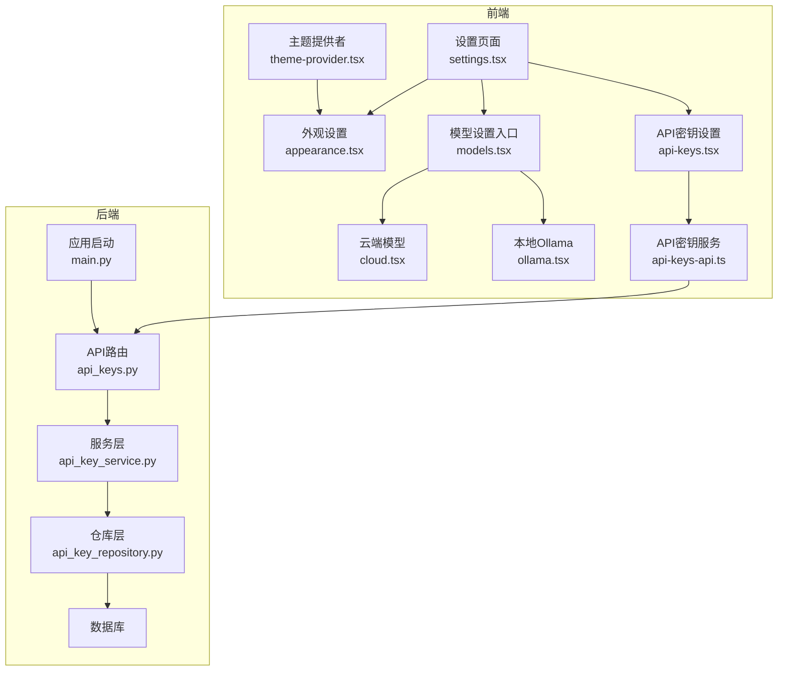
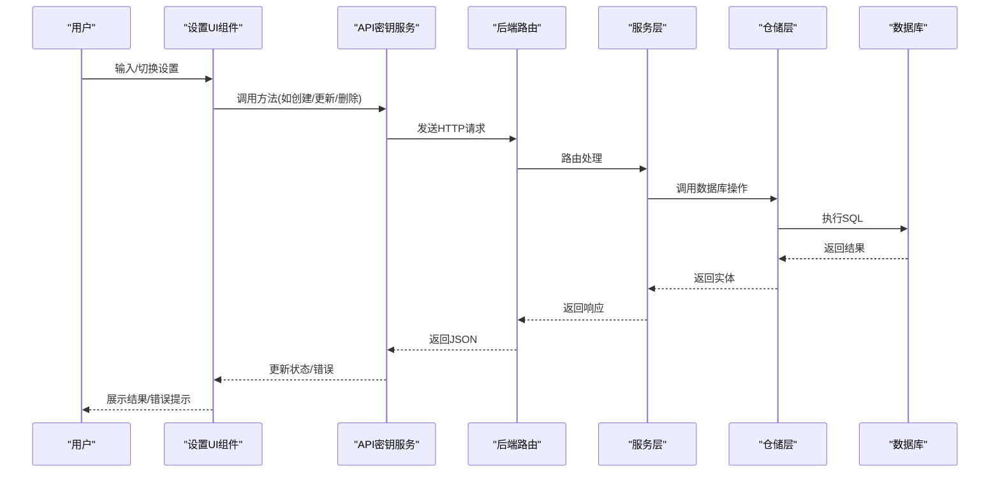
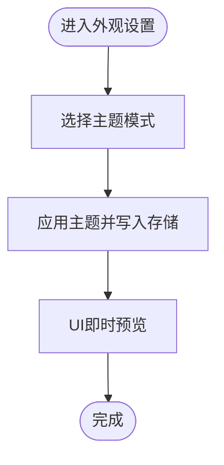
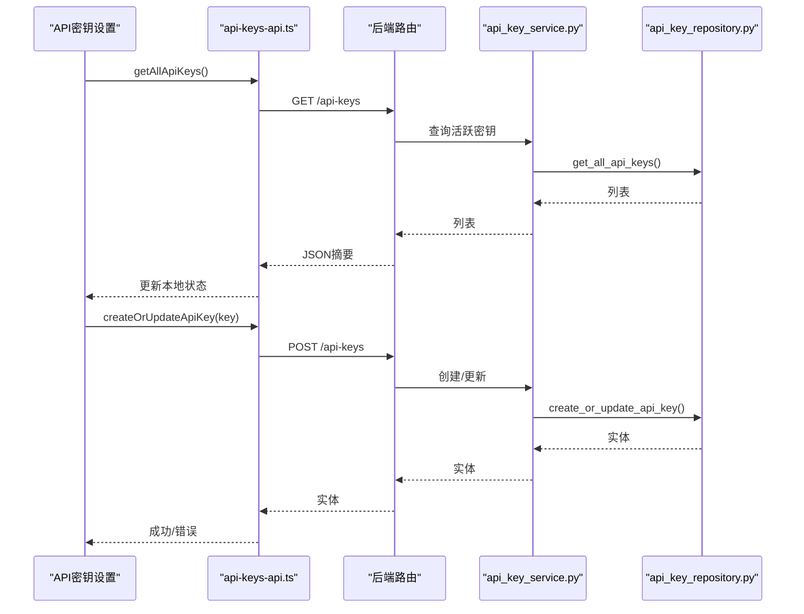
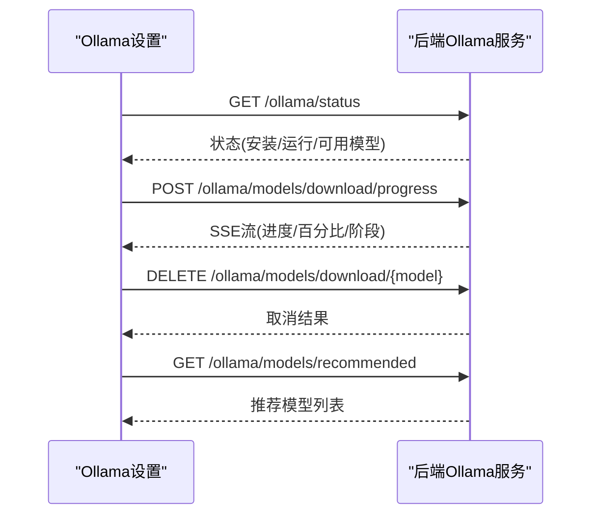
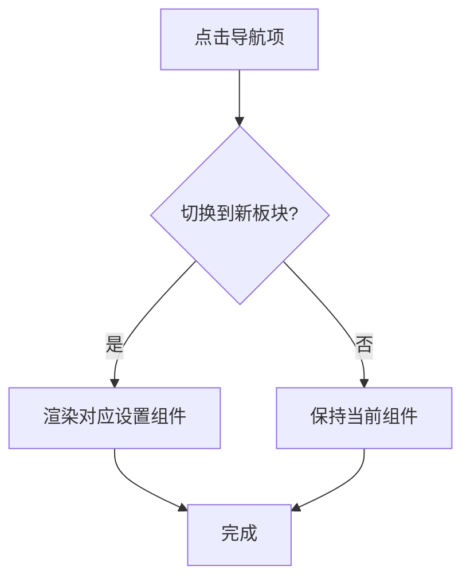
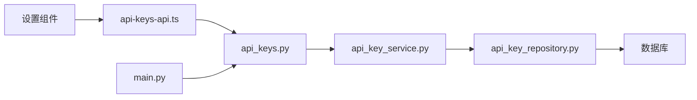

# 设置组件

<cite>
**本文引用的文件**
- [settings.tsx](file://app/frontend/src/components/settings/settings.tsx)
- [appearance.tsx](file://app/frontend/src/components/settings/appearance.tsx)
- [api-keys.tsx](file://app/frontend/src/components/settings/api-keys.tsx)
- [models.tsx](file://app/frontend/src/components/settings/models.tsx)
- [cloud.tsx](file://app/frontend/src/components/settings/models/cloud.tsx)
- [ollama.tsx](file://app/frontend/src/components/settings/models/ollama.tsx)
- [api-keys-api.ts](file://app/frontend/src/services/api-keys-api.ts)
- [theme-provider.tsx](file://app/frontend/src/providers/theme-provider.tsx)
- [index.ts](file://app/frontend/src/components/settings/index.ts)
- [api_keys.py](file://app/backend/routes/api_keys.py)
- [api_key_service.py](file://app/backend/services/api_key_service.py)
- [api_key_repository.py](file://app/backend/repositories/api_key_repository.py)
- [main.py](file://app/backend/main.py)
</cite>

## 目录
1. [简介](#简介)
2. [项目结构](#项目结构)
3. [核心组件](#核心组件)
4. [架构总览](#架构总览)
5. [详细组件分析](#详细组件分析)
6. [依赖分析](#依赖分析)
7. [性能考虑](#性能考虑)
8. [故障排查指南](#故障排查指南)
9. [结论](#结论)
10. [附录](#附录)

## 简介
本文件系统性梳理前端设置组件的实现与配置管理，覆盖外观主题、API 密钥管理、模型配置（本地 Ollama 与云端）等模块。文档重点阐述：
- 数据绑定与验证规则
- 持久化机制与安全策略
- 设置项分类组织、默认值管理与导入导出能力
- 扩展开发、配置迁移与兼容性处理
- 设置系统与全局状态的同步与实时预览

## 项目结构
设置系统由前端设置页面、服务层与后端 API 共同组成，采用分层设计：UI 组件负责交互与展示；服务层封装网络请求；后端提供 REST 接口与数据库持久化。

**图表来源**
- [settings.tsx:1-96](file://app/frontend/src/components/settings/settings.tsx#L1-L96)
- [appearance.tsx:1-81](file://app/frontend/src/components/settings/appearance.tsx#L1-L81)
- [api-keys.tsx:1-319](file://app/frontend/src/components/settings/api-keys.tsx#L1-L319)
- [models.tsx:1-95](file://app/frontend/src/components/settings/models.tsx#L1-L95)
- [cloud.tsx:1-126](file://app/frontend/src/components/settings/models/cloud.tsx#L1-L126)
- [ollama.tsx:1-931](file://app/frontend/src/components/settings/models/ollama.tsx#L1-L931)
- [api-keys-api.ts:1-158](file://app/frontend/src/services/api-keys-api.ts#L1-L158)
- [theme-provider.tsx:1-19](file://app/frontend/src/providers/theme-provider.tsx#L1-L19)
- [api_keys.py:1-201](file://app/backend/routes/api_keys.py#L1-L201)
- [api_key_service.py:1-23](file://app/backend/services/api_key_service.py#L1-L23)
- [api_key_repository.py:1-131](file://app/backend/repositories/api_key_repository.py#L1-L131)
- [main.py:1-56](file://app/backend/main.py#L1-L56)

**章节来源**
- [settings.tsx:1-96](file://app/frontend/src/components/settings/settings.tsx#L1-L96)
- [models.tsx:1-95](file://app/frontend/src/components/settings/models.tsx#L1-L95)
- [api-keys.tsx:1-319](file://app/frontend/src/components/settings/api-keys.tsx#L1-L319)
- [appearance.tsx:1-81](file://app/frontend/src/components/settings/appearance.tsx#L1-L81)
- [cloud.tsx:1-126](file://app/frontend/src/components/settings/models/cloud.tsx#L1-L126)
- [ollama.tsx:1-931](file://app/frontend/src/components/settings/models/ollama.tsx#L1-L931)
- [api-keys-api.ts:1-158](file://app/frontend/src/services/api-keys-api.ts#L1-L158)
- [theme-provider.tsx:1-19](file://app/frontend/src/providers/theme-provider.tsx#L1-L19)
- [api_keys.py:1-201](file://app/backend/routes/api_keys.py#L1-L201)
- [api_key_service.py:1-23](file://app/backend/services/api_key_service.py#L1-L23)
- [api_key_repository.py:1-131](file://app/backend/repositories/api_key_repository.py#L1-L131)
- [main.py:1-56](file://app/backend/main.py#L1-L56)

## 核心组件
- 设置导航页：聚合“API 密钥”“模型”“主题”三大板块，支持切换与内容渲染。
- 外观设置：基于主题提供者，支持亮色/暗色/系统主题切换与即时预览。
- API 密钥设置：集中管理多提供商密钥，支持自动保存、可见性切换、删除与错误提示。
- 模型设置：分“云端模型”和“本地 Ollama”两类，分别从后端接口拉取可用模型列表或管理本地模型下载与状态。
- 主题提供者：统一管理主题存储键与默认主题策略。

**章节来源**
- [settings.tsx:19-54](file://app/frontend/src/components/settings/settings.tsx#L19-L54)
- [appearance.tsx:7-78](file://app/frontend/src/components/settings/appearance.tsx#L7-L78)
- [api-keys.tsx:85-171](file://app/frontend/src/components/settings/api-keys.tsx#L85-L171)
- [models.tsx:19-45](file://app/frontend/src/components/settings/models.tsx#L19-L45)
- [cloud.tsx:24-50](file://app/frontend/src/components/settings/models/cloud.tsx#L24-L50)
- [ollama.tsx:36-80](file://app/frontend/src/components/settings/models/ollama.tsx#L36-L80)
- [theme-provider.tsx:8-18](file://app/frontend/src/providers/theme-provider.tsx#L8-L18)

## 架构总览
设置系统遵循“UI 组件 → 服务层 → 后端路由 → 仓储层 → 数据库”的调用链路。主题设置通过 next-themes 实现，无需后端参与；API 密钥与模型设置通过服务层封装的 HTTP 客户端与后端 REST 接口交互。

**图表来源**
- [api-keys-api.ts:42-156](file://app/frontend/src/services/api-keys-api.ts#L42-L156)
- [api_keys.py:19-201](file://app/backend/routes/api_keys.py#L19-L201)
- [api_key_service.py:6-23](file://app/backend/services/api_key_service.py#L6-L23)
- [api_key_repository.py:15-131](file://app/backend/repositories/api_key_repository.py#L15-L131)

**章节来源**
- [api-keys-api.ts:1-158](file://app/frontend/src/services/api-keys-api.ts#L1-L158)
- [api_keys.py:1-201](file://app/backend/routes/api_keys.py#L1-L201)
- [api_key_service.py:1-23](file://app/backend/services/api_key_service.py#L1-L23)
- [api_key_repository.py:1-131](file://app/backend/repositories/api_key_repository.py#L1-L131)

## 详细组件分析

### 外观设置（主题）
- 功能特性
  - 支持亮色、暗色、系统三种主题模式
  - 即时切换并持久化到存储键
  - 响应式 UI 预览当前选中主题
- 数据绑定与验证
  - 使用主题提供者进行状态管理，组件仅负责选择与触发
  - 无输入校验，直接写入主题状态
- 持久化机制
  - 通过主题提供者的存储键实现本地持久化
- 实时预览
  - 切换即刻生效，无需刷新页面

**图表来源**
- [appearance.tsx:7-78](file://app/frontend/src/components/settings/appearance.tsx#L7-L78)
- [theme-provider.tsx:8-18](file://app/frontend/src/providers/theme-provider.tsx#L8-L18)

**章节来源**
- [appearance.tsx:1-81](file://app/frontend/src/components/settings/appearance.tsx#L1-L81)
- [theme-provider.tsx:1-19](file://app/frontend/src/providers/theme-provider.tsx#L1-L19)

### API 密钥管理
- 功能特性
  - 分类展示金融数据与大语言模型提供商密钥
  - 自动加载已有密钥摘要与完整值
  - 输入变更即时保存，空值自动删除
  - 可见性切换与一键清空
  - 错误重试与用户反馈
- 数据绑定与验证
  - 本地状态驱动 UI，变更时调用服务层保存
  - 服务层对请求参数进行类型约束（提供方、密钥值、是否激活）
- 持久化机制
  - 通过后端 REST 接口创建/更新/删除密钥
  - 仓储层封装 SQL 操作，确保唯一性与时间戳更新
- 安全策略
  - 前端不显示真实密钥值，仅在切换可见性时临时展示
  - 后端返回摘要信息用于列表展示，详情需单独请求

**图表来源**
- [api-keys.tsx:91-150](file://app/frontend/src/components/settings/api-keys.tsx#L91-L150)
- [api-keys-api.ts:42-100](file://app/frontend/src/services/api-keys-api.ts#L42-L100)
- [api_keys.py:19-56](file://app/backend/routes/api_keys.py#L19-L56)
- [api_key_repository.py:15-46](file://app/backend/repositories/api_key_repository.py#L15-L46)

**章节来源**
- [api-keys.tsx:1-319](file://app/frontend/src/components/settings/api-keys.tsx#L1-L319)
- [api-keys-api.ts:1-158](file://app/frontend/src/services/api-keys-api.ts#L1-L158)
- [api_keys.py:1-201](file://app/backend/routes/api_keys.py#L1-L201)
- [api_key_repository.py:1-131](file://app/backend/repositories/api_key_repository.py#L1-L131)

### 模型配置（云端与本地）
- 云端模型
  - 从后端拉取所有提供商及其模型列表，按提供商排序展示
  - 提供商与模型名称均展示，便于识别
- 本地 Ollama
  - 检测安装与运行状态，支持启动/停止服务
  - 下载进度流式展示，支持取消下载
  - 自动刷新状态以显示新增模型
  - 支持删除已下载模型

**图表来源**
- [ollama.tsx:65-94](file://app/frontend/src/components/settings/models/ollama.tsx#L65-L94)
- [ollama.tsx:136-269](file://app/frontend/src/components/settings/models/ollama.tsx#L136-L269)
- [ollama.tsx:271-311](file://app/frontend/src/components/settings/models/ollama.tsx#L271-L311)
- [cloud.tsx:29-46](file://app/frontend/src/components/settings/models/cloud.tsx#L29-L46)

**章节来源**
- [models.tsx:1-95](file://app/frontend/src/components/settings/models.tsx#L1-L95)
- [cloud.tsx:1-126](file://app/frontend/src/components/settings/models/cloud.tsx#L1-L126)
- [ollama.tsx:1-931](file://app/frontend/src/components/settings/models/ollama.tsx#L1-L931)

### 设置导航与分类组织
- 导航项
  - API Keys、Models、Theme 三类设置
- 内容区
  - 根据选中项动态渲染对应组件
- 默认值管理
  - 导航默认选中“API”，可扩展为从存储读取用户偏好

**图表来源**
- [settings.tsx:43-54](file://app/frontend/src/components/settings/settings.tsx#L43-L54)

**章节来源**
- [settings.tsx:1-96](file://app/frontend/src/components/settings/settings.tsx#L1-L96)
- [index.ts:1-7](file://app/frontend/src/components/settings/index.ts#L1-L7)

## 依赖分析
- 前端依赖
  - 设置组件依赖 UI 组件库与主题提供者
  - API 密钥设置依赖服务层封装的 HTTP 客户端
- 后端依赖
  - 路由依赖数据库会话与仓储层
  - 应用启动事件检查 Ollama 状态，便于本地模型集成

**图表来源**
- [api-keys-api.ts:1-158](file://app/frontend/src/services/api-keys-api.ts#L1-L158)
- [api_keys.py:1-201](file://app/backend/routes/api_keys.py#L1-L201)
- [api_key_service.py:1-23](file://app/backend/services/api_key_service.py#L1-L23)
- [api_key_repository.py:1-131](file://app/backend/repositories/api_key_repository.py#L1-L131)
- [main.py:32-55](file://app/backend/main.py#L32-L55)

**章节来源**
- [api-keys-api.ts:1-158](file://app/frontend/src/services/api-keys-api.ts#L1-L158)
- [api_keys.py:1-201](file://app/backend/routes/api_keys.py#L1-L201)
- [api_key_service.py:1-23](file://app/backend/services/api_key_service.py#L1-L23)
- [api_key_repository.py:1-131](file://app/backend/repositories/api_key_repository.py#L1-L131)
- [main.py:1-56](file://app/backend/main.py#L1-L56)

## 性能考虑
- API 密钥设置
  - 变更自动保存，建议在高频输入场景增加防抖，避免频繁网络请求
  - 批量更新接口可用于一次性导入多个密钥，减少往返次数
- Ollama 下载
  - 流式进度监听与轮询结合，避免重复连接
  - 下载完成后立即清理进度状态，降低内存占用
- 渲染优化
  - 大型模型列表使用虚拟滚动或分页（当前实现为简单列表，后续可扩展）

## 故障排查指南
- API 密钥加载失败
  - 检查后端路由是否可达与数据库连接
  - 查看服务层异常与仓储层查询条件（仅返回激活密钥）
- Ollama 无法连接
  - 确认服务已安装且正在运行
  - 检查后端启动事件日志与前端请求地址
- 下载中断或卡住
  - 观察下载进度状态与轮询间隔
  - 尝试取消后重新开始，必要时重启服务

**章节来源**
- [api_keys.py:49-78](file://app/backend/routes/api_keys.py#L49-L78)
- [api_key_repository.py:55-60](file://app/backend/repositories/api_key_repository.py#L55-L60)
- [main.py:32-55](file://app/backend/main.py#L32-L55)
- [ollama.tsx:402-533](file://app/frontend/src/components/settings/models/ollama.tsx#L402-L533)

## 结论
该设置系统以清晰的分层架构实现了外观、密钥与模型的配置管理，具备良好的扩展性与安全性。通过服务层抽象与后端 REST 接口，前端可专注于用户体验与实时预览；后端仓储层保证数据一致性与可维护性。后续可在批量导入导出、配置迁移与兼容性处理方面进一步完善。

## 附录

### 设置项分类与默认值管理
- 分类组织
  - 外观：主题模式
  - API 密钥：金融数据与大模型提供商
  - 模型：云端与本地（Ollama）
- 默认值管理
  - 主题默认使用系统策略
  - 导航默认选中“API”板块
  - 可扩展为从本地存储读取用户偏好作为默认值

**章节来源**
- [appearance.tsx:7-29](file://app/frontend/src/components/settings/appearance.tsx#L7-L29)
- [settings.tsx:20-41](file://app/frontend/src/components/settings/settings.tsx#L20-L41)
- [theme-provider.tsx:10-15](file://app/frontend/src/providers/theme-provider.tsx#L10-L15)

### 配置导入导出与迁移
- 导入导出
  - 当前未提供专用导入导出功能，建议在服务层新增批量导入/导出接口
- 迁移与兼容
  - 新增字段时保留向后兼容，仓储层查询时忽略未知字段
  - 版本升级时记录迁移脚本并在启动事件中执行

**章节来源**
- [api_keys.py:155-179](file://app/backend/routes/api_keys.py#L155-L179)
- [api_key_repository.py:120-131](file://app/backend/repositories/api_key_repository.py#L120-L131)
- [main.py:32-55](file://app/backend/main.py#L32-L55)

### 扩展开发建议
- 新增设置项
  - 在设置导航中添加新项，并在服务层补充对应 API 客户端
  - 后端路由与仓储层按需扩展，保持一致的响应模型
- 实时预览
  - 对于需要即时生效的设置，优先使用前端状态与主题提供者
  - 对于需要后端确认的设置，采用异步保存并提供反馈

**章节来源**
- [settings.tsx:22-41](file://app/frontend/src/components/settings/settings.tsx#L22-L41)
- [api-keys-api.ts:42-156](file://app/frontend/src/services/api-keys-api.ts#L42-L156)
- [api_keys.py:19-201](file://app/backend/routes/api_keys.py#L19-L201)