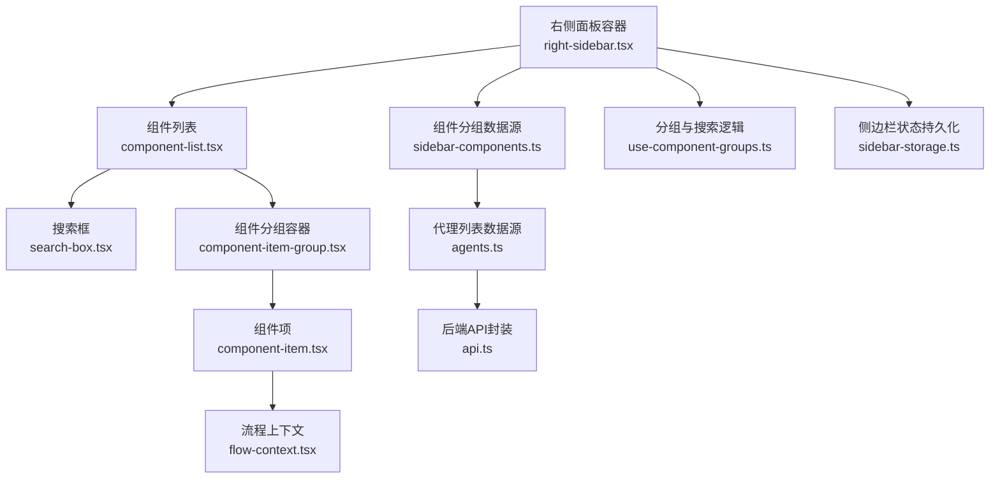
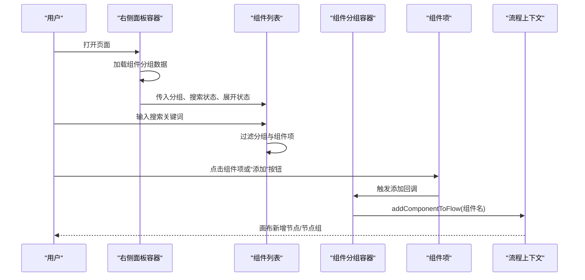
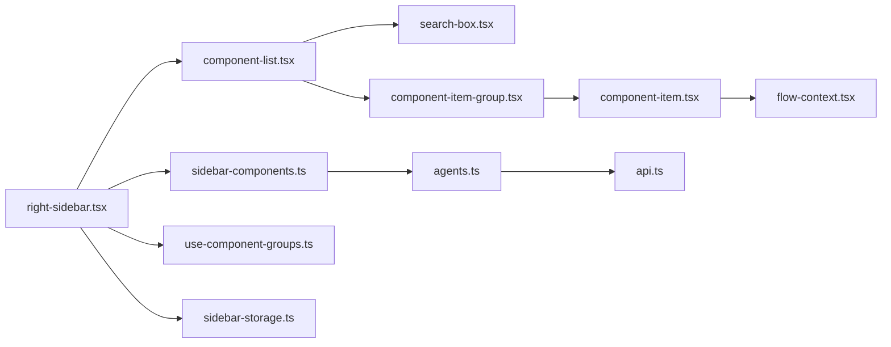

# 右侧面板

<cite>
**本文引用的文件**
- [app/frontend/src/components/panels/right/right-sidebar.tsx](file://app/frontend/src/components/panels/right/right-sidebar.tsx)
- [app/frontend/src/components/panels/right/component-list.tsx](file://app/frontend/src/components/panels/right/component-list.tsx)
- [app/frontend/src/components/panels/right/component-item-group.tsx](file://app/frontend/src/components/panels/right/component-item-group.tsx)
- [app/frontend/src/components/panels/right/component-item.tsx](file://app/frontend/src/components/panels/right/component-item.tsx)
- [app/frontend/src/components/panels/right/component-actions.tsx](file://app/frontend/src/components/panels/right/component-actions.tsx)
- [app/frontend/src/components/panels/search-box.tsx](file://app/frontend/src/components/panels/search-box.tsx)
- [app/frontend/src/data/sidebar-components.ts](file://app/frontend/src/data/sidebar-components.ts)
- [app/frontend/src/hooks/use-component-groups.ts](file://app/frontend/src/hooks/use-component-groups.ts)
- [app/frontend/src/services/sidebar-storage.ts](file://app/frontend/src/services/sidebar-storage.ts)
- [app/frontend/src/contexts/flow-context.tsx](file://app/frontend/src/contexts/flow-context.tsx)
- [app/frontend/src/services/api.ts](file://app/frontend/src/services/api.ts)
- [app/frontend/src/data/agents.ts](file://app/frontend/src/data/agents.ts)
- [app/frontend/src/components/Layout.tsx](file://app/frontend/src/components/Layout.tsx)
</cite>

## 目录
1. [简介](#简介)
2. [项目结构](#项目结构)
3. [核心组件](#核心组件)
4. [架构总览](#架构总览)
5. [组件详解](#组件详解)
6. [依赖关系分析](#依赖关系分析)
7. [性能与缓存](#性能与缓存)
8. [故障排查指南](#故障排查指南)
9. [结论](#结论)
10. [附录：扩展与定制](#附录扩展与定制)

## 简介
本文件系统性地文档化右侧面板（组件库）的设计与实现，覆盖组件分类展示、组件项渲染与拖拽添加到画布、分组逻辑、搜索过滤、交互按钮、属性配置与预览、数据加载与缓存策略、性能优化以及扩展方案（自定义组件导入与组件库扩展）。目标是帮助开发者快速理解并维护该模块。

## 项目结构
右侧面板位于前端应用的“面板”层，采用分层组织：
- 面板容器：右侧边栏容器负责宽度可调、折叠状态与组件列表渲染
- 列表与分组：组件列表根据分组展开/收起，并支持搜索过滤
- 组件项：每个组件项在悬停时显示“添加”按钮，点击后通过流程上下文添加到画布
- 数据与钩子：组件分组数据来源、搜索与分组状态逻辑由独立钩子处理
- 上下文集成：组件添加最终委托给流程上下文，以统一管理节点创建与画布更新

图表来源
- [app/frontend/src/components/panels/right/right-sidebar.tsx:1-97](file://app/frontend/src/components/panels/right/right-sidebar.tsx#L1-L97)
- [app/frontend/src/components/panels/right/component-list.tsx:1-70](file://app/frontend/src/components/panels/right/component-list.tsx#L1-L70)
- [app/frontend/src/components/panels/right/component-item-group.tsx:1-49](file://app/frontend/src/components/panels/right/component-item-group.tsx#L1-L49)
- [app/frontend/src/components/panels/right/component-item.tsx:1-66](file://app/frontend/src/components/panels/right/component-item.tsx#L1-L66)
- [app/frontend/src/data/sidebar-components.ts:1-74](file://app/frontend/src/data/sidebar-components.ts#L1-L74)
- [app/frontend/src/data/agents.ts:1-31](file://app/frontend/src/data/agents.ts#L1-L31)
- [app/frontend/src/services/api.ts:1-309](file://app/frontend/src/services/api.ts#L1-L309)
- [app/frontend/src/hooks/use-component-groups.ts:1-71](file://app/frontend/src/hooks/use-component-groups.ts#L1-L71)
- [app/frontend/src/services/sidebar-storage.ts:1-237](file://app/frontend/src/services/sidebar-storage.ts#L1-L237)
- [app/frontend/src/contexts/flow-context.tsx:1-358](file://app/frontend/src/contexts/flow-context.tsx#L1-L358)

章节来源
- [app/frontend/src/components/panels/right/right-sidebar.tsx:1-97](file://app/frontend/src/components/panels/right/right-sidebar.tsx#L1-L97)
- [app/frontend/src/components/panels/right/component-list.tsx:1-70](file://app/frontend/src/components/panels/right/component-list.tsx#L1-L70)
- [app/frontend/src/components/panels/right/component-item-group.tsx:1-49](file://app/frontend/src/components/panels/right/component-item-group.tsx#L1-L49)
- [app/frontend/src/components/panels/right/component-item.tsx:1-66](file://app/frontend/src/components/panels/right/component-item.tsx#L1-L66)
- [app/frontend/src/components/panels/right/component-actions.tsx:1-23](file://app/frontend/src/components/panels/right/component-actions.tsx#L1-L23)
- [app/frontend/src/components/panels/search-box.tsx:1-43](file://app/frontend/src/components/panels/search-box.tsx#L1-L43)
- [app/frontend/src/data/sidebar-components.ts:1-74](file://app/frontend/src/data/sidebar-components.ts#L1-L74)
- [app/frontend/src/hooks/use-component-groups.ts:1-71](file://app/frontend/src/hooks/use-component-groups.ts#L1-L71)
- [app/frontend/src/services/sidebar-storage.ts:1-237](file://app/frontend/src/services/sidebar-storage.ts#L1-L237)
- [app/frontend/src/contexts/flow-context.tsx:1-358](file://app/frontend/src/contexts/flow-context.tsx#L1-L358)
- [app/frontend/src/services/api.ts:1-309](file://app/frontend/src/services/api.ts#L1-L309)
- [app/frontend/src/data/agents.ts:1-31](file://app/frontend/src/data/agents.ts#L1-L31)
- [app/frontend/src/components/Layout.tsx:1-201](file://app/frontend/src/components/Layout.tsx#L1-L201)

## 核心组件
- 右侧面板容器：负责宽度调整、折叠控制、组件分组加载与传递状态给列表组件
- 组件列表：渲染搜索框、分组 Accordion、空态提示与加载态
- 组件分组容器：按分组渲染组件项，处理点击事件并委托给流程上下文添加节点
- 组件项：单个组件条目，悬停显示“添加”按钮，支持键盘激活
- 搜索框：带清空按钮的输入控件，绑定查询状态
- 分组与搜索钩子：集中处理搜索过滤、分组展开状态与匹配结果的展开行为
- 组件分组数据源：定义各分组名称、图标、颜色与组件项；动态拉取代理列表
- 流程上下文：统一对接节点创建、多节点组合创建与画布更新
- 侧边栏状态持久化：将折叠状态保存到本地存储
- 布局容器：将右侧面板嵌入整体布局，处理宽度与定位

章节来源
- [app/frontend/src/components/panels/right/right-sidebar.tsx:1-97](file://app/frontend/src/components/panels/right/right-sidebar.tsx#L1-L97)
- [app/frontend/src/components/panels/right/component-list.tsx:1-70](file://app/frontend/src/components/panels/right/component-list.tsx#L1-L70)
- [app/frontend/src/components/panels/right/component-item-group.tsx:1-49](file://app/frontend/src/components/panels/right/component-item-group.tsx#L1-L49)
- [app/frontend/src/components/panels/right/component-item.tsx:1-66](file://app/frontend/src/components/panels/right/component-item.tsx#L1-L66)
- [app/frontend/src/components/panels/search-box.tsx:1-43](file://app/frontend/src/components/panels/search-box.tsx#L1-L43)
- [app/frontend/src/hooks/use-component-groups.ts:1-71](file://app/frontend/src/hooks/use-component-groups.ts#L1-L71)
- [app/frontend/src/data/sidebar-components.ts:1-74](file://app/frontend/src/data/sidebar-components.ts#L1-L74)
- [app/frontend/src/contexts/flow-context.tsx:1-358](file://app/frontend/src/contexts/flow-context.tsx#L1-L358)
- [app/frontend/src/services/sidebar-storage.ts:1-237](file://app/frontend/src/services/sidebar-storage.ts#L1-L237)
- [app/frontend/src/components/Layout.tsx:1-201](file://app/frontend/src/components/Layout.tsx#L1-L201)

## 架构总览
右侧面板通过“容器-列表-分组-项”的层级结构组织，配合钩子与数据源完成搜索与分组状态管理；最终通过流程上下文将组件添加到画布中。

图表来源
- [app/frontend/src/components/panels/right/right-sidebar.tsx:38-53](file://app/frontend/src/components/panels/right/right-sidebar.tsx#L38-L53)
- [app/frontend/src/components/panels/right/component-list.tsx:29-54](file://app/frontend/src/components/panels/right/component-list.tsx#L29-L54)
- [app/frontend/src/components/panels/right/component-item-group.tsx:18-24](file://app/frontend/src/components/panels/right/component-item-group.tsx#L18-L24)
- [app/frontend/src/components/panels/right/component-item.tsx:23-26](file://app/frontend/src/components/panels/right/component-item.tsx#L23-L26)
- [app/frontend/src/contexts/flow-context.tsx:334-340](file://app/frontend/src/contexts/flow-context.tsx#L334-L340)

## 组件详解

### 右侧面板容器（RightSidebar）
- 负责：
  - 使用可调整宽度钩子初始化宽度与拖拽
  - 加载组件分组数据（首次挂载）
  - 将搜索、分组展开、过滤结果等状态传递给组件列表
  - 提供宽度变化回调给父级布局进行定位计算
- 关键点：
  - 宽度默认值、最小/最大限制
  - 加载失败时的错误日志
  - 与布局容器联动，动态计算主内容区位置

章节来源
- [app/frontend/src/components/panels/right/right-sidebar.tsx:17-97](file://app/frontend/src/components/panels/right/right-sidebar.tsx#L17-L97)
- [app/frontend/src/components/Layout.tsx:150-161](file://app/frontend/src/components/Layout.tsx#L150-L161)

### 组件列表（ComponentList）
- 负责：
  - 渲染搜索框与过滤结果
  - 在加载态与空态之间切换
  - 使用 Accordion 展示分组，支持多组展开
- 关键点：
  - 过滤逻辑基于组件名大小写不敏感匹配
  - 搜索模式下自动展开包含匹配项的分组

章节来源
- [app/frontend/src/components/panels/right/component-list.tsx:17-70](file://app/frontend/src/components/panels/right/component-list.tsx#L17-L70)
- [app/frontend/src/components/panels/search-box.tsx:10-43](file://app/frontend/src/components/panels/search-box.tsx#L10-L43)

### 组件分组容器（ComponentItemGroup）
- 负责：
  - 渲染分组标题与图标
  - 遍历分组内的组件项并渲染
  - 将点击事件委托给流程上下文添加节点
- 关键点：
  - 使用流程上下文的添加方法
  - 为每个组件项传递当前激活项状态

章节来源
- [app/frontend/src/components/panels/right/component-item-group.tsx:11-49](file://app/frontend/src/components/panels/right/component-item-group.tsx#L11-L49)
- [app/frontend/src/contexts/flow-context.tsx:334-340](file://app/frontend/src/contexts/flow-context.tsx#L334-L340)

### 组件项（ComponentItem）
- 负责：
  - 渲染组件图标与标签
  - 悬停显示“添加”按钮，阻止事件冒泡
  - 支持点击与回车键激活
  - 根据是否为激活项设置样式
- 关键点：
  - “添加”按钮使用通用 Button 组件
  - 点击回调通过 props 传入

章节来源
- [app/frontend/src/components/panels/right/component-item.tsx:14-66](file://app/frontend/src/components/panels/right/component-item.tsx#L14-L66)

### 搜索框（SearchBox）
- 负责：
  - 输入框绑定查询状态
  - 显示清空按钮并在有输入时出现
- 关键点：
  - 清空按钮会重置查询状态为空

章节来源
- [app/frontend/src/components/panels/search-box.tsx:10-43](file://app/frontend/src/components/panels/search-box.tsx#L10-L43)

### 组件分组与搜索逻辑（useComponentGroups）
- 负责：
  - 维护搜索词、激活项、展开分组集合
  - 计算过滤后的分组（仅保留包含匹配项的分组）
  - 搜索模式下自动展开所有匹配分组
  - 处理 Accordion 的展开/收起逻辑，避免影响搜索体验
- 关键点：
  - 使用 useMemo 缓存过滤结果
  - 在搜索退出时恢复原有展开状态

章节来源
- [app/frontend/src/hooks/use-component-groups.ts:4-71](file://app/frontend/src/hooks/use-component-groups.ts#L4-L71)

### 组件分组数据源（sidebar-components.ts）
- 负责：
  - 定义各分组名称、图标与颜色
  - 动态从后端获取代理列表并映射为组件项
  - 返回标准的分组结构用于渲染
- 关键点：
  - 代理列表通过 agents.ts 获取，内部有缓存
  - 后端接口由 api.ts 提供

章节来源
- [app/frontend/src/data/sidebar-components.ts:31-74](file://app/frontend/src/data/sidebar-components.ts#L31-L74)
- [app/frontend/src/data/agents.ts:18-31](file://app/frontend/src/data/agents.ts#L18-L31)
- [app/frontend/src/services/api.ts:17-29](file://app/frontend/src/services/api.ts#L17-L29)

### 流程上下文（FlowContext）
- 负责：
  - 统一添加组件到画布：单节点或多节点组合
  - 计算画布中心位置作为插入点
  - 更新未保存标记、触发视图适配
- 关键点：
  - 单节点创建：根据组件名解析节点类型定义并创建
  - 多节点组合：解析多节点定义，计算组内边界并居中放置，再创建边
  - 错误捕获与日志输出

章节来源
- [app/frontend/src/contexts/flow-context.tsx:216-340](file://app/frontend/src/contexts/flow-context.tsx#L216-L340)

### 侧边栏状态持久化（SidebarStorageService）
- 负责：
  - 将左右侧边栏与底部面板的折叠状态保存到本地存储
  - 提供加载、清除、重置等能力
- 关键点：
  - 使用独立键名区分不同面板状态
  - 提供批量保存与加载

章节来源
- [app/frontend/src/services/sidebar-storage.ts:7-237](file://app/frontend/src/services/sidebar-storage.ts#L7-L237)
- [app/frontend/src/components/Layout.tsx:24-62](file://app/frontend/src/components/Layout.tsx#L24-L62)

## 依赖关系分析
- 容器依赖：
  - 右侧面板容器依赖组件列表、组件动作、可调整宽度钩子与组件分组数据源
- 列表依赖：
  - 组件列表依赖搜索框、组件分组容器与 Accordion
- 分组容器依赖：
  - 组件分组容器依赖流程上下文与组件项
- 组件项依赖：
  - 组件项依赖通用 Button 与图标库
- 数据与钩子：
  - 组件分组数据源依赖代理数据源与后端 API
  - useComponentGroups 依赖组件分组数据源
- 上下文：
  - 流程上下文依赖节点映射与 ReactFlow 实例

图表来源
- [app/frontend/src/components/panels/right/right-sidebar.tsx:1-97](file://app/frontend/src/components/panels/right/right-sidebar.tsx#L1-L97)
- [app/frontend/src/components/panels/right/component-list.tsx:1-70](file://app/frontend/src/components/panels/right/component-list.tsx#L1-L70)
- [app/frontend/src/components/panels/right/component-item-group.tsx:1-49](file://app/frontend/src/components/panels/right/component-item-group.tsx#L1-L49)
- [app/frontend/src/components/panels/right/component-item.tsx:1-66](file://app/frontend/src/components/panels/right/component-item.tsx#L1-L66)
- [app/frontend/src/components/panels/search-box.tsx:1-43](file://app/frontend/src/components/panels/search-box.tsx#L1-L43)
- [app/frontend/src/data/sidebar-components.ts:1-74](file://app/frontend/src/data/sidebar-components.ts#L1-L74)
- [app/frontend/src/data/agents.ts:1-31](file://app/frontend/src/data/agents.ts#L1-L31)
- [app/frontend/src/services/api.ts:1-309](file://app/frontend/src/services/api.ts#L1-L309)
- [app/frontend/src/hooks/use-component-groups.ts:1-71](file://app/frontend/src/hooks/use-component-groups.ts#L1-L71)
- [app/frontend/src/services/sidebar-storage.ts:1-237](file://app/frontend/src/services/sidebar-storage.ts#L1-L237)
- [app/frontend/src/contexts/flow-context.tsx:1-358](file://app/frontend/src/contexts/flow-context.tsx#L1-L358)

## 性能与缓存
- 代理列表缓存：
  - agents.ts 内部维护内存缓存，避免重复请求后端接口
  - 首次请求成功后复用缓存数据
- 过滤与展开优化：
  - useComponentGroups 使用 useMemo 缓存过滤结果，减少不必要的渲染
  - 搜索模式下仅展开包含匹配项的分组，避免一次性展开全部导致的性能问题
- 组件渲染：
  - 组件项使用轻量级交互（悬停显隐“添加”按钮），避免复杂副作用
- 画布更新：
  - 添加节点时仅更新必要的节点与边集合，避免全量重绘
- 存储与布局：
  - 侧边栏状态持久化使用本地存储，减少每次加载的网络请求

章节来源
- [app/frontend/src/data/agents.ts:11-31](file://app/frontend/src/data/agents.ts#L11-L31)
- [app/frontend/src/hooks/use-component-groups.ts:10-26](file://app/frontend/src/hooks/use-component-groups.ts#L10-L26)
- [app/frontend/src/services/sidebar-storage.ts:1-237](file://app/frontend/src/services/sidebar-storage.ts#L1-L237)
- [app/frontend/src/contexts/flow-context.tsx:216-340](file://app/frontend/src/contexts/flow-context.tsx#L216-L340)

## 故障排查指南
- 组件列表为空或加载失败：
  - 检查组件分组数据源是否正确返回数据
  - 查看控制台是否有加载错误日志
- 搜索无结果：
  - 确认搜索词大小写不敏感匹配逻辑是否符合预期
  - 检查过滤后的分组是否被正确展开
- 添加组件无效：
  - 检查流程上下文中的节点类型定义是否存在
  - 确认组件名与节点映射一致
- 画布无响应：
  - 检查 ReactFlow 实例是否已正确初始化
  - 确认节点创建函数返回的节点结构是否合法
- 折叠状态异常：
  - 检查本地存储键值是否存在或格式是否正确
  - 确认布局容器是否正确读取并保存状态

章节来源
- [app/frontend/src/components/panels/right/right-sidebar.tsx:40-50](file://app/frontend/src/components/panels/right/right-sidebar.tsx#L40-L50)
- [app/frontend/src/hooks/use-component-groups.ts:28-58](file://app/frontend/src/hooks/use-component-groups.ts#L28-L58)
- [app/frontend/src/contexts/flow-context.tsx:216-340](file://app/frontend/src/contexts/flow-context.tsx#L216-L340)
- [app/frontend/src/services/sidebar-storage.ts:69-129](file://app/frontend/src/services/sidebar-storage.ts#L69-L129)

## 结论
右侧面板通过清晰的分层设计与职责分离，实现了组件分类展示、搜索过滤、交互按钮与最终添加到画布的完整闭环。结合代理列表缓存、过滤结果缓存与状态持久化，保证了良好的用户体验与性能表现。后续可通过扩展组件分组数据源与节点映射来实现自定义组件导入与组件库扩展。

## 附录：扩展与定制

### 组件分类管理
- 新增分组：
  - 在组件分组数据源中添加新的分组对象，包含名称、图标、颜色与组件项数组
  - 若组件项来自后端，确保代理数据源已同步
- 自定义图标与颜色：
  - 使用图标库提供的图标组件与颜色类名
- 动态分组：
  - 可通过条件判断在运行时拼装分组列表

章节来源
- [app/frontend/src/data/sidebar-components.ts:31-74](file://app/frontend/src/data/sidebar-components.ts#L31-L74)

### 自定义组件导入
- 节点映射扩展：
  - 在节点映射文件中注册新组件的类型定义与创建函数
  - 对于多节点组合，提供节点偏移与边连接定义
- 画布集成：
  - 确保流程上下文能够识别新组件名并正确创建节点或节点组
- 预览与属性：
  - 在节点组件中实现属性配置与预览逻辑，保持与画布渲染一致

章节来源
- [app/frontend/src/contexts/flow-context.tsx:216-340](file://app/frontend/src/contexts/flow-context.tsx#L216-L340)

### 组件库扩展的技术方案
- 后端接口：
  - 通过代理数据源与 API 封装对接后端，实现组件清单的动态拉取
- 前端缓存：
  - 在代理数据源中维持内存缓存，必要时提供刷新机制
- 搜索与分组：
  - 保持现有过滤与展开逻辑，确保新组件可被检索与展示
- 状态持久化：
  - 通过侧边栏状态服务保存折叠状态，提升用户使用连续性

章节来源
- [app/frontend/src/data/agents.ts:11-31](file://app/frontend/src/data/agents.ts#L11-L31)
- [app/frontend/src/services/api.ts:17-29](file://app/frontend/src/services/api.ts#L17-L29)
- [app/frontend/src/services/sidebar-storage.ts:1-237](file://app/frontend/src/services/sidebar-storage.ts#L1-L237)