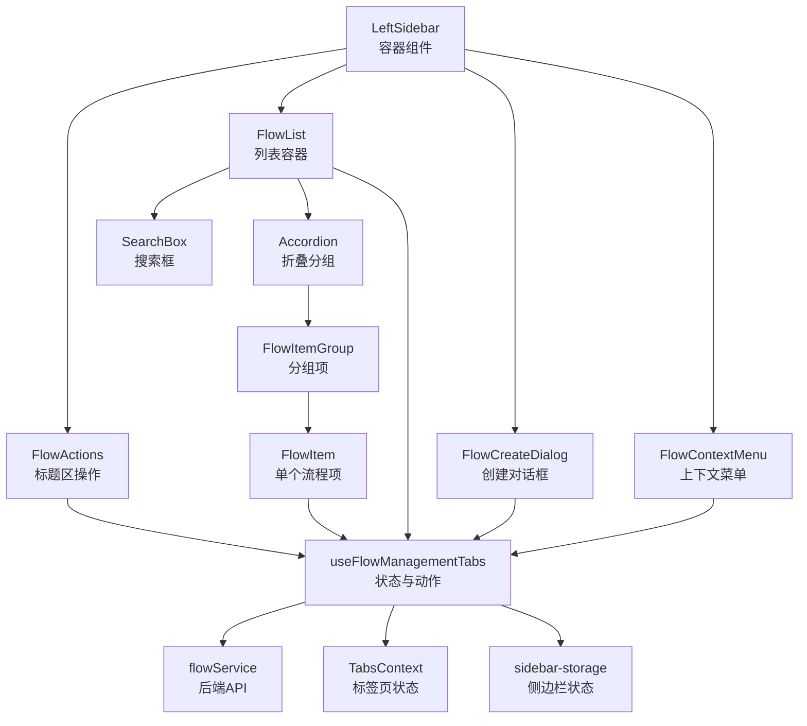
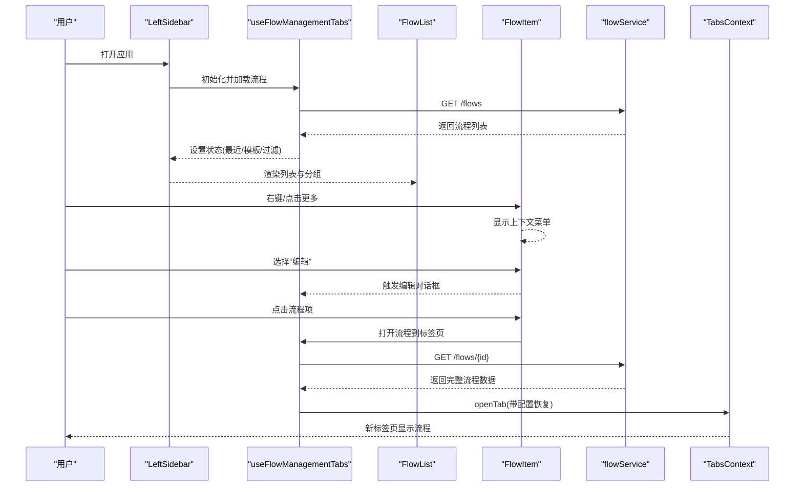
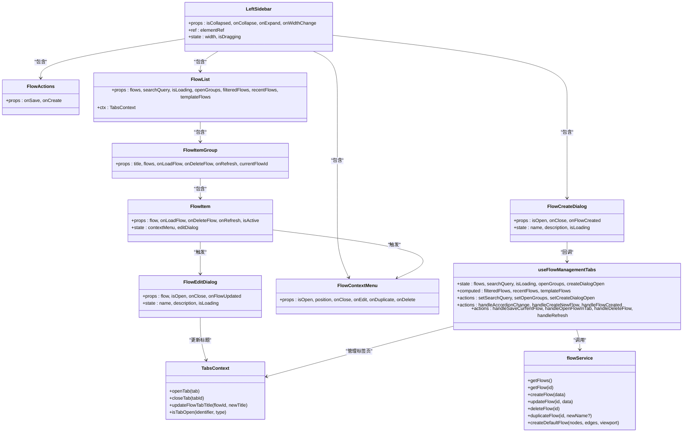
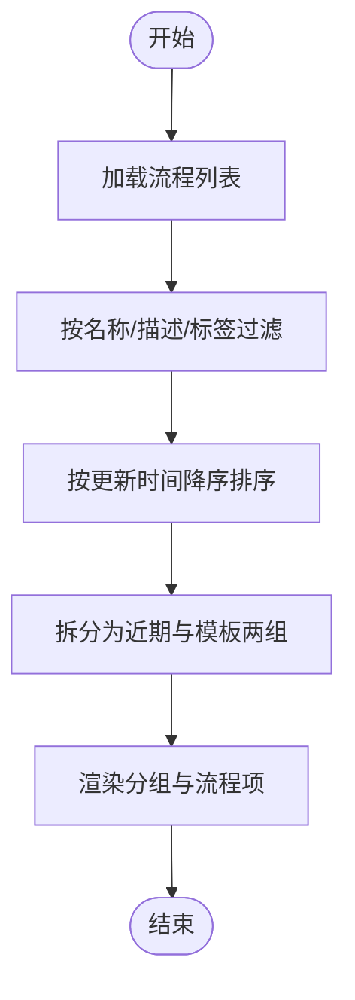
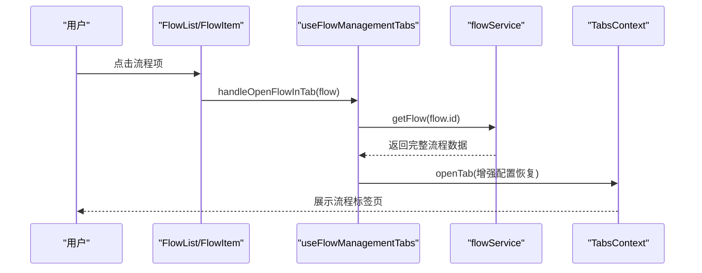

# 左侧面板

<cite>
**本文引用的文件**
- [app/frontend/src/components/panels/left/left-sidebar.tsx](file://app/frontend/src/components/panels/left/left-sidebar.tsx)
- [app/frontend/src/components/panels/left/flow-list.tsx](file://app/frontend/src/components/panels/left/flow-list.tsx)
- [app/frontend/src/components/panels/left/flow-item-group.tsx](file://app/frontend/src/components/panels/left/flow-item-group.tsx)
- [app/frontend/src/components/panels/left/flow-item.tsx](file://app/frontend/src/components/panels/left/flow-item.tsx)
- [app/frontend/src/components/panels/left/flow-actions.tsx](file://app/frontend/src/components/panels/left/flow-actions.tsx)
- [app/frontend/src/components/panels/left/flow-create-dialog.tsx](file://app/frontend/src/components/panels/left/flow-create-dialog.tsx)
- [app/frontend/src/components/panels/left/flow-edit-dialog.tsx](file://app/frontend/src/components/panels/left/flow-edit-dialog.tsx)
- [app/frontend/src/components/panels/left/flow-context-menu.tsx](file://app/frontend/src/components/panels/left/flow-context-menu.tsx)
- [app/frontend/src/components/panels/search-box.tsx](file://app/frontend/src/components/panels/search-box.tsx)
- [app/frontend/src/hooks/use-flow-management-tabs.ts](file://app/frontend/src/hooks/use-flow-management-tabs.ts)
- [app/frontend/src/services/flow-service.ts](file://app/frontend/src/services/flow-service.ts)
- [app/frontend/src/types/flow.ts](file://app/frontend/src/types/flow.ts)
- [app/frontend/src/contexts/tabs-context.tsx](file://app/frontend/src/contexts/tabs-context.tsx)
- [app/frontend/src/hooks/use-keyboard-shortcuts.ts](file://app/frontend/src/hooks/use-keyboard-shortcuts.ts)
- [app/frontend/src/services/sidebar-storage.ts](file://app/frontend/src/services/sidebar-storage.ts)
</cite>

## 目录
1. [简介](#简介)
2. [项目结构](#项目结构)
3. [核心组件](#核心组件)
4. [架构总览](#架构总览)
5. [详细组件分析](#详细组件分析)
6. [依赖关系分析](#依赖关系分析)
7. [性能考量](#性能考量)
8. [故障排查指南](#故障排查指南)
9. [结论](#结论)
10. [附录](#附录)

## 简介
本文件系统性地文档化左侧面板（工作流面板）的设计与实现，覆盖以下主题：
- 整体布局与导航结构：标题区、搜索框、折叠分组、列表区域、创建/保存按钮、可调整宽度等。
- 工作流列表管理：按最近使用与模板分类、搜索过滤、加载状态、空态提示。
- 流程项展示与交互：名称、时间戳、标签、运行中指示、右键菜单、编辑对话框、删除确认。
- 操作功能：创建新流程、保存当前流程、打开流程到标签页、删除流程、刷新列表。
- 上下文菜单与快捷操作：菜单触发、Esc 关闭、编辑/复制/删除动作。
- 状态管理与持久化：本地存储（最近选中、标签页、侧边栏折叠）、后端 API 同步。
- 搜索过滤、批量操作与键盘快捷键支持方案。

## 项目结构
左侧面板由一个容器组件承载，内部包含标题操作区、搜索框、折叠分组的流程列表、以及若干对话框与上下文菜单。其核心数据与行为通过自定义 Hook 管理，并通过服务层与后端 API 交互。

图表来源
- [app/frontend/src/components/panels/left/left-sidebar.tsx:17-101](file://app/frontend/src/components/panels/left/left-sidebar.tsx#L17-L101)
- [app/frontend/src/components/panels/left/flow-list.tsx:23-114](file://app/frontend/src/components/panels/left/flow-list.tsx#L23-L114)
- [app/frontend/src/components/panels/left/flow-item-group.tsx:15-46](file://app/frontend/src/components/panels/left/flow-item-group.tsx#L15-L46)
- [app/frontend/src/components/panels/left/flow-item.tsx:26-201](file://app/frontend/src/components/panels/left/flow-item.tsx#L26-L201)
- [app/frontend/src/components/panels/left/flow-actions.tsx:11-45](file://app/frontend/src/components/panels/left/flow-actions.tsx#L11-L45)
- [app/frontend/src/components/panels/left/flow-create-dialog.tsx:22-134](file://app/frontend/src/components/panels/left/flow-create-dialog.tsx#L22-L134)
- [app/frontend/src/components/panels/left/flow-context-menu.tsx:15-101](file://app/frontend/src/components/panels/left/flow-context-menu.tsx#L15-L101)
- [app/frontend/src/hooks/use-flow-management-tabs.ts:45-337](file://app/frontend/src/hooks/use-flow-management-tabs.ts#L45-L337)
- [app/frontend/src/services/flow-service.ts:27-108](file://app/frontend/src/services/flow-service.ts#L27-L108)
- [app/frontend/src/contexts/tabs-context.tsx:59-271](file://app/frontend/src/contexts/tabs-context.tsx#L59-L271)
- [app/frontend/src/services/sidebar-storage.ts:7-237](file://app/frontend/src/services/sidebar-storage.ts#L7-L237)

章节来源
- [app/frontend/src/components/panels/left/left-sidebar.tsx:17-101](file://app/frontend/src/components/panels/left/left-sidebar.tsx#L17-L101)
- [app/frontend/src/components/panels/left/flow-list.tsx:23-114](file://app/frontend/src/components/panels/left/flow-list.tsx#L23-L114)

## 核心组件
- 容器与尺寸控制：左侧边栏容器负责宽度计算、拖拽调整、折叠状态与父级通信。
- 标题区操作：保存当前流程、新建流程两个快捷按钮。
- 列表容器：搜索框、加载状态、折叠分组（最近与模板）、空态提示。
- 分组项：每个分组包含若干流程项，支持展开/收起。
- 单个流程项：名称、时间戳、标签、运行中指示、右键菜单、更多按钮。
- 对话框：创建流程、编辑流程（含键盘快捷键支持）。
- 上下文菜单：编辑、复制、删除三项操作，支持点击外部关闭与 Esc 关闭。

章节来源
- [app/frontend/src/components/panels/left/left-sidebar.tsx:17-101](file://app/frontend/src/components/panels/left/left-sidebar.tsx#L17-L101)
- [app/frontend/src/components/panels/left/flow-actions.tsx:11-45](file://app/frontend/src/components/panels/left/flow-actions.tsx#L11-L45)
- [app/frontend/src/components/panels/left/flow-list.tsx:23-114](file://app/frontend/src/components/panels/left/flow-list.tsx#L23-L114)
- [app/frontend/src/components/panels/left/flow-item-group.tsx:15-46](file://app/frontend/src/components/panels/left/flow-item-group.tsx#L15-L46)
- [app/frontend/src/components/panels/left/flow-item.tsx:26-201](file://app/frontend/src/components/panels/left/flow-item.tsx#L26-L201)
- [app/frontend/src/components/panels/left/flow-create-dialog.tsx:22-134](file://app/frontend/src/components/panels/left/flow-create-dialog.tsx#L22-L134)
- [app/frontend/src/components/panels/left/flow-edit-dialog.tsx:24-138](file://app/frontend/src/components/panels/left/flow-edit-dialog.tsx#L24-L138)
- [app/frontend/src/components/panels/left/flow-context-menu.tsx:15-101](file://app/frontend/src/components/panels/left/flow-context-menu.tsx#L15-L101)

## 架构总览
左侧面板采用“容器 + 组合子”的结构，状态与业务逻辑集中在自定义 Hook 中，UI 组件仅负责渲染与事件传递。数据从后端 API 获取，结合本地存储与标签页上下文，形成完整的生命周期闭环。

图表来源
- [app/frontend/src/components/panels/left/left-sidebar.tsx:35-53](file://app/frontend/src/components/panels/left/left-sidebar.tsx#L35-L53)
- [app/frontend/src/hooks/use-flow-management-tabs.ts:132-148](file://app/frontend/src/hooks/use-flow-management-tabs.ts#L132-L148)
- [app/frontend/src/services/flow-service.ts:29-44](file://app/frontend/src/services/flow-service.ts#L29-L44)
- [app/frontend/src/contexts/tabs-context.tsx:154-177](file://app/frontend/src/contexts/tabs-context.tsx#L154-L177)

## 详细组件分析

### 左侧边栏容器（LeftSidebar）
- 职责：承载标题区、列表区、创建对话框；处理宽度拖拽与通知父组件；集成状态与动作。
- 关键点：
  - 使用自定义 Hook 计算宽度、最小/最大限制、拖拽状态。
  - 将宽度变化回调传给父组件以协调布局。
  - 通过 useFlowManagementTabs 提供的 actions 与状态驱动子组件。

章节来源
- [app/frontend/src/components/panels/left/left-sidebar.tsx:17-101](file://app/frontend/src/components/panels/left/left-sidebar.tsx#L17-L101)

### 标题区操作（FlowActions）
- 职责：显示“Flows”标题与未保存标记，提供保存与新建按钮。
- 关键点：
  - 保存按钮绑定当前流程名与未保存状态。
  - 新建按钮打开创建对话框。

章节来源
- [app/frontend/src/components/panels/left/flow-actions.tsx:11-45](file://app/frontend/src/components/panels/left/flow-actions.tsx#L11-L45)

### 列表容器（FlowList）
- 职责：渲染搜索框、加载状态、折叠分组、空态提示；根据活动标签页高亮当前流程。
- 关键点：
  - 使用 TabsContext 获取当前活动标签页，判断是否为流程标签并提取流程 ID。
  - 近期与模板分组分别渲染，支持多组展开。
  - 空态时区分“无流程”与“无匹配”。

章节来源
- [app/frontend/src/components/panels/left/flow-list.tsx:23-114](file://app/frontend/src/components/panels/left/flow-list.tsx#L23-L114)

### 分组项（FlowItemGroup）
- 职责：封装单个分组的 AccordionItem，渲染标题与计数，遍历渲染流程项。
- 关键点：
  - 标题下方显示数量，便于快速了解分组规模。
  - 逐项渲染时在非末尾项插入分隔线，提升可读性。

章节来源
- [app/frontend/src/components/panels/left/flow-item-group.tsx:15-46](file://app/frontend/src/components/panels/left/flow-item-group.tsx#L15-L46)

### 流程项（FlowItem）
- 职责：展示单个流程的元信息与状态，提供右键菜单、编辑对话框、删除确认。
- 关键点：
  - 模板与普通流程图标区分；当前激活流程加粗与边框强调。
  - 时间戳格式化；标签过滤“default”后最多展示两个，超出部分显示聚合徽标。
  - 运行中连接状态以脉冲指示器提示。
  - 右键菜单支持编辑、复制、删除；更多按钮在悬停时可见。
  - 编辑对话框通过 TabsContext 更新已打开标签页的标题。

章节来源
- [app/frontend/src/components/panels/left/flow-item.tsx:26-201](file://app/frontend/src/components/panels/left/flow-item.tsx#L26-L201)

### 创建对话框（FlowCreateDialog）
- 职责：输入名称与描述，调用服务创建新流程，成功后回调并关闭。
- 关键点：
  - 输入校验：名称必填；禁用提交按钮直到有效。
  - 键盘快捷键：Cmd/Ctrl+Enter 提交。
  - 成功/失败提示通过 Toast 管理器反馈。

章节来源
- [app/frontend/src/components/panels/left/flow-create-dialog.tsx:22-134](file://app/frontend/src/components/panels/left/flow-create-dialog.tsx#L22-L134)

### 编辑对话框（FlowEditDialog）
- 职责：修改流程名称与描述，更新后刷新列表并更新已打开标签页标题。
- 关键点：
  - 表单值随 flow 变化重置；保存成功后更新 TabsContext 中的标题。
  - 键盘快捷键：Cmd/Ctrl+Enter 提交。

章节来源
- [app/frontend/src/components/panels/left/flow-edit-dialog.tsx:24-138](file://app/frontend/src/components/panels/left/flow-edit-dialog.tsx#L24-L138)

### 上下文菜单（FlowContextMenu）
- 职责：在指定位置弹出菜单，提供编辑、复制、删除操作；支持点击外部或 Esc 关闭。
- 关键点：
  - 使用 ref 捕捉外部点击；监听键盘 Esc。
  - 动作执行后自动关闭菜单。

章节来源
- [app/frontend/src/components/panels/left/flow-context-menu.tsx:15-101](file://app/frontend/src/components/panels/left/flow-context-menu.tsx#L15-L101)

### 搜索框（SearchBox）
- 职责：提供输入与清空能力，占位符可定制。
- 关键点：
  - 清空按钮仅在有内容时显示。
  - 作为 FlowList 的子组件复用。

章节来源
- [app/frontend/src/components/panels/search-box.tsx:10-43](file://app/frontend/src/components/panels/search-box.tsx#L10-L43)

### 状态与动作（useFlowManagementTabs）
- 职责：集中管理流程列表、搜索、分组、创建对话框开关、动作回调；与服务层与 TabsContext 协同。
- 关键点：
  - 加载流程：首次挂载拉取后端数据。
  - 过滤与分组：基于查询进行过滤，按更新时间排序，拆分为近期与模板两组。
  - 打开流程到标签页：获取完整流程数据，增强 tab 内容以恢复配置状态（不恢复运行时数据）。
  - 保存当前流程：合并节点内部状态与节点上下文数据，更新后刷新列表。
  - 删除流程：关闭对应标签页、清理节点状态、更新本地记录。
  - 刷新：重新拉取后端数据。

章节来源
- [app/frontend/src/hooks/use-flow-management-tabs.ts:45-337](file://app/frontend/src/hooks/use-flow-management-tabs.ts#L45-L337)

### 服务层（flowService）
- 职责：封装对后端 API 的请求，包括获取列表、获取单个、创建、更新、删除、复制、默认流程创建。
- 关键点：
  - 基础地址固定；错误统一抛出以便上层处理。
  - 复制接口支持可选新名称参数。

章节来源
- [app/frontend/src/services/flow-service.ts:27-108](file://app/frontend/src/services/flow-service.ts#L27-L108)

### 类型定义（Flow）
- 职责：定义流程数据结构，包含标识、名称、描述、节点、边、视口、扩展数据、模板标志、标签、时间戳等字段。
- 关键点：
  - 字段覆盖前端渲染与后端存储所需信息。

章节来源
- [app/frontend/src/types/flow.ts:1-13](file://app/frontend/src/types/flow.ts#L1-L13)

### 标签页上下文（TabsContext）
- 职责：管理标签页集合、活动标签页、打开/关闭/重排、标题更新；持久化到 localStorage。
- 关键点：
  - 序列化时不保存 content，避免存储大型 DOM。
  - 支持按标识符查找与判断是否已打开。
  - 更新流程标签标题时同步更新 flow 对象的 name。

章节来源
- [app/frontend/src/contexts/tabs-context.tsx:59-271](file://app/frontend/src/contexts/tabs-context.tsx#L59-L271)

### 键盘快捷键（useKeyboardShortcuts / useFlowKeyboardShortcuts）
- 职责：全局监听组合键，提供保存流程的通用快捷键支持。
- 关键点：
  - 支持跨平台（Ctrl/Cmd）组合；可选择是否阻止默认行为。
  - 保存快捷键统一为 Ctrl/Cmd+S。

章节来源
- [app/frontend/src/hooks/use-keyboard-shortcuts.ts:17-65](file://app/frontend/src/hooks/use-keyboard-shortcuts.ts#L17-L65)

### 侧边栏状态存储（SidebarStorageService）
- 职责：提供左右侧边栏与底部面板的折叠状态持久化与加载。
- 关键点：
  - 分别提供保存/加载/清除/重置方法。
  - 左侧边栏状态键名独立，不影响其他面板。

章节来源
- [app/frontend/src/services/sidebar-storage.ts:7-237](file://app/frontend/src/services/sidebar-storage.ts#L7-L237)

## 依赖关系分析

图表来源
- [app/frontend/src/components/panels/left/left-sidebar.tsx:17-101](file://app/frontend/src/components/panels/left/left-sidebar.tsx#L17-L101)
- [app/frontend/src/components/panels/left/flow-list.tsx:23-114](file://app/frontend/src/components/panels/left/flow-list.tsx#L23-L114)
- [app/frontend/src/components/panels/left/flow-item-group.tsx:15-46](file://app/frontend/src/components/panels/left/flow-item-group.tsx#L15-L46)
- [app/frontend/src/components/panels/left/flow-item.tsx:26-201](file://app/frontend/src/components/panels/left/flow-item.tsx#L26-L201)
- [app/frontend/src/components/panels/left/flow-create-dialog.tsx:22-134](file://app/frontend/src/components/panels/left/flow-create-dialog.tsx#L22-L134)
- [app/frontend/src/components/panels/left/flow-edit-dialog.tsx:24-138](file://app/frontend/src/components/panels/left/flow-edit-dialog.tsx#L24-L138)
- [app/frontend/src/components/panels/left/flow-context-menu.tsx:15-101](file://app/frontend/src/components/panels/left/flow-context-menu.tsx#L15-L101)
- [app/frontend/src/hooks/use-flow-management-tabs.ts:45-337](file://app/frontend/src/hooks/use-flow-management-tabs.ts#L45-L337)
- [app/frontend/src/services/flow-service.ts:27-108](file://app/frontend/src/services/flow-service.ts#L27-L108)
- [app/frontend/src/contexts/tabs-context.tsx:59-271](file://app/frontend/src/contexts/tabs-context.tsx#L59-L271)

## 性能考量
- 列表渲染优化
  - 使用 Accordion 控制分组展开状态，减少不必要的渲染。
  - FlowList 在空态时仅渲染提示，避免渲染大量空白。
- 数据过滤与分组
  - 过滤在内存中进行，建议在数据量较大时考虑分页或虚拟滚动。
- 状态与副作用
  - useFlowManagementTabs 中的保存流程会临时替换节点状态，完成后恢复，避免影响实时画布。
- 本地存储
  - TabsContext 仅序列化必要字段，避免存储大型 DOM 结构；localStorage 存储轻量 JSON。

## 故障排查指南
- 无法加载流程列表
  - 检查后端 API 是否可达与返回格式是否符合预期。
  - 查看 useFlowManagementTabs 的加载逻辑与错误日志。
- 保存流程失败
  - 确认当前流程存在且节点状态导出正常；查看保存流程的增强逻辑是否抛错。
- 打开流程到标签页异常
  - 检查 flowService.getFlow 是否成功返回；确认 TabsContext.openTab 的调用与 onActivate 配置。
- 删除流程后标签页未关闭
  - 确认 useFlowManagementTabs.handleDeleteFlow 是否调用了 closeTab 并清理了节点状态。
- 上下文菜单无法关闭
  - 检查 FlowContextMenu 的外部点击与 Esc 监听是否正确注册与注销。
- 侧边栏宽度不生效
  - 确认 LeftSidebar 的宽度计算与拖拽逻辑；检查父组件 onWidthChange 回调是否被正确调用。

章节来源
- [app/frontend/src/hooks/use-flow-management-tabs.ts:132-148](file://app/frontend/src/hooks/use-flow-management-tabs.ts#L132-L148)
- [app/frontend/src/services/flow-service.ts:29-44](file://app/frontend/src/services/flow-service.ts#L29-L44)
- [app/frontend/src/contexts/tabs-context.tsx:179-200](file://app/frontend/src/contexts/tabs-context.tsx#L179-L200)
- [app/frontend/src/components/panels/left/flow-context-menu.tsx:25-47](file://app/frontend/src/components/panels/left/flow-context-menu.tsx#L25-L47)

## 结论
左侧面板通过清晰的职责划分与自定义 Hook 实现了完整的流程管理闭环：从列表渲染、搜索过滤、分组展示，到创建/编辑/删除、上下文菜单与键盘快捷键，再到与标签页与后端 API 的协同与本地存储持久化。该设计具备良好的可维护性与扩展性，适合进一步引入拖拽排序、批量操作与更丰富的筛选条件。

## 附录

### 搜索过滤与排序流程

图表来源
- [app/frontend/src/hooks/use-flow-management-tabs.ts:155-171](file://app/frontend/src/hooks/use-flow-management-tabs.ts#L155-L171)

### 打开流程到标签页序列图

图表来源
- [app/frontend/src/hooks/use-flow-management-tabs.ts:212-278](file://app/frontend/src/hooks/use-flow-management-tabs.ts#L212-L278)
- [app/frontend/src/services/flow-service.ts:38-44](file://app/frontend/src/services/flow-service.ts#L38-L44)
- [app/frontend/src/contexts/tabs-context.tsx:154-177](file://app/frontend/src/contexts/tabs-context.tsx#L154-L177)

### 键盘快捷键支持方案
- 保存流程：Ctrl/Cmd+S（统一保存快捷键，可直接复用）。
- 其他常用快捷键：可参考 useLayoutKeyboardShortcuts 提供的布局相关快捷键（如打开/关闭侧边栏、适配视图、撤销/重做、打开设置等），便于在整体布局中统一快捷键体验。

章节来源
- [app/frontend/src/hooks/use-keyboard-shortcuts.ts:53-65](file://app/frontend/src/hooks/use-keyboard-shortcuts.ts#L53-L65)
- [app/frontend/src/hooks/use-keyboard-shortcuts.ts:67-165](file://app/frontend/src/hooks/use-keyboard-shortcuts.ts#L67-L165)