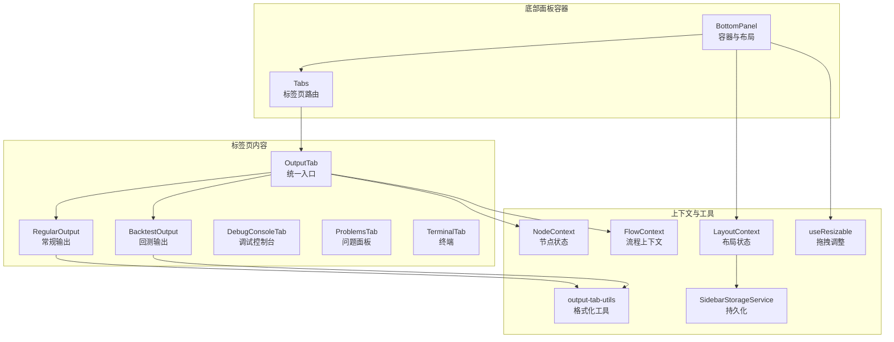
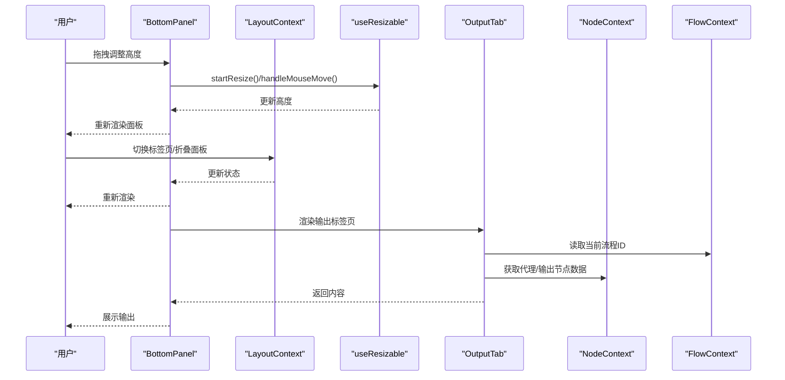
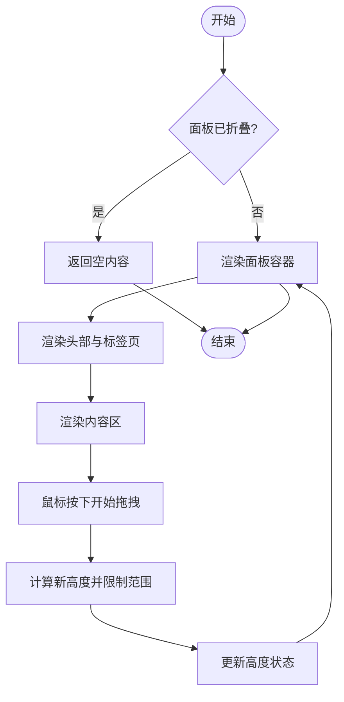
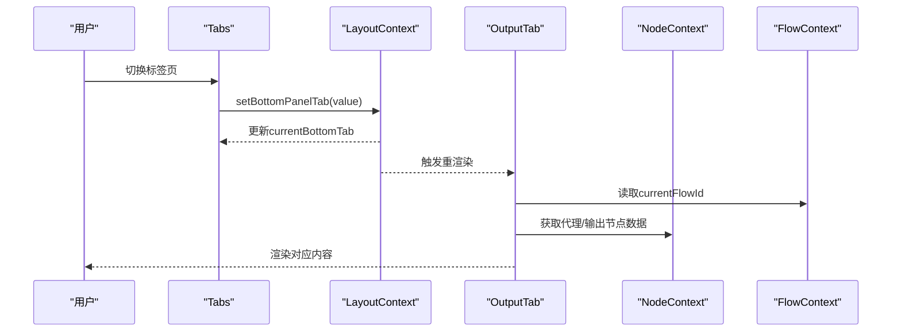
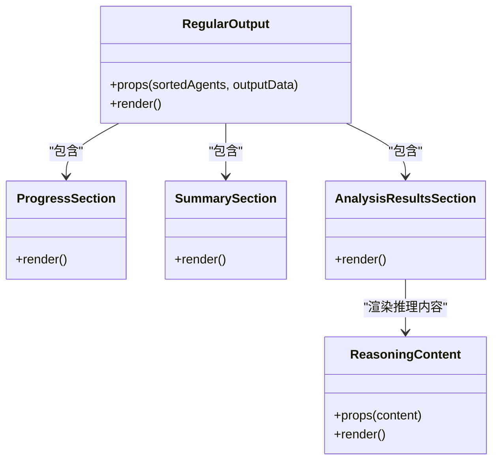
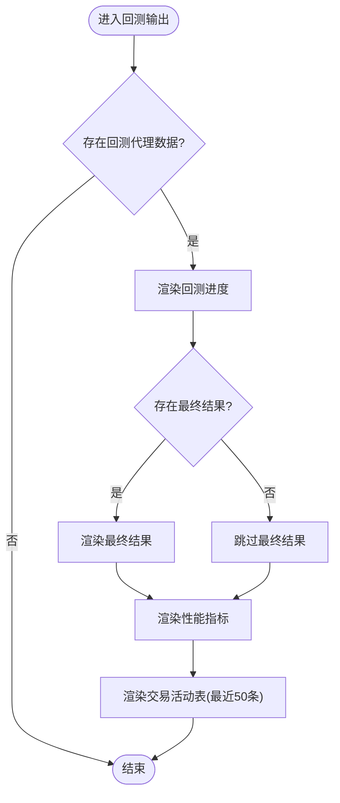
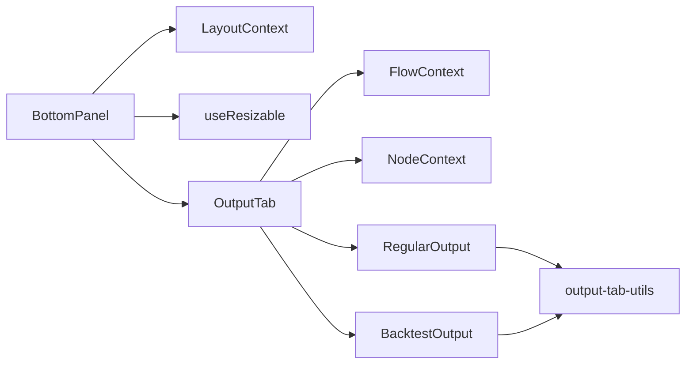

# 底部面板

<cite>
**本文引用的文件**
- [app/frontend/src/components/panels/bottom/bottom-panel.tsx](file://app/frontend/src/components/panels/bottom/bottom-panel.tsx)
- [app/frontend/src/components/panels/bottom/tabs/output-tab.tsx](file://app/frontend/src/components/panels/bottom/tabs/output-tab.tsx)
- [app/frontend/src/components/panels/bottom/tabs/regular-output.tsx](file://app/frontend/src/components/panels/bottom/tabs/regular-output.tsx)
- [app/frontend/src/components/panels/bottom/tabs/backtest-output.tsx](file://app/frontend/src/components/panels/bottom/tabs/backtest-output.tsx)
- [app/frontend/src/components/panels/bottom/tabs/debug-console-tab.tsx](file://app/frontend/src/components/panels/bottom/tabs/debug-console-tab.tsx)
- [app/frontend/src/components/panels/bottom/tabs/problems-tab.tsx](file://app/frontend/src/components/panels/bottom/tabs/problems-tab.tsx)
- [app/frontend/src/components/panels/bottom/tabs/terminal-tab.tsx](file://app/frontend/src/components/panels/bottom/tabs/terminal-tab.tsx)
- [app/frontend/src/components/panels/bottom/tabs/reasoning-content.tsx](file://app/frontend/src/components/panels/bottom/tabs/reasoning-content.tsx)
- [app/frontend/src/components/panels/bottom/tabs/output-tab-utils.ts](file://app/frontend/src/components/panels/bottom/tabs/output-tab-utils.ts)
- [app/frontend/src/hooks/use-resizable.ts](file://app/frontend/src/hooks/use-resizable.ts)
- [app/frontend/src/contexts/layout-context.tsx](file://app/frontend/src/contexts/layout-context.tsx)
- [app/frontend/src/contexts/node-context.tsx](file://app/frontend/src/contexts/node-context.tsx)
- [app/frontend/src/contexts/flow-context.tsx](file://app/frontend/src/contexts/flow-context.tsx)
- [app/frontend/src/services/sidebar-storage.ts](file://app/frontend/src/services/sidebar-storage.ts)
</cite>

## 目录
1. [简介](#简介)
2. [项目结构](#项目结构)
3. [核心组件](#核心组件)
4. [架构总览](#架构总览)
5. [详细组件分析](#详细组件分析)
6. [依赖关系分析](#依赖关系分析)
7. [性能考量](#性能考量)
8. [故障排查指南](#故障排查指南)
9. [结论](#结论)
10. [附录](#附录)

## 简介
本文件系统性地文档化了底部面板组件，覆盖多标签页输出系统与调试功能。重点包括：
- 折叠/展开机制与高度拖拽调整
- 标签页动态切换与内容渲染
- 常规输出、调试控制台、问题面板、终端面板、回测输出的差异化实现
- 输出内容的格式化展示、实时更新与滚动同步
- 输出内容的持久化存储、清理策略与性能优化
- 面板自定义配置、主题适配与无障碍访问支持

## 项目结构
底部面板位于前端应用的“面板”层，采用分层组织：
- 容器层：底部面板容器负责布局、折叠/展开、高度拖拽与标签页路由
- 标签页层：各标签页组件按功能划分（常规输出、回测输出、调试控制台、问题面板、终端）
- 工具与上下文：输出格式化工具、节点状态上下文、布局上下文、可调整尺寸钩子、侧边栏状态持久化服务

图表来源
- [app/frontend/src/components/panels/bottom/bottom-panel.tsx:1-99](file://app/frontend/src/components/panels/bottom/bottom-panel.tsx#L1-L99)
- [app/frontend/src/components/panels/bottom/tabs/output-tab.tsx:1-57](file://app/frontend/src/components/panels/bottom/tabs/output-tab.tsx#L1-L57)
- [app/frontend/src/components/panels/bottom/tabs/regular-output.tsx:1-230](file://app/frontend/src/components/panels/bottom/tabs/regular-output.tsx#L1-L230)
- [app/frontend/src/components/panels/bottom/tabs/backtest-output.tsx:1-416](file://app/frontend/src/components/panels/bottom/tabs/backtest-output.tsx#L1-L416)
- [app/frontend/src/components/panels/bottom/tabs/debug-console-tab.tsx:1-15](file://app/frontend/src/components/panels/bottom/tabs/debug-console-tab.tsx#L1-L15)
- [app/frontend/src/components/panels/bottom/tabs/problems-tab.tsx:1-15](file://app/frontend/src/components/panels/bottom/tabs/problems-tab.tsx#L1-L15)
- [app/frontend/src/components/panels/bottom/tabs/terminal-tab.tsx:1-21](file://app/frontend/src/components/panels/bottom/tabs/terminal-tab.tsx#L1-L21)
- [app/frontend/src/components/panels/bottom/tabs/output-tab-utils.ts:1-105](file://app/frontend/src/components/panels/bottom/tabs/output-tab-utils.ts#L1-L105)
- [app/frontend/src/hooks/use-resizable.ts:1-93](file://app/frontend/src/hooks/use-resizable.ts#L1-L93)
- [app/frontend/src/contexts/layout-context.tsx:1-68](file://app/frontend/src/contexts/layout-context.tsx#L1-L68)
- [app/frontend/src/contexts/node-context.tsx:1-438](file://app/frontend/src/contexts/node-context.tsx#L1-L438)
- [app/frontend/src/contexts/flow-context.tsx:1-358](file://app/frontend/src/contexts/flow-context.tsx#L1-L358)
- [app/frontend/src/services/sidebar-storage.ts:1-237](file://app/frontend/src/services/sidebar-storage.ts#L1-L237)

章节来源
- [app/frontend/src/components/panels/bottom/bottom-panel.tsx:1-99](file://app/frontend/src/components/panels/bottom/bottom-panel.tsx#L1-L99)
- [app/frontend/src/contexts/layout-context.tsx:1-68](file://app/frontend/src/contexts/layout-context.tsx#L1-L68)

## 核心组件
- 底部面板容器（BottomPanel）：负责折叠/展开、高度拖拽、标签页头部与内容区布局
- 统一输出标签页（OutputTab）：根据当前流程数据动态选择常规输出或回测输出，并周期性触发重渲染以实现“近实时”更新
- 常规输出（RegularOutput）：展示进度、汇总与分析结果；支持按股票分组的标签页切换
- 回测输出（BacktestOutput）：展示回测进度、交易活动表、性能指标与最终结果
- 调试控制台（DebugConsoleTab）、问题面板（ProblemsTab）、终端（TerminalTab）：占位型标签页，用于扩展调试与辅助功能
- 输出格式化工具（output-tab-utils）：JSON检测、显示名转换、状态/信号/动作颜色映射、代理排序
- 可调整尺寸钩子（use-resizable）：通用的拖拽调整逻辑，支持上下左右方向
- 布局上下文（LayoutContext）：底部面板折叠状态、当前标签页、持久化读写
- 节点上下文（NodeContext）：代理与输出节点状态的集中管理，支持按流程隔离
- 流上下文（FlowContext）：流程ID、名称、保存/加载等流程生命周期管理
- 侧边栏状态持久化（SidebarStorageService）：localStorage中保存底部面板折叠状态

章节来源
- [app/frontend/src/components/panels/bottom/bottom-panel.tsx:1-99](file://app/frontend/src/components/panels/bottom/bottom-panel.tsx#L1-L99)
- [app/frontend/src/components/panels/bottom/tabs/output-tab.tsx:1-57](file://app/frontend/src/components/panels/bottom/tabs/output-tab.tsx#L1-L57)
- [app/frontend/src/components/panels/bottom/tabs/regular-output.tsx:1-230](file://app/frontend/src/components/panels/bottom/tabs/regular-output.tsx#L1-L230)
- [app/frontend/src/components/panels/bottom/tabs/backtest-output.tsx:1-416](file://app/frontend/src/components/panels/bottom/tabs/backtest-output.tsx#L1-L416)
- [app/frontend/src/components/panels/bottom/tabs/debug-console-tab.tsx:1-15](file://app/frontend/src/components/panels/bottom/tabs/debug-console-tab.tsx#L1-L15)
- [app/frontend/src/components/panels/bottom/tabs/problems-tab.tsx:1-15](file://app/frontend/src/components/panels/bottom/tabs/problems-tab.tsx#L1-L15)
- [app/frontend/src/components/panels/bottom/tabs/terminal-tab.tsx:1-21](file://app/frontend/src/components/panels/bottom/tabs/terminal-tab.tsx#L1-L21)
- [app/frontend/src/components/panels/bottom/tabs/output-tab-utils.ts:1-105](file://app/frontend/src/components/panels/bottom/tabs/output-tab-utils.ts#L1-L105)
- [app/frontend/src/hooks/use-resizable.ts:1-93](file://app/frontend/src/hooks/use-resizable.ts#L1-L93)
- [app/frontend/src/contexts/layout-context.tsx:1-68](file://app/frontend/src/contexts/layout-context.tsx#L1-L68)
- [app/frontend/src/contexts/node-context.tsx:1-438](file://app/frontend/src/contexts/node-context.tsx#L1-L438)
- [app/frontend/src/contexts/flow-context.tsx:1-358](file://app/frontend/src/contexts/flow-context.tsx#L1-L358)
- [app/frontend/src/services/sidebar-storage.ts:1-237](file://app/frontend/src/services/sidebar-storage.ts#L1-L237)

## 架构总览
底部面板通过布局上下文与节点上下文协同工作：
- 布局上下文提供折叠状态与当前标签页，并通过localStorage持久化
- 节点上下文提供代理与输出节点数据，按流程隔离，支持导出/导入
- 统一输出标签页根据是否为回测运行选择不同渲染路径
- 可调整尺寸钩子提供一致的拖拽体验

图表来源
- [app/frontend/src/components/panels/bottom/bottom-panel.tsx:1-99](file://app/frontend/src/components/panels/bottom/bottom-panel.tsx#L1-L99)
- [app/frontend/src/hooks/use-resizable.ts:1-93](file://app/frontend/src/hooks/use-resizable.ts#L1-L93)
- [app/frontend/src/contexts/layout-context.tsx:1-68](file://app/frontend/src/contexts/layout-context.tsx#L1-L68)
- [app/frontend/src/components/panels/bottom/tabs/output-tab.tsx:1-57](file://app/frontend/src/components/panels/bottom/tabs/output-tab.tsx#L1-L57)
- [app/frontend/src/contexts/node-context.tsx:1-438](file://app/frontend/src/contexts/node-context.tsx#L1-L438)
- [app/frontend/src/contexts/flow-context.tsx:1-358](file://app/frontend/src/contexts/flow-context.tsx#L1-L358)

## 详细组件分析

### 折叠/展开与高度拖拽机制
- 折叠/展开：由布局上下文维护折叠状态，支持展开、折叠、切换操作，并在状态变化时持久化到localStorage
- 高度拖拽：使用通用的可调整尺寸钩子，支持上下左右拖拽；底部面板使用“bottom”方向，拖拽向上减少高度
- 头部交互：顶部显示标签页列表与关闭按钮；关闭按钮触发折叠

图表来源
- [app/frontend/src/components/panels/bottom/bottom-panel.tsx:1-99](file://app/frontend/src/components/panels/bottom/bottom-panel.tsx#L1-L99)
- [app/frontend/src/hooks/use-resizable.ts:1-93](file://app/frontend/src/hooks/use-resizable.ts#L1-L93)
- [app/frontend/src/contexts/layout-context.tsx:1-68](file://app/frontend/src/contexts/layout-context.tsx#L1-L68)
- [app/frontend/src/services/sidebar-storage.ts:1-237](file://app/frontend/src/services/sidebar-storage.ts#L1-L237)

章节来源
- [app/frontend/src/components/panels/bottom/bottom-panel.tsx:1-99](file://app/frontend/src/components/panels/bottom/bottom-panel.tsx#L1-L99)
- [app/frontend/src/hooks/use-resizable.ts:1-93](file://app/frontend/src/hooks/use-resizable.ts#L1-L93)
- [app/frontend/src/contexts/layout-context.tsx:1-68](file://app/frontend/src/contexts/layout-context.tsx#L1-L68)
- [app/frontend/src/services/sidebar-storage.ts:1-237](file://app/frontend/src/services/sidebar-storage.ts#L1-L237)

### 标签页动态切换与内容渲染
- 标签页路由：使用Tabs组件绑定当前标签页值，切换时更新布局上下文中的当前标签页
- 内容渲染：当前仅“Output”标签页可用；内容区通过OutputTab统一入口进行条件渲染
- 实时更新：OutputTab通过定时器周期性触发重渲染，确保输出面板能“近实时”反映节点状态变化

图表来源
- [app/frontend/src/components/panels/bottom/bottom-panel.tsx:60-96](file://app/frontend/src/components/panels/bottom/bottom-panel.tsx#L60-L96)
- [app/frontend/src/contexts/layout-context.tsx:50-52](file://app/frontend/src/contexts/layout-context.tsx#L50-L52)
- [app/frontend/src/components/panels/bottom/tabs/output-tab.tsx:13-29](file://app/frontend/src/components/panels/bottom/tabs/output-tab.tsx#L13-L29)
- [app/frontend/src/contexts/flow-context.tsx:37-39](file://app/frontend/src/contexts/flow-context.tsx#L37-L39)
- [app/frontend/src/contexts/node-context.tsx:371-399](file://app/frontend/src/contexts/node-context.tsx#L371-L399)

章节来源
- [app/frontend/src/components/panels/bottom/bottom-panel.tsx:60-96](file://app/frontend/src/components/panels/bottom/bottom-panel.tsx#L60-L96)
- [app/frontend/src/contexts/layout-context.tsx:50-52](file://app/frontend/src/contexts/layout-context.tsx#L50-L52)
- [app/frontend/src/components/panels/bottom/tabs/output-tab.tsx:13-29](file://app/frontend/src/components/panels/bottom/tabs/output-tab.tsx#L13-L29)
- [app/frontend/src/contexts/flow-context.tsx:37-39](file://app/frontend/src/contexts/flow-context.tsx#L37-L39)
- [app/frontend/src/contexts/node-context.tsx:371-399](file://app/frontend/src/contexts/node-context.tsx#L371-L399)

### 常规输出（RegularOutput）
- 进度区：展示各代理的状态、消息、时间戳与标的
- 汇总区：展示每只股票的交易决策（动作、数量、置信度）
- 分析区：按股票分组的标签页，展示各分析师信号、推理内容；支持复制推理内容

图表来源
- [app/frontend/src/components/panels/bottom/tabs/regular-output.tsx:1-230](file://app/frontend/src/components/panels/bottom/tabs/regular-output.tsx#L1-L230)
- [app/frontend/src/components/panels/bottom/tabs/reasoning-content.tsx:1-51](file://app/frontend/src/components/panels/bottom/tabs/reasoning-content.tsx#L1-L51)

章节来源
- [app/frontend/src/components/panels/bottom/tabs/regular-output.tsx:1-230](file://app/frontend/src/components/panels/bottom/tabs/regular-output.tsx#L1-L230)
- [app/frontend/src/components/panels/bottom/tabs/reasoning-content.tsx:1-51](file://app/frontend/src/components/panels/bottom/tabs/reasoning-content.tsx#L1-L51)

### 回测输出（BacktestOutput）
- 回测进度：展示回测运行状态与消息
- 交易活动表：按日期倒序展示每期的交易明细与组合摘要，限制最近50条避免性能问题
- 性能指标：展示总收益、胜率、最大回撤、期数等
- 最终结果：展示最终投资组合的头寸与成本基础

图表来源
- [app/frontend/src/components/panels/bottom/tabs/backtest-output.tsx:1-416](file://app/frontend/src/components/panels/bottom/tabs/backtest-output.tsx#L1-L416)

章节来源
- [app/frontend/src/components/panels/bottom/tabs/backtest-output.tsx:1-416](file://app/frontend/src/components/panels/bottom/tabs/backtest-output.tsx#L1-L416)

### 调试控制台、问题面板与终端
- 调试控制台：占位型组件，提示调试控制台就绪
- 问题面板：占位型组件，提示未检测到问题
- 终端：占位型组件，模拟终端界面与命令提示符

章节来源
- [app/frontend/src/components/panels/bottom/tabs/debug-console-tab.tsx:1-15](file://app/frontend/src/components/panels/bottom/tabs/debug-console-tab.tsx#L1-L15)
- [app/frontend/src/components/panels/bottom/tabs/problems-tab.tsx:1-15](file://app/frontend/src/components/panels/bottom/tabs/problems-tab.tsx#L1-L15)
- [app/frontend/src/components/panels/bottom/tabs/terminal-tab.tsx:1-21](file://app/frontend/src/components/panels/bottom/tabs/terminal-tab.tsx#L1-L21)

### 输出内容格式化与滚动同步
- JSON格式化：推理内容支持自动识别JSON并格式化显示，提供复制到剪贴板功能
- 滚动同步：表格与内容区域采用“溢出滚动”设计，保证长内容可滚动查看
- 颜色与图标：基于状态/信号/动作类型映射颜色，提升可读性

章节来源
- [app/frontend/src/components/panels/bottom/tabs/reasoning-content.tsx:1-51](file://app/frontend/src/components/panels/bottom/tabs/reasoning-content.tsx#L1-L51)
- [app/frontend/src/components/panels/bottom/tabs/output-tab-utils.ts:1-105](file://app/frontend/src/components/panels/bottom/tabs/output-tab-utils.ts#L1-L105)

### 实时更新机制
- 周期性重渲染：OutputTab通过定时器每秒触发一次状态更新，强制组件重渲染，从而“近实时”反映节点状态变化
- 数据来源：从节点上下文中按当前流程ID读取代理与输出节点数据

章节来源
- [app/frontend/src/components/panels/bottom/tabs/output-tab.tsx:23-29](file://app/frontend/src/components/panels/bottom/tabs/output-tab.tsx#L23-L29)
- [app/frontend/src/contexts/node-context.tsx:371-399](file://app/frontend/src/contexts/node-context.tsx#L371-L399)
- [app/frontend/src/contexts/flow-context.tsx:37-39](file://app/frontend/src/contexts/flow-context.tsx#L37-L39)

### 持久化存储与清理策略
- 折叠状态持久化：底部面板折叠状态通过SidebarStorageService保存到localStorage
- 数据隔离：节点上下文按流程ID生成复合键，确保不同流程的数据相互隔离
- 导入/导出：支持按流程导出/导入节点上下文数据，便于备份与迁移
- 清理策略：支持按流程重置节点状态（保留消息与回测结果），或清空所有节点状态

章节来源
- [app/frontend/src/services/sidebar-storage.ts:1-237](file://app/frontend/src/services/sidebar-storage.ts#L1-L237)
- [app/frontend/src/contexts/node-context.tsx:58-61](file://app/frontend/src/contexts/node-context.tsx#L58-L61)
- [app/frontend/src/contexts/node-context.tsx:307-368](file://app/frontend/src/contexts/node-context.tsx#L307-L368)
- [app/frontend/src/contexts/node-context.tsx:238-265](file://app/frontend/src/contexts/node-context.tsx#L238-L265)

### 自定义配置、主题适配与无障碍支持
- 主题适配：使用Tailwind类名控制背景、边框、悬停态与文本颜色，便于主题切换
- 无障碍：关闭按钮提供aria-label；标签页组件提供语义化的标题与表格结构
- 可定制性：面板容器支持传入自定义样式类名；输出内容区采用等宽字体与合适的字号，便于阅读

章节来源
- [app/frontend/src/components/panels/bottom/bottom-panel.tsx:44-98](file://app/frontend/src/components/panels/bottom/bottom-panel.tsx#L44-L98)
- [app/frontend/src/components/panels/bottom/tabs/output-tab.tsx:38-56](file://app/frontend/src/components/panels/bottom/tabs/output-tab.tsx#L38-L56)
- [app/frontend/src/components/panels/bottom/tabs/regular-output.tsx:1-230](file://app/frontend/src/components/panels/bottom/tabs/regular-output.tsx#L1-L230)
- [app/frontend/src/components/panels/bottom/tabs/backtest-output.tsx:1-416](file://app/frontend/src/components/panels/bottom/tabs/backtest-output.tsx#L1-L416)

## 依赖关系分析
- 组件耦合
  - BottomPanel依赖LayoutContext（折叠/展开、当前标签页）与useResizable（拖拽）
  - OutputTab依赖FlowContext（当前流程ID）与NodeContext（代理/输出数据）
  - RegularOutput与BacktestOutput依赖output-tab-utils进行格式化与颜色映射
- 外部依赖
  - UI库：Tabs、Card、Table等组件
  - 图标库：Lucide React图标
  - 本地存储：localStorage持久化

图表来源
- [app/frontend/src/components/panels/bottom/bottom-panel.tsx:1-99](file://app/frontend/src/components/panels/bottom/bottom-panel.tsx#L1-L99)
- [app/frontend/src/components/panels/bottom/tabs/output-tab.tsx:1-57](file://app/frontend/src/components/panels/bottom/tabs/output-tab.tsx#L1-L57)
- [app/frontend/src/components/panels/bottom/tabs/regular-output.tsx:1-230](file://app/frontend/src/components/panels/bottom/tabs/regular-output.tsx#L1-L230)
- [app/frontend/src/components/panels/bottom/tabs/backtest-output.tsx:1-416](file://app/frontend/src/components/panels/bottom/tabs/backtest-output.tsx#L1-L416)
- [app/frontend/src/components/panels/bottom/tabs/output-tab-utils.ts:1-105](file://app/frontend/src/components/panels/bottom/tabs/output-tab-utils.ts#L1-L105)
- [app/frontend/src/contexts/layout-context.tsx:1-68](file://app/frontend/src/contexts/layout-context.tsx#L1-L68)
- [app/frontend/src/contexts/flow-context.tsx:1-358](file://app/frontend/src/contexts/flow-context.tsx#L1-L358)
- [app/frontend/src/contexts/node-context.tsx:1-438](file://app/frontend/src/contexts/node-context.tsx#L1-L438)

章节来源
- [app/frontend/src/components/panels/bottom/bottom-panel.tsx:1-99](file://app/frontend/src/components/panels/bottom/bottom-panel.tsx#L1-L99)
- [app/frontend/src/components/panels/bottom/tabs/output-tab.tsx:1-57](file://app/frontend/src/components/panels/bottom/tabs/output-tab.tsx#L1-L57)
- [app/frontend/src/contexts/layout-context.tsx:1-68](file://app/frontend/src/contexts/layout-context.tsx#L1-L68)
- [app/frontend/src/contexts/flow-context.tsx:1-358](file://app/frontend/src/contexts/flow-context.tsx#L1-L358)
- [app/frontend/src/contexts/node-context.tsx:1-438](file://app/frontend/src/contexts/node-context.tsx#L1-L438)

## 性能考量
- 渲染频率控制：OutputTab每秒触发一次重渲染，建议在高频更新场景下考虑更细粒度的状态拆分与memo化
- 表格性能：回测交易活动表限制最近50条记录，避免大量DOM节点导致的卡顿
- 滚动区域：内容区设置最大高度并启用滚动，避免面板无限增长
- 颜色与图标：通过工具函数映射颜色，避免在渲染路径中重复计算

章节来源
- [app/frontend/src/components/panels/bottom/tabs/output-tab.tsx:23-29](file://app/frontend/src/components/panels/bottom/tabs/output-tab.tsx#L23-L29)
- [app/frontend/src/components/panels/bottom/tabs/backtest-output.tsx:90-94](file://app/frontend/src/components/panels/bottom/tabs/backtest-output.tsx#L90-L94)

## 故障排查指南
- 面板不显示
  - 检查布局上下文的折叠状态是否为折叠
  - 确认BottomPanel的渲染条件与高度设置
- 面板无法拖拽
  - 检查useResizable的事件监听与元素ref
  - 确认startResize调用与鼠标事件处理
- 输出为空
  - 检查FlowContext的currentFlowId是否正确
  - 检查NodeContext中是否存在对应流程的代理/输出数据
- 回测结果未显示
  - 确认代理数据中包含回测结果数组
  - 确认输出节点数据中包含最终结果字段
- JSON复制失败
  - 检查浏览器剪贴板权限与错误日志

章节来源
- [app/frontend/src/contexts/layout-context.tsx:28-48](file://app/frontend/src/contexts/layout-context.tsx#L28-L48)
- [app/frontend/src/hooks/use-resizable.ts:30-76](file://app/frontend/src/hooks/use-resizable.ts#L30-L76)
- [app/frontend/src/contexts/flow-context.tsx:37-39](file://app/frontend/src/contexts/flow-context.tsx#L37-L39)
- [app/frontend/src/contexts/node-context.tsx:371-399](file://app/frontend/src/contexts/node-context.tsx#L371-L399)
- [app/frontend/src/components/panels/bottom/tabs/reasoning-content.tsx:14-23](file://app/frontend/src/components/panels/bottom/tabs/reasoning-content.tsx#L14-L23)

## 结论
底部面板通过清晰的分层设计与上下文协作，实现了灵活的折叠/展开、拖拽调整与多标签页输出。常规输出与回测输出分别针对不同业务场景提供了直观的可视化展示；配合格式化工具与占位标签页，为调试与扩展提供了良好基础。建议在高频更新场景下进一步优化渲染策略，并完善回测数据的增量更新与缓存机制。

## 附录
- 关键接口与职责
  - BottomPanel：容器布局、折叠/展开、高度拖拽、标签页头部
  - OutputTab：统一入口、实时更新、回测/常规切换
  - RegularOutput：进度、汇总、分析三段式展示
  - BacktestOutput：进度、结果、性能、交易活动四段式展示
  - LayoutContext：折叠状态、当前标签页、持久化
  - NodeContext：节点状态管理、按流程隔离、导入/导出
  - useResizable：通用拖拽调整
  - SidebarStorageService：localStorage持久化

章节来源
- [app/frontend/src/components/panels/bottom/bottom-panel.tsx:1-99](file://app/frontend/src/components/panels/bottom/bottom-panel.tsx#L1-L99)
- [app/frontend/src/components/panels/bottom/tabs/output-tab.tsx:1-57](file://app/frontend/src/components/panels/bottom/tabs/output-tab.tsx#L1-L57)
- [app/frontend/src/components/panels/bottom/tabs/regular-output.tsx:1-230](file://app/frontend/src/components/panels/bottom/tabs/regular-output.tsx#L1-L230)
- [app/frontend/src/components/panels/bottom/tabs/backtest-output.tsx:1-416](file://app/frontend/src/components/panels/bottom/tabs/backtest-output.tsx#L1-L416)
- [app/frontend/src/contexts/layout-context.tsx:1-68](file://app/frontend/src/contexts/layout-context.tsx#L1-L68)
- [app/frontend/src/contexts/node-context.tsx:1-438](file://app/frontend/src/contexts/node-context.tsx#L1-L438)
- [app/frontend/src/hooks/use-resizable.ts:1-93](file://app/frontend/src/hooks/use-resizable.ts#L1-L93)
- [app/frontend/src/services/sidebar-storage.ts:1-237](file://app/frontend/src/services/sidebar-storage.ts#L1-L237)