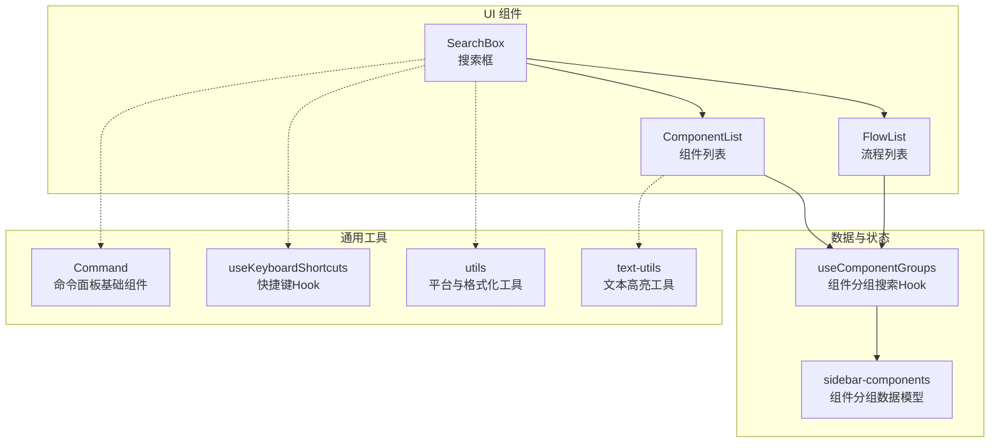
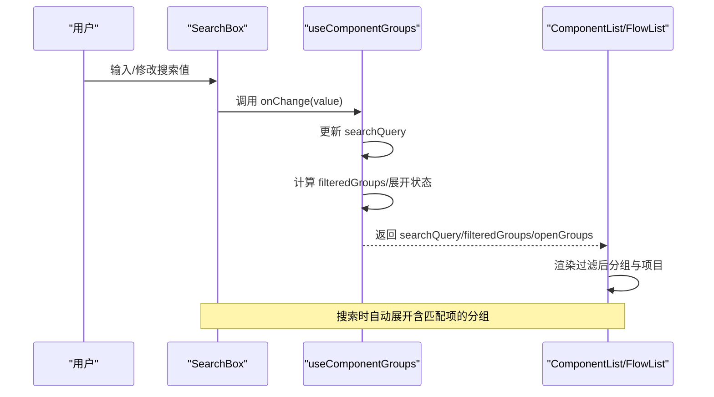
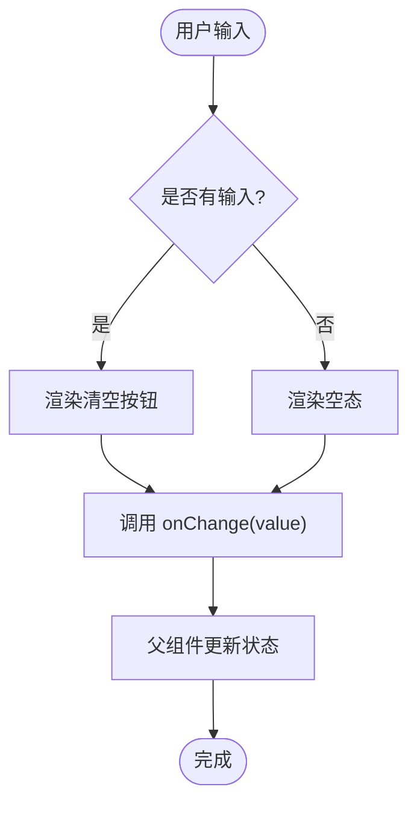
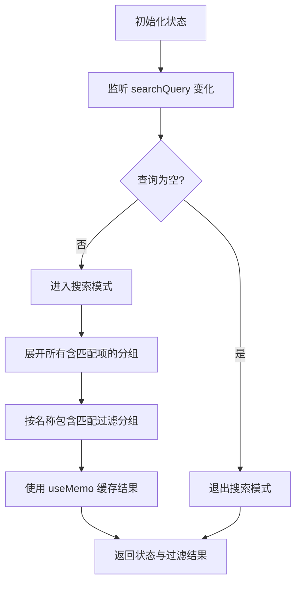
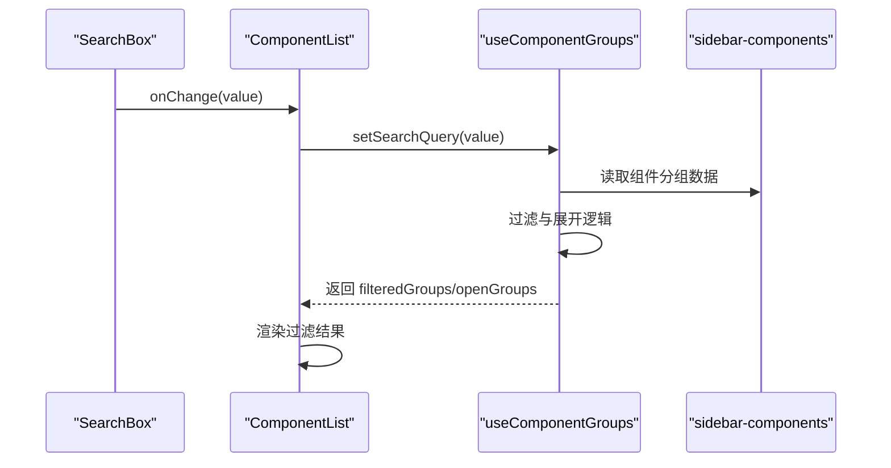
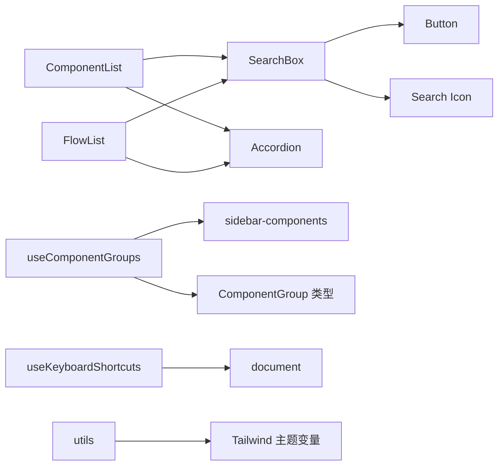

# 搜索框组件

<cite>
**本文档引用的文件**
- [search-box.tsx](file://app/frontend/src/components/panels/search-box.tsx)
- [use-component-groups.ts](file://app/frontend/src/hooks/use-component-groups.ts)
- [sidebar-components.ts](file://app/frontend/src/data/sidebar-components.ts)
- [command.tsx](file://app/frontend/src/components/ui/command.tsx)
- [left-sidebar.tsx](file://app/frontend/src/components/panels/left/left-sidebar.tsx)
- [right-sidebar.tsx](file://app/frontend/src/components/panels/right/right-sidebar.tsx)
- [flow-list.tsx](file://app/frontend/src/components/panels/left/flow-list.tsx)
- [component-list.tsx](file://app/frontend/src/components/panels/right/component-list.tsx)
- [use-keyboard-shortcuts.ts](file://app/frontend/src/hooks/use-keyboard-shortcuts.ts)
- [use-mobile.tsx](file://app/frontend/src/hooks/use-mobile.tsx)
- [utils.ts](file://app/frontend/src/lib/utils.ts)
- [tailwind.config.ts](file://app/frontend/tailwind.config.ts)
- [text-utils.ts](file://app/frontend/src/utils/text-utils.ts)
</cite>

## 目录
1. [简介](#简介)
2. [项目结构](#项目结构)
3. [核心组件](#核心组件)
4. [架构总览](#架构总览)
5. [详细组件分析](#详细组件分析)
6. [依赖关系分析](#依赖关系分析)
7. [性能考虑](#性能考虑)
8. [故障排除指南](#故障排除指南)
9. [结论](#结论)
10. [附录](#附录)

## 简介
本文件系统性地文档化了前端搜索框组件的设计与实现，覆盖以下关键能力：
- 全局搜索与快速定位：在侧边栏组件列表与流程列表中提供统一的搜索入口与行为
- 输入处理与实时过滤：基于受控输入的即时过滤与分组展开联动
- 结果高亮显示：通过文本工具对匹配内容进行高亮标记（适用于输出展示）
- 搜索范围限定：按组件类型、分组维度进行范围控制
- 搜索算法与性能优化：大小写不敏感包含匹配、记忆化与最小重渲染
- 建议与历史：当前实现以输入即过滤为主，未内置建议与历史记录持久化
- 样式定制与移动端适配：Tailwind CSS 主题变量与断点适配
- 键盘快捷键支持：可扩展的快捷键钩子用于触发搜索或聚焦
- 扩展接口：可替换的搜索提供者与结果二次处理机制

## 项目结构
搜索框组件位于前端工程的面板组件目录下，配合自定义 Hook 实现搜索状态管理与过滤逻辑，并在左右侧边栏中复用。

**图表来源**
- [search-box.tsx:1-43](file://app/frontend/src/components/panels/search-box.tsx#L1-L43)
- [component-list.tsx:1-70](file://app/frontend/src/components/panels/right/component-list.tsx#L1-L70)
- [flow-list.tsx:1-114](file://app/frontend/src/components/panels/left/flow-list.tsx#L1-L114)
- [use-component-groups.ts:1-71](file://app/frontend/src/hooks/use-component-groups.ts#L1-L71)
- [sidebar-components.ts:1-74](file://app/frontend/src/data/sidebar-components.ts#L1-L74)
- [command.tsx:1-146](file://app/frontend/src/components/ui/command.tsx#L1-L146)
- [use-keyboard-shortcuts.ts:1-165](file://app/frontend/src/hooks/use-keyboard-shortcuts.ts#L1-L165)
- [utils.ts:1-39](file://app/frontend/src/lib/utils.ts#L1-L39)
- [text-utils.ts:1-234](file://app/frontend/src/utils/text-utils.ts#L1-L234)

**章节来源**
- [search-box.tsx:1-43](file://app/frontend/src/components/panels/search-box.tsx#L1-L43)
- [component-list.tsx:1-70](file://app/frontend/src/components/panels/right/component-list.tsx#L1-L70)
- [flow-list.tsx:1-114](file://app/frontend/src/components/panels/left/flow-list.tsx#L1-L114)
- [use-component-groups.ts:1-71](file://app/frontend/src/hooks/use-component-groups.ts#L1-L71)
- [sidebar-components.ts:1-74](file://app/frontend/src/data/sidebar-components.ts#L1-L74)
- [command.tsx:1-146](file://app/frontend/src/components/ui/command.tsx#L1-L146)
- [use-keyboard-shortcuts.ts:1-165](file://app/frontend/src/hooks/use-keyboard-shortcuts.ts#L1-L165)
- [utils.ts:1-39](file://app/frontend/src/lib/utils.ts#L1-L39)
- [text-utils.ts:1-234](file://app/frontend/src/utils/text-utils.ts#L1-L234)

## 核心组件
- SearchBox：受控输入的搜索框，支持清空按钮与占位符定制
- useComponentGroups：负责搜索查询、过滤分组、展开状态与“正在搜索”模式切换
- ComponentList/FlowList：在各自列表顶部集成 SearchBox 并消费过滤后的数据
- Command：命令面板基础组件（可选用于更复杂的搜索体验）
- 工具函数：文本高亮、平台检测、快捷键钩子、移动端断点

**章节来源**
- [search-box.tsx:1-43](file://app/frontend/src/components/panels/search-box.tsx#L1-L43)
- [use-component-groups.ts:1-71](file://app/frontend/src/hooks/use-component-groups.ts#L1-L71)
- [component-list.tsx:1-70](file://app/frontend/src/components/panels/right/component-list.tsx#L1-L70)
- [flow-list.tsx:1-114](file://app/frontend/src/components/panels/left/flow-list.tsx#L1-L114)
- [command.tsx:1-146](file://app/frontend/src/components/ui/command.tsx#L1-L146)
- [text-utils.ts:1-234](file://app/frontend/src/utils/text-utils.ts#L1-L234)

## 架构总览
搜索框组件采用“受控组件 + 自定义Hook”的分层设计：
- 视图层：SearchBox 提供输入与清空交互
- 状态层：useComponentGroups 维护查询、过滤、展开状态与模式切换
- 数据层：sidebar-components 定义组件分组结构
- 列表层：ComponentList/FlowList 使用过滤结果与展开状态渲染
- 可选增强：Command 提供命令面板能力；text-utils 支持高亮显示

**图表来源**
- [search-box.tsx:10-43](file://app/frontend/src/components/panels/search-box.tsx#L10-L43)
- [use-component-groups.ts:10-71](file://app/frontend/src/hooks/use-component-groups.ts#L10-L71)
- [component-list.tsx:27-54](file://app/frontend/src/components/panels/right/component-list.tsx#L27-L54)
- [flow-list.tsx:54-97](file://app/frontend/src/components/panels/left/flow-list.tsx#L54-L97)

## 详细组件分析

### SearchBox 组件
- 功能要点
  - 受控输入：value 由父组件传入，onChange 回调更新父状态
  - 清空按钮：当存在输入时显示，点击清空输入
  - 占位符：支持自定义占位符
  - 样式：左侧图标 + 输入区域 + 清空按钮，使用 Tailwind 变量实现主题色
- 交互行为
  - 输入变更立即回调父组件，实现“输入即过滤”
  - 清空按钮仅在有值时可见，提升可用性

**图表来源**
- [search-box.tsx:10-43](file://app/frontend/src/components/panels/search-box.tsx#L10-L43)

**章节来源**
- [search-box.tsx:1-43](file://app/frontend/src/components/panels/search-box.tsx#L1-L43)

### useComponentGroups Hook（搜索与过滤）
- 状态与职责
  - 维护 searchQuery、activeItem、openGroups、isSearching
  - 基于组件分组数据执行过滤：大小写不敏感包含匹配
  - 在搜索模式下自动展开包含匹配项的分组
  - 处理分组展开/收起逻辑：搜索期间保留匹配分组的展开状态
- 过滤算法
  - 对每个分组内的项目执行名称包含匹配
  - 仅返回包含匹配项目的分组
- 性能优化
  - 使用 useMemo 缓存过滤结果，避免重复计算
  - 仅在组件分组或查询变化时重新计算

**图表来源**
- [use-component-groups.ts:10-71](file://app/frontend/src/hooks/use-component-groups.ts#L10-L71)

**章节来源**
- [use-component-groups.ts:1-71](file://app/frontend/src/hooks/use-component-groups.ts#L1-L71)

### ComponentList 与 FlowList（搜索集成）
- 集成方式
  - 在列表顶部渲染 SearchBox，并将 onSearchChange 与 onAccordionChange 传递给 SearchBox
  - 使用 filteredGroups/openGroups 控制渲染
- 行为差异
  - ComponentList：从数据源动态加载组件分组，支持“加载中”与“无匹配”提示
  - FlowList：展示最近与模板两类分组，支持“加载中”与“无匹配”提示

**图表来源**
- [component-list.tsx:27-54](file://app/frontend/src/components/panels/right/component-list.tsx#L27-L54)
- [use-component-groups.ts:10-71](file://app/frontend/src/hooks/use-component-groups.ts#L10-L71)
- [sidebar-components.ts:31-74](file://app/frontend/src/data/sidebar-components.ts#L31-L74)

**章节来源**
- [component-list.tsx:1-70](file://app/frontend/src/components/panels/right/component-list.tsx#L1-L70)
- [flow-list.tsx:1-114](file://app/frontend/src/components/panels/left/flow-list.tsx#L1-L114)

### Command 组件（可选增强）
- 作用：提供命令面板的基础容器、输入、列表、分组等能力，适合构建更丰富的搜索/命令体验
- 与 SearchBox 的关系：可作为 SearchBox 的上层容器或替代方案，但当前仓库中 SearchBox 为独立实现

**章节来源**
- [command.tsx:1-146](file://app/frontend/src/components/ui/command.tsx#L1-L146)

### 文本高亮与结果展示（可选）
- text-utils：提供 JSON/文本高亮工具，可用于在搜索结果详情中高亮匹配片段
- 适用场景：在搜索到具体条目后，在详情面板中对关键词进行高亮

**章节来源**
- [text-utils.ts:1-234](file://app/frontend/src/utils/text-utils.ts#L1-L234)

## 依赖关系分析
- 组件依赖
  - SearchBox 依赖 Button、Search 图标
  - ComponentList/FlowList 依赖 Accordion、SearchBox
  - useComponentGroups 依赖 ComponentGroup 类型与 getComponentGroups 数据源
- 样式与主题
  - Tailwind CSS 主题变量定义了背景、前景、强调色等，SearchBox 使用 sidebar 相关变量
- 平台与快捷键
  - utils 提供平台检测与快捷键格式化
  - use-keyboard-shortcuts 提供全局快捷键注册与匹配逻辑

**图表来源**
- [search-box.tsx:1-43](file://app/frontend/src/components/panels/search-box.tsx#L1-L43)
- [component-list.tsx:1-70](file://app/frontend/src/components/panels/right/component-list.tsx#L1-L70)
- [flow-list.tsx:1-114](file://app/frontend/src/components/panels/left/flow-list.tsx#L1-L114)
- [use-component-groups.ts:1-71](file://app/frontend/src/hooks/use-component-groups.ts#L1-L71)
- [sidebar-components.ts:1-74](file://app/frontend/src/data/sidebar-components.ts#L1-L74)
- [use-keyboard-shortcuts.ts:17-50](file://app/frontend/src/hooks/use-keyboard-shortcuts.ts#L17-L50)
- [utils.ts:4-6](file://app/frontend/src/lib/utils.ts#L4-L6)
- [tailwind.config.ts:105-111](file://app/frontend/tailwind.config.ts#L105-L111)

**章节来源**
- [search-box.tsx:1-43](file://app/frontend/src/components/panels/search-box.tsx#L1-L43)
- [component-list.tsx:1-70](file://app/frontend/src/components/panels/right/component-list.tsx#L1-L70)
- [flow-list.tsx:1-114](file://app/frontend/src/components/panels/left/flow-list.tsx#L1-L114)
- [use-component-groups.ts:1-71](file://app/frontend/src/hooks/use-component-groups.ts#L1-L71)
- [sidebar-components.ts:1-74](file://app/frontend/src/data/sidebar-components.ts#L1-L74)
- [use-keyboard-shortcuts.ts:1-165](file://app/frontend/src/hooks/use-keyboard-shortcuts.ts#L1-L165)
- [utils.ts:1-39](file://app/frontend/src/lib/utils.ts#L1-L39)
- [tailwind.config.ts:1-143](file://app/frontend/tailwind.config.ts#L1-L143)

## 性能考虑
- 记忆化与最小重渲染
  - useComponentGroups 使用 useMemo 缓存过滤结果，避免每次渲染都重新计算
  - 仅在组件分组或查询变化时触发重新计算
- 搜索算法复杂度
  - 对每个分组执行线性过滤：O(G × I)，其中 G 为分组数，I 为每组平均项目数
  - 包含匹配为字符串原生方法，时间复杂度近似 O(N)（N 为项目名长度）
- DOM 重排与滚动
  - 列表使用滚动条与最小宽度约束，减少布局抖动
- 建议的优化方向
  - 对超大列表引入防抖（debounce）以降低高频输入的计算压力
  - 引入索引（如前缀树）以支持前缀匹配与建议生成
  - 将过滤逻辑迁移至服务端或 Web Worker，避免阻塞主线程

[本节为通用性能讨论，无需特定文件引用]

## 故障排除指南
- 搜索无结果
  - 检查组件分组数据是否正确加载（右侧侧边栏加载逻辑）
  - 确认搜索查询是否为空或包含特殊字符
- 分组无法展开
  - 搜索模式下会自动展开含匹配项的分组；若手动关闭，请确认是否仍在搜索中
- 清空按钮无效
  - 确认 SearchBox 的 onChange 回调是否正确传递到父组件
- 快捷键冲突
  - use-keyboard-shortcuts 对 Ctrl/Cmd 组合键做了兼容处理，检查是否与其他快捷键冲突

**章节来源**
- [right-sidebar.tsx:34-53](file://app/frontend/src/components/panels/right/right-sidebar.tsx#L34-L53)
- [use-component-groups.ts:40-71](file://app/frontend/src/hooks/use-component-groups.ts#L40-L71)
- [search-box.tsx:24-31](file://app/frontend/src/components/panels/search-box.tsx#L24-L31)
- [use-keyboard-shortcuts.ts:17-50](file://app/frontend/src/hooks/use-keyboard-shortcuts.ts#L17-L50)

## 结论
该搜索框组件通过简洁的受控输入与自定义 Hook 实现了高效的本地搜索与快速定位，具备良好的可扩展性。当前实现侧重于“输入即过滤”的即时反馈，未内置建议与历史记录持久化；可通过引入防抖、索引与服务端过滤进一步提升性能与体验。样式与主题通过 Tailwind 变量统一管理，移动端断点适配完善，可直接用于生产环境。

[本节为总结性内容，无需特定文件引用]

## 附录

### 搜索范围与算法说明
- 搜索范围
  - 组件侧边栏：按组件分组名称进行过滤
  - 流程侧边栏：按最近与模板两类分组进行过滤
- 算法实现
  - 大小写不敏感包含匹配
  - 仅返回包含匹配项目的分组
- 排序规则
  - 当前未实现专门的排序逻辑，保持数据源顺序

**章节来源**
- [use-component-groups.ts:10-26](file://app/frontend/src/hooks/use-component-groups.ts#L10-L26)
- [sidebar-components.ts:31-74](file://app/frontend/src/data/sidebar-components.ts#L31-L74)

### 样式定制与主题变量
- 主题变量
  - 通过 Tailwind 配置中的颜色与尺寸变量统一管理
  - SearchBox 使用 sidebar 相关变量实现一致的主题风格
- 自定义建议
  - 可在现有样式基础上增加阴影、圆角、动画等效果

**章节来源**
- [tailwind.config.ts:105-111](file://app/frontend/tailwind.config.ts#L105-L111)
- [search-box.tsx:16-25](file://app/frontend/src/components/panels/search-box.tsx#L16-L25)

### 键盘快捷键支持
- 全局快捷键钩子
  - 支持跨平台（Windows/macOS）的 Ctrl/Cmd 组合键
  - 可扩展用于触发搜索框聚焦或打开命令面板
- 建议
  - 可为搜索框绑定“Cmd/Ctrl+F”等常用快捷键

**章节来源**
- [use-keyboard-shortcuts.ts:17-50](file://app/frontend/src/hooks/use-keyboard-shortcuts.ts#L17-L50)
- [utils.ts:8-17](file://app/frontend/src/lib/utils.ts#L8-L17)

### 移动端适配
- 断点与检测
  - 使用 useIsMobile 检测移动端并调整布局
  - 搜索框在移动端同样可用，建议结合触摸优化（如增大点击区域）

**章节来源**
- [use-mobile.tsx:1-19](file://app/frontend/src/hooks/use-mobile.tsx#L1-L19)

### 扩展接口与二次处理
- 扩展接口
  - 可替换的搜索提供者：将过滤逻辑抽象为接口，支持本地/远程两种实现
  - 自定义搜索提供者：注入新的数据源（如 API、缓存）
- 二次处理
  - 在搜索结果渲染前进行二次处理（如去重、权重排序、高亮）
  - 可结合 text-utils 对结果详情进行高亮显示

**章节来源**
- [text-utils.ts:1-234](file://app/frontend/src/utils/text-utils.ts#L1-L234)