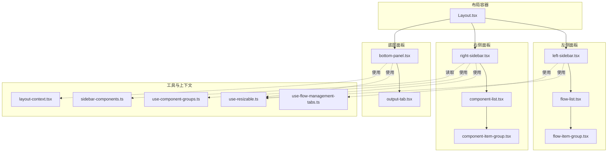
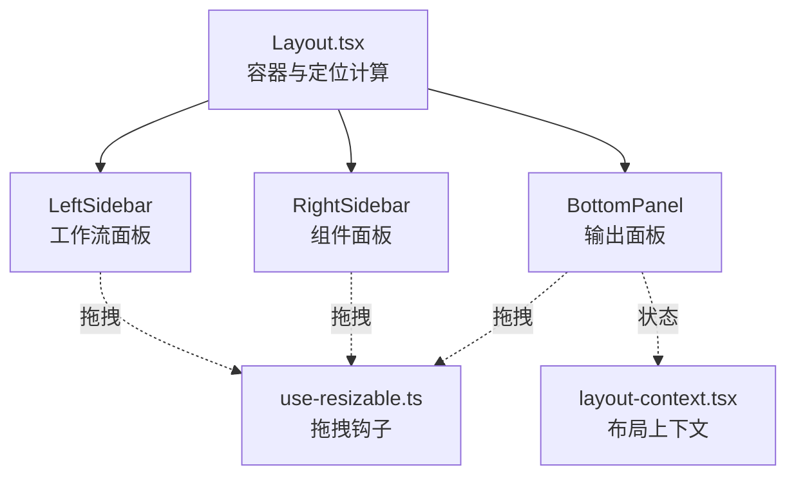
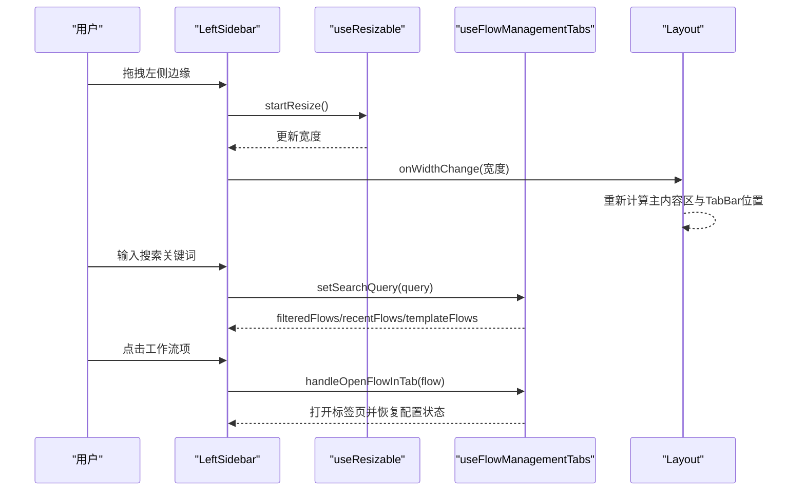
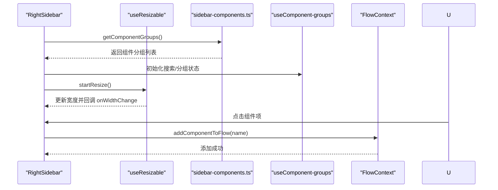
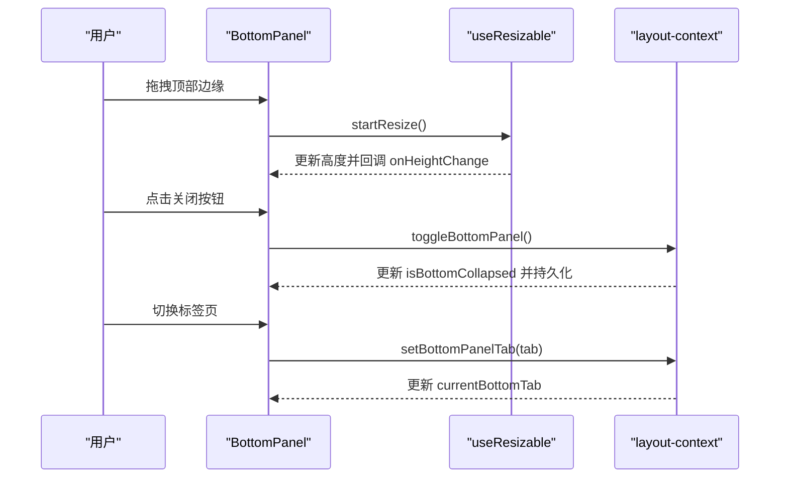
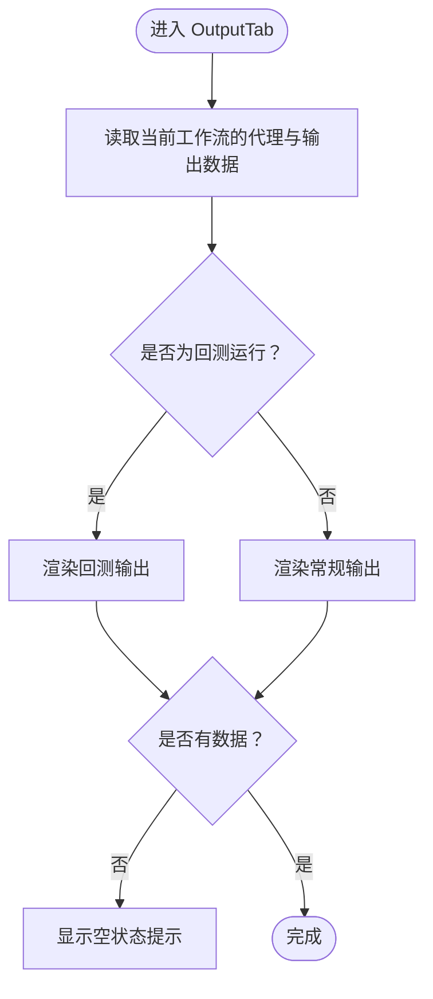
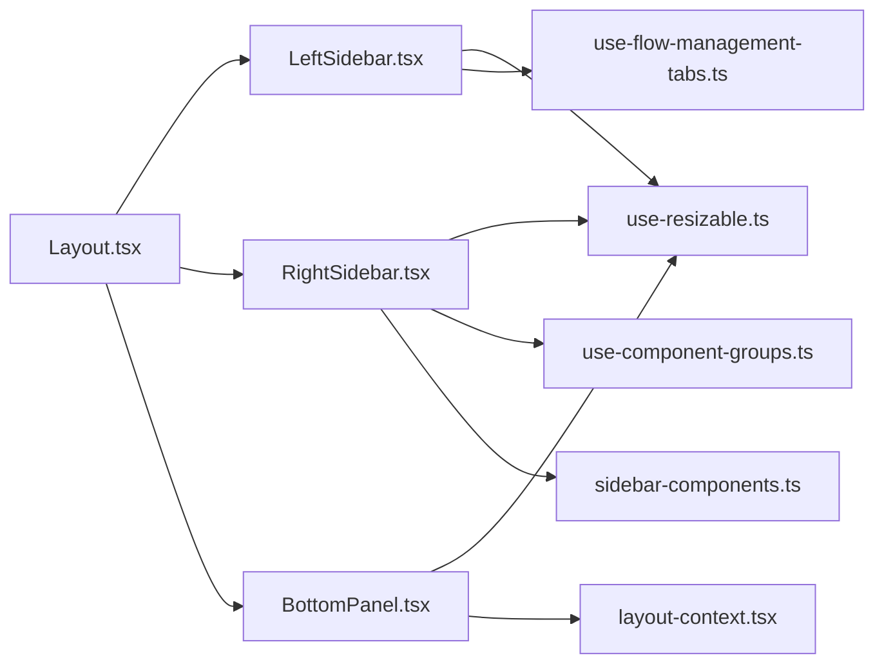

# 面板组件

<cite>
**本文引用的文件**
- [app/frontend/src/components/Layout.tsx](file://app/frontend/src/components/Layout.tsx)
- [app/frontend/src/components/panels/left/left-sidebar.tsx](file://app/frontend/src/components/panels/left/left-sidebar.tsx)
- [app/frontend/src/components/panels/left/flow-list.tsx](file://app/frontend/src/components/panels/left/flow-list.tsx)
- [app/frontend/src/components/panels/left/flow-item-group.tsx](file://app/frontend/src/components/panels/left/flow-item-group.tsx)
- [app/frontend/src/components/panels/right/right-sidebar.tsx](file://app/frontend/src/components/panels/right/right-sidebar.tsx)
- [app/frontend/src/components/panels/right/component-list.tsx](file://app/frontend/src/components/panels/right/component-list.tsx)
- [app/frontend/src/components/panels/right/component-item-group.tsx](file://app/frontend/src/components/panels/right/component-item-group.tsx)
- [app/frontend/src/components/panels/bottom/bottom-panel.tsx](file://app/frontend/src/components/panels/bottom/bottom-panel.tsx)
- [app/frontend/src/components/panels/bottom/tabs/output-tab.tsx](file://app/frontend/src/components/panels/bottom/tabs/output-tab.tsx)
- [app/frontend/src/hooks/use-resizable.ts](file://app/frontend/src/hooks/use-resizable.ts)
- [app/frontend/src/hooks/use-flow-management-tabs.ts](file://app/frontend/src/hooks/use-flow-management-tabs.ts)
- [app/frontend/src/hooks/use-component-groups.ts](file://app/frontend/src/hooks/use-component-groups.ts)
- [app/frontend/src/data/sidebar-components.ts](file://app/frontend/src/data/sidebar-components.ts)
- [app/frontend/src/contexts/layout-context.tsx](file://app/frontend/src/contexts/layout-context.tsx)
</cite>

## 目录
1. [简介](#简介)
2. [项目结构](#项目结构)
3. [核心组件](#核心组件)
4. [架构总览](#架构总览)
5. [详细组件分析](#详细组件分析)
6. [依赖关系分析](#依赖关系分析)
7. [性能考量](#性能考量)
8. [故障排查指南](#故障排查指南)
9. [结论](#结论)
10. [附录](#附录)

## 简介
本文件系统性梳理前端面板组件体系，覆盖左侧面板（工作流）、右侧面板（组件）、底部面板以及输出专用标签页。重点说明各面板的展开/收起、拖拽调整尺寸、内容管理与交互模式；解释属性接口、事件处理与状态持久化；给出面板组合使用、条件显示与动态内容加载的实现方案；并阐述面板组件与主应用状态的同步与数据传递机制。

## 项目结构
面板相关代码主要位于 app/frontend/src/components/panels 下，按位置分为 left、right、bottom 三类；配合 hooks、contexts、services 实现可拖拽、可折叠、可搜索、可持久化的布局与数据流。

图表来源
- [app/frontend/src/components/Layout.tsx:103-181](file://app/frontend/src/components/Layout.tsx#L103-L181)
- [app/frontend/src/components/panels/left/left-sidebar.tsx:17-101](file://app/frontend/src/components/panels/left/left-sidebar.tsx#L17-L101)
- [app/frontend/src/components/panels/right/right-sidebar.tsx:17-97](file://app/frontend/src/components/panels/right/right-sidebar.tsx#L17-L97)
- [app/frontend/src/components/panels/bottom/bottom-panel.tsx:19-99](file://app/frontend/src/components/panels/bottom/bottom-panel.tsx#L19-L99)
- [app/frontend/src/hooks/use-resizable.ts:13-93](file://app/frontend/src/hooks/use-resizable.ts#L13-L93)
- [app/frontend/src/hooks/use-flow-management-tabs.ts:45-337](file://app/frontend/src/hooks/use-flow-management-tabs.ts#L45-L337)
- [app/frontend/src/hooks/use-component-groups.ts:4-71](file://app/frontend/src/hooks/use-component-groups.ts#L4-L71)
- [app/frontend/src/data/sidebar-components.ts:31-74](file://app/frontend/src/data/sidebar-components.ts#L31-L74)
- [app/frontend/src/contexts/layout-context.tsx:27-68](file://app/frontend/src/contexts/layout-context.tsx#L27-L68)

章节来源
- [app/frontend/src/components/Layout.tsx:18-201](file://app/frontend/src/components/Layout.tsx#L18-L201)

## 核心组件
- 左侧工作流面板：提供工作流列表、搜索、分组折叠、新建/保存/打开/删除/刷新等操作，支持拖拽调整宽度。
- 右侧组件面板：按分组展示可拖入画布的组件项，支持搜索、分组折叠、点击添加到工作流。
- 底部输出面板：提供输出标签页，支持拖拽调整高度，可折叠隐藏。
- 拖拽尺寸钩子：统一处理左右侧边栏宽度与底部面板高度的拖拽逻辑。
- 状态与持久化：通过布局上下文与存储服务实现面板折叠状态与尺寸的本地持久化。

章节来源
- [app/frontend/src/components/panels/left/left-sidebar.tsx:17-101](file://app/frontend/src/components/panels/left/left-sidebar.tsx#L17-L101)
- [app/frontend/src/components/panels/right/right-sidebar.tsx:17-97](file://app/frontend/src/components/panels/right/right-sidebar.tsx#L17-L97)
- [app/frontend/src/components/panels/bottom/bottom-panel.tsx:19-99](file://app/frontend/src/components/panels/bottom/bottom-panel.tsx#L19-L99)
- [app/frontend/src/hooks/use-resizable.ts:13-93](file://app/frontend/src/hooks/use-resizable.ts#L13-L93)
- [app/frontend/src/contexts/layout-context.tsx:27-68](file://app/frontend/src/contexts/layout-context.tsx#L27-L68)

## 架构总览
面板组件围绕 Layout 容器进行绝对定位与过渡动画控制，左/右面板负责内容区两侧的辅助功能，底部面板承载输出视图。所有面板均通过自定义钩子实现拖拽调整尺寸，并通过上下文与存储服务实现状态持久化。

图表来源
- [app/frontend/src/components/Layout.tsx:103-181](file://app/frontend/src/components/Layout.tsx#L103-L181)
- [app/frontend/src/hooks/use-resizable.ts:13-93](file://app/frontend/src/hooks/use-resizable.ts#L13-L93)
- [app/frontend/src/contexts/layout-context.tsx:27-68](file://app/frontend/src/contexts/layout-context.tsx#L27-L68)

## 详细组件分析

### 左侧工作流面板（LeftSidebar）
- 职责
  - 展示工作流列表与分组（最近/模板），支持搜索过滤。
  - 提供新建、保存、打开、删除、刷新等动作。
  - 支持拖拽调整宽度，并将宽度变化通知父容器以更新定位。
- 关键接口
  - 属性：isCollapsed、onCollapse、onExpand、onWidthChange。
  - 使用钩子：useResizable（横向拖拽）、useFlowManagementTabs（工作流状态与行为）。
- 交互流程
  - 用户在搜索框输入关键词，触发过滤；点击分组展开/折叠；点击工作流项打开到标签页；点击“新建”弹出对话框创建新工作流。
- 状态持久化
  - 工作流列表与分组展开状态由 useFlowManagementTabs 维护；面板宽度变化通过 onWidthChange 回传给 Layout，再由 Layout 计算主内容区与标签栏的位置。

图表来源
- [app/frontend/src/components/panels/left/left-sidebar.tsx:17-101](file://app/frontend/src/components/panels/left/left-sidebar.tsx#L17-L101)
- [app/frontend/src/hooks/use-resizable.ts:13-93](file://app/frontend/src/hooks/use-resizable.ts#L13-L93)
- [app/frontend/src/hooks/use-flow-management-tabs.ts:45-337](file://app/frontend/src/hooks/use-flow-management-tabs.ts#L45-L337)
- [app/frontend/src/components/Layout.tsx:64-101](file://app/frontend/src/components/Layout.tsx#L64-L101)

章节来源
- [app/frontend/src/components/panels/left/left-sidebar.tsx:9-101](file://app/frontend/src/components/panels/left/left-sidebar.tsx#L9-L101)
- [app/frontend/src/components/panels/left/flow-list.tsx:8-114](file://app/frontend/src/components/panels/left/flow-list.tsx#L8-L114)
- [app/frontend/src/components/panels/left/flow-item-group.tsx:6-46](file://app/frontend/src/components/panels/left/flow-item-group.tsx#L6-L46)
- [app/frontend/src/hooks/use-flow-management-tabs.ts:45-337](file://app/frontend/src/hooks/use-flow-management-tabs.ts#L45-L337)

### 右侧组件面板（RightSidebar）
- 职责
  - 动态加载组件分组（从后端获取代理列表），支持搜索与分组折叠。
  - 点击组件项将组件添加到当前工作流。
  - 支持拖拽调整宽度。
- 关键接口
  - 属性：isCollapsed、onCollapse、onExpand、onWidthChange。
  - 使用钩子：useResizable（横向拖拽）、useComponentGroups（搜索与分组状态）。
  - 数据源：sidebar-components.ts 的 getComponentGroups 异步加载。
- 交互流程
  - 首次渲染时异步加载组件分组；搜索时自动展开匹配分组；点击分组项调用 Flow 上下文方法添加到画布。

图表来源
- [app/frontend/src/components/panels/right/right-sidebar.tsx:17-97](file://app/frontend/src/components/panels/right/right-sidebar.tsx#L17-L97)
- [app/frontend/src/hooks/use-resizable.ts:13-93](file://app/frontend/src/hooks/use-resizable.ts#L13-L93)
- [app/frontend/src/hooks/use-component-groups.ts:4-71](file://app/frontend/src/hooks/use-component-groups.ts#L4-L71)
- [app/frontend/src/data/sidebar-components.ts:31-74](file://app/frontend/src/data/sidebar-components.ts#L31-L74)

章节来源
- [app/frontend/src/components/panels/right/right-sidebar.tsx:9-97](file://app/frontend/src/components/panels/right/right-sidebar.tsx#L9-L97)
- [app/frontend/src/components/panels/right/component-list.tsx:6-70](file://app/frontend/src/components/panels/right/component-list.tsx#L6-L70)
- [app/frontend/src/components/panels/right/component-item-group.tsx:6-49](file://app/frontend/src/components/panels/right/component-item-group.tsx#L6-L49)
- [app/frontend/src/hooks/use-component-groups.ts:4-71](file://app/frontend/src/hooks/use-component-groups.ts#L4-L71)
- [app/frontend/src/data/sidebar-components.ts:31-74](file://app/frontend/src/data/sidebar-components.ts#L31-L74)

### 底部输出面板（BottomPanel）
- 职责
  - 提供输出标签页，支持拖拽调整高度与折叠。
  - 通过布局上下文维护当前标签与折叠状态，并持久化。
- 关键接口
  - 属性：isCollapsed、onCollapse、onExpand、onToggleCollapse、onHeightChange。
  - 使用钩子：useResizable（垂直拖拽）、layout-context（全局布局状态）。
- 交互流程
  - 用户拖拽顶部边缘调整高度；点击关闭按钮折叠；切换标签页时通过上下文更新当前标签。

图表来源
- [app/frontend/src/components/panels/bottom/bottom-panel.tsx:19-99](file://app/frontend/src/components/panels/bottom/bottom-panel.tsx#L19-L99)
- [app/frontend/src/hooks/use-resizable.ts:13-93](file://app/frontend/src/hooks/use-resizable.ts#L13-L93)
- [app/frontend/src/contexts/layout-context.tsx:27-68](file://app/frontend/src/contexts/layout-context.tsx#L27-L68)

章节来源
- [app/frontend/src/components/panels/bottom/bottom-panel.tsx:10-99](file://app/frontend/src/components/panels/bottom/bottom-panel.tsx#L10-L99)
- [app/frontend/src/contexts/layout-context.tsx:1-68](file://app/frontend/src/contexts/layout-context.tsx#L1-L68)

### 输出标签页（OutputTab）
- 职责
  - 基于当前工作流的节点上下文数据，区分常规输出与回测输出，周期性刷新以展示实时结果。
- 关键接口
  - 属性：className。
  - 使用上下文：FlowContext（当前工作流ID）、NodeContext（代理与输出节点数据）。
- 交互流程
  - 读取代理与输出节点数据；检测是否为回测运行；根据类型渲染不同输出组件；空状态提示。

图表来源
- [app/frontend/src/components/panels/bottom/tabs/output-tab.tsx:13-57](file://app/frontend/src/components/panels/bottom/tabs/output-tab.tsx#L13-L57)

章节来源
- [app/frontend/src/components/panels/bottom/tabs/output-tab.tsx:9-57](file://app/frontend/src/components/panels/bottom/tabs/output-tab.tsx#L9-L57)

## 依赖关系分析
- 组件耦合
  - Layout 对三个面板进行绝对定位与尺寸联动，耦合度中等但集中。
  - 面板内部通过各自钩子与上下文解耦，仅在必要处通过回调与父容器通信。
- 外部依赖
  - use-resizable 提供跨面板的统一拖拽能力。
  - use-flow-management-tabs 与 use-component-groups 将业务状态与 UI 行为解耦。
  - layout-context 与存储服务实现面板状态持久化。
- 潜在循环依赖
  - 未发现直接循环依赖；面板间通过回调与上下文间接通信，避免了直接导入。

图表来源
- [app/frontend/src/components/Layout.tsx:103-181](file://app/frontend/src/components/Layout.tsx#L103-L181)
- [app/frontend/src/hooks/use-resizable.ts:13-93](file://app/frontend/src/hooks/use-resizable.ts#L13-L93)
- [app/frontend/src/hooks/use-flow-management-tabs.ts:45-337](file://app/frontend/src/hooks/use-flow-management-tabs.ts#L45-L337)
- [app/frontend/src/hooks/use-component-groups.ts:4-71](file://app/frontend/src/hooks/use-component-groups.ts#L4-L71)
- [app/frontend/src/data/sidebar-components.ts:31-74](file://app/frontend/src/data/sidebar-components.ts#L31-L74)
- [app/frontend/src/contexts/layout-context.tsx:27-68](file://app/frontend/src/contexts/layout-context.tsx#L27-L68)

章节来源
- [app/frontend/src/components/Layout.tsx:18-201](file://app/frontend/src/components/Layout.tsx#L18-L201)

## 性能考量
- 渲染优化
  - use-flow-management-tabs 中对工作流列表进行过滤与分组，建议在大数据量场景下考虑虚拟滚动或分页。
  - use-component-groups 使用 useMemo 缓存搜索过滤结果，减少重复计算。
- 重绘控制
  - use-resizable 在拖拽期间设置不可选择样式，避免文本选中带来的额外重绘。
- 实时更新
  - OutputTab 通过定时器强制刷新以展示实时输出，建议根据实际需求调整刷新频率或改为基于事件驱动的更新策略。

## 故障排查指南
- 面板无法拖拽调整尺寸
  - 检查 use-resizable 的 startResize 是否被正确绑定到面板边缘；确认 isDragging 状态与 ref 是否同步。
- 面板折叠状态未持久化
  - 检查 layout-context 的状态变更是否触发存储服务；确认浏览器本地存储可用。
- 右侧面板组件不显示
  - 检查 getComponentGroups 是否成功返回数据；确认 useComponentGroups 的初始化与过滤逻辑。
- 工作流列表为空或无响应
  - 检查 use-flow-management-tabs 的加载与过滤逻辑；确认 FlowContext 与 TabContext 的集成。

章节来源
- [app/frontend/src/hooks/use-resizable.ts:13-93](file://app/frontend/src/hooks/use-resizable.ts#L13-L93)
- [app/frontend/src/contexts/layout-context.tsx:27-68](file://app/frontend/src/contexts/layout-context.tsx#L27-L68)
- [app/frontend/src/hooks/use-component-groups.ts:4-71](file://app/frontend/src/hooks/use-component-groups.ts#L4-L71)
- [app/frontend/src/hooks/use-flow-management-tabs.ts:45-337](file://app/frontend/src/hooks/use-flow-management-tabs.ts#L45-L337)

## 结论
该面板组件体系通过统一的拖拽钩子与上下文，实现了左/右面板与底部面板的灵活布局与交互体验。结合状态持久化与条件渲染，满足了工作流管理、组件拖拽与输出展示的核心需求。后续可在大数据量渲染与实时更新策略上进一步优化。

## 附录

### 面板属性与事件接口速览
- 左侧工作流面板（LeftSidebar）
  - 属性：isCollapsed、onCollapse、onExpand、onWidthChange。
  - 事件：宽度变化回调用于布局重算。
- 右侧组件面板（RightSidebar）
  - 属性：isCollapsed、onCollapse、onExpand、onWidthChange。
  - 事件：宽度变化回调用于布局重算。
- 底部输出面板（BottomPanel）
  - 属性：isCollapsed、onCollapse、onExpand、onToggleCollapse、onHeightChange。
  - 事件：高度变化回调用于布局重算。
- 拖拽钩子（use-resizable）
  - 参数：minWidth、maxWidth、defaultWidth、minHeight、maxHeight、defaultHeight、side。
  - 返回：width、height、isDragging、elementRef、startResize。
- 状态与持久化（layout-context）
  - 方法：expandBottomPanel、collapseBottomPanel、toggleBottomPanel、setBottomPanelTab。
  - 状态：isBottomCollapsed、currentBottomTab。

章节来源
- [app/frontend/src/components/panels/left/left-sidebar.tsx:9-15](file://app/frontend/src/components/panels/left/left-sidebar.tsx#L9-L15)
- [app/frontend/src/components/panels/right/right-sidebar.tsx:9-15](file://app/frontend/src/components/panels/right/right-sidebar.tsx#L9-L15)
- [app/frontend/src/components/panels/bottom/bottom-panel.tsx:10-17](file://app/frontend/src/components/panels/bottom/bottom-panel.tsx#L10-L17)
- [app/frontend/src/hooks/use-resizable.ts:3-21](file://app/frontend/src/hooks/use-resizable.ts#L3-L21)
- [app/frontend/src/contexts/layout-context.tsx:4-11](file://app/frontend/src/contexts/layout-context.tsx#L4-L11)