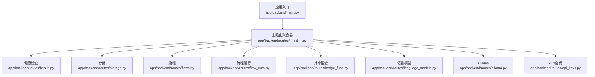
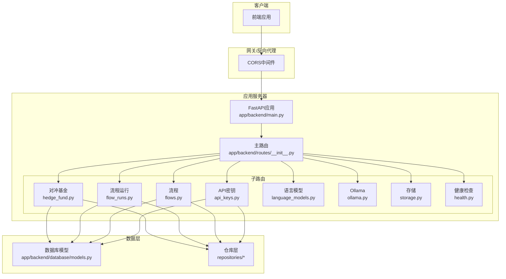
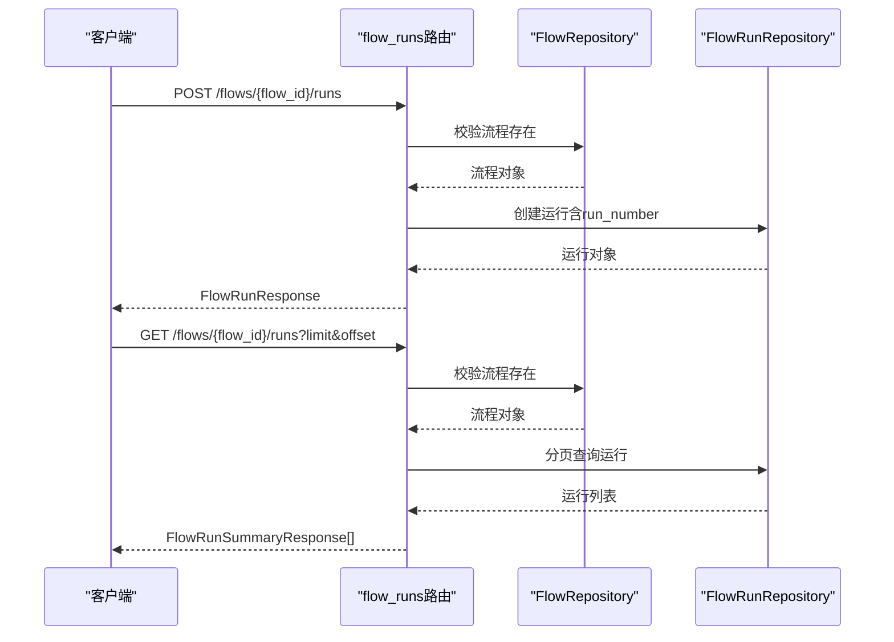
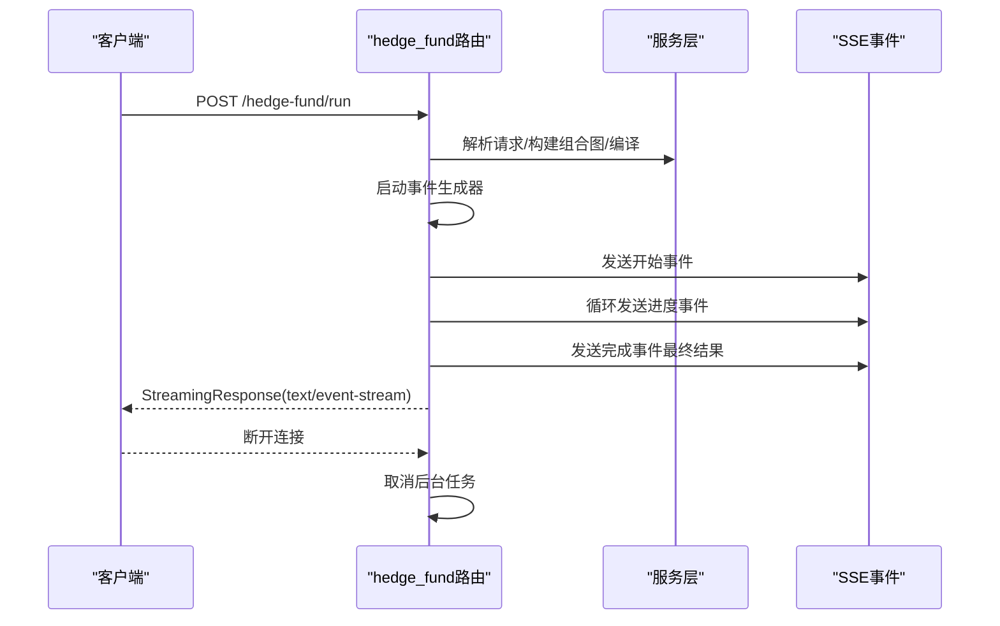
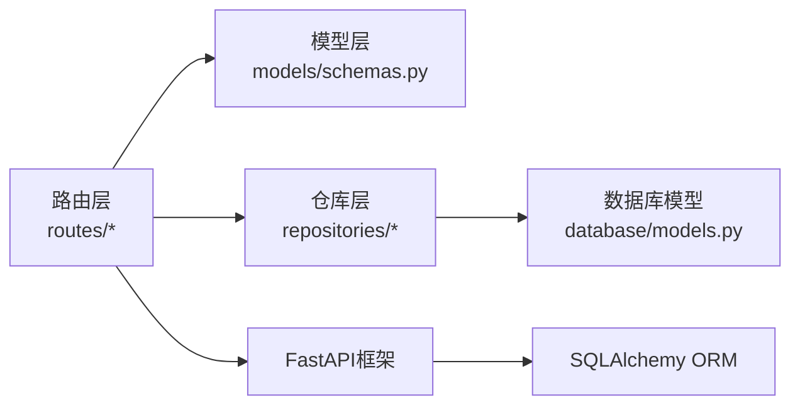

# API路由组织

<cite>
**本文引用的文件**
- [app/backend/routes/__init__.py](file://app/backend/routes/__init__.py)
- [app/backend/main.py](file://app/backend/main.py)
- [app/backend/routes/flows.py](file://app/backend/routes/flows.py)
- [app/backend/routes/flow_runs.py](file://app/backend/routes/flow_runs.py)
- [app/backend/routes/hedge_fund.py](file://app/backend/routes/hedge_fund.py)
- [app/backend/routes/api_keys.py](file://app/backend/routes/api_keys.py)
- [app/backend/models/schemas.py](file://app/backend/models/schemas.py)
- [app/backend/repositories/flow_repository.py](file://app/backend/repositories/flow_repository.py)
- [app/backend/repositories/flow_run_repository.py](file://app/backend/repositories/flow_run_repository.py)
- [app/backend/repositories/api_key_repository.py](file://app/backend/repositories/api_key_repository.py)
- [app/backend/database/models.py](file://app/backend/database/models.py)
- [app/backend/routes/health.py](file://app/backend/routes/health.py)
- [app/backend/routes/storage.py](file://app/backend/routes/storage.py)
- [app/backend/routes/language_models.py](file://app/backend/routes/language_models.py)
- [app/backend/routes/ollama.py](file://app/backend/routes/ollama.py)
</cite>

## 目录
1. [简介](#简介)
2. [项目结构](#项目结构)
3. [核心组件](#核心组件)
4. [架构总览](#架构总览)
5. [详细组件分析](#详细组件分析)
6. [依赖分析](#依赖分析)
7. [性能考虑](#性能考虑)
8. [故障排查指南](#故障排查指南)
9. [结论](#结论)
10. [附录](#附录)

## 简介
本文件系统性梳理后端API路由的分层结构与组织原则，覆盖flows、flow_runs、hedge_fund、api_keys等核心路由模块，解释路由装饰器使用、HTTP方法映射与URL模式设计；说明请求参数验证、响应模型定义与状态码管理；阐述路由中间件、权限控制与认证机制现状；给出错误处理策略、异常转换与统一响应格式；解释路由版本管理、命名空间组织与模块化设计；并提供API文档生成、Swagger集成与测试策略建议。

## 项目结构
后端采用FastAPI框架，通过主路由器聚合各子路由模块，形成清晰的命名空间与标签体系：
- 主入口应用在应用启动时注册所有子路由
- 子路由按功能域划分：健康检查、存储、流程与运行、对冲基金执行、语言模型与Ollama、API密钥等
- 每个子路由以独立prefix进行命名空间隔离，便于扩展与维护



**图表来源**
- [app/backend/main.py:15-30](file://app/backend/main.py#L15-L30)
- [app/backend/routes/__init__.py:12-24](file://app/backend/routes/__init__.py#L12-L24)

**章节来源**
- [app/backend/main.py:15-30](file://app/backend/main.py#L15-L30)
- [app/backend/routes/__init__.py:12-24](file://app/backend/routes/__init__.py#L12-L24)

## 核心组件
- 路由聚合器：集中include各子路由，设置统一tags，便于后续文档生成与分类
- 数据模型与仓库：为各路由提供数据访问层抽象，确保业务逻辑与持久化解耦
- 请求/响应模型：基于Pydantic定义，实现自动校验与序列化
- 中间件：CORS在应用级配置，支持前端跨域访问

**章节来源**
- [app/backend/routes/__init__.py:12-24](file://app/backend/routes/__init__.py#L12-L24)
- [app/backend/database/models.py:6-115](file://app/backend/database/models.py#L6-L115)
- [app/backend/models/schemas.py:1-292](file://app/backend/models/schemas.py#L1-L292)

## 架构总览
下图展示从客户端到服务端的典型调用链路，以及各路由模块的职责边界：



**图表来源**
- [app/backend/main.py:15-30](file://app/backend/main.py#L15-L30)
- [app/backend/routes/__init__.py:12-24](file://app/backend/routes/__init__.py#L12-L24)
- [app/backend/database/models.py:6-115](file://app/backend/database/models.py#L6-L115)

## 详细组件分析

### 流程路由（flows）
- 前缀与标签：prefix="/flows"，tag="flows"
- 功能职责：
  - 创建流程：POST /
  - 列表查询：GET /（支持模板过滤）
  - 单条查询：GET /{flow_id}
  - 更新流程：PUT /{flow_id}
  - 删除流程：DELETE /{flow_id}
  - 复制流程：POST /{flow_id}/duplicate
  - 名称搜索：GET /search/{name}
- 参数验证与响应模型：
  - 使用FlowCreateRequest/FlowUpdateRequest/FlowResponse/FlowSummaryResponse
  - 响应中明确404/500错误映射至ErrorResponse
- 错误处理：
  - 非预期异常统一抛出HTTPException(500)
  - 未找到资源时抛出HTTPException(404)

```mermaid
flowchart TD
Start(["进入flows路由"]) --> Method{"HTTP方法？"}
Method --> |POST /| Create["创建流程<br/>FlowCreateRequest"]
Method --> |GET /| List["列表查询<br/>include_templates参数"]
Method --> |GET /{flow_id}| GetOne["按ID查询"]
Method --> |PUT /{flow_id}| Update["更新流程"]
Method --> |DELETE /{flow_id}| Delete["删除流程"]
Method --> |POST /{flow_id}/duplicate| Duplicate["复制流程"]
Method --> |GET /search/{name}| Search["名称搜索"]
Create --> Repo["FlowRepository"]
List --> Repo
GetOne --> Repo
Update --> Repo
Delete --> Repo
Duplicate --> Repo
Search --> Repo
Repo --> Resp{"成功？"}
Resp --> |是| Ok["返回对应响应模型"]
Resp --> |否| NotFound["404未找到"]
Resp --> |异常| Err["500内部错误"]
```

**图表来源**
- [app/backend/routes/flows.py:15-174](file://app/backend/routes/flows.py#L15-L174)
- [app/backend/repositories/flow_repository.py:6-103](file://app/backend/repositories/flow_repository.py#L6-L103)
- [app/backend/models/schemas.py:144-195](file://app/backend/models/schemas.py#L144-L195)

**章节来源**
- [app/backend/routes/flows.py:15-174](file://app/backend/routes/flows.py#L15-L174)
- [app/backend/repositories/flow_repository.py:6-103](file://app/backend/repositories/flow_repository.py#L6-L103)
- [app/backend/models/schemas.py:144-195](file://app/backend/models/schemas.py#L144-L195)

### 流程运行路由（flow_runs）
- 前缀与标签：prefix="/flows/{flow_id}/runs"，tag="flow-runs"
- 功能职责：
  - 创建运行：POST /
  - 列表查询：GET /（支持limit/offset）
  - 获取当前运行：GET /active
  - 获取最新运行：GET /latest
  - 查询单次运行：GET /{run_id}
  - 更新运行：PUT /{run_id}
  - 删除运行：DELETE /{run_id}
  - 批量删除：DELETE /
  - 运行计数：GET /count
- 关键约束：
  - 所有操作均先校验flow_id对应的流程存在
  - 更新/删除时校验run_id属于该flow_id
- 响应模型：FlowRunResponse/FlowRunSummaryResponse/FlowRunStatus枚举



**图表来源**
- [app/backend/routes/flow_runs.py:17-303](file://app/backend/routes/flow_runs.py#L17-L303)
- [app/backend/repositories/flow_repository.py:30-45](file://app/backend/repositories/flow_repository.py#L30-L45)
- [app/backend/repositories/flow_run_repository.py:15-64](file://app/backend/repositories/flow_run_repository.py#L15-L64)

**章节来源**
- [app/backend/routes/flow_runs.py:17-303](file://app/backend/routes/flow_runs.py#L17-L303)
- [app/backend/repositories/flow_run_repository.py:9-133](file://app/backend/repositories/flow_run_repository.py#L9-L133)

### 对冲基金路由（hedge_fund）
- 前缀与标签：prefix="/hedge-fund"，tag="hedge-fund"
- 功能职责：
  - 实时流式执行：POST /run（SSE）
  - 实时流式回测：POST /backtest（SSE）
  - 可用代理列表：GET /agents
- 特殊设计：
  - 使用StreamingResponse与Server-Sent Events推送进度事件
  - 支持客户端断开检测，优雅取消任务
  - 自动从数据库补全API密钥（如请求未提供）
- 响应模型：HedgeFundRequest/BacktestRequest/BacktestDayResult/BacktestPerformanceMetrics等



**图表来源**
- [app/backend/routes/hedge_fund.py:16-353](file://app/backend/routes/hedge_fund.py#L16-L353)
- [app/backend/models/schemas.py:50-141](file://app/backend/models/schemas.py#L50-L141)

**章节来源**
- [app/backend/routes/hedge_fund.py:16-353](file://app/backend/routes/hedge_fund.py#L16-L353)
- [app/backend/models/schemas.py:50-141](file://app/backend/models/schemas.py#L50-L141)

### API密钥路由（api_keys）
- 前缀与标签：prefix="/api-keys"，tag="api-keys"
- 功能职责：
  - 创建或更新：POST /
  - 列表查询：GET /（可包含非活跃）
  - 按提供方查询：GET /{provider}
  - 更新：PUT /{provider}
  - 删除：DELETE /{provider}
  - 停用：PATCH /{provider}/deactivate
  - 批量更新：POST /bulk
  - 更新最后使用时间：PATCH /{provider}/last-used
- 安全要点：
  - 列表返回摘要模型，避免泄露真实密钥值
  - 更新/删除均基于provider字段

```mermaid
flowchart TD
Start(["进入api_keys路由"]) --> Method{"HTTP方法？"}
Method --> |POST /| Upsert["创建或更新"]
Method --> |GET /| List["列表查询可含非活跃"]
Method --> |GET /{provider}| GetOne["按提供方查询"]
Method --> |PUT /{provider}| Update["更新"]
Method --> |DELETE /{provider}| Delete["删除"]
Method --> |PATCH /{provider}/deactivate| Deact["停用"]
Method --> |POST /bulk| Bulk["批量更新"]
Method --> |PATCH /{provider}/last-used| LastUsed["更新最后使用时间"]
Upsert --> Repo["ApiKeyRepository"]
List --> Repo
GetOne --> Repo
Update --> Repo
Delete --> Repo
Deact --> Repo
Bulk --> Repo
LastUsed --> Repo
Repo --> Resp{"成功？"}
Resp --> |是| Ok["返回对应响应模型"]
Resp --> |否| NotFound["404未找到"]
Resp --> |异常| Err["500内部错误"]
```

**图表来源**
- [app/backend/routes/api_keys.py:16-201](file://app/backend/routes/api_keys.py#L16-L201)
- [app/backend/repositories/api_key_repository.py:9-131](file://app/backend/repositories/api_key_repository.py#L9-L131)
- [app/backend/models/schemas.py:243-292](file://app/backend/models/schemas.py#L243-L292)

**章节来源**
- [app/backend/routes/api_keys.py:16-201](file://app/backend/routes/api_keys.py#L16-L201)
- [app/backend/repositories/api_key_repository.py:9-131](file://app/backend/repositories/api_key_repository.py#L9-L131)
- [app/backend/models/schemas.py:243-292](file://app/backend/models/schemas.py#L243-L292)

### 其他辅助路由
- 健康检查：GET / 与 GET /ping（SSE）
- 存储：POST /storage/save-json（保存JSON到outputs目录）
- 语言模型：GET /language-models/（模型列表）、GET /language-models/providers（按提供商分组）
- Ollama：GET /ollama/status、POST /ollama/start、POST /ollama/stop、下载/进度/推荐/删除等

这些路由均采用明确的prefix与响应模型定义，便于统一管理和扩展。

**章节来源**
- [app/backend/routes/health.py:1-28](file://app/backend/routes/health.py#L1-L28)
- [app/backend/routes/storage.py:1-44](file://app/backend/routes/storage.py#L1-L44)
- [app/backend/routes/language_models.py:1-62](file://app/backend/routes/language_models.py#L1-L62)
- [app/backend/routes/ollama.py:1-319](file://app/backend/routes/ollama.py#L1-L319)

## 依赖分析
- 组件内聚与耦合：
  - 路由层仅负责HTTP协议与参数绑定，业务逻辑委托给仓库层
  - 仓库层依赖SQLAlchemy ORM与数据库模型，保持数据访问抽象
  - 请求/响应模型集中于schemas模块，统一校验与序列化
- 外部依赖：
  - FastAPI用于路由与SSE
  - SQLAlchemy用于ORM与数据库交互
  - CORS中间件用于跨域支持
- 潜在风险：
  - 当前未发现循环依赖
  - 部分路由直接抛出HTTPException，建议统一异常转换器以保证一致性



**图表来源**
- [app/backend/routes/flows.py:1-174](file://app/backend/routes/flows.py#L1-L174)
- [app/backend/models/schemas.py:1-292](file://app/backend/models/schemas.py#L1-L292)
- [app/backend/repositories/flow_repository.py:1-103](file://app/backend/repositories/flow_repository.py#L1-L103)
- [app/backend/database/models.py:1-115](file://app/backend/database/models.py#L1-L115)

**章节来源**
- [app/backend/models/schemas.py:1-292](file://app/backend/models/schemas.py#L1-L292)
- [app/backend/repositories/flow_repository.py:1-103](file://app/backend/repositories/flow_repository.py#L1-L103)
- [app/backend/database/models.py:1-115](file://app/backend/database/models.py#L1-L115)

## 性能考虑
- SSE流式传输：
  - 对冲基金与回测接口使用SSE推送进度，减少轮询开销
  - 建议限制并发流数量与心跳间隔，避免资源耗尽
- 数据库查询：
  - 列表接口支持limit/offset分页，建议默认值与最大值合理配置
  - 对高频查询建立索引（如flow_id、created_at等）
- 缓存策略：
  - 对静态模型列表与代理清单可引入短期缓存
  - API密钥读取可加本地缓存（注意失效与刷新）

## 故障排查指南
- 常见错误与处理：
  - 404未找到：流程/运行/密钥不存在；检查flow_id与provider是否正确
  - 500内部错误：数据库异常或业务逻辑异常；查看应用日志定位
  - CORS问题：确认前端地址已在CORS白名单中
- 异常转换建议：
  - 统一使用异常转换器将底层异常映射为标准HTTP状态码与ErrorResponse
  - 在路由装饰器中增加全局异常处理器，记录堆栈并返回一致的错误载荷

**章节来源**
- [app/backend/routes/flows.py:26-174](file://app/backend/routes/flows.py#L26-L174)
- [app/backend/routes/flow_runs.py:33-303](file://app/backend/routes/flow_runs.py#L33-L303)
- [app/backend/routes/api_keys.py:27-201](file://app/backend/routes/api_keys.py#L27-L201)
- [app/backend/main.py:20-27](file://app/backend/main.py#L20-L27)

## 结论
该API路由体系采用清晰的分层与命名空间设计，结合FastAPI的自动文档能力与Pydantic模型校验，实现了高内聚、低耦合的服务架构。建议在现有基础上补充统一异常转换器、鉴权与权限控制中间件、以及更完善的API文档与测试策略，以进一步提升系统的可观测性与可维护性。

## 附录

### 路由装饰器与HTTP方法映射
- 装饰器使用：
  - @router.post/@router.get/@router.put/@router.delete/@router.patch用于声明HTTP方法
  - @router.get(prefix="/{id}", response_model=...)用于路径参数与响应模型绑定
- URL模式设计：
  - flows：/flows、/flows/{flow_id}、/flows/{flow_id}/duplicate、/flows/search/{name}
  - flow_runs：/flows/{flow_id}/runs、/flows/{flow_id}/runs/{run_id}、/flows/{flow_id}/runs/active、/flows/{flow_id}/runs/latest、/flows/{flow_id}/runs/count
  - hedge_fund：/hedge-fund/run、/hedge-fund/backtest、/hedge-fund/agents
  - api_keys：/api-keys、/api-keys/{provider}、/api-keys/{provider}/deactivate、/api-keys/bulk、/api-keys/{provider}/last-used

**章节来源**
- [app/backend/routes/flows.py:15-174](file://app/backend/routes/flows.py#L15-L174)
- [app/backend/routes/flow_runs.py:17-303](file://app/backend/routes/flow_runs.py#L17-L303)
- [app/backend/routes/hedge_fund.py:16-353](file://app/backend/routes/hedge_fund.py#L16-L353)
- [app/backend/routes/api_keys.py:16-201](file://app/backend/routes/api_keys.py#L16-L201)

### 请求参数验证与响应模型
- 验证方式：
  - Pydantic模型自动校验请求体字段类型、长度、范围与必填性
  - 路由参数（如flow_id、run_id、provider）通过FastAPI路径参数解析
- 响应模型：
  - FlowResponse/FlowSummaryResponse、FlowRunResponse/FlowRunSummaryResponse、ApiKeyResponse/ApiKeySummaryResponse、ErrorResponse等
  - SSE事件模型用于对冲基金与回测流式输出

**章节来源**
- [app/backend/models/schemas.py:1-292](file://app/backend/models/schemas.py#L1-L292)

### 状态码管理
- 成功状态：
  - 200：标准成功响应（如SSE流）
  - 201：创建成功（部分路由）
  - 204：删除成功
- 错误状态：
  - 400：请求参数无效
  - 404：资源未找到
  - 500：服务器内部错误

**章节来源**
- [app/backend/routes/flows.py:21-174](file://app/backend/routes/flows.py#L21-L174)
- [app/backend/routes/flow_runs.py:24-303](file://app/backend/routes/flow_runs.py#L24-L303)
- [app/backend/routes/api_keys.py:22-201](file://app/backend/routes/api_keys.py#L22-L201)

### 路由中间件、权限控制与认证机制
- CORS中间件：已配置允许前端地址访问
- 认证与授权：当前路由未实现认证/授权中间件，建议在主路由上增加统一中间件，结合API密钥或令牌进行访问控制

**章节来源**
- [app/backend/main.py:20-27](file://app/backend/main.py#L20-L27)

### 错误处理策略、异常转换与统一响应格式
- 现状：路由层直接抛出HTTPException，部分异常未捕获转换
- 建议：
  - 全局异常处理器：捕获HTTPException与通用异常，统一返回ErrorResponse
  - 日志记录：记录异常堆栈与请求上下文，便于追踪
  - 错误码规范：定义业务错误码与描述，便于前端处理

**章节来源**
- [app/backend/routes/flows.py:41-174](file://app/backend/routes/flows.py#L41-L174)
- [app/backend/routes/flow_runs.py:50-303](file://app/backend/routes/flow_runs.py#L50-L303)
- [app/backend/routes/api_keys.py:38-201](file://app/backend/routes/api_keys.py#L38-L201)

### 路由版本管理、命名空间组织与模块化设计
- 版本管理：当前未实现路由版本号，建议在URL前缀中加入版本号（如/flows/v1），便于平滑演进
- 命名空间：各路由以独立prefix隔离，职责清晰
- 模块化：路由、仓库、模型分离，便于单元测试与替换

**章节来源**
- [app/backend/routes/__init__.py:12-24](file://app/backend/routes/__init__.py#L12-L24)

### API文档生成、Swagger集成与测试策略
- Swagger/OpenAPI：FastAPI自动生成文档，建议在应用初始化时设置title、description、version
- 文档增强：为每个路由添加简短描述与示例，完善responses字段
- 测试策略：
  - 单元测试：针对路由装饰器与模型校验
  - 集成测试：模拟SSE流、数据库事务与异常场景
  - 性能测试：对流式接口进行并发与延迟压测

**章节来源**
- [app/backend/main.py:15](file://app/backend/main.py#L15)