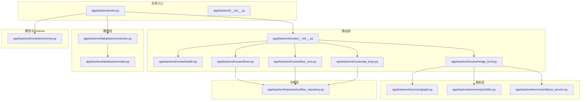
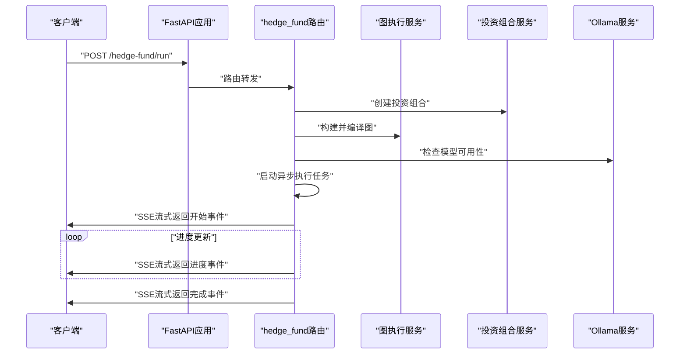
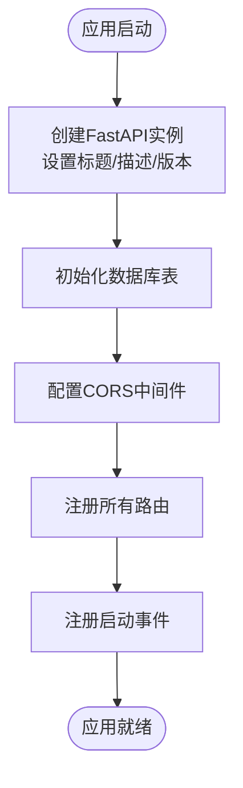
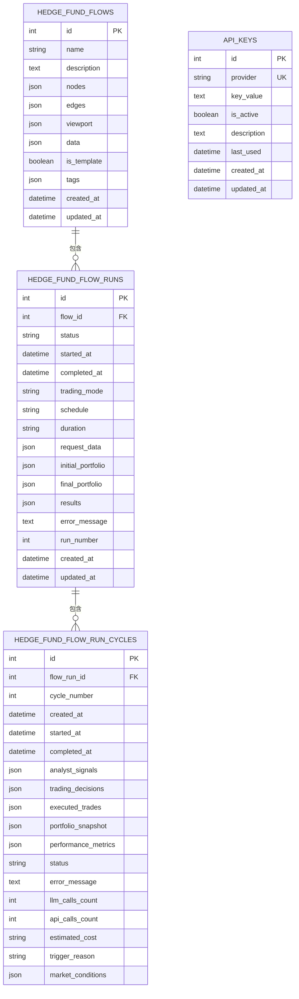
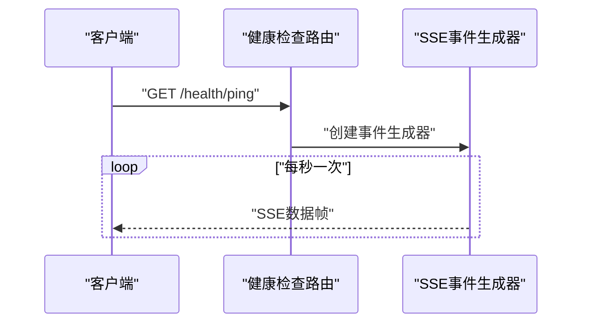
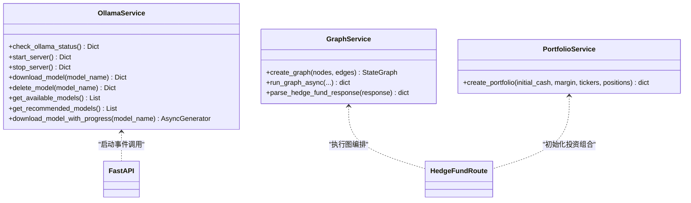
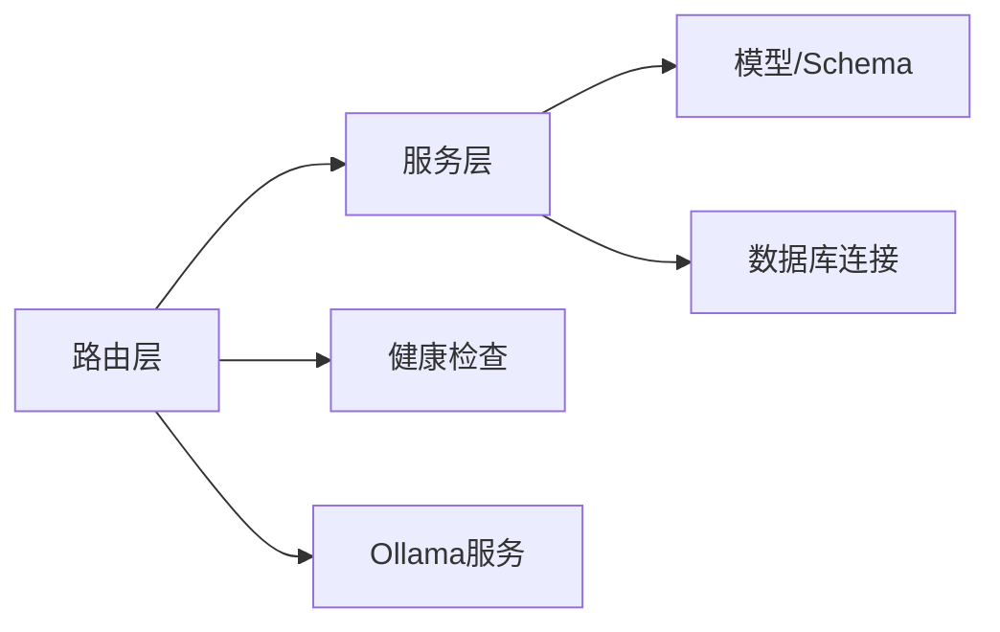

# FastAPI应用结构

<cite>
**本文档引用的文件**
- [app/backend/main.py](file://app/backend/main.py)
- [app/backend/__init__.py](file://app/backend/__init__.py)
- [app/backend/database/connection.py](file://app/backend/database/connection.py)
- [app/backend/database/models.py](file://app/backend/database/models.py)
- [app/backend/routes/__init__.py](file://app/backend/routes/__init__.py)
- [app/backend/routes/health.py](file://app/backend/routes/health.py)
- [app/backend/routes/hedge_fund.py](file://app/backend/routes/hedge_fund.py)
- [app/backend/routes/flows.py](file://app/backend/routes/flows.py)
- [app/backend/routes/flow_runs.py](file://app/backend/routes/flow_runs.py)
- [app/backend/routes/api_keys.py](file://app/backend/routes/api_keys.py)
- [app/backend/models/schemas.py](file://app/backend/models/schemas.py)
- [app/backend/services/ollama_service.py](file://app/backend/services/ollama_service.py)
- [app/backend/services/graph.py](file://app/backend/services/graph.py)
- [app/backend/services/portfolio.py](file://app/backend/services/portfolio.py)
- [app/backend/repositories/flow_repository.py](file://app/backend/repositories/flow_repository.py)
</cite>

## 目录
1. [简介](#简介)
2. [项目结构](#项目结构)
3. [核心组件](#核心组件)
4. [架构总览](#架构总览)
5. [详细组件分析](#详细组件分析)
6. [依赖关系分析](#依赖关系分析)
7. [性能考虑](#性能考虑)
8. [故障排除指南](#故障排除指南)
9. [结论](#结论)

## 简介
本项目是一个基于FastAPI的AI对冲基金后端系统，提供流式交易决策生成、回测引擎、工作流编排与管理、本地大模型（Ollama）集成等功能。应用通过事件驱动的SSE流式响应向前端推送执行进度，并支持健康检查与数据库初始化。

## 项目结构
后端采用分层架构：入口文件负责应用初始化、中间件与路由注册；routes层定义API接口；services层封装业务逻辑；repositories层处理数据访问；database层管理SQLAlchemy连接与模型。

**图表来源**
- [app/backend/main.py:1-56](file://app/backend/main.py#L1-L56)
- [app/backend/routes/__init__.py:1-24](file://app/backend/routes/__init__.py#L1-L24)
- [app/backend/database/connection.py:1-32](file://app/backend/database/connection.py#L1-L32)
- [app/backend/database/models.py:1-115](file://app/backend/database/models.py#L1-L115)
- [app/backend/services/graph.py:1-193](file://app/backend/services/graph.py#L1-L193)
- [app/backend/services/portfolio.py:1-52](file://app/backend/services/portfolio.py#L1-L52)
- [app/backend/services/ollama_service.py:1-519](file://app/backend/services/ollama_service.py#L1-L519)
- [app/backend/repositories/flow_repository.py:1-103](file://app/backend/repositories/flow_repository.py#L1-L103)
- [app/backend/models/schemas.py:1-292](file://app/backend/models/schemas.py#L1-L292)

**章节来源**
- [app/backend/main.py:1-56](file://app/backend/main.py#L1-L56)
- [app/backend/routes/__init__.py:1-24](file://app/backend/routes/__init__.py#L1-L24)

## 核心组件
- 应用实例与元信息
  - 应用实例在入口文件中创建，设置标题、描述与版本号，便于统一标识与版本追踪。
  - 参考路径：[app/backend/main.py:15](file://app/backend/main.py#L15)

- 数据库初始化
  - 使用SQLAlchemy创建SQLite数据库与表结构，初始化可安全重复执行。
  - 参考路径：[app/backend/main.py:17-18](file://app/backend/main.py#L17-L18)，[app/backend/database/connection.py:14-24](file://app/backend/database/connection.py#L14-L24)

- CORS中间件
  - 配置允许特定来源（本地前端地址）、凭证、方法与头，确保前后端联调顺畅。
  - 参考路径：[app/backend/main.py:20-27](file://app/backend/main.py#L20-L27)

- 路由聚合
  - 主路由聚合各功能模块路由，统一挂载到主应用。
  - 参考路径：[app/backend/routes/__init__.py:12-23](file://app/backend/routes/__init__.py#L12-L23)

- 启动事件
  - 应用启动时检查Ollama状态，记录可用模型与服务器运行情况，便于本地推理能力提示。
  - 参考路径：[app/backend/main.py:32-56](file://app/backend/main.py#L32-L56)，[app/backend/services/ollama_service.py:34-56](file://app/backend/services/ollama_service.py#L34-L56)

**章节来源**
- [app/backend/main.py:15-56](file://app/backend/main.py#L15-L56)
- [app/backend/database/connection.py:14-24](file://app/backend/database/connection.py#L14-L24)
- [app/backend/routes/__init__.py:12-23](file://app/backend/routes/__init__.py#L12-L23)
- [app/backend/services/ollama_service.py:34-56](file://app/backend/services/ollama_service.py#L34-L56)

## 架构总览
应用采用事件驱动的SSE流式响应，结合异步任务与队列实现长耗时操作的实时反馈。健康检查提供基础可用性验证，数据库层通过SQLAlchemy ORM抽象实现数据持久化。

**图表来源**
- [app/backend/routes/hedge_fund.py:18-155](file://app/backend/routes/hedge_fund.py#L18-L155)
- [app/backend/services/graph.py:132-177](file://app/backend/services/graph.py#L132-L177)
- [app/backend/services/portfolio.py:6-52](file://app/backend/services/portfolio.py#L6-L52)
- [app/backend/services/ollama_service.py:34-56](file://app/backend/services/ollama_service.py#L34-L56)

## 详细组件分析

### 应用初始化与生命周期
- 初始化流程
  - 创建FastAPI实例并设置标题、描述与版本。
  - 初始化数据库表结构。
  - 配置CORS中间件。
  - 注册所有路由。
  - 定义启动事件，检查Ollama状态。
- 生命周期事件
  - 启动事件用于环境探测与日志提示，不阻塞应用启动。
- 资源清理
  - 当前未定义关闭事件，建议在生产环境中增加关闭事件以释放资源。

**图表来源**
- [app/backend/main.py:15-56](file://app/backend/main.py#L15-L56)

**章节来源**
- [app/backend/main.py:15-56](file://app/backend/main.py#L15-L56)

### CORS与跨域策略
- 允许来源
  - 仅允许本地开发前端地址，避免生产环境暴露风险。
- 凭证与方法
  - 允许携带凭证、通配符方法与头，满足前端开发场景。
- 建议
  - 生产环境应限定具体来源并最小化允许的方法与头。

**章节来源**
- [app/backend/main.py:20-27](file://app/backend/main.py#L20-L27)

### 数据库与模型
- 连接配置
  - 使用绝对路径的SQLite数据库，适用于单机部署。
  - 提供会话工厂与依赖注入函数。
- 模型设计
  - 包含流配置表、执行运行表、周期表与API密钥表，支持工作流的全生命周期管理。
- 初始化机制
  - 表结构创建可安全重复执行，适合开发与测试环境。

**图表来源**
- [app/backend/database/models.py:6-115](file://app/backend/database/models.py#L6-L115)
- [app/backend/database/connection.py:14-24](file://app/backend/database/connection.py#L14-L24)

**章节来源**
- [app/backend/database/connection.py:14-24](file://app/backend/database/connection.py#L14-L24)
- [app/backend/database/models.py:6-115](file://app/backend/database/models.py#L6-L115)

### 路由与控制器
- 健康检查
  - 提供欢迎消息与SSE心跳接口，便于前端确认连接。
  - 参考路径：[app/backend/routes/health.py:9-27](file://app/backend/routes/health.py#L9-L27)
- 对冲基金执行
  - 支持实时流式执行与回测，使用SSE推送进度与结果。
  - 参考路径：[app/backend/routes/hedge_fund.py:18-353](file://app/backend/routes/hedge_fund.py#L18-L353)
- 流与运行管理
  - 提供流的增删改查、运行记录查询与统计等接口。
  - 参考路径：[app/backend/routes/flows.py:18-174](file://app/backend/routes/flows.py#L18-L174)，[app/backend/routes/flow_runs.py:20-303](file://app/backend/routes/flow_runs.py#L20-L303)
- API密钥管理
  - 提供密钥的创建、查询、更新、删除与批量更新等接口。
  - 参考路径：[app/backend/routes/api_keys.py:19-201](file://app/backend/routes/api_keys.py#L19-L201)

**图表来源**
- [app/backend/routes/health.py:14-27](file://app/backend/routes/health.py#L14-L27)

**章节来源**
- [app/backend/routes/health.py:9-27](file://app/backend/routes/health.py#L9-L27)
- [app/backend/routes/hedge_fund.py:18-353](file://app/backend/routes/hedge_fund.py#L18-L353)
- [app/backend/routes/flows.py:18-174](file://app/backend/routes/flows.py#L18-L174)
- [app/backend/routes/flow_runs.py:20-303](file://app/backend/routes/flow_runs.py#L20-L303)
- [app/backend/routes/api_keys.py:19-201](file://app/backend/routes/api_keys.py#L19-L201)

### 服务层与业务逻辑
- 图执行与编排
  - 基于LangGraph构建动态执行图，支持分析师节点、风险管理与投资组合管理节点的编排。
  - 异步包装器保证事件循环不被阻塞。
  - 参考路径：[app/backend/services/graph.py:36-177](file://app/backend/services/graph.py#L36-L177)
- 投资组合初始化
  - 根据初始资金、保证金要求与传入持仓初始化投资组合状态。
  - 参考路径：[app/backend/services/portfolio.py:6-52](file://app/backend/services/portfolio.py#L6-L52)
- Ollama集成
  - 提供安装检测、服务器启停、模型下载/删除与进度流式输出。
  - 启动事件中检查Ollama状态并记录日志。
  - 参考路径：[app/backend/services/ollama_service.py:34-519](file://app/backend/services/ollama_service.py#L34-L519)，[app/backend/main.py:32-56](file://app/backend/main.py#L32-L56)

**图表来源**
- [app/backend/services/ollama_service.py:34-519](file://app/backend/services/ollama_service.py#L34-L519)
- [app/backend/services/graph.py:36-177](file://app/backend/services/graph.py#L36-L177)
- [app/backend/services/portfolio.py:6-52](file://app/backend/services/portfolio.py#L6-L52)
- [app/backend/main.py:32-56](file://app/backend/main.py#L32-L56)

**章节来源**
- [app/backend/services/graph.py:36-177](file://app/backend/services/graph.py#L36-L177)
- [app/backend/services/portfolio.py:6-52](file://app/backend/services/portfolio.py#L6-L52)
- [app/backend/services/ollama_service.py:34-519](file://app/backend/services/ollama_service.py#L34-L519)

### 数据模型与Schema
- 请求/响应模型
  - 定义对冲基金请求、回测请求与响应、流与运行相关模型，以及API密钥模型。
  - 包含字段校验与默认值，确保数据一致性。
- 关键枚举
  - 运行状态枚举用于统一状态管理。

**章节来源**
- [app/backend/models/schemas.py:9-292](file://app/backend/models/schemas.py#L9-L292)

### 日志配置与错误处理
- 日志
  - 基础日志级别配置，启动事件中记录Ollama状态与可用模型信息。
- 错误处理
  - 路由层捕获异常并转换为HTTP异常，统一返回错误响应模型。
  - 建议在生产环境增加全局异常处理器与结构化日志。

**章节来源**
- [app/backend/main.py:11-13](file://app/backend/main.py#L11-L13)
- [app/backend/main.py:32-56](file://app/backend/main.py#L32-L56)
- [app/backend/routes/hedge_fund.py:157-160](file://app/backend/routes/hedge_fund.py#L157-L160)

### 健康检查机制
- 接口
  - 根路径返回欢迎消息。
  - /health/ping 返回SSE心跳流，便于前端保持连接。
- 实现
  - 使用异步生成器与定时器实现周期性事件推送。

**章节来源**
- [app/backend/routes/health.py:9-27](file://app/backend/routes/health.py#L9-L27)

## 依赖关系分析
- 组件耦合
  - 路由层依赖服务层与数据库依赖注入；服务层依赖外部工具（如Ollama）。
- 外部依赖
  - FastAPI、SQLAlchemy、LangGraph、Ollama Python客户端。
- 循环依赖
  - 当前结构未发现循环导入，但需注意路由与服务之间的相互引用。

**图表来源**
- [app/backend/routes/__init__.py:12-23](file://app/backend/routes/__init__.py#L12-L23)
- [app/backend/services/graph.py:1-193](file://app/backend/services/graph.py#L1-L193)
- [app/backend/services/ollama_service.py:1-519](file://app/backend/services/ollama_service.py#L1-L519)
- [app/backend/database/connection.py:1-32](file://app/backend/database/connection.py#L1-L32)

**章节来源**
- [app/backend/routes/__init__.py:12-23](file://app/backend/routes/__init__.py#L12-L23)
- [app/backend/services/graph.py:1-193](file://app/backend/services/graph.py#L1-L193)
- [app/backend/services/ollama_service.py:1-519](file://app/backend/services/ollama_service.py#L1-L519)
- [app/backend/database/connection.py:1-32](file://app/backend/database/connection.py#L1-L32)

## 性能考虑
- 异步与并发
  - 使用异步生成器与队列实现SSE流式推送，避免阻塞事件循环。
  - 图执行通过线程池包装同步调用，防止阻塞。
- 并发控制
  - 建议引入限流与并发上限配置，避免高负载下资源争用。
- 数据库性能
  - SQLite适用于小规模数据，生产环境建议迁移到PostgreSQL/MySQL并启用连接池。
- I/O优化
  - 将外部API调用与模型下载/删除操作异步化，减少等待时间。

[本节为通用指导，无需列出章节来源]

## 故障排除指南
- Ollama不可用
  - 启动事件会记录状态，若未安装或未运行，按提示进行安装与启动。
  - 参考路径：[app/backend/main.py:32-56](file://app/backend/main.py#L32-L56)，[app/backend/services/ollama_service.py:34-56](file://app/backend/services/ollama_service.py#L34-L56)
- 数据库连接问题
  - 确认数据库文件路径与权限，SQLite文件应位于后端目录内。
  - 参考路径：[app/backend/database/connection.py:8-12](file://app/backend/database/connection.py#L8-L12)
- 路由404/500
  - 检查路由是否正确注册，异常会被转换为标准错误响应。
  - 参考路径：[app/backend/routes/hedge_fund.py:157-160](file://app/backend/routes/hedge_fund.py#L157-L160)

**章节来源**
- [app/backend/main.py:32-56](file://app/backend/main.py#L32-L56)
- [app/backend/services/ollama_service.py:34-56](file://app/backend/services/ollama_service.py#L34-L56)
- [app/backend/database/connection.py:8-12](file://app/backend/database/connection.py#L8-L12)
- [app/backend/routes/hedge_fund.py:157-160](file://app/backend/routes/hedge_fund.py#L157-L160)

## 结论
该FastAPI应用通过清晰的分层架构实现了从路由到服务再到数据的完整链路，具备良好的扩展性与可维护性。建议在生产环境中补充关闭事件、全局异常处理、结构化日志与更严格的CORS配置，并考虑迁移数据库与引入限流策略以提升稳定性与性能。