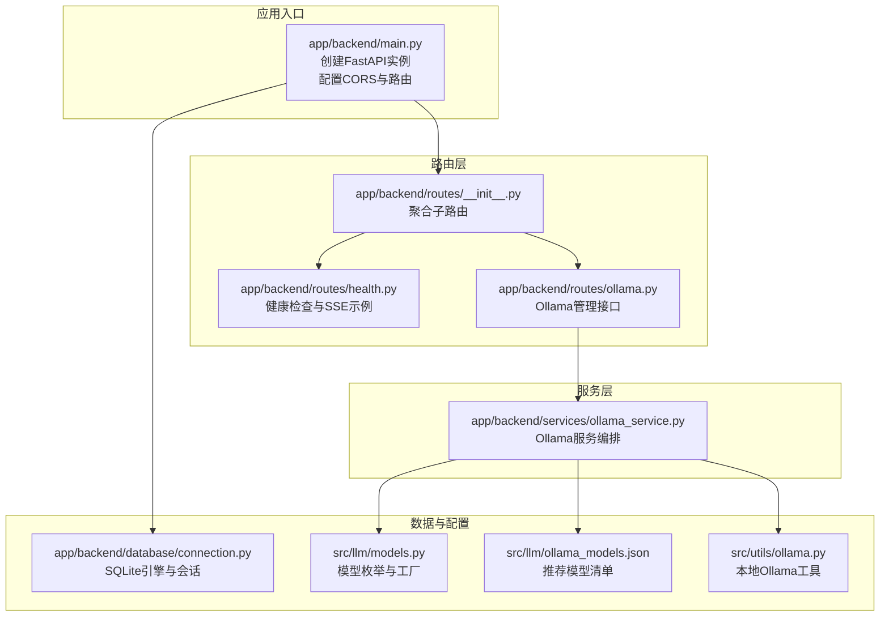
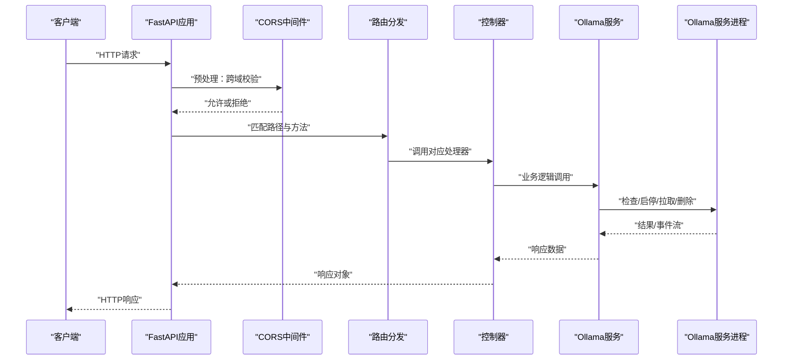
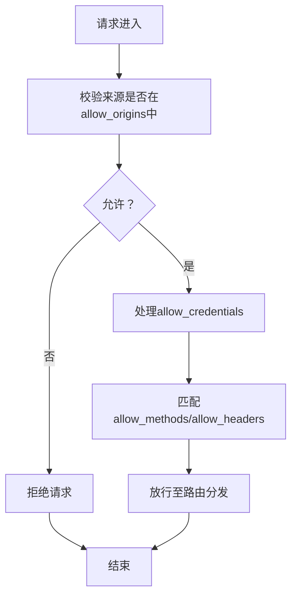
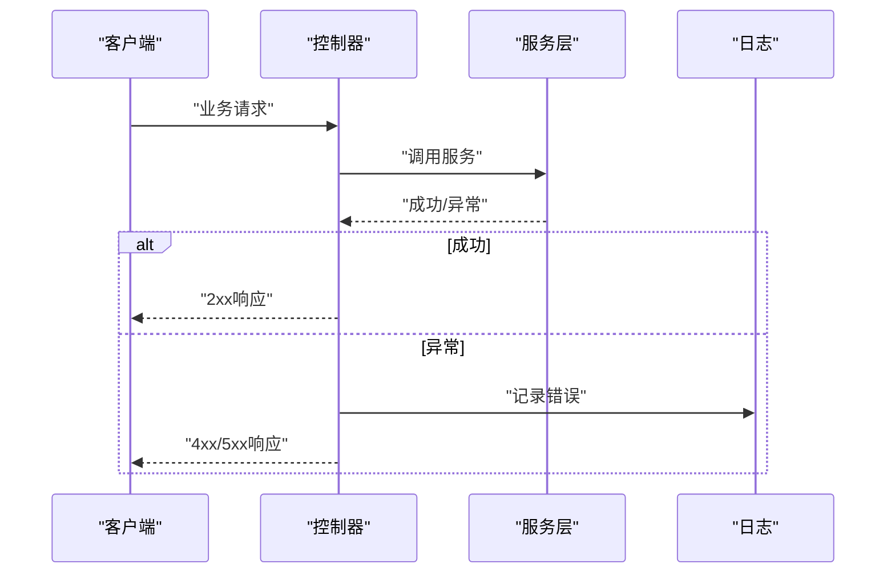
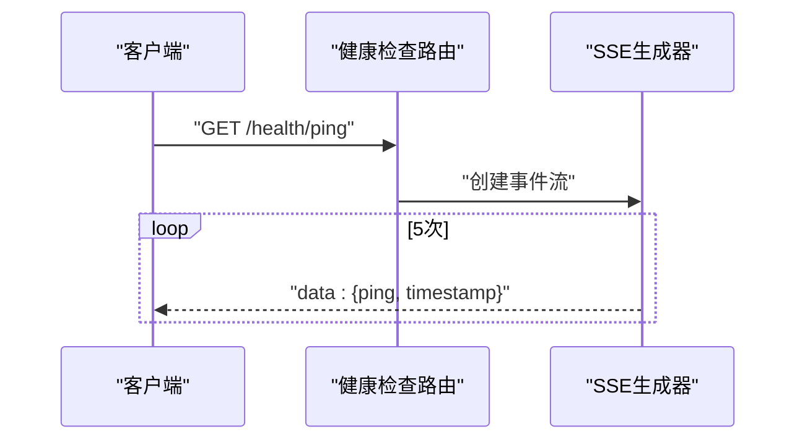
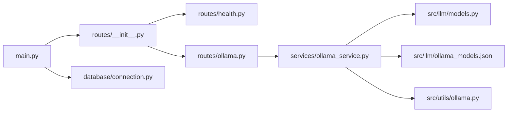

# 中间件配置

<cite>
**本文引用的文件**
- [app/backend/main.py](file://app/backend/main.py)
- [app/backend/routes/__init__.py](file://app/backend/routes/__init__.py)
- [app/backend/routes/ollama.py](file://app/backend/routes/ollama.py)
- [app/backend/routes/health.py](file://app/backend/routes/health.py)
- [app/backend/services/ollama_service.py](file://app/backend/services/ollama_service.py)
- [app/backend/database/connection.py](file://app/backend/database/connection.py)
- [src/llm/models.py](file://src/llm/models.py)
- [src/llm/ollama_models.json](file://src/llm/ollama_models.json)
- [src/utils/ollama.py](file://src/utils/ollama.py)
</cite>

## 目录
1. [简介](#简介)
2. [项目结构](#项目结构)
3. [核心组件](#核心组件)
4. [架构总览](#架构总览)
5. [详细组件分析](#详细组件分析)
6. [依赖分析](#依赖分析)
7. [性能考虑](#性能考虑)
8. [故障排查指南](#故障排查指南)
9. [结论](#结论)
10. [附录](#附录)

## 简介
本文件系统化梳理本项目的中间件配置与运行机制，重点覆盖以下方面：
- CORS 中间件的配置选项与跨域策略
- 中间件执行顺序、优先级与链式调用
- 请求预处理、响应后处理与异常拦截
- Ollama 服务集成、状态检查与可用性监控
- 日志记录、性能监控与请求追踪
- 安全中间件、输入过滤与防护措施
- 缓存中间件、静态文件服务与压缩处理
- 自定义中间件开发、注册机制与配置管理

## 项目结构
后端基于 FastAPI 构建，采用模块化路由组织与服务层封装，Ollama 集成通过独立服务类与路由控制器协同完成。



**图表来源**
- [app/backend/main.py:1-56](file://app/backend/main.py#L1-L56)
- [app/backend/routes/__init__.py:1-24](file://app/backend/routes/__init__.py#L1-L24)
- [app/backend/routes/health.py:1-28](file://app/backend/routes/health.py#L1-L28)
- [app/backend/routes/ollama.py:1-319](file://app/backend/routes/ollama.py#L1-L319)
- [app/backend/services/ollama_service.py:1-519](file://app/backend/services/ollama_service.py#L1-L519)
- [app/backend/database/connection.py:1-32](file://app/backend/database/connection.py#L1-L32)
- [src/llm/models.py:1-258](file://src/llm/models.py#L1-L258)
- [src/llm/ollama_models.json:1-57](file://src/llm/ollama_models.json#L1-L57)
- [src/utils/ollama.py:1-408](file://src/utils/ollama.py#L1-L408)

**章节来源**
- [app/backend/main.py:1-56](file://app/backend/main.py#L1-L56)
- [app/backend/routes/__init__.py:1-24](file://app/backend/routes/__init__.py#L1-L24)

## 核心组件
- 应用入口与中间件
  - 在应用启动时配置 CORS 中间件，允许前端地址访问，并支持凭据、通配方法与头。
  - 包含所有业务路由（健康检查、Ollama 管理、语言模型、存储、流程等）。
- 路由与控制器
  - 健康检查路由提供基础问候与 Server-Sent Events 示例。
  - Ollama 路由提供状态查询、启停服务、模型下载/进度/删除等接口。
- 服务层
  - Ollama 服务类负责安装检测、服务启停、模型拉取/删除、进度流与可用模型格式化。
- 数据与配置
  - SQLite 引擎与会话管理；模型枚举与工厂；推荐模型清单；本地 Ollama 工具集。

**章节来源**
- [app/backend/main.py:15-30](file://app/backend/main.py#L15-L30)
- [app/backend/routes/health.py:9-28](file://app/backend/routes/health.py#L9-L28)
- [app/backend/routes/ollama.py:41-319](file://app/backend/routes/ollama.py#L41-L319)
- [app/backend/services/ollama_service.py:19-173](file://app/backend/services/ollama_service.py#L19-L173)
- [app/backend/database/connection.py:14-32](file://app/backend/database/connection.py#L14-L32)
- [src/llm/models.py:17-258](file://src/llm/models.py#L17-L258)
- [src/llm/ollama_models.json:1-57](file://src/llm/ollama_models.json#L1-L57)
- [src/utils/ollama.py:17-408](file://src/utils/ollama.py#L17-L408)

## 架构总览
下图展示从客户端到服务层的整体调用链，以及中间件在请求生命周期中的位置。



**图表来源**
- [app/backend/main.py:20-27](file://app/backend/main.py#L20-L27)
- [app/backend/routes/__init__.py:15-24](file://app/backend/routes/__init__.py#L15-L24)
- [app/backend/routes/ollama.py:48-55](file://app/backend/routes/ollama.py#L48-L55)
- [app/backend/services/ollama_service.py:34-56](file://app/backend/services/ollama_service.py#L34-L56)

## 详细组件分析

### CORS 中间件配置与跨域策略
- 配置要点
  - 允许来源：本地前端地址列表
  - 凭据：允许携带 Cookie/认证头
  - 方法与头：通配符，便于开发阶段灵活调试
- 执行顺序与优先级
  - CORS 中间件在路由分发之前生效，确保跨域预检与实际请求均受控。
  - 作为第一个中间件注册，可避免后续中间件对跨域头部的误改。
- 链式调用
  - 未显式添加其他中间件时，CORS 即为首个中间件；如需扩展，应遵循“越靠前的中间件越靠近网络层”的原则进行注册。



**图表来源**
- [app/backend/main.py:20-27](file://app/backend/main.py#L20-L27)

**章节来源**
- [app/backend/main.py:20-27](file://app/backend/main.py#L20-L27)

### 请求预处理、响应后处理与异常拦截
- 预处理
  - CORS 中间件在 OPTIONS 预检与实际请求中统一校验来源、方法与头。
- 后处理
  - 控制器返回响应对象，FastAPI 默认设置 Content-Length/Transfer-Encoding 等头部。
- 异常拦截
  - 控制器内捕获业务异常并转换为 HTTP 异常，统一返回错误响应模型。
  - 启动事件中对 Ollama 状态检查失败进行告警记录，不影响服务启动。



**图表来源**
- [app/backend/routes/ollama.py:53-55](file://app/backend/routes/ollama.py#L53-L55)
- [app/backend/main.py:32-56](file://app/backend/main.py#L32-L56)

**章节来源**
- [app/backend/routes/ollama.py:53-55](file://app/backend/routes/ollama.py#L53-L55)
- [app/backend/main.py:32-56](file://app/backend/main.py#L32-L56)

### Ollama 服务集成、状态检查与可用性监控
- 状态检查
  - 检查安装、服务运行、可用模型与服务器地址，返回结构化状态。
- 可用性监控
  - 应用启动时打印状态信息，包括已安装模型列表与服务 URL。
- 运行控制
  - 支持启动/停止服务，内部使用同步/异步客户端与进程管理。
- 模型管理
  - 拉取/删除模型，支持进度流与取消（模拟）。
- 推荐模型
  - 从 JSON 文件加载，或回退默认推荐项；仅返回已下载且在推荐清单内的模型。

```mermaid
classDiagram
class OllamaService {
+check_ollama_status() Dict
+start_server() Dict
+stop_server() Dict
+download_model(name) Dict
+download_model_with_progress(name) AsyncGenerator
+delete_model(name) Dict
+get_recommended_models() List
+get_available_models() List
+get_download_progress(name) Dict
+get_all_download_progress() Dict
+cancel_download(name) bool
}
class FastAPIApp {
+include_router()
+add_middleware(CORSMiddleware)
}
class OllamaRouter {
+GET /status
+POST /start
+POST /stop
+POST /models/download
+POST /models/download/progress
+GET /models/download/progress/{model_name}
+GET /models/downloads/active
+DELETE /models/{model_name}
+GET /models/recommended
+DELETE /models/download/{model_name}
}
FastAPIApp --> OllamaRouter : "包含路由"
OllamaRouter --> OllamaService : "调用服务"
```

**图表来源**
- [app/backend/services/ollama_service.py:19-173](file://app/backend/services/ollama_service.py#L19-L173)
- [app/backend/routes/ollama.py:41-319](file://app/backend/routes/ollama.py#L41-L319)
- [app/backend/main.py:29-30](file://app/backend/main.py#L29-L30)

**章节来源**
- [app/backend/services/ollama_service.py:34-173](file://app/backend/services/ollama_service.py#L34-L173)
- [app/backend/routes/ollama.py:41-319](file://app/backend/routes/ollama.py#L41-L319)
- [app/backend/main.py:32-56](file://app/backend/main.py#L32-L56)
- [src/llm/ollama_models.json:1-57](file://src/llm/ollama_models.json#L1-L57)

### 健康检查与可用性监控
- 健康检查路由提供基础问候与 SSE ping 流，用于验证服务连通性与事件推送能力。
- 建议在生产环境增加更严格的数据库连通性、第三方服务可用性检查。



**图表来源**
- [app/backend/routes/health.py:14-28](file://app/backend/routes/health.py#L14-L28)

**章节来源**
- [app/backend/routes/health.py:9-28](file://app/backend/routes/health.py#L9-L28)

### 日志中间件、性能监控与请求追踪
- 日志记录
  - 应用入口配置日志级别与记录器；启动事件中记录 Ollama 状态检查结果。
  - 控制器中对异常进行错误日志记录，便于问题定位。
- 性能监控
  - 当前未内置性能指标中间件；建议引入 Prometheus 或自定义中间件统计请求耗时与错误率。
- 请求追踪
  - 可通过中间件注入 trace_id 并贯穿日志上下文，便于分布式追踪。

**章节来源**
- [app/backend/main.py:11-13](file://app/backend/main.py#L11-L13)
- [app/backend/main.py:32-56](file://app/backend/main.py#L32-L56)
- [app/backend/routes/ollama.py:53-55](file://app/backend/routes/ollama.py#L53-L55)

### 安全中间件、输入过滤与防护措施
- CORS 已启用，限制来源、方法与头，降低跨站风险。
- 输入过滤与防护
  - 控制器使用 Pydantic 模型进行参数校验；HTTP 异常统一处理。
  - 建议补充速率限制、CSRF 防护、敏感信息脱敏与审计日志。

**章节来源**
- [app/backend/main.py:20-27](file://app/backend/main.py#L20-L27)
- [app/backend/routes/ollama.py:14-40](file://app/backend/routes/ollama.py#L14-L40)

### 缓存中间件、静态文件服务与压缩处理
- 缓存中间件
  - 未发现内置缓存中间件；可通过自定义中间件或外部缓存（如 Redis）实现。
- 静态文件服务
  - 未发现静态文件路由；如需提供静态资源，可在应用中注册静态文件挂载。
- 压缩处理
  - 未发现压缩中间件；可考虑启用 gzip/br 压缩以优化传输体积。

**章节来源**
- [app/backend/main.py:15-30](file://app/backend/main.py#L15-L30)

### 自定义中间件开发、注册机制与配置管理
- 开发步骤
  - 定义中间件函数，接收 scope、receive、send；在应用启动时通过 add_middleware 注册。
  - 注意中间件顺序：CORS 通常置于首位，其次为鉴权/日志/限流等。
- 注册机制
  - 使用 FastAPI 的 add_middleware 动态注册；也可在应用初始化时集中配置。
- 配置管理
  - 将中间件参数（如 CORS 来源、超时、重试等）抽取为配置项，便于环境差异化管理。

**章节来源**
- [app/backend/main.py:20-27](file://app/backend/main.py#L20-L27)

## 依赖分析
- 组件耦合
  - 路由层依赖服务层；服务层依赖模型定义与推荐清单；应用入口依赖路由聚合。
- 外部依赖
  - FastAPI、SQLAlchemy、ollama Python SDK、requests（工具脚本）。
- 潜在循环依赖
  - 服务层导入模型定义避免了循环；若新增跨模块引用，需谨慎设计导入顺序。



**图表来源**
- [app/backend/main.py:6-30](file://app/backend/main.py#L6-L30)
- [app/backend/routes/__init__.py:1-24](file://app/backend/routes/__init__.py#L1-L24)
- [app/backend/routes/health.py:1-28](file://app/backend/routes/health.py#L1-L28)
- [app/backend/routes/ollama.py:1-319](file://app/backend/routes/ollama.py#L1-L319)
- [app/backend/services/ollama_service.py:1-519](file://app/backend/services/ollama_service.py#L1-L519)
- [app/backend/database/connection.py:1-32](file://app/backend/database/connection.py#L1-L32)
- [src/llm/models.py:1-258](file://src/llm/models.py#L1-L258)
- [src/llm/ollama_models.json:1-57](file://src/llm/ollama_models.json#L1-L57)
- [src/utils/ollama.py:1-408](file://src/utils/ollama.py#L1-L408)

**章节来源**
- [app/backend/main.py:6-30](file://app/backend/main.py#L6-L30)
- [app/backend/routes/__init__.py:1-24](file://app/backend/routes/__init__.py#L1-L24)

## 性能考虑
- I/O 密集场景
  - Ollama 下载与进度流为异步操作，注意并发控制与资源释放。
- 数据库性能
  - SQLite 适用于开发与小规模场景；生产建议迁移到 PostgreSQL/MySQL 并启用连接池。
- 中间件开销
  - 在生产环境按需启用中间件，避免不必要的头部处理与日志输出。

[本节为通用指导，无需特定文件引用]

## 故障排查指南
- CORS 相关
  - 若浏览器报跨域错误，检查 allow_origins 是否包含当前前端地址，确认凭据与头是否匹配。
- Ollama 状态
  - 启动事件日志显示 Ollama 未安装/未运行时，先确认服务进程与端口可达。
- 控制器异常
  - 查看控制器日志与异常栈，确认参数校验与业务逻辑分支是否正确。
- 数据库连接
  - 确认数据库路径与权限，SQLite 文件是否存在且可写。

**章节来源**
- [app/backend/main.py:32-56](file://app/backend/main.py#L32-L56)
- [app/backend/routes/ollama.py:53-55](file://app/backend/routes/ollama.py#L53-L55)
- [app/backend/database/connection.py:14-32](file://app/backend/database/connection.py#L14-L32)

## 结论
本项目在中间件层面以 CORS 为核心，结合路由与服务层实现了 Ollama 的完整生命周期管理。建议在生产环境中补充速率限制、压缩、缓存与性能监控中间件，并完善日志与追踪体系，以提升安全性与可观测性。

[本节为总结性内容，无需特定文件引用]

## 附录
- 快速参考
  - CORS 来源：本地前端地址
  - 路由前缀：/ollama
  - 数据库：SQLite（绝对路径）
  - 模型来源：本地 Ollama 与推荐清单

**章节来源**
- [app/backend/main.py:20-27](file://app/backend/main.py#L20-L27)
- [app/backend/routes/ollama.py:12](file://app/backend/routes/ollama.py#L12)
- [app/backend/database/connection.py:8-12](file://app/backend/database/connection.py#L8-L12)
- [src/llm/ollama_models.json:1-57](file://src/llm/ollama_models.json#L1-L57)