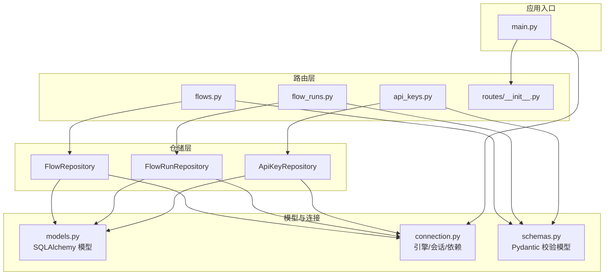
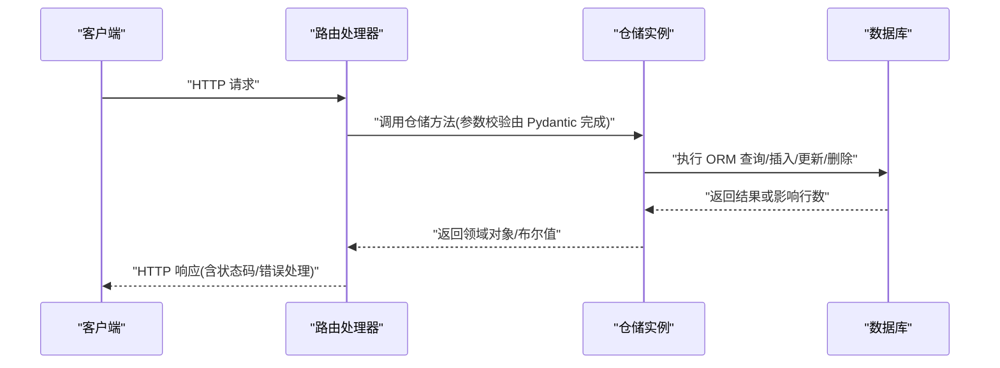
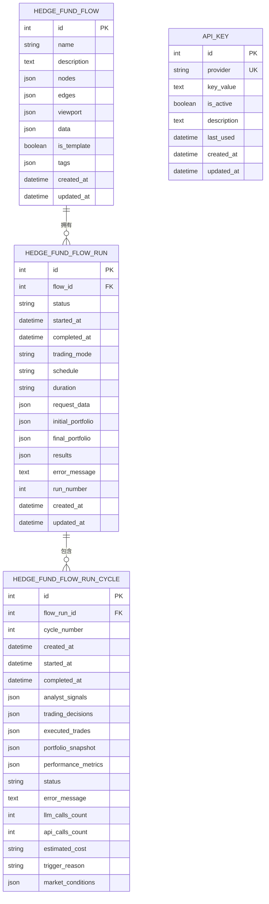
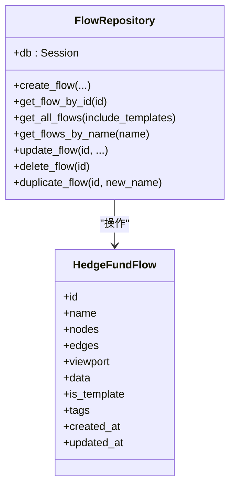
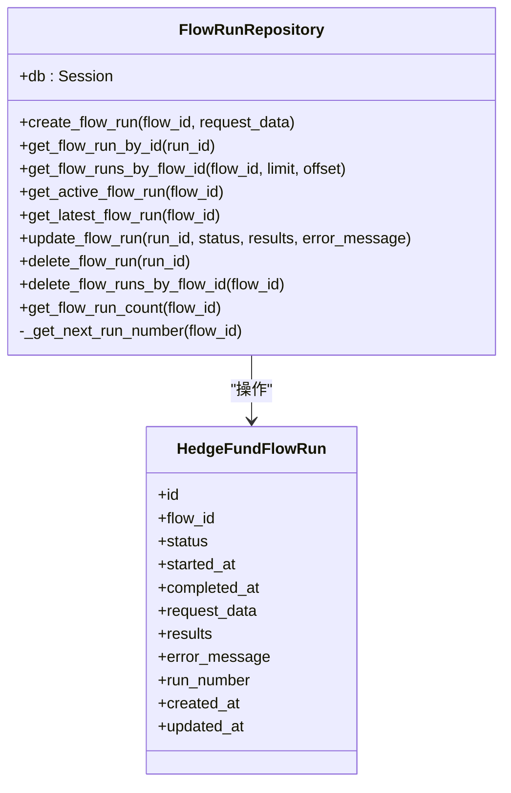
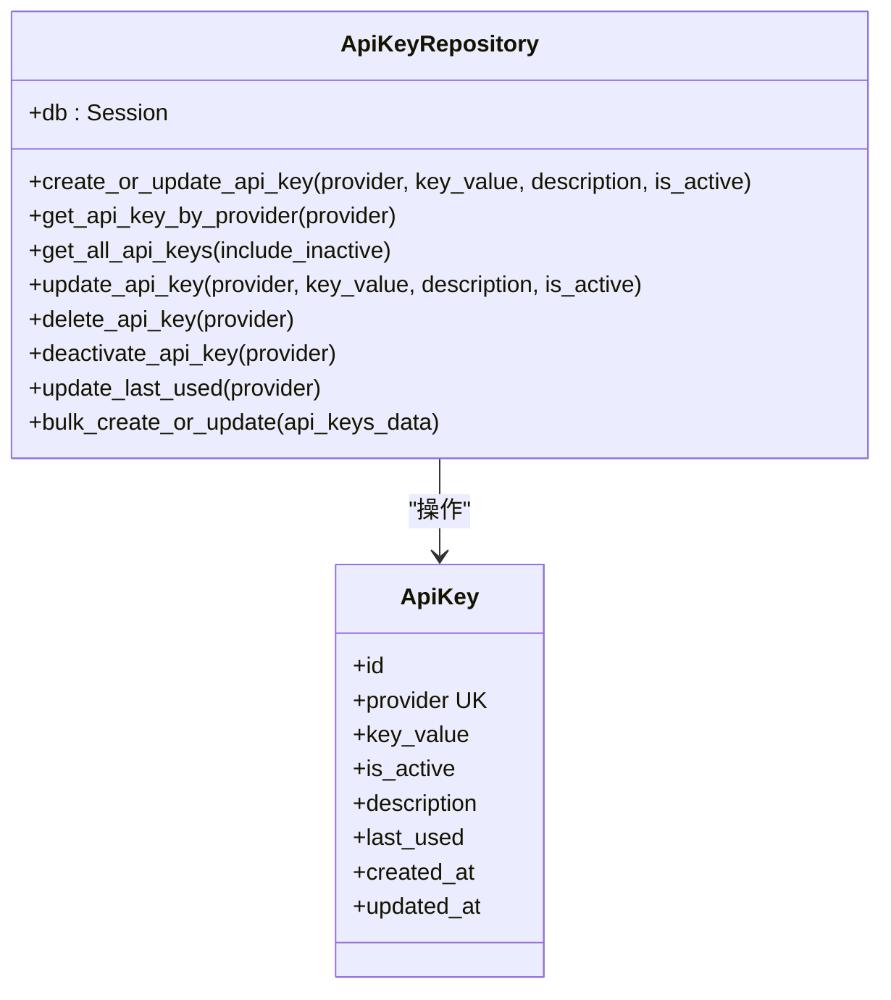
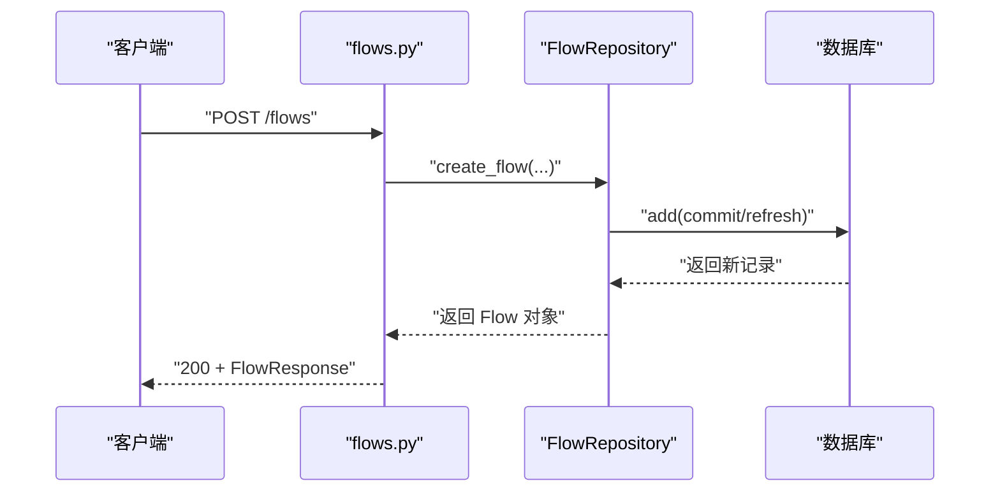
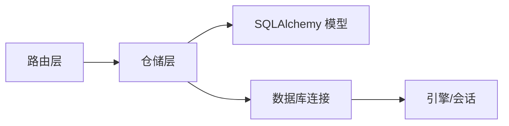

# 仓储模式实现

<cite>
**本文档引用的文件**
- [app/backend/database/models.py](file://app/backend/database/models.py)
- [app/backend/database/connection.py](file://app/backend/database/connection.py)
- [app/backend/repositories/__init__.py](file://app/backend/repositories/__init__.py)
- [app/backend/repositories/api_key_repository.py](file://app/backend/repositories/api_key_repository.py)
- [app/backend/repositories/flow_repository.py](file://app/backend/repositories/flow_repository.py)
- [app/backend/repositories/flow_run_repository.py](file://app/backend/repositories/flow_run_repository.py)
- [app/backend/models/schemas.py](file://app/backend/models/schemas.py)
- [app/backend/routes/api_keys.py](file://app/backend/routes/api_keys.py)
- [app/backend/routes/flows.py](file://app/backend/routes/flows.py)
- [app/backend/routes/flow_runs.py](file://app/backend/routes/flow_runs.py)
- [app/backend/routes/__init__.py](file://app/backend/routes/__init__.py)
- [app/backend/main.py](file://app/backend/main.py)
- [tests/test_cache.py](file://tests/test_cache.py)
</cite>

## 目录
1. [简介](#简介)
2. [项目结构](#项目结构)
3. [核心组件](#核心组件)
4. [架构总览](#架构总览)
5. [详细组件分析](#详细组件分析)
6. [依赖分析](#依赖分析)
7. [性能考虑](#性能考虑)
8. [故障排查指南](#故障排查指南)
9. [结论](#结论)
10. [附录](#附录)

## 简介
本文件系统化阐述本项目的仓储模式（Repository Pattern）实现，覆盖数据访问层的设计原则与实现方式，包括：
- 仓储类的职责边界与方法定义
- 数据库操作封装、查询构建与事务管理
- 数据模型映射、关系查询与复杂关联
- 缓存策略、查询优化与性能调优
- 数据验证、业务规则与约束检查
- 异步操作、并发控制与锁机制
- 单元测试、模拟对象与集成测试策略
- 数据迁移、版本管理与向后兼容性

## 项目结构
后端采用分层架构：FastAPI 路由层负责请求处理与响应序列化；仓储层封装数据库操作；模型层定义 SQLAlchemy 表结构与 Pydantic 校验模型；连接层提供数据库引擎与会话依赖。

图表来源
- [app/backend/routes/flows.py:1-174](file://app/backend/routes/flows.py#L1-L174)
- [app/backend/routes/flow_runs.py:1-303](file://app/backend/routes/flow_runs.py#L1-L303)
- [app/backend/routes/api_keys.py:1-201](file://app/backend/routes/api_keys.py#L1-L201)
- [app/backend/repositories/flow_repository.py:1-103](file://app/backend/repositories/flow_repository.py#L1-L103)
- [app/backend/repositories/flow_run_repository.py:1-133](file://app/backend/repositories/flow_run_repository.py#L1-L133)
- [app/backend/repositories/api_key_repository.py:1-131](file://app/backend/repositories/api_key_repository.py#L1-L131)
- [app/backend/database/models.py:1-115](file://app/backend/database/models.py#L1-L115)
- [app/backend/database/connection.py:1-32](file://app/backend/database/connection.py#L1-L32)
- [app/backend/models/schemas.py:1-292](file://app/backend/models/schemas.py#L1-L292)
- [app/backend/main.py:1-56](file://app/backend/main.py#L1-L56)

章节来源
- [app/backend/main.py:15-31](file://app/backend/main.py#L15-L31)
- [app/backend/database/connection.py:15-32](file://app/backend/database/connection.py#L15-L32)
- [app/backend/database/models.py:6-115](file://app/backend/database/models.py#L6-L115)

## 核心组件
- 数据库模型：定义三张核心表（流配置、运行记录、运行周期），含外键关系与索引字段。
- 仓储类：
  - FlowRepository：封装 HedgeFundFlow 的增删改查、复制与按名搜索。
  - FlowRunRepository：封装 HedgeFundFlowRun 的增删改查、活跃运行查询、计数与运行号生成。
  - ApiKeyRepository：封装 ApiKey 的创建/更新、查询、批量更新、停用与使用时间追踪。
- 路由层：为每个仓储提供 HTTP 接口，统一异常处理与响应模型。
- 连接与依赖：提供 SQLite 引擎、会话工厂与 FastAPI 依赖注入函数。
- 校验模型：定义请求/响应的 Pydantic 模型与枚举，确保输入输出一致性。

章节来源
- [app/backend/database/models.py:6-115](file://app/backend/database/models.py#L6-L115)
- [app/backend/repositories/flow_repository.py:6-103](file://app/backend/repositories/flow_repository.py#L6-L103)
- [app/backend/repositories/flow_run_repository.py:9-133](file://app/backend/repositories/flow_run_repository.py#L9-L133)
- [app/backend/repositories/api_key_repository.py:9-131](file://app/backend/repositories/api_key_repository.py#L9-L131)
- [app/backend/models/schemas.py:9-292](file://app/backend/models/schemas.py#L9-L292)
- [app/backend/database/connection.py:15-32](file://app/backend/database/connection.py#L15-L32)

## 架构总览
仓储模式通过“接口隔离 + 依赖注入”实现关注点分离：路由层仅依赖仓储接口，仓储层仅依赖 SQLAlchemy 会话与模型，避免业务逻辑渗透到数据访问细节中。

图表来源
- [app/backend/routes/flows.py:26-42](file://app/backend/routes/flows.py#L26-L42)
- [app/backend/repositories/flow_repository.py:12-28](file://app/backend/repositories/flow_repository.py#L12-L28)
- [app/backend/routes/flow_runs.py:28-51](file://app/backend/routes/flow_runs.py#L28-L51)
- [app/backend/repositories/flow_run_repository.py:15-29](file://app/backend/repositories/flow_run_repository.py#L15-L29)
- [app/backend/routes/api_keys.py:27-39](file://app/backend/routes/api_keys.py#L27-L39)
- [app/backend/repositories/api_key_repository.py:15-46](file://app/backend/repositories/api_key_repository.py#L15-L46)

## 详细组件分析

### 数据模型与关系
- HedgeFundFlow：存储 React Flow 配置与元数据，支持模板标记与标签。
- HedgeFundFlowRun：跟踪单次执行，含状态机与时序字段，与 Flow 外键关联。
- HedgeFundFlowRunCycle：单次交易会话内的分析周期，记录信号、决策、交易与成本。
- ApiKey：服务密钥管理，支持启用/停用与最后使用时间追踪。
- 关系：FlowRun → Flow（多对一），FlowRunCycle → FlowRun（多对一）。

图表来源
- [app/backend/database/models.py:6-115](file://app/backend/database/models.py#L6-L115)

章节来源
- [app/backend/database/models.py:6-115](file://app/backend/database/models.py#L6-L115)

### FlowRepository 分析
- 职责边界：专注 HedgeFundFlow 的 CRUD、复制与名称搜索。
- 方法要点：
  - 创建：接收节点/边/视口/数据等 JSON 字段，设置模板与标签。
  - 查询：按 ID、列表（可排除模板）、名称模糊匹配（大小写不敏感）。
  - 更新：按需更新字段，提交并刷新。
  - 删除与复制：删除与基于现有记录创建副本（默认非模板）。
- 事务管理：每次操作在仓储内部 commit，保证单次调用的原子性。

图表来源
- [app/backend/repositories/flow_repository.py:6-103](file://app/backend/repositories/flow_repository.py#L6-L103)
- [app/backend/database/models.py:6-27](file://app/backend/database/models.py#L6-L27)

章节来源
- [app/backend/repositories/flow_repository.py:6-103](file://app/backend/repositories/flow_repository.py#L6-L103)

### FlowRunRepository 分析
- 职责边界：专注 HedgeFundFlowRun 的生命周期管理与统计。
- 方法要点：
  - 创建：自动生成运行号（基于最大值+1），初始状态为 IDLE。
  - 查询：按 ID、按 Flow、活跃运行、最新运行、分页列表。
  - 更新：支持状态变更与时间戳联动（开始/完成时自动填充）。
  - 删除：单条删除与按 Flow 批量删除。
  - 统计：运行总数与运行号生成。
- 事务管理：所有更新均在仓储内 commit，确保状态机一致性。

图表来源
- [app/backend/repositories/flow_run_repository.py:9-133](file://app/backend/repositories/flow_run_repository.py#L9-L133)
- [app/backend/database/models.py:29-54](file://app/backend/database/models.py#L29-L54)

章节来源
- [app/backend/repositories/flow_run_repository.py:9-133](file://app/backend/repositories/flow_run_repository.py#L9-L133)

### ApiKeyRepository 分析
- 职责边界：专注 ApiKey 的全量生命周期与批量操作。
- 方法要点：
  - 创建/更新：按 provider 唯一键存在则更新，否则新建。
  - 查询：按 provider 获取（仅激活）、列出全部（可包含停用）。
  - 更新：按需更新密钥值、描述与启用状态。
  - 删除与停用：物理删除与逻辑停用。
  - 使用追踪：更新 last_used 时间戳。
  - 批量：遍历批量创建/更新。
- 事务管理：单条与批量操作均在仓储内 commit。

图表来源
- [app/backend/repositories/api_key_repository.py:9-131](file://app/backend/repositories/api_key_repository.py#L9-L131)
- [app/backend/database/models.py:97-113](file://app/backend/database/models.py#L97-L113)

章节来源
- [app/backend/repositories/api_key_repository.py:9-131](file://app/backend/repositories/api_key_repository.py#L9-L131)

### 路由层与仓储交互流程
- 流程概览：路由接收请求 → 依赖注入 Session → 构造仓储 → 调用仓储方法 → 返回 Pydantic 序列化响应。
- 错误处理：统一捕获异常并转换为 HTTP 异常，返回标准错误模型。

图表来源
- [app/backend/routes/flows.py:26-42](file://app/backend/routes/flows.py#L26-L42)
- [app/backend/repositories/flow_repository.py:12-28](file://app/backend/repositories/flow_repository.py#L12-L28)

章节来源
- [app/backend/routes/flows.py:18-42](file://app/backend/routes/flows.py#L18-L42)
- [app/backend/routes/flow_runs.py:20-51](file://app/backend/routes/flow_runs.py#L20-L51)
- [app/backend/routes/api_keys.py:19-39](file://app/backend/routes/api_keys.py#L19-L39)

### 查询构建与事务管理
- 查询构建：使用 SQLAlchemy Query API，支持过滤、排序、限制与偏移。
- 事务管理：仓储内部显式 commit，确保单次操作的 ACID；路由层不直接持有事务，避免跨层耦合。
- 索引与约束：模型层定义主键、唯一索引与外键，路由层进行存在性校验（如 Flow 存在性）。

章节来源
- [app/backend/repositories/flow_repository.py:34-45](file://app/backend/repositories/flow_repository.py#L34-L45)
- [app/backend/repositories/flow_run_repository.py:35-44](file://app/backend/repositories/flow_run_repository.py#L35-L44)
- [app/backend/repositories/api_key_repository.py:48-60](file://app/backend/repositories/api_key_repository.py#L48-L60)

### 数据模型映射、关系查询与复杂关联
- 映射：ORM 模型与 JSON 字段用于存储结构化数据（节点、边、视口、数据、结果等）。
- 关系：FlowRun 与 Flow 的多对一关系；FlowRunCycle 与 FlowRun 的多对一关系。
- 复杂关联：路由层在需要时组合多个仓储（如创建 FlowRun 前先校验 Flow 存在）。

章节来源
- [app/backend/database/models.py:29-95](file://app/backend/database/models.py#L29-L95)
- [app/backend/routes/flow_runs.py:34-47](file://app/backend/routes/flow_runs.py#L34-L47)

### 缓存策略、查询优化与性能调优
- 缓存策略：项目包含独立的数据缓存模块（tests/test_cache.py 展示了缓存行为），建议在仓储上层或服务层引入缓存以减少重复查询。
- 查询优化：利用索引字段（如 Flow 的 is_template、Run 的 flow_id 与 created_at）；分页查询（limit/offset）；按需选择字段（列表视图使用摘要模型）。
- 性能调优：批量操作（批量创建/更新 API Key）；避免 N+1 查询；必要时使用原生 SQL 或批量插入。

章节来源
- [tests/test_cache.py:1-159](file://tests/test_cache.py#L1-L159)
- [app/backend/repositories/flow_run_repository.py:35-44](file://app/backend/repositories/flow_run_repository.py#L35-L44)
- [app/backend/repositories/api_key_repository.py:120-131](file://app/backend/repositories/api_key_repository.py#L120-L131)

### 数据验证、业务规则与约束检查
- 输入验证：Pydantic 模型提供字段类型、长度与必填约束；枚举 FlowRunStatus 确保状态合法。
- 业务规则：运行状态机（IDLE/IN_PROGRESS/COMPLETE/ERROR）；运行号自增；活跃运行唯一性；FlowRun 与 Flow 的归属校验。
- 约束检查：唯一索引（provider）；外键约束（Run → Flow，Cycle → Run）。

章节来源
- [app/backend/models/schemas.py:9-14](file://app/backend/models/schemas.py#L9-L14)
- [app/backend/models/schemas.py:144-181](file://app/backend/models/schemas.py#L144-L181)
- [app/backend/repositories/flow_run_repository.py:66-96](file://app/backend/repositories/flow_run_repository.py#L66-L96)

### 异步操作、并发控制与锁机制
- 异步：FastAPI 启动事件与 Ollama 状态检查为异步；仓储层仍为同步阻塞式数据库操作。
- 并发控制：SQLite 默认串行化；仓储内单次操作 commit，避免跨仓储事务；如需高并发，建议迁移到支持并发的数据库并引入分布式锁或乐观锁策略。
- 锁机制：当前未见显式锁实现，建议在关键写入路径（如运行状态切换）增加重试与幂等设计。

章节来源
- [app/backend/main.py:32-56](file://app/backend/main.py#L32-L56)
- [app/backend/database/connection.py:15-18](file://app/backend/database/connection.py#L15-L18)
- [app/backend/repositories/flow_run_repository.py:78-86](file://app/backend/repositories/flow_run_repository.py#L78-L86)

### 单元测试、模拟对象与集成测试策略
- 单元测试：对缓存模块进行单元测试，覆盖初始化、合并去重、不同键空间独立性等。
- 模拟对象：路由层可注入模拟仓储以隔离数据库依赖。
- 集成测试：建议在路由层增加基于 HTTP 的集成测试，覆盖正常与异常场景。

章节来源
- [tests/test_cache.py:6-159](file://tests/test_cache.py#L6-L159)

### 数据迁移、版本管理与向后兼容性
- 迁移：Alembic 版本化迁移脚本管理数据库演进。
- 版本管理：各版本脚本按时间顺序命名，逐步添加表与列。
- 向后兼容性：新增列（如 data 列）保持默认值与可选性，避免破坏既有数据。

章节来源
- [app/backend/alembic/versions/1b1feba3d897_add_data_column_to_hedge_fund_flows.py](file://app/backend/alembic/versions/1b1feba3d897_add_data_column_to_hedge_fund_flows.py)
- [app/backend/alembic/versions/2f8c5d9e4b1a_add_hedgefundflowrun_table.py](file://app/backend/alembic/versions/2f8c5d9e4b1a_add_hedgefundflowrun_table.py)
- [app/backend/alembic/versions/3f9a6b7c8d2e_add_hedgefundflowruncycle_table.py](file://app/backend/alembic/versions/3f9a6b7c8d2e_add_hedgefundflowruncycle_table.py)
- [app/backend/alembic/versions/5274886e5bee_add_hedgefundflow_table.py](file://app/backend/alembic/versions/5274886e5bee_add_hedgefundflow_table.py)
- [app/backend/alembic/versions/add_api_keys_table.py](file://app/backend/alembic/versions/add_api_keys_table.py)

## 依赖分析
- 路由依赖仓储：路由通过依赖注入获取 Session，构造仓储实例。
- 仓储依赖模型：仓储直接操作 SQLAlchemy 模型，无需额外 DTO。
- 连接依赖：connection 提供引擎与会话工厂，main 初始化表结构。

图表来源
- [app/backend/routes/flows.py:5-6](file://app/backend/routes/flows.py#L5-L6)
- [app/backend/repositories/flow_repository.py:2-3](file://app/backend/repositories/flow_repository.py#L2-L3)
- [app/backend/database/connection.py:15-32](file://app/backend/database/connection.py#L15-L32)

章节来源
- [app/backend/routes/__init__.py:1-24](file://app/backend/routes/__init__.py#L1-L24)
- [app/backend/database/connection.py:27-32](file://app/backend/database/connection.py#L27-L32)

## 性能考虑
- 查询性能：优先使用带索引的过滤条件；列表接口使用分页；避免一次性加载大字段（如 nodes/edges）除非必要。
- 写入性能：批量写入（批量 API Key 更新）；减少不必要的刷新与提交。
- 缓存：对热点查询结果与外部 API 数据引入缓存，降低数据库压力。
- 并发：在高并发场景下评估数据库并发能力，必要时引入连接池与读写分离。

## 故障排查指南
- 常见问题
  - Flow 不存在：创建/查询 FlowRun 前先校验 Flow 存在性。
  - 运行状态非法：确保状态转换符合状态机定义。
  - 重复键冲突：ApiKey 的 provider 唯一索引冲突时，使用更新而非重复创建。
- 日志与监控：在路由层捕获异常并记录日志；对关键写入操作增加审计字段（如 updated_at）便于追踪。

章节来源
- [app/backend/routes/flow_runs.py:34-47](file://app/backend/routes/flow_runs.py#L34-L47)
- [app/backend/repositories/flow_run_repository.py:66-96](file://app/backend/repositories/flow_run_repository.py#L66-L96)
- [app/backend/repositories/api_key_repository.py:23-46](file://app/backend/repositories/api_key_repository.py#L23-L46)

## 结论
本项目通过清晰的仓储层实现了数据访问的抽象与复用，结合 SQLAlchemy 与 Pydantic 在保证类型安全与数据一致性的同时，提供了良好的扩展性。建议后续在以下方面持续改进：
- 引入缓存与批量操作以提升性能；
- 在高并发场景下评估数据库并发能力并引入锁策略；
- 完善集成测试与模拟对象，提升可维护性；
- 持续演进 Alembic 迁移脚本，确保向后兼容。

## 附录
- 入口与初始化：应用启动时创建数据库表并注册路由。
- 依赖注入：get_db 作为 FastAPI 依赖，为路由提供 Session。

章节来源
- [app/backend/main.py:17-31](file://app/backend/main.py#L17-L31)
- [app/backend/database/connection.py:27-32](file://app/backend/database/connection.py#L27-L32)