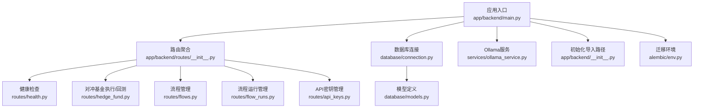
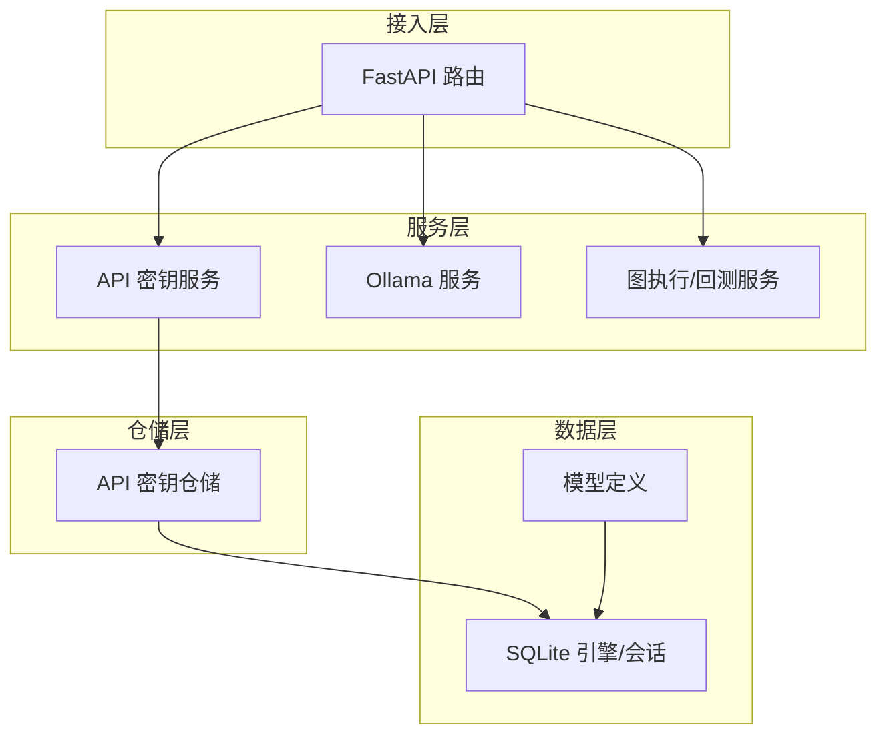
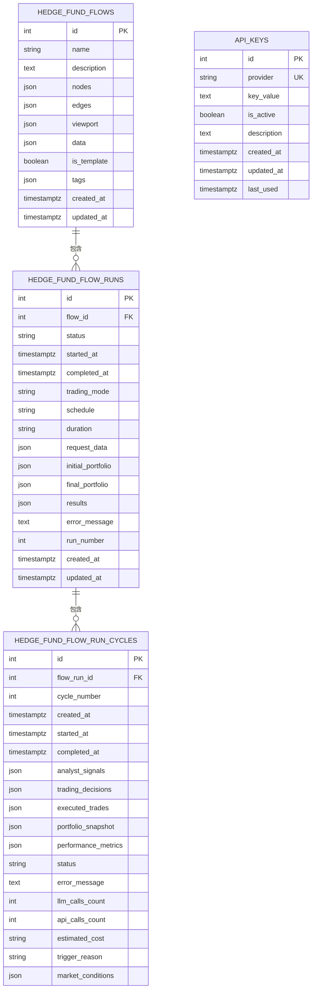
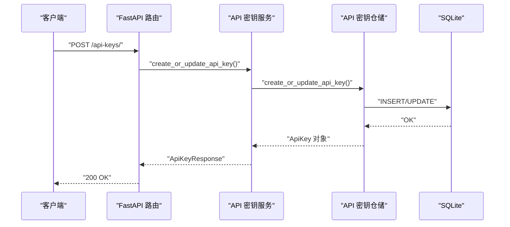
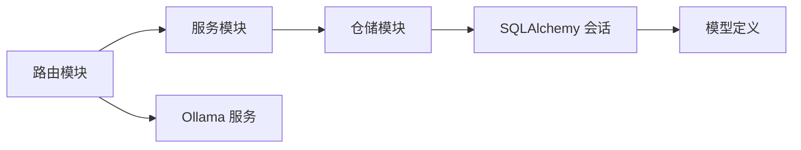

# 后端服务架构

<cite>
**本文引用的文件**
- [app/backend/main.py](file://app/backend/main.py)
- [app/backend/database/connection.py](file://app/backend/database/connection.py)
- [app/backend/database/models.py](file://app/backend/database/models.py)
- [app/backend/routes/__init__.py](file://app/backend/routes/__init__.py)
- [app/backend/routes/health.py](file://app/backend/routes/health.py)
- [app/backend/routes/hedge_fund.py](file://app/backend/routes/hedge_fund.py)
- [app/backend/routes/flows.py](file://app/backend/routes/flows.py)
- [app/backend/routes/flow_runs.py](file://app/backend/routes/flow_runs.py)
- [app/backend/routes/api_keys.py](file://app/backend/routes/api_keys.py)
- [app/backend/services/api_key_service.py](file://app/backend/services/api_key_service.py)
- [app/backend/repositories/api_key_repository.py](file://app/backend/repositories/api_key_repository.py)
- [app/backend/services/ollama_service.py](file://app/backend/services/ollama_service.py)
- [app/backend/alembic/env.py](file://app/backend/alembic/env.py)
- [app/backend/__init__.py](file://app/backend/__init__.py)
- [app/backend/models/schemas.py](file://app/backend/models/schemas.py)
</cite>

## 目录
1. [简介](#简介)
2. [项目结构](#项目结构)
3. [核心组件](#核心组件)
4. [架构总览](#架构总览)
5. [详细组件分析](#详细组件分析)
6. [依赖分析](#依赖分析)
7. [性能考量](#性能考量)
8. [故障排查指南](#故障排查指南)
9. [结论](#结论)
10. [附录](#附录)

## 简介
本项目为“AI对冲基金”后端服务，基于 FastAPI 构建，提供流式事件推送、图执行引擎驱动的投资决策与回测能力，并通过 SQLite 数据库存储流程图、运行记录与 API 密钥等元数据。系统采用分层架构：路由层（APIRouter）、服务层（业务逻辑）、仓储层（数据库访问）、模型层（Pydantic 校验）与数据库层（SQLAlchemy）。同时集成本地大模型（Ollama）能力，支持模型下载、状态检查与流式进度反馈。

## 项目结构
后端代码位于 app/backend 目录，主要模块包括：
- 应用入口与中间件：app/backend/main.py
- 数据库连接与模型：app/backend/database/connection.py、app/backend/database/models.py
- 路由组织：app/backend/routes/__init__.py 及各子路由模块
- 服务与业务：如 API 密钥服务、Ollama 服务等
- 配置与迁移：app/backend/alembic/env.py

图表来源
- [app/backend/main.py:1-56](file://app/backend/main.py#L1-L56)
- [app/backend/routes/__init__.py:1-24](file://app/backend/routes/__init__.py#L1-L24)
- [app/backend/database/connection.py:1-32](file://app/backend/database/connection.py#L1-L32)
- [app/backend/database/models.py:1-115](file://app/backend/database/models.py#L1-L115)
- [app/backend/services/ollama_service.py:1-519](file://app/backend/services/ollama_service.py#L1-L519)
- [app/backend/alembic/env.py:1-78](file://app/backend/alembic/env.py#L1-L78)
- [app/backend/__init__.py:1-9](file://app/backend/__init__.py#L1-L9)

章节来源
- [app/backend/main.py:1-56](file://app/backend/main.py#L1-L56)
- [app/backend/routes/__init__.py:1-24](file://app/backend/routes/__init__.py#L1-L24)

## 核心组件
- 应用实例与中间件
  - 使用 FastAPI 创建应用，配置 CORS 允许前端地址访问。
  - 在启动事件中检查 Ollama 安装与运行状态，并输出可用模型列表。
- 数据库层
  - 使用 SQLAlchemy 建立 SQLite 引擎与会话工厂，提供依赖注入 get_db。
  - 初始化表结构（首次运行自动创建）。
- 模型层
  - 定义 HedgeFundFlow、HedgeFundFlowRun、HedgeFundFlowRunCycle、ApiKey 四张核心表，含 JSON 字段存储图结构、运行结果与中间状态。
- 路由层
  - 通过 APIRouter 组织健康检查、对冲基金执行/回测、流程与运行管理、API 密钥管理等接口。
- 服务层
  - APIKeyService 提供从数据库加载密钥字典的能力。
  - OllamaService 提供安装检测、服务启停、模型下载/删除、进度流等能力。
- 模型校验
  - 使用 Pydantic 定义请求/响应模型，包含字段校验与默认值处理。

章节来源
- [app/backend/main.py:1-56](file://app/backend/main.py#L1-L56)
- [app/backend/database/connection.py:1-32](file://app/backend/database/connection.py#L1-L32)
- [app/backend/database/models.py:1-115](file://app/backend/database/models.py#L1-L115)
- [app/backend/models/schemas.py:1-292](file://app/backend/models/schemas.py#L1-L292)
- [app/backend/services/api_key_service.py:1-23](file://app/backend/services/api_key_service.py#L1-L23)
- [app/backend/services/ollama_service.py:1-519](file://app/backend/services/ollama_service.py#L1-L519)

## 架构总览
系统采用“路由-服务-仓储-模型-数据库”的分层设计，请求从 FastAPI 路由进入，经服务层协调业务与外部依赖（如 Ollama），通过仓储层持久化到 SQLite；响应以 JSON 或 Server-Sent Events 流式返回。

图表来源
- [app/backend/routes/hedge_fund.py:1-353](file://app/backend/routes/hedge_fund.py#L1-L353)
- [app/backend/routes/api_keys.py:1-201](file://app/backend/routes/api_keys.py#L1-L201)
- [app/backend/services/api_key_service.py:1-23](file://app/backend/services/api_key_service.py#L1-L23)
- [app/backend/repositories/api_key_repository.py:1-131](file://app/backend/repositories/api_key_repository.py#L1-L131)
- [app/backend/database/connection.py:1-32](file://app/backend/database/connection.py#L1-L32)
- [app/backend/database/models.py:1-115](file://app/backend/database/models.py#L1-L115)

## 详细组件分析

### 应用入口与中间件
- CORS 配置允许本地前端访问。
- 启动事件中检查 Ollama 状态，打印可用模型与服务器信息。
- 聚合所有子路由到主路由器。

章节来源
- [app/backend/main.py:1-56](file://app/backend/main.py#L1-L56)

### 数据库连接与模型
- 连接
  - 使用绝对路径的 SQLite 文件，设置 SQLite 特定参数。
  - 提供 get_db 依赖，确保每个请求有独立会话并在结束后关闭。
- 模型
  - HedgeFundFlow：存储 React Flow 图结构与元数据。
  - HedgeFundFlowRun：跟踪单次执行运行状态与配置。
  - HedgeFundFlowRunCycle：交易会话内的分析周期，记录信号、决策、成本与指标。
  - ApiKey：存储第三方服务密钥，支持启用/禁用与使用时间追踪。

图表来源
- [app/backend/database/models.py:6-115](file://app/backend/database/models.py#L6-L115)

章节来源
- [app/backend/database/connection.py:1-32](file://app/backend/database/connection.py#L1-L32)
- [app/backend/database/models.py:1-115](file://app/backend/database/models.py#L1-L115)

### 路由组织与控制流
- 主路由聚合
  - 将健康检查、对冲基金、流程、运行、Ollama、语言模型、API 密钥等子路由按标签组织。
- 对冲基金路由
  - /hedge-fund/run：接收 HedgeFundRequest，构建投资组合与图，启动异步执行，通过 SSE 流式返回进度与最终结果。
  - /hedge-fund/backtest：接收 BacktestRequest，调用 BacktestService 执行回测，流式返回每日结果与汇总指标。
  - /hedge-fund/agents：返回可用代理列表。
- 流程与运行路由
  - /flows：增删改查流程，支持复制与按名搜索。
  - /flows/{flow_id}/runs：针对指定流程的运行管理，支持分页、活跃/最新查询、更新/删除与计数。
- API 密钥路由
  - 支持创建/更新、批量更新、查询、按提供方查询、更新最后使用时间、停用与删除。

图表来源
- [app/backend/routes/api_keys.py:19-40](file://app/backend/routes/api_keys.py#L19-L40)
- [app/backend/services/api_key_service.py:12-18](file://app/backend/services/api_key_service.py#L12-L18)
- [app/backend/repositories/api_key_repository.py:15-46](file://app/backend/repositories/api_key_repository.py#L15-L46)

章节来源
- [app/backend/routes/__init__.py:1-24](file://app/backend/routes/__init__.py#L1-L24)
- [app/backend/routes/hedge_fund.py:1-353](file://app/backend/routes/hedge_fund.py#L1-L353)
- [app/backend/routes/flows.py:1-174](file://app/backend/routes/flows.py#L1-L174)
- [app/backend/routes/flow_runs.py:1-303](file://app/backend/routes/flow_runs.py#L1-L303)
- [app/backend/routes/api_keys.py:1-201](file://app/backend/routes/api_keys.py#L1-L201)

### 认证授权与安全
- 当前路由未实现显式的认证/授权中间件或全局依赖注入，API 密钥管理用于业务侧密钥存储与注入，不作为 HTTP 认证令牌使用。
- 建议在生产环境中引入 JWT/OAuth 中间件与权限控制，结合数据库中的角色/权限字段进行细粒度授权。

章节来源
- [app/backend/routes/api_keys.py:1-201](file://app/backend/routes/api_keys.py#L1-L201)
- [app/backend/models/schemas.py:244-292](file://app/backend/models/schemas.py#L244-L292)

### 错误处理与异常管理
- 路由层统一捕获异常并抛出 HTTPException，明确状态码与错误信息。
- 健康检查路由提供 SSE ping 接口，便于前端心跳检测。
- Ollama 服务在状态检查与模型操作中返回结构化错误信息，避免中断。

章节来源
- [app/backend/routes/health.py:1-28](file://app/backend/routes/health.py#L1-L28)
- [app/backend/routes/hedge_fund.py:157-160](file://app/backend/routes/hedge_fund.py#L157-L160)
- [app/backend/routes/api_keys.py:38-39](file://app/backend/routes/api_keys.py#L38-L39)
- [app/backend/services/ollama_service.py:34-56](file://app/backend/services/ollama_service.py#L34-L56)

### 数据库连接池管理、事务与并发
- 连接池
  - 使用 SQLAlchemy 的 sessionmaker，默认非自动提交与非自动刷新，适合单请求事务。
- 事务
  - 仓储方法内进行 commit/refresh，保证数据一致性。
- 并发
  - SQLite 默认线程安全限制需通过依赖注入在请求上下文内使用独立会话；建议在高并发场景切换为更健壮的数据库（如 PostgreSQL）并启用连接池。

章节来源
- [app/backend/database/connection.py:14-32](file://app/backend/database/connection.py#L14-L32)
- [app/backend/repositories/api_key_repository.py:22-46](file://app/backend/repositories/api_key_repository.py#L22-L46)

### API 版本管理、向后兼容与迁移
- 版本管理
  - 应用定义了版本号，但当前路由未体现版本前缀；可扩展为 /v1/flows 等路径。
- 向后兼容
  - Pydantic 模型支持可选字段与默认值，有助于平滑演进。
- 迁移
  - 使用 Alembic 管理数据库变更，env.py 配置了在线/离线迁移模式。

章节来源
- [app/backend/main.py:15](file://app/backend/main.py#L15)
- [app/backend/models/schemas.py:144-195](file://app/backend/models/schemas.py#L144-L195)
- [app/backend/alembic/env.py:1-78](file://app/backend/alembic/env.py#L1-L78)

### 缓存策略、性能监控与日志
- 缓存
  - 未发现显式缓存实现；可在服务层增加内存/Redis 缓存热点数据。
- 性能监控
  - 未发现专门的指标导出；建议集成 Prometheus/Grafana 或使用 OpenTelemetry。
- 日志
  - 应用与 Ollama 服务均使用标准日志模块，启动时打印 Ollama 状态信息。

章节来源
- [app/backend/main.py:32-56](file://app/backend/main.py#L32-L56)
- [app/backend/services/ollama_service.py:13-17](file://app/backend/services/ollama_service.py#L13-L17)

### 输入验证与防护措施
- 输入验证
  - Pydantic 模型对字段长度、数值范围、枚举类型进行严格校验。
- 防护措施
  - 建议补充速率限制、CORS 白名单、敏感字段脱敏（如 API 密钥响应仅返回摘要）与 SQL 注入防护（已使用 ORM）。

章节来源
- [app/backend/models/schemas.py:27-33](file://app/backend/models/schemas.py#L27-L33)
- [app/backend/models/schemas.py:144-152](file://app/backend/models/schemas.py#L144-L152)
- [app/backend/routes/api_keys.py:27-37](file://app/backend/routes/api_keys.py#L27-L37)

### 部署配置、环境管理与运维
- 部署
  - 使用 Dockerfile 与 docker-compose 进行容器化部署；建议分离开发与生产环境配置。
- 环境管理
  - 建议通过环境变量控制数据库路径、日志级别与外部服务地址。
- 运维
  - 建议添加健康检查端点、日志轮转、备份策略与数据库迁移自动化。

章节来源
- [app/backend/main.py:20-27](file://app/backend/main.py#L20-L27)
- [app/backend/__init__.py:4-8](file://app/backend/__init__.py#L4-L8)

## 依赖分析
- 组件耦合
  - 路由依赖服务与仓储；服务依赖仓储；仓储依赖 SQLAlchemy 会话；模型依赖 Base。
- 外部依赖
  - FastAPI、SQLAlchemy、Ollama Python 客户端、Alembic。
- 循环依赖
  - 通过延迟导入与模块拆分避免循环依赖风险。

图表来源
- [app/backend/routes/hedge_fund.py:1-353](file://app/backend/routes/hedge_fund.py#L1-L353)
- [app/backend/services/api_key_service.py:1-23](file://app/backend/services/api_key_service.py#L1-L23)
- [app/backend/repositories/api_key_repository.py:1-131](file://app/backend/repositories/api_key_repository.py#L1-L131)
- [app/backend/database/connection.py:1-32](file://app/backend/database/connection.py#L1-L32)
- [app/backend/database/models.py:1-115](file://app/backend/database/models.py#L1-L115)
- [app/backend/services/ollama_service.py:1-519](file://app/backend/services/ollama_service.py#L1-L519)

## 性能考量
- I/O 密集
  - SSE 流式响应与异步任务提升用户体验；注意取消任务与资源清理。
- 数据库
  - SQLite 适合开发测试；生产建议使用具备连接池与并发控制的数据库。
- 模型推理
  - Ollama 本地推理受硬件限制，建议缓存常用提示与结果，或引入模型压缩/量化。

## 故障排查指南
- Ollama 无法连接
  - 检查服务是否运行、URL 是否正确、模型是否已下载。
- 数据库异常
  - 确认数据库文件路径、权限与并发访问问题；必要时切换数据库类型。
- SSE 断开
  - 检查客户端断连检测逻辑与任务取消处理。

章节来源
- [app/backend/main.py:32-56](file://app/backend/main.py#L32-L56)
- [app/backend/services/ollama_service.py:207-231](file://app/backend/services/ollama_service.py#L207-L231)
- [app/backend/routes/hedge_fund.py:51-61](file://app/backend/routes/hedge_fund.py#L51-L61)

## 结论
该后端服务以清晰的分层架构实现了对冲基金流程编排、实时流式执行与回测、本地模型集成与密钥管理。建议在生产环境中增强认证授权、引入连接池与更健壮的数据库、完善缓存与监控体系，并规范化 API 版本管理与迁移策略。

## 附录
- 快速启动
  - 运行应用入口，访问健康检查端点确认服务可用。
- 开发建议
  - 为路由添加统一的异常处理器与日志中间件；为敏感接口增加鉴权装饰器；为高频查询增加索引与缓存。