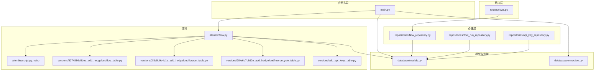
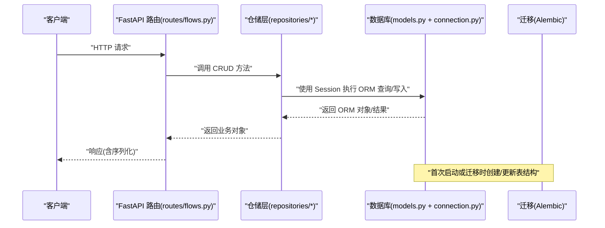
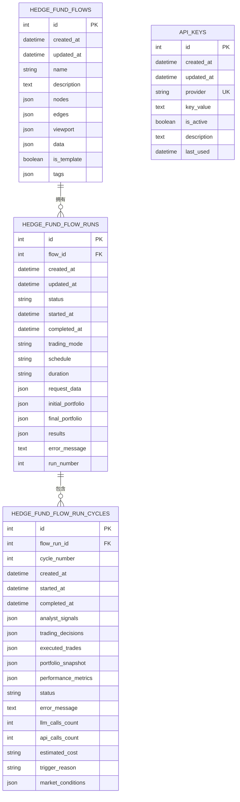
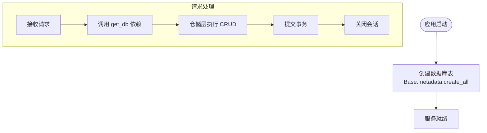
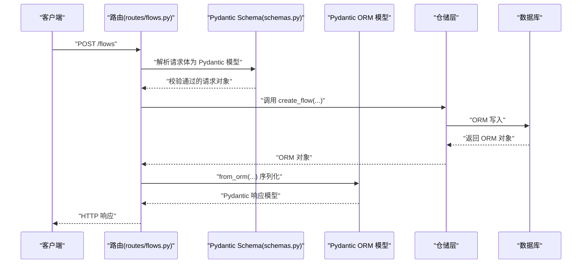
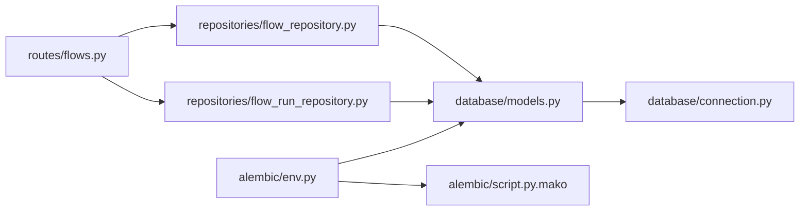

# 数据库模型设计

<cite>
**本文档引用的文件**
- [models.py](file://app/backend/database/models.py)
- [connection.py](file://app/backend/database/connection.py)
- [env.py](file://app/backend/alembic/env.py)
- [script.py.mako](file://app/backend/alembic/script.py.mako)
- [5274886e5bee_add_hedgefundflow_table.py](file://app/backend/alembic/versions/5274886e5bee_add_hedgefundflow_table.py)
- [2f8c5d9e4b1a_add_hedgefundflowrun_table.py](file://app/backend/alembic/versions/2f8c5d9e4b1a_add_hedgefundflowrun_table.py)
- [3f9a6b7c8d2e_add_hedgefundflowruncycle_table.py](file://app/backend/alembic/versions/3f9a6b7c8d2e_add_hedgefundflowruncycle_table.py)
- [add_api_keys_table.py](file://app/backend/alembic/versions/add_api_keys_table.py)
- [schemas.py](file://app/backend/models/schemas.py)
- [flow_repository.py](file://app/backend/repositories/flow_repository.py)
- [flow_run_repository.py](file://app/backend/repositories/flow_run_repository.py)
- [api_key_repository.py](file://app/backend/repositories/api_key_repository.py)
- [flows.py](file://app/backend/routes/flows.py)
- [main.py](file://app/backend/main.py)
</cite>

## 目录
1. [简介](#简介)
2. [项目结构](#项目结构)
3. [核心组件](#核心组件)
4. [架构总览](#架构总览)
5. [详细组件分析](#详细组件分析)
6. [依赖分析](#依赖分析)
7. [性能考虑](#性能考虑)
8. [故障排除指南](#故障排除指南)
9. [结论](#结论)
10. [附录](#附录)

## 简介
本文件系统性梳理了 AI 对冲基金项目中的数据库模型设计与实现，覆盖 ORM 模型定义、字段类型与关系映射、表结构与索引策略、约束定义、连接管理与会话生命周期、事务处理、模型序列化与反序列化、数据验证、查询优化与批量操作、迁移与版本管理、向后兼容性、以及数据完整性与并发控制等主题。内容以实际源码为依据，配合可视化图示帮助读者快速理解。

## 项目结构
后端采用 FastAPI + SQLAlchemy + Alembic 的典型分层架构：
- 数据库层：SQLAlchemy 声明式基类与模型定义
- 连接层：引擎、会话工厂与依赖注入
- 迁移层：Alembic 版本化迁移脚本
- 仓储层：面向模型的 CRUD 封装
- 路由层：FastAPI 接口与 Pydantic 模型序列化
- 应用入口：初始化数据库表与中间件配置

图表来源
- [main.py:1-56](file://app/backend/main.py#L1-L56)
- [routes/flows.py:1-174](file://app/backend/routes/flows.py#L1-L174)
- [repositories/flow_repository.py:1-103](file://app/backend/repositories/flow_repository.py#L1-L103)
- [repositories/flow_run_repository.py:1-133](file://app/backend/repositories/flow_run_repository.py#L1-L133)
- [repositories/api_key_repository.py:1-131](file://app/backend/repositories/api_key_repository.py#L1-L131)
- [database/models.py:1-115](file://app/backend/database/models.py#L1-L115)
- [database/connection.py:1-32](file://app/backend/database/connection.py#L1-L32)
- [alembic/env.py:1-78](file://app/backend/alembic/env.py#L1-L78)
- [alembic/script.py.mako:1-29](file://app/backend/alembic/script.py.mako#L1-L29)
- [versions/5274886e5bee_add_hedgefundflow_table.py:1-47](file://app/backend/alembic/versions/5274886e5bee_add_hedgefundflow_table.py#L1-L47)
- [versions/2f8c5d9e4b1a_add_hedgefundflowrun_table.py:1-49](file://app/backend/alembic/versions/2f8c5d9e4b1a_add_hedgefundflowrun_table.py#L1-L49)
- [versions/3f9a6b7c8d2e_add_hedgefundflowruncycle_table.py:1-102](file://app/backend/alembic/versions/3f9a6b7c8d2e_add_hedgefundflowruncycle_table.py#L1-L102)
- [versions/add_api_keys_table.py:1-44](file://app/backend/alembic/versions/add_api_keys_table.py#L1-L44)

章节来源
- [main.py:1-56](file://app/backend/main.py#L1-L56)
- [alembic/env.py:1-78](file://app/backend/alembic/env.py#L1-L78)

## 核心组件
本节聚焦数据库模型、连接与会话、迁移脚本及仓储层的职责与协作方式。

- 模型定义与字段类型
  - 使用 SQLAlchemy Column 定义各表字段，包含整型主键、字符串、文本、布尔、JSON、时间戳与外键等。
  - 时间字段使用带时区的 DateTime，并结合 server_default 与 onupdate 实现自动记录创建与更新时间。
  - JSON 字段用于存储复杂结构（如节点、边、视口、运行数据、分析信号、交易决策等）。

- 关系映射
  - FlowRun 通过 flow_id 外键关联 Flow；FlowRunCycle 通过 flow_run_id 外键关联 FlowRun。
  - 外键均建立索引以提升查询性能。

- 连接与会话
  - 使用 SQLite 文件数据库，绝对路径确保跨环境一致性。
  - 引擎创建时设置 SQLite 特定参数，会话工厂配置 autocommit/autoflush 并绑定引擎。
  - 提供 FastAPI 依赖 get_db，按请求生成会话并在 finally 中关闭，避免连接泄漏。

- 迁移与版本管理
  - Alembic 读取 models.Base.metadata 作为目标元数据，支持在线/离线迁移。
  - 版本脚本按需创建表、索引与约束，部分脚本包含条件判断以保证向后兼容。

章节来源
- [database/models.py:1-115](file://app/backend/database/models.py#L1-L115)
- [database/connection.py:1-32](file://app/backend/database/connection.py#L1-L32)
- [alembic/env.py:1-78](file://app/backend/alembic/env.py#L1-L78)
- [alembic/script.py.mako:1-29](file://app/backend/alembic/script.py.mako#L1-L29)

## 架构总览
下图展示从 FastAPI 路由到仓储层再到数据库模型与迁移的整体流程。

图表来源
- [routes/flows.py:1-174](file://app/backend/routes/flows.py#L1-L174)
- [repositories/flow_repository.py:1-103](file://app/backend/repositories/flow_repository.py#L1-L103)
- [database/models.py:1-115](file://app/backend/database/models.py#L1-L115)
- [database/connection.py:1-32](file://app/backend/database/connection.py#L1-L32)
- [alembic/env.py:1-78](file://app/backend/alembic/env.py#L1-L78)

## 详细组件分析

### 数据库模型与关系设计
- HedgeFundFlow（流程）
  - 存储 React Flow 配置（nodes、edges、viewport）与自定义数据（data），支持模板标记与标签分类。
  - 主键自增，带创建/更新时间戳。
- HedgeFundFlowRun（流程运行）
  - 记录单次执行的运行状态、开始/结束时间、交易模式（一次性/持续/顾问）、调度周期与持续时间、请求与结果数据、运行序号等。
  - 外键 flow_id 指向 Flow，建立索引。
- HedgeFundFlowRunCycle（运行周期）
  - 记录交易会话内的分析周期，包含周期编号、时间戳、分析信号、交易决策、已执行交易、组合快照、性能指标、错误信息、LLM/API 调用计数与估算成本、触发原因与市场条件等。
  - 外键 flow_run_id 指向 FlowRun，多处索引优化查询。
- ApiKey（API 密钥）
  - 存储服务提供商标识、密钥值、启用状态、描述与最近使用时间。
  - provider 唯一约束，便于按提供商检索。

图表来源
- [database/models.py:6-115](file://app/backend/database/models.py#L6-L115)

章节来源
- [database/models.py:1-115](file://app/backend/database/models.py#L1-L115)

### 表结构、索引与约束
- 主键：所有表均使用自增整型主键。
- 索引：FlowRun 与 FlowRunCycle 的 flow_id、cycle_number、status、started_at 等字段建立索引；ApiKeys 的 provider 建唯一索引。
- 约束：ApiKeys 的 provider 唯一；FlowRun 的 run_number 默认值；FlowRun 的 trading_mode/schedule/duration 初始默认值；FlowRunCycle 的 status/llm_calls_count/api_calls_count/estimated_cost 等默认值。
- 迁移脚本：版本化创建表与索引，部分脚本包含存在性检查，确保重复执行的安全性与向后兼容。

章节来源
- [versions/5274886e5bee_add_hedgefundflow_table.py:1-47](file://app/backend/alembic/versions/5274886e5bee_add_hedgefundflow_table.py#L1-L47)
- [versions/2f8c5d9e4b1a_add_hedgefundflowrun_table.py:1-49](file://app/backend/alembic/versions/2f8c5d9e4b1a_add_hedgefundflowrun_table.py#L1-L49)
- [versions/3f9a6b7c8d2e_add_hedgefundflowruncycle_table.py:1-102](file://app/backend/alembic/versions/3f9a6b7c8d2e_add_hedgefundflowruncycle_table.py#L1-L102)
- [versions/add_api_keys_table.py:1-44](file://app/backend/alembic/versions/add_api_keys_table.py#L1-L44)

### 数据库连接管理与会话生命周期
- 引擎与会话
  - 使用 SQLite 文件数据库，绝对路径避免相对路径问题。
  - 引擎创建时设置 SQLite 特定参数，会话工厂关闭自动提交与自动刷新，绑定引擎。
- 依赖注入
  - get_db 作为 FastAPI 依赖，每次请求创建新会话，try/finally 确保关闭，防止连接泄漏。
- 应用启动
  - 启动时调用 Base.metadata.create_all 统一创建所有表，幂等安全。

图表来源
- [database/connection.py:26-32](file://app/backend/database/connection.py#L26-L32)
- [main.py:17-18](file://app/backend/main.py#L17-L18)

章节来源
- [database/connection.py:1-32](file://app/backend/database/connection.py#L1-L32)
- [main.py:1-56](file://app/backend/main.py#L1-L56)

### 事务处理与并发控制
- 事务边界
  - 仓储层在单个操作中 commit，确保单次操作的原子性。
  - 批量操作建议在上层聚合多次提交，避免长事务占用资源。
- 并发与锁
  - SQLite 在写入时使用文件级锁，建议减少长时间持有会话；对于高并发场景可评估切换数据库。
  - 当前实现未显式使用行级锁或悲观/乐观锁策略。

章节来源
- [repositories/flow_repository.py:12-28](file://app/backend/repositories/flow_repository.py#L12-L28)
- [repositories/flow_run_repository.py:15-29](file://app/backend/repositories/flow_run_repository.py#L15-L29)
- [repositories/api_key_repository.py:15-46](file://app/backend/repositories/api_key_repository.py#L15-L46)

### 模型序列化、反序列化与数据验证
- 反序列化（请求）
  - FastAPI 路由参数使用 Pydantic 模型（如 FlowCreateRequest、FlowUpdateRequest、FlowRunUpdateRequest 等）进行输入校验与解析。
- 序列化（响应）
  - 仓储返回 ORM 对象，路由层通过 Pydantic 模型（如 FlowResponse、FlowRunResponse、ApiKeyResponse 等）进行序列化输出。
- 数据验证
  - Pydantic 字段校验器（如 PortfolioPosition 的价格必须为正）与枚举（FlowRunStatus）保障数据有效性。
- ORM 与 Pydantic 的桥接
  - 模型配置 from_attributes=True，允许 ORM 对象直接转为 Pydantic 模型，简化序列化。

图表来源
- [routes/flows.py:26-42](file://app/backend/routes/flows.py#L26-L42)
- [models/schemas.py:144-194](file://app/backend/models/schemas.py#L144-L194)
- [models/schemas.py:198-241](file://app/backend/models/schemas.py#L198-L241)
- [models/schemas.py:244-292](file://app/backend/models/schemas.py#L244-L292)

章节来源
- [routes/flows.py:1-174](file://app/backend/routes/flows.py#L1-L174)
- [models/schemas.py:1-292](file://app/backend/models/schemas.py#L1-L292)

### 查询优化策略与批量操作
- 索引策略
  - FlowRun 与 FlowRunCycle 的外键与常用过滤字段建立索引，有助于按 flow_id、状态、时间范围等查询。
- 查询模式
  - 仓储层提供按 ID、名称模糊匹配、最新记录、活跃运行等常用查询方法，均基于 SQLAlchemy 查询构建。
- 批量操作
  - ApiKey 支持批量创建/更新（bulk_create_or_update），可减少多次往返。
  - 建议在上层聚合多次写入，统一 commit，降低事务开销。

章节来源
- [repositories/flow_repository.py:30-45](file://app/backend/repositories/flow_repository.py#L30-L45)
- [repositories/flow_run_repository.py:35-64](file://app/backend/repositories/flow_run_repository.py#L35-L64)
- [repositories/api_key_repository.py:120-131](file://app/backend/repositories/api_key_repository.py#L120-L131)

### 数据迁移、版本管理与向后兼容
- 元数据与目标
  - Alembic 通过 env.py 读取 models.Base.metadata 作为目标元数据，确保迁移覆盖所有模型。
- 迁移模式
  - 支持在线/离线两种迁移模式，连接器从配置读取参数。
- 版本脚本
  - 各版本脚本按需创建表、索引与约束；部分脚本包含存在性检查，避免重复执行导致错误。
- 向后兼容
  - 通过条件判断与默认值设置，允许在不破坏现有数据的前提下扩展字段。

章节来源
- [alembic/env.py:17-20](file://app/backend/alembic/env.py#L17-L20)
- [alembic/env.py:52-77](file://app/backend/alembic/env.py#L52-L77)
- [versions/5274886e5bee_add_hedgefundflow_table.py:21-38](file://app/backend/alembic/versions/5274886e5bee_add_hedgefundflow_table.py#L21-L38)
- [versions/3f9a6b7c8d2e_add_hedgefundflowruncycle_table.py:18-68](file://app/backend/alembic/versions/3f9a6b7c8d2e_add_hedgefundflowruncycle_table.py#L18-L68)

### 数据完整性与一致性
- 外键约束
  - FlowRun 与 FlowRunCycle 的外键确保删除 Flow 时需要先清理其运行记录，保持引用完整性。
- 默认值与非空
  - 关键字段设置默认值与非空约束，减少空值带来的逻辑分支。
- 事务与幂等
  - 单次操作在仓储层内提交，避免部分写入；应用启动时幂等创建表，确保部署一致性。

章节来源
- [database/models.py:34](file://app/backend/database/models.py#L34)
- [database/models.py:64](file://app/backend/database/models.py#L64)
- [main.py:17-18](file://app/backend/main.py#L17-L18)

## 依赖分析
- 路由依赖仓储层，仓储层依赖 SQLAlchemy 会话与模型。
- 模型依赖连接层提供的 Base 与引擎。
- 迁移依赖 Alembic 读取模型元数据并生成 SQL。

图表来源
- [routes/flows.py:1-174](file://app/backend/routes/flows.py#L1-L174)
- [repositories/flow_repository.py:1-103](file://app/backend/repositories/flow_repository.py#L1-L103)
- [repositories/flow_run_repository.py:1-133](file://app/backend/repositories/flow_run_repository.py#L1-L133)
- [database/models.py:1-115](file://app/backend/database/models.py#L1-L115)
- [database/connection.py:1-32](file://app/backend/database/connection.py#L1-L32)
- [alembic/env.py:1-78](file://app/backend/alembic/env.py#L1-L78)
- [alembic/script.py.mako:1-29](file://app/backend/alembic/script.py.mako#L1-L29)

章节来源
- [routes/flows.py:1-174](file://app/backend/routes/flows.py#L1-L174)
- [repositories/flow_repository.py:1-103](file://app/backend/repositories/flow_repository.py#L1-L103)
- [repositories/flow_run_repository.py:1-133](file://app/backend/repositories/flow_run_repository.py#L1-L133)
- [database/models.py:1-115](file://app/backend/database/models.py#L1-L115)
- [database/connection.py:1-32](file://app/backend/database/connection.py#L1-L32)
- [alembic/env.py:1-78](file://app/backend/alembic/env.py#L1-L78)
- [alembic/script.py.mako:1-29](file://app/backend/alembic/script.py.mako#L1-L29)

## 性能考虑
- 索引优化
  - 已在外键与常用过滤字段建立索引，建议根据实际查询模式增加复合索引（如按 flow_id+status 或 started_at+status）。
- 查询限制
  - 分页查询（limit/offset）与按时间倒序排序，避免全表扫描。
- 批量写入
  - 使用 bulk 操作减少往返次数；在仓储层聚合多次写入。
- 数据类型选择
  - JSON 字段便于灵活存储，但不利于索引与统计分析；建议仅在必要时使用，复杂统计可通过外部归档或物化视图实现。
- 数据库切换
  - SQLite 适合开发与小规模数据；生产建议使用支持并发与高级特性的数据库（如 PostgreSQL），并启用连接池与读写分离。

## 故障排除指南
- 连接问题
  - 确认 DATABASE_URL 指向正确绝对路径；SQLite 需要 check_same_thread 参数设置。
  - 使用 get_db 依赖确保每个请求独立会话，避免跨请求共享会话。
- 迁移失败
  - 检查 Alembic 配置是否正确读取 models.Base.metadata；确认版本脚本的条件判断与索引命名一致。
- 数据校验错误
  - Pydantic 校验器会抛出异常，检查请求体字段类型与范围（如价格必须为正）。
- 事务未提交
  - 确保仓储层在写入后调用 commit；批量操作时注意异常回滚与重试策略。

章节来源
- [database/connection.py:15-32](file://app/backend/database/connection.py#L15-L32)
- [alembic/env.py:59-71](file://app/backend/alembic/env.py#L59-L71)
- [models/schemas.py:27-32](file://app/backend/models/schemas.py#L27-L32)
- [repositories/flow_repository.py:25-27](file://app/backend/repositories/flow_repository.py#L25-L27)

## 结论
该数据库模型设计围绕“流程-运行-周期-密钥”的核心业务域展开，采用 SQLite + SQLAlchemy + Alembic 的轻量方案，具备良好的可维护性与可扩展性。通过合理的索引、约束与默认值，保障了数据完整性；通过 Pydantic 与 ORM 的桥接，实现了清晰的序列化与验证。建议在生产环境中引入连接池、读写分离与更完善的并发控制策略，并对高频查询场景增加复合索引与物化视图以进一步提升性能。

## 附录
- 快速参考
  - 模型文件：[models.py](file://app/backend/database/models.py)
  - 连接与会话：[connection.py](file://app/backend/database/connection.py)
  - 迁移入口：[env.py](file://app/backend/alembic/env.py)
  - 版本脚本：[script.py.mako](file://app/backend/alembic/script.py.mako)
  - 流程路由：[flows.py](file://app/backend/routes/flows.py)
  - 应用入口：[main.py](file://app/backend/main.py)