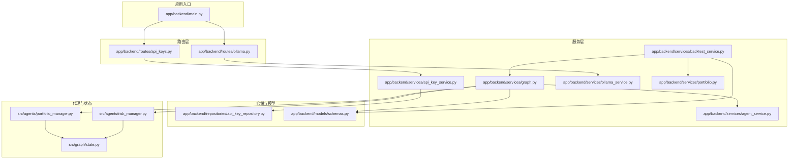
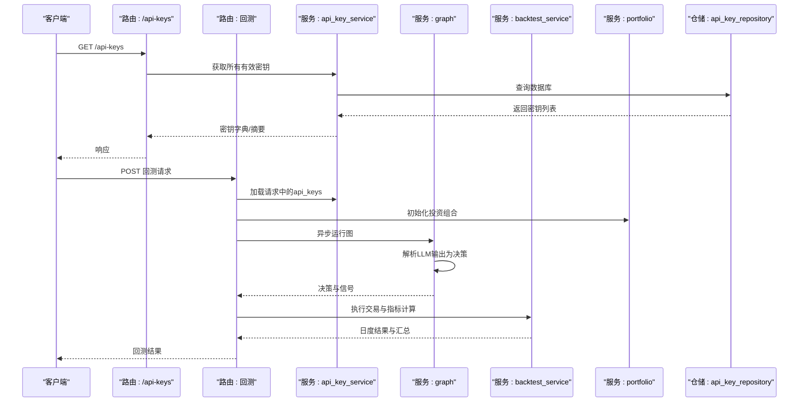
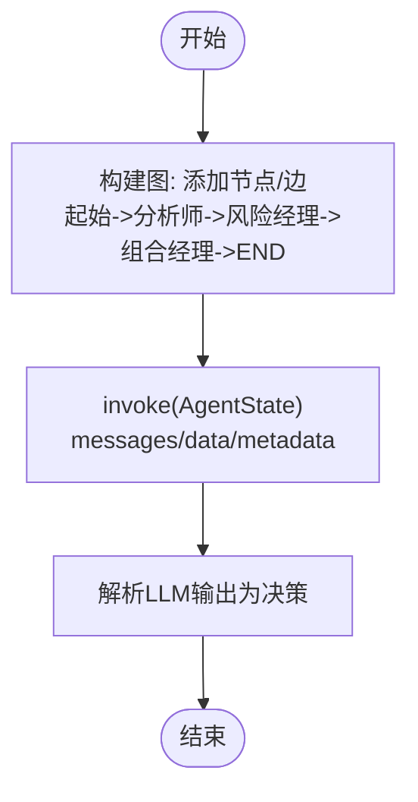
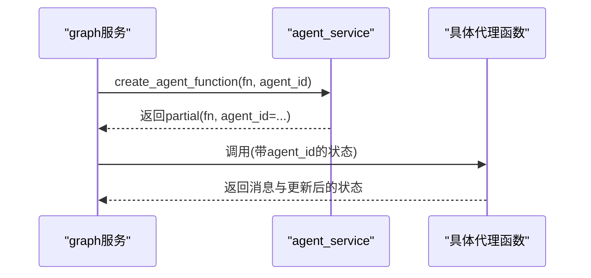
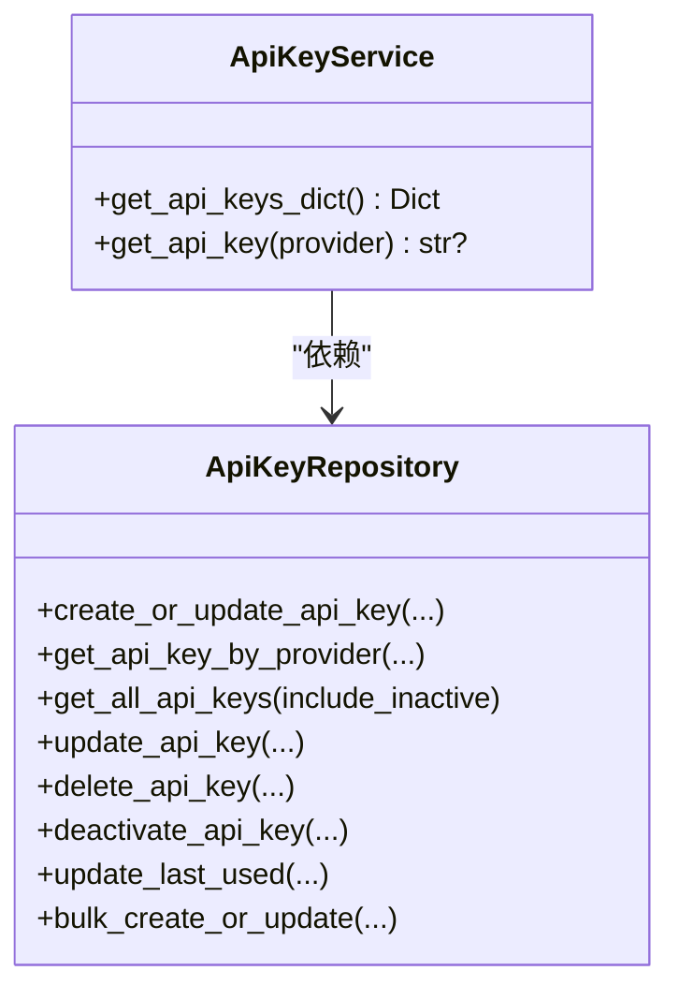
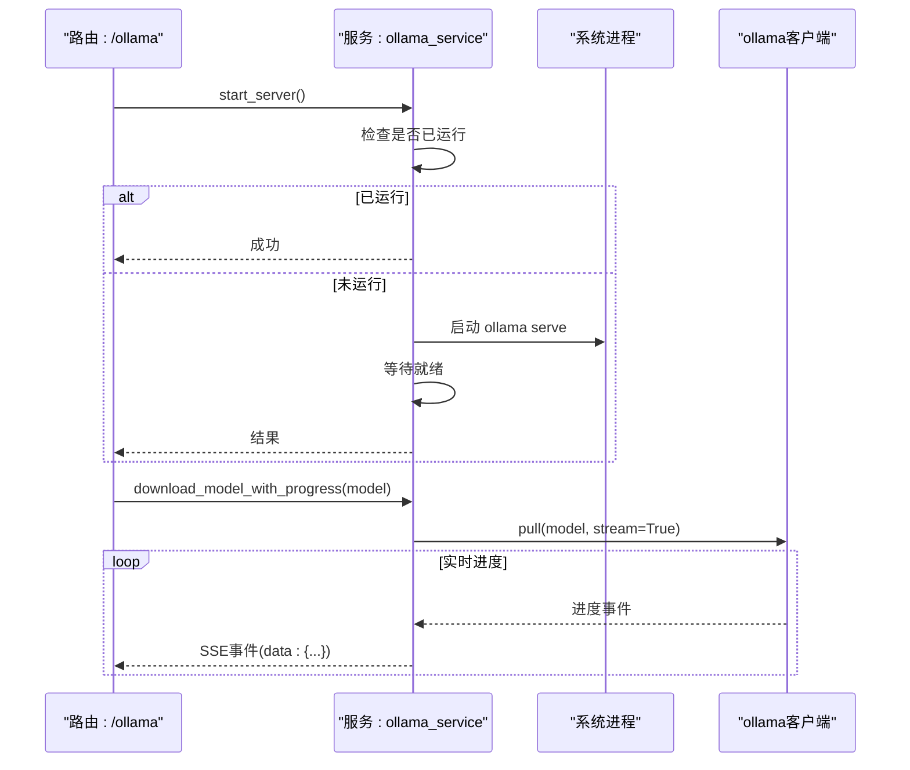
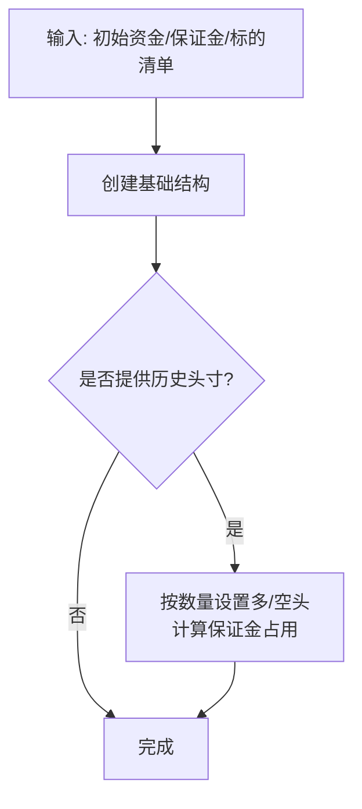
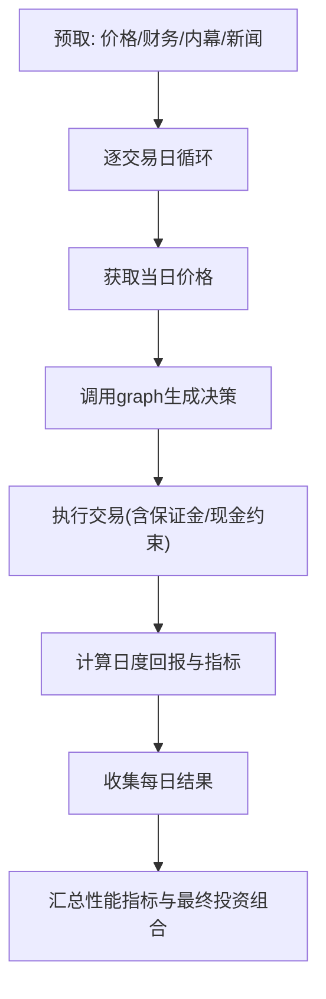
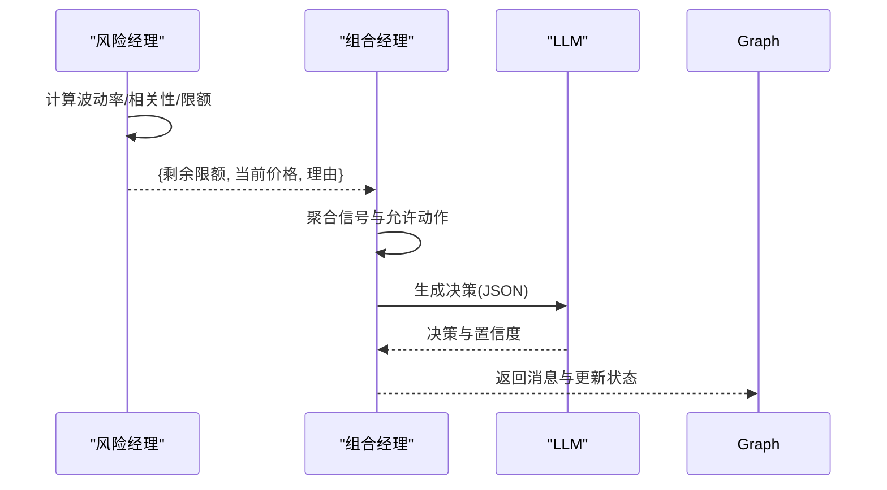
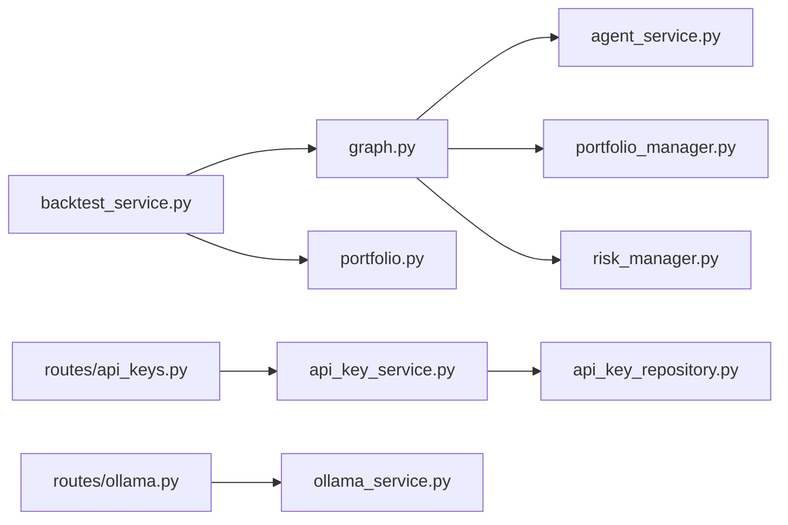

# 服务层集成

<cite>
**本文引用的文件**
- [app/backend/services/graph.py](file://app/backend/services/graph.py)
- [app/backend/services/agent_service.py](file://app/backend/services/agent_service.py)
- [app/backend/services/api_key_service.py](file://app/backend/services/api_key_service.py)
- [app/backend/services/ollama_service.py](file://app/backend/services/ollama_service.py)
- [app/backend/services/portfolio.py](file://app/backend/services/portfolio.py)
- [app/backend/services/backtest_service.py](file://app/backend/services/backtest_service.py)
- [app/backend/repositories/api_key_repository.py](file://app/backend/repositories/api_key_repository.py)
- [app/backend/routes/api_keys.py](file://app/backend/routes/api_keys.py)
- [app/backend/routes/ollama.py](file://app/backend/routes/ollama.py)
- [app/backend/models/schemas.py](file://app/backend/models/schemas.py)
- [app/backend/main.py](file://app/backend/main.py)
- [src/graph/state.py](file://src/graph/state.py)
- [src/agents/portfolio_manager.py](file://src/agents/portfolio_manager.py)
- [src/agents/risk_manager.py](file://src/agents/risk_manager.py)
</cite>

## 目录
1. [引言](#引言)
2. [项目结构](#项目结构)
3. [核心组件](#核心组件)
4. [架构总览](#架构总览)
5. [详细组件分析](#详细组件分析)
6. [依赖分析](#依赖分析)
7. [性能考虑](#性能考虑)
8. [故障排除指南](#故障排除指南)
9. [结论](#结论)
10. [附录](#附录)

## 引言
本文件系统性梳理后端服务层的集成与协作，覆盖以下主题：
- graph服务：图编排、异步执行、流式响应解析与状态管理
- api_key_service：密钥加载、安全存储与访问控制
- ollama_service：本地模型集成、状态检查与性能优化
- portfolio_service：投资组合初始化、风险控制与收益计算
- backtest_service：回测引擎集成、数据预取与结果输出
- agent_service：代理函数包装、任务调度与状态同步
- 服务依赖注入、生命周期管理与错误恢复机制

## 项目结构
后端采用分层架构：FastAPI应用入口负责路由注册与启动事件；路由层对接服务层；服务层调用工具与模型层；模型层定义LangGraph状态与代理逻辑。

图表来源
- [app/backend/main.py:1-56](file://app/backend/main.py#L1-L56)
- [app/backend/routes/api_keys.py:1-201](file://app/backend/routes/api_keys.py#L1-L201)
- [app/backend/routes/ollama.py:1-319](file://app/backend/routes/ollama.py#L1-L319)
- [app/backend/services/graph.py:1-193](file://app/backend/services/graph.py#L1-L193)
- [app/backend/services/agent_service.py:1-13](file://app/backend/services/agent_service.py#L1-L13)
- [app/backend/services/api_key_service.py:1-23](file://app/backend/services/api_key_service.py#L1-L23)
- [app/backend/services/ollama_service.py:1-519](file://app/backend/services/ollama_service.py#L1-L519)
- [app/backend/services/portfolio.py:1-52](file://app/backend/services/portfolio.py#L1-L52)
- [app/backend/services/backtest_service.py:1-539](file://app/backend/services/backtest_service.py#L1-L539)
- [app/backend/repositories/api_key_repository.py:1-131](file://app/backend/repositories/api_key_repository.py#L1-L131)
- [app/backend/models/schemas.py:1-292](file://app/backend/models/schemas.py#L1-L292)
- [src/graph/state.py:1-52](file://src/graph/state.py#L1-L52)
- [src/agents/portfolio_manager.py:1-263](file://src/agents/portfolio_manager.py#L1-L263)
- [src/agents/risk_manager.py:1-318](file://src/agents/risk_manager.py#L1-L318)

章节来源
- [app/backend/main.py:1-56](file://app/backend/main.py#L1-L56)
- [app/backend/routes/api_keys.py:1-201](file://app/backend/routes/api_keys.py#L1-L201)
- [app/backend/routes/ollama.py:1-319](file://app/backend/routes/ollama.py#L1-L319)

## 核心组件
- graph服务：基于LangGraph构建工作流，动态生成节点与边，封装异步执行与状态传递，支持解析LLM输出为交易决策。
- agent_service：将具体代理函数包装为LangGraph可调用的函数，注入唯一agent_id。
- api_key_service：从数据库加载有效密钥，提供字典与单值查询接口，供上游服务注入到请求中。
- ollama_service：封装Ollama安装检测、服务启停、模型下载/删除、进度流与可用模型列表，提供统一状态视图。
- portfolio_service：根据初始资金、保证金要求与标的清单初始化投资组合结构，并填充已有头寸。
- backtest_service：回测引擎，预取多源数据，按交易日循环，调用graph生成决策并执行交易，计算收益与风险指标。
- 模型与状态：LangGraph AgentState定义消息、数据与元数据合并策略；代理通过状态传递价格、信号与限制。

章节来源
- [app/backend/services/graph.py:1-193](file://app/backend/services/graph.py#L1-L193)
- [app/backend/services/agent_service.py:1-13](file://app/backend/services/agent_service.py#L1-L13)
- [app/backend/services/api_key_service.py:1-23](file://app/backend/services/api_key_service.py#L1-L23)
- [app/backend/services/ollama_service.py:1-519](file://app/backend/services/ollama_service.py#L1-L519)
- [app/backend/services/portfolio.py:1-52](file://app/backend/services/portfolio.py#L1-L52)
- [app/backend/services/backtest_service.py:1-539](file://app/backend/services/backtest_service.py#L1-L539)
- [src/graph/state.py:1-52](file://src/graph/state.py#L1-L52)

## 架构总览
服务层通过路由暴露REST接口，路由层调用服务层，服务层再调用代理与工具层，形成闭环的数据与控制流。

图表来源
- [app/backend/routes/api_keys.py:1-201](file://app/backend/routes/api_keys.py#L1-L201)
- [app/backend/routes/ollama.py:1-319](file://app/backend/routes/ollama.py#L1-L319)
- [app/backend/services/api_key_service.py:1-23](file://app/backend/services/api_key_service.py#L1-L23)
- [app/backend/services/backtest_service.py:1-539](file://app/backend/services/backtest_service.py#L1-L539)
- [app/backend/services/graph.py:1-193](file://app/backend/services/graph.py#L1-L193)
- [app/backend/services/portfolio.py:1-52](file://app/backend/services/portfolio.py#L1-L52)
- [app/backend/repositories/api_key_repository.py:1-131](file://app/backend/repositories/api_key_repository.py#L1-L131)

## 详细组件分析

### graph服务：图编排、异步执行与状态管理
- 图构建
  - 从React Flow结构读取节点与边，提取分析师与组合经理节点，动态添加风险控制节点与其一对一映射。
  - 起始节点连接至无入边的分析师节点；分析师直连组合经理的路径改道经由对应风险经理；风险经理再连接到组合经理；组合经理最终指向结束节点。
- 异步执行
  - 提供run_graph_async包装器，使用线程池避免阻塞事件循环；内部调用run_graph传入AgentState消息、数据与元数据。
- 状态管理
  - AgentState包含messages（消息序列）、data（字典合并）与metadata（字典合并），用于传递价格、信号、模型参数等。
- 输出解析
  - parse_hedge_fund_response将字符串响应解析为JSON，捕获类型与解码异常并返回None，便于上层容错。

图表来源
- [app/backend/services/graph.py:36-129](file://app/backend/services/graph.py#L36-L129)
- [app/backend/services/graph.py:141-177](file://app/backend/services/graph.py#L141-L177)
- [src/graph/state.py:15-18](file://src/graph/state.py#L15-L18)

章节来源
- [app/backend/services/graph.py:1-193](file://app/backend/services/graph.py#L1-L193)
- [src/graph/state.py:1-52](file://src/graph/state.py#L1-L52)

### agent_service：代理函数包装与调度
- 将具体代理函数与唯一agent_id绑定，返回LangGraph可调用的函数，确保每个节点实例拥有独立上下文。

图表来源
- [app/backend/services/agent_service.py:5-13](file://app/backend/services/agent_service.py#L5-L13)
- [app/backend/services/graph.py:64-66](file://app/backend/services/graph.py#L64-L66)

章节来源
- [app/backend/services/agent_service.py:1-13](file://app/backend/services/agent_service.py#L1-L13)

### api_key_service：密钥管理、安全存储与访问控制
- 数据访问
  - 通过ApiKeyRepository加载有效密钥或按提供商查询单个密钥，支持批量更新与最后使用时间更新。
- 服务接口
  - get_api_keys_dict：返回provider->key的字典，便于注入到下游请求。
  - get_api_key：按提供商返回密钥值或None。
- 安全与访问控制
  - 路由层在响应中不返回原始密钥值，仅返回摘要信息，避免泄露。

图表来源
- [app/backend/services/api_key_service.py:6-23](file://app/backend/services/api_key_service.py#L6-L23)
- [app/backend/repositories/api_key_repository.py:9-131](file://app/backend/repositories/api_key_repository.py#L9-L131)

章节来源
- [app/backend/services/api_key_service.py:1-23](file://app/backend/services/api_key_service.py#L1-L23)
- [app/backend/repositories/api_key_repository.py:1-131](file://app/backend/repositories/api_key_repository.py#L1-L131)
- [app/backend/routes/api_keys.py:1-201](file://app/backend/routes/api_keys.py#L1-L201)

### ollama_service：本地模型集成、状态检查与性能优化
- 状态检查
  - 检查安装、服务器运行、可用模型与URL，统一返回状态字典。
- 服务启停
  - 启动/停止Ollama进程，跨平台处理（Unix/Windows），等待就绪或验证停止。
- 模型管理
  - 下载/删除模型，支持进度流（Server-Sent Events），缓存进度并在完成后清理。
  - 推荐模型与可用模型过滤（仅返回已下载且在推荐列表中的模型）。
- 性能优化
  - 使用异步客户端与线程池执行耗时操作，避免阻塞事件循环。
  - 进度流以事件流形式推送，前端可实时更新UI。

图表来源
- [app/backend/routes/ollama.py:57-195](file://app/backend/routes/ollama.py#L57-L195)
- [app/backend/services/ollama_service.py:34-151](file://app/backend/services/ollama_service.py#L34-L151)
- [app/backend/services/ollama_service.py:232-275](file://app/backend/services/ollama_service.py#L232-L275)
- [app/backend/services/ollama_service.py:405-441](file://app/backend/services/ollama_service.py#L405-L441)

章节来源
- [app/backend/services/ollama_service.py:1-519](file://app/backend/services/ollama_service.py#L1-L519)
- [app/backend/routes/ollama.py:1-319](file://app/backend/routes/ollama.py#L1-L319)

### portfolio_service：投资组合初始化与风险控制
- 初始化
  - 依据标的清单创建基础结构，包括现金、保证金要求、头寸与已实现损益。
- 头寸填充
  - 若提供历史头寸，按正负数量分别设置多头与空头，并计算短期保证金占用。
- 风险控制
  - 组合经理在决策前依赖风险经理提供的剩余头寸限额与当前价格，结合波动率与相关性进行调整。

图表来源
- [app/backend/services/portfolio.py:6-52](file://app/backend/services/portfolio.py#L6-L52)
- [src/agents/risk_manager.py:105-202](file://src/agents/risk_manager.py#L105-L202)

章节来源
- [app/backend/services/portfolio.py:1-52](file://app/backend/services/portfolio.py#L1-L52)
- [src/agents/risk_manager.py:1-318](file://src/agents/risk_manager.py#L1-L318)

### backtest_service：回测引擎、数据处理与结果输出
- 数据预取
  - 在回测开始前拉取价格、财务指标、内幕交易与新闻数据，减少运行时IO。
- 交易执行
  - 支持买入/卖出（多头平仓）、做空与平仓，考虑现金与保证金约束，计算加权成本与已实现损益。
- 指标计算
  - 计算日度回报、夏普/索提诺比率、最大回撤及日期、总敞口与多空比。
- 结果组织
  - 每日返回详细结果（决策、成交、价格、敞口、指标），最终汇总性能指标与最终投资组合。

图表来源
- [app/backend/services/backtest_service.py:225-512](file://app/backend/services/backtest_service.py#L225-L512)

章节来源
- [app/backend/services/backtest_service.py:1-539](file://app/backend/services/backtest_service.py#L1-L539)

### 代理协调：组合经理与风险经理
- 风险经理
  - 计算波动率与相关性，确定基于波动率与相关性的头寸限额，结合当前头寸与可用现金给出剩余限额。
- 组合经理
  - 聚合各分析师信号与允许动作，调用LLM生成最终决策，确保只发送有可行动作的标的给LLM，减少token消耗。

图表来源
- [src/agents/risk_manager.py:11-219](file://src/agents/risk_manager.py#L11-L219)
- [src/agents/portfolio_manager.py:25-93](file://src/agents/portfolio_manager.py#L25-L93)
- [src/agents/portfolio_manager.py:177-262](file://src/agents/portfolio_manager.py#L177-L262)

章节来源
- [src/agents/risk_manager.py:1-318](file://src/agents/risk_manager.py#L1-L318)
- [src/agents/portfolio_manager.py:1-263](file://src/agents/portfolio_manager.py#L1-L263)

## 依赖分析
- 组件耦合
  - graph依赖agent_service与代理实现（组合经理、风险经理），并通过AgentState传递状态。
  - backtest_service依赖graph与portfolio，调用parse_hedge_fund_response解析LLM输出。
  - api_key_service依赖ApiKeyRepository，路由层提供安全的密钥访问接口。
  - ollama_service被路由层直接调用，提供状态与模型管理能力。
- 外部依赖
  - LangGraph用于图编排；ollama Python SDK用于模型交互；FastAPI用于路由与SSE。
- 循环依赖
  - 未发现直接循环依赖；graph与代理通过函数调用解耦。

图表来源
- [app/backend/services/graph.py:1-193](file://app/backend/services/graph.py#L1-L193)
- [app/backend/services/agent_service.py:1-13](file://app/backend/services/agent_service.py#L1-L13)
- [app/backend/services/backtest_service.py:1-539](file://app/backend/services/backtest_service.py#L1-L539)
- [app/backend/services/api_key_service.py:1-23](file://app/backend/services/api_key_service.py#L1-L23)
- [app/backend/services/ollama_service.py:1-519](file://app/backend/services/ollama_service.py#L1-L519)
- [app/backend/routes/api_keys.py:1-201](file://app/backend/routes/api_keys.py#L1-L201)
- [app/backend/routes/ollama.py:1-319](file://app/backend/routes/ollama.py#L1-L319)

章节来源
- [app/backend/services/graph.py:1-193](file://app/backend/services/graph.py#L1-L193)
- [app/backend/services/backtest_service.py:1-539](file://app/backend/services/backtest_service.py#L1-L539)
- [app/backend/services/api_key_service.py:1-23](file://app/backend/services/api_key_service.py#L1-L23)
- [app/backend/services/ollama_service.py:1-519](file://app/backend/services/ollama_service.py#L1-L519)
- [app/backend/routes/api_keys.py:1-201](file://app/backend/routes/api_keys.py#L1-L201)
- [app/backend/routes/ollama.py:1-319](file://app/backend/routes/ollama.py#L1-L319)

## 性能考虑
- 异步与并发
  - graph运行通过线程池执行同步逻辑，避免阻塞事件循环；backtest按交易日异步推进，允许其他协程运行。
- I/O优化
  - 回测阶段集中预取数据，减少重复API调用；Ollama下载使用SSE流，前端可渐进展示进度。
- 计算优化
  - 组合经理仅向LLM发送存在可行动作的标的，降低prompt复杂度与token消耗。
- 内存与状态
  - AgentState采用字典合并策略，避免深层嵌套；backtest按日记录结果，避免一次性持有全部中间态。

## 故障排除指南
- Ollama状态检查失败
  - 现象：启动事件日志提示未安装或无法连接。
  - 处理：通过路由/status确认状态；若未运行，使用/start启动；若未安装，按提示安装后重试。
- 模型下载中断或卡住
  - 现象：下载进度停滞或超时。
  - 处理：查看活跃下载列表；必要时取消后重新发起；确保服务器运行后再下载。
- 回测无数据或报错
  - 现象：价格为空导致跳过当日；或解析LLM输出失败。
  - 处理：检查api_keys注入；确认graph输出格式；查看parse_hedge_fund_response错误日志。
- 密钥无效或泄露风险
  - 现象：路由返回404或500。
  - 处理：使用/api-keys接口创建/更新密钥；响应体不包含原始密钥值，仅摘要信息。

章节来源
- [app/backend/main.py:32-55](file://app/backend/main.py#L32-L55)
- [app/backend/routes/ollama.py:48-195](file://app/backend/routes/ollama.py#L48-L195)
- [app/backend/services/backtest_service.py:366-390](file://app/backend/services/backtest_service.py#L366-L390)
- [app/backend/routes/api_keys.py:27-199](file://app/backend/routes/api_keys.py#L27-L199)

## 结论
该服务层通过清晰的分层与职责划分，实现了从密钥管理、本地模型集成到图编排与回测的完整闭环。graph与agent_service解耦了代理逻辑与执行框架；backtest_service将数据、交易与指标一体化；ollama_service提供了稳健的本地模型生命周期管理。配合路由层的安全策略与状态管理，整体具备良好的扩展性与可维护性。

## 附录
- 关键流程图与类图已在前述章节中可视化展示，读者可据此快速定位实现细节与依赖关系。
- 如需进一步了解前端如何消费后端服务，请参考前端上下文与hooks，但本文件聚焦后端服务层集成。