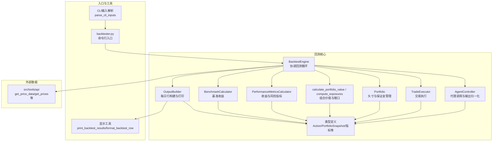
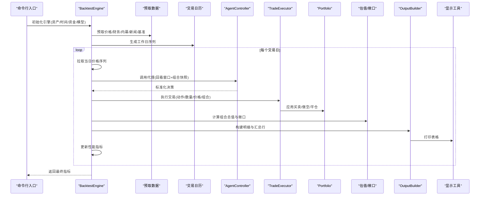
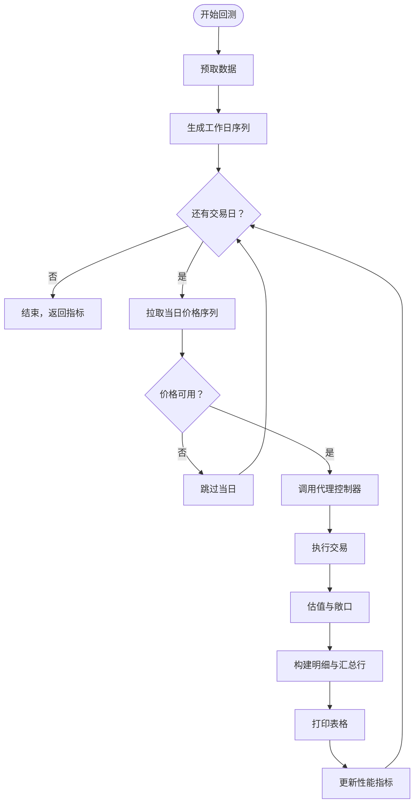
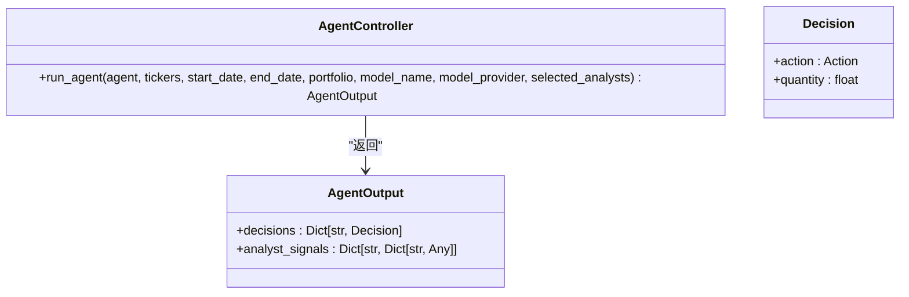
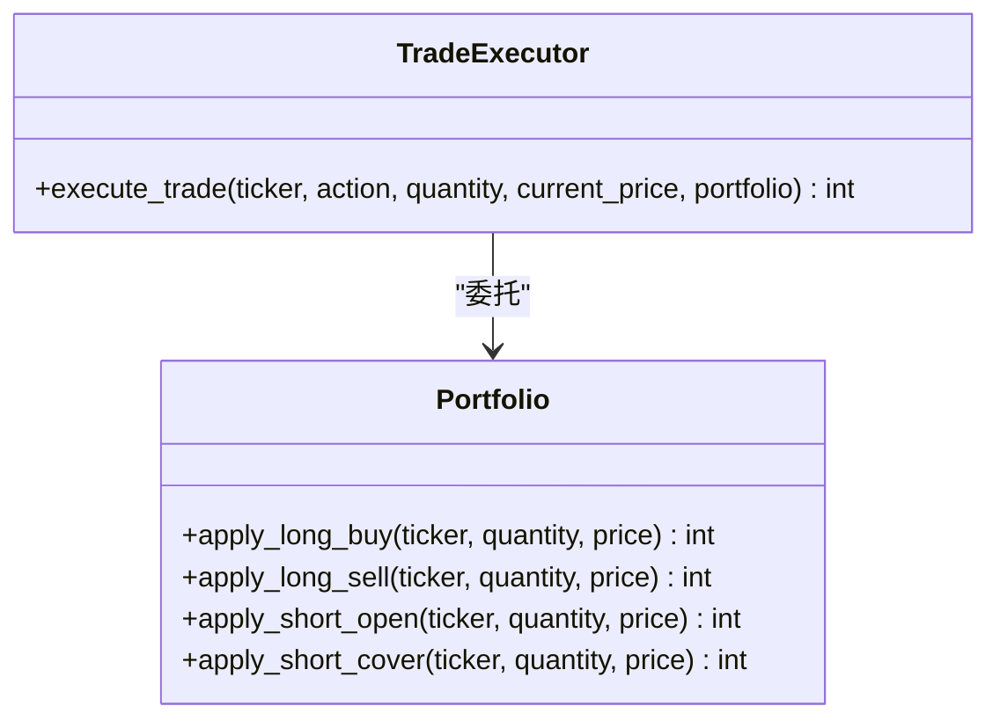
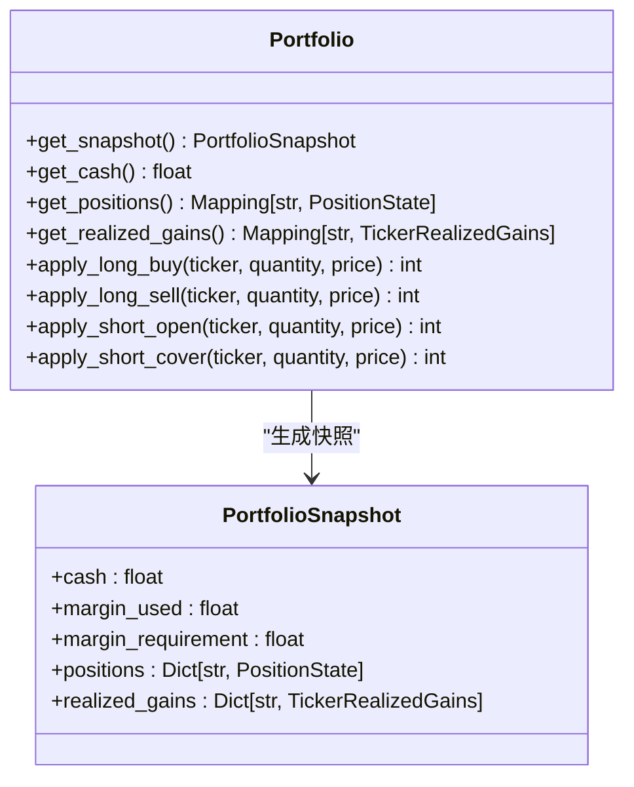
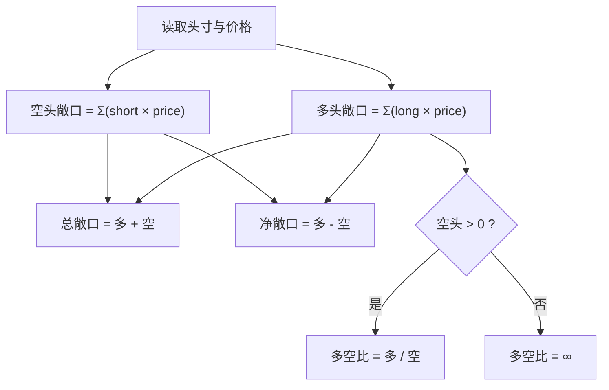
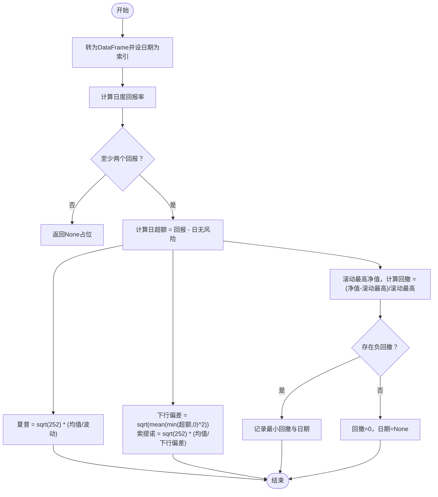
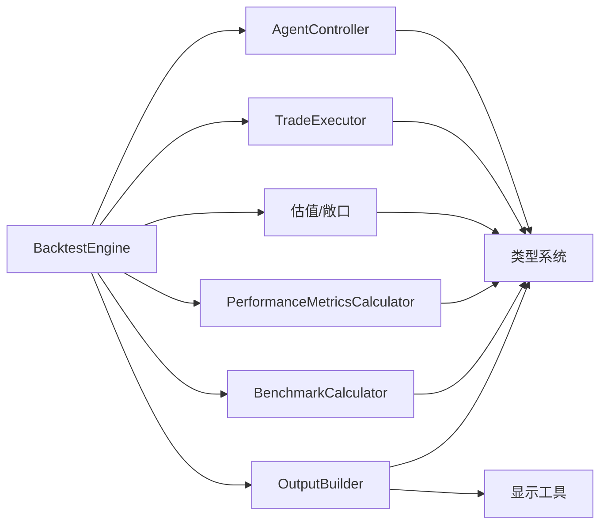

# 回测引擎

<cite>
**本文引用的文件**
- [src/backtesting/engine.py](file://src/backtesting/engine.py)
- [src/backtesting/controller.py](file://src/backtesting/controller.py)
- [src/backtesting/trader.py](file://src/backtesting/trader.py)
- [src/backtesting/portfolio.py](file://src/backtesting/portfolio.py)
- [src/backtesting/valuation.py](file://src/backtesting/valuation.py)
- [src/backtesting/metrics.py](file://src/backtesting/metrics.py)
- [src/backtesting/benchmarks.py](file://src/backtesting/benchmarks.py)
- [src/backtesting/output.py](file://src/backtesting/output.py)
- [src/backtesting/types.py](file://src/backtesting/types.py)
- [src/backtester.py](file://src/backtester.py)
- [src/cli/input.py](file://src/cli/input.py)
- [src/utils/display.py](file://src/utils/display.py)
- [tests/backtesting/test_controller.py](file://tests/backtesting/test_controller.py)
- [tests/backtesting/test_execution.py](file://tests/backtesting/test_execution.py)
- [tests/backtesting/test_metrics.py](file://tests/backtesting/test_metrics.py)
</cite>

## 目录
1. [简介](#简介)
2. [项目结构](#项目结构)
3. [核心组件](#核心组件)
4. [架构总览](#架构总览)
5. [详细组件分析](#详细组件分析)
6. [依赖分析](#依赖分析)
7. [性能考量](#性能考量)
8. [故障排查指南](#故障排查指南)
9. [结论](#结论)
10. [附录](#附录)

## 简介
本文件系统化阐述回测引擎的设计与实现，覆盖历史数据验证与策略测试流程、回测控制器工作流、交易执行模拟、性能指标计算（夏普比率、索提诺比率、最大回撤）、基准比较分析、数据加载与预处理、回测执行全流程、结果可视化与输出格式、报告生成、参数配置与时间范围设置、资产选择指南、过拟合检测与样本外测试思路、统计显著性检验建议，以及最佳实践与性能优化建议。目标是帮助读者在不深入源码的情况下也能理解并正确使用该回测系统。

## 项目结构
回测相关代码主要位于 src/backtesting 目录，围绕“引擎-控制器-交易执行-组合管理-估值-指标-基准-输出”形成清晰分层；CLI 输入解析与显示工具分别位于 src/cli 与 src/utils；测试用例位于 tests/backtesting。

图表来源
- [src/backtesting/engine.py:27-195](file://src/backtesting/engine.py#L27-L195)
- [src/backtesting/controller.py:9-68](file://src/backtesting/controller.py#L9-L68)
- [src/backtesting/trader.py:7-40](file://src/backtesting/trader.py#L7-L40)
- [src/backtesting/portfolio.py:9-196](file://src/backtesting/portfolio.py#L9-L196)
- [src/backtesting/valuation.py:8-83](file://src/backtesting/valuation.py#L8-L83)
- [src/backtesting/metrics.py:8-78](file://src/backtesting/metrics.py#L8-L78)
- [src/backtesting/benchmarks.py:8-33](file://src/backtesting/benchmarks.py#L8-L33)
- [src/backtesting/output.py:11-99](file://src/backtesting/output.py#L11-L99)
- [src/backtesting/types.py:10-106](file://src/backtesting/types.py#L10-L106)
- [src/backtester.py:13-67](file://src/backtester.py#L13-L67)
- [src/cli/input.py:227-289](file://src/cli/input.py#L227-L289)
- [src/utils/display.py:257-396](file://src/utils/display.py#L257-L396)

章节来源
- [src/backtesting/engine.py:27-195](file://src/backtesting/engine.py#L27-L195)
- [src/backtesting/controller.py:9-68](file://src/backtesting/controller.py#L9-L68)
- [src/backtesting/trader.py:7-40](file://src/backtesting/trader.py#L7-L40)
- [src/backtesting/portfolio.py:9-196](file://src/backtesting/portfolio.py#L9-L196)
- [src/backtesting/valuation.py:8-83](file://src/backtesting/valuation.py#L8-L83)
- [src/backtesting/metrics.py:8-78](file://src/backtesting/metrics.py#L8-L78)
- [src/backtesting/benchmarks.py:8-33](file://src/backtesting/benchmarks.py#L8-L33)
- [src/backtesting/output.py:11-99](file://src/backtesting/output.py#L11-L99)
- [src/backtesting/types.py:10-106](file://src/backtesting/types.py#L10-L106)
- [src/backtester.py:13-67](file://src/backtester.py#L13-L67)
- [src/cli/input.py:227-289](file://src/cli/input.py#L227-L289)
- [src/utils/display.py:257-396](file://src/utils/display.py#L257-L396)

## 核心组件
- 回测引擎：负责预取数据、遍历交易日、拉取价格、调用代理、执行交易、估值与敞口计算、累积净值曲线、更新性能指标，并输出每日表格行。
- 代理控制器：封装代理调用，标准化输出（动作与数量），确保缺失键有默认值，兼容历史字典结构。
- 交易执行器：根据动作（买入/卖出/做空/平仓/持有）与数量，委托组合对象完成实际交易，返回已成交数量。
- 组合管理：维护现金、多空头寸、成本均价、已实现损益、保证金占用与要求，支持保证金约束下的做空。
- 估值与敞口：计算组合总值与多头/空头/总敞口、净敞口、多空比。
- 性能指标：计算日度超额收益、年化夏普/索提诺比率、最大回撤及发生日期。
- 基准比较：计算标普500（SPY）基准的简单持有回报率，用于对比展示。
- 输出构建：按日生成明细行与汇总行，交由显示工具打印为表格。
- 类型系统：统一动作枚举、组合快照、指标字典、每日净值点等类型定义，保证接口稳定。

章节来源
- [src/backtesting/engine.py:27-195](file://src/backtesting/engine.py#L27-L195)
- [src/backtesting/controller.py:9-68](file://src/backtesting/controller.py#L9-L68)
- [src/backtesting/trader.py:7-40](file://src/backtesting/trader.py#L7-L40)
- [src/backtesting/portfolio.py:9-196](file://src/backtesting/portfolio.py#L9-L196)
- [src/backtesting/valuation.py:8-83](file://src/backtesting/valuation.py#L8-L83)
- [src/backtesting/metrics.py:8-78](file://src/backtesting/metrics.py#L8-L78)
- [src/backtesting/benchmarks.py:8-33](file://src/backtesting/benchmarks.py#L8-L33)
- [src/backtesting/output.py:11-99](file://src/backtesting/output.py#L11-L99)
- [src/backtesting/types.py:10-106](file://src/backtesting/types.py#L10-L106)

## 架构总览
回测引擎以“日线推进”的方式运行，每天：
- 预取所需数据（价格、财务指标、内幕交易、新闻、基准价格）
- 拉取前一日到当日的价格序列，构造当前时刻的报价映射
- 调用代理控制器，传入回看窗口与组合快照，得到标准化决策
- 逐标的执行交易，记录已成交数量
- 计算组合总值与各类敞口
- 构建当日明细与汇总行，打印表格
- 基于累计净值曲线更新性能指标（夏普、索提诺、最大回撤）

图表来源
- [src/backtesting/engine.py:96-195](file://src/backtesting/engine.py#L96-L195)
- [src/backtesting/controller.py:12-65](file://src/backtesting/controller.py#L12-L65)
- [src/backtesting/trader.py:10-37](file://src/backtesting/trader.py#L10-L37)
- [src/backtesting/valuation.py:8-51](file://src/backtesting/valuation.py#L8-L51)
- [src/backtesting/output.py:20-99](file://src/backtesting/output.py#L20-L99)
- [src/utils/display.py:257-396](file://src/utils/display.py#L257-L396)

## 详细组件分析

### 回测引擎（BacktestEngine）
- 职责：编排回测主循环，协调各子模块，维护净值曲线与指标。
- 关键流程：
  - 预取数据：为所有标的与基准提前拉取所需历史数据，避免回测中阻塞。
  - 日程推进：基于工作日生成日期序列，逐日执行。
  - 价格获取：按前一日与当日区间拉取价格，构造报价映射；若缺数则跳过当日。
  - 代理调用：传递回看窗口（上月起始）与组合快照，获得标准化决策。
  - 交易执行：逐标执行，记录已成交数量。
  - 估值与敞口：计算总值与多/空/总/净敞口、多空比。
  - 输出与打印：构建每日明细与汇总行，打印最新汇总与表格。
  - 指标更新：基于累计净值曲线计算夏普、索提诺、最大回撤。
- 时间窗口：使用相对月份差构造回看窗口，避免与当前日重叠。
- 容错：缺数或异常时跳过当日，保证连续性。

图表来源
- [src/backtesting/engine.py:96-195](file://src/backtesting/engine.py#L96-L195)

章节来源
- [src/backtesting/engine.py:27-195](file://src/backtesting/engine.py#L27-L195)

### 代理控制器（AgentController）
- 职责：调用外部代理函数，标准化输出，确保决策字典覆盖全部标的，默认动作与数量安全。
- 归一化策略：
  - 决策字典缺失键时默认“持有/0”。
  - 动作字符串强制转换为合法枚举，非法则置为“持有”。
  - 数量尝试转浮点，失败置0。
  - 分析师信号原样保留，不做改动。
- 兼容性：将组合对象转为快照字典，满足历史期望。

图表来源
- [src/backtesting/controller.py:9-68](file://src/backtesting/controller.py#L9-L68)
- [src/backtesting/types.py:69-72](file://src/backtesting/types.py#L69-L72)

章节来源
- [src/backtesting/controller.py:9-68](file://src/backtesting/controller.py#L9-L68)
- [src/backtesting/types.py:10-72](file://src/backtesting/types.py#L10-L72)

### 交易执行器（TradeExecutor）
- 职责：根据动作枚举与数量，委托组合对象执行交易，返回已成交数量。
- 支持动作：买入、卖出、做空、平仓、持有。
- 容错：数量非正或未知动作返回0。

图表来源
- [src/backtesting/trader.py:7-40](file://src/backtesting/trader.py#L7-L40)
- [src/backtesting/portfolio.py:82-195](file://src/backtesting/portfolio.py#L82-L195)

章节来源
- [src/backtesting/trader.py:7-40](file://src/backtesting/trader.py#L7-L40)
- [src/backtesting/portfolio.py:9-196](file://src/backtesting/portfolio.py#L9-L196)

### 组合管理（Portfolio）
- 状态：现金、多空头寸、成本均价、已实现损益、保证金占用与要求。
- 支持功能：
  - 多头买入/卖出
  - 空头开仓/平仓（含保证金占用与释放）
  - 成本均价动态更新
  - 已实现损益累加
- 保证金约束：做空需占用保证金，平仓按比例释放。

图表来源
- [src/backtesting/portfolio.py:9-196](file://src/backtesting/portfolio.py#L9-L196)
- [src/backtesting/types.py:38-50](file://src/backtesting/types.py#L38-L50)

章节来源
- [src/backtesting/portfolio.py:9-196](file://src/backtesting/portfolio.py#L9-L196)
- [src/backtesting/types.py:21-50](file://src/backtesting/types.py#L21-L50)

### 估值与敞口（calculate_portfolio_value / compute_exposures）
- 组合总值 = 现金 + 多头市值 - 空头市值
- 敞口计算：
  - 多头/空头敞口 = 各标的头寸×价格之和
  - 总敞口 = 多头+空头
  - 净敞口 = 多头-空头
  - 多空比 = 多头/空头（空头趋近0时为无穷大）

图表来源
- [src/backtesting/valuation.py:24-51](file://src/backtesting/valuation.py#L24-L51)

章节来源
- [src/backtesting/valuation.py:8-83](file://src/backtesting/valuation.py#L8-L83)

### 性能指标（PerformanceMetricsCalculator）
- 计算逻辑：
  - 日度回报率 = pct_change
  - 年化无风险利率换算为日超额
  - 夏普 = 年化√(日均超额 / 日超额波动)
  - 索提诺 = 年化√(日均超额 / 下行偏差)
  - 最大回撤 = (净值 - 累计最高) / 累计最高，记录最小值与日期
- 边界条件：数据不足或波动为0时的处理。

图表来源
- [src/backtesting/metrics.py:22-78](file://src/backtesting/metrics.py#L22-L78)

章节来源
- [src/backtesting/metrics.py:8-78](file://src/backtesting/metrics.py#L8-L78)

### 基准比较（BenchmarkCalculator）
- 计算标普500（SPY）从起始到结束日的简单持有回报百分比。
- 缺失首尾价格或异常时返回空。

章节来源
- [src/backtesting/benchmarks.py:8-33](file://src/backtesting/benchmarks.py#L8-L33)

### 输出与可视化（OutputBuilder + 显示工具）
- OutputBuilder：
  - 为每个标的生成明细行，汇总行包含总值、回报率、现金、持仓总值、夏普、索提诺、最大回撤、基准回报。
  - 使用纯函数 compute_portfolio_summary 计算汇总字段。
- 显示工具：
  - print_backtest_results 清屏后先打印最新汇总，再打印明细表格。
  - format_backtest_row 格式化颜色与对齐，支持摘要行与明细行。

章节来源
- [src/backtesting/output.py:11-99](file://src/backtesting/output.py#L11-L99)
- [src/utils/display.py:257-396](file://src/utils/display.py#L257-L396)

### 类型系统（types）
- 动作枚举与字面量、组合快照、代理输出、每日净值点、性能指标字典等，确保接口稳定与可测试。

章节来源
- [src/backtesting/types.py:10-106](file://src/backtesting/types.py#L10-L106)

## 依赖分析
- 引擎依赖：控制器、执行器、指标计算器、估值函数、基准计算器、输出构建器、外部数据API。
- 控制器依赖：类型系统中的动作与输出结构。
- 执行器依赖：组合状态与动作枚举。
- 估值依赖：组合状态与价格映射。
- 指标依赖：净值序列与常量（交易日历、无风险利率）。
- 输出依赖：显示工具与估值汇总函数。
- CLI与入口：命令行解析与回测入口脚本。

图表来源
- [src/backtesting/engine.py:9-195](file://src/backtesting/engine.py#L9-L195)
- [src/backtesting/controller.py:3-68](file://src/backtesting/controller.py#L3-L68)
- [src/backtesting/trader.py:3-40](file://src/backtesting/trader.py#L3-L40)
- [src/backtesting/valuation.py:3-83](file://src/backtesting/valuation.py#L3-L83)
- [src/backtesting/metrics.py:3-78](file://src/backtesting/metrics.py#L3-L78)
- [src/backtesting/benchmarks.py:3-33](file://src/backtesting/benchmarks.py#L3-L33)
- [src/backtesting/output.py:3-99](file://src/backtesting/output.py#L3-L99)
- [src/backtesting/types.py:3-106](file://src/backtesting/types.py#L3-L106)
- [src/utils/display.py:257-396](file://src/utils/display.py#L257-L396)

章节来源
- [src/backtesting/engine.py:9-195](file://src/backtesting/engine.py#L9-L195)
- [src/backtesting/controller.py:3-68](file://src/backtesting/controller.py#L3-L68)
- [src/backtesting/trader.py:3-40](file://src/backtesting/trader.py#L3-L40)
- [src/backtesting/valuation.py:3-83](file://src/backtesting/valuation.py#L3-L83)
- [src/backtesting/metrics.py:3-78](file://src/backtesting/metrics.py#L3-L78)
- [src/backtesting/benchmarks.py:3-33](file://src/backtesting/benchmarks.py#L3-L33)
- [src/backtesting/output.py:3-99](file://src/backtesting/output.py#L3-L99)
- [src/backtesting/types.py:3-106](file://src/backtesting/types.py#L3-L106)
- [src/utils/display.py:257-396](file://src/utils/display.py#L257-L396)

## 性能考量
- 数据预取：在回测开始前批量拉取所需历史数据，减少回测过程中的网络等待。
- 日度循环：使用工作日序列推进，避免节假日与非交易时段的无效迭代。
- 缺失数据处理：当日价格为空或异常时跳过，避免阻断整个回测。
- 指标更新时机：在累计足够长度后再计算指标，避免早期不稳定估计。
- 显示频率：每日报表打印，便于观察但可能带来I/O开销；可考虑批量输出或异步刷新。
- 计算复杂度：指标计算为线性复杂度，受交易日数量影响；敞口与估值为线性于标的数。

## 故障排查指南
- 代理输出异常：
  - 症状：动作或数量类型不符导致异常。
  - 排查：检查代理是否返回标准结构；控制器会进行归一化与默认填充。
- 交易未成交：
  - 症状：执行器返回0。
  - 排查：确认数量是否为正、动作是否合法；检查组合现金与保证金是否充足。
- 指标为空：
  - 症状：夏普/索提诺/最大回撤为None。
  - 排查：确认净值序列长度是否足够、是否存在波动；检查无风险利率与交易日设置。
- 基准回报异常：
  - 症状：基准回报为None。
  - 排查：确认SPY价格数据是否可用、起止日期是否有效。
- 显示异常：
  - 症状：表格列宽或颜色异常。
  - 排查：确认终端支持颜色与表格库；检查输出构建的字段顺序与类型。

章节来源
- [src/backtesting/controller.py:40-65](file://src/backtesting/controller.py#L40-L65)
- [src/backtesting/trader.py:18-37](file://src/backtesting/trader.py#L18-L37)
- [src/backtesting/metrics.py:22-78](file://src/backtesting/metrics.py#L22-L78)
- [src/backtesting/benchmarks.py:9-31](file://src/backtesting/benchmarks.py#L9-L31)
- [src/backtesting/output.py:20-99](file://src/backtesting/output.py#L20-L99)
- [src/utils/display.py:257-396](file://src/utils/display.py#L257-L396)

## 结论
该回测引擎通过清晰的分层设计实现了从数据准备、代理调用、交易执行、估值与敞口、指标计算到结果可视化的完整闭环。其特性包括：
- 可扩展的代理接口与标准化输出
- 完整的多/空头交易与保证金管理
- 稳健的日度推进与缺数跳过机制
- 全面的基准比较与风险指标
- 友好的终端可视化输出

建议在实际应用中结合测试用例与边界条件持续完善，同时关注数据质量与计算效率。

## 附录

### 数据加载与预处理
- 预取范围：以结束日倒推一年，覆盖回看窗口与历史行情。
- 预取内容：标的日线价格、财务指标、内幕交易、公司新闻；基准（SPY）日线价格。
- 预处理要点：确保日期格式、缺失值处理、异常捕获。

章节来源
- [src/backtesting/engine.py:81-94](file://src/backtesting/engine.py#L81-L94)

### 回测执行流程
- 初始化：解析CLI参数、创建引擎实例。
- 运行：逐日推进，调用代理、执行交易、估值、输出与指标更新。
- 结束：返回最终指标，支持中断时输出部分结果摘要。

章节来源
- [src/backtester.py:13-67](file://src/backtester.py#L13-L67)
- [src/cli/input.py:227-289](file://src/cli/input.py#L227-L289)

### 参数配置与时间范围
- 资产选择：通过CLI传入逗号分隔的股票代码列表。
- 时间范围：支持显式起止日期或默认按月回溯。
- 初始资金与保证金：可配置初始资本与做空保证金比例。
- 模型与分析师：可选择本地或云端模型，指定使用的分析师集合。

章节来源
- [src/cli/input.py:227-289](file://src/cli/input.py#L227-L289)
- [src/backtester.py:43-67](file://src/backtester.py#L43-L67)

### 性能指标详解
- 夏普比率：衡量单位总风险的超额收益，波动为0时按约定处理。
- 索提诺比率：仅考虑下行波动的风险调整收益。
- 最大回撤：绝对最大回撤百分比与发生日期，用于评估最大损失风险。

章节来源
- [src/backtesting/metrics.py:22-78](file://src/backtesting/metrics.py#L22-L78)

### 基准比较分析
- 采用标普500（SPY）作为基准，计算持有回报率并与策略对比，辅助评估相对表现。

章节来源
- [src/backtesting/benchmarks.py:9-31](file://src/backtesting/benchmarks.py#L9-L31)

### 结果可视化与输出格式
- 表格列：日期、标的、动作、数量、价格、多头股数、空头股数、持仓价值。
- 汇总行：现金余额、总持仓价值、总资产、回报率、夏普、索提诺、最大回撤、基准回报。
- 颜色与对齐：正负回报与基准回报使用颜色区分，表格居中对齐。

章节来源
- [src/utils/display.py:257-396](file://src/utils/display.py#L257-L396)
- [src/backtesting/output.py:20-99](file://src/backtesting/output.py#L20-L99)

### 报告生成
- 每日输出：最新汇总与明细表格。
- 中断处理：用户中断时输出部分结果摘要（初始/最终净值与总回报）。

章节来源
- [src/backtester.py:13-40](file://src/backtester.py#L13-L40)

### 过拟合检测、样本外测试与统计显著性
- 过拟合检测建议：
  - 划分训练集与样本外区间，分别计算指标并对比稳定性。
  - 使用滚动窗口进行多期回测，观察指标随时间变化。
- 样本外测试：
  - 将策略在最后若干个月的数据上单独验证，观察收益与风险指标是否显著下降。
- 统计显著性检验：
  - 对多策略或不同参数组合的收益差异进行假设检验（如t检验或置换检验）。
  - 关注样本量、偏度与峰度对指标分布的影响。

（本节为通用指导，不直接分析具体文件）

### 测试用例参考
- 代理控制器测试：验证决策归一化与分析师信号透传。
- 交易执行测试：验证动作路由与边界条件。
- 指标测试：验证数据不足、零波动等边界场景。

章节来源
- [tests/backtesting/test_controller.py:13-36](file://tests/backtesting/test_controller.py#L13-L36)
- [tests/backtesting/test_execution.py:4-28](file://tests/backtesting/test_execution.py#L4-L28)
- [tests/backtesting/test_metrics.py:24-53](file://tests/backtesting/test_metrics.py#L24-L53)