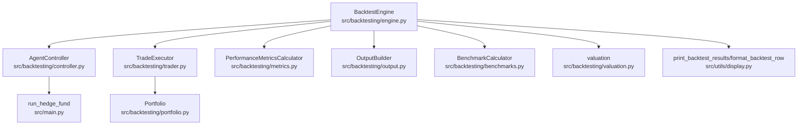
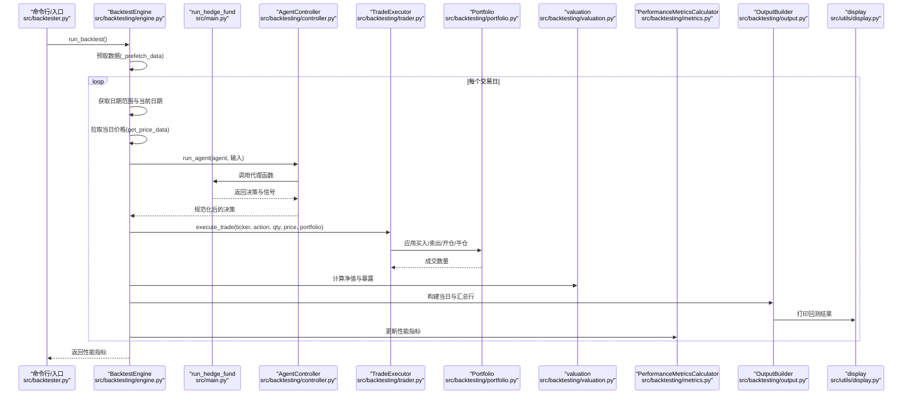
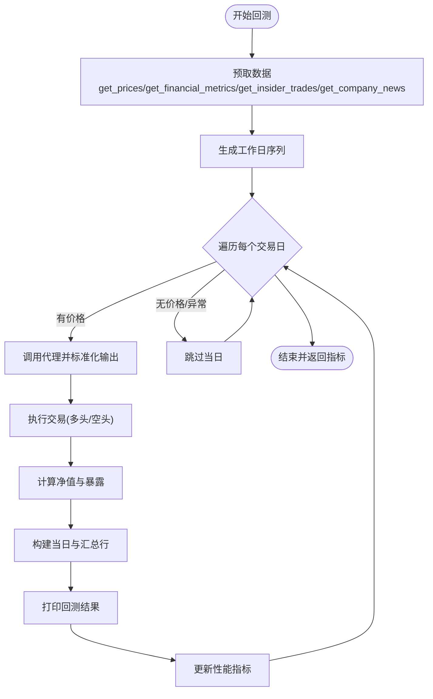
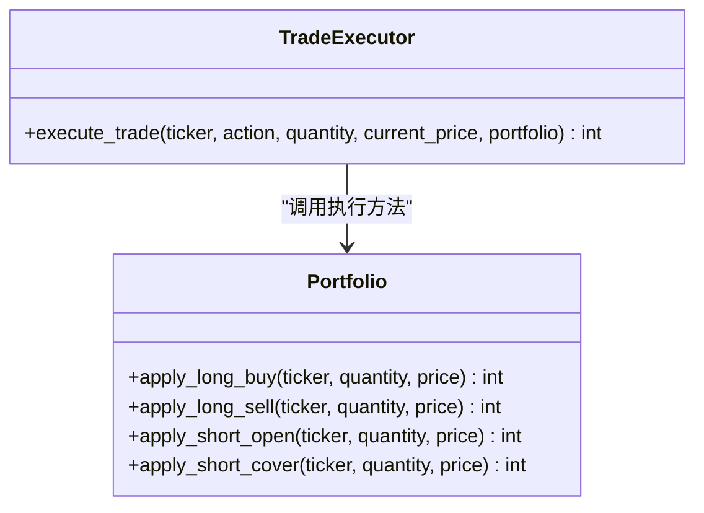
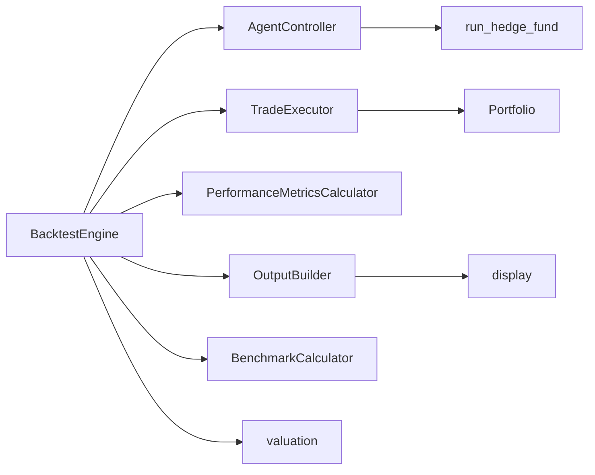

# 回测执行引擎

<cite>
**本文引用的文件**
- [src/backtesting/engine.py](file://src/backtesting/engine.py)
- [src/backtesting/controller.py](file://src/backtesting/controller.py)
- [src/backtesting/trader.py](file://src/backtesting/trader.py)
- [src/backtesting/portfolio.py](file://src/backtesting/portfolio.py)
- [src/backtesting/types.py](file://src/backtesting/types.py)
- [src/backtesting/metrics.py](file://src/backtesting/metrics.py)
- [src/backtesting/output.py](file://src/backtesting/output.py)
- [src/backtesting/benchmarks.py](file://src/backtesting/benchmarks.py)
- [src/backtesting/valuation.py](file://src/backtesting/valuation.py)
- [src/backtester.py](file://src/backtester.py)
- [src/main.py](file://src/main.py)
- [src/utils/display.py](file://src/utils/display.py)
- [tests/backtesting/test_execution.py](file://tests/backtesting/test_execution.py)
- [tests/backtesting/test_portfolio.py](file://tests/backtesting/test_portfolio.py)
</cite>

## 目录
1. [简介](#简介)
2. [项目结构](#项目结构)
3. [核心组件](#核心组件)
4. [架构总览](#架构总览)
5. [详细组件分析](#详细组件分析)
6. [依赖分析](#依赖分析)
7. [性能考虑](#性能考虑)
8. [故障排除指南](#故障排除指南)
9. [结论](#结论)
10. [附录](#附录)

## 简介
本文件系统性地文档化回测执行引擎的设计与实现，重点围绕 BacktestEngine 的架构与执行流程展开，解释其如何在回测环境中模拟真实交易：订单执行、价格发现与滑点处理（当前实现为严格成交）、时间序列处理与数据对齐、事件驱动的每日推进机制。同时，文档深入剖析交易执行器 TradeExecutor 的实现细节（市价单、限价单、止损单等），并给出性能优化、内存管理与并发处理建议，以及配置项、参数调优与故障排除指南。

## 项目结构
回测子系统位于 src/backtesting 目录，采用“控制器-执行器-组合器”的分层设计，配合独立的指标计算、输出构建与基准比较模块，形成清晰的职责边界。主入口通过 src/backtester.py 调用 BacktestEngine 并进行中断处理；决策来源由 src/main.py 中的 run_hedge_fund 提供，该函数构建一个 LangGraph 工作流，聚合多个分析师节点与风险管理、投资组合管理节点，最终输出标准化的决策字典。

图表来源
- [src/backtesting/engine.py:1-195](file://src/backtesting/engine.py#L1-L195)
- [src/backtesting/controller.py:1-68](file://src/backtesting/controller.py#L1-L68)
- [src/backtesting/trader.py:1-40](file://src/backtesting/trader.py#L1-L40)
- [src/backtesting/portfolio.py:1-196](file://src/backtesting/portfolio.py#L1-L196)
- [src/backtesting/metrics.py:1-78](file://src/backtesting/metrics.py#L1-L78)
- [src/backtesting/output.py:1-99](file://src/backtesting/output.py#L1-L99)
- [src/backtesting/benchmarks.py:1-33](file://src/backtesting/benchmarks.py#L1-L33)
- [src/backtesting/valuation.py:1-83](file://src/backtesting/valuation.py#L1-L83)
- [src/backtester.py:1-67](file://src/backtester.py#L1-L67)
- [src/main.py:1-180](file://src/main.py#L1-L180)
- [src/utils/display.py:1-396](file://src/utils/display.py#L1-L396)

章节来源
- [src/backtesting/engine.py:1-195](file://src/backtesting/engine.py#L1-L195)
- [src/backtester.py:1-67](file://src/backtester.py#L1-L67)
- [src/main.py:1-180](file://src/main.py#L1-L180)

## 核心组件
- BacktestEngine：回测协调器，负责预取数据、按工作日推进、拉取价格、调用代理、执行交易、估值与暴露计算、更新每日行与性能指标，并输出结果。
- AgentController：标准化代理输出，确保动作枚举与数量类型一致，避免 None/缺失键。
- TradeExecutor：交易执行器，将动作路由到 Portfolio 的相应方法，支持多头买入/卖出与空头开仓/平仓。
- Portfolio：资金、头寸与保证金跟踪的核心状态机，支持成本基础、已实现损益与保证金占用。
- PerformanceMetricsCalculator：基于净值曲线计算夏普比率、索提诺比率与最大回撤。
- OutputBuilder：构建每日行与汇总行，调用显示工具打印回测结果。
- BenchmarkCalculator：基准收益计算（如 S&P 500）。
- valuation：总价值与暴露计算。
- display：格式化打印回测表格与摘要。

章节来源
- [src/backtesting/engine.py:27-195](file://src/backtesting/engine.py#L27-L195)
- [src/backtesting/controller.py:9-68](file://src/backtesting/controller.py#L9-L68)
- [src/backtesting/trader.py:7-40](file://src/backtesting/trader.py#L7-L40)
- [src/backtesting/portfolio.py:9-196](file://src/backtesting/portfolio.py#L9-L196)
- [src/backtesting/metrics.py:8-78](file://src/backtesting/metrics.py#L8-L78)
- [src/backtesting/output.py:11-99](file://src/backtesting/output.py#L11-L99)
- [src/backtesting/benchmarks.py:8-33](file://src/backtesting/benchmarks.py#L8-L33)
- [src/backtesting/valuation.py:8-83](file://src/backtesting/valuation.py#L8-L83)
- [src/utils/display.py:257-396](file://src/utils/display.py#L257-L396)

## 架构总览
回测引擎以“事件驱动”的每日循环为核心：在每个交易日，引擎从外部数据源获取价格，调用代理生成决策，执行交易，计算净值与暴露，更新性能指标，并打印当日与汇总信息。整个过程严格遵循“先执行交易，再估值”的时序，保证指标计算的正确性。

图表来源
- [src/backtesting/engine.py:96-195](file://src/backtesting/engine.py#L96-L195)
- [src/backtesting/controller.py:12-65](file://src/backtesting/controller.py#L12-L65)
- [src/backtesting/trader.py:10-37](file://src/backtesting/trader.py#L10-L37)
- [src/backtesting/portfolio.py:82-194](file://src/backtesting/portfolio.py#L82-L194)
- [src/backtesting/valuation.py:8-51](file://src/backtesting/valuation.py#L8-L51)
- [src/backtesting/metrics.py:22-75](file://src/backtesting/metrics.py#L22-L75)
- [src/backtesting/output.py:20-97](file://src/backtesting/output.py#L20-L97)
- [src/utils/display.py:257-331](file://src/utils/display.py#L257-L331)
- [src/backtester.py:13-40](file://src/backtester.py#L13-L40)

## 详细组件分析

### BacktestEngine：回测协调器
- 数据预取：在回测开始前，为标的资产与财务、新闻、 insider 交易等数据做一次性预取，减少运行期 IO 压力。
- 时间序列推进：使用工作日序列推进，逐日执行；若当日无有效价格或数据缺失则跳过。
- 价格发现：通过 get_price_data 按“前一日收盘”到“当日”区间获取价格，确保严格基于历史信息。
- 代理集成：通过 AgentController 将标准化后的决策传递给 TradeExecutor。
- 交易执行：遍历所有标的，按决策执行买卖/开仓/平仓，记录成交数量。
- 净值与暴露：计算总净值与长/短暴露、总/净暴露与多空比率。
- 输出与指标：构建每日行与汇总行，打印最新汇总；在满足长度后计算并更新性能指标。

图表来源
- [src/backtesting/engine.py:81-195](file://src/backtesting/engine.py#L81-L195)
- [src/backtesting/output.py:20-97](file://src/backtesting/output.py#L20-L97)
- [src/backtesting/metrics.py:22-75](file://src/backtesting/metrics.py#L22-L75)

章节来源
- [src/backtesting/engine.py:35-195](file://src/backtesting/engine.py#L35-L195)

### AgentController：代理输出标准化
- 将 Portfolio 实例转换为快照字典，保持与旧版兼容。
- 对代理输出中的决策进行规范化：动作字符串转为合法枚举值，数量强制为数值；缺失键补默认值。
- 保留代理提供的分析师信号原样返回，便于后续展示。

章节来源
- [src/backtesting/controller.py:12-65](file://src/backtesting/controller.py#L12-L65)

### TradeExecutor：交易执行器
- 接收动作字符串或枚举，统一转为枚举后路由至 Portfolio 的对应方法。
- 支持动作：买入、卖出、做空、做多平仓；持有动作不成交。
- 数量校验：非正值直接返回 0，避免无效交易。

图表来源
- [src/backtesting/trader.py:10-37](file://src/backtesting/trader.py#L10-L37)
- [src/backtesting/portfolio.py:82-194](file://src/backtesting/portfolio.py#L82-L194)

章节来源
- [src/backtesting/trader.py:7-40](file://src/backtesting/trader.py#L7-L40)
- [src/backtesting/portfolio.py:82-194](file://src/backtesting/portfolio.py#L82-L194)

### Portfolio：头寸与保证金状态机
- 资金与保证金：维护现金、已用保证金与保证金要求；空头开仓需占用保证金。
- 多头/空头：分别记录股份数量、成本基础；卖出/平仓时计算已实现损益。
- 边界保护：买入/卖出/开仓/平仓均对数量进行约束与溢出裁剪；当资金不足时按可成交数量部分成交。
- 释放与重置：空头平仓按比例释放保证金；清仓后重置成本基础。

章节来源
- [src/backtesting/portfolio.py:17-196](file://src/backtesting/portfolio.py#L17-L196)

### 性能指标与输出
- 性能指标：夏普比率、索提诺比率、最大回撤（含日期）；基于日度回报率计算。
- 输出构建：每日行包含每只股票的行动、成交数量、价格、多/空头寸与头寸价值；汇总行包含总值、回报率、现金余额、头寸价值、风险指标与基准收益。
- 显示：彩色表格打印，支持滚动查看最新汇总与明细。

章节来源
- [src/backtesting/metrics.py:22-75](file://src/backtesting/metrics.py#L22-L75)
- [src/backtesting/output.py:20-97](file://src/backtesting/output.py#L20-L97)
- [src/utils/display.py:257-396](file://src/utils/display.py#L257-L396)

### 基准比较
- 使用 S&P 500（SPY）作为基准，按起止日期计算简单持有回报百分比，用于对比展示。

章节来源
- [src/backtesting/benchmarks.py:8-33](file://src/backtesting/benchmarks.py#L8-L33)

### 估值与暴露
- 总净值：现金 + 多头市值 - 空头市值。
- 暴露：长/短暴露、总/净暴露与多空比率；空头比率在短仓极小情况下设为无穷大。

章节来源
- [src/backtesting/valuation.py:8-51](file://src/backtesting/valuation.py#L8-L51)

## 依赖分析
- 组件内聚：各模块职责明确，耦合度低；引擎仅依赖控制器、执行器、指标、输出、基准与估值。
- 外部依赖：依赖外部数据接口获取价格与基本面/新闻/ insider 数据；显示模块依赖颜色与表格库。
- 循环依赖：未见循环导入；数据流自上而下，控制流清晰。

图表来源
- [src/backtesting/engine.py:9-16](file://src/backtesting/engine.py#L9-L16)
- [src/backtesting/controller.py:1-6](file://src/backtesting/controller.py#L1-L6)
- [src/backtesting/trader.py:1-4](file://src/backtesting/trader.py#L1-L4)
- [src/backtesting/portfolio.py:1-6](file://src/backtesting/portfolio.py#L1-L6)
- [src/backtesting/metrics.py:1-5](file://src/backtesting/metrics.py#L1-L5)
- [src/backtesting/output.py:1-7](file://src/backtesting/output.py#L1-L7)
- [src/backtesting/benchmarks.py:1-5](file://src/backtesting/benchmarks.py#L1-L5)
- [src/backtesting/valuation.py:1-5](file://src/backtesting/valuation.py#L1-L5)
- [src/main.py:46-89](file://src/main.py#L46-L89)
- [src/utils/display.py:1-6](file://src/utils/display.py#L1-L6)

## 性能考虑
- 时间复杂度
  - 每日循环：O(D)（D 为交易日数）
  - 每日遍历标的：O(N)（N 为标的数），总体 O(D×N)
  - 指标计算：基于净值曲线，O(D)；若窗口化指标需额外注意
- 内存管理
  - 日净值序列与每日行列表线性增长；建议在长时间序列回测中定期清理或分段输出
  - Portfolio 快照与中间变量尽量局部化，避免跨迭代持有大对象
- 并发处理
  - 当前为串行推进；可在“数据预取”阶段并行拉取不同标的/类型的数据
  - 代理输出标准化与交易执行可并行于标的维度（需确保 Portfolio 线程安全）
- I/O 优化
  - 预取数据减少运行期 IO；缓存最近日期的价格以降低重复查询
- 指标计算
  - 可采用滚动窗口与增量更新策略，避免每次重新计算全序列

## 故障排除指南
- 无价格或数据缺失
  - 现象：当日被跳过
  - 排查：检查 get_price_data 返回是否为空；确认日期区间与市场日历
- 动作/数量异常
  - 现象：交易未成交或成交数量为 0
  - 排查：确认 AgentController 是否将动作规范化；TradeExecutor 是否接收合法动作与正数数量
- 资金不足
  - 现象：部分成交或零成交
  - 排查：检查 Portfolio 的可用现金与保证金占用；空头开仓时使用“可用现金=总现金-已用保证金”
- 中断与部分结果
  - 现象：用户中断后尝试输出初始与最终净值与总回报
  - 处理：利用 Backtester 的中断处理逻辑查看已有净值序列

章节来源
- [src/backtesting/engine.py:114-130](file://src/backtesting/engine.py#L114-L130)
- [src/backtesting/controller.py:40-65](file://src/backtesting/controller.py#L40-L65)
- [src/backtesting/trader.py:18-19](file://src/backtesting/trader.py#L18-L19)
- [src/backtesting/portfolio.py:88-112](file://src/backtesting/portfolio.py#L88-L112)
- [src/backtester.py:19-39](file://src/backtester.py#L19-L39)

## 结论
该回测执行引擎以清晰的分层架构实现了从数据获取、代理决策、交易执行、估值与暴露计算到指标与输出的完整闭环。其事件驱动的日推进模式与严格的“历史价格+事后估值”顺序，确保了回测结果的可复现性与一致性。当前实现未包含滑点模型，但为未来扩展（如加入随机波动、市场冲击与流动性限制）提供了良好的接口与数据流基础。

## 附录

### 配置选项与参数
- BacktestEngine 初始化参数
  - agent：代理函数（如 run_hedge_fund）
  - tickers：标的列表
  - start_date/end_date：回测起止日期
  - initial_capital：初始资金
  - model_name/model_provider：模型名称与提供商
  - selected_analysts：选中的分析师集合
  - initial_margin_requirement：初始保证金比例
- AgentController
  - 接收 tickers、start_date、end_date、portfolio、model_name、model_provider、selected_analysts
- TradeExecutor
  - execute_trade(ticker, action, quantity, current_price, portfolio)
- PerformanceMetricsCalculator
  - annual_trading_days（默认 252）、annual_rf_rate（默认 0.0434）
- OutputBuilder
  - initial_capital（用于相对回报计算）

章节来源
- [src/backtesting/engine.py:35-68](file://src/backtesting/engine.py#L35-L68)
- [src/backtesting/controller.py:12-23](file://src/backtesting/controller.py#L12-L23)
- [src/backtesting/trader.py:10-17](file://src/backtesting/trader.py#L10-L17)
- [src/backtesting/metrics.py:11-13](file://src/backtesting/metrics.py#L11-L13)
- [src/backtesting/output.py:17-18](file://src/backtesting/output.py#L17-L18)

### 参数调优建议
- 回测周期
  - start_date 与 end_date：建议覆盖不同市场周期（牛市/熊市/震荡）
  - 预取时间窗：根据分析窗口（如 1 个月）设置 lookback_start
- 保证金与杠杆
  - initial_margin_requirement：根据策略风险目标调整
- 指标窗口
  - annual_trading_days 与 annual_rf_rate：根据实际年化无风险利率与交易频率调整
- 输出与可视化
  - 定期保存中间净值序列，便于后续分析与绘图

### 测试参考
- 交易执行器测试
  - 路由动作与边界条件（零/负数量、未知动作）
- 组合测试
  - 多头/空头开平仓、部分成交、保证金占用与释放、已实现损益与成本基础更新

章节来源
- [tests/backtesting/test_execution.py:4-27](file://tests/backtesting/test_execution.py#L4-L27)
- [tests/backtesting/test_portfolio.py:7-143](file://tests/backtesting/test_portfolio.py#L7-L143)