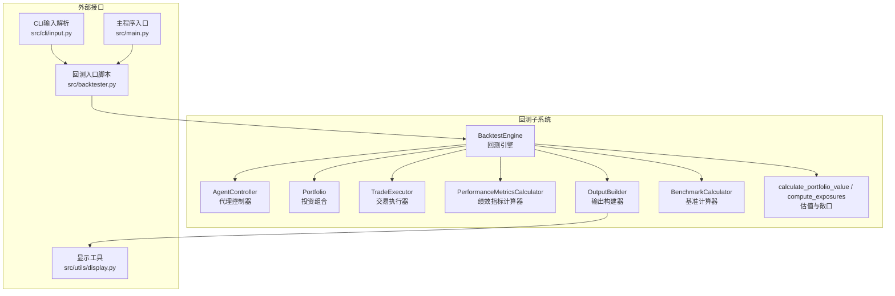
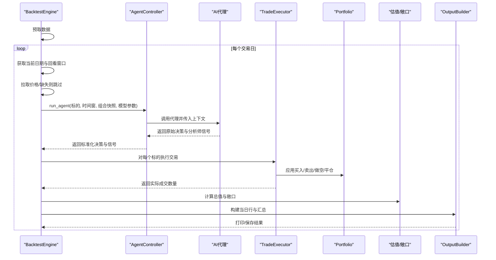
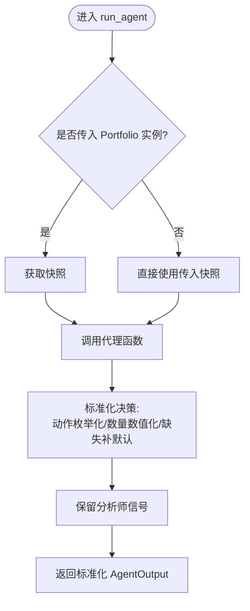
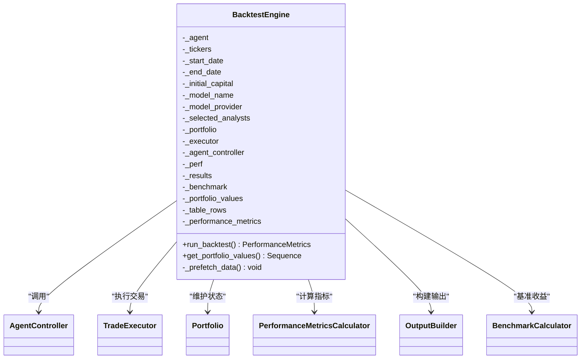
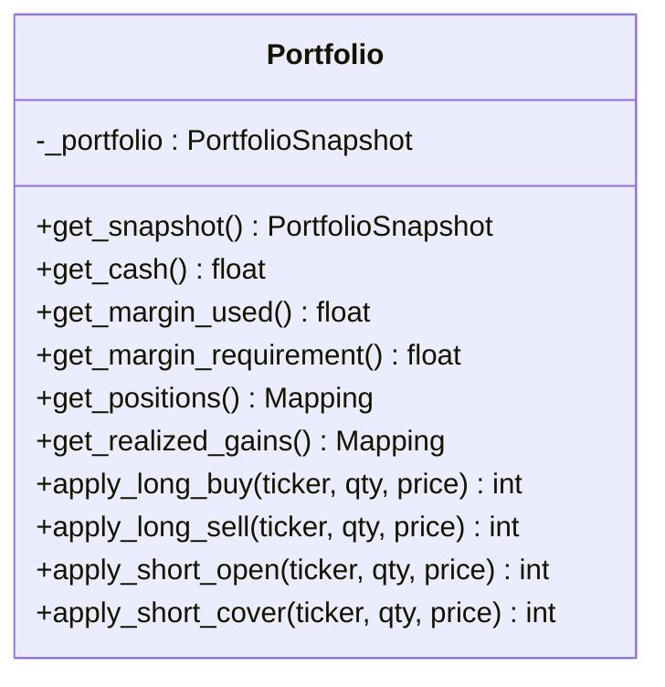
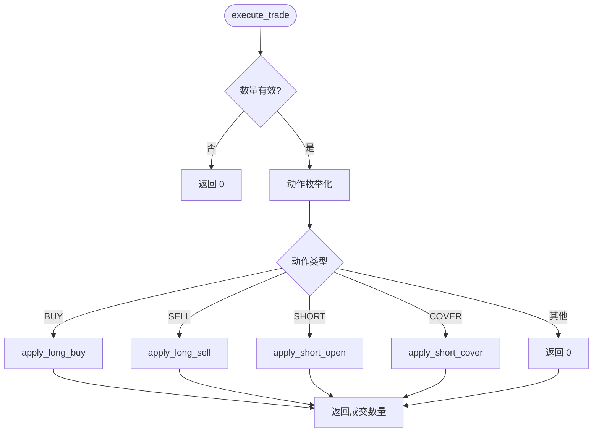
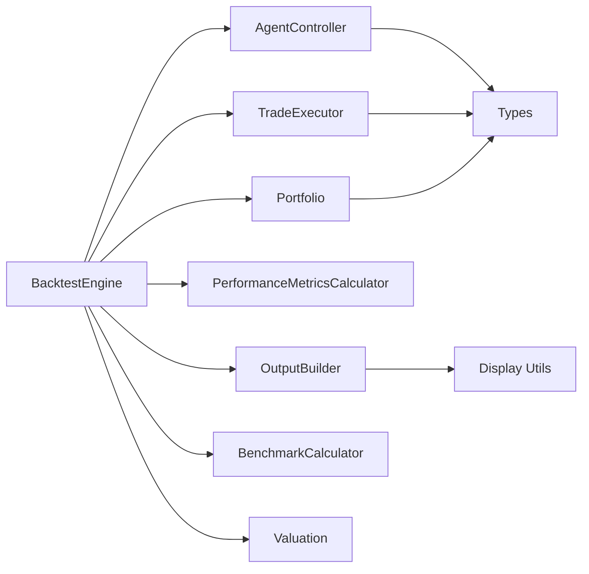

# 回测控制器

<cite>
**本文档引用的文件**
- [src/backtesting/controller.py](file://src/backtesting/controller.py)
- [src/backtesting/engine.py](file://src/backtesting/engine.py)
- [src/backtesting/types.py](file://src/backtesting/types.py)
- [src/backtesting/portfolio.py](file://src/backtesting/portfolio.py)
- [src/backtesting/trader.py](file://src/backtesting/trader.py)
- [src/backtesting/metrics.py](file://src/backtesting/metrics.py)
- [src/backtesting/output.py](file://src/backtesting/output.py)
- [src/backtesting/valuation.py](file://src/backtesting/valuation.py)
- [src/backtesting/benchmarks.py](file://src/backtesting/benchmarks.py)
- [src/backtesting/__init__.py](file://src/backtesting/__init__.py)
- [src/backtester.py](file://src/backtester.py)
- [src/main.py](file://src/main.py)
- [src/cli/input.py](file://src/cli/input.py)
- [src/utils/display.py](file://src/utils/display.py)
- [tests/backtesting/test_controller.py](file://tests/backtesting/test_controller.py)
</cite>

## 目录
1. [简介](#简介)
2. [项目结构](#项目结构)
3. [核心组件](#核心组件)
4. [架构总览](#架构总览)
5. [详细组件分析](#详细组件分析)
6. [依赖分析](#依赖分析)
7. [性能考虑](#性能考虑)
8. [故障排除指南](#故障排除指南)
9. [结论](#结论)
10. [附录](#附录)

## 简介
本文件系统性地文档化回测控制器（AgentController）及其在回测引擎中的作用，重点说明其如何协调多个AI代理进行回测执行，包括代理调度、状态管理、结果收集与规范化。文档涵盖控制器的初始化、配置参数、生命周期管理、代理决策的聚合与冲突解决策略、最终决策生成过程、与外部系统的集成、错误处理与异常恢复机制，并提供配置示例、性能监控与调试技巧。

## 项目结构
回测子系统位于 src/backtesting 包中，围绕 BacktestEngine 协调 AgentController、Portfolio、TradeExecutor、PerformanceMetricsCalculator、OutputBuilder、BenchmarkCalculator 和估值模块，形成完整的回测流水线。CLI 输入解析与主程序入口分别在 src/cli/input.py 与 src/main.py 中，回测入口脚本在 src/backtester.py 中。

图表来源
- [src/backtesting/engine.py:27-69](file://src/backtesting/engine.py#L27-L69)
- [src/backtesting/controller.py:9-65](file://src/backtesting/controller.py#L9-L65)
- [src/backtesting/portfolio.py:9-196](file://src/backtesting/portfolio.py#L9-L196)
- [src/backtesting/trader.py:7-40](file://src/backtesting/trader.py#L7-L40)
- [src/backtesting/metrics.py:8-78](file://src/backtesting/metrics.py#L8-L78)
- [src/backtesting/output.py:11-99](file://src/backtesting/output.py#L11-L99)
- [src/backtesting/valuation.py:8-83](file://src/backtesting/valuation.py#L8-L83)
- [src/backtesting/benchmarks.py:8-33](file://src/backtesting/benchmarks.py#L8-L33)
- [src/cli/input.py:227-289](file://src/cli/input.py#L227-L289)
- [src/main.py:46-93](file://src/main.py#L46-L93)
- [src/backtester.py:43-67](file://src/backtester.py#L43-L67)
- [src/utils/display.py:17-200](file://src/utils/display.py#L17-L200)

章节来源
- [src/backtesting/__init__.py:1-55](file://src/backtesting/__init__.py#L1-L55)
- [src/backtesting/engine.py:27-69](file://src/backtesting/engine.py#L27-L69)

## 核心组件
- AgentController：负责调用AI代理并标准化输出，确保决策字典对所有标的完整、类型安全且可被后续组件消费。
- BacktestEngine：协调回测循环，拉取数据、驱动代理、执行交易、计算估值与敞口、更新每日结果与性能指标。
- Portfolio：封装现金、头寸与保证金，支持多标的长/短头寸的成本基础与已实现损益跟踪。
- TradeExecutor：根据动作枚举执行买卖/做空/平仓等交易，返回实际成交数量。
- PerformanceMetricsCalculator：计算夏普比率、索提诺比率、最大回撤等指标。
- OutputBuilder：构建每日输出行并打印，汇总当日与累计指标。
- BenchmarkCalculator：计算基准（如SPY）的简单持有收益。
- 估值与敞口：计算投资组合总值与多空敞口、总/净敞口、多空比等。

章节来源
- [src/backtesting/controller.py:9-65](file://src/backtesting/controller.py#L9-L65)
- [src/backtesting/engine.py:27-195](file://src/backtesting/engine.py#L27-L195)
- [src/backtesting/portfolio.py:9-196](file://src/backtesting/portfolio.py#L9-L196)
- [src/backtesting/trader.py:7-40](file://src/backtesting/trader.py#L7-L40)
- [src/backtesting/metrics.py:8-78](file://src/backtesting/metrics.py#L8-L78)
- [src/backtesting/output.py:11-99](file://src/backtesting/output.py#L11-L99)
- [src/backtesting/valuation.py:8-83](file://src/backtesting/valuation.py#L8-L83)
- [src/backtesting/benchmarks.py:8-33](file://src/backtesting/benchmarks.py#L8-L33)

## 架构总览
AgentController 作为“代理适配层”，屏蔽不同代理输出格式差异，统一为标准化 AgentOutput；BacktestEngine 负责时间步推进、数据预取、价格获取、代理调用、交易执行、估值与敞口计算、指标更新与输出打印。Portfolio 提供状态快照与交易执行的原子操作，TradeExecutor 将动作映射到 Portfolio 的具体操作，OutputBuilder 与 BenchmarkCalculator 参与结果展示与对比。

图表来源
- [src/backtesting/engine.py:96-195](file://src/backtesting/engine.py#L96-L195)
- [src/backtesting/controller.py:12-65](file://src/backtesting/controller.py#L12-L65)
- [src/backtesting/trader.py:10-37](file://src/backtesting/trader.py#L10-L37)
- [src/backtesting/valuation.py:8-51](file://src/backtesting/valuation.py#L8-L51)
- [src/backtesting/output.py:20-99](file://src/backtesting/output.py#L20-L99)

## 详细组件分析

### AgentController 分析
- 职责：调用代理函数，传递标准化参数；将代理输出规范化为统一的 AgentOutput 结构，保证每个标的都有决策项，动作枚举化，数量数值化；保留分析师信号原样。
- 关键点：
  - 参数透传：tickers、start_date、end_date、portfolio（Portfolio 或快照）、model_name、model_provider、selected_analysts。
  - 快照转换：若传入 Portfolio 实例，先获取快照以兼容旧期望。
  - 决策标准化：遍历所有标的，缺失默认为“持有/0”；动作通过枚举校验与强制，数量转浮点；构造标准化决策字典。
  - 信号保留：分析师信号保持原结构不变。
- 生命周期：无内部状态，每次调用独立执行，适合在回测引擎的每日循环中被反复调用。

图表来源
- [src/backtesting/controller.py:12-65](file://src/backtesting/controller.py#L12-L65)

章节来源
- [src/backtesting/controller.py:9-65](file://src/backtesting/controller.py#L9-L65)
- [tests/backtesting/test_controller.py:13-35](file://tests/backtesting/test_controller.py#L13-L35)

### BacktestEngine 分析
- 初始化：接收代理、标的、起止日期、初始资金、模型名称/提供商、分析师选择、初始保证金要求；构建 Portfolio、TradeExecutor、AgentController、PerformanceMetricsCalculator、OutputBuilder、BenchmarkCalculator；准备存储历史净值与表格行。
- 数据预取：提前一年范围拉取各标的日线、财务指标、 insider 交易与新闻，以及基准 SPY 价格，提升回测效率。
- 回测循环：
  - 日期序列按工作日推进；计算回看窗口与前一日日期；若价格数据缺失则跳过该日。
  - 调用 AgentController.run_agent 获取标准化决策。
  - 对每个标的执行交易，记录实际成交数量。
  - 计算投资组合总值与多空敞口，构建净值点并追加。
  - 使用 OutputBuilder 构建当日行与汇总行，打印并前置到历史行列表。
  - 当净值序列长度足够时，计算并更新绩效指标。
- 输出：返回最终绩效指标；提供获取净值序列的方法。

图表来源
- [src/backtesting/engine.py:35-80](file://src/backtesting/engine.py#L35-L80)

章节来源
- [src/backtesting/engine.py:27-195](file://src/backtesting/engine.py#L27-L195)

### Portfolio 分析
- 状态结构：包含现金、已用保证金、保证金要求、各标的的长/短头寸、成本基础与已实现损益。
- 方法：
  - 快照导出：返回不可变副本，避免外部修改内部状态。
  - 查询接口：返回只读视图，保护内部映射。
  - 交易应用：长仓买入/卖出、短仓开仓/平仓，均考虑资金与保证金约束，自动更新成本基础与已实现损益。
- 设计要点：通过整数成交数量与浮点价格计算，严格控制资金与保证金占用，支持部分成交与最大可成交数量推断。

图表来源
- [src/backtesting/portfolio.py:9-196](file://src/backtesting/portfolio.py#L9-L196)

章节来源
- [src/backtesting/portfolio.py:9-196](file://src/backtesting/portfolio.py#L9-L196)

### TradeExecutor 分析
- 功能：将动作字符串或枚举映射到 Portfolio 的具体交易方法，返回实际成交数量。
- 行为：对无效/未知动作返回 0；对空量或非正量返回 0；对字符串动作进行枚举校验与强制。

图表来源
- [src/backtesting/trader.py:10-37](file://src/backtesting/trader.py#L10-L37)

章节来源
- [src/backtesting/trader.py:7-40](file://src/backtesting/trader.py#L7-L40)

### 性能指标与输出
- 绩效指标：基于净值序列计算日收益率、超额收益、年化波动率、夏普/索提诺比率与最大回撤及发生日期。
- 输出构建：逐标的与汇总行构建，包含决策动作、成交数量、价格、头寸价值、净值、回报率、现金余额、各类风险指标与基准收益对比。
- 基准比较：使用 BenchmarkCalculator 计算 SPY 的简单持有收益用于对比。

章节来源
- [src/backtesting/metrics.py:8-78](file://src/backtesting/metrics.py#L8-L78)
- [src/backtesting/output.py:11-99](file://src/backtesting/output.py#L11-L99)
- [src/backtesting/benchmarks.py:8-33](file://src/backtesting/benchmarks.py#L8-L33)

### 类型与数据模型
- 动作枚举：buy/sell/short/cover/hold。
- 决策与输出：AgentDecision、AgentOutput、AgentSignals、PortfolioSnapshot、PortfolioValuePoint、PerformanceMetrics。
- 价格数据帧别名：便于接口清晰。

章节来源
- [src/backtesting/types.py:10-106](file://src/backtesting/types.py#L10-L106)

## 依赖分析
- 组件耦合：
  - BacktestEngine 依赖 AgentController、TradeExecutor、Portfolio、PerformanceMetricsCalculator、OutputBuilder、BenchmarkCalculator、估值模块。
  - AgentController 仅依赖类型定义与 Portfolio 快照，低耦合。
  - TradeExecutor 依赖 Portfolio 与动作枚举，职责单一。
- 外部依赖：
  - 数据获取：通过 src/tools/api 的 get_price_data/get_prices/get_financial_metrics/get_insider_trades/get_company_news。
  - 显示：通过 src/utils/display 的格式化与打印工具。
- 循环依赖：未发现循环导入。

图表来源
- [src/backtesting/engine.py:9-25](file://src/backtesting/engine.py#L9-L25)
- [src/backtesting/controller.py:5-6](file://src/backtesting/controller.py#L5-L6)
- [src/backtesting/trader.py:3-4](file://src/backtesting/trader.py#L3-L4)
- [src/backtesting/portfolio.py:6-6](file://src/backtesting/portfolio.py#L6-L6)
- [src/backtesting/output.py:7-8](file://src/backtesting/output.py#L7-L8)
- [src/utils/display.py:1-6](file://src/utils/display.py#L1-L6)

章节来源
- [src/backtesting/engine.py:18-25](file://src/backtesting/engine.py#L18-L25)

## 性能考虑
- 数据预取：在回测开始前批量拉取所需历史数据，减少运行期 IO 开销。
- 日内处理：按工作日推进，缺失价格数据直接跳过，避免阻塞。
- 数值计算：使用向量化与纯函数式计算（如净值序列转 DataFrame 后一次性计算），降低重复计算。
- 输出流式：每日输出即时打印，避免累积内存压力。
- 交易执行：部分成交与保证金约束在单次调用内完成，减少跨轮次状态同步成本。

## 故障排除指南
- 代理输出不规范：
  - 症状：某些标的缺少决策或动作/数量类型不正确。
  - 处理：AgentController 已进行标准化与默认填充；检查代理返回结构与类型。
- 价格数据缺失：
  - 症状：某日因价格为空而跳过。
  - 处理：确认数据源可用与日期边界；BacktestEngine 已有容错逻辑。
- 交易无法成交：
  - 症状：实际成交数量为 0。
  - 处理：检查资金/保证金是否充足、动作是否有效、数量是否为正。
- 绩效指标为空：
  - 症状：指标为 None。
  - 处理：确认净值序列长度足够（至少超过3期）且包含“Portfolio Value”列。
- 键盘中断与部分结果：
  - 症状：用户中断回测。
  - 处理：回测入口脚本捕获中断，尝试打印初始与最终净值与总回报，便于快速评估。

章节来源
- [src/backtesting/controller.py:40-65](file://src/backtesting/controller.py#L40-L65)
- [src/backtesting/engine.py:114-131](file://src/backtesting/engine.py#L114-L131)
- [src/backtester.py:13-40](file://src/backtester.py#L13-L40)

## 结论
AgentController 在回测体系中承担“代理适配与输出规范化”的关键角色，确保多代理输出的一致性与健壮性；BacktestEngine 则通过清晰的回测循环与模块化组件协作，实现了从数据拉取、代理决策、交易执行、估值与敞口计算到指标与输出的完整闭环。该设计具备良好的扩展性与可维护性，便于引入新的代理、指标与输出格式。

## 附录

### 配置参数与初始化示例
- BacktestEngine 初始化参数：
  - agent：代理函数（需返回标准化 AgentOutput）。
  - tickers：标的列表。
  - start_date/end_date：回测起止日期。
  - initial_capital：初始资金。
  - model_name/model_provider：模型名称与提供商。
  - selected_analysts：分析师选择列表（可选）。
  - initial_margin_requirement：初始保证金比例（用于做空）。
- CLI 输入解析：
  - 支持交互式选择分析师、模型与日期范围；提供初始资金与保证金比例参数。
- 主程序入口：
  - 构造 Portfolio 快照并调用 run_hedge_fund，后者编排代理工作流并返回决策与分析师信号。

章节来源
- [src/backtesting/engine.py:35-69](file://src/backtesting/engine.py#L35-L69)
- [src/cli/input.py:227-289](file://src/cli/input.py#L227-L289)
- [src/main.py:46-93](file://src/main.py#L46-L93)

### 决策聚合与冲突解决
- 聚合机制：BacktestEngine 对每个标的逐一执行交易，不进行跨标的聚合或冲突仲裁；每个标的的决策来自代理输出。
- 冲突解决：若同一标的出现相互矛盾的动作（例如同时给出买入与卖出），TradeExecutor 依据动作顺序与资金/保证金约束执行，优先满足资金约束；建议在代理层面进行内部一致性检查与冲突消解。
- 最终决策生成：由 AgentController 标准化后的决策字典直接驱动交易执行。

章节来源
- [src/backtesting/engine.py:144-151](file://src/backtesting/engine.py#L144-L151)
- [src/backtesting/trader.py:18-37](file://src/backtesting/trader.py#L18-L37)

### 与外部系统的集成
- 数据源集成：通过 src/tools/api 的统一接口拉取价格、财务、新闻与 insider 交易数据。
- 显示集成：使用 src/utils/display 的格式化与打印工具输出每日明细与汇总。
- Web/流式集成：后端服务可通过异步任务与事件流推送回测进度与结果，前端组件实时渲染性能指标与回测输出。

章节来源
- [src/backtesting/engine.py:18-24](file://src/backtesting/engine.py#L18-L24)
- [src/utils/display.py:17-200](file://src/utils/display.py#L17-L200)

### 错误处理与异常恢复
- 代理调用：AgentController 对动作与数量进行类型校验与默认填充，避免后续组件因类型错误崩溃。
- 价格缺失：回测循环中对缺失数据进行跳过处理，保证连续性。
- 键盘中断：回测入口脚本捕获中断，尽量输出部分结果摘要。
- 交易失败：当资金/保证金不足或数量无效时，返回 0 成交，不影响整体流程。

章节来源
- [src/backtesting/controller.py:40-65](file://src/backtesting/controller.py#L40-L65)
- [src/backtesting/engine.py:114-131](file://src/backtesting/engine.py#L114-L131)
- [src/backtester.py:13-40](file://src/backtester.py#L13-L40)

### 性能监控与调试技巧
- 性能监控：
  - 观察净值曲线与最大回撤变化趋势，结合夏普/索提诺比率评估风险调整收益。
  - 对比基准（SPY）收益，评估策略相对表现。
- 调试技巧：
  - 使用 OutputBuilder 的每日行输出定位问题日期与标的。
  - 在代理层面增加日志与中间结果打印，验证决策链路。
  - 逐步缩小时间窗口与标的范围，快速定位异常数据或逻辑问题。