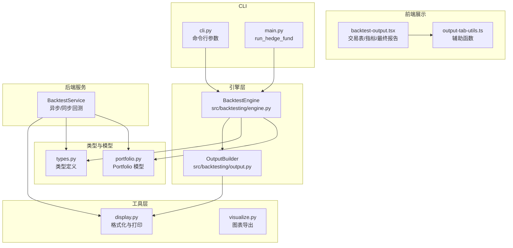
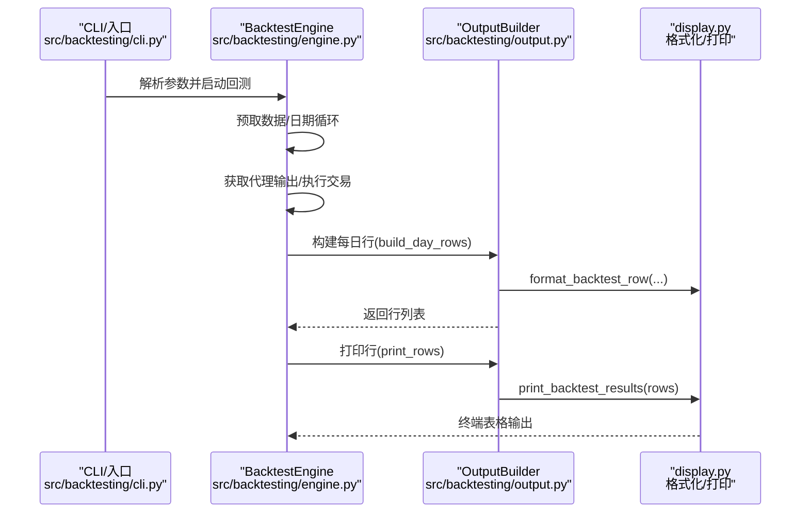
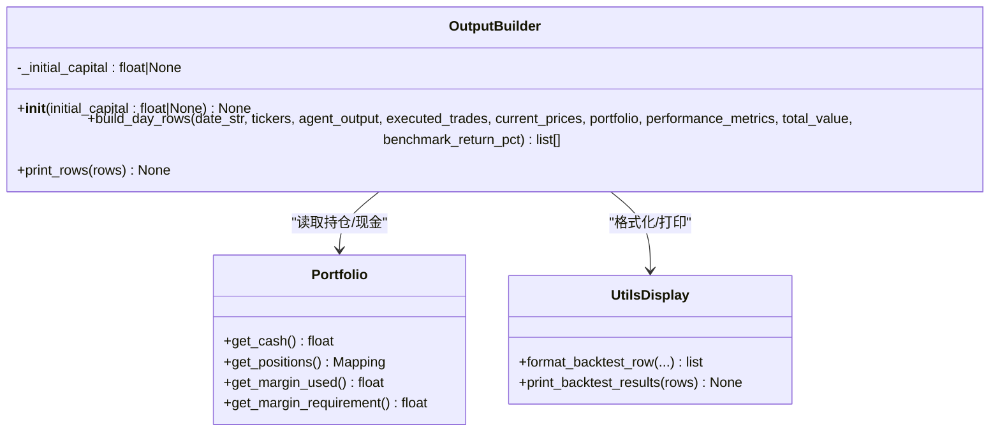
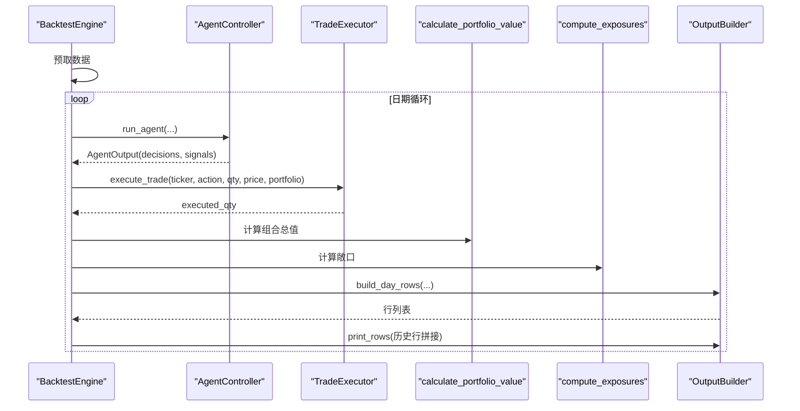
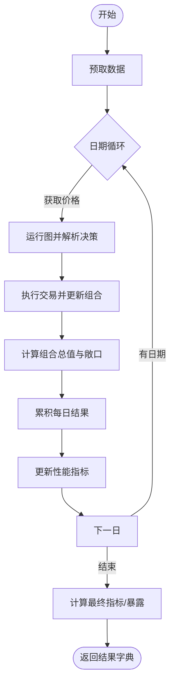
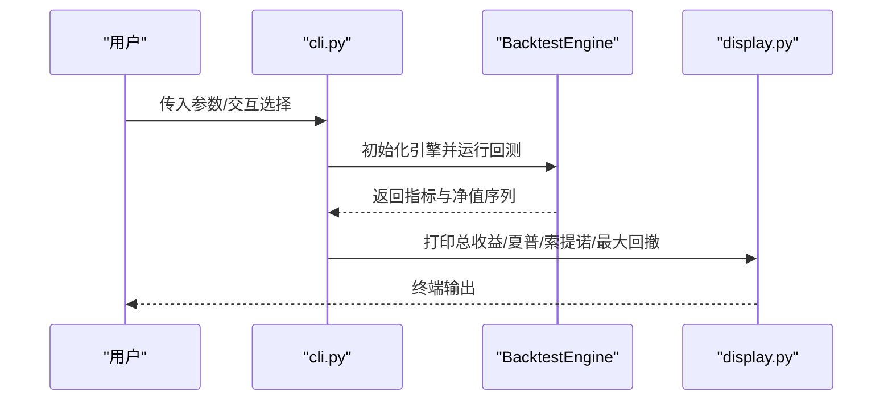
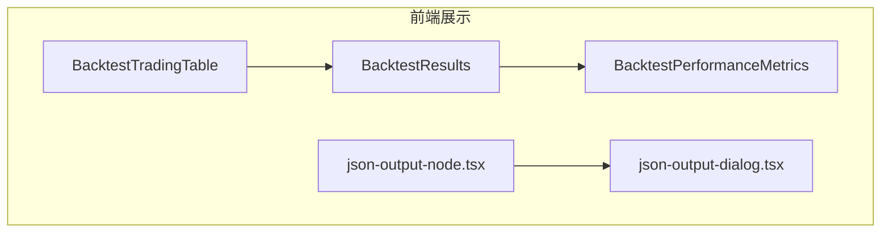
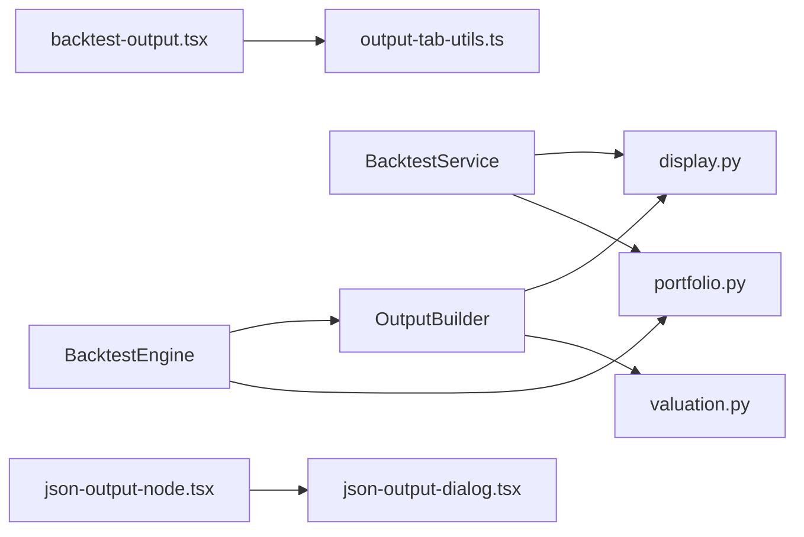

# 回测输出系统

<cite>
**本文档引用的文件**
- [src/backtesting/output.py](file://src/backtesting/output.py)
- [src/backtesting/engine.py](file://src/backtesting/engine.py)
- [src/backtesting/cli.py](file://src/backtesting/cli.py)
- [src/backtesting/valuation.py](file://src/backtesting/valuation.py)
- [src/backtesting/portfolio.py](file://src/backtesting/portfolio.py)
- [src/backtesting/types.py](file://src/backtesting/types.py)
- [src/utils/display.py](file://src/utils/display.py)
- [src/utils/visualize.py](file://src/utils/visualize.py)
- [app/backend/services/backtest_service.py](file://app/backend/services/backtest_service.py)
- [app/frontend/src/components/panels/bottom/tabs/backtest-output.tsx](file://app/frontend/src/components/panels/bottom/tabs/backtest-output.tsx)
- [app/frontend/src/components/panels/bottom/tabs/output-tab-utils.ts](file://app/frontend/src/components/panels/bottom/tabs/output-tab-utils.ts)
- [app/frontend/src/nodes/components/json-output-node.tsx](file://app/frontend/src/nodes/components/json-output-node.tsx)
- [app/frontend/src/nodes/components/json-output-dialog.tsx](file://app/frontend/src/nodes/components/json-output-dialog.tsx)
- [src/main.py](file://src/main.py)
- [tests/backtesting/test_results.py](file://tests/backtesting/test_results.py)
</cite>

## 目录
1. [简介](#简介)
2. [项目结构](#项目结构)
3. [核心组件](#核心组件)
4. [架构总览](#架构总览)
5. [详细组件分析](#详细组件分析)
6. [依赖关系分析](#依赖关系分析)
7. [性能考量](#性能考量)
8. [故障排查指南](#故障排查指南)
9. [结论](#结论)
10. [附录](#附录)

## 简介
本文件系统化阐述回测输出系统，重点覆盖 OutputBuilder 的结构化输出与报告生成能力，回测结果的数据格式、终端表格展示、JSON 输出与 CSV 导出机制，CLI 命令行参数与交互模式，结果可视化与报告模板定制，以及输出数据的后处理、聚合分析与存储方案。同时给出输出格式规范、API 接口与第三方集成指南，并讨论系统的可扩展性、自定义选项与性能优化建议。

## 项目结构
回测输出系统由以下层次构成：
- 引擎层：负责回测主循环、数据预取、交易执行、估值计算与指标更新（src/backtesting/engine.py）。
- 输出层：负责每日行构建、汇总行生成与终端打印（src/backtesting/output.py）。
- 工具层：提供显示格式化、颜色化表格、图表导出等工具（src/utils/display.py, src/utils/visualize.py）。
- 后端服务：提供异步/同步回测运行、性能指标计算与结果聚合（app/backend/services/backtest_service.py）。
- 前端展示：提供实时交易表、性能指标卡片与最终报告视图（app/frontend/.../backtest-output.tsx 等）。
- CLI 入口：提供命令行参数解析与回测运行入口（src/backtesting/cli.py, src/main.py）。
- 类型与模型：统一数据结构与枚举（src/backtesting/types.py, src/backtesting/portfolio.py）。

**图表来源**
- [src/backtesting/engine.py:27-195](file://src/backtesting/engine.py#L27-L195)
- [src/backtesting/output.py:11-99](file://src/backtesting/output.py#L11-L99)
- [src/utils/display.py:257-331](file://src/utils/display.py#L257-L331)
- [src/utils/visualize.py:5-9](file://src/utils/visualize.py#L5-L9)
- [app/backend/services/backtest_service.py:18-539](file://app/backend/services/backtest_service.py#L18-L539)
- [app/frontend/src/components/panels/bottom/tabs/backtest-output.tsx:1-416](file://app/frontend/src/components/panels/bottom/tabs/backtest-output.tsx#L1-L416)
- [src/backtesting/cli.py:18-173](file://src/backtesting/cli.py#L18-L173)
- [src/main.py:46-180](file://src/main.py#L46-L180)
- [src/backtesting/types.py:10-106](file://src/backtesting/types.py#L10-L106)
- [src/backtesting/portfolio.py:9-196](file://src/backtesting/portfolio.py#L9-L196)

**章节来源**
- [src/backtesting/engine.py:27-195](file://src/backtesting/engine.py#L27-L195)
- [src/backtesting/output.py:11-99](file://src/backtesting/output.py#L11-L99)
- [src/utils/display.py:257-331](file://src/utils/display.py#L257-L331)
- [app/backend/services/backtest_service.py:18-539](file://app/backend/services/backtest_service.py#L18-L539)
- [app/frontend/src/components/panels/bottom/tabs/backtest-output.tsx:1-416](file://app/frontend/src/components/panels/bottom/tabs/backtest-output.tsx#L1-L416)
- [src/backtesting/cli.py:18-173](file://src/backtesting/cli.py#L18-L173)
- [src/main.py:46-180](file://src/main.py#L46-L180)
- [src/backtesting/types.py:10-106](file://src/backtesting/types.py#L10-L106)
- [src/backtesting/portfolio.py:9-196](file://src/backtesting/portfolio.py#L9-L196)

## 核心组件
- OutputBuilder：负责按日构建输出行（含每标的明细与汇总），并调用显示工具进行终端打印。其方法 build_day_rows 接收代理输出、已执行交易、当前价格、组合状态与性能指标，返回行列表；print_rows 负责最终打印。
- BacktestEngine：协调回测主循环，调用 AgentController 获取决策，TradeExecutor 执行交易，计算组合价值与敞口，调用 OutputBuilder 构建行并打印。
- BacktestService：后端服务版本，提供异步/同步回测运行，计算每日回报与风险指标，构建详细日期级结果与汇总指标，便于前端展示与导出。
- display 工具：format_backtest_row 将字段格式化为表格行；print_backtest_results 清屏并打印最新汇总与交易明细；print_trading_output 用于前端展示的交易输出。
- 可视化工具：save_graph_as_png 将编译后的图以 PNG 形式保存，便于报告模板定制。
- 类型与模型：Action、PortfolioSnapshot、AgentOutput、PerformanceMetrics 等类型确保数据结构一致性和可测试性。

**章节来源**
- [src/backtesting/output.py:11-99](file://src/backtesting/output.py#L11-L99)
- [src/backtesting/engine.py:27-195](file://src/backtesting/engine.py#L27-L195)
- [app/backend/services/backtest_service.py:18-539](file://app/backend/services/backtest_service.py#L18-L539)
- [src/utils/display.py:257-331](file://src/utils/display.py#L257-L331)
- [src/utils/visualize.py:5-9](file://src/utils/visualize.py#L5-L9)
- [src/backtesting/types.py:10-106](file://src/backtesting/types.py#L10-L106)
- [src/backtesting/portfolio.py:9-196](file://src/backtesting/portfolio.py#L9-L196)

## 架构总览
回测输出系统采用“引擎-输出-工具-前端/后端”的分层设计。引擎负责回测主循环与数据流控制，输出层负责结构化行构建与打印，工具层提供格式化与可视化能力，后端服务提供高性能异步回测与指标计算，前端负责实时展示与交互。

**图表来源**
- [src/backtesting/cli.py:18-173](file://src/backtesting/cli.py#L18-L173)
- [src/backtesting/engine.py:96-195](file://src/backtesting/engine.py#L96-L195)
- [src/backtesting/output.py:20-99](file://src/backtesting/output.py#L20-L99)
- [src/utils/display.py:257-331](file://src/utils/display.py#L257-L331)

## 详细组件分析

### OutputBuilder 组件分析
OutputBuilder 是回测输出的核心，负责：
- 逐标的行构建：遍历标的，基于代理决策与已执行交易，结合当前价格与组合持仓，调用 format_backtest_row 生成每标行。
- 汇总行构建：通过 compute_portfolio_summary 计算当日总值、回报率、现金余额、总头寸价值及风险指标，生成汇总行。
- 终端打印：调用 print_backtest_results 进行清屏与表格打印。

**图表来源**
- [src/backtesting/output.py:11-99](file://src/backtesting/output.py#L11-L99)
- [src/backtesting/portfolio.py:67-81](file://src/backtesting/portfolio.py#L67-L81)
- [src/utils/display.py:333-396](file://src/utils/display.py#L333-L396)

**章节来源**
- [src/backtesting/output.py:11-99](file://src/backtesting/output.py#L11-L99)
- [src/backtesting/valuation.py:54-83](file://src/backtesting/valuation.py#L54-L83)
- [src/utils/display.py:333-396](file://src/utils/display.py#L333-L396)

### BacktestEngine 组件分析
BacktestEngine 协调回测主循环，关键流程包括：
- 数据预取：为标的与基准（如 SPY）预取价格与财务数据。
- 日期循环：按工作日遍历，获取当前价格与代理输出。
- 交易执行：根据代理决策执行买卖/做空/平仓，更新组合状态。
- 估值与敞口：计算组合总值与多/空/总/净敞口及长/短比率。
- 输出与指标：调用 OutputBuilder 构建行并打印，随后更新性能指标。

**图表来源**
- [src/backtesting/engine.py:96-195](file://src/backtesting/engine.py#L96-L195)

**章节来源**
- [src/backtesting/engine.py:27-195](file://src/backtesting/engine.py#L27-L195)

### BacktestService 组件分析
BacktestService 提供后端异步/同步回测运行，关键点：
- 异步回测：prefetch_data 预取数据，日期循环中运行图并解析决策，执行交易，计算组合价值与各类暴露，累积每日结果。
- 性能指标：基于每日净值序列计算夏普、索提诺比率与最大回撤，并记录日期与峰值信息。
- 结果聚合：返回 backtest_results、performance_metrics、portfolio_values 与最终组合快照，便于前端展示与导出。

**图表来源**
- [app/backend/services/backtest_service.py:285-512](file://app/backend/services/backtest_service.py#L285-L512)

**章节来源**
- [app/backend/services/backtest_service.py:18-539](file://app/backend/services/backtest_service.py#L18-L539)

### CLI 与交互模式
CLI 提供命令行参数解析与交互选择：
- 参数：tickers、start-date、end-date、initial-capital、margin-requirement、analysts、analysts-all、ollama。
- 交互：支持交互式选择分析师与模型（本地 Ollama 或云端模型），并在运行结束后打印总收益、夏普、索提诺与最大回撤等指标。

**图表来源**
- [src/backtesting/cli.py:18-173](file://src/backtesting/cli.py#L18-L173)
- [src/utils/display.py:257-331](file://src/utils/display.py#L257-L331)

**章节来源**
- [src/backtesting/cli.py:18-173](file://src/backtesting/cli.py#L18-L173)
- [src/main.py:46-180](file://src/main.py#L46-L180)

### 前端展示与报告模板定制
前端组件负责实时展示与报告呈现：
- BacktestTradingTable：将 backtestResults 展示为交易明细表，包含日期、标的、动作、数量、价格、持有份额与信号计数等。
- BacktestResults：展示性能指标、组合摘要与最终头寸。
- BacktestPerformanceMetrics：计算总回报、胜率、最大回撤、交易期数等。
- JSON 输出节点与对话框：支持复制与下载 JSON 输出，便于报告模板定制与二次处理。

**图表来源**
- [app/frontend/src/components/panels/bottom/tabs/backtest-output.tsx:36-416](file://app/frontend/src/components/panels/bottom/tabs/backtest-output.tsx#L36-L416)
- [app/frontend/src/nodes/components/json-output-node.tsx:36-67](file://app/frontend/src/nodes/components/json-output-node.tsx#L36-L67)
- [app/frontend/src/nodes/components/json-output-dialog.tsx:46-113](file://app/frontend/src/nodes/components/json-output-dialog.tsx#L46-L113)

**章节来源**
- [app/frontend/src/components/panels/bottom/tabs/backtest-output.tsx:1-416](file://app/frontend/src/components/panels/bottom/tabs/backtest-output.tsx#L1-L416)
- [app/frontend/src/components/panels/bottom/tabs/output-tab-utils.ts:1-105](file://app/frontend/src/components/panels/bottom/tabs/output-tab-utils.ts#L1-L105)
- [app/frontend/src/nodes/components/json-output-node.tsx:36-67](file://app/frontend/src/nodes/components/json-output-node.tsx#L36-L67)
- [app/frontend/src/nodes/components/json-output-dialog.tsx:46-113](file://app/frontend/src/nodes/components/json-output-dialog.tsx#L46-L113)

## 依赖关系分析
- OutputBuilder 依赖 display 工具进行行格式化与打印，依赖 valuation 工具进行组合汇总计算。
- BacktestEngine 依赖 AgentController、TradeExecutor、PerformanceMetricsCalculator、BenchmarkCalculator 与 OutputBuilder。
- BacktestService 依赖工具 API 获取价格与财务数据，依赖 create_portfolio 构造临时组合，依赖 run_graph_async 执行图并解析响应。
- 前端组件依赖输出工具函数进行颜色与排序处理，依赖 JSON 输出节点/对话框进行导出。

**图表来源**
- [src/backtesting/output.py:11-99](file://src/backtesting/output.py#L11-L99)
- [src/utils/display.py:257-331](file://src/utils/display.py#L257-L331)
- [src/backtesting/valuation.py:54-83](file://src/backtesting/valuation.py#L54-L83)
- [src/backtesting/engine.py:27-195](file://src/backtesting/engine.py#L27-L195)
- [app/backend/services/backtest_service.py:18-539](file://app/backend/services/backtest_service.py#L18-L539)
- [app/frontend/src/components/panels/bottom/tabs/backtest-output.tsx:1-416](file://app/frontend/src/components/panels/bottom/tabs/backtest-output.tsx#L1-L416)
- [app/frontend/src/components/panels/bottom/tabs/output-tab-utils.ts:1-105](file://app/frontend/src/components/panels/bottom/tabs/output-tab-utils.ts#L1-L105)
- [app/frontend/src/nodes/components/json-output-node.tsx:36-67](file://app/frontend/src/nodes/components/json-output-node.tsx#L36-L67)
- [app/frontend/src/nodes/components/json-output-dialog.tsx:46-113](file://app/frontend/src/nodes/components/json-output-dialog.tsx#L46-L113)

**章节来源**
- [src/backtesting/output.py:11-99](file://src/backtesting/output.py#L11-L99)
- [src/backtesting/engine.py:27-195](file://src/backtesting/engine.py#L27-L195)
- [app/backend/services/backtest_service.py:18-539](file://app/backend/services/backtest_service.py#L18-L539)
- [app/frontend/src/components/panels/bottom/tabs/backtest-output.tsx:1-416](file://app/frontend/src/components/panels/bottom/tabs/backtest-output.tsx#L1-L416)

## 性能考量
- 异步回测：BacktestService 使用 asyncio 并在日期循环中允许其他协程运行，提升吞吐量。
- 数据预取：在回测前统一预取所需数据，减少循环内 IO 开销。
- 指标计算：基于滚动窗口与向量化操作计算超额收益、波动率与最大回撤，避免重复计算。
- 前端渲染：仅展示最近 N 条记录，避免大量 DOM 渲染导致卡顿。
- 图表导出：Mermaid PNG 导出适合静态报告，不建议在高频刷新场景频繁调用。

[本节为通用性能建议，无需特定文件引用]

## 故障排查指南
- 代理输出解析失败：parse_hedge_fund_response 对 JSON 解析异常进行捕获与提示，检查模型输出是否为合法 JSON 字符串。
- 缺失价格数据：引擎在获取价格数据为空时跳过该日期，确认数据源可用性与时间范围设置。
- 交易执行限制：当资金不足或保证金不足时，执行函数会返回 0 或部分成交，检查初始资本与保证金要求。
- 终端输出异常：display 工具依赖 colorama 与 tabulate，确保环境支持彩色输出与表格渲染。

**章节来源**
- [src/main.py:30-43](file://src/main.py#L30-L43)
- [src/backtesting/engine.py:114-131](file://src/backtesting/engine.py#L114-L131)
- [src/backtesting/output.py:95-99](file://src/backtesting/output.py#L95-L99)

## 结论
回测输出系统通过清晰的分层设计实现了从引擎到输出再到前端展示的完整闭环。OutputBuilder 提供了稳定的结构化输出与汇总能力，BacktestEngine 与 BacktestService 分别满足命令行与后端异步场景的需求。前端组件提供了丰富的可视化与导出能力，配合 CLI 与工具层，形成了可扩展、可定制且易于维护的回测输出体系。

[本节为总结性内容，无需特定文件引用]

## 附录

### 输出数据格式规范
- 每日明细行字段（非汇总）：
  - 日期、标的、动作、数量、价格、多头股数、空头股数、头寸价值。
- 汇总行字段（含性能指标）：
  - 日期、标记为“组合汇总”、总头寸价值、现金余额、总价值、回报率、夏普比率、索提诺比率、最大回撤、基准回报（可选）。
- 后端结果字典关键键：
  - results（日期级明细列表）、performance_metrics（指标字典）、portfolio_values（净值序列）、final_portfolio（最终组合快照）。

**章节来源**
- [src/utils/display.py:333-396](file://src/utils/display.py#L333-L396)
- [app/backend/services/backtest_service.py:507-512](file://app/backend/services/backtest_service.py#L507-L512)

### JSON 输出与 CSV 导出机制
- JSON 输出：
  - 前端 JSON 输出节点与对话框支持复制与下载，文件名包含时间戳，便于归档与二次处理。
- CSV 导出：
  - 建议在后端服务层将 results 中的日期级明细转换为 DataFrame 并导出 CSV，便于第三方分析工具使用。

**章节来源**
- [app/frontend/src/nodes/components/json-output-node.tsx:36-67](file://app/frontend/src/nodes/components/json-output-node.tsx#L36-L67)
- [app/frontend/src/nodes/components/json-output-dialog.tsx:46-113](file://app/frontend/src/nodes/components/json-output-dialog.tsx#L46-L113)
- [app/backend/services/backtest_service.py:507-512](file://app/backend/services/backtest_service.py#L507-L512)

### CLI 接口与命令行参数
- 主要参数：
  - --tickers：逗号分隔的标的列表。
  - --start-date/--end-date：YYYY-MM-DD 格式的起止日期。
  - --initial-capital：初始资金。
  - --margin-requirement：保证金要求。
  - --analysts/--analysts-all：分析师选择。
  - --ollama：启用本地 Ollama 推理。
- 交互模式：支持交互式选择分析师与模型，模型选择后进行可用性校验。

**章节来源**
- [src/backtesting/cli.py:18-173](file://src/backtesting/cli.py#L18-L173)

### 结果可视化与报告模板定制
- 终端表格：使用 colorama 与 tabulate 实现彩色表格与清屏刷新。
- 图表导出：save_graph_as_png 将编译后的图保存为 PNG，可用于报告模板。
- 前端展示：交易表、性能指标卡片与最终报告视图，支持颜色与排序规则。

**章节来源**
- [src/utils/display.py:257-331](file://src/utils/display.py#L257-L331)
- [src/utils/visualize.py:5-9](file://src/utils/visualize.py#L5-L9)
- [app/frontend/src/components/panels/bottom/tabs/backtest-output.tsx:1-416](file://app/frontend/src/components/panels/bottom/tabs/backtest-output.tsx#L1-L416)

### 输出数据的后处理、聚合分析与存储方案
- 后处理：将每日净值序列转换为 DataFrame，计算日收益率、滚动最大值与回撤序列。
- 聚合分析：计算夏普、索提诺比率与最大回撤，统计交易期数、胜率等。
- 存储方案：后端返回 results 与 performance_metrics，前端可持久化至本地或上传至远端存储；CLI 场景可结合 JSON/CSV 导出。

**章节来源**
- [app/backend/services/backtest_service.py:238-284](file://app/backend/services/backtest_service.py#L238-L284)
- [app/backend/services/backtest_service.py:527-539](file://app/backend/services/backtest_service.py#L527-L539)

### API 接口与第三方集成指南
- 后端服务接口：BacktestService.run_backtest_async 返回标准化结果字典，便于前端与外部系统消费。
- 第三方数据源：通过工具 API 获取价格、财务指标、内幕交易与新闻数据，确保数据完整性与一致性。
- 模型集成：CLI 支持本地 Ollama 与云端模型，后端服务通过请求对象传递模型名称与提供商。

**章节来源**
- [app/backend/services/backtest_service.py:285-512](file://app/backend/services/backtest_service.py#L285-L512)
- [src/backtesting/cli.py:75-129](file://src/backtesting/cli.py#L75-L129)
- [src/main.py:46-89](file://src/main.py#L46-L89)

### 扩展性、自定义选项与性能考虑
- 扩展性：新增分析师节点与代理输出结构保持兼容；OutputBuilder 保持无状态，便于替换实现。
- 自定义选项：支持自定义初始资本、保证金要求、分析师与模型选择；前端可定制展示字段与排序规则。
- 性能：异步回测、数据预取与指标滚动计算降低延迟；前端仅渲染最近记录，避免性能问题。

**章节来源**
- [src/backtesting/output.py:11-99](file://src/backtesting/output.py#L11-L99)
- [app/backend/services/backtest_service.py:285-512](file://app/backend/services/backtest_service.py#L285-L512)
- [app/frontend/src/components/panels/bottom/tabs/backtest-output.tsx:90-94](file://app/frontend/src/components/panels/bottom/tabs/backtest-output.tsx#L90-L94)