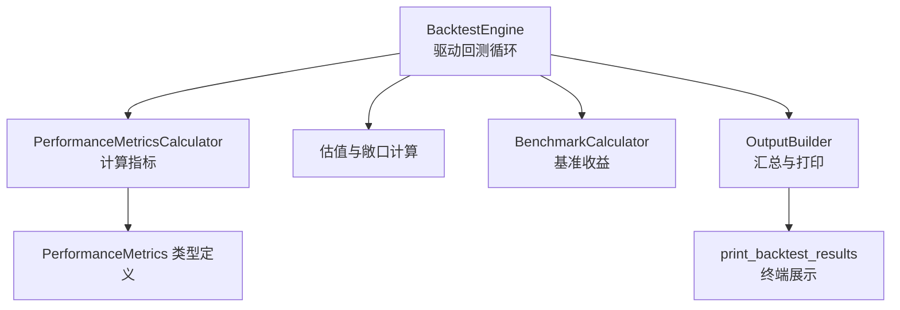
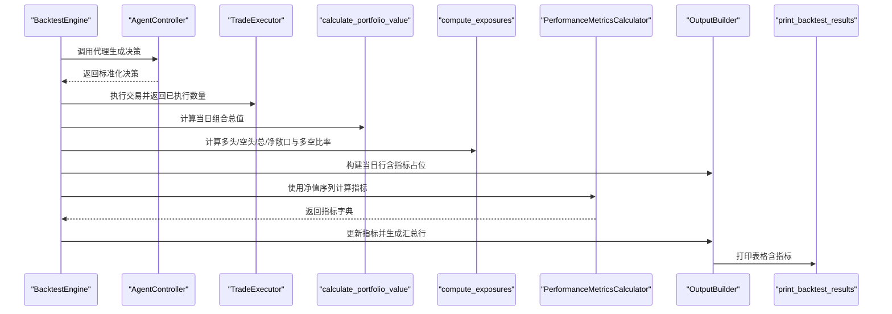
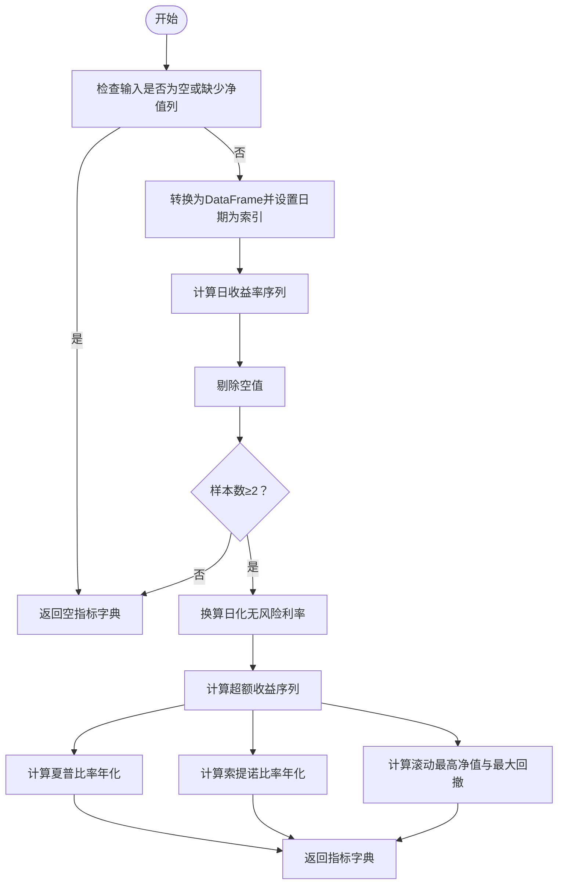
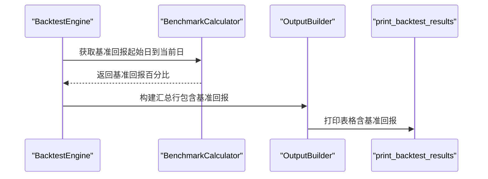
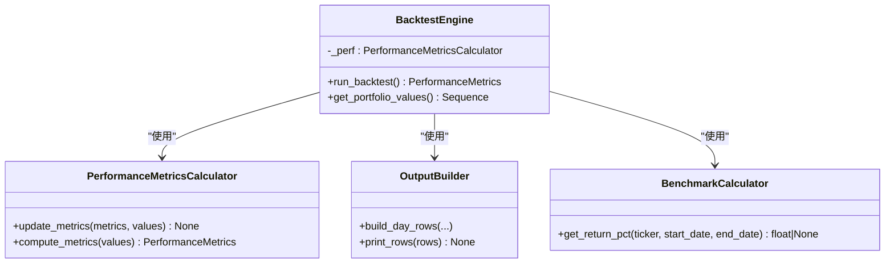
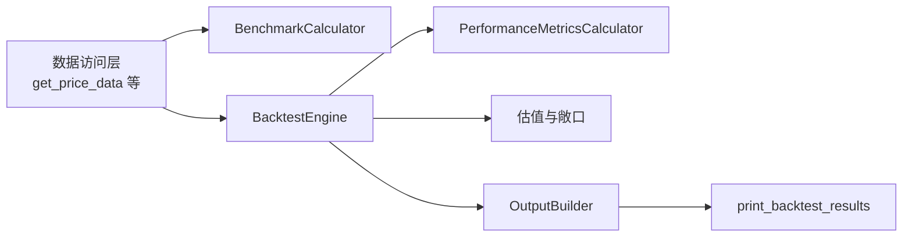

# 性能指标计算

<cite>
**本文引用的文件**
- [src/backtesting/metrics.py](file://src/backtesting/metrics.py)
- [src/backtesting/benchmarks.py](file://src/backtesting/benchmarks.py)
- [src/backtesting/engine.py](file://src/backtesting/engine.py)
- [src/backtesting/valuation.py](file://src/backtesting/valuation.py)
- [src/backtesting/types.py](file://src/backtesting/types.py)
- [src/backtesting/output.py](file://src/backtesting/output.py)
- [src/utils/display.py](file://src/utils/display.py)
- [tests/backtesting/test_metrics.py](file://tests/backtesting/test_metrics.py)
- [src/tools/api.py](file://src/tools/api.py)
</cite>

## 目录
1. [简介](#简介)
2. [项目结构](#项目结构)
3. [核心组件](#核心组件)
4. [架构总览](#架构总览)
5. [详细组件分析](#详细组件分析)
6. [依赖关系分析](#依赖关系分析)
7. [性能考量](#性能考量)
8. [故障排查指南](#故障排查指南)
9. [结论](#结论)
10. [附录](#附录)

## 简介
本文件系统化阐述性能指标计算模块的设计与实现，重点围绕 PerformanceMetricsCalculator 的算法与逻辑，覆盖年化收益率、波动率、夏普比率、最大回撤、索提诺比率等关键指标，并补充基准比较（市场基准、行业基准、自定义基准）的实现思路与扩展路径。同时给出指标解读、阈值建议与评估标准，帮助非技术读者也能理解与应用这些指标。

## 项目结构
性能指标计算位于回测子系统中，与引擎、估值、输出展示协同工作：
- 引擎负责驱动回测循环、组织数据与调用指标计算
- 估值模块提供组合价值与风险敞口计算
- 指标计算模块基于日度净值序列计算各类指标
- 输出模块将指标整合到每日汇总行中进行可视化展示
- 基准计算器提供基准收益比较能力

图表来源
- [src/backtesting/engine.py:96-189](file://src/backtesting/engine.py#L96-L189)
- [src/backtesting/metrics.py:8-78](file://src/backtesting/metrics.py#L8-L78)
- [src/backtesting/valuation.py:8-83](file://src/backtesting/valuation.py#L8-L83)
- [src/backtesting/benchmarks.py:8-33](file://src/backtesting/benchmarks.py#L8-L33)
- [src/backtesting/output.py:20-94](file://src/backtesting/output.py#L20-L94)
- [src/utils/display.py:257-331](file://src/utils/display.py#L257-L331)

章节来源
- [src/backtesting/engine.py:96-189](file://src/backtesting/engine.py#L96-L189)
- [src/backtesting/metrics.py:8-78](file://src/backtesting/metrics.py#L8-L78)
- [src/backtesting/valuation.py:8-83](file://src/backtesting/valuation.py#L8-L83)
- [src/backtesting/benchmarks.py:8-33](file://src/backtesting/benchmarks.py#L8-L33)
- [src/backtesting/output.py:20-94](file://src/backtesting/output.py#L20-L94)
- [src/utils/display.py:257-331](file://src/utils/display.py#L257-L331)

## 核心组件
- PerformanceMetricsCalculator：基于日度净值序列计算夏普、索提诺与最大回撤等指标
- BenchmarkCalculator：按起止日期计算基准（如市场指数）持有收益
- BacktestEngine：在回测循环中收集净值序列并触发指标更新
- OutputBuilder：将指标注入每日汇总行并交由 display 工具渲染
- 类型系统：通过 TypedDict 定义指标键名与可空性，保证前后兼容

章节来源
- [src/backtesting/metrics.py:8-78](file://src/backtesting/metrics.py#L8-L78)
- [src/backtesting/benchmarks.py:8-33](file://src/backtesting/benchmarks.py#L8-L33)
- [src/backtesting/engine.py:96-189](file://src/backtesting/engine.py#L96-L189)
- [src/backtesting/output.py:20-94](file://src/backtesting/output.py#L20-L94)
- [src/backtesting/types.py:90-104](file://src/backtesting/types.py#L90-L104)

## 架构总览
下图展示了从引擎到指标计算与展示的关键交互流程：

图表来源
- [src/backtesting/engine.py:132-188](file://src/backtesting/engine.py#L132-L188)
- [src/backtesting/metrics.py:22-78](file://src/backtesting/metrics.py#L22-L78)
- [src/backtesting/valuation.py:8-50](file://src/backtesting/valuation.py#L8-L50)
- [src/backtesting/output.py:20-94](file://src/backtesting/output.py#L20-L94)
- [src/utils/display.py:257-331](file://src/utils/display.py#L257-L331)

## 详细组件分析

### PerformanceMetricsCalculator 组件
该类负责基于日度净值序列计算风险调整后收益指标与最大回撤。其核心流程如下：
- 输入为日度净值点序列（包含日期与净值）
- 计算日收益率序列并剔除空值
- 将年化无风险利率换算为日化无风险利率
- 计算超额收益序列（日超额 = 日收益率 − 日无风险利率）
- 计算夏普比率：年化超额均值 / 年化超额标准差
- 计算索提诺比率：年化超额均值 / 年化下行偏差（仅负偏离）
- 计算最大回撤：净值相对于滚动最高净值的百分比跌幅，记录最低点日期

图表来源
- [src/backtesting/metrics.py:22-78](file://src/backtesting/metrics.py#L22-L78)

章节来源
- [src/backtesting/metrics.py:8-78](file://src/backtesting/metrics.py#L8-L78)
- [tests/backtesting/test_metrics.py:24-52](file://tests/backtesting/test_metrics.py#L24-L52)

#### 夏普比率（Sharpe Ratio）
- 数学定义：年化超额收益 / 年化波动率
- 实现要点：
  - 使用日化无风险利率换算超额收益
  - 波动率使用样本标准差估计
  - 当样本标准差过小（数值稳定阈值）时，夏普设为 0，避免除零
- 精度与稳定性：
  - 引入小正数阈值防止除零
  - 日频序列需满足最小样本量（测试中要求至少 2 期）

章节来源
- [src/backtesting/metrics.py:39-47](file://src/backtesting/metrics.py#L39-L47)

#### 索提诺比率（Sortino Ratio）
- 数学定义：年化超额收益 / 年化下行偏差
- 实现要点：
  - 下行偏差使用负超额收益的平方平均值的平方根
  - 当下行偏差足够大时，使用年化换算；否则根据均值符号处理边界情况
- 稳定性：
  - 当分母过小（接近 0）时，若均值为正则返回正无穷，否则返回 0

章节来源
- [src/backtesting/metrics.py:49-55](file://src/backtesting/metrics.py#L49-L55)

#### 最大回撤（Max Drawdown）
- 数学定义：净值相对其滚动最高净值的最大百分比跌幅
- 实现要点：
  - 计算滚动最高净值与回撤幅度
  - 记录最大回撤对应的日期（若存在负回撤）
- 输出：
  - 百分比形式（可带负号），以及最大回撤发生日期

章节来源
- [src/backtesting/metrics.py:57-68](file://src/backtesting/metrics.py#L57-L68)

#### 年化参数与换算
- 默认年化交易日天数与无风险利率可在构造时配置
- 日化无风险利率用于计算超额收益

章节来源
- [src/backtesting/metrics.py:11-13](file://src/backtesting/metrics.py#L11-L13)

### 基准比较分析
当前实现支持市场基准（示例使用市场指数）的简单持有收益比较：
- BenchmarkCalculator 提供按起止日期计算基准持有回报的方法
- 回报计算采用“期末收盘价 / 期初收盘价 − 1”的简单持有收益公式
- 在引擎中，每日汇总行会包含基准回报字段，便于与策略指标对比

图表来源
- [src/backtesting/engine.py:176-177](file://src/backtesting/engine.py#L176-L177)
- [src/backtesting/benchmarks.py:9-30](file://src/backtesting/benchmarks.py#L9-L30)
- [src/backtesting/output.py:88-90](file://src/backtesting/output.py#L88-L90)
- [src/utils/display.py:364-384](file://src/utils/display.py#L364-L384)

章节来源
- [src/backtesting/benchmarks.py:8-33](file://src/backtesting/benchmarks.py#L8-L33)
- [src/backtesting/engine.py:96-189](file://src/backtesting/engine.py#L96-L189)
- [src/backtesting/output.py:20-94](file://src/backtesting/output.py#L20-L94)
- [src/utils/display.py:257-331](file://src/utils/display.py#L257-L331)

#### 基准类型与扩展
- 市场基准：示例使用市场指数（如示例中的市场指数），便于衡量市场超额收益
- 行业基准：可通过替换基准代码中的标的实现行业比较
- 自定义基准：可扩展为任意时间序列（例如因子暴露、策略对冲组合等），并在引擎中注入到汇总行

### 指标集成与展示
- 引擎在每日循环末尾调用指标计算，并将结果合并到性能指标映射中
- OutputBuilder 将指标写入汇总行，display 工具负责颜色与格式化输出
- 类型系统定义了指标键名与可空性，确保向前兼容

图表来源
- [src/backtesting/metrics.py:8-78](file://src/backtesting/metrics.py#L8-L78)
- [src/backtesting/engine.py:64-68](file://src/backtesting/engine.py#L64-L68)
- [src/backtesting/output.py:20-94](file://src/backtesting/output.py#L20-L94)
- [src/backtesting/benchmarks.py:8-33](file://src/backtesting/benchmarks.py#L8-L33)

章节来源
- [src/backtesting/engine.py:96-189](file://src/backtesting/engine.py#L96-L189)
- [src/backtesting/output.py:20-94](file://src/backtesting/output.py#L20-L94)
- [src/backtesting/types.py:90-104](file://src/backtesting/types.py#L90-L104)

## 依赖关系分析
- 指标计算依赖于日度净值序列与无风险利率参数
- 引擎负责组织数据流与调用顺序，确保在足够样本后再计算指标
- 输出层依赖指标字典进行格式化展示
- 基准比较依赖价格数据接口，通过统一的数据访问层获取历史价格

图表来源
- [src/tools/api.py:364-367](file://src/tools/api.py#L364-L367)
- [src/backtesting/benchmarks.py:9-30](file://src/backtesting/benchmarks.py#L9-L30)
- [src/backtesting/engine.py:96-189](file://src/backtesting/engine.py#L96-L189)
- [src/backtesting/metrics.py:22-78](file://src/backtesting/metrics.py#L22-L78)
- [src/backtesting/valuation.py:8-50](file://src/backtesting/valuation.py#L8-L50)
- [src/backtesting/output.py:20-94](file://src/backtesting/output.py#L20-L94)
- [src/utils/display.py:257-331](file://src/utils/display.py#L257-L331)

章节来源
- [src/tools/api.py:364-367](file://src/tools/api.py#L364-L367)
- [src/backtesting/engine.py:96-189](file://src/backtesting/engine.py#L96-L189)
- [src/backtesting/metrics.py:22-78](file://src/backtesting/metrics.py#L22-L78)
- [src/backtesting/valuation.py:8-50](file://src/backtesting/valuation.py#L8-L50)
- [src/backtesting/output.py:20-94](file://src/backtesting/output.py#L20-L94)
- [src/utils/display.py:257-331](file://src/utils/display.py#L257-L331)

## 性能考量
- 时间复杂度
  - 指标计算主要为线性遍历（日收益率、滚动最高净值、超额收益），整体 O(n)
  - 样本不足时直接短路返回，避免无效计算
- 内存占用
  - 以序列形式累积净值点，不引入额外大型中间表
- 数值稳定性
  - 对标准差与下行偏差设置阈值，避免除零
  - 当样本数不足时返回空指标，避免不稳定估计
- 数据质量
  - 缺失价格或空序列时返回空指标，确保健壮性

章节来源
- [src/backtesting/metrics.py:22-78](file://src/backtesting/metrics.py#L22-L78)
- [tests/backtesting/test_metrics.py:24-52](file://tests/backtesting/test_metrics.py#L24-L52)

## 故障排查指南
- 指标为空
  - 可能原因：输入为空、净值列缺失、样本数不足
  - 排查步骤：确认净值序列非空且包含“Portfolio Value”列；检查日期索引是否正确
- 夏普为 0 或无穷
  - 可能原因：波动率为 0（恒定净值）、下行偏差过小
  - 排查步骤：检查净值是否存在波动；确认无风险利率设置合理
- 最大回撤日期为空
  - 可能原因：未出现回撤（净值单调上升）
  - 排查步骤：检查净值曲线是否存在回撤阶段
- 基准回报为 None
  - 可能原因：价格数据缺失或异常
  - 排查步骤：确认起止日期内有有效价格；检查数据访问层返回状态

章节来源
- [src/backtesting/metrics.py:26-37](file://src/backtesting/metrics.py#L26-L37)
- [src/backtesting/benchmarks.py:14-30](file://src/backtesting/benchmarks.py#L14-L30)
- [tests/backtesting/test_metrics.py:24-52](file://tests/backtesting/test_metrics.py#L24-L52)

## 结论
本模块以简洁稳健的方式实现了核心风险调整后收益指标与最大回撤，并通过引擎与输出层形成闭环。基准比较以简单持有收益为基础，易于扩展为更复杂的基准类型。建议在实际应用中结合业务背景设定合理的阈值与评估标准，并持续监控数据质量与数值稳定性。

## 附录

### 指标解读与评估标准（通用建议）
- 夏普比率
  - 解读：单位超额收益的风险补偿
  - 评估：通常高于 1 视为良好；但需结合策略风格与波动特征
- 索提诺比率
  - 解读：仅惩罚下行风险的收益风险比
  - 评估：适合厌恶下行风险的策略；关注分母（下行偏差）是否过小
- 最大回撤
  - 解读：净值从峰值到谷底的最大跌幅
  - 评估：绝对值越小越好；结合回撤持续期与恢复速度综合判断
- 基准比较
  - 解读：策略相对市场的超额表现
  - 评估：在不同市场周期下观察超额稳定性与胜率

### 数学公式与实现要点（摘要）
- 日收益率：r_t = P_t / P_{t-1} − 1
- 超额收益：α_t = r_t − r_f
- 夏普比率：S = √T · E[α] / σ(α)
- 索提诺比率：S_down = √T · E[α] / σ_down(α)，其中 α_down = min(α, 0)
- 最大回撤：MDD = min(P_t / P_{max,t} − 1)，其中 P_{max,t} 是 t 之前的滚动最高净值
- 基准回报：R_b = P_{end} / P_{start} − 1

章节来源
- [src/backtesting/metrics.py:39-68](file://src/backtesting/metrics.py#L39-L68)
- [src/backtesting/benchmarks.py:9-30](file://src/backtesting/benchmarks.py#L9-L30)