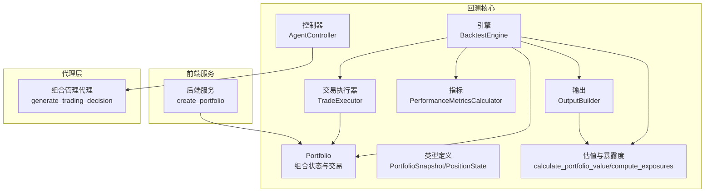
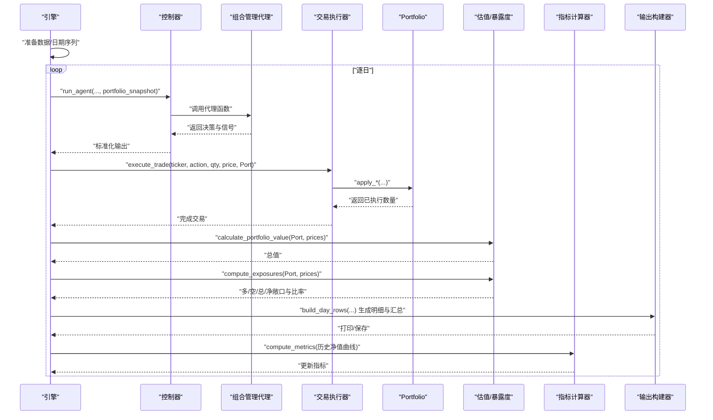
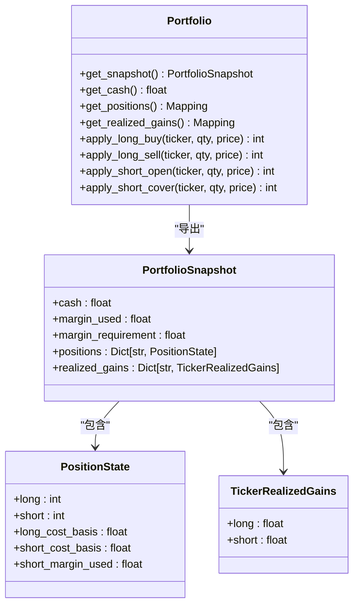
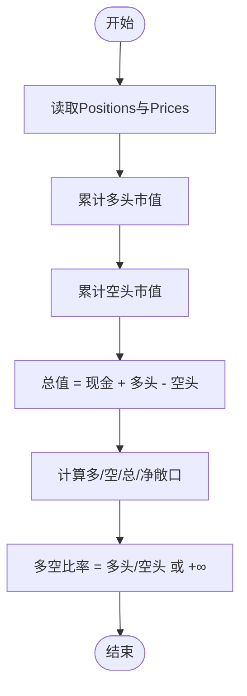
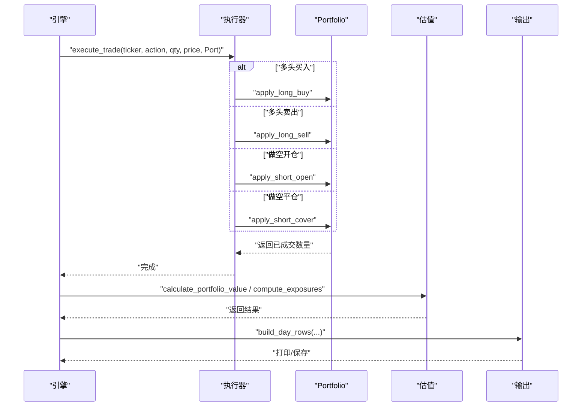
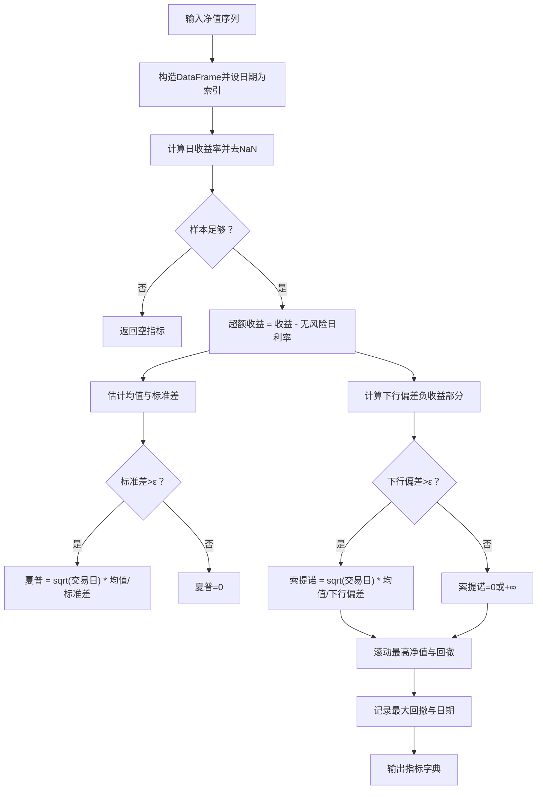
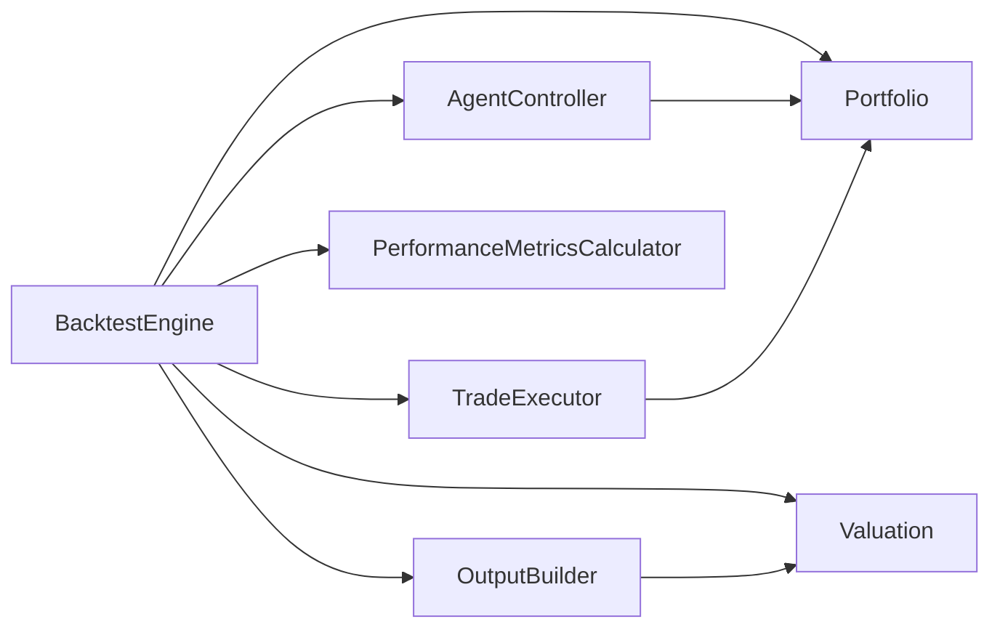

# 组合管理

<cite>
**本文引用的文件**
- [src/backtesting/portfolio.py](file://src/backtesting/portfolio.py)
- [src/backtesting/types.py](file://src/backtesting/types.py)
- [src/backtesting/valuation.py](file://src/backtesting/valuation.py)
- [src/backtesting/engine.py](file://src/backtesting/engine.py)
- [src/backtesting/controller.py](file://src/backtesting/controller.py)
- [src/backtesting/trader.py](file://src/backtesting/trader.py)
- [src/backtesting/metrics.py](file://src/backtesting/metrics.py)
- [src/backtesting/output.py](file://src/backtesting/output.py)
- [app/backend/services/portfolio.py](file://app/backend/services/portfolio.py)
- [src/agents/portfolio_manager.py](file://src/agents/portfolio_manager.py)
- [tests/backtesting/test_portfolio.py](file://tests/backtesting/test_portfolio.py)
- [tests/backtesting/test_valuation.py](file://tests/backtesting/test_valuation.py)
</cite>

## 目录
1. [简介](#简介)
2. [项目结构](#项目结构)
3. [核心组件](#核心组件)
4. [架构总览](#架构总览)
5. [详细组件分析](#详细组件分析)
6. [依赖分析](#依赖分析)
7. [性能考量](#性能考量)
8. [故障排查指南](#故障排查指南)
9. [结论](#结论)
10. [附录](#附录)

## 简介
本文件系统性阐述回测框架中的组合管理（Portfolio）设计与实现，覆盖以下主题：
- 组合状态建模：现金、多空头寸、成本基础、已实现损益与占用保证金
- 组合价值与暴露度计算：总值、多头/空头/总敞口、净敞口与多空比率
- 持仓管理与交易执行：买入/卖出、做空/平仓的算法逻辑与部分成交处理
- 风险度量：夏普比率、索提诺比率、最大回撤等指标的计算流程
- 组合快照与输出：每日快照生成、汇总行构建与打印
- 组合优化与再平衡：v2模块的优化器定位与目标权重思想
- 费用建模与最佳实践：保证金要求、可用资金与可交易规模的约束
- 配置示例、参数调优与性能监控方法

## 项目结构
围绕回测组合管理的关键文件组织如下：
- 回测核心：Portfolio、类型定义、估值与暴露度、引擎、控制器、交易执行器、指标与输出
- 前端服务：后端服务层的组合初始化与导入逻辑
- 代理层：组合管理代理负责在约束下生成交易决策
- 测试：针对Portfolio行为、估值与暴露度的单元与集成测试

图表来源
- [src/backtesting/engine.py:27-195](file://src/backtesting/engine.py#L27-L195)
- [src/backtesting/portfolio.py:9-196](file://src/backtesting/portfolio.py#L9-L196)
- [src/backtesting/valuation.py:8-83](file://src/backtesting/valuation.py#L8-L83)
- [src/backtesting/controller.py:9-68](file://src/backtesting/controller.py#L9-L68)
- [src/backtesting/trader.py:7-40](file://src/backtesting/trader.py#L7-L40)
- [src/backtesting/metrics.py:8-78](file://src/backtesting/metrics.py#L8-L78)
- [src/backtesting/output.py:11-99](file://src/backtesting/output.py#L11-L99)
- [app/backend/services/portfolio.py:6-52](file://app/backend/services/portfolio.py#L6-L52)
- [src/agents/portfolio_manager.py:25-263](file://src/agents/portfolio_manager.py#L25-L263)

章节来源
- [src/backtesting/engine.py:27-195](file://src/backtesting/engine.py#L27-L195)
- [src/backtesting/portfolio.py:9-196](file://src/backtesting/portfolio.py#L9-L196)
- [src/backtesting/valuation.py:8-83](file://src/backtesting/valuation.py#L8-L83)
- [src/backtesting/controller.py:9-68](file://src/backtesting/controller.py#L9-L68)
- [src/backtesting/trader.py:7-40](file://src/backtesting/trader.py#L7-L40)
- [src/backtesting/metrics.py:8-78](file://src/backtesting/metrics.py#L8-L78)
- [src/backtesting/output.py:11-99](file://src/backtesting/output.py#L11-L99)
- [app/backend/services/portfolio.py:6-52](file://app/backend/services/portfolio.py#L6-L52)
- [src/agents/portfolio_manager.py:25-263](file://src/agents/portfolio_manager.py#L25-L263)

## 核心组件
- Portfolio：封装组合状态（现金、多空头寸、成本基础、已实现损益、占用保证金），提供交易应用接口与快照导出
- 类型系统：定义PortfolioSnapshot、PositionState、TickerRealizedGains、PortfolioValuePoint、PerformanceMetrics等数据结构
- 估值与暴露度：计算组合总值、多/空/总/净敞口与多空比率
- 引擎：驱动回测循环，协调代理、执行器、估值、指标与输出
- 控制器与交易执行器：标准化代理输出并执行交易
- 指标计算器：计算夏普/索提诺比率与最大回撤
- 输出构建器：生成每日明细与汇总行
- 后端服务：基于输入初始化组合字典结构
- 组合管理代理：在约束条件下生成交易决策

章节来源
- [src/backtesting/portfolio.py:9-196](file://src/backtesting/portfolio.py#L9-L196)
- [src/backtesting/types.py:21-106](file://src/backtesting/types.py#L21-L106)
- [src/backtesting/valuation.py:8-83](file://src/backtesting/valuation.py#L8-L83)
- [src/backtesting/engine.py:27-195](file://src/backtesting/engine.py#L27-L195)
- [src/backtesting/controller.py:9-68](file://src/backtesting/controller.py#L9-L68)
- [src/backtesting/trader.py:7-40](file://src/backtesting/trader.py#L7-L40)
- [src/backtesting/metrics.py:8-78](file://src/backtesting/metrics.py#L8-L78)
- [src/backtesting/output.py:11-99](file://src/backtesting/output.py#L11-L99)
- [app/backend/services/portfolio.py:6-52](file://app/backend/services/portfolio.py#L6-L52)
- [src/agents/portfolio_manager.py:25-263](file://src/agents/portfolio_manager.py#L25-L263)

## 架构总览
回测引擎以“时间步进”方式运行：拉取价格数据、调用代理生成决策、执行交易、计算组合价值与暴露度、更新性能指标并输出每日明细。

图表来源
- [src/backtesting/engine.py:96-195](file://src/backtesting/engine.py#L96-L195)
- [src/backtesting/controller.py:12-68](file://src/backtesting/controller.py#L12-L68)
- [src/backtesting/trader.py:10-40](file://src/backtesting/trader.py#L10-L40)
- [src/backtesting/valuation.py:8-51](file://src/backtesting/valuation.py#L8-L51)
- [src/backtesting/metrics.py:22-78](file://src/backtesting/metrics.py#L22-L78)
- [src/backtesting/output.py:20-99](file://src/backtesting/output.py#L20-L99)
- [src/agents/portfolio_manager.py:25-263](file://src/agents/portfolio_manager.py#L25-L263)

## 详细组件分析

### 组件A：Portfolio（组合状态与交易）
- 设计要点
  - 使用不可变视图保护内部状态，通过快照导出避免外部修改
  - 支持多/空头寸与成本基础追踪；已实现损益按方向累加
  - 保证金模型：做空前按“成交金额×保证金比例”占用保证金，平仓时按比例释放
- 关键算法
  - 多头买入：按可用现金与下单量取最小，更新成本基础与现金
  - 多头卖出：按持有量与下单量取最小，计算已实现损益，更新现金与头寸
  - 做空开仓：按可用保证金（总现金-已用保证金）与下单量取最小，更新占用保证金与现金
  - 做空平仓：按持有量与下单量取最小，按比例释放占用保证金，计算已实现损益
- 复杂度与性能
  - 单次交易为O(1)，状态读写均为常数时间
  - 快照导出为浅拷贝副本，避免共享可变状态
- 错误处理与边界
  - 负或零数量直接视为不执行
  - 部分成交：当资金或保证金不足时，按可成交份额执行

图表来源
- [src/backtesting/portfolio.py:9-196](file://src/backtesting/portfolio.py#L9-L196)
- [src/backtesting/types.py:38-50](file://src/backtesting/types.py#L38-L50)

章节来源
- [src/backtesting/portfolio.py:9-196](file://src/backtesting/portfolio.py#L9-L196)
- [src/backtesting/types.py:21-50](file://src/backtesting/types.py#L21-L50)

### 组件B：组合价值与暴露度计算
- 组合总值：现金 + 多头市值 - 空头市值
- 暴露度：
  - 多头/空头/总/净敞口分别累加各标的头寸市值
  - 多空比率：多头敞口/空头敞口（空头为0时定义为无穷大）

图表来源
- [src/backtesting/valuation.py:8-51](file://src/backtesting/valuation.py#L8-L51)

章节来源
- [src/backtesting/valuation.py:8-51](file://src/backtesting/valuation.py#L8-L51)
- [tests/backtesting/test_valuation.py:4-32](file://tests/backtesting/test_valuation.py#L4-L32)

### 组件C：交易执行与引擎调度
- 执行器将动作映射到Portfolio的交易方法，统一处理BUY/SELL/SHORT/COVER/HOLD
- 引擎在每个交易日：
  - 获取当前价格
  - 调用代理控制器标准化输出
  - 对每只股票执行交易
  - 计算总值与暴露度
  - 生成每日明细与汇总行
  - 更新性能指标

图表来源
- [src/backtesting/trader.py:10-40](file://src/backtesting/trader.py#L10-L40)
- [src/backtesting/engine.py:144-181](file://src/backtesting/engine.py#L144-L181)

章节来源
- [src/backtesting/trader.py:7-40](file://src/backtesting/trader.py#L7-L40)
- [src/backtesting/engine.py:96-195](file://src/backtesting/engine.py#L96-L195)

### 组件D：性能指标计算
- 基于净值曲线计算日收益率，剔除缺失后估计夏普与索提诺比率
- 最大回撤：净值相对于滚动最高值的百分比跌幅及其发生日期

图表来源
- [src/backtesting/metrics.py:22-78](file://src/backtesting/metrics.py#L22-L78)

章节来源
- [src/backtesting/metrics.py:8-78](file://src/backtesting/metrics.py#L8-L78)

### 组件E：组合快照与输出
- 每日输出由明细行与汇总行组成，汇总行包含总值、回报率、现金余额、头寸总值及指标
- 输出构建器从Portfolio与当前价格、指标中抽取字段，格式化为表格行

章节来源
- [src/backtesting/output.py:20-99](file://src/backtesting/output.py#L20-L99)
- [src/backtesting/valuation.py:54-83](file://src/backtesting/valuation.py#L54-L83)

### 组件F：组合优化与再平衡（v2）
- v2模块定位为“目标权重与优化”，涵盖均值-方差、Marchenko-Pastur谱清洗、Black-Litterman与风险平价等方向
- 本仓库未提供具体实现细节，但为后续扩展预留了清晰的模块边界

章节来源
- [v2/portfolio/optimizer.py:1-6](file://v2/portfolio/optimizer.py#L1-L6)

### 组件G：费用建模与约束
- 保证金要求：做空前按“成交金额×保证金比例”占用保证金，平仓时按比例释放
- 可用资金：做多按“可用现金=总现金-已用保证金”衡量，做空按“可用保证金=净值/保证金比例 - 已用保证金”
- 交易限额：结合代理侧的剩余头寸上限与当前价格，计算最大可成交数量

章节来源
- [src/backtesting/portfolio.py:128-170](file://src/backtesting/portfolio.py#L128-L170)
- [src/agents/portfolio_manager.py:96-157](file://src/agents/portfolio_manager.py#L96-L157)

### 组件H：组合管理代理与再平衡规则
- 代理根据分析师信号与约束集合生成交易决策，优先保留“仅持有”的不可交易标的
- 允许动作集由当前价格、头寸、可用资金与保证金共同决定
- 再平衡：通过每日决策与交易执行实现，未见显式“固定周期再平衡”逻辑，但可通过代理策略调整实现

章节来源
- [src/agents/portfolio_manager.py:96-263](file://src/agents/portfolio_manager.py#L96-L263)

## 依赖分析
- 组件内聚与耦合
  - Portfolio高度内聚于组合状态与交易，对外仅暴露快照与查询接口
  - 引擎通过控制器与执行器解耦代理与交易实现
  - 估值与输出模块与Portfolio交互，保持纯函数风格便于测试
- 外部依赖
  - 数据获取：引擎预取价格、财务指标、内幕交易与新闻
  - 指标计算依赖pandas/numpy进行向量化运算
- 循环依赖
  - 未发现循环导入；模块间单向依赖清晰

图表来源
- [src/backtesting/engine.py:27-195](file://src/backtesting/engine.py#L27-L195)
- [src/backtesting/controller.py:9-68](file://src/backtesting/controller.py#L9-L68)
- [src/backtesting/trader.py:7-40](file://src/backtesting/trader.py#L7-L40)
- [src/backtesting/valuation.py:8-83](file://src/backtesting/valuation.py#L8-L83)
- [src/backtesting/metrics.py:8-78](file://src/backtesting/metrics.py#L8-L78)
- [src/backtesting/output.py:11-99](file://src/backtesting/output.py#L11-L99)

章节来源
- [src/backtesting/engine.py:27-195](file://src/backtesting/engine.py#L27-L195)
- [src/backtesting/controller.py:9-68](file://src/backtesting/controller.py#L9-L68)
- [src/backtesting/trader.py:7-40](file://src/backtesting/trader.py#L7-L40)
- [src/backtesting/valuation.py:8-83](file://src/backtesting/valuation.py#L8-L83)
- [src/backtesting/metrics.py:8-78](file://src/backtesting/metrics.py#L8-L78)
- [src/backtesting/output.py:11-99](file://src/backtesting/output.py#L11-L99)

## 性能考量
- 时间复杂度
  - 单日交易：O(N)，N为标的数；估值与暴露度O(N)
  - 指标计算：O(T)用于序列长度T，向量化后常数较小
- 内存与状态
  - Portfolio快照导出为浅拷贝，避免深层复制开销
  - 引擎维护每日净值点列，长期回测需关注内存占用
- 并发与I/O
  - 数据预取与API调用可能成为瓶颈，建议缓存与批量请求
- 数值稳定性
  - 指标计算对极小标准差有保护；多空比率在空头为0时返回无穷大，注意上层显示与统计

## 故障排查指南
- 常见问题
  - 部分成交：检查资金/保证金是否足以覆盖订单
  - 成本基础重置：清仓后应归零，否则可能影响已实现损益
  - 保证金释放：平仓时按比例释放，确保margin_used正确更新
- 定位方法
  - 使用测试用例验证交易路径与数值一致性
  - 在引擎中打印每日明细与汇总行，核对头寸与净值
- 相关测试
  - 交易执行与部分成交、做空占用与释放、已实现损益与成本基础重置等

章节来源
- [tests/backtesting/test_portfolio.py:7-143](file://tests/backtesting/test_portfolio.py#L7-L143)
- [tests/backtesting/test_valuation.py:1-32](file://tests/backtesting/test_valuation.py#L1-L32)

## 结论
Portfolio作为回测框架的核心，提供了稳健的组合状态管理与交易执行能力。通过明确的约束（资金/保证金）、清晰的算法（成本基础、已实现损益、保证金占用/释放）以及可测试的纯函数式估值与指标计算，该实现既满足工程落地需求，也为未来的组合优化（v2）与更复杂的费用/风控模型预留了扩展空间。

## 附录

### 组合快照生成与资产配置跟踪
- 快照导出：Portfolio提供不可变视图，便于跨模块安全传递
- 资产配置跟踪：输出构建器从Portfolio读取头寸与价格，计算头寸总值与净值构成

章节来源
- [src/backtesting/portfolio.py:44-81](file://src/backtesting/portfolio.py#L44-L81)
- [src/backtesting/output.py:20-99](file://src/backtesting/output.py#L20-L99)

### 组合优化策略与再平衡规则
- 优化策略：v2模块聚焦目标权重与优化方法（均值-方差、谱清洗、Black-Litterman、风险平价）
- 再平衡：通过每日决策与交易执行实现；可结合代理策略设定阈值触发

章节来源
- [v2/portfolio/optimizer.py:1-6](file://v2/portfolio/optimizer.py#L1-L6)
- [src/agents/portfolio_manager.py:96-263](file://src/agents/portfolio_manager.py#L96-L263)

### 费用建模与约束条件
- 保证金：做空按成交金额×保证金比例占用，平仓按比例释放
- 可用资金：做多按总现金-已用保证金，做空按净值/保证金比例-已用保证金
- 交易限额：结合剩余头寸上限与价格计算最大可成交数量

章节来源
- [src/backtesting/portfolio.py:128-170](file://src/backtesting/portfolio.py#L128-L170)
- [src/agents/portfolio_manager.py:96-157](file://src/agents/portfolio_manager.py#L96-L157)

### 组合表现分析、收益分解与风险因子识别
- 表现分析：净值曲线、夏普/索提诺比率、最大回撤
- 收益分解：通过已实现损益与未实现头寸价值分解
- 风险因子识别：暴露度（多/空/总/净敞口与多空比率）可作为因子敏感度的近似

章节来源
- [src/backtesting/metrics.py:22-78](file://src/backtesting/metrics.py#L22-L78)
- [src/backtesting/valuation.py:24-51](file://src/backtesting/valuation.py#L24-L51)

### 最佳实践与限制因素
- 最佳实践
  - 明确保证金比例与头寸上限，避免过度杠杆
  - 分批建仓/减仓，降低冲击成本
  - 定期校验快照与汇总一致性
- 限制因素
  - 价格缺失导致当日跳过
  - 指标计算需要至少两个有效收益点
  - 多空比率在空头为0时退化为无穷大

章节来源
- [src/backtesting/engine.py:114-131](file://src/backtesting/engine.py#L114-L131)
- [src/backtesting/metrics.py:26-38](file://src/backtesting/metrics.py#L26-L38)
- [src/backtesting/valuation.py:39-43](file://src/backtesting/valuation.py#L39-L43)

### 配置示例与参数调优
- 初始化参数
  - 初始资本、保证金比例、标的列表
- 参数调优建议
  - 保证金比例：根据市场波动性与监管要求设定
  - 交易限额：结合账户净值与风险预算
  - 指标窗口：根据回测频率选择合适的年化参数

章节来源
- [src/backtesting/engine.py:35-61](file://src/backtesting/engine.py#L35-L61)
- [src/backtesting/metrics.py:11-13](file://src/backtesting/metrics.py#L11-L13)

### 性能监控方法
- 日常监控
  - 每日明细核对：头寸、成交数量、净值与指标
  - 快照一致性：前后两次快照相等性检查
- 回测监控
  - 指标稳定性：观察夏普/索提诺随时间变化
  - 暴露度监控：多/空/净敞口与多空比率异常波动预警

章节来源
- [src/backtesting/output.py:20-99](file://src/backtesting/output.py#L20-L99)
- [src/backtesting/metrics.py:22-78](file://src/backtesting/metrics.py#L22-L78)
- [src/backtesting/valuation.py:24-51](file://src/backtesting/valuation.py#L24-L51)